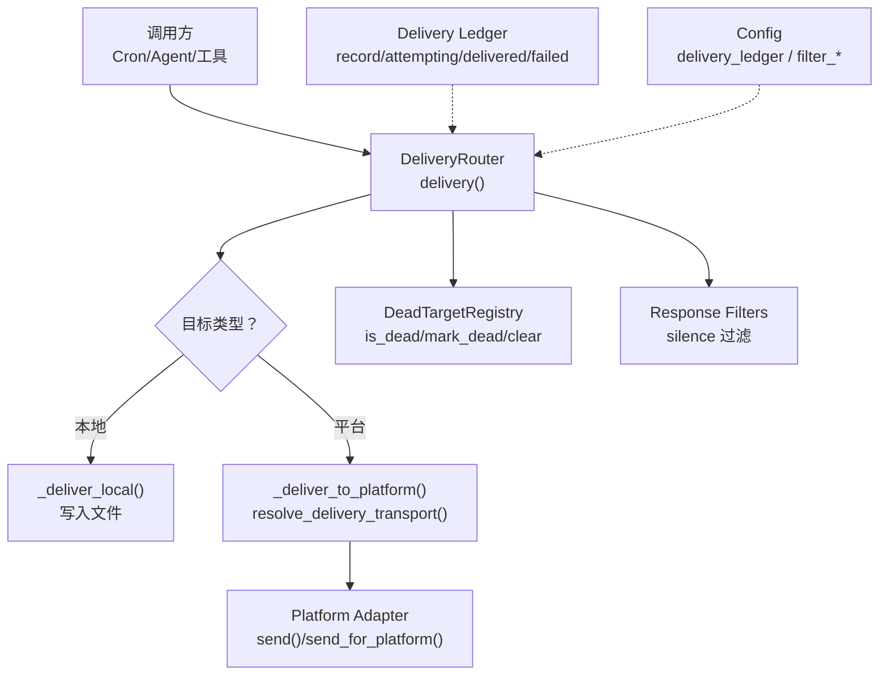
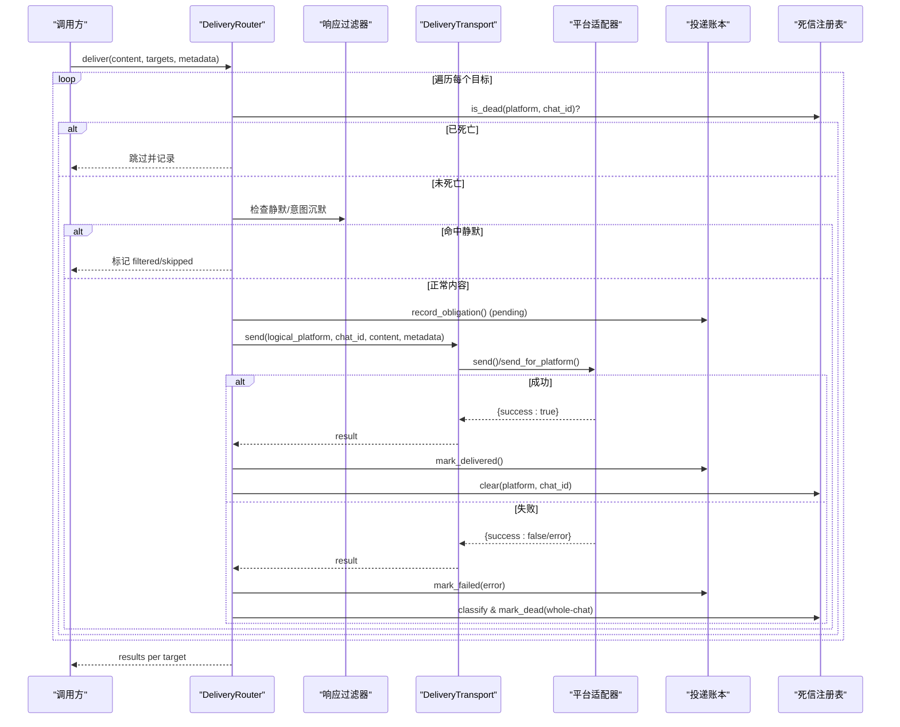
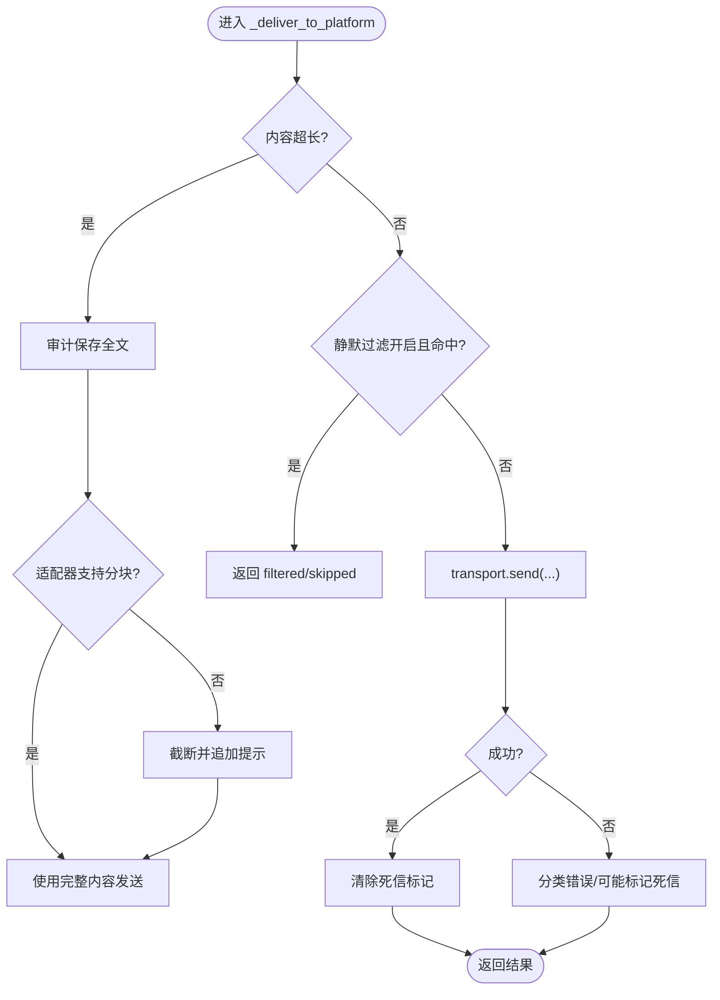
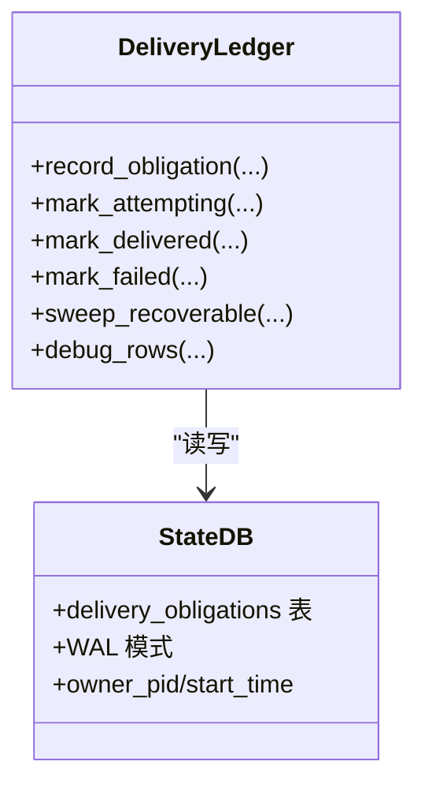
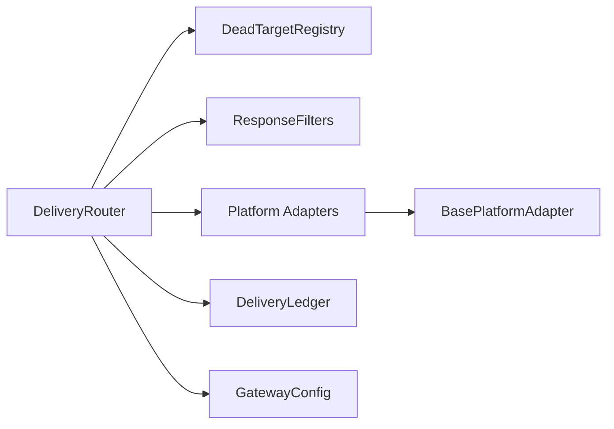

# 消息投递系统

<cite>
**本文引用的文件**
- [gateway/delivery.py](file://gateway/delivery.py)
- [gateway/delivery_ledger.py](file://gateway/delivery_ledger.py)
- [gateway/response_filters.py](file://gateway/response_filters.py)
- [gateway/dead_targets.py](file://gateway/dead_targets.py)
- [gateway/platforms/base.py](file://gateway/platforms/base.py)
- [gateway/config.py](file://gateway/config.py)
</cite>

## 目录
1. [简介](#简介)
2. [项目结构](#项目结构)
3. [核心组件](#核心组件)
4. [架构总览](#架构总览)
5. [详细组件分析](#详细组件分析)
6. [依赖关系分析](#依赖关系分析)
7. [性能与并发](#性能与并发)
8. [故障排查指南](#故障排查指南)
9. [结论](#结论)
10. [附录：配置最佳实践](#附录：配置最佳实践)

## 简介
本文件面向 Hermes 网关的消息投递子系统，系统性说明从“目标选择、格式适配、发送执行到状态跟踪”的完整流程，覆盖投递队列管理、失败重试机制、批量发送优化、并发控制策略，以及投递账本的持久化记录、状态同步与故障恢复。同时解释响应过滤器的工作原理（如何过滤/修改输出），并给出投递配置的最佳实践（超时、重试、监控告警）。

## 项目结构
Hermes 的消息投递由以下关键模块协作完成：
- 路由与投递：gateway/delivery.py
- 投递账本（持久化）：gateway/delivery_ledger.py
- 响应过滤：gateway/response_filters.py
- 死信目标注册表：gateway/dead_targets.py
- 平台适配器基类与通用能力：gateway/platforms/base.py
- 配置解析与开关：gateway/config.py

图表来源
- [gateway/delivery.py:318-391](file://gateway/delivery.py#L318-L391)
- [gateway/delivery.py:460-642](file://gateway/delivery.py#L460-L642)
- [gateway/delivery_ledger.py:188-234](file://gateway/delivery_ledger.py#L188-L234)
- [gateway/dead_targets.py:48-144](file://gateway/dead_targets.py#L48-L144)
- [gateway/response_filters.py:56-111](file://gateway/response_filters.py#L56-L111)
- [gateway/config.py:339-352](file://gateway/config.py#L339-L352)

章节来源
- [gateway/delivery.py:1-647](file://gateway/delivery.py#L1-L647)
- [gateway/delivery_ledger.py:1-375](file://gateway/delivery_ledger.py#L1-L375)
- [gateway/response_filters.py:1-148](file://gateway/response_filters.py#L1-L148)
- [gateway/dead_targets.py:1-144](file://gateway/dead_targets.py#L1-L144)
- [gateway/platforms/base.py:1-800](file://gateway/platforms/base.py#L1-L800)
- [gateway/config.py:1-200](file://gateway/config.py#L1-L200)

## 核心组件
- DeliveryRouter：负责将消息投递到多个目标（origin/local/具体平台+聊天ID/线程ID），处理大小裁剪、静默内容过滤、死信目标短路、错误分类与标记。
- DeliveryTransport：封装对原生适配器或 Relay 的统一发送接口，保留逻辑平台上下文。
- DeadTargetRegistry：持久化的“已确认不可达目标”集合，避免对已删除群组/被封禁机器人等重复投递。
- Delivery Ledger：基于 SQLite 的投递义务登记簿，保证最终响应在崩溃/重启后仍可恢复投递，提供幂等去重与可见的重投标记。
- Response Filters：在网关边界判断是否应投递（如模型返回的“有意沉默”标记），支持流式场景的中间态判定。
- Platform Base：平台适配器的公共能力（代理、媒体、长度限制、TTS、回复锚点等），为各平台实现提供统一契约。

章节来源
- [gateway/delivery.py:62-131](file://gateway/delivery.py#L62-L131)
- [gateway/delivery.py:213-391](file://gateway/delivery.py#L213-L391)
- [gateway/delivery_ledger.py:1-375](file://gateway/delivery_ledger.py#L1-L375)
- [gateway/response_filters.py:1-148](file://gateway/response_filters.py#L1-L148)
- [gateway/dead_targets.py:1-144](file://gateway/dead_targets.py#L1-L144)
- [gateway/platforms/base.py:1-800](file://gateway/platforms/base.py#L1-L800)

## 架构总览
下图展示一次典型的消息投递序列：从路由、过滤、传输到状态落盘与恢复。

图表来源
- [gateway/delivery.py:318-391](file://gateway/delivery.py#L318-L391)
- [gateway/delivery.py:460-642](file://gateway/delivery.py#L460-L642)
- [gateway/delivery_ledger.py:188-234](file://gateway/delivery_ledger.py#L188-L234)
- [gateway/dead_targets.py:93-144](file://gateway/dead_targets.py#L93-L144)
- [gateway/response_filters.py:56-111](file://gateway/response_filters.py#L56-L111)

## 详细组件分析

### 目标选择与路由（DeliveryRouter）
- 目标解析：支持 origin/local/平台名/平台:chat_id[:thread_id] 多种语法，自动回退到本地存储。
- 本地投递：按 job_id 或 misc 目录写入 Markdown 摘要，附带时间戳与元数据。
- 平台投递：
  - 解析传输层：优先原生适配器；若禁用则尝试 Relay（需声明 fronts_platform）。
  - 超大内容审计保存：超过阈值时先保存全文，再根据适配器是否支持分块决定是否截断。
  - 静默内容拦截：可配置的静默叙述过滤，防止 bot-to-bot 循环。
  - 线程/话题：Telegram 私聊主题创建与刷新、reply anchor 处理。
  - 结果处理：成功则清除死信标记；失败则分类错误并可能标记整群死亡。

图表来源
- [gateway/delivery.py:460-642](file://gateway/delivery.py#L460-L642)
- [gateway/delivery.py:439-544](file://gateway/delivery.py#L439-L544)

章节来源
- [gateway/delivery.py:213-391](file://gateway/delivery.py#L213-L391)
- [gateway/delivery.py:460-642](file://gateway/delivery.py#L460-L642)

### 传输层与平台适配（DeliveryTransport + Base）
- DeliveryTransport 屏蔽原生适配器与 Relay 的差异，保持逻辑平台上下文。
- Base 平台适配器提供：
  - 代理与网络访问检测、NO_PROXY 匹配
  - 媒体与音频格式判定、TTS 路径生成
  - UTF-16 长度限制与截断工具（适配 Telegram 4096 限制）
  - 回复锚点与线程元数据构建
  - 连接重试契约（connect(is_reconnect)）

章节来源
- [gateway/delivery.py:62-131](file://gateway/delivery.py#L62-L131)
- [gateway/platforms/base.py:1-800](file://gateway/platforms/base.py#L1-L800)

### 投递账本（Delivery Ledger）
- 作用：确保“已生成但未确认送达的最终响应”不丢失，支持崩溃恢复与幂等重投。
- 生命周期：
  - record_obligation：state=pending，携带 session_key/platform/chat_id/thread_id/content
  - mark_attempting：state=attempting，即将发起发送
  - mark_delivered：state=delivered，成功送达
  - mark_failed：state=failed，明确拒绝
- 恢复：
  - sweep_recoverable：扫描 pending/attempting/failed 且所有者进程死亡的行，限制平台白名单，超限/过期转 abandoned，返回待重投项
  - 可见重投标记：attempting/failed 重投会附加“Recovered reply”前缀，诚实至少一次
- 资源治理：WAL 兼容、进程存活探测、最大行数与保留期清理

图表来源
- [gateway/delivery_ledger.py:74-113](file://gateway/delivery_ledger.py#L74-L113)
- [gateway/delivery_ledger.py:179-234](file://gateway/delivery_ledger.py#L179-L234)
- [gateway/delivery_ledger.py:236-306](file://gateway/delivery_ledger.py#L236-L306)
- [gateway/delivery_ledger.py:309-337](file://gateway/delivery_ledger.py#L309-L337)

章节来源
- [gateway/delivery_ledger.py:1-375](file://gateway/delivery_ledger.py#L1-L375)

### 响应过滤器（Response Filters）
- 交互通道：is_intentional_silence_response 精确匹配“完全等于沉默标记”的响应，避免误杀正文。
- 自主通道（cron/webhook）：is_autonomous_silence_response 宽松匹配首尾行或前缀形式的沉默标记。
- 流式场景：is_partial_silence_marker 在累积过程中延迟显示，直到确定不是沉默标记才输出。
- 与投递的关系：在 delivery 层进行静默叙述过滤，防止无意义内容触发平台侧循环。

章节来源
- [gateway/response_filters.py:1-148](file://gateway/response_filters.py#L1-L148)
- [gateway/delivery.py:448-544](file://gateway/delivery.py#L448-L544)

### 死信目标注册表（DeadTargetRegistry）
- 目的：对整群级永久不可达（forbidden/not_found）的目标快速短路，避免浪费配额与刷屏日志。
- 自愈合：任何一次成功发送都会清除该目标的死信标记。
- 持久化：JSON 文件，读写失败降级为内存态，不影响投递。

章节来源
- [gateway/dead_targets.py:1-144](file://gateway/dead_targets.py#L1-L144)
- [gateway/delivery.py:341-391](file://gateway/delivery.py#L341-L391)

## 依赖关系分析
- DeliveryRouter 依赖：
  - DeadTargetRegistry：短路已知不可达目标
  - response_filters：静默内容过滤
  - platform adapters：实际发送
  - delivery_ledger：可选但推荐的持久化保障
- Platform Base 提供跨平台通用能力，降低各平台实现复杂度
- Config 提供功能开关（如 delivery_ledger、filter_silence_narration）

图表来源
- [gateway/delivery.py:318-391](file://gateway/delivery.py#L318-L391)
- [gateway/delivery.py:460-642](file://gateway/delivery.py#L460-L642)
- [gateway/platforms/base.py:1-800](file://gateway/platforms/base.py#L1-L800)
- [gateway/config.py:339-352](file://gateway/config.py#L339-L352)

章节来源
- [gateway/delivery.py:1-647](file://gateway/delivery.py#L1-L647)
- [gateway/platforms/base.py:1-800](file://gateway/platforms/base.py#L1-L800)
- [gateway/config.py:1-200](file://gateway/config.py#L1-L200)

## 性能与并发
- 批量发送优化
  - 大内容审计保存与分块：对不支持分块的适配器进行截断并附注全文路径；支持分块的适配器直接传递完整内容，减少多次往返。
  - 死信短路：避免对已死亡目标反复请求，节省配额与带宽。
- 并发控制策略
  - 平台适配器层通常以异步方式调用外部 API；建议在上层（调用方）对同一 chat_id 的并发度做限流，避免触发平台速率限制。
  - 对于高吞吐场景，可在调用 DeliveryRouter.deliver 时使用任务队列（如 asyncio.Semaphore 或工作池）限制并发数。
- 超时与重试
  - 平台适配器自身实现连接/请求超时与重试；建议在调用处设置合理的整体超时，并在失败时结合 dead_targets 与 ledger 进行恢复。
  - 对瞬时错误采用指数退避重试；对整群级错误立即标记死信并停止重试。

[本节为通用指导，不直接分析具体文件]

## 故障排查指南
- 无法送达但未见异常
  - 检查 DeadTargetRegistry：是否被标记为不可达；若有，确认是否近期有成功发送以清除标记。
  - 检查 delivery_ledger：是否存在 pending/attempting/failed 的遗留条目；必要时手动清理或等待 sweep 回收。
- 内容被静默过滤
  - 确认是否命中静默叙述过滤；可通过环境变量或配置关闭/调整。
- 平台特定问题
  - Telegram 私聊主题：确认 ensure_dm_topic 可用，或提供 reply_to_message_id 作为锚点。
  - 长消息：确认适配器是否支持分块；否则会被截断并保存全文。
- 监控与观测
  - 通过 delivery_ledger.debug_rows 查看最近条目
  - 关注日志中的 dead_target 跳过、审计保存、截断与错误分类信息

章节来源
- [gateway/dead_targets.py:93-144](file://gateway/dead_targets.py#L93-L144)
- [gateway/delivery_ledger.py:339-375](file://gateway/delivery_ledger.py#L339-L375)
- [gateway/delivery.py:341-391](file://gateway/delivery.py#L341-L391)
- [gateway/delivery.py:460-642](file://gateway/delivery.py#L460-L642)

## 结论
Hermes 的消息投递系统在“目标选择—格式适配—发送执行—状态跟踪”全链路提供了健壮的实现：通过 DeliveryRouter 统一调度，配合 DeadTargetRegistry 短路不可达目标、Response Filters 抑制无意义输出、Delivery Ledger 保证崩溃恢复与幂等重投，并以 Base 平台适配器抽象出跨平台通用能力。生产部署中建议结合合适的并发控制、超时与重试策略，以及完善的监控告警，以获得高可靠与高吞吐的投递体验。

[本节为总结性内容，不直接分析具体文件]

## 附录：配置最佳实践
- 投递账本
  - 默认开启；如需关闭可设置 gateway.delivery_ledger=false。
  - 建议在生产环境保持开启，以便崩溃恢复与审计。
- 静默过滤
  - 可通过 HERMES_FILTER_SILENCE_NARRATION 或 gateway.filter_silence_narration 控制。
  - 在 bot-to-bot 场景中建议开启，避免循环。
- 超时与重试
  - 平台适配器内部实现超时与重试；建议在调用方设置合理的全局超时，并对瞬时错误采用指数退避。
  - 对整群级错误（forbidden/not_found）立即标记死信，不再重试。
- 监控告警
  - 定期导出 delivery_ledger 的 debug_rows，观察 pending/attempting/failed 比例。
  - 对 dead_targets 数量突增设置告警，及时排查群组/用户状态变化。
  - 关注日志中的截断与审计保存事件，评估是否需要启用支持分块的适配器。

章节来源
- [gateway/config.py:339-352](file://gateway/config.py#L339-L352)
- [gateway/delivery.py:448-544](file://gateway/delivery.py#L448-L544)
- [gateway/delivery_ledger.py:339-375](file://gateway/delivery_ledger.py#L339-L375)
- [gateway/dead_targets.py:93-144](file://gateway/dead_targets.py#L93-L144)