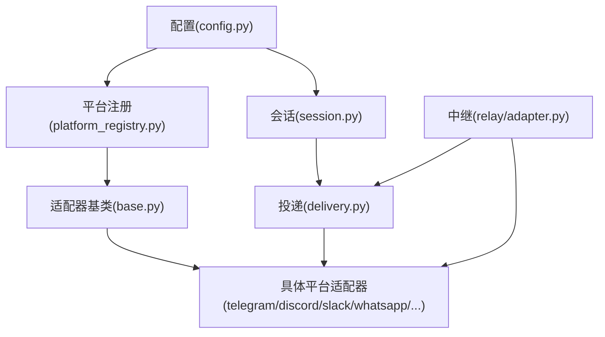
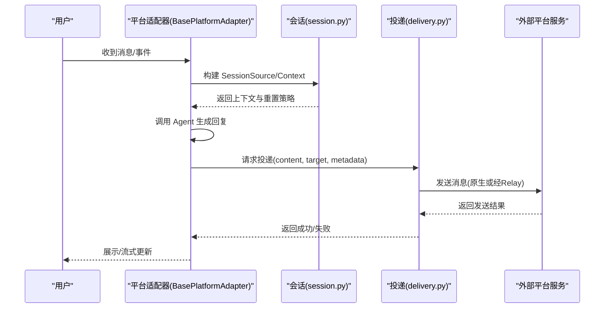
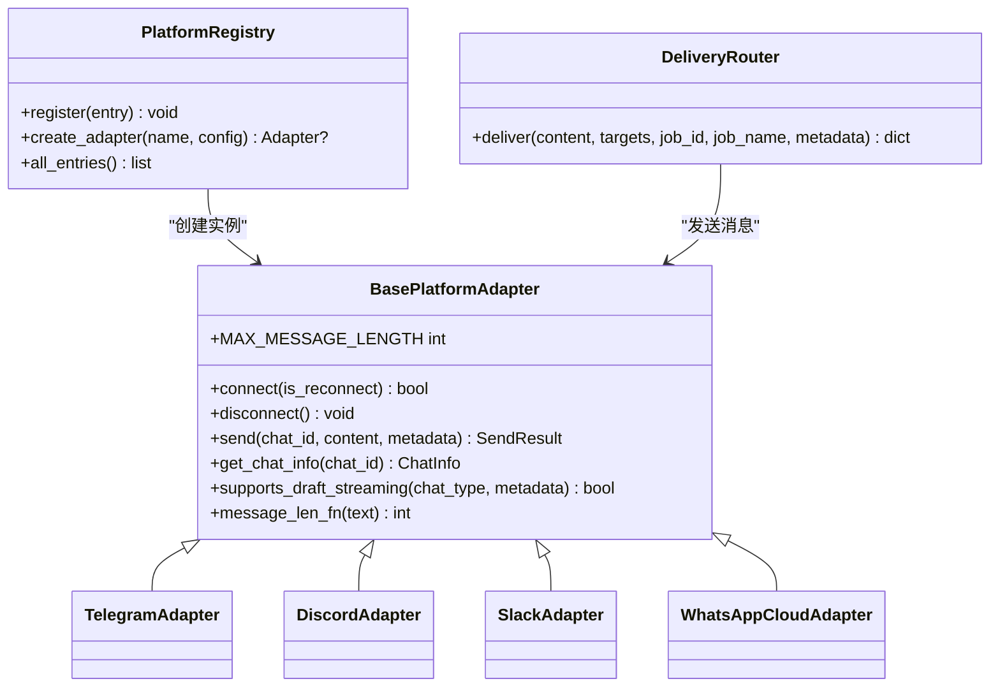
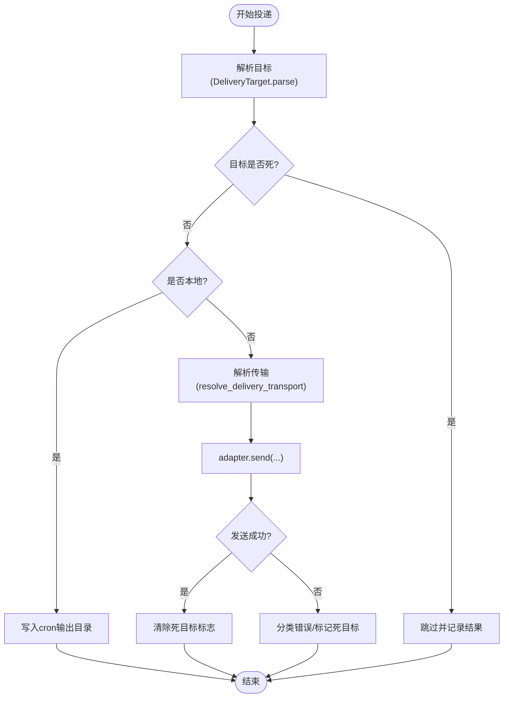
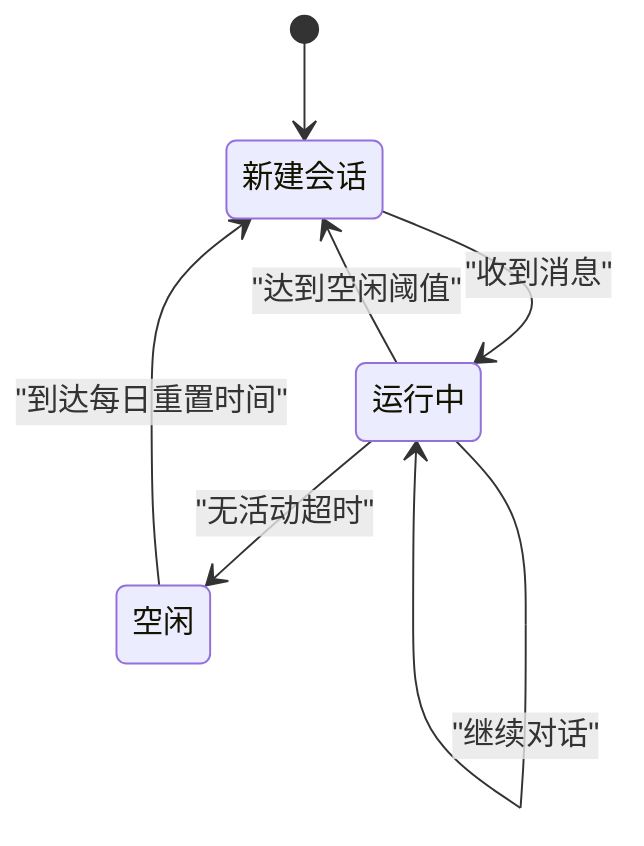
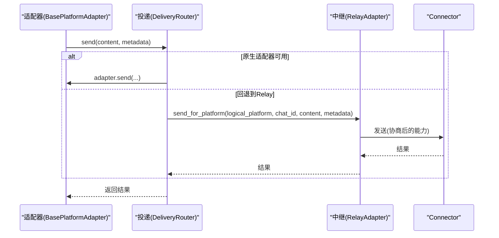
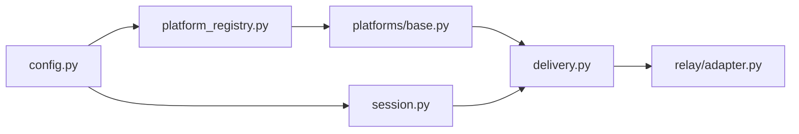

# 消息网关架构

<cite>
**本文引用的文件**
- [gateway/config.py](file://gateway/config.py)
- [gateway/platform_registry.py](file://gateway/platform_registry.py)
- [gateway/platforms/base.py](file://gateway/platforms/base.py)
- [gateway/session.py](file://gateway/session.py)
- [gateway/delivery.py](file://gateway/delivery.py)
- [gateway/relay/adapter.py](file://gateway/relay/adapter.py)
</cite>

## 目录
1. [简介](#简介)
2. [项目结构](#项目结构)
3. [核心组件](#核心组件)
4. [架构总览](#架构总览)
5. [详细组件分析](#详细组件分析)
6. [依赖关系分析](#依赖关系分析)
7. [性能考量](#性能考量)
8. [故障排查指南](#故障排查指南)
9. [结论](#结论)
10. [附录](#附录)

## 简介
本文件系统性阐述 Hermes 消息网关的架构与实现，重点覆盖：
- 平台适配器模式与多平台支持（Telegram、Discord、Slack、WhatsApp、Signal、Weixin、BlueBubbles、Yuanbao、QQBot、Webhook、API Server、Relay 等）
- 消息路由机制与投递系统（DeliveryRouter、DeliveryTransport、DeadTarget 管理）
- 会话生命周期管理（SessionSource、SessionContext、HomeChannel、SessionResetPolicy）
- 消息格式转换与协议适配（BasePlatformAdapter 抽象、长度单位与流式编辑、媒体处理）
- 错误重试与死目标治理、性能优化策略（流式传输、代理与限速、入站媒体上限）
- 配置项与监控指标说明
- 自定义平台适配器开发指南与测试方法

## 项目结构
网关的核心位于 gateway 目录，围绕“配置—注册—适配器—会话—投递—中继”分层组织：
- 配置层：统一加载与校验平台配置、会话重置策略、流式传输参数等
- 注册层：平台适配器注册表，支持内置与插件动态发现与懒加载
- 适配层：BasePlatformAdapter 抽象及具体平台实现，负责协议适配、消息收发、流式更新、媒体处理
- 会话层：会话来源、上下文、持久化键、重置策略与系统提示注入
- 投递层：将结果或定时任务输出路由到指定平台或本地文件，含死目标治理
- 中继层：通过 RelayAdapter 以单一逻辑平台对接 Connector，屏蔽底层多平台差异

图表来源
- [gateway/config.py:272-418](file://gateway/config.py#L272-L418)
- [gateway/platform_registry.py:183-382](file://gateway/platform_registry.py#L183-L382)
- [gateway/platforms/base.py:1-120](file://gateway/platforms/base.py#L1-L120)
- [gateway/session.py:148-347](file://gateway/session.py#L148-L347)
- [gateway/delivery.py:62-132](file://gateway/delivery.py#L62-L132)
- [gateway/relay/adapter.py:55-216](file://gateway/relay/adapter.py#L55-L216)

章节来源
- [gateway/config.py:272-418](file://gateway/config.py#L272-L418)
- [gateway/platform_registry.py:183-382](file://gateway/platform_registry.py#L183-L382)
- [gateway/platforms/base.py:1-120](file://gateway/platforms/base.py#L1-L120)
- [gateway/session.py:148-347](file://gateway/session.py#L148-L347)
- [gateway/delivery.py:62-132](file://gateway/delivery.py#L62-L132)
- [gateway/relay/adapter.py:55-216](file://gateway/relay/adapter.py#L55-L216)

## 核心组件
- 平台枚举与端口绑定策略：集中声明支持的平台值与是否绑定监听端口，避免多实例冲突
- 平台配置模型：enabled、token/api_key、home_channel、reply_to_mode、typing_indicator、channel_overrides、extra
- 平台注册表：统一注册、依赖探测、按需安装、配置校验、工厂创建适配器
- 适配器基类：定义连接/断开/发送/获取聊天信息、流式 TTS、代理、媒体大小限制、线程元数据等通用能力
- 会话模型：来源、上下文、重置策略、PII 脱敏、系统提示注入
- 投递系统：解析目标、选择传输（原生或 Relay）、截断与审计保存、静默叙述过滤、死目标治理
- 中继适配器：单逻辑平台对接 Connector，协商能力描述符，透传事件与能力

章节来源
- [gateway/config.py:272-418](file://gateway/config.py#L272-L418)
- [gateway/config.py:593-707](file://gateway/config.py#L593-L707)
- [gateway/platform_registry.py:38-181](file://gateway/platform_registry.py#L38-L181)
- [gateway/platforms/base.py:570-800](file://gateway/platforms/base.py#L570-L800)
- [gateway/session.py:148-347](file://gateway/session.py#L148-L347)
- [gateway/delivery.py:213-391](file://gateway/delivery.py#L213-L391)
- [gateway/relay/adapter.py:55-216](file://gateway/relay/adapter.py#L55-L216)

## 架构总览
Hermes 网关采用“平台适配器 + 注册表 + 投递路由 + 会话管理 + 可选中继”的分层架构。所有平台通过统一的 BasePlatformAdapter 接口接入；配置层提供平台开关、凭据、默认频道与行为选项；注册表负责依赖检查与适配器实例化；会话层维护来源与上下文并注入系统提示；投递层将结果或定时任务输出路由到目标平台或本地；当使用 Relay 时，通过单一逻辑平台对接 Connector，屏蔽多平台差异。

图表来源
- [gateway/platforms/base.py:78-150](file://gateway/platforms/base.py#L78-L150)
- [gateway/session.py:479-745](file://gateway/session.py#L479-L745)
- [gateway/delivery.py:318-391](file://gateway/delivery.py#L318-L391)
- [gateway/relay/adapter.py:217-273](file://gateway/relay/adapter.py#L217-L273)

## 详细组件分析

### 平台适配器模式与多平台支持
- 适配器基类定义了 connect/disconnect/send/get_chat_info 等抽象方法，并提供通用能力：
  - 线程元数据构建（thread_id、reply_to_message_id、direct_messages_topic_id）
  - 音频/语音格式判定与自动 TTS 路径
  - 代理解析与 NO_PROXY 匹配
  - 入站媒体大小限制与缓存
- 各平台通过继承基类实现协议细节（如 Telegram 的 draft/edit 流式、Discord 的线程与交互、Slack 的工作区 scope、WhatsApp Cloud 的 webhook 等）
- 平台枚举集中声明支持的平台值，便于配置与诊断

图表来源
- [gateway/platforms/base.py:1-120](file://gateway/platforms/base.py#L1-L120)
- [gateway/platform_registry.py:183-382](file://gateway/platform_registry.py#L183-L382)
- [gateway/delivery.py:294-391](file://gateway/delivery.py#L294-L391)

章节来源
- [gateway/platforms/base.py:1-120](file://gateway/platforms/base.py#L1-L120)
- [gateway/platform_registry.py:183-382](file://gateway/platform_registry.py#L183-L382)
- [gateway/delivery.py:294-391](file://gateway/delivery.py#L294-L391)

### 消息路由与投递系统
- DeliveryTarget 解析目标字符串，支持 origin/local/平台名/平台:chat_id:thread_id
- DeliveryRouter.deliver 遍历目标，跳过已确认的死目标，执行本地文件或平台发送
- resolve_delivery_transport 优先选择原生适配器，否则回退到 Relay（需 fronts_platform 为真）
- 对超长 cron 输出进行审计保存与截断，非分块适配器会附加完整输出路径
- 静默叙述过滤防止 bot-to-bot 循环

图表来源
- [gateway/delivery.py:213-391](file://gateway/delivery.py#L213-L391)
- [gateway/delivery.py:460-642](file://gateway/delivery.py#L460-L642)

章节来源
- [gateway/delivery.py:213-391](file://gateway/delivery.py#L213-L391)
- [gateway/delivery.py:460-642](file://gateway/delivery.py#L460-L642)

### 会话生命周期管理
- SessionSource 描述消息来源（平台、聊天类型、用户、线程、scope_id 等），用于路由与系统提示注入
- SessionContext 聚合来源、已连接平台、HomeChannel 列表，并携带 session_key/id 与时间戳
- SessionResetPolicy 控制会话重置（daily/idle/both/none），支持通知与后台进程老化阈值
- HomeChannel 作为默认投递目的地，支持 thread_id 与认证身份元数据
- build_session_context_prompt 根据平台特性注入行为提示（如 Slack/Discord 工具可用性、Matrix 房间边界、iMessage 短消息风格等）

图表来源
- [gateway/session.py:148-347](file://gateway/session.py#L148-L347)
- [gateway/config.py:485-540](file://gateway/config.py#L485-L540)

章节来源
- [gateway/session.py:148-347](file://gateway/session.py#L148-L347)
- [gateway/config.py:485-540](file://gateway/config.py#L485-L540)

### 消息格式转换与协议适配
- BasePlatformAdapter 提供线程元数据构建、音频格式判定、代理解析、入站媒体大小限制等通用逻辑
- 长度单位与截断：支持 chars/utf16 两种长度度量，适配 Telegram 的 UTF-16 限制
- 流式传输：支持 draft/edit 两种模式，auto 优先使用平台原生草稿（如 Telegram Bot API 9.5+），否则回退 edit
- 中继适配器：通过 CapabilityDescriptor 协商消息长度、Markdown 能力、是否支持草稿流式等，并在 per-chat 维度解析能力

图表来源
- [gateway/platforms/base.py:78-150](file://gateway/platforms/base.py#L78-L150)
- [gateway/delivery.py:92-132](file://gateway/delivery.py#L92-L132)
- [gateway/relay/adapter.py:217-273](file://gateway/relay/adapter.py#L217-L273)

章节来源
- [gateway/platforms/base.py:78-150](file://gateway/platforms/base.py#L78-L150)
- [gateway/delivery.py:92-132](file://gateway/delivery.py#L92-L132)
- [gateway/relay/adapter.py:217-273](file://gateway/relay/adapter.py#L217-L273)

### 错误重试与死目标治理
- DeadTargetRegistry 记录已确认不可达的目标（删除群组、被踢/拉黑、停用账号等），后续投递直接跳过，减少无效请求
- 投递异常文本分类为 error_kind，仅整聊天级 not_found 才标记死目标，论坛主题/消息级失效不污染整个聊天
- 成功发送后清除死目标标志，支持自愈
- 中继适配器在握手失败或认证撤销时上报致命错误，停止重试

章节来源
- [gateway/delivery.py:160-210](file://gateway/delivery.py#L160-L210)
- [gateway/delivery.py:318-391](file://gateway/delivery.py#L318-L391)
- [gateway/relay/adapter.py:275-320](file://gateway/relay/adapter.py#L275-L320)

### 性能优化策略
- 流式传输：draft/edit 模式降低延迟，edit_interval/buffer_threshold/cursor 可调
- 入站媒体大小限制：默认 128 MiB，可配置，防止大文件 OOM
- 代理与 NO_PROXY：自动检测 macOS 系统代理，支持 SOCKS/HTTP，按主机/端口/CIDR 匹配绕过
- 长消息处理：非分块适配器截断并保留完整输出审计文件；分块适配器原生拆分
- 中继能力协商：per-chat 能力解析，避免跨平台长度限制导致的失败

章节来源
- [gateway/config.py:720-800](file://gateway/config.py#L720-L800)
- [gateway/platforms/base.py:722-800](file://gateway/platforms/base.py#L722-L800)
- [gateway/platforms/base.py:417-516](file://gateway/platforms/base.py#L417-L516)
- [gateway/delivery.py:460-544](file://gateway/delivery.py#L460-L544)
- [gateway/relay/adapter.py:174-208](file://gateway/relay/adapter.py#L174-L208)

## 依赖关系分析
- 配置依赖：Platform 枚举、PlatformConfig、GatewayConfig、SessionResetPolicy、HomeChannel
- 注册表依赖：PlatformEntry（check_fn/ensure_deps_fn/validate_config/adapter_factory）
- 适配器依赖：BasePlatformAdapter（线程元数据、代理、媒体限制、流式 TTS）
- 会话依赖：SessionSource、SessionContext、build_session_context_prompt
- 投递依赖：DeliveryTarget、DeliveryRouter、resolve_delivery_transport、DeadTargetRegistry
- 中继依赖：RelayAdapter、CapabilityDescriptor、RelayTransport

图表来源
- [gateway/config.py:272-418](file://gateway/config.py#L272-L418)
- [gateway/platform_registry.py:183-382](file://gateway/platform_registry.py#L183-L382)
- [gateway/platforms/base.py:1-120](file://gateway/platforms/base.py#L1-L120)
- [gateway/session.py:148-347](file://gateway/session.py#L148-L347)
- [gateway/delivery.py:294-391](file://gateway/delivery.py#L294-L391)
- [gateway/relay/adapter.py:55-216](file://gateway/relay/adapter.py#L55-L216)

章节来源
- [gateway/config.py:272-418](file://gateway/config.py#L272-L418)
- [gateway/platform_registry.py:183-382](file://gateway/platform_registry.py#L183-L382)
- [gateway/platforms/base.py:1-120](file://gateway/platforms/base.py#L1-L120)
- [gateway/session.py:148-347](file://gateway/session.py#L148-L347)
- [gateway/delivery.py:294-391](file://gateway/delivery.py#L294-L391)
- [gateway/relay/adapter.py:55-216](file://gateway/relay/adapter.py#L55-L216)

## 性能考量
- 流式编辑间隔与缓冲阈值：默认 edit_interval=0.8s、buffer_threshold=24，适合 Telegram 的 ~1 edit/s 速率
- 入站媒体上限：默认 128 MiB，可通过配置调整，防止内存峰值
- 代理与 NO_PROXY：自动识别系统代理并按规则绕过，提升连通性与稳定性
- 长消息审计与截断：确保可恢复性且不阻塞投递
- 中继能力协商：按聊天维度应用平台限制，避免不必要的失败

[本节为通用指导，无需特定文件引用]

## 故障排查指南
- 平台依赖缺失：注册表 check_fn 失败且 ensure_deps_fn 未安装或失败，查看日志中的 install_hint
- 配置校验失败：validate_config 返回 False 或抛出异常，检查 extra 字段与环境变量
- 死目标频繁：检查错误文本分类与 is_chat_level_not_found，确认是否为整聊天级失效
- 中继握手失败：查看 handshake 异常与 auth_revoked 监控，必要时重建实例
- 流式显示异常：确认 transport 模式（auto/draft/edit/off）与平台支持情况

章节来源
- [gateway/platform_registry.py:299-377](file://gateway/platform_registry.py#L299-L377)
- [gateway/delivery.py:160-210](file://gateway/delivery.py#L160-L210)
- [gateway/relay/adapter.py:217-273](file://gateway/relay/adapter.py#L217-L273)
- [gateway/relay/adapter.py:275-320](file://gateway/relay/adapter.py#L275-L320)

## 结论
Hermes 消息网关通过平台适配器模式与注册表机制，实现了多平台的统一接入与灵活扩展；借助会话管理与投递路由，保障了消息的正确流转与可恢复性；结合流式传输、代理与媒体限制等优化手段，提升了用户体验与系统稳定性；Relay 适配器进一步简化了多平台托管场景下的集成复杂度。开发者可基于现有框架快速添加新平台，并通过配置与监控指标持续优化运行效果。

[本节为总结，无需特定文件引用]

## 附录

### 配置示例与选项
- 平台启用与凭据：在 platforms.<name>.enabled 与 token/api_key 中配置
- 默认频道：platforms.<name>.home_channel 设置默认投递目标
- 回复线程模式：reply_to_mode（off/first/all）
- 状态指示器：typing_indicator、typing_status_text
- 通道覆盖：channel_overrides 针对特定 channel_id 设置 model/provider/system_prompt
- 流式传输：streaming.enabled、transport（auto/draft/edit/off）、edit_interval、buffer_threshold、cursor、fresh_final_after_seconds
- 会话重置：session_reset.mode（daily/idle/both/none）、at_hour、idle_minutes、notify、notify_exclude_platforms、bg_process_max_age_hours
- 入站媒体上限：gateway.max_inbound_media_bytes

章节来源
- [gateway/config.py:593-707](file://gateway/config.py#L593-L707)
- [gateway/config.py:720-800](file://gateway/config.py#L720-L800)
- [gateway/config.py:485-540](file://gateway/config.py#L485-L540)

### 自定义平台适配器开发指南
- 注册入口：通过 platform_registry.register(PlatformEntry(...)) 注册适配器工厂、依赖探测、配置校验、环境变量提示等
- 适配器实现：继承 BasePlatformAdapter，实现 connect/disconnect/send/get_chat_info，并遵循线程元数据与媒体限制约定
- 能力声明：暴露 MAX_MESSAGE_LENGTH、message_len_fn、supports_draft_streaming 等能力
- 配置桥接：可在 PlatformEntry.apply_yaml_config_fn 中将 YAML 配置转换为环境变量或 extra 字段
- 独立发送：如需支持 cron deliver= 在非网关进程中发送，实现 standalone_sender_fn

章节来源
- [gateway/platform_registry.py:38-181](file://gateway/platform_registry.py#L38-L181)
- [gateway/platforms/base.py:1-120](file://gateway/platforms/base.py#L1-L120)

### 测试方法
- 单元测试：mock BasePlatformAdapter 的 send/connect，验证 DeliveryRouter 的路由与死目标治理
- 集成测试：启动真实平台适配器（或 stub），端到端验证消息收发与流式更新
- 中继测试：模拟 Connector 握手与能力协商，验证 per-chat 能力解析与 egress 元数据重附
- 配置测试：校验不同 YAML/env 组合下的行为（如 mode 别名、布尔规范化、端口绑定冲突）

[本节为通用指导，无需特定文件引用]