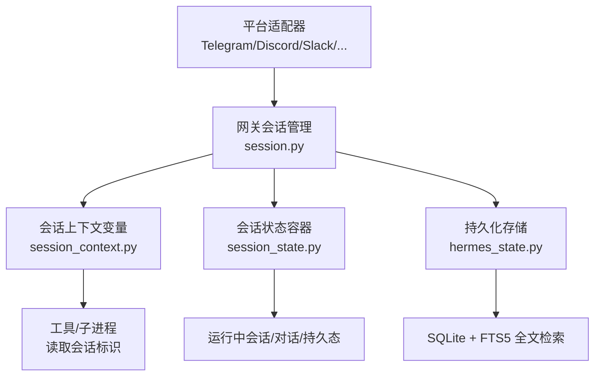
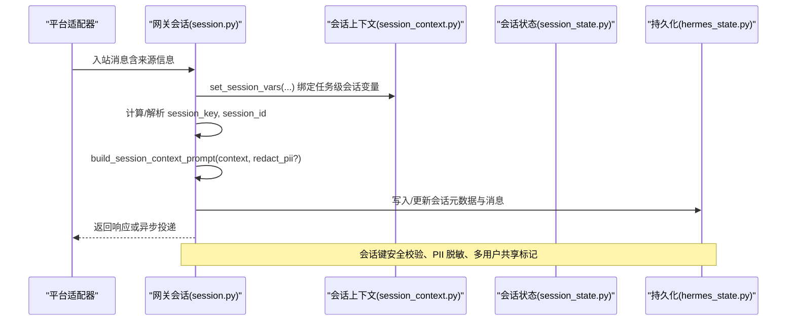
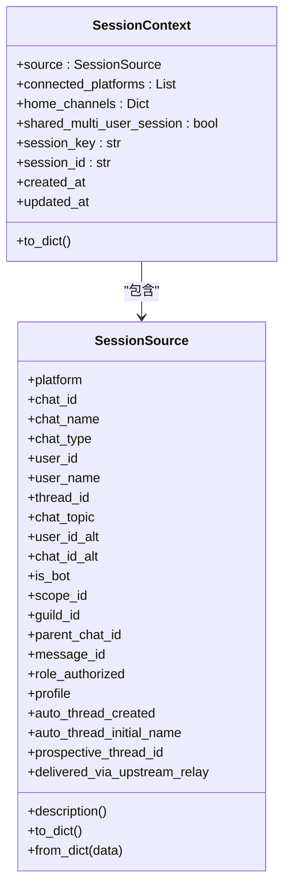
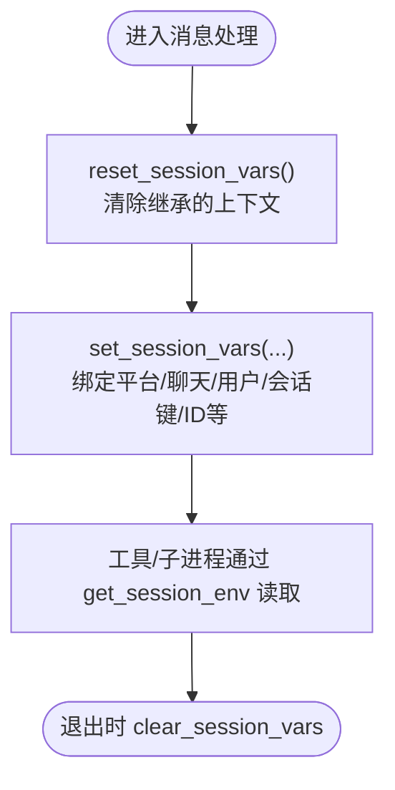
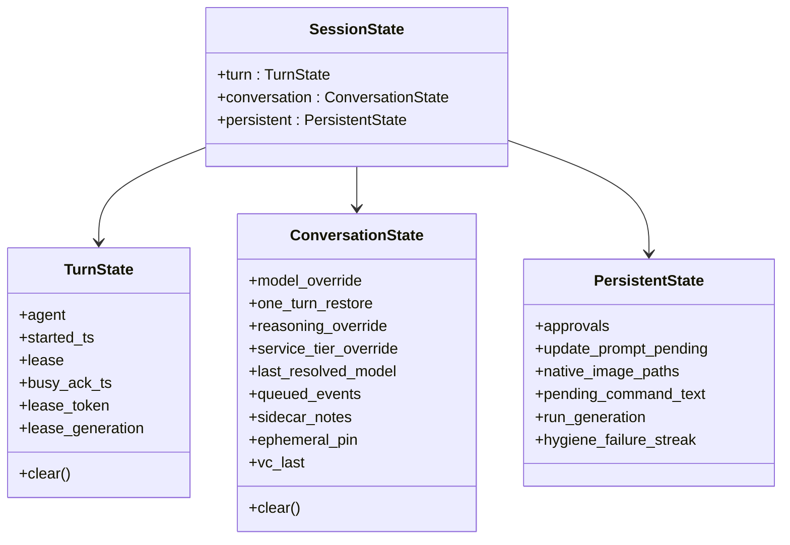
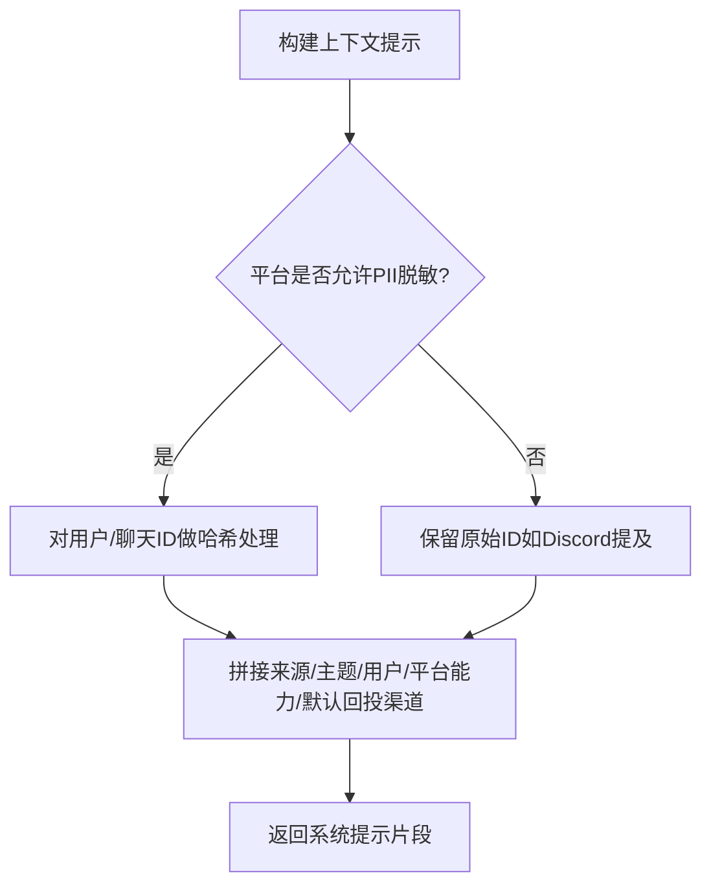
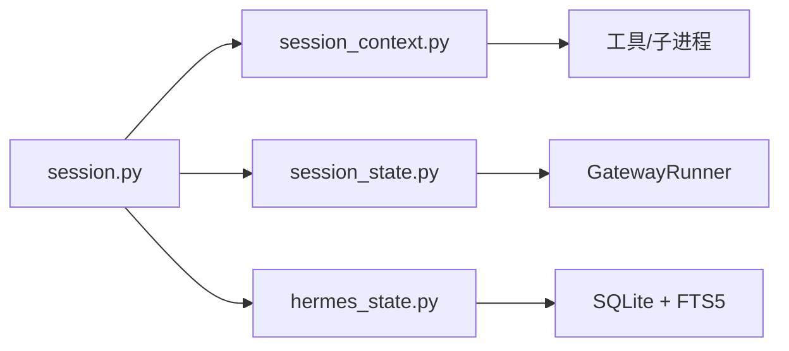

# 会话管理

<cite>
**本文引用的文件**
- [gateway/session.py](file://gateway/session.py)
- [gateway/session_context.py](file://gateway/session_context.py)
- [gateway/session_state.py](file://gateway/session_state.py)
- [hermes_state.py](file://hermes_state.py)
- [tests/gateway/test_adapter_connect_is_reconnect_contract.py](file://tests/gateway/test_adapter_connect_is_reconnect_contract.py)
- [tests/tools/test_terminal_error_redaction.py](file://tests/tools/test_terminal_error_redaction.py)
</cite>

## 目录
1. [简介](#简介)
2. [项目结构](#项目结构)
3. [核心组件](#核心组件)
4. [架构总览](#架构总览)
5. [详细组件分析](#详细组件分析)
6. [依赖关系分析](#依赖关系分析)
7. [性能考量](#性能考量)
8. [故障排查指南](#故障排查指南)
9. [结论](#结论)
10. [附录](#附录)

## 简介
本文件面向 Hermes 网关的“会话管理系统”，围绕以下目标展开：
- 完整说明会话生命周期（创建、更新、销毁）与关键策略（自动续期、重置策略）。
- 解释 SessionSource 与 SessionContext 的设计与使用方式。
- 说明如何从不同平台（Telegram、Discord、Slack 等）识别并标准化消息来源。
- 阐述会话键生成策略、持久化存储机制（SQLite）、动态系统提示注入。
- 提供配置示例，展示 PII 脱敏处理与多用户会话共享机制。
- 给出调试工具与性能监控指标建议。

## 项目结构
Hermes 的会话管理由网关层与状态持久化层共同组成：
- 网关层负责会话上下文、来源抽象、动态提示构建、会话状态隔离与生命周期控制。
- 持久化层通过 SQLite 实现会话元数据、消息历史与搜索能力。

图表来源
- [gateway/session.py:1-120](file://gateway/session.py#L1-L120)
- [gateway/session_context.py:1-120](file://gateway/session_context.py#L1-L120)
- [gateway/session_state.py:1-180](file://gateway/session_state.py#L1-L180)
- [hermes_state.py:1-80](file://hermes_state.py#L1-L80)

章节来源
- [gateway/session.py:1-120](file://gateway/session.py#L1-L120)
- [gateway/session_context.py:1-120](file://gateway/session_context.py#L1-L120)
- [gateway/session_state.py:1-180](file://gateway/session_state.py#L1-L180)
- [hermes_state.py:1-80](file://hermes_state.py#L1-L80)

## 核心组件
- SessionSource：描述消息来源（平台、聊天/频道、线程、用户、作用域等），用于路由、系统提示注入与定时任务投递。
- SessionContext：封装会话上下文，包含来源、已连接平台、默认回投渠道、会话键/ID、时间戳及是否多用户共享等。
- SessionState：将网关每会话的运行态、对话态、持久态统一收纳，避免分散字典带来的边界漂移与并发问题。
- hermes_state：基于 SQLite 的会话持久化，支持 WAL、FTS5 全文检索、压缩拆分链等。

章节来源
- [gateway/session.py:148-346](file://gateway/session.py#L148-L346)
- [gateway/session_state.py:51-179](file://gateway/session_state.py#L51-L179)
- [hermes_state.py:1-80](file://hermes_state.py#L1-L80)

## 架构总览
下图展示了从平台消息到会话上下文、再到提示注入与持久化的整体流程。

图表来源
- [gateway/session.py:479-745](file://gateway/session.py#L479-L745)
- [gateway/session_context.py:206-271](file://gateway/session_context.py#L206-L271)
- [hermes_state.py:1-80](file://hermes_state.py#L1-L80)

## 详细组件分析

### 会话来源与上下文：SessionSource 与 SessionContext
- SessionSource 字段涵盖平台、聊天类型、线程、用户、作用域（scope_id/guild_id）、父通道、触发消息 ID、是否机器人、是否经由上游中继投递、以及 Discord 自动线程元数据等。其 to_dict/from_dict 保证可序列化与跨版本兼容（如 scope_id/guild_id 双写/双读）。
- SessionContext 聚合来源、已连接平台、默认回投渠道、会话键/ID、创建/更新时间，以及 shared_multi_user_session 标志，用于在系统提示中告知代理当前会话是否为多用户共享。

图表来源
- [gateway/session.py:148-346](file://gateway/session.py#L148-L346)

章节来源
- [gateway/session.py:148-346](file://gateway/session.py#L148-L346)

### 会话上下文变量：任务级隔离与兼容性
- 使用 contextvars.ContextVar 替代进程级环境变量，确保并发消息互不干扰。
- 提供 set_session_vars/clear_session_vars/reset_session_vars 等接口，设置平台、聊天、线程、用户、会话键/ID、UI 会话 ID、消息锚点、profile、cron 标记、异步投递能力等。
- get_session_env 提供向后兼容读取路径；session_is_messaging_surface 判断是否来自人类聊天通道；async_delivery_supported 决定能否在 turn 结束后异步投递结果。

图表来源
- [gateway/session_context.py:206-271](file://gateway/session_context.py#L206-L271)
- [gateway/session_context.py:315-386](file://gateway/session_context.py#L315-L386)
- [gateway/session_context.py:418-496](file://gateway/session_context.py#L418-L496)

章节来源
- [gateway/session_context.py:1-120](file://gateway/session_context.py#L1-L120)
- [gateway/session_context.py:206-271](file://gateway/session_context.py#L206-L271)
- [gateway/session_context.py:315-386](file://gateway/session_context.py#L315-L386)
- [gateway/session_context.py:418-496](file://gateway/session_context.py#L418-L496)

### 会话状态容器：Turn/Conversation/Persistent 三态
- TurnState：单轮运行态（agent、开始时间、租约、忙确认等），每轮结束清理。
- ConversationState：对话级状态（模型覆盖、推理覆盖、服务等级、队列事件、侧边笔记、语音频道上下文等），在对话边界清理。
- PersistentState：持久态（审批、待更新提示、原生图片路径、挂起命令文本、运行代数、健康检查失败连串计数等），按自身生命周期管理。
- SessionState 将三者组合，避免历史分散字典导致的边界漂移与并发问题。

图表来源
- [gateway/session_state.py:51-179](file://gateway/session_state.py#L51-L179)

章节来源
- [gateway/session_state.py:1-180](file://gateway/session_state.py#L1-L180)

### 会话键生成与安全校验
- 会话键是逻辑路由键，需防止路径穿越攻击。代码对非法字符（..、前导分隔符、Windows 盘符前缀）进行严格检查，同时允许平台 ID 中的合法斜杠（如 Google Chat 资源名）。
- 该保护确保下游文件系统路径安全（例如 sessions_dir 下的 JSON 文件名）。

章节来源
- [gateway/session.py:100-146](file://gateway/session.py#L100-L146)

### 动态系统提示注入与 PII 脱敏
- build_session_context_prompt 根据 SessionContext 生成“当前会话上下文”段落，注入到系统提示中，使代理了解来源、可用平台、默认回投渠道与交付选项。
- PII 脱敏：对 Telegram/WhatsApp/Signal/BlueBubbles 等平台，可在提示中将用户/聊天 ID 替换为确定性哈希；Discord 因提及需要真实 ID，默认不禁用。
- 平台能力提示：仅当实际加载了 Slack/Discord 工具时，才注入相应能力说明，避免虚假承诺。
- 多用户会话：当 shared_multi_user_session 为真时，不在系统提示中固定单一用户名，而是标注“多用户会话”。

图表来源
- [gateway/session.py:349-745](file://gateway/session.py#L349-L745)

章节来源
- [gateway/session.py:349-745](file://gateway/session.py#L349-L745)

### 会话生命周期：创建、更新、销毁
- 创建：收到入站消息后，解析来源并构造 SessionSource，绑定会话上下文变量，计算/获取 session_key 与 session_id，必要时创建新会话。
- 更新：每轮写入消息与元数据，更新会话时间戳；对话边界（/new、/resume、自动重置、压缩耗尽重置）会清理 ConversationState。
- 销毁：会话不再活跃时，可由外部策略清理；GatewayRunner 维护的会话条目不会主动驱逐（历史行为），后续可能增加空闲回收。

章节来源
- [gateway/session.py:1-120](file://gateway/session.py#L1-L120)
- [gateway/session_state.py:1-34](file://gateway/session_state.py#L1-L34)

### 自动续期新鲜度窗口
- auto_continue_freshness_window 提供“自动续期新鲜度窗口”（秒），用于重启后恢复未完成的会话。可通过环境变量 HERMES_AUTO_CONTINUE_FRESHNESS 配置，非正数则禁用新鲜度门控。

章节来源
- [gateway/session.py:31-58](file://gateway/session.py#L31-L58)

### 平台适配器的重连契约
- 所有平台适配器的 connect() 必须接受 is_reconnect 关键字参数，否则网关重连时会抛出异常并导致平台静默断开。测试通过 AST 静态扫描保障该契约。

章节来源
- [tests/gateway/test_adapter_connect_is_reconnect_contract.py:1-145](file://tests/gateway/test_adapter_connect_is_reconnect_contract.py#L1-L145)

### 持久化存储：SQLite + FTS5
- hermes_state 提供基于 SQLite 的会话存储，启用 WAL 模式以支持并发读取与单写者；使用 FTS5 虚拟表实现全量消息全文检索；支持压缩触发的会话拆分（父子链）。
- 提供最大恢复/导出消息限制，防止超大会话导致内存压力。

章节来源
- [hermes_state.py:1-80](file://hermes_state.py#L1-L80)
- [hermes_state.py:87-157](file://hermes_state.py#L87-L157)

## 依赖关系分析
- gateway/session.py 依赖 platform 枚举、HomeChannel、SessionResetPolicy 等配置项，并通过 utils.atomic_replace 进行原子写入。
- gateway/session_context.py 被工具与子进程通过 get_session_env 读取，影响后台通知与工具调用路由。
- gateway/session_state.py 为 GatewayRunner 提供统一的会话状态视图，避免历史分散字典带来的并发风险。
- hermes_state.py 作为持久化后端，被上层会话管理读写。

图表来源
- [gateway/session.py:87-99](file://gateway/session.py#L87-L99)
- [gateway/session_context.py:130-148](file://gateway/session_context.py#L130-L148)
- [gateway/session_state.py:181-192](file://gateway/session_state.py#L181-L192)
- [hermes_state.py:1-80](file://hermes_state.py#L1-L80)

章节来源
- [gateway/session.py:87-99](file://gateway/session.py#L87-L99)
- [gateway/session_context.py:130-148](file://gateway/session_context.py#L130-L148)
- [gateway/session_state.py:181-192](file://gateway/session_state.py#L181-L192)
- [hermes_state.py:1-80](file://hermes_state.py#L1-L80)

## 性能考量
- 并发安全：使用 ContextVar 避免进程级环境变量在多任务间互相覆盖，提升并发稳定性。
- 提示缓存：系统提示构建中对可变字段（如触发消息 ID）进行 per-turn 注入而非放入缓存块，减少缓存失效。
- 存储优化：WAL 模式与 FTS5 索引提升查询与并发性能；会话压缩拆分避免单会话过大。
- 限制保护：最大恢复/导出消息限制防止内存溢出。

[本节为通用指导，不直接分析具体文件]

## 故障排查指南
- 平台适配器重连失败：若 connect() 未接受 is_reconnect 参数，会在首次重连时报错并导致平台静默断开。请依据测试用例修复签名。
- PII 泄露：终端工具错误输出与回溯需进行脱敏，避免敏感字符串外泄。相关测试验证了错误字段与回溯均会被脱敏。
- 会话上下文泄漏：若未在消息处理入口 reset_session_vars，可能导致子进程继承上一任务的会话标识，造成路由错乱。

章节来源
- [tests/gateway/test_adapter_connect_is_reconnect_contract.py:1-145](file://tests/gateway/test_adapter_connect_is_reconnect_contract.py#L1-L145)
- [tests/tools/test_terminal_error_redaction.py:1-154](file://tests/tools/test_terminal_error_redaction.py#L1-L154)
- [gateway/session_context.py:315-386](file://gateway/session_context.py#L315-L386)

## 结论
Hermes 的会话管理通过清晰的来源抽象（SessionSource）、上下文封装（SessionContext）、任务级隔离（session_context）与统一状态容器（SessionState），结合 SQLite 持久化（hermes_state），实现了高内聚、低耦合且可扩展的会话生命周期管理。配合 PII 脱敏、动态系统提示注入、自动续期窗口与平台适配器重连契约，系统在安全性、可靠性与可观测性方面具备良好基础。

[本节为总结，不直接分析具体文件]

## 附录

### 配置示例与最佳实践
- 自动续期新鲜度窗口：通过环境变量 HERMES_AUTO_CONTINUE_FRESHNESS 设置（单位秒），非正数禁用新鲜度门控。
- PII 脱敏：对于 Telegram/WhatsApp/Signal/BlueBubbles 等平台，建议在构建系统提示时开启 PII 脱敏；Discord 等平台保留真实 ID 以满足提及需求。
- 多用户会话：当 shared_multi_user_session 为真时，系统提示中不固定单一用户名，改为标注“多用户会话”，并在每条用户消息前添加发送者前缀。
- 平台能力提示：仅在工具实际加载时注入 Slack/Discord 能力说明，避免误导代理。

章节来源
- [gateway/session.py:31-58](file://gateway/session.py#L31-L58)
- [gateway/session.py:349-745](file://gateway/session.py#L349-L745)

### 调试工具与监控指标建议
- 调试工具
  - 使用 get_session_env 读取当前会话的平台、聊天、用户、会话键/ID 等，便于定位路由问题。
  - 通过 session_is_messaging_surface 判断是否来自人类聊天通道，辅助日志与提示差异化。
  - 借助 async_delivery_supported 判断是否可异步投递，避免工具承诺无法兑现。
- 监控指标
  - 会话创建/更新/销毁次数与延迟。
  - 提示构建耗时与缓存命中率。
  - SQLite 写入/查询延迟与 WAL 状态。
  - 平台适配器重连次数与失败率。
  - PII 脱敏覆盖率与误报率。

[本节为通用指导，不直接分析具体文件]