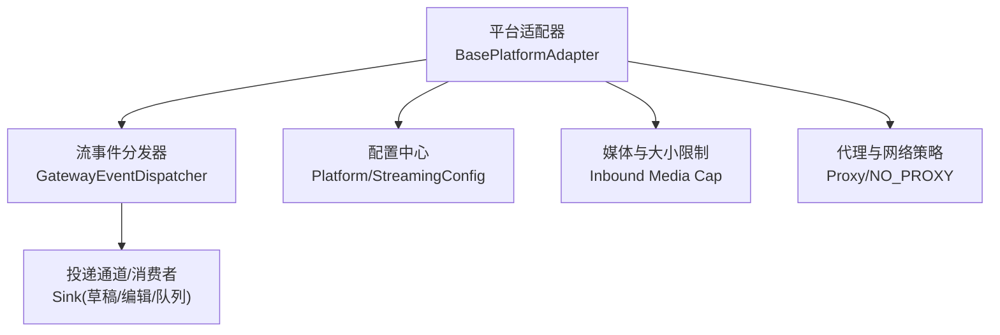
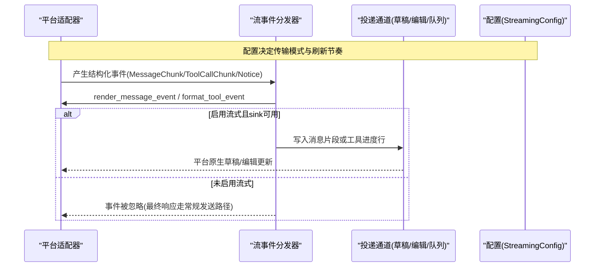
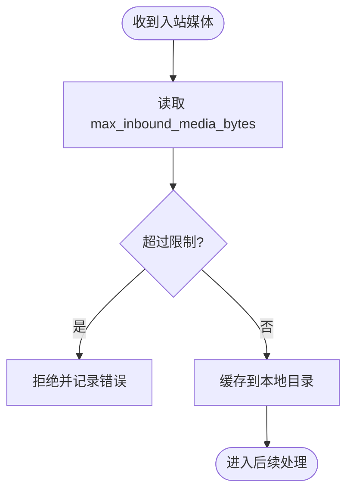
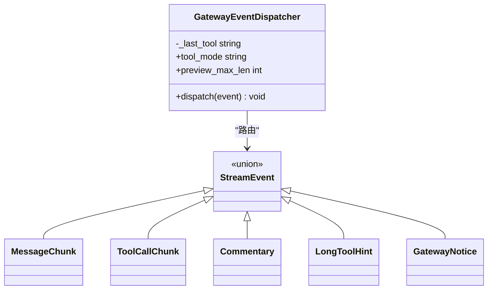
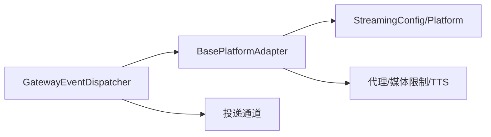

# 消息处理管道

<cite>
**本文引用的文件**
- [gateway/config.py](file://gateway/config.py)
- [gateway/platforms/base.py](file://gateway/platforms/base.py)
- [gateway/stream_dispatch.py](file://gateway/stream_dispatch.py)
- [tests/gateway/test_adapter_connect_is_reconnect_contract.py](file://tests/gateway/test_adapter_connect_is_reconnect_contract.py)
</cite>

## 目录
1. [简介](#简介)
2. [项目结构](#项目结构)
3. [核心组件](#核心组件)
4. [架构总览](#架构总览)
5. [详细组件分析](#详细组件分析)
6. [依赖关系分析](#依赖关系分析)
7. [性能考量](#性能考量)
8. [故障排查指南](#故障排查指南)
9. [结论](#结论)
10. [附录](#附录)

## 简介
本文件面向 Hermes 消息处理管道的实现与使用，聚焦于“接收—解析—验证—标准化—去重/防抖—优先级—格式转换—元数据—错误处理—重试—丢弃”的完整链路。文档同时解释流式与批量消息处理的差异、配置方法、调试工具与性能优化建议，帮助开发者快速定位问题并调优系统行为。

## 项目结构
Hermes 的消息处理由网关层（Gateway）统一编排，平台适配器负责接入不同渠道（Telegram、Discord、WhatsApp、微信等），并通过统一的抽象进行消息标准化与投递。关键模块：
- 配置与平台枚举：集中管理平台能力、默认值与开关
- 平台基类：定义消息收发、媒体限制、线程/回复语义、代理与网络策略等通用逻辑
- 流事件分发器：将 Agent 产生的结构化事件路由到适配器的渲染钩子与投递通道
- 测试契约：确保各平台适配器的连接接口一致，保障重连路径稳定

图表来源
- [gateway/platforms/base.py:153-173](file://gateway/platforms/base.py#L153-L173)
- [gateway/platforms/base.py:722-800](file://gateway/platforms/base.py#L722-L800)
- [gateway/config.py:720-800](file://gateway/config.py#L720-L800)
- [gateway/stream_dispatch.py:40-132](file://gateway/stream_dispatch.py#L40-L132)

章节来源
- [gateway/config.py:272-417](file://gateway/config.py#L272-L417)
- [gateway/platforms/base.py:78-151](file://gateway/platforms/base.py#L78-L151)
- [gateway/stream_dispatch.py:1-132](file://gateway/stream_dispatch.py#L1-L132)

## 核心组件
- 平台基类 BasePlatformAdapter：提供跨平台的发送、媒体处理、线程/回复锚点、代理与网络策略、TTS 输出路径、入站媒体大小限制等通用能力
- 流事件分发器 GatewayEventDispatcher：将 Agent 的流事件（消息片段、工具调用、通知等）按模式路由到适配器渲染与投递通道，支持“new/all/verbose/off”等工具进度模式与预览长度控制
- 配置体系 Platform/StreamingConfig：统一管理平台枚举、是否启用、传输方式（auto/draft/edit/off）、编辑间隔、缓冲阈值、最终消息替换策略等
- 连接契约测试：强制所有平台适配器的 connect() 接受 is_reconnect 关键字，保证重连路径稳定

章节来源
- [gateway/platforms/base.py:570-637](file://gateway/platforms/base.py#L570-L637)
- [gateway/stream_dispatch.py:40-132](file://gateway/stream_dispatch.py#L40-L132)
- [gateway/config.py:720-800](file://gateway/config.py#L720-L800)
- [tests/gateway/test_adapter_connect_is_reconnect_contract.py:1-145](file://tests/gateway/test_adapter_connect_is_reconnect_contract.py#L1-L145)

## 架构总览
下图展示从平台适配器到流事件分发再到投递通道的整体流程，以及配置对行为的影响。

图表来源
- [gateway/stream_dispatch.py:40-132](file://gateway/stream_dispatch.py#L40-L132)
- [gateway/config.py:720-800](file://gateway/config.py#L720-L800)

章节来源
- [gateway/stream_dispatch.py:1-132](file://gateway/stream_dispatch.py#L1-L132)
- [gateway/config.py:720-800](file://gateway/config.py#L720-L800)

## 详细组件分析

### 平台基类：消息标准化与元数据处理
- 线程与回复语义：根据平台特性计算 reply_to 锚点与 thread_id，避免在论坛/群组中错误地回复到旧消息；Slack 工作区 scope_id 作为持久路由状态随每次出站携带
- 音频/语音格式选择：依据扩展名与平台能力选择 sendAudio/sendVoice 或文档发送；Telegram 有严格的格式限制
- 入站媒体大小限制：通过配置项 gateway.max_inbound_media_bytes 限制内存占用，防止恶意大文件导致 OOM
- 代理与 NO_PROXY：优先平台环境变量，其次系统代理，支持域名/IP/CIDR 匹配与绕过

图表来源
- [gateway/platforms/base.py:722-800](file://gateway/platforms/base.py#L722-L800)

章节来源
- [gateway/platforms/base.py:78-151](file://gateway/platforms/base.py#L78-L151)
- [gateway/platforms/base.py:153-173](file://gateway/platforms/base.py#L153-L173)
- [gateway/platforms/base.py:722-800](file://gateway/platforms/base.py#L722-L800)

### 流事件分发器：去重、防抖与优先级
- 去重：工具进度“new”模式下仅当工具名称变化时上报，避免重复刷屏
- 防抖：流式编辑的刷新节奏由 StreamingConfig.edit_interval 与 buffer_threshold 控制，兼顾体验与平台速率限制
- 优先级：工具进度模式支持 all/new/verbose/off，结合 preview_max_len 控制输出长度；notice/长任务提示通过回调钩子交由上层决策是否呈现

图表来源
- [gateway/stream_dispatch.py:40-132](file://gateway/stream_dispatch.py#L40-L132)

章节来源
- [gateway/stream_dispatch.py:40-132](file://gateway/stream_dispatch.py#L40-L132)

### 配置：传输模式与刷新节奏
- transport 支持 auto/draft/edit/off：auto 优先使用平台原生草稿（如 Telegram DM），否则回退到编辑更新
- edit_interval 与 buffer_threshold：控制流式更新的频率与缓冲阈值，平衡实时性与速率限制
- fresh_final_after_seconds：长响应完成后，若预览可见时间超过阈值则用新消息替换，使完成时间戳更准确

章节来源
- [gateway/config.py:720-800](file://gateway/config.py#L720-L800)

### 连接契约与重连：is_reconnect 参数
- 所有平台适配器的 connect() 必须接受 is_reconnect 关键字，网关重连时会传递该参数以区分首次连接与重连
- 测试覆盖：静态解析每个 adapter.py 中的 connect 签名，确保不会因缺少 is_reconnect 导致重连失败

章节来源
- [tests/gateway/test_adapter_connect_is_reconnect_contract.py:1-145](file://tests/gateway/test_adapter_connect_is_reconnect_contract.py#L1-L145)

## 依赖关系分析
- 平台基类依赖配置与工具库：媒体限制、代理策略、TTS 输出路径等
- 流事件分发器依赖适配器渲染钩子与投递通道：无平台知识，纯同步路由
- 配置模块提供平台枚举与流式默认值：影响分发与投递行为

图表来源
- [gateway/platforms/base.py:570-637](file://gateway/platforms/base.py#L570-L637)
- [gateway/stream_dispatch.py:40-132](file://gateway/stream_dispatch.py#L40-L132)
- [gateway/config.py:720-800](file://gateway/config.py#L720-L800)

章节来源
- [gateway/platforms/base.py:570-637](file://gateway/platforms/base.py#L570-L637)
- [gateway/stream_dispatch.py:40-132](file://gateway/stream_dispatch.py#L40-L132)
- [gateway/config.py:720-800](file://gateway/config.py#L720-L800)

## 性能考量
- 流式更新节奏：合理设置 edit_interval 与 buffer_threshold，避免频繁 API 调用触发限流
- 媒体入站限制：通过 max_inbound_media_bytes 控制内存峰值，防止恶意上传导致 OOM
- 工具进度模式：在高频场景使用 “new” 模式减少重复输出；verbose 模式配合 preview_max_len 控制长度
- 代理与网络：利用 NO_PROXY 跳过内部地址，减少不必要代理开销；必要时使用 SOCKS 提升连通性

[本节为通用指导，不直接分析具体文件]

## 故障排查指南
- 重连失败：检查平台适配器的 connect() 是否包含 is_reconnect 关键字；参考契约测试用例定位问题
- 流式未生效：确认 streaming.enabled/transport 配置是否正确；若 sink 为空，消息事件将被丢弃，最终响应走常规发送路径
- 工具进度刷屏：调整 tool_mode 为 “new”，或降低预览长度；确认 _last_tool 去重逻辑是否生效
- 媒体过大被拒：检查 gateway.max_inbound_media_bytes 配置；必要时提高限制或客户端压缩

章节来源
- [tests/gateway/test_adapter_connect_is_reconnect_contract.py:1-145](file://tests/gateway/test_adapter_connect_is_reconnect_contract.py#L1-L145)
- [gateway/stream_dispatch.py:40-132](file://gateway/stream_dispatch.py#L40-L132)
- [gateway/platforms/base.py:722-800](file://gateway/platforms/base.py#L722-L800)

## 结论
Hermes 的消息处理管道通过平台基类与流事件分发器实现了跨渠道的统一抽象与高效投递。配置驱动的传输模式与刷新节奏保障了用户体验与稳定性；严格的连接契约与媒体限制提升了健壮性。开发者可据此调优去重、防抖与优先级策略，并结合调试与监控手段持续优化。

[本节为总结，不直接分析具体文件]

## 附录

### 配置示例（说明性）
- 启用流式并选择传输模式：
  - streaming.enabled: true
  - streaming.transport: "auto"（优先原生草稿，否则编辑）
  - streaming.edit_interval: 0.8
  - streaming.buffer_threshold: 24
  - streaming.fresh_final_after_seconds: 0（或 >0 以启用最终消息替换）
- 入站媒体限制：
  - gateway.max_inbound_media_bytes: 134217728（128 MiB）
- 工具进度模式：
  - tool_mode: "new"（仅工具变化时上报）
  - preview_max_len: 40

[本节为概念性说明，不直接引用代码内容]