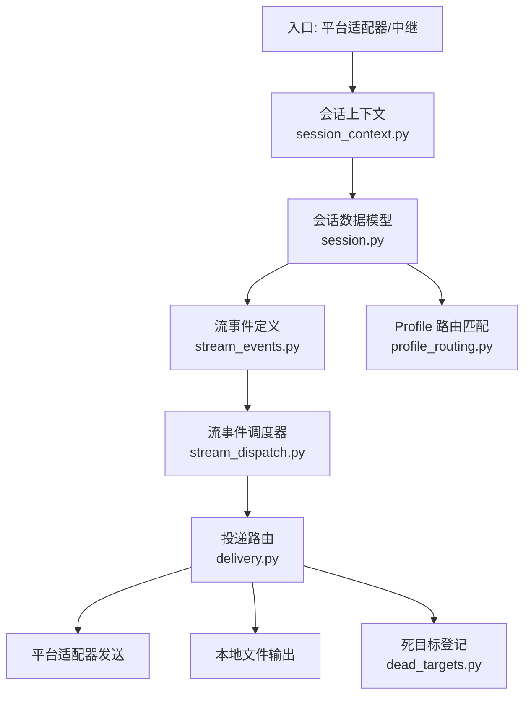
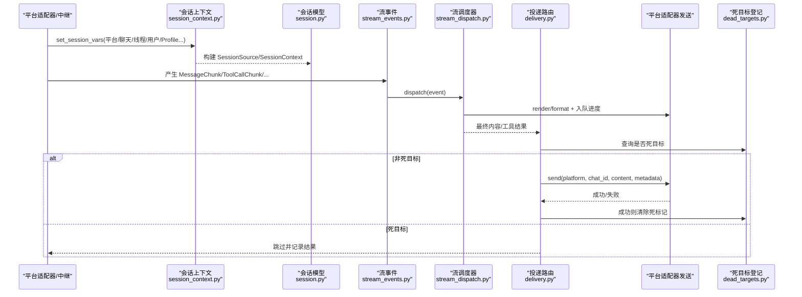
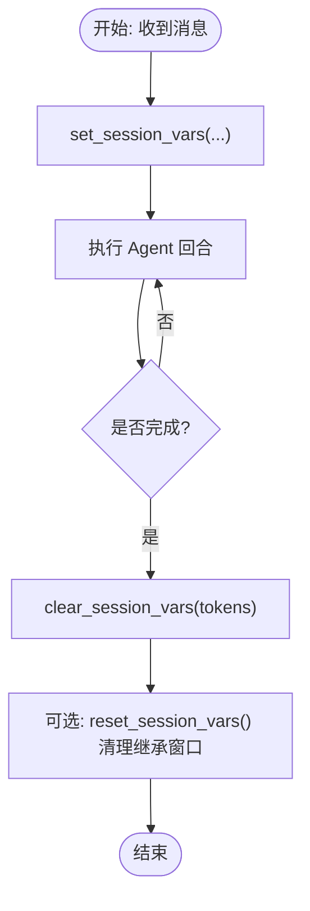
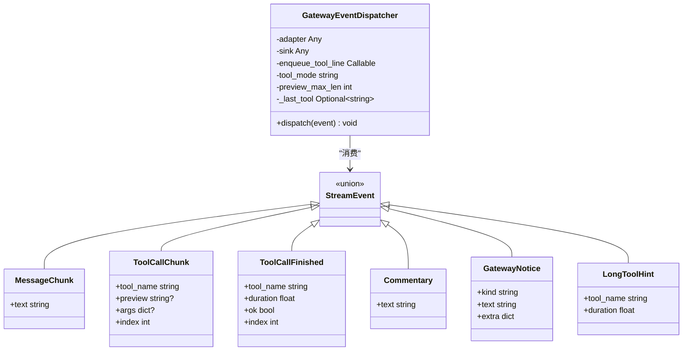
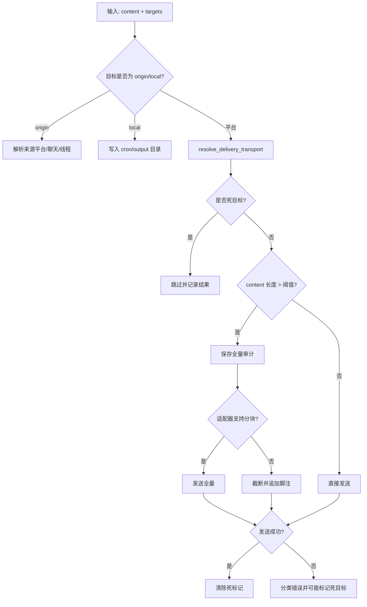
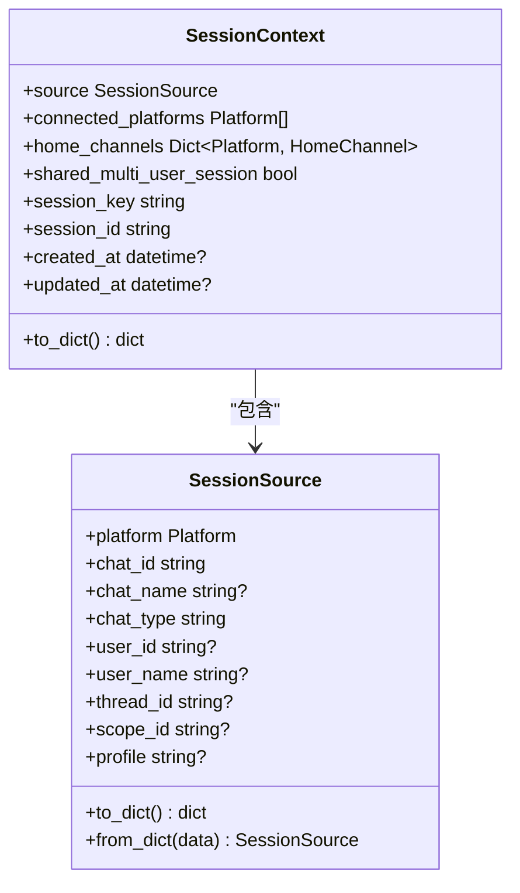
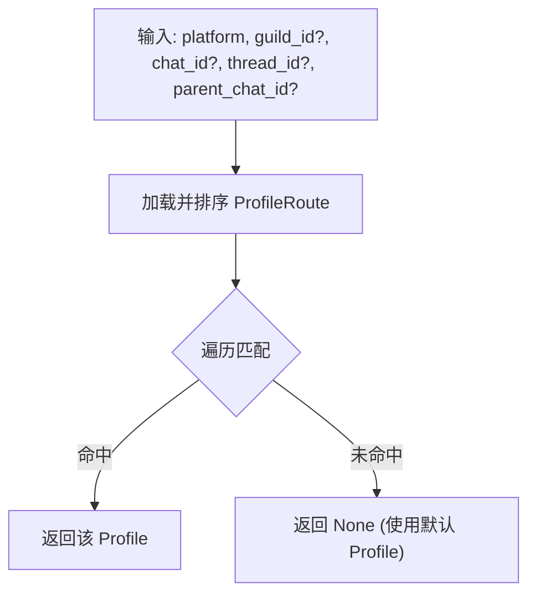
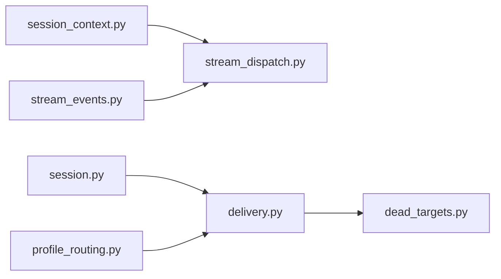

# 消息路由系统

<cite>
**本文引用的文件**
- [gateway/session.py](file://gateway/session.py)
- [gateway/session_context.py](file://gateway/session_context.py)
- [gateway/delivery.py](file://gateway/delivery.py)
- [gateway/stream_dispatch.py](file://gateway/stream_dispatch.py)
- [gateway/stream_events.py](file://gateway/stream_events.py)
- [gateway/profile_routing.py](file://gateway/profile_routing.py)
- [gateway/dead_targets.py](file://gateway/dead_targets.py)
</cite>

## 目录
1. [简介](#简介)
2. [项目结构](#项目结构)
3. [核心组件](#核心组件)
4. [架构总览](#架构总览)
5. [详细组件分析](#详细组件分析)
6. [依赖关系分析](#依赖关系分析)
7. [性能与可靠性](#性能与可靠性)
8. [故障排查指南](#故障排查指南)
9. [结论](#结论)
10. [附录：配置示例与最佳实践](#附录：配置示例与最佳实践)

## 简介
本文件面向 Hermes 网关的消息路由子系统，围绕“接收—解析—路由—投递”的完整链路，系统化说明会话上下文管理、消息格式标准化、路由规则匹配、目标分发机制，以及会话生命周期、去重与防抖、优先级与负载均衡策略、错误重试与审计、监控指标与调试方法。文档以代码级事实为依据，配合图示帮助开发者快速定位问题并优化系统行为。

## 项目结构
Hermes 网关的消息路由由以下关键模块协作完成：
- 会话上下文：维护任务/会话维度的上下文变量，避免并发污染
- 会话数据模型：描述消息来源、平台、聊天/线程等元信息，用于构建系统提示和路由键
- 流事件与调度：将智能体产生的结构化流事件（文本片段、工具调用、通知）路由到适配器渲染与投递
- 投递路由：根据目标字符串或来源决定最终投递通道（本地文件、平台 Home Channel、显式目标、回源）
- 配置文件路由：按平台+作用域（guild/channel/thread）选择不同 Profile，实现多租户/多角色隔离
- 死目标登记：记录不可达目标，避免重复投递浪费资源

**图表来源**
- [gateway/session_context.py:1-120](file://gateway/session_context.py#L1-L120)
- [gateway/session.py:148-346](file://gateway/session.py#L148-L346)
- [gateway/stream_events.py:41-159](file://gateway/stream_events.py#L41-L159)
- [gateway/stream_dispatch.py:40-132](file://gateway/stream_dispatch.py#L40-L132)
- [gateway/delivery.py:213-391](file://gateway/delivery.py#L213-L391)
- [gateway/dead_targets.py:48-144](file://gateway/dead_targets.py#L48-L144)
- [gateway/profile_routing.py:50-167](file://gateway/profile_routing.py#L50-L167)

**章节来源**
- [gateway/session_context.py:1-120](file://gateway/session_context.py#L1-L120)
- [gateway/session.py:148-346](file://gateway/session.py#L148-L346)
- [gateway/stream_events.py:41-159](file://gateway/stream_events.py#L41-L159)
- [gateway/stream_dispatch.py:40-132](file://gateway/stream_dispatch.py#L40-L132)
- [gateway/delivery.py:213-391](file://gateway/delivery.py#L213-L391)
- [gateway/dead_targets.py:48-144](file://gateway/dead_targets.py#L48-L144)
- [gateway/profile_routing.py:50-167](file://gateway/profile_routing.py#L50-L167)

## 核心组件
- 会话上下文（ContextVar）：为每个异步任务提供任务局部变量，避免并发覆盖；支持设置/清理/重置，兼容 CLI/子进程环境
- 会话数据模型：SessionSource/SessionContext/SessionEntry，承载来源、平台、聊天/线程、用户、范围标识、Profile 等
- 流事件契约：MessageChunk/Commentary/ToolCallChunk/ToolCallFinished/GatewayNotice/LongToolHint，解耦“发生了什么”与“如何投递”
- 流事件调度器：GatewayEventDispatcher，将事件分派到适配器的渲染钩子与进度队列，支持工具进度去重与模式控制
- 投递路由：DeliveryTarget/DeliveryRouter，解析目标字符串、选择传输（原生适配器或中继）、截断/审计长输出、过滤静默叙述、处理 Telegram 私有主题
- Profile 路由：按平台+guild/channel/thread 层级匹配，选择不同 Profile（模型/工具/记忆/人设）
- 死目标登记：持久化不可达目标，自动跳过并自愈

**章节来源**
- [gateway/session_context.py:151-386](file://gateway/session_context.py#L151-L386)
- [gateway/session.py:148-346](file://gateway/session.py#L148-L346)
- [gateway/stream_events.py:41-159](file://gateway/stream_events.py#L41-L159)
- [gateway/stream_dispatch.py:40-132](file://gateway/stream_dispatch.py#L40-L132)
- [gateway/delivery.py:213-391](file://gateway/delivery.py#L213-L391)
- [gateway/profile_routing.py:50-167](file://gateway/profile_routing.py#L50-L167)
- [gateway/dead_targets.py:48-144](file://gateway/dead_targets.py#L48-L144)

## 架构总览
下图展示从消息进入网关到最终投递的关键路径，包括上下文绑定、流事件派发、投递决策与失败处理。

**图表来源**
- [gateway/session_context.py:206-311](file://gateway/session_context.py#L206-L311)
- [gateway/session.py:148-346](file://gateway/session.py#L148-L346)
- [gateway/stream_events.py:41-159](file://gateway/stream_events.py#L41-L159)
- [gateway/stream_dispatch.py:88-132](file://gateway/stream_dispatch.py#L88-L132)
- [gateway/delivery.py:318-391](file://gateway/delivery.py#L318-L391)
- [gateway/dead_targets.py:98-138](file://gateway/dead_targets.py#L98-L138)

## 详细组件分析

### 会话上下文管理（创建、更新、销毁）
- 创建：在每轮消息处理开始时通过 set_session_vars 绑定平台、聊天/线程、用户、Profile、工作目录、异步投递能力等
- 更新：set_current_session_id 同步 ContextVar 与进程环境变量（委派子代理时避免泄漏）
- 销毁：clear_session_vars 将所有变量置空以抑制旧值回退；reset_session_vars 恢复为“未设置”，防止跨任务继承泄漏
- 能力声明：declare_stateless_channel 声明当前会话不支持异步后台投递（如 API Server），避免工具承诺无法兑现的回传

**图表来源**
- [gateway/session_context.py:206-311](file://gateway/session_context.py#L206-L311)
- [gateway/session_context.py:315-360](file://gateway/session_context.py#L315-L360)
- [gateway/session_context.py:441-496](file://gateway/session_context.py#L441-L496)

**章节来源**
- [gateway/session_context.py:206-311](file://gateway/session_context.py#L206-L311)
- [gateway/session_context.py:315-360](file://gateway/session_context.py#L315-L360)
- [gateway/session_context.py:441-496](file://gateway/session_context.py#L441-L496)

### 消息格式标准化与流事件管道
- 事件类型：MessageChunk（增量文本）、Commentary（完整中间消息）、ToolCallChunk（工具调用开始/进行中）、ToolCallFinished（完成）、GatewayNotice/LongToolHint（网关控制/提示）
- 调度器：GatewayEventDispatcher 将事件路由到适配器的渲染钩子，并将工具进度行入队到统一队列，支持“new”模式去重（仅当工具变化才上报）
- 职责分离：事件只描述“发生了什么”，不决定“如何投递”；平台差异由适配器渲染层处理

**图表来源**
- [gateway/stream_dispatch.py:40-132](file://gateway/stream_dispatch.py#L40-L132)
- [gateway/stream_events.py:41-159](file://gateway/stream_events.py#L41-L159)

**章节来源**
- [gateway/stream_dispatch.py:40-132](file://gateway/stream_dispatch.py#L40-L132)
- [gateway/stream_events.py:41-159](file://gateway/stream_events.py#L41-L159)

### 路由规则匹配与目标分发
- 目标解析：DeliveryTarget.parse 支持 origin/local/platform/platform:chat_id/platform:chat_id:thread_id
- 传输选择：resolve_delivery_transport 优先原生适配器，若禁用或未配置且中继可代表该平台则走中继
- 投递流程：DeliveryRouter.deliver 遍历目标，跳过已确认的死目标，本地写文件或直接发送到平台
- 大输出处理：超过阈值时先保存全量作为审计，非分块适配器会截断并追加指向全量文件的脚注
- 静默叙述过滤：对纯“沉默”内容的出站进行拦截，避免 bot-to-bot 循环
- Telegram 私有主题：必要时确保/刷新命名主题，补充 reply anchor 或 thread_id

**图表来源**
- [gateway/delivery.py:213-391](file://gateway/delivery.py#L213-L391)
- [gateway/delivery.py:460-642](file://gateway/delivery.py#L460-L642)
- [gateway/dead_targets.py:98-138](file://gateway/dead_targets.py#L98-L138)

**章节来源**
- [gateway/delivery.py:213-391](file://gateway/delivery.py#L213-L391)
- [gateway/delivery.py:460-642](file://gateway/delivery.py#L460-L642)
- [gateway/dead_targets.py:98-138](file://gateway/dead_targets.py#L98-L138)

### 会话生命周期与上下文注入
- SessionSource/SessionContext：描述消息来源、连接平台、Home Channels、共享多用户会话标志、会话键/ID、时间戳等
- 动态系统提示：build_session_context_prompt 根据平台特性注入可用工具、边界约束、身份信息等，支持 PII 脱敏（哈希用户/聊天 ID）
- 安全校验：会话键/路径安全检查，防止越界访问

**图表来源**
- [gateway/session.py:148-346](file://gateway/session.py#L148-L346)

**章节来源**
- [gateway/session.py:148-346](file://gateway/session.py#L148-L346)

### Profile 路由（多租户/多角色）
- 匹配优先级：thread > channel > guild > 默认
- 层级匹配：channel 匹配同时覆盖其下的 thread/forum post（通过 parent_chat_id）
- 配置解析：parse_profile_routes 校验并排序，match_profile_route 返回最佳匹配

**图表来源**
- [gateway/profile_routing.py:50-167](file://gateway/profile_routing.py#L50-L167)

**章节来源**
- [gateway/profile_routing.py:50-167](file://gateway/profile_routing.py#L50-L167)

## 依赖关系分析
- session_context 被 gateway 各处理器广泛使用，保证并发安全
- delivery 依赖 dead_targets 做不可达目标短路，依赖 config/adapters 解析传输
- stream_dispatch 依赖 stream_events 的类型契约，驱动适配器渲染
- profile_routing 独立于投递，但影响后续 Profile 内的工具/模型/记忆等配置

**图表来源**
- [gateway/session_context.py:1-120](file://gateway/session_context.py#L1-L120)
- [gateway/stream_dispatch.py:40-132](file://gateway/stream_dispatch.py#L40-L132)
- [gateway/session.py:148-346](file://gateway/session.py#L148-L346)
- [gateway/delivery.py:213-391](file://gateway/delivery.py#L213-L391)
- [gateway/dead_targets.py:48-144](file://gateway/dead_targets.py#L48-L144)
- [gateway/profile_routing.py:50-167](file://gateway/profile_routing.py#L50-L167)
- [gateway/stream_events.py:41-159](file://gateway/stream_events.py#L41-L159)

**章节来源**
- [gateway/session_context.py:1-120](file://gateway/session_context.py#L1-L120)
- [gateway/stream_dispatch.py:40-132](file://gateway/stream_dispatch.py#L40-L132)
- [gateway/session.py:148-346](file://gateway/session.py#L148-L346)
- [gateway/delivery.py:213-391](file://gateway/delivery.py#L213-L391)
- [gateway/dead_targets.py:48-144](file://gateway/dead_targets.py#L48-L144)
- [gateway/profile_routing.py:50-167](file://gateway/profile_routing.py#L50-L167)
- [gateway/stream_events.py:41-159](file://gateway/stream_events.py#L41-L159)

## 性能与可靠性
- 并发安全：基于 contextvars 的任务局部上下文，避免 os.environ 的全局覆盖风险
- 去重与防抖：
  - 工具进度“new”模式去重：仅当工具名称变化才上报，减少冗余 UI 更新
  - 静默叙述过滤：出站前识别并丢弃无意义“沉默”内容，避免循环
- 大输出保护：超过阈值的输出先审计保存，再按需截断，保障可追溯性
- 不可达目标短路：死目标登记避免重复尝试，提升吞吐并降低限流风险
- 自适应中继：当原生适配器禁用或未配置时，若中继可代表该平台则自动切换
- 优先级与负载均衡：
  - Profile 路由按精确度排序（thread > channel > guild），确保最具体规则优先
  - 投递顺序由 targets 列表决定，可在上层编排优先级
  - 负载分散可通过多 Profile/多平台 Home Channel 配置实现

[本节为通用指导，无需特定文件引用]

## 故障排查指南
- 检查会话上下文是否正确绑定与清理：
  - 确认 set_session_vars 在入口处调用，finally 中 clear_session_vars
  - 若存在跨任务继承泄漏，使用 reset_session_vars 清理初始窗口
- 投递失败与死目标：
  - 查看 DeliveryRouter.deliver 的结果，关注 skipped=dead_target
  - 使用 DeadTargetRegistry.all_dead 获取快照，结合日志中的 reason 定位原因
- 大输出与截断：
  - 若出现截断，检查 MAX_PLATFORM_OUTPUT 与适配器是否支持分块
  - 审计文件路径会在日志中记录，便于回溯
- Telegram 私有主题问题：
  - 确认是否提供了必要的 reply anchor 或 thread_id
  - 若主题不存在，ensure_dm_topic 会尝试创建/刷新
- 流事件未渲染：
  - 检查 GatewayEventDispatcher 的工具模式（off/new/all）与 preview 长度
  - 确认 sink 与 enqueue_tool_line 已正确传入

**章节来源**
- [gateway/session_context.py:206-311](file://gateway/session_context.py#L206-L311)
- [gateway/delivery.py:318-391](file://gateway/delivery.py#L318-L391)
- [gateway/delivery.py:460-642](file://gateway/delivery.py#L460-L642)
- [gateway/dead_targets.py:98-144](file://gateway/dead_targets.py#L98-L144)
- [gateway/stream_dispatch.py:88-132](file://gateway/stream_dispatch.py#L88-L132)

## 结论
Hermes 网关的消息路由系统通过清晰的职责分层与强类型事件契约，实现了高内聚、低耦合的可扩展架构。会话上下文基于 contextvars 保障并发安全；投递路由具备健壮的错误处理、审计与自愈能力；Profile 路由支持精细化的多租户/多角色隔离。借助上述机制，系统在高并发、多渠道、复杂场景下仍保持稳定的消息流转与可靠的交付。

[本节为总结，无需特定文件引用]

## 附录：配置示例与最佳实践
- 复杂 Profile 路由配置（config.yaml 片段）
  - 服务器默认 Profile（按 guild）
  - 特殊频道 Profile（按 guild+channel）
  - 线程级 Profile（按 channel+thread）
  - 注意：匹配优先级 thread > channel > guild，父链匹配支持 forum/thread 场景
- 目标字符串示例
  - origin：回发至来源
  - local：仅保存到本地文件
  - telegram：发送至 Telegram Home Channel
  - telegram:123456：指定聊天
  - telegram:123456:topic_id：指定线程/主题
- 最佳实践
  - 始终在入口处绑定会话上下文并在 finally 中清理
  - 对长输出启用审计保存，合理设置阈值
  - 使用死目标登记避免无效重试
  - 在需要时使用 Profile 路由隔离不同团队/频道的模型与工具集
  - 对 Telegram 私有主题，确保提供 reply anchor 或使用 ensure_dm_topic 创建/刷新

[本节为通用指导，无需特定文件引用]