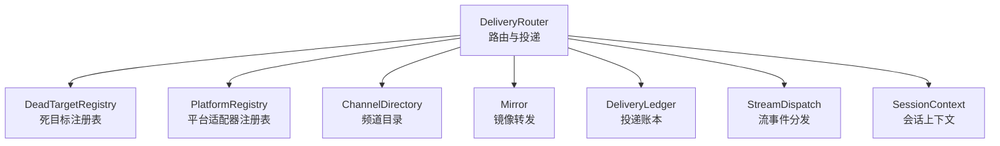
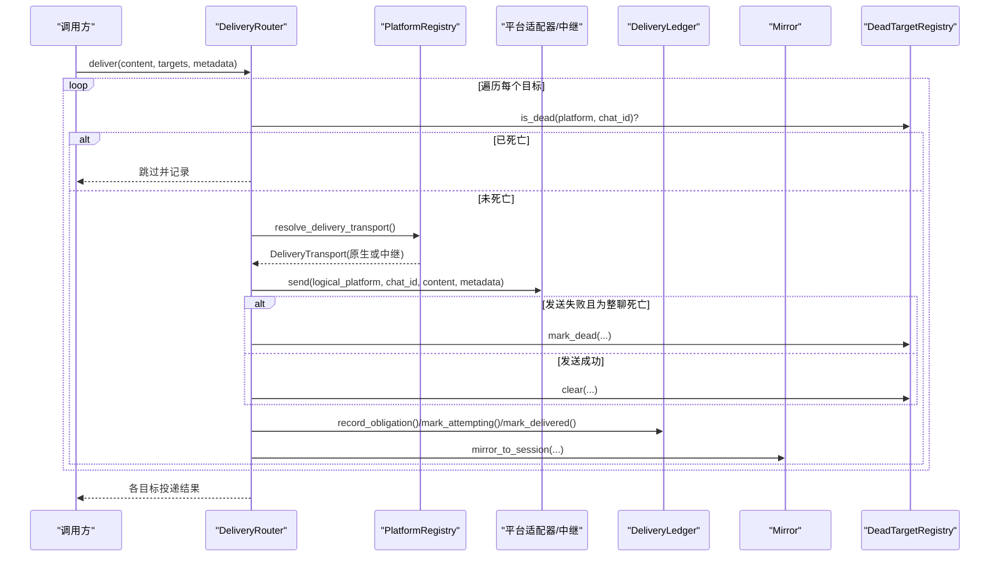
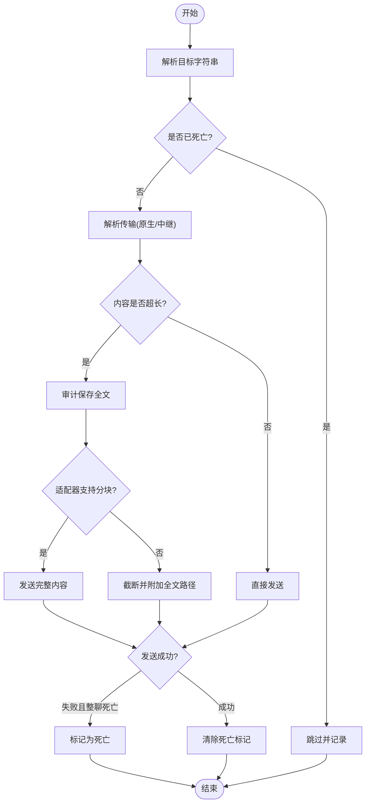
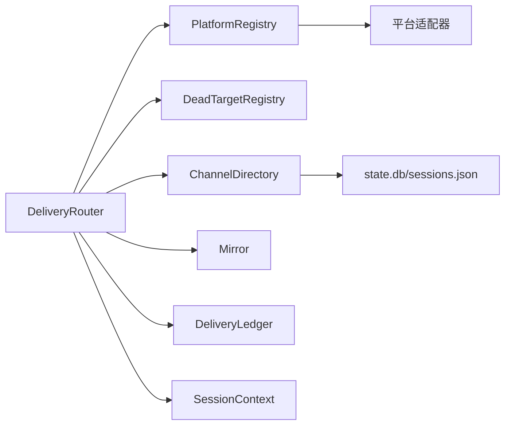

# 目标分发系统

<cite>
**本文引用的文件**
- [delivery.py](file://gateway/delivery.py)
- [dead_targets.py](file://gateway/dead_targets.py)
- [delivery_ledger.py](file://gateway/delivery_ledger.py)
- [mirror.py](file://gateway/mirror.py)
- [platform_registry.py](file://gateway/platform_registry.py)
- [channel_directory.py](file://gateway/channel_directory.py)
- [stream_dispatch.py](file://gateway/stream_dispatch.py)
- [session_context.py](file://gateway/session_context.py)
</cite>

## 目录
1. [简介](#简介)
2. [项目结构](#项目结构)
3. [核心组件](#核心组件)
4. [架构总览](#架构总览)
5. [详细组件分析](#详细组件分析)
6. [依赖关系分析](#依赖关系分析)
7. [性能与可扩展性](#性能与可扩展性)
8. [故障排查指南](#故障排查指南)
9. [结论](#结论)
10. [附录：配置与使用示例](#附录配置与使用示例)

## 简介
本文件面向 Hermes 网关的目标分发子系统，系统性说明消息如何根据路由结果分发到不同平台与频道，覆盖目标发现、连接管理、负载均衡策略、消息格式适配、平台特定能力调用、错误恢复机制、镜像转发、广播与选择性投递、状态跟踪、失败重试与“死信”处理，以及监控与诊断方法。文档以代码级事实为依据，辅以流程图与时序图帮助理解。

## 项目结构
Hermes 的目标分发由多个模块协作完成：
- 路由与投递：DeliveryRouter 负责解析目标、选择传输（原生适配器或中继）、执行发送、处理大小限制与静默叙述过滤。
- 死目标注册表：DeadTargetRegistry 持久化记录已确认不可达的聊天/群组，避免重复投递浪费配额并减少日志噪音。
- 投递账本：delivery_ledger 提供最终回复的持久化承诺记录，支持崩溃恢复与“至少一次”语义。
- 镜像转发：mirror 将发出的消息镜像写入目标会话转录，便于接收端代理获得上下文。
- 平台注册表：platform_registry 集中注册平台适配器，支持延迟加载、依赖检查与配置校验。
- 频道目录：channel_directory 维护可发现的频道/联系人映射，支持友好名覆盖与名称解析。
- 流事件分发：stream_dispatch 将结构化流事件路由到适配器渲染钩子，驱动实时呈现。
- 会话上下文：session_context 提供并发安全的会话上下文变量，确保多任务并发下不串扰。

图表来源
- [delivery.py:294-642](file://gateway/delivery.py#L294-L642)
- [dead_targets.py:48-144](file://gateway/dead_targets.py#L48-L144)
- [platform_registry.py:183-382](file://gateway/platform_registry.py#L183-L382)
- [channel_directory.py:142-213](file://gateway/channel_directory.py#L142-L213)
- [mirror.py:25-93](file://gateway/mirror.py#L25-L93)
- [delivery_ledger.py:188-306](file://gateway/delivery_ledger.py#L188-L306)
- [stream_dispatch.py:40-132](file://gateway/stream_dispatch.py#L40-L132)
- [session_context.py:206-313](file://gateway/session_context.py#L206-L313)

章节来源
- [delivery.py:294-642](file://gateway/delivery.py#L294-L642)
- [platform_registry.py:183-382](file://gateway/platform_registry.py#L183-L382)
- [channel_directory.py:142-213](file://gateway/channel_directory.py#L142-L213)
- [dead_targets.py:48-144](file://gateway/dead_targets.py#L48-L144)
- [delivery_ledger.py:188-306](file://gateway/delivery_ledger.py#L188-L306)
- [mirror.py:25-93](file://gateway/mirror.py#L25-L93)
- [stream_dispatch.py:40-132](file://gateway/stream_dispatch.py#L40-L132)
- [session_context.py:206-313](file://gateway/session_context.py#L206-L313)

## 核心组件
- DeliveryRouter：解析目标字符串（origin/local/平台:chat_id[:thread_id]），选择传输（原生适配器优先，否则中继需声明 fronts_platform），执行发送，处理超大输出裁剪与审计保存，屏蔽静默叙述，处理 Telegram 私有主题创建与刷新，更新死目标状态。
- DeadTargetRegistry：线程安全、持久化的“已死亡”目标集合，按 platform:chat_id 键存储原因与时间戳；成功发送后自动清除，实现自愈。
- DeliveryLedger：为最终回复建立持久化义务记录（pending/attempting/delivered/failed/abandoned），支持进程崩溃后的回收重投，带可见恢复标记以避免静默重复。
- Mirror：在目标会话中追加“delivery-mirror”条目，保持跨平台消息上下文一致。
- PlatformRegistry：统一注册平台适配器，支持延迟加载、依赖探测与安装、配置校验、独立发送器钩子等。
- ChannelDirectory：构建并缓存平台频道/联系人目录，支持从适配器 list_channels、Discord/Slack 专用枚举、会话历史推导，并提供名称解析与友好名覆盖。
- StreamDispatch：将结构化流事件（消息片段、工具调用、评论、通知）路由到适配器渲染钩子，并入队工具进度行。
- SessionContext：基于 contextvars 的会话上下文，保证并发安全，提供异步投递能力声明与 cron 自动投递上下文。

章节来源
- [delivery.py:62-131](file://gateway/delivery.py#L62-L131)
- [delivery.py:213-642](file://gateway/delivery.py#L213-L642)
- [dead_targets.py:48-144](file://gateway/dead_targets.py#L48-L144)
- [delivery_ledger.py:188-306](file://gateway/delivery_ledger.py#L188-L306)
- [mirror.py:25-93](file://gateway/mirror.py#L25-L93)
- [platform_registry.py:183-382](file://gateway/platform_registry.py#L183-L382)
- [channel_directory.py:142-213](file://gateway/channel_directory.py#L142-L213)
- [stream_dispatch.py:40-132](file://gateway/stream_dispatch.py#L40-L132)
- [session_context.py:206-313](file://gateway/session_context.py#L206-L313)

## 架构总览
下图展示消息从入口到目标平台的完整路径：DeliveryRouter 解析目标并选择传输，必要时通过 PlatformRegistry 获取适配器；对超长内容先审计保存再按需裁剪；对 Telegram 私有主题进行创建/刷新；发送成功后清理死目标标记；同时可选地镜像到目标会话；最终回复通过 delivery_ledger 持久化以支持崩溃恢复。

图表来源
- [delivery.py:318-391](file://gateway/delivery.py#L318-L391)
- [delivery.py:460-642](file://gateway/delivery.py#L460-L642)
- [delivery_ledger.py:188-306](file://gateway/delivery_ledger.py#L188-L306)
- [mirror.py:25-93](file://gateway/mirror.py#L25-L93)
- [dead_targets.py:98-138](file://gateway/dead_targets.py#L98-L138)

## 详细组件分析

### 目标解析与路由（DeliveryTarget / DeliveryRouter）
- 目标格式：
  - origin：回发至来源（若无来源则降级为 local）。
  - local：仅保存到本地文件。
  - 平台：发送到该平台 home 频道。
  - 平台:chat_id：发送到指定聊天。
  - 平台:chat_id:thread_id：发送到指定聊天与线程/话题。
- 传输选择：
  - 优先原生适配器；若禁用或未启用，则尝试中继（Relay），但中继必须显式声明 fronts_platform(platform)。
- 超大输出处理：
  - 超过阈值时先审计保存全文，非分块适配器会附加截断尾部指向全文路径；具备分块能力的适配器直接传递完整负载。
- 静默叙述过滤：
  - 当开启时，丢弃纯“静音”提示（如 *(silent)*、🔇 等），防止 bot-to-bot 循环。
- Telegram 私有主题：
  - 若为目标为私聊且 thread_id 为非数字，则调用 ensure_dm_topic 创建或刷新，并在失败时抛出明确错误。
- 死目标短路：
  - 若目标已被标记为永久不可达，则跳过投递并返回跳过结果；成功投递后自动清除标记。

图表来源
- [delivery.py:230-291](file://gateway/delivery.py#L230-L291)
- [delivery.py:318-391](file://gateway/delivery.py#L318-L391)
- [delivery.py:460-642](file://gateway/delivery.py#L460-L642)

章节来源
- [delivery.py:230-291](file://gateway/delivery.py#L230-L291)
- [delivery.py:318-391](file://gateway/delivery.py#L318-L391)
- [delivery.py:460-642](file://gateway/delivery.py#L460-L642)

### 死目标注册表（DeadTargetRegistry）
- 作用：记录整聊级别的永久不可达（forbidden、not_found），避免每轮投递都触发平台限流与日志风暴。
- 持久化：JSON 文件，读写失败不影响运行（退化为内存态）。
- 自愈：任何成功发送都会清除该目标的死亡标记。
- 范围：仅记录整聊级别死亡，线程/话题级删除由适配器自行修复，不在此处记录。

章节来源
- [dead_targets.py:1-23](file://gateway/dead_targets.py#L1-L23)
- [dead_targets.py:48-144](file://gateway/dead_targets.py#L48-L144)

### 投递账本（DeliveryLedger）
- 目的：确保最终回复在崩溃/重启后仍可被恢复投递，实现“至少一次”语义。
- 状态机：
  - pending：尚未发送，可直接重投。
  - attempting：正在发送中崩溃，重投需携带可见恢复标记。
  - failed：曾被拒绝，重启作为自然重试边界，也携带恢复标记。
  - delivered：已完成，保留期后清理。
  - abandoned：超尝试次数或过期，转入废弃。
- 回收：启动时扫描归属进程已死的行，原子认领并递增尝试次数，受最大尝试次数与过期时间约束。
- 可见性：对可能重复的消息添加“恢复标记”，诚实告知用户可能重复。

章节来源
- [delivery_ledger.py:1-38](file://gateway/delivery_ledger.py#L1-L38)
- [delivery_ledger.py:188-306](file://gateway/delivery_ledger.py#L188-L306)
- [delivery_ledger.py:339-375](file://gateway/delivery_ledger.py#L339-L375)

### 镜像转发（Mirror）
- 功能：将发出的消息追加到目标会话的转录中（JSONL + SQLite），使接收端代理拥有上下文。
- 会话查找：优先 state.db 查询，回退到 sessions.json；DM 会话键不含 chat_id，因此匹配 origin 而非键。
- 角色控制：默认 assistant，非代理说话的场景应传入 user_role，避免破坏严格交替的提供者。

章节来源
- [mirror.py:1-10](file://gateway/mirror.py#L1-L10)
- [mirror.py:25-93](file://gateway/mirror.py#L25-L93)
- [mirror.py:96-187](file://gateway/mirror.py#L96-L187)
- [mirror.py:191-207](file://gateway/mirror.py#L191-L207)

### 平台注册与发现（PlatformRegistry）
- 注册：插件或内置适配器通过 PlatformEntry 注册，包含工厂函数、依赖探测、配置校验、安装提示、独立发送器等元数据。
- 延迟加载：为避免启动时导入重型 SDK，采用延迟加载，首次使用时才引入对应模块。
- 创建适配器：依次执行依赖检查、可选安装、配置校验、工厂实例化；任一失败返回 None。
- 用途：DeliveryRouter 通过 resolve_delivery_transport 决定使用原生适配器还是中继；ChannelDirectory 通过 plugin_entries 动态纳入新平台。

章节来源
- [platform_registry.py:1-29](file://gateway/platform_registry.py#L1-L29)
- [platform_registry.py:38-181](file://gateway/platform_registry.py#L38-L181)
- [platform_registry.py:183-382](file://gateway/platform_registry.py#L183-L382)

### 频道目录与名称解析（ChannelDirectory）
- 构建：启动时及定时刷新，聚合适配器 list_channels、Discord/Slack 专用枚举、会话历史，并应用友好名覆盖。
- 存储：写入 channel_directory.json，供 send_message 工具列出与解析。
- 解析策略：
  - 精确 ID 匹配。
  - 精确名称匹配（含显示标签）。
  - Discord 公会限定匹配（GuildName/channel）。
  - 前缀模糊匹配（唯一时生效）。
- 容错：Slack 权限不足时降级为会话历史；重复警告抑制。

章节来源
- [channel_directory.py:1-37](file://gateway/channel_directory.py#L1-L37)
- [channel_directory.py:142-213](file://gateway/channel_directory.py#L142-L213)
- [channel_directory.py:216-423](file://gateway/channel_directory.py#L216-L423)
- [channel_directory.py:426-519](file://gateway/channel_directory.py#L426-L519)
- [channel_directory.py:526-599](file://gateway/channel_directory.py#L526-L599)

### 流事件分发（StreamDispatch）
- 职责：将结构化流事件（消息片段、工具调用、评论、通知）路由到适配器渲染钩子，并将工具进度行入队到同一队列，避免竞态。
- 模式：支持 tool_mode（all/new/verbose/off）与预览长度控制；“new”模式下去重仅在新工具切换时报告。
- 隔离：同步调度器，不会中断 agent 工作线程。

章节来源
- [stream_dispatch.py:1-19](file://gateway/stream_dispatch.py#L1-L19)
- [stream_dispatch.py:40-132](file://gateway/stream_dispatch.py#L40-L132)

### 会话上下文（SessionContext）
- 并发安全：用 contextvars 替代进程全局环境变量，避免并发消息互相覆盖。
- 能力声明：async_delivery_supported 指示当前会话是否能稍后投递后台完成结果；stateless 通道会声明不支持。
- Cron 自动投递：提供 per-job 的自动投递上下文变量，避免并发作业互相干扰。

章节来源
- [session_context.py:1-37](file://gateway/session_context.py#L1-L37)
- [session_context.py:206-313](file://gateway/session_context.py#L206-L313)
- [session_context.py:363-496](file://gateway/session_context.py#L363-L496)

## 依赖关系分析
- DeliveryRouter 依赖：
  - PlatformRegistry：解析传输（原生/中继）。
  - DeadTargetRegistry：短路已知死亡目标。
  - ChannelDirectory：用于名称解析与列表展示（间接）。
  - Mirror：可选镜像到目标会话。
  - DeliveryLedger：最终回复的持久化承诺。
  - SessionContext：会话上下文与异步投递能力。
- PlatformRegistry 依赖：
  - 各平台插件/内置适配器模块（延迟加载）。
- ChannelDirectory 依赖：
  - 适配器 list_channels、Discord/Slack 客户端、state.db/sessions.json。
- StreamDispatch 依赖：
  - 适配器 render/format 钩子、GatewayStreamConsumer。

图表来源
- [delivery.py:294-642](file://gateway/delivery.py#L294-L642)
- [platform_registry.py:183-382](file://gateway/platform_registry.py#L183-L382)
- [channel_directory.py:142-213](file://gateway/channel_directory.py#L142-L213)
- [mirror.py:25-93](file://gateway/mirror.py#L25-L93)
- [delivery_ledger.py:188-306](file://gateway/delivery_ledger.py#L188-L306)
- [session_context.py:206-313](file://gateway/session_context.py#L206-L313)

章节来源
- [delivery.py:294-642](file://gateway/delivery.py#L294-L642)
- [platform_registry.py:183-382](file://gateway/platform_registry.py#L183-L382)
- [channel_directory.py:142-213](file://gateway/channel_directory.py#L142-L213)
- [mirror.py:25-93](file://gateway/mirror.py#L25-L93)
- [delivery_ledger.py:188-306](file://gateway/delivery_ledger.py#L188-L306)
- [session_context.py:206-313](file://gateway/session_context.py#L206-L313)

## 性能与可扩展性
- 延迟加载平台适配器：避免启动时导入重型 SDK，降低冷启动开销。
- 超时与节流：
  - 超大输出审计保存与截断，避免平台 API 限制导致失败。
  - Slack 目录刷新失败抑制重复告警。
- 并发安全：
  - 会话上下文基于 contextvars，避免并发任务互相污染。
  - DeadTargetRegistry 使用 RLock 保护并发读写。
- 可扩展点：
  - 新增平台：通过 PlatformEntry 注册，实现 list_channels、send、ensure_dm_topic 等接口。
  - 中继接入：实现 fronts_platform 判定逻辑，允许中继承载特定平台。
  - 流事件：通过适配器 render/format 钩子定制呈现。

[本节为通用指导，无需具体文件引用]

## 故障排查指南
- 目标始终被跳过：
  - 检查 DeadTargetRegistry 是否记录了该目标；若记录，尝试重新发送以清除标记。
  - 查看错误分类是否为整聊级别死亡（forbidden/not_found）。
- 发送失败且无重试：
  - 确认 DeliveryLedger 是否记录为 failed；若是，重启后可作为自然重试边界。
  - 检查平台适配器是否可用（check_fn/validate_config）。
- Telegram 私有主题问题：
  - 确认 ensure_dm_topic 是否存在并可创建/刷新；若失败，检查 reply anchor 与 thread_id 设置。
- 频道名称无法解析：
  - 检查 channel_directory.json 是否最新；必要时触发重建。
  - 对于 Slack/Discord，确认权限与 scopes。
- 流事件未呈现：
  - 检查 stream_dispatch 的工具模式与预览长度；确认适配器 format_tool_event 是否返回 None（吃掉事件）。
- 镜像未写入：
  - 检查 mirror 是否找到目标会话；确认 role 设置正确，避免破坏交替序列。

章节来源
- [dead_targets.py:98-138](file://gateway/dead_targets.py#L98-L138)
- [delivery_ledger.py:236-306](file://gateway/delivery_ledger.py#L236-L306)
- [delivery.py:554-642](file://gateway/delivery.py#L554-L642)
- [channel_directory.py:526-599](file://gateway/channel_directory.py#L526-L599)
- [stream_dispatch.py:88-132](file://gateway/stream_dispatch.py#L88-L132)
- [mirror.py:25-93](file://gateway/mirror.py#L25-L93)

## 结论
Hermes 目标分发系统通过清晰的分层与模块化设计，实现了可靠的多平台消息投递。DeliveryRouter 负责路由与适配，DeadTargetRegistry 与 DeliveryLedger 分别提供“短路不可达目标”和“崩溃恢复”的能力，Mirror 保障跨平台上下文一致性，PlatformRegistry 与 ChannelDirectory 支撑灵活的平台扩展与频道发现，StreamDispatch 与 SessionContext 确保流式呈现与会话并发安全。整体系统在可靠性、可观测性与可扩展性方面具备良好基础，适合复杂的多目标分发场景。

[本节为总结，无需具体文件引用]

## 附录：配置与使用示例
- 多目标分发：
  - 目标字符串示例：
    - origin：回发到来源。
    - local：仅保存到本地文件。
    - telegram：发送到 Telegram home 频道。
    - telegram:123456：发送到指定 Telegram 聊天。
    - telegram:123456:topic_name：发送到指定聊天与命名主题。
  - 通过 DeliveryTarget.parse 解析，再由 DeliveryRouter.deliver 批量投递。
- 镜像转发：
  - 调用 mirror_to_session 将发出内容写入目标会话转录，role 默认 assistant，非代理说话时传入 user。
- 广播与选择性投递：
  - 广播：构造多个 DeliveryTarget（例如多个平台或多个聊天），一次性投递。
  - 选择性投递：根据条件筛选目标列表（如仅当内容为非静默叙述时投递）。
- 失败重试与死信：
  - 整聊死亡目标会被 DeadTargetRegistry 记录并跳过后续投递；成功发送后自动清除。
  - 最终回复通过 DeliveryLedger 记录，崩溃后可回收并重投，携带恢复标记。
- 监控与诊断：
  - 使用 ChannelDirectory.format_directory_for_display 列出可用目标。
  - 使用 DeadTargetRegistry.all_dead 查看当前死亡目标快照。
  - 使用 DeliveryLedger.debug_rows 查看最近投递义务行。

章节来源
- [delivery.py:230-291](file://gateway/delivery.py#L230-L291)
- [delivery.py:318-391](file://gateway/delivery.py#L318-L391)
- [mirror.py:25-93](file://gateway/mirror.py#L25-L93)
- [dead_targets.py:140-144](file://gateway/dead_targets.py#L140-L144)
- [delivery_ledger.py:355-375](file://gateway/delivery_ledger.py#L355-L375)
- [channel_directory.py:601-659](file://gateway/channel_directory.py#L601-L659)