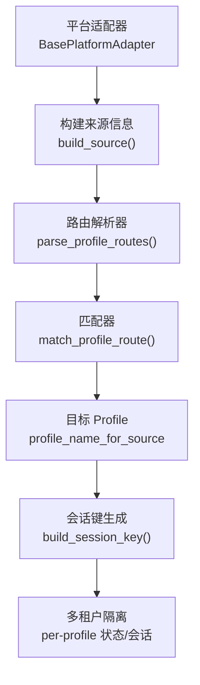
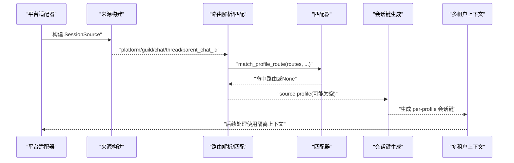
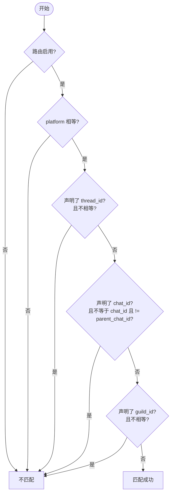
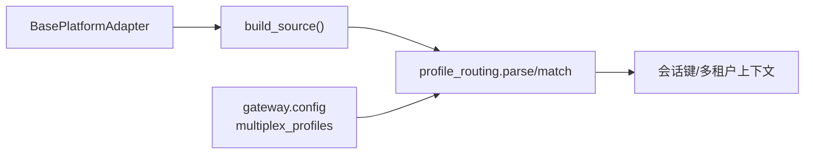

# 路由规则引擎

<cite>
**本文引用的文件**
- [gateway/profile_routing.py](file://gateway/profile_routing.py)
- [docs/profile-routing.md](file://docs/profile-routing.md)
- [tests/gateway/test_profile_routing.py](file://tests/gateway/test_profile_routing.py)
- [gateway/config.py](file://gateway/config.py)
- [gateway/platforms/base.py](file://gateway/platforms/base.py)
</cite>

## 目录
1. [简介](#简介)
2. [项目结构](#项目结构)
3. [核心组件](#核心组件)
4. [架构总览](#架构总览)
5. [详细组件分析](#详细组件分析)
6. [依赖关系分析](#依赖关系分析)
7. [性能与缓存](#性能与缓存)
8. [故障排查指南](#故障排查指南)
9. [结论](#结论)
10. [附录：配置示例与最佳实践](#附录：配置示例与最佳实践)

## 简介
本文件面向 Hermes Gateway 的“基于平台/频道/线程的多租户路由”能力，系统性说明路由规则的匹配算法、优先级计算、条件判断机制，以及多租户隔离、权限控制与访问策略。文档同时给出复杂路由的配置思路、调试与测试方法，并讨论性能优化与缓存策略。

## 项目结构
Hermes 的路由规则引擎位于网关层，核心实现集中在 profile routing 模块，并通过配置加载、平台适配器和会话键构建等上下游环节协同工作。

图表来源
- [gateway/platforms/base.py](file://gateway/platforms/base.py)
- [gateway/profile_routing.py:105-166](file://gateway/profile_routing.py#L105-L166)
- [docs/profile-routing.md:95-109](file://docs/profile-routing.md#L95-L109)

章节来源
- [docs/profile-routing.md:1-118](file://docs/profile-routing.md#L1-L118)
- [gateway/profile_routing.py:1-167](file://gateway/profile_routing.py#L1-L167)

## 核心组件
- ProfileRoute：单条路由规则的数据模型，包含名称、平台、目标 profile 及可选的 guild_id/chat_id/thread_id 判别字段，并提供精确度（specificity）计算与匹配逻辑。
- parse_profile_routes：从配置中解析路由列表，校验 profile 名称安全性，并按精确度降序排序，确保“最具体优先”。
- match_profile_route：按顺序遍历已排序路由，返回首个匹配项；若无匹配则回退到默认/活动 profile。
- 平台侧集成：平台适配器在构建消息来源时携带 platform/guild/chat/thread 等信息，交由路由匹配器选择目标 profile，进而影响会话键与多租户隔离范围。

章节来源
- [gateway/profile_routing.py:50-103](file://gateway/profile_routing.py#L50-L103)
- [gateway/profile_routing.py:105-166](file://gateway/profile_routing.py#L105-L166)
- [docs/profile-routing.md:95-109](file://docs/profile-routing.md#L95-L109)

## 架构总览
入口流程：平台适配器收到消息 → 构建来源（platform/guild/chat/thread/parent_chat_id）→ 调用路由匹配器 → 确定目标 profile → 生成 per-profile 会话键 → 进入对应租户上下文处理。

图表来源
- [docs/profile-routing.md:95-109](file://docs/profile-routing.md#L95-L109)
- [gateway/profile_routing.py:154-166](file://gateway/profile_routing.py#L154-L166)

## 详细组件分析

### 匹配算法与优先级
- 判别字段：platform（必须）、guild_id、chat_id、thread_id。未声明的字段不参与匹配。
- 层级匹配：当 chat_id 未直接命中时，若存在 parent_chat_id 且等于 route.chat_id，也视为匹配（用于 Discord 线程/论坛场景）。
- 优先级（精确度）：thread_id=8，chat_id=4，guild_id=2，仅 platform=0。最终 specificity = 各字段权重之和。排序后“第一个匹配即胜出”。
- 组合约束：若路由同时声明 guild_id 与 chat_id，则两者都必须匹配（AND 语义），避免“仅频道匹配就满足服务器级约束”的错误。

图表来源
- [gateway/profile_routing.py:74-102](file://gateway/profile_routing.py#L74-L102)

章节来源
- [gateway/profile_routing.py:62-102](file://gateway/profile_routing.py#L62-L102)
- [tests/gateway/test_profile_routing.py:24-46](file://tests/gateway/test_profile_routing.py#L24-L46)
- [tests/gateway/test_profile_routing.py:73-109](file://tests/gateway/test_profile_routing.py#L73-L109)

### 动态路由策略（平台/频道/角色/内容）
- 平台/频道/线程：通过 platform/guild_id/chat_id/thread_id/parent_chat_id 进行静态规则匹配，适用于多租户隔离与不同频道的差异化处理。
- 用户角色/消息内容：当前 profile routing 未内置基于用户角色或消息内容的动态分支。如需此类能力，可在上层（如平台适配器或网关调度层）根据角色/内容决定传入的 source 字段，或扩展路由匹配器以支持自定义条件函数。

章节来源
- [docs/profile-routing.md:21-93](file://docs/profile-routing.md#L21-L93)
- [gateway/profile_routing.py:74-102](file://gateway/profile_routing.py#L74-L102)

### 多租户隔离、权限控制与访问策略
- 多租户隔离：路由命中后，会话键会带上 profile 前缀，从而将会话、记忆、工具集等隔离到独立 profile 目录与命名空间。
- 权限控制：路由本身不承载细粒度权限控制；建议在平台适配器或网关中间件层结合认证/授权结果决定是否允许该来源进入某 profile。
- 访问策略：可通过“禁用路由”（enabled=false）或“更严格的 guild/chat 限定”限制访问面；也可通过环境变量开关 multiplex_profiles 控制是否启用多 profile 路由。

章节来源
- [docs/profile-routing.md:111-118](file://docs/profile-routing.md#L111-L118)
- [gateway/config.py:40-74](file://gateway/config.py#L40-L74)

### 配置解析与安全校验
- 配置来源：config.yaml 中的 gateway.profile_routes 或顶层 profile_routes。
- 安全校验：解析时会规范化并校验 profile 名称，防止路径穿越等安全问题；非法名称会被跳过并记录警告。
- 排序与生效：解析完成后按 specificity 降序排序，保证最具体的规则优先匹配。

章节来源
- [gateway/profile_routing.py:105-151](file://gateway/profile_routing.py#L105-L151)
- [docs/profile-routing.md:21-67](file://docs/profile-routing.md#L21-L67)

## 依赖关系分析
- 平台适配器依赖路由匹配：适配器在构建来源时携带必要标识，供路由匹配器判定目标 profile。
- 配置模块提供多租户开关：multiplex_profiles 环境变量可覆盖配置，决定是否启用多 profile 路由。
- 测试用例验证匹配行为：覆盖精确度、父子频道匹配、AND 约束等关键路径。

图表来源
- [docs/profile-routing.md:95-109](file://docs/profile-routing.md#L95-L109)
- [gateway/config.py:40-74](file://gateway/config.py#L40-L74)
- [gateway/profile_routing.py:105-166](file://gateway/profile_routing.py#L105-L166)

章节来源
- [tests/gateway/test_profile_routing.py:1-109](file://tests/gateway/test_profile_routing.py#L1-L109)
- [gateway/config.py:40-74](file://gateway/config.py#L40-L74)

## 性能与缓存
- 匹配复杂度：对每条入站消息，按路由数 N 线性扫描一次；由于路由通常数量有限，整体开销较低。
- 排序成本：路由解析阶段一次性排序，运行时不再重排。
- 建议优化：
  - 合理拆分路由，避免过多细粒度规则导致扫描时间增加。
  - 将高频匹配的“通用规则”放在前面（虽然已按 specificity 排序，但可在同一精度内保持稳定的顺序）。
  - 对超大路由表，考虑在网关启动时预编译为更高效的结构（例如分层字典），以减少线性扫描。
- 缓存机制：当前实现未引入运行时缓存；若需更高吞吐，可在匹配器外层增加基于 (platform,guild,chat,thread) 的缓存，注意失效策略与一致性。

[本节为通用性能建议，不直接分析具体代码]

## 故障排查指南
- 路由未命中：
  - 检查 platform 是否一致；确认 guild/chat/thread 是否正确传递。
  - 对于线程/论坛评论，确认 parent_chat_id 是否正确设置。
- 误匹配：
  - 若路由同时声明 guild_id 与 chat_id，需确保两者都匹配；否则不会命中。
  - 检查 enabled 字段是否为 true。
- 多租户未生效：
  - 确认 multiplex_profiles 已开启（环境变量或配置）。
  - 确认目标 profile 名称合法且存在。
- 日志定位：
  - 关注解析阶段的警告（非法 profile 名称、缺失必填字段）。
  - 观察匹配后的 profile 是否写入 source.profile，并影响会话键前缀。

章节来源
- [gateway/profile_routing.py:105-151](file://gateway/profile_routing.py#L105-L151)
- [docs/profile-routing.md:69-93](file://docs/profile-routing.md#L69-L93)
- [tests/gateway/test_profile_routing.py:24-46](file://tests/gateway/test_profile_routing.py#L24-L46)

## 结论
Hermes 的路由规则引擎通过“平台+组织+频道+线程”的层次化判别与精确度加权，实现了稳定、可扩展的多租户路由。其设计简洁、可测试性强，适合在生产环境中按社区/团队/频道维度隔离资源与状态。对于更复杂的动态策略（角色/内容），可在上游扩展或定制匹配逻辑。

[本节为总结性内容，不直接分析具体代码]

## 附录：配置示例与最佳实践
- 基础字段
  - name：路由名称（便于日志追踪）
  - platform：平台名（如 discord、telegram）
  - profile：目标 profile 名称
  - guild_id/chat_id/thread_id：可选的限定字段
  - enabled：是否启用（默认 true）
- 典型场景
  - 整站路由：仅指定 platform + guild_id
  - 频道覆盖：在上层 guild 路由基础上，针对特定 chat_id 覆盖
  - 线程路由：进一步限定 thread_id
- 最佳实践
  - 尽量让规则“最小必要”，避免过度细分造成维护成本上升。
  - 使用 parent_chat_id 利用层级匹配，减少重复规则。
  - 配合 multiplex_profiles 开启多租户隔离，确保每个 profile 拥有独立的会话与记忆。
  - 定期审查路由表，删除废弃规则，保持匹配效率。

章节来源
- [docs/profile-routing.md:21-93](file://docs/profile-routing.md#L21-L93)
- [gateway/profile_routing.py:105-151](file://gateway/profile_routing.py#L105-L151)