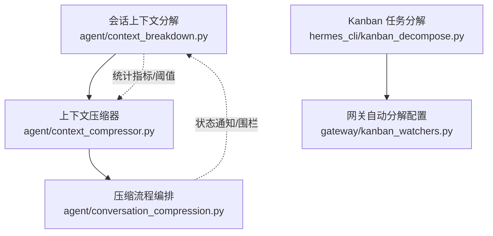
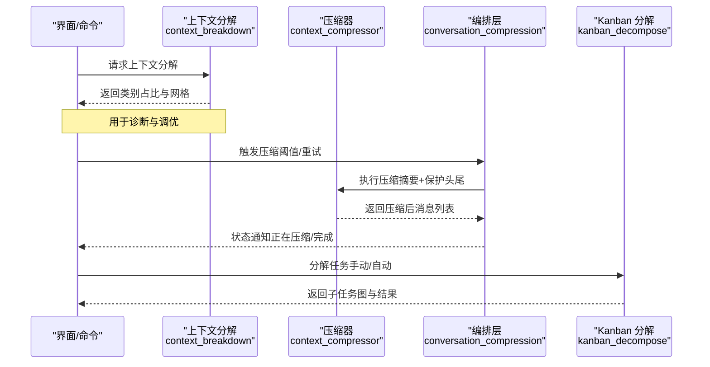
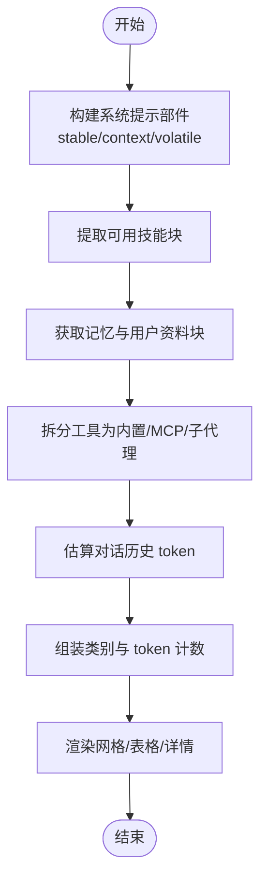
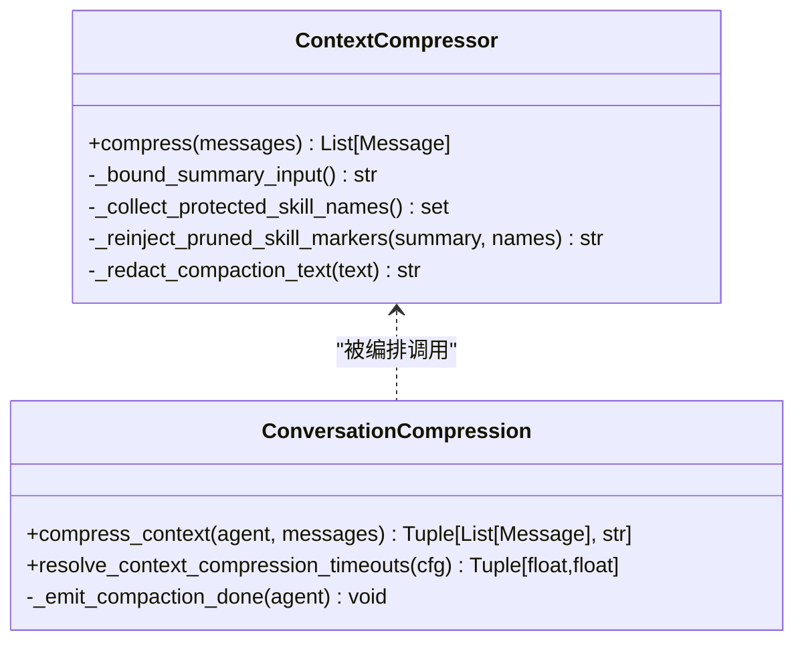
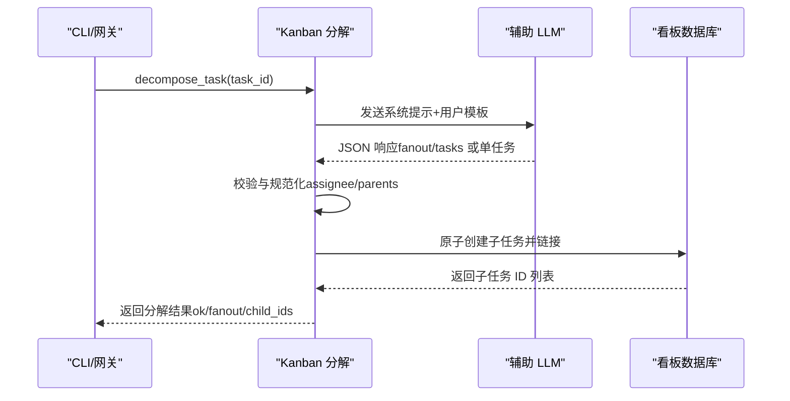
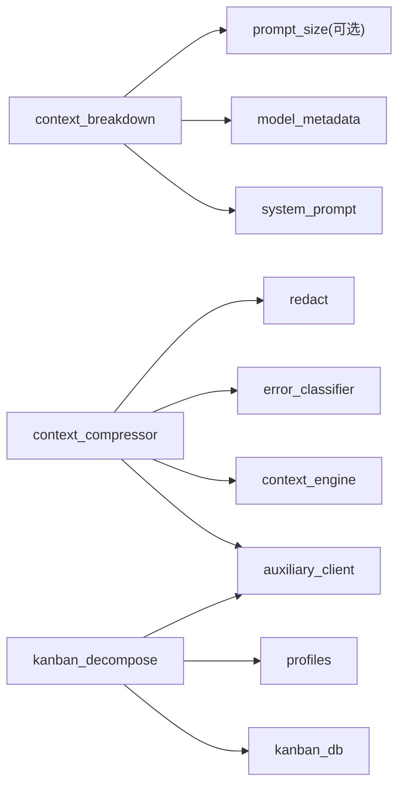

# 上下文分解机制

<cite>
**本文引用的文件**
- [agent/context_breakdown.py](file://agent/context_breakdown.py)
- [tests/agent/test_context_breakdown.py](file://tests/agent/test_context_breakdown.py)
- [agent/context_compressor.py](file://agent/context_compressor.py)
- [agent/conversation_compression.py](file://agent/conversation_compression.py)
- [hermes_cli/kanban_decompose.py](file://hermes_cli/kanban_decompose.py)
- [gateway/kanban_watchers.py](file://gateway/kanban_watchers.py)
</cite>

## 目录
1. [简介](#简介)
2. [项目结构](#项目结构)
3. [核心组件](#核心组件)
4. [架构总览](#架构总览)
5. [详细组件分析](#详细组件分析)
6. [依赖关系分析](#依赖关系分析)
7. [性能与内存管理](#性能与内存管理)
8. [故障排查指南](#故障排查指南)
9. [结论](#结论)
10. [附录](#附录)

## 简介
本文件系统性阐述“上下文分解机制”，覆盖以下目标：
- 算法原理：消息分组策略、主题识别技术、相关性分析。
- 长对话分解为多个逻辑单元的方法，以及保持语义连贯性的策略。
- 分解算法的配置项、性能考虑与内存管理策略。
- 自定义分解规则的具体示例（以代码片段路径引用）。
- 分解结果的数据结构与后续处理方式。
- 分解效果的评估方法与调优建议。

该机制由两部分组成：
- 会话级上下文分解与可视化：用于实时估算并展示下一轮请求的上下文构成（系统提示、工具定义、规则、技能、MCP、子代理、记忆、对话历史），帮助理解上下文占用与压缩触发点。
- Kanban 任务分解：将待办任务拆分为可并行执行的子任务图，按角色分配执行者，并在完成后唤醒根任务进行验收。

## 项目结构
围绕上下文分解的相关模块分布如下：
- agent/context_breakdown.py：会话上下文分解计算与渲染（CLI/Gateway 使用）。
- agent/context_compressor.py：运行时上下文压缩器（自动摘要、保护头尾、滚动摘要、失败回退等）。
- agent/conversation_compression.py：压缩流程编排、超时与提交围栏、状态通知等。
- hermes_cli/kanban_decompose.py：Kanban 任务分解（LLM 驱动的任务图生成与落库）。
- gateway/kanban_watchers.py：网关侧自动分解配置读取与调度入口。

图表来源
- [agent/context_breakdown.py:89-156](file://agent/context_breakdown.py#L89-L156)
- [agent/context_compressor.py:100-180](file://agent/context_compressor.py#L100-L180)
- [agent/conversation_compression.py:91-164](file://agent/conversation_compression.py#L91-L164)
- [hermes_cli/kanban_decompose.py:52-109](file://hermes_cli/kanban_decompose.py#L52-L109)
- [gateway/kanban_watchers.py:28-35](file://gateway/kanban_watchers.py#L28-L35)

章节来源
- [agent/context_breakdown.py:89-156](file://agent/context_breakdown.py#L89-L156)
- [agent/context_compressor.py:100-180](file://agent/context_compressor.py#L100-L180)
- [agent/conversation_compression.py:91-164](file://agent/conversation_compression.py#L91-L164)
- [hermes_cli/kanban_decompose.py:52-109](file://hermes_cli/kanban_decompose.py#L52-L109)
- [gateway/kanban_watchers.py:28-35](file://gateway/kanban_watchers.py#L28-L35)

## 核心组件
- 会话上下文分解（Context Breakdown）
  - 功能：估算并分类展示系统提示、工具定义、规则、技能、MCP、子代理、记忆、对话历史等对上下文窗口的占用；提供网格与表格渲染。
  - 关键函数：compute_session_context_breakdown、render_context_breakdown_lines、render_context_category_lines、render_context_grid。
- 上下文压缩器（Context Compressor）
  - 功能：在接近或超过上下文阈值时，对中间历史进行摘要压缩，保留头尾重要信息，维护滚动摘要与技能剪枝标记，处理失败回退与冷却期。
  - 关键常量与流程：SUMMARY_PREFIX、MICRO_COMPACT_MARKER_KEY、COMPRESSED_SUMMARY_METADATA_KEY、压缩输入上限、失败冷却、技能保护等。
- 压缩流程编排（Conversation Compression）
  - 功能：封装压缩调用、超时控制、提交围栏（Commit Fence）、状态通知、并发限制与池化执行。
- Kanban 任务分解（Kanban Decompose）
  - 功能：通过辅助 LLM 将 Triage 列中的任务拆解为子任务图（含父子依赖、角色分配），原子创建子任务并更新根任务状态；支持单任务精简模式。
  - 关键函数：decompose_task、_build_roster、_normalize_assignee_choice。

章节来源
- [agent/context_breakdown.py:89-156](file://agent/context_breakdown.py#L89-L156)
- [agent/context_compressor.py:100-180](file://agent/context_compressor.py#L100-L180)
- [agent/conversation_compression.py:91-164](file://agent/conversation_compression.py#L91-L164)
- [hermes_cli/kanban_decompose.py:271-456](file://hermes_cli/kanban_decompose.py#L271-L456)

## 架构总览
上下文分解机制贯穿“观察—决策—执行”闭环：
- 观察：会话上下文分解实时统计各部分 token 用量，输出可视化视图。
- 决策：当达到阈值或触发条件时，启动上下文压缩；同时 Kanban 任务分解根据配置自动或手动触发。
- 执行：压缩器生成摘要并合并到尾部，确保模型继续工作；任务分解生成子任务图并持久化，交由调度器执行。

图表来源
- [agent/context_breakdown.py:89-156](file://agent/context_breakdown.py#L89-L156)
- [agent/context_compressor.py:100-180](file://agent/context_compressor.py#L100-L180)
- [agent/conversation_compression.py:91-164](file://agent/conversation_compression.py#L91-L164)
- [hermes_cli/kanban_decompose.py:271-456](file://hermes_cli/kanban_decompose.py#L271-L456)

## 详细组件分析

### 会话上下文分解（Context Breakdown）
- 算法要点
  - 系统提示拆分：稳定/上下文/易变三部分，剥离技能块与记忆块，得到核心与尾部文本。
  - 工具分类：内置工具、MCP 工具、子代理工具分别统计。
  - 对话历史估算：采用近似 token 估算（字符/4 启发式），与压缩阈值对齐。
  - 输出结构：类别列表（id、label、tokens、color）、上下文最大容量、已用与估计总量、模型标识。
- 渲染能力
  - 网格视图：5×20 单元格，每格代表 1% 上下文窗口，按类别比例填充。
  - 表格视图：按类别列出 token 数与百分比，显示剩余空间。
  - 详情视图：按技能与工具集展开成本明细（索引行与 SKILL.md 内容）。

图表来源
- [agent/context_breakdown.py:89-156](file://agent/context_breakdown.py#L89-L156)
- [agent/context_breakdown.py:190-229](file://agent/context_breakdown.py#L190-L229)
- [agent/context_breakdown.py:232-360](file://agent/context_breakdown.py#L232-L360)

章节来源
- [agent/context_breakdown.py:89-156](file://agent/context_breakdown.py#L89-L156)
- [agent/context_breakdown.py:190-229](file://agent/context_breakdown.py#L190-L229)
- [agent/context_breakdown.py:232-360](file://agent/context_breakdown.py#L232-L360)
- [tests/agent/test_context_breakdown.py:34-50](file://tests/agent/test_context_breakdown.py#L34-L50)
- [tests/agent/test_context_breakdown.py:83-127](file://tests/agent/test_context_breakdown.py#L83-L127)

### 上下文压缩器（Context Compressor）
- 算法要点
  - 保护区域：头部（系统提示、前几轮）与尾部（最近若干轮）不被压缩。
  - 中间区域压缩：对中间历史进行摘要，保留活跃任务快照、待解决问题、历史任务等结构化标题。
  - 滚动摘要：多轮压缩迭代更新摘要，避免重复丢失信息。
  - 技能保护：检测 skill_view 调用与最近加载的技能，防止指令被剪枝导致“幽灵技能”。
  - 失败回退：当摘要 LLM 不可用时，使用确定性回退（保留锚点与少量上下文）。
  - 元数据标记：压缩摘要携带专用键，便于前端区分与过滤。
- 配置与阈值
  - 摘要长度比例与上限、输入字符上限、最小摘要 token、失败冷却时间、小窗口模型阈值调整等。

图表来源
- [agent/context_compressor.py:100-180](file://agent/context_compressor.py#L100-L180)
- [agent/context_compressor.py:417-443](file://agent/context_compressor.py#L417-L443)
- [agent/context_compressor.py:764-782](file://agent/context_compressor.py#L764-L782)
- [agent/conversation_compression.py:91-164](file://agent/conversation_compression.py#L91-L164)
- [agent/conversation_compression.py:776-800](file://agent/conversation_compression.py#L776-L800)

章节来源
- [agent/context_compressor.py:100-180](file://agent/context_compressor.py#L100-L180)
- [agent/context_compressor.py:417-443](file://agent/context_compressor.py#L417-L443)
- [agent/context_compressor.py:764-782](file://agent/context_compressor.py#L764-L782)
- [agent/conversation_compression.py:91-164](file://agent/conversation_compression.py#L91-L164)
- [agent/conversation_compression.py:776-800](file://agent/conversation_compression.py#L776-L800)

### Kanban 任务分解（Kanban Decompose）
- 算法要点
  - 输入：任务 ID、标题、正文、可用角色清单（名称+描述）、默认分配者。
  - LLM 输出：JSON 对象，包含 fanout（是否拆分）、rationale、tasks（子任务数组）或单任务精简字段。
  - 子任务规范：title、body、assignee（从角色清单选择或回退到默认）、parents（依赖索引）。
  - 校验与规范化：清理父索引、重写无效 assignee、保证无未分配任务。
  - 持久化：原子创建子任务、链接父关系、翻转根任务状态（triage→todo）。
- 配置项
  - orchestrator_profile：根/编排任务的角色。
  - default_assignee：无法匹配时的默认分配者。
  - auto_promote_children：是否自动提升子任务。

图表来源
- [hermes_cli/kanban_decompose.py:52-109](file://hermes_cli/kanban_decompose.py#L52-L109)
- [hermes_cli/kanban_decompose.py:271-456](file://hermes_cli/kanban_decompose.py#L271-L456)
- [gateway/kanban_watchers.py:28-35](file://gateway/kanban_watchers.py#L28-L35)

章节来源
- [hermes_cli/kanban_decompose.py:52-109](file://hermes_cli/kanban_decompose.py#L52-L109)
- [hermes_cli/kanban_decompose.py:271-456](file://hermes_cli/kanban_decompose.py#L271-L456)
- [gateway/kanban_watchers.py:28-35](file://gateway/kanban_watchers.py#L28-L35)

## 依赖关系分析
- 上下文分解依赖
  - system_prompt：构建系统提示部件（稳定/上下文/易变）。
  - model_metadata：估算消息 token。
  - prompt_size（可选）：技能与工具集成本明细。
- 压缩器依赖
  - auxiliary_client：辅助模型调用（摘要生成）。
  - context_engine：上下文引擎与记忆上下文清洗。
  - error_classifier：错误分类（鉴权/配额/速率限制）。
  - redact：敏感信息脱敏（强制模式）。
- Kanban 分解依赖
  - kanban_db：任务查询/创建/链接。
  - profiles：角色清单与有效性校验。
  - auxiliary_client：辅助 LLM 调用（任务图生成）。

图表来源
- [agent/context_breakdown.py:89-156](file://agent/context_breakdown.py#L89-L156)
- [agent/context_compressor.py:100-180](file://agent/context_compressor.py#L100-L180)
- [hermes_cli/kanban_decompose.py:271-456](file://hermes_cli/kanban_decompose.py#L271-L456)

章节来源
- [agent/context_breakdown.py:89-156](file://agent/context_breakdown.py#L89-L156)
- [agent/context_compressor.py:100-180](file://agent/context_compressor.py#L100-L180)
- [hermes_cli/kanban_decompose.py:271-456](file://hermes_cli/kanban_decompose.py#L271-L456)

## 性能与内存管理
- 性能特性
  - 近似 token 估算：字符/4 启发式，快速且与压缩阈值一致。
  - 摘要输入上限：限制压缩器输入字符数，避免慢后端超时或上下文溢出。
  - 并发与池化：压缩流程使用有限线程池，防止阻塞与队列膨胀。
  - 失败冷却：避免频繁失败的摘要调用造成抖动。
- 内存管理
  - 保护头尾：减少不必要复制与丢弃，降低 GC 压力。
  - 持久化标记清理：压缩过程中移除会话存储标记，避免重复写入。
  - 技能剪枝标记：精准恢复被摘要忽略的技能指令，避免重复加载。
- 配置优化建议
  - 调整摘要比例与上限，平衡质量与速度。
  - 设置小窗口模型的阈值下限，减少频繁压缩。
  - 合理配置角色清单与默认分配者，提高任务分解准确率。

章节来源
- [agent/context_compressor.py:417-443](file://agent/context_compressor.py#L417-L443)
- [agent/conversation_compression.py:776-800](file://agent/conversation_compression.py#L776-L800)
- [agent/context_breakdown.py:89-156](file://agent/context_breakdown.py#L89-L156)

## 故障排查指南
- 常见问题
  - 摘要 LLM 不可用：检查辅助客户端配置与网络，查看失败冷却与回退路径。
  - 角色无效：Kanban 分解中 assignee 不在角色清单，将被回退到默认分配者。
  - 父索引越界：清理非整数或越界的 parents，确保依赖合法。
  - 上下文过大：确认压缩阈值与模型上下文长度，必要时调整策略。
- 调试步骤
  - 使用 /context 命令查看当前上下文构成与占比。
  - 启用日志记录，关注压缩状态通知与错误信息。
  - 检查 Kanban 配置（orchestrator_profile、default_assignee、auto_promote_children）。

章节来源
- [agent/context_compressor.py:100-180](file://agent/context_compressor.py#L100-L180)
- [hermes_cli/kanban_decompose.py:271-456](file://hermes_cli/kanban_decompose.py#L271-L456)
- [agent/conversation_compression.py:91-164](file://agent/conversation_compression.py#L91-L164)

## 结论
上下文分解机制通过“观察—决策—执行”的闭环，实现了会话上下文的可视化与自适应压缩，以及任务的可分解与可执行化。开发者可根据业务需求调整配置与策略，优化性能与效果。

## 附录
- 自定义分解规则示例（代码片段路径）
  - 会话上下文分解：参考 compute_session_context_breakdown 的实现与测试用例。
  - Kanban 任务分解：参考 decompose_task 的系统提示与用户模板，以及角色清单构建与归一化逻辑。
- 分解结果数据结构
  - 会话上下文分解：categories（id、label、tokens、color）、context_max、context_used、estimated_total、model。
  - Kanban 任务分解：fanout、rationale、tasks（title、body、assignee、parents）或单任务精简字段。
- 后续处理方式
  - 会话上下文分解：用于 UI 展示与诊断，指导压缩阈值与策略调整。
  - Kanban 任务分解：原子创建子任务并链接，交由调度器执行，完成后唤醒根任务验收。

章节来源
- [agent/context_breakdown.py:89-156](file://agent/context_breakdown.py#L89-L156)
- [hermes_cli/kanban_decompose.py:271-456](file://hermes_cli/kanban_decompose.py#L271-L456)
- [tests/agent/test_context_breakdown.py:34-50](file://tests/agent/test_context_breakdown.py#L34-L50)