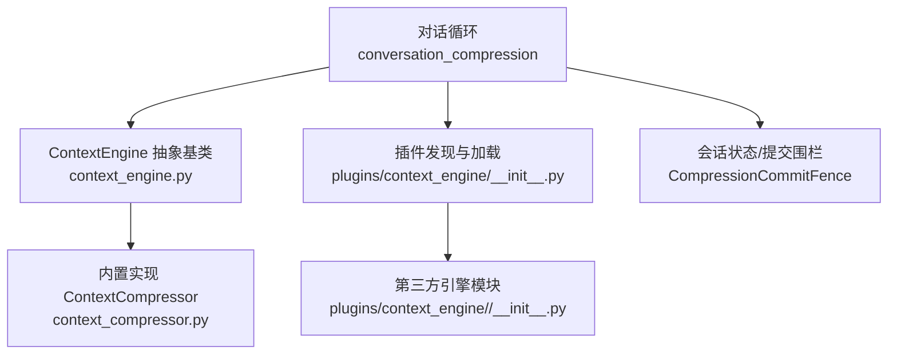
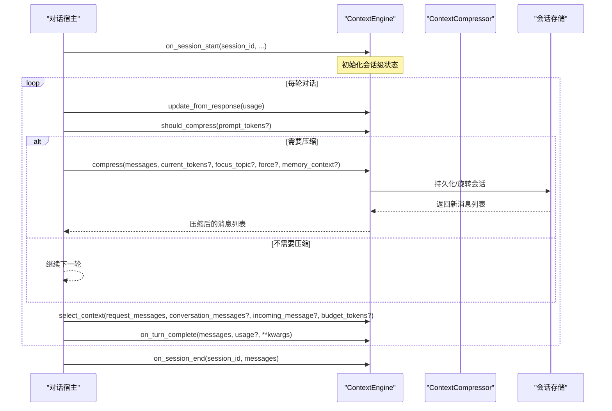
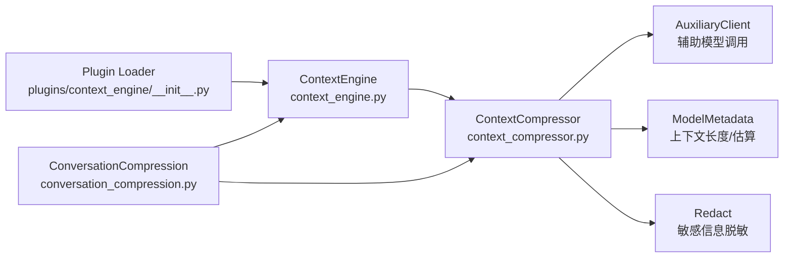

# 上下文引擎核心

<cite>
**本文引用的文件**
- [agent/context_engine.py](file://agent/context_engine.py)
- [agent/context_compressor.py](file://agent/context_compressor.py)
- [plugins/context_engine/__init__.py](file://plugins/context_engine/__init__.py)
- [agent/conversation_compression.py](file://agent/conversation_compression.py)
- [tests/agent/test_context_engine.py](file://tests/agent/test_context_engine.py)
</cite>

## 目录
1. [简介](#简介)
2. [项目结构](#项目结构)
3. [核心组件](#核心组件)
4. [架构总览](#架构总览)
5. [详细组件分析](#详细组件分析)
6. [依赖关系分析](#依赖关系分析)
7. [性能考量](#性能考量)
8. [故障排查指南](#故障排查指南)
9. [结论](#结论)
10. [附录：自定义引擎开发指南](#附录自定义引擎开发指南)

## 简介
本文件聚焦“上下文引擎”的核心设计与实现，围绕 ContextEngine 抽象基类展开，系统阐述其生命周期管理、令牌使用跟踪、压缩触发机制与会话状态管理；解释引擎的注册机制、插件系统接口与配置驱动的选择逻辑；深入解析 update_from_response()、should_compress()、compress() 等核心方法，以及 should_select_context()（以 select_context() 形式提供）和 on_turn_complete() 等新特性的使用方法。同时给出如何自定义上下文引擎的实践示例路径、引擎间通信协议与数据传递机制说明，并提供最佳实践与性能优化建议。

## 项目结构
上下文引擎由以下关键部分组成：
- 抽象基类与通用工具：定义统一接口、默认行为与辅助函数
- 内置实现：基于摘要的自动压缩器
- 插件发现与加载：扫描并动态加载第三方上下文引擎
- 调用编排：在对话循环中按阶段调用引擎方法，处理超时、提交边界与状态同步

图表来源
- [agent/context_engine.py:89-490](file://agent/context_engine.py#L89-L490)
- [agent/context_compressor.py:1-800](file://agent/context_compressor.py#L1-L800)
- [plugins/context_engine/__init__.py:33-196](file://plugins/context_engine/__init__.py#L33-L196)
- [agent/conversation_compression.py:445-691](file://agent/conversation_compression.py#L445-L691)

章节来源
- [agent/context_engine.py:1-490](file://agent/context_engine.py#L1-L490)
- [plugins/context_engine/__init__.py:1-286](file://plugins/context_engine/__init__.py#L1-L286)
- [agent/conversation_compression.py:1-800](file://agent/conversation_compression.py#L1-L800)

## 核心组件
- ContextEngine 抽象基类：定义所有上下文引擎必须实现的接口与默认行为，包括身份标识、令牌跟踪字段、压缩参数、核心方法、可选钩子、工具暴露、状态展示与模型切换支持。
- ContextCompressor 内置实现：负责将超长对话进行摘要压缩，保护头部与尾部，维护历史摘要，执行工具结果剪枝，处理失败回退与冷却期等。
- 插件发现与加载：扫描 plugins/context_engine 目录，支持 register(ctx) 模式或导出 ContextEngine 子类实例，完成可用性检查与命令注册桥接。
- 对话压缩编排：在对话循环中按阶段调用引擎方法，处理预检、压缩、提交围栏、超时与重试，以及与记忆提供者/插件系统的交互。

章节来源
- [agent/context_engine.py:89-490](file://agent/context_engine.py#L89-L490)
- [agent/context_compressor.py:1-800](file://agent/context_compressor.py#L1-L800)
- [plugins/context_engine/__init__.py:33-196](file://plugins/context_engine/__init__.py#L33-L196)
- [agent/conversation_compression.py:1-800](file://agent/conversation_compression.py#L1-L800)

## 架构总览
上下文引擎在对话生命周期中的调用时序如下：

图表来源
- [agent/context_engine.py:133-410](file://agent/context_engine.py#L133-L410)
- [agent/conversation_compression.py:1-800](file://agent/conversation_compression.py#L1-L800)

## 详细组件分析

### ContextEngine 抽象基类
- 身份与状态字段
  - name：引擎短标识
  - last_prompt_tokens / last_completion_tokens / last_total_tokens / threshold_tokens / context_length / compression_count：供宿主读取用于显示与日志
  - threshold_percent / protect_first_n / protect_last_n：控制预检与压缩保护策略
  - emit_automatic_compaction_status：是否输出自动压缩的生命周期状态
- 核心方法
  - update_from_response(usage)：更新令牌使用统计，兼容新旧键名
  - should_compress(prompt_tokens=None)：判断本轮是否需要压缩
  - should_compress_info(prompt_tokens=None)：返回 (bool, reason)，便于向用户提示阻塞原因
  - compress(messages, current_tokens=None, focus_topic=None, force=False, memory_context="")：执行压缩，返回新的消息序列
  - prune_tool_results_only(messages, current_tokens=None)：低成本剪枝旧工具结果，避免 LLM 调用
  - select_context(request_messages, conversation_messages=None, incoming_message=None, budget_tokens=0)：为本次请求选择/替换上下文（非持久化）
  - on_turn_complete(messages, usage=None, **kwargs)：观察一轮完成的最终转录快照，用于索引/路由/主题/会话状态更新
- 可选钩子
  - should_compress_preflight(messages)：快速预检
  - should_defer_preflight_to_real_usage(rough_tokens)：是否延后到真实用量再决定
  - get_automatic_compaction_status_message(phase, default_message, **context)：定制自动压缩状态文案
  - has_content_to_compress(messages)：/compress 命令前快速判断是否有可压缩内容
- 会话生命周期
  - on_session_start(session_id, **kwargs)：会话开始
  - on_session_end(session_id, messages)：会话结束
  - on_session_reset()：重置计数与追踪
- 工具与状态
  - get_tool_schemas() / handle_tool_call(name, args, **kwargs)：暴露引擎工具
  - get_status()：标准状态字典
  - update_model(model, context_length, base_url="", api_key="", provider="", api_mode="")：模型切换时更新阈值与上下文长度

章节来源
- [agent/context_engine.py:89-490](file://agent/context_engine.py#L89-L490)

### 内置实现：ContextCompressor
- 职责
  - 使用辅助模型对中间对话进行摘要，保护头部与尾部
  - 维护滚动摘要与历史任务快照，确保摘要不成为活跃指令
  - 工具结果剪枝、技能视图结果保护、图片/媒体指令过滤
  - 失败回退、冷却期、反抖动与可行性跳过
- 关键常量与策略
  - 摘要前缀与分隔符、历史标题、最小摘要 token、比例与上限
  - 微压缩失败保护、输入字符上限、技能丢失标记与恢复
  - 小上下文窗口阈值下界、压力下的尾部保留策略
- 安全与合规
  - 摘要边界文本强制脱敏（含 URL 凭据）
  - 元数据键下划线前缀以避免透传到外部网关导致拒绝
- 与宿主协作
  - 通过 ConversationCompression 编排，参与提交围栏、超时、重试与状态上报

章节来源
- [agent/context_compressor.py:1-800](file://agent/context_compressor.py#L1-L800)

### 插件系统与引擎选择
- 插件发现
  - 扫描 plugins/context_engine/<name>/ 目录，读取 plugin.yaml 描述，尝试 is_available() 检查
- 加载策略
  - 优先支持 register(ctx) 模式，其次查找导出 ContextEngine 子类并实例化
  - 支持相对导入与子模块注册，错误时记录日志并降级
- 命令桥接
  - 引擎可通过 ctx.register_command(...) 注册斜杠命令，冲突时跳过并记录警告
- 配置驱动选择
  - 通过配置文件 context.engine 指定激活的引擎名称，默认 "compressor"

章节来源
- [plugins/context_engine/__init__.py:33-196](file://plugins/context_engine/__init__.py#L33-L196)

### 对话压缩编排与提交围栏
- 编排流程
  - 启动探测辅助压缩模型可行性
  - 预检与实时用量决策
  - 调用引擎压缩，拆分 SQLite 会话、旋转 session_id，通知插件/记忆提供者
  - 图像过大时的重编码重试
- 线程安全与超时
  - 压缩在独立线程池执行，具备进度感知超时与总上限
  - CompressionCommitFence 保证提交边界的原子性，支持取消、撤销准入、锁释放钩子
- 状态与遥测
  - 记录压缩尝试状态、冷却期、失败回退、主动剪枝重装 token 等
  - 发布结构化终态事件，供前端/网关识别“正在压缩/已完成”

章节来源
- [agent/conversation_compression.py:1-800](file://agent/conversation_compression.py#L1-L800)

## 依赖关系分析
- ContextEngine 被对话循环与内置压缩器共同依赖，作为统一扩展点
- ContextCompressor 依赖辅助模型客户端、模型元数据、脱敏工具与错误分类
- 插件发现模块依赖文件系统与动态导入，桥接全局命令注册表
- 对话压缩编排依赖线程池、会话存储、活动溯源与状态回调

图表来源
- [agent/context_engine.py:89-490](file://agent/context_engine.py#L89-L490)
- [agent/context_compressor.py:1-800](file://agent/context_compressor.py#L1-L800)
- [plugins/context_engine/__init__.py:33-196](file://plugins/context_engine/__init__.py#L33-L196)
- [agent/conversation_compression.py:1-800](file://agent/conversation_compression.py#L1-L800)

章节来源
- [agent/context_engine.py:89-490](file://agent/context_engine.py#L89-L490)
- [agent/context_compressor.py:1-800](file://agent/context_compressor.py#L1-L800)
- [plugins/context_engine/__init__.py:33-196](file://plugins/context_engine/__init__.py#L33-L196)
- [agent/conversation_compression.py:1-800](file://agent/conversation_compression.py#L1-L800)

## 性能考量
- 令牌跟踪与阈值计算
  - 通过 update_from_response 及时更新 last_prompt_tokens 等，结合 threshold_percent 与 context_length 计算 threshold_tokens，减少不必要的压缩
- 预检与可行性跳过
  - should_compress_preflight 与 should_defer_preflight_to_real_usage 降低无效 LLM 调用
  - 当可压缩中间段低于阈值比例且存在先前无效压缩记录时，直接跳过摘要
- 低成本剪枝
  - prune_tool_results_only 在不调用 LLM 的情况下回收旧工具结果，缓解长窗口引擎的压力
- 摘要预算与输入限制
  - 摘要 token 比例与上限、输入字符上限防止慢后端超时
- 并发与超时
  - 线程池大小限制、进度感知超时、总上限与提交围栏避免长时间占用资源
- 缓存友好
  - select_context 在 prompt 缓存控制之前运行，保持默认无操作时的字节一致性，避免破坏缓存前缀

[本节为通用指导，不直接分析具体文件]

## 故障排查指南
- 压缩被阻塞
  - 若上下文超过阈值但压缩被阻止（如摘要模型冷却/防抖），会发出可见警告，建议 /new 或 /compress 重试
- 摘要失败与回退
  - 认证/配额错误会被识别为非重试错误；失败时会进入冷却期并使用回退摘要策略
- 提交围栏超时
  - 若压缩线程卡住，提交围栏允许主机撤销准入并等待已开始的提交完成，避免悬挂写入
- 插件加载失败
  - 插件目录不存在、模块执行异常或缺少 ContextEngine 实例时，记录警告并返回 None
- 工具结果泄露
  - 摘要边界文本强制脱敏，URL 凭据也会被清理，避免泄漏到后续提示

章节来源
- [agent/conversation_compression.py:115-180](file://agent/conversation_compression.py#L115-L180)
- [agent/context_compressor.py:73-95](file://agent/context_compressor.py#L73-L95)
- [plugins/context_engine/__init__.py:89-97](file://plugins/context_engine/__init__.py#L89-L97)

## 结论
ContextEngine 抽象基类提供了统一的上下文管理扩展点，配合内置的 ContextCompressor 实现了高可用、可配置的自动压缩能力。插件系统使第三方引擎可无缝接入，对话编排层则保证了线程安全、超时控制与提交边界的一致性。通过 select_context 与 on_turn_complete 等新特性，引擎可在请求前选择上下文并在回合结束后观察最终转录，从而构建更智能的主题路由与状态维护。遵循本文的最佳实践与性能建议，开发者可以高效地实现自定义上下文引擎，提升长对话场景下的稳定性与成本效率。

[本节为总结，不直接分析具体文件]

## 附录：自定义引擎开发指南

### 设计要点
- 实现必要接口
  - name、update_from_response、should_compress、compress
  - 可选：select_context、on_turn_complete、prune_tool_results_only、get_tool_schemas/handle_tool_call
- 令牌跟踪
  - 在 update_from_response 中更新 last_prompt_tokens 等字段，确保 should_compress 能基于真实用量决策
- 压缩策略
  - 合理设置 threshold_percent、protect_first_n、protect_last_n
  - 实现 should_compress_info 以便向用户报告阻塞原因
- 上下文选择与观察
  - select_context 用于为单次请求选择上下文（不持久化）
  - on_turn_complete 用于索引/路由/主题/会话状态更新，配合下一次 select_context
- 工具暴露
  - 通过 get_tool_schemas 声明工具，handle_tool_call 处理调用并返回 JSON 字符串
- 会话生命周期
  - on_session_start/on_session_end/on_session_reset 管理会话级状态
- 模型切换
  - update_model 中根据 model/context_length 重新计算阈值与上下文长度

### 代码示例路径
- 最小实现参考（测试中的 StubEngine）：[tests/agent/test_context_engine.py:15-63](file://tests/agent/test_context_engine.py#L15-L63)
- 内置实现参考（ContextCompressor）：[agent/context_compressor.py:1-800](file://agent/context_compressor.py#L1-L800)
- 插件加载与命令注册：[plugins/context_engine/__init__.py:175-286](file://plugins/context_engine/__init__.py#L175-L286)

### 引擎间通信与数据传递
- 消息格式
  - 所有引擎均使用 OpenAI 格式的消息列表进行输入/输出
- 选择与压缩的区别
  - select_context：为本次请求选择/替换上下文，不影响持久化历史
  - compress：压缩历史，可能改变持久化的会话内容
- 状态共享
  - 通过 ContextEngine 的属性（如 last_prompt_tokens、threshold_tokens 等）与宿主共享状态
- 工具调用
  - 引擎通过 get_tool_schemas 暴露工具，宿主在工具调度时调用 handle_tool_call

### 最佳实践
- 避免滥用 should_compress/compress 作为通用回调，优先使用 select_context 与 on_turn_complete
- 实现低成本剪枝 prune_tool_results_only，减少 LLM 调用
- 合理使用摘要预算与输入限制，防止慢后端超时
- 在 on_turn_complete 中维护轻量索引/路由，提高 select_context 的准确性
- 遵循提交围栏与超时契约，避免悬挂写入与资源占用

[本节为通用指导，不直接分析具体文件]