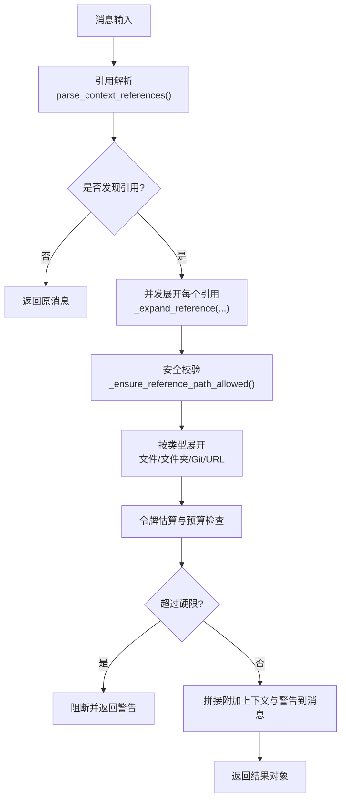
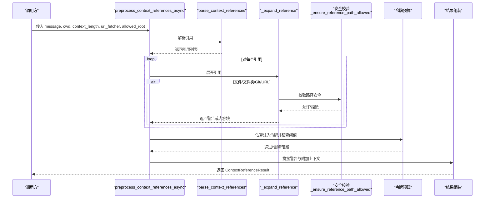
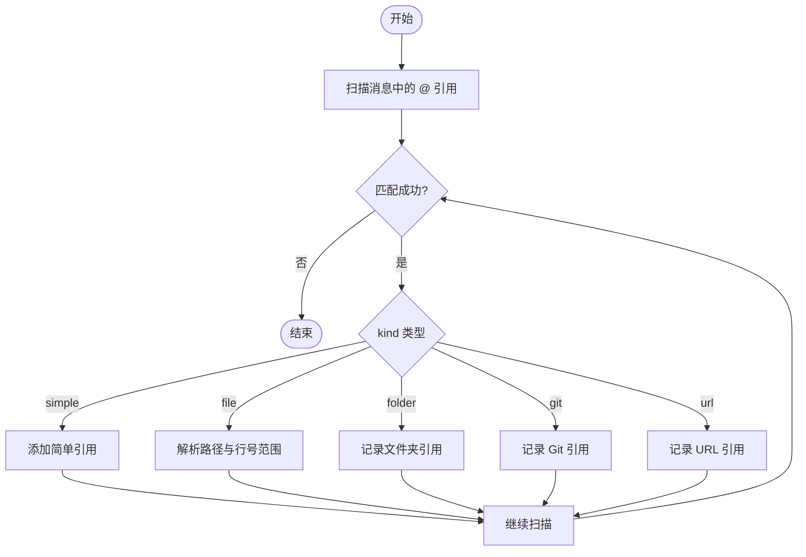
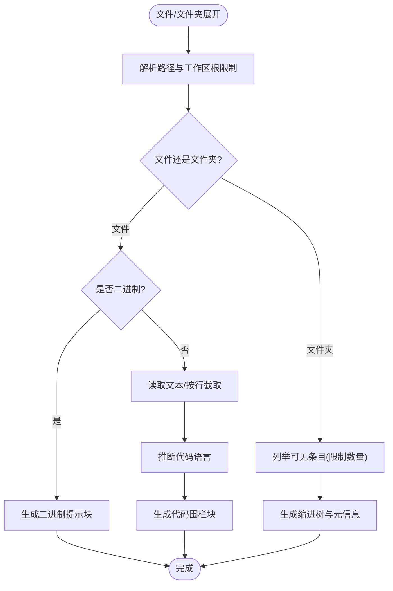
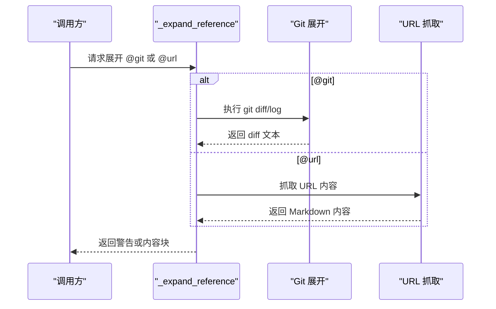
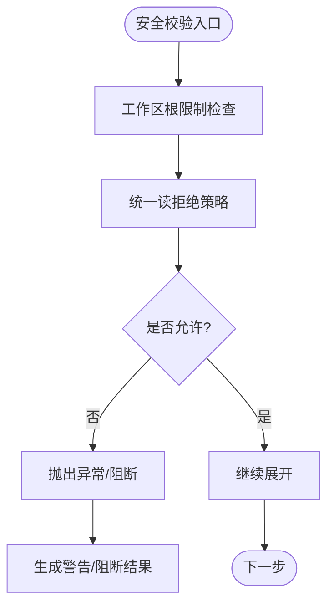
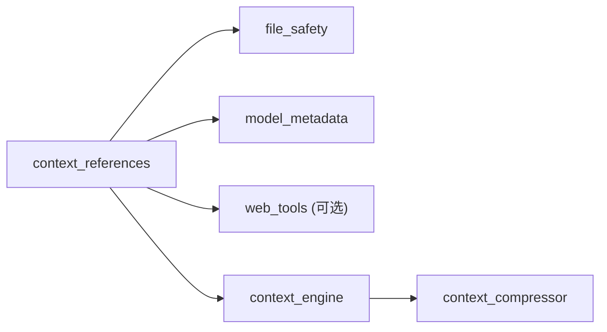

# 上下文引用解析

<cite>
**本文引用的文件**
- [agent/context_references.py](file://agent/context_references.py)
- [agent/file_safety.py](file://agent/file_safety.py)
- [agent/context_engine.py](file://agent/context_engine.py)
- [agent/context_compressor.py](file://agent/context_compressor.py)
</cite>

## 目录
1. [简介](#简介)
2. [项目结构](#项目结构)
3. [核心组件](#核心组件)
4. [架构总览](#架构总览)
5. [详细组件分析](#详细组件分析)
6. [依赖关系分析](#依赖关系分析)
7. [性能与并发](#性能与并发)
8. [故障排查指南](#故障排查指南)
9. [结论](#结论)
10. [附录：使用示例与配置扩展](#附录使用示例与配置扩展)

## 简介
本文件系统性说明“上下文引用解析”的工作原理，覆盖引用格式规范、解析算法、错误处理机制、安全校验、缓存与性能优化、并发安全考虑，以及如何在工具调用中使用上下文引用。重点围绕以下能力：
- 从对话消息中识别并解析 @ 引用（文件、文件夹、Git diff/staged/log、URL）。
- 将引用安全地展开为可注入上下文的文本块，并进行令牌预算控制。
- 通过统一的安全策略拒绝敏感路径读取，防止凭据泄露。
- 提供可扩展的 URL 抓取器与可选的工作区根限制，便于集成外部资源。
- 在压缩/选择上下文的流程中与上下文引擎协作，确保整体上下文窗口可控。

## 项目结构
与上下文引用解析直接相关的代码集中在 agent 包内：
- context_references.py：引用解析、展开、安全校验、令牌预算、URL 抓取、二进制/文件夹列举等核心逻辑。
- file_safety.py：统一的读/写安全策略与敏感路径拦截，被引用解析复用。
- context_engine.py：上下文引擎抽象，定义压缩/选择钩子，供上层决定何时压缩或选择上下文。
- context_compressor.py：内置压缩实现，负责摘要生成、历史保留、敏感信息脱敏等。

图表来源
- [agent/context_references.py:80-236](file://agent/context_references.py#L80-L236)
- [agent/context_references.py:239-370](file://agent/context_references.py#L239-L370)
- [agent/file_safety.py:194-337](file://agent/file_safety.py#L194-L337)

章节来源
- [agent/context_references.py:1-622](file://agent/context_references.py#L1-L622)
- [agent/file_safety.py:1-694](file://agent/file_safety.py#L1-L694)

## 核心组件
- 引用数据结构
  - ContextReference：描述一条原始引用及其位置、类型和目标。
  - ContextReferenceResult：封装解析后的消息、原始消息、引用列表、警告、注入令牌数、是否扩展/阻断等。
- 解析与展开
  - parse_context_references：基于正则匹配 @ 引用，支持简单类型（diff/staged）和带 kind 的引用（file/folder/git/url），并解析行号范围。
  - preprocess_context_references / preprocess_context_references_async：入口函数，负责并发展开、令牌预算、组装最终消息。
  - _expand_reference：根据 kind 分派到具体展开器。
- 安全与路径
  - _resolve_path：相对路径解析与工作区根限制。
  - _ensure_reference_path_allowed：结合本地敏感目录与统一 read deny-list，阻止敏感文件/目录读取。
- 资源获取
  - 文件：按行范围截取或全文读取，标注代码语言。
  - 文件夹：递归列出可见条目，限制数量。
  - Git：执行 git diff/diff --staged/log，捕获输出。
  - URL：默认通过 web_extract_tool 抓取 Markdown 内容，支持自定义异步抓取器。
- 令牌预算
  - 使用 estimate_tokens_rough 估算注入内容大小，设置软/硬阈值（25%/50% of context_length），超限则告警或阻断。

章节来源
- [agent/context_references.py:43-63](file://agent/context_references.py#L43-L63)
- [agent/context_references.py:80-120](file://agent/context_references.py#L80-L120)
- [agent/context_references.py:123-236](file://agent/context_references.py#L123-L236)
- [agent/context_references.py:239-370](file://agent/context_references.py#L239-L370)
- [agent/context_references.py:372-434](file://agent/context_references.py#L372-L434)
- [agent/context_references.py:455-489](file://agent/context_references.py#L455-L489)
- [agent/context_references.py:491-555](file://agent/context_references.py#L491-L555)
- [agent/context_references.py:558-622](file://agent/context_references.py#L558-L622)

## 架构总览
上下文引用解析作为“消息预处理层”，在会话进入 LLM 之前对消息进行增强：
- 输入：用户消息（可能包含 @ 引用）。
- 处理：解析 → 并发展开 → 安全校验 → 令牌预算 → 附加上下文与警告。
- 输出：增强后的消息 + 结构化结果（引用、警告、注入令牌数、是否阻断）。

图表来源
- [agent/context_references.py:123-236](file://agent/context_references.py#L123-L236)
- [agent/context_references.py:239-370](file://agent/context_references.py#L239-L370)
- [agent/file_safety.py:194-337](file://agent/file_safety.py#L194-L337)

## 详细组件分析

### 引用格式规范与解析算法
- 支持的引用类型
  - 简单类型：@diff、@staged（无需目标值）。
  - 带类型前缀：@file:...、@folder:...、@git:...、@url:...
- 值语法
  - 支持用反引号、单引号、双引号包裹值以容纳空格与特殊字符。
  - 文件引用支持行号范围：path:start-end 或 path:start。
- 解析流程
  - 使用正则匹配所有 @ 引用，提取 kind/value/line ranges。
  - 剥离尾部标点与引用包装符，得到干净的目标字符串。
  - 针对 file 类型进一步解析路径与行号范围。

图表来源
- [agent/context_references.py:18-24](file://agent/context_references.py#L18-L24)
- [agent/context_references.py:80-120](file://agent/context_references.py#L80-L120)
- [agent/context_references.py:455-479](file://agent/context_references.py#L455-L479)

章节来源
- [agent/context_references.py:18-24](file://agent/context_references.py#L18-L24)
- [agent/context_references.py:80-120](file://agent/context_references.py#L80-L120)
- [agent/context_references.py:455-479](file://agent/context_references.py#L455-L479)

### 文件与文件夹展开
- 文件展开
  - 解析绝对/相对路径，应用工作区根限制。
  - 若为二进制文件，不内联文本，而是返回提示块，告知可用路径与工具操作建议。
  - 若指定行号范围，仅截取对应行；否则读取全文。
  - 自动推断代码语言用于标记代码围栏。
- 文件夹展开
  - 优先尝试 rg 快速列举，失败回退到 os.walk。
  - 过滤隐藏目录与缓存目录，限制条目数量，避免过大上下文。
  - 输出缩进树形结构，附带文件大小或行数元信息。

图表来源
- [agent/context_references.py:269-317](file://agent/context_references.py#L269-L317)
- [agent/context_references.py:481-555](file://agent/context_references.py#L481-L555)
- [agent/context_references.py:558-622](file://agent/context_references.py#L558-L622)

章节来源
- [agent/context_references.py:269-317](file://agent/context_references.py#L269-L317)
- [agent/context_references.py:481-555](file://agent/context_references.py#L481-L555)
- [agent/context_references.py:558-622](file://agent/context_references.py#L558-L622)

### Git 与 URL 展开
- Git 展开
  - 支持 diff、staged、log（可指定条数）。
  - 通过 subprocess 调用 git，设置超时与平台相关参数。
  - 捕获输出并包装为 diff 代码围栏块；空输出时给出占位提示。
- URL 展开
  - 默认通过 web_extract_tool 抓取网页并转为 Markdown。
  - 支持自定义同步/异步抓取器，便于替换为自有抓取服务。
  - 无内容时返回警告提示。

图表来源
- [agent/context_references.py:320-346](file://agent/context_references.py#L320-L346)
- [agent/context_references.py:348-370](file://agent/context_references.py#L348-L370)

章节来源
- [agent/context_references.py:320-346](file://agent/context_references.py#L320-L346)
- [agent/context_references.py:348-370](file://agent/context_references.py#L348-L370)

### 安全校验与错误处理
- 路径安全
  - 工作区根限制：防止引用逃逸到允许区域之外。
  - 敏感目录/文件黑名单：包括常见凭据存储与 Hermes 内部目录。
  - 统一读拒绝策略：复用 file_safety.get_read_block_error，覆盖更多凭据与项目 .env 文件。
- 错误处理
  - 文件不存在/非文件/非目录：返回明确警告。
  - 二进制文件：不内联文本，返回可操作提示。
  - Git 命令失败/超时：返回错误信息。
  - URL 抓取失败：返回无内容警告。
  - 安全校验失败：抛出 ValueError，由上层捕获并转换为阻断/警告。

图表来源
- [agent/context_references.py:372-434](file://agent/context_references.py#L372-L434)
- [agent/file_safety.py:194-337](file://agent/file_safety.py#L194-L337)

章节来源
- [agent/context_references.py:372-434](file://agent/context_references.py#L372-L434)
- [agent/file_safety.py:194-337](file://agent/file_safety.py#L194-L337)

### 令牌预算与上下文注入
- 估算注入令牌：对每个展开的内容块使用 estimate_tokens_rough 估算。
- 阈值策略：
  - 硬限：超过 50% 的 context_length 则阻断注入并返回警告。
  - 软限：超过 25% 则追加警告但不阻断。
- 注入方式：将警告与附加上下文追加到消息末尾，保留原始 @ 引用以便前端渲染。

章节来源
- [agent/context_references.py:150-236](file://agent/context_references.py#L150-L236)

## 依赖关系分析
- 模块耦合
  - context_references 依赖 file_safety 进行安全校验。
  - context_references 通过 model_metadata.estimate_tokens_rough 估算令牌。
  - URL 抓取默认依赖 tools.web_tools.web_extract_tool，但可通过回调解耦。
- 与上下文引擎的关系
  - 上下文引擎负责压缩/选择上下文，引用解析在消息进入引擎前增强上下文。
  - 压缩过程会严格脱敏（redact_sensitive_text），确保跨会话持久化的摘要不含敏感信息。

图表来源
- [agent/context_references.py:14-16](file://agent/context_references.py#L14-L16)
- [agent/context_references.py:360-370](file://agent/context_references.py#L360-L370)
- [agent/context_engine.py:1-26](file://agent/context_engine.py#L1-L26)
- [agent/context_compressor.py:764-782](file://agent/context_compressor.py#L764-L782)

章节来源
- [agent/context_references.py:14-16](file://agent/context_references.py#L14-L16)
- [agent/context_references.py:360-370](file://agent/context_references.py#L360-L370)
- [agent/context_engine.py:1-26](file://agent/context_engine.py#L1-L26)
- [agent/context_compressor.py:764-782](file://agent/context_compressor.py#L764-L782)

## 性能与并发
- 并发展开
  - 使用 asyncio.gather 并发展开多个引用，避免串行网络 IO 导致的延迟。
  - 保持顺序：gather 保证结果顺序与引用顺序一致，便于后续组装。
- 文件系统列举优化
  - 优先使用 rg（ripgrep）快速列举文件，失败回退到 Python 遍历。
  - 限制列举条目数量，避免大目录导致上下文膨胀。
- 令牌预算保护
  - 在全部展开完成后一次性估算与检查，减少重复计算。
  - 软/硬限策略平衡用户体验与上下文窗口安全。
- 缓存策略
  - 当前实现未引入显式缓存；如需优化，可在 URL 抓取或文件读取层增加短期内存缓存（注意失效策略与一致性）。
- 并发安全
  - 展开阶段无共享可变状态，线程/协程安全。
  - 子进程调用（git、rg）设置超时与平台参数，避免阻塞。

章节来源
- [agent/context_references.py:172-188](file://agent/context_references.py#L172-L188)
- [agent/context_references.py:491-555](file://agent/context_references.py#L491-L555)
- [agent/context_references.py:196-215](file://agent/context_references.py#L196-L215)

## 故障排查指南
- 常见问题
  - 路径不在工作区内：检查 allowed_root 配置与相对路径解析。
  - 敏感文件被拒绝：确认路径未被 file_safety 的读拒绝策略拦截。
  - 二进制文件无法内联：使用工具读取或转换，不要期望直接显示内容。
  - Git 命令失败：确认仓库状态与权限，检查超时设置。
  - URL 抓取为空：检查网络与抓取器实现，必要时替换自定义 url_fetcher。
- 调试技巧
  - 查看返回的 warnings 字段，定位具体失败原因。
  - 打印 injected_tokens，评估上下文注入规模。
  - 临时放宽 allowed_root 或关闭安全策略（仅限测试环境）验证问题。
  - 使用最小化消息与单个引用逐步复现问题。

章节来源
- [agent/context_references.py:196-236](file://agent/context_references.py#L196-L236)
- [agent/file_safety.py:194-337](file://agent/file_safety.py#L194-L337)

## 结论
上下文引用解析提供了强大而安全的消息增强能力，支持多种引用类型与灵活的扩展点。通过并发展开、令牌预算与安全校验，既提升了上下文质量，又保障了系统稳定性与安全性。结合上下文引擎的压缩与选择机制，可在长对话中维持高效且可靠的上下文管理。

## 附录：使用示例与配置扩展
- 基本用法
  - 在消息中包含 @file:"path/to/file":10-20 以注入特定行范围。
  - 使用 @folder:"src" 注入目录结构概览。
  - 使用 @diff 或 @staged 注入变更差异。
  - 使用 @git:3 注入最近 3 次提交日志。
  - 使用 @url:"https://example.com" 注入网页内容。
- 配置选项
  - cwd：工作目录，用于解析相对路径。
  - context_length：模型上下文长度，用于令牌预算阈值计算。
  - url_fetcher：自定义 URL 抓取器（同步或异步）。
  - allowed_root：允许的工作区根路径，限制引用路径范围。
- 自定义扩展
  - 新增引用类型：扩展 REFERENCE_PATTERN 与 _expand_reference 分支。
  - 替换 URL 抓取：提供自定义 url_fetcher 实现。
  - 调整令牌预算：修改软/硬限比例或阈值计算方式。
- 与上下文引擎集成
  - 在消息进入 compress/select_context 前进行引用解析，确保上下文窗口受控。
  - 压缩过程中对摘要内容进行严格脱敏，避免敏感信息泄露。

章节来源
- [agent/context_references.py:123-236](file://agent/context_references.py#L123-L236)
- [agent/context_references.py:348-370](file://agent/context_references.py#L348-L370)
- [agent/context_engine.py:215-279](file://agent/context_engine.py#L215-L279)
- [agent/context_compressor.py:764-782](file://agent/context_compressor.py#L764-L782)