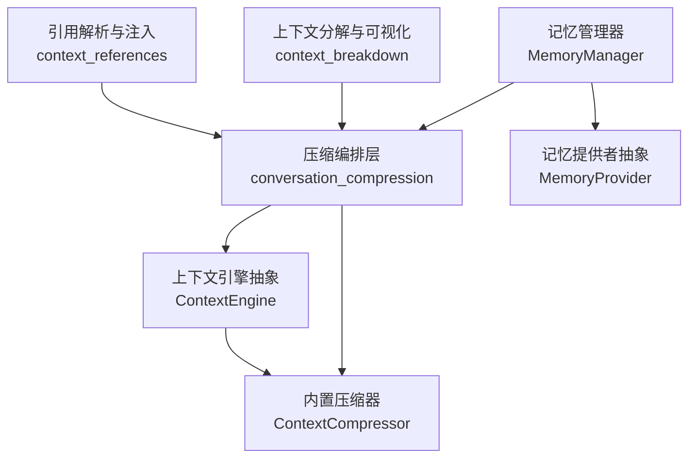
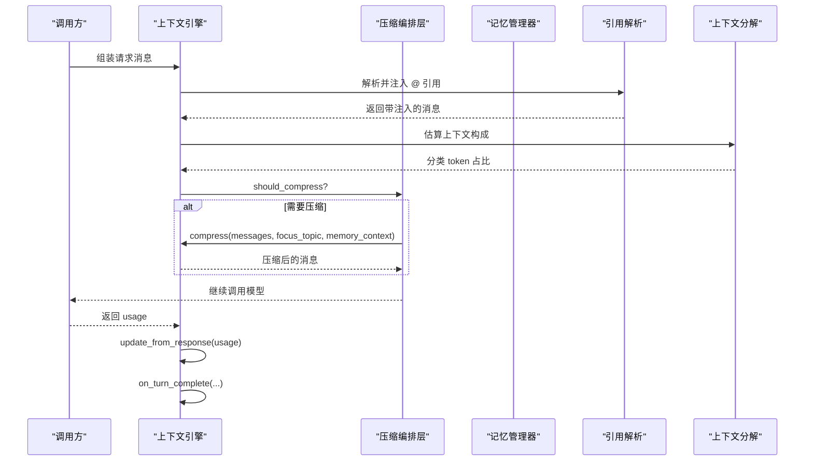
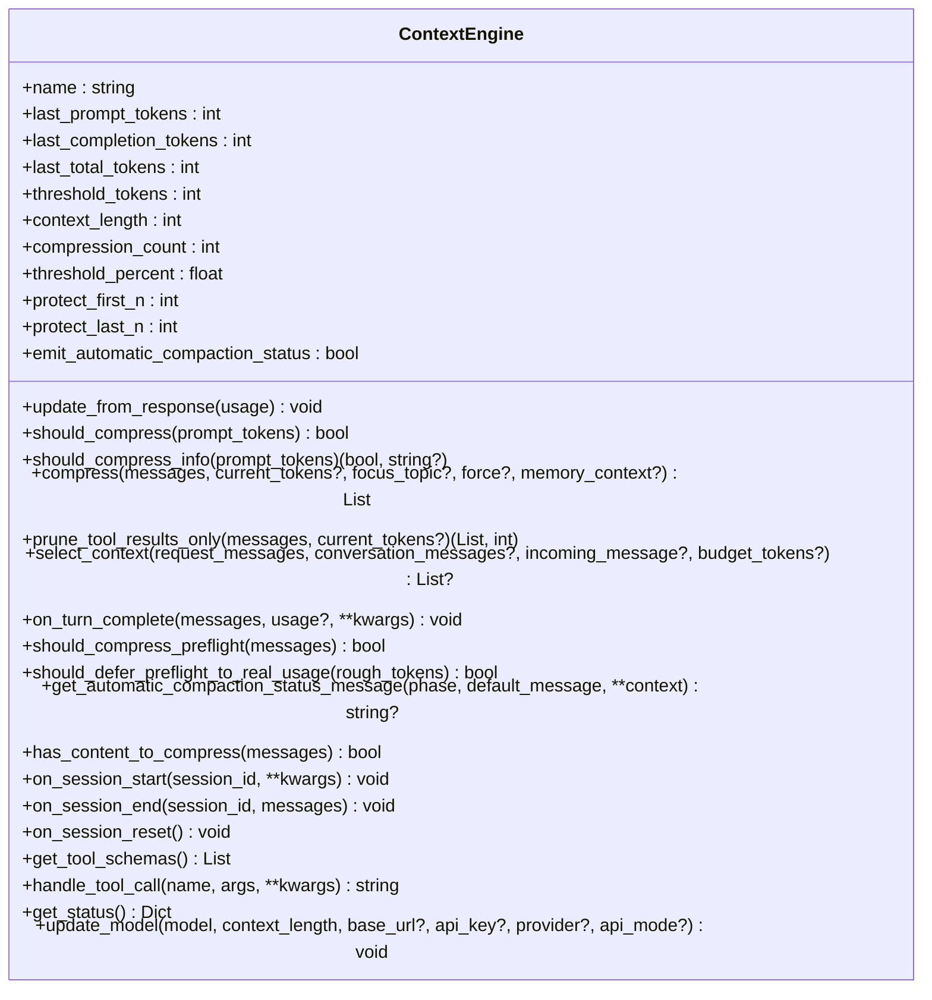
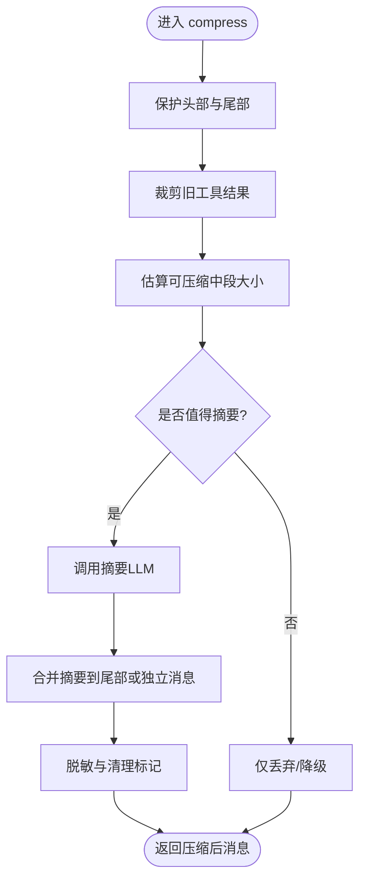
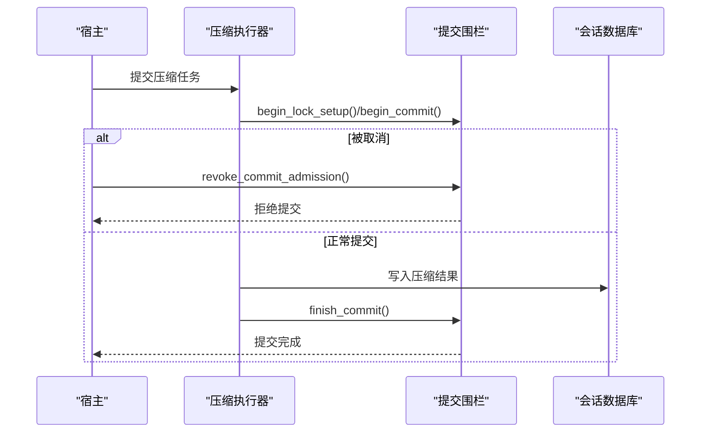
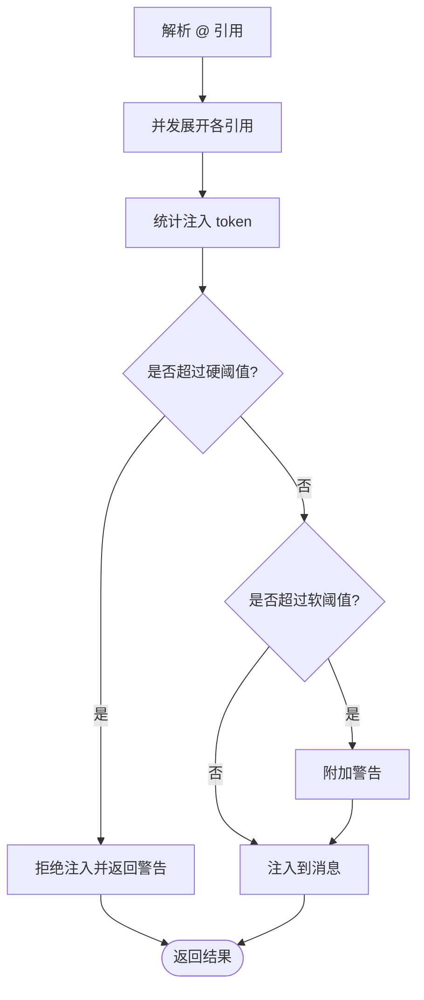
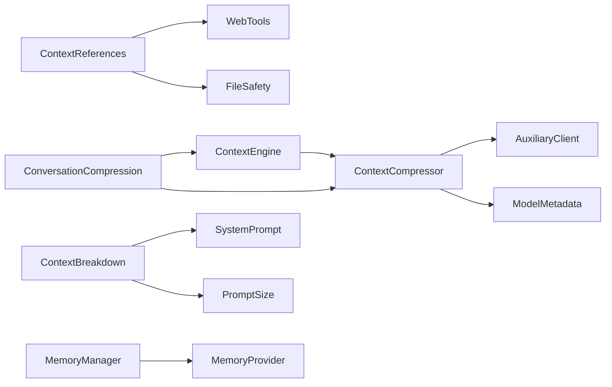

# 上下文管理系统

<cite>
**本文引用的文件**
- [agent/context_engine.py](file://agent/context_engine.py)
- [agent/context_compressor.py](file://agent/context_compressor.py)
- [agent/conversation_compression.py](file://agent/conversation_compression.py)
- [agent/context_references.py](file://agent/context_references.py)
- [agent/context_breakdown.py](file://agent/context_breakdown.py)
- [agent/memory_manager.py](file://agent/memory_manager.py)
- [agent/memory_provider.py](file://agent/memory_provider.py)
</cite>

## 目录
1. [简介](#简介)
2. [项目结构](#项目结构)
3. [核心组件](#核心组件)
4. [架构总览](#架构总览)
5. [详细组件分析](#详细组件分析)
6. [依赖关系分析](#依赖关系分析)
7. [性能与内存优化](#性能与内存优化)
8. [故障排查指南](#故障排查指南)
9. [结论](#结论)
10. [附录：配置与定制指南](#附录：配置与定制指南)

## 简介
本文件系统性说明 Hermes 的上下文管理系统，覆盖上下文引擎抽象、对话历史管理、上下文压缩算法、引用解析与注入、上下文分解与可视化、以及长对话的生命周期与内存优化策略。文档同时给出上下文检索与相关性评估思路、上下文窗口管理与性能优化技术，并提供可操作的配置示例与定制指南，帮助开发者扩展或替换压缩策略与检索算法。

## 项目结构
围绕“上下文”的核心代码集中在 agent 目录下，关键模块职责如下：
- context_engine.py：定义上下文引擎抽象接口（ContextEngine），统一压缩触发、压缩执行、工具暴露、会话生命周期等能力。
- context_compressor.py：内置压缩器实现，负责摘要生成、保护头尾、工具结果裁剪、技能信息防丢失、微压缩与回退策略等。
- conversation_compression.py：压缩编排层，负责超时/冷却/提交围栏、线程池调度、状态快照与恢复、提示词缓存一致性等。
- context_references.py：@ 引用解析与注入，支持 file/folder/git/url/diff/staged 等类型，含安全白名单与大小限制。
- context_breakdown.py：上下文窗口使用分解与可视化，按系统提示、工具定义、规则、技能、MCP、子代理、记忆、对话等分类估算 token 占用。
- memory_manager.py / memory_provider.py：记忆提供者管理器与抽象接口，提供预取、同步、工具注入、后台任务隔离等。

**图表来源**
- [agent/context_engine.py:89-490](file://agent/context_engine.py#L89-L490)
- [agent/context_compressor.py:1-800](file://agent/context_compressor.py#L1-L800)
- [agent/conversation_compression.py:1-800](file://agent/conversation_compression.py#L1-L800)
- [agent/context_references.py:1-237](file://agent/context_references.py#L1-L237)
- [agent/context_breakdown.py:89-157](file://agent/context_breakdown.py#L89-L157)
- [agent/memory_manager.py:364-800](file://agent/memory_manager.py#L364-L800)
- [agent/memory_provider.py:81-358](file://agent/memory_provider.py#L81-L358)

**章节来源**
- [agent/context_engine.py:1-490](file://agent/context_engine.py#L1-L490)
- [agent/context_compressor.py:1-800](file://agent/context_compressor.py#L1-L800)
- [agent/conversation_compression.py:1-800](file://agent/conversation_compression.py#L1-L800)
- [agent/context_references.py:1-237](file://agent/context_references.py#L1-L237)
- [agent/context_breakdown.py:1-157](file://agent/context_breakdown.py#L1-L157)
- [agent/memory_manager.py:1-800](file://agent/memory_manager.py#L1-L800)
- [agent/memory_provider.py:1-358](file://agent/memory_provider.py#L1-L358)

## 核心组件
- 上下文引擎抽象（ContextEngine）
  - 统一压缩决策（should_compress）、压缩入口（compress）、可选的每轮上下文选择（select_context）、工具暴露（get_tool_schemas/handle_tool_call）、会话生命周期（on_session_start/on_session_end/on_session_reset）、模型切换（update_model）。
  - 提供自动压缩状态消息格式化与静默开关，便于不同引擎控制用户可见性。
- 内置压缩器（ContextCompressor）
  - 保护头部与尾部（protect_first_n/protect_last_n），对中间段进行摘要；支持工具输出预裁剪、技能指令防丢失标记、滚动微压缩、失败冷却与回退路径。
  - 严格的安全与合规：摘要边界文本强制脱敏、旧版前缀兼容、持久化标记清理。
- 压缩编排层（conversation_compression）
  - 压缩超时与总上限、进度感知取消、提交围栏（CompressionCommitFence）、线程池限流、状态快照/恢复、冷却期持久化与回滚。
- 引用解析与注入（context_references）
  - 解析 @file:/@folder:/@git:/@url:/@diff:/@staged:，并发展开并统计注入 token，超过硬/软阈值时拒绝或告警；路径安全校验与二进制文件提示。
- 上下文分解与可视化（context_breakdown）
  - 将系统提示、工具定义、规则、技能、MCP、子代理、记忆、对话等分类估算 token，渲染网格与明细表，辅助定位上下文压力源。
- 记忆系统（memory_manager / memory_provider）
  - 统一管理记忆提供者（仅一个外部提供者），提供系统提示块、预取、异步同步、工具注入、后台任务隔离与超时控制。

**章节来源**
- [agent/context_engine.py:89-490](file://agent/context_engine.py#L89-L490)
- [agent/context_compressor.py:1-800](file://agent/context_compressor.py#L1-L800)
- [agent/conversation_compression.py:1-800](file://agent/conversation_compression.py#L1-L800)
- [agent/context_references.py:1-237](file://agent/context_references.py#L1-L237)
- [agent/context_breakdown.py:89-157](file://agent/context_breakdown.py#L89-L157)
- [agent/memory_manager.py:364-800](file://agent/memory_manager.py#L364-L800)
- [agent/memory_provider.py:81-358](file://agent/memory_provider.py#L81-L358)

## 架构总览
上下文系统在“请求前—生成—响应后—会话结束”全链路中工作：
- 请求前：可选 select_context 选择本轮上下文；引用解析注入 @ 内容；记忆预取注入。
- 生成前：估算 token，判断是否触发压缩；必要时调用 compress。
- 生成后：更新 token 使用；可选 on_turn_complete 观察本轮结果。
- 会话边界：on_session_start/on_session_end 初始化/清理资源；压缩编排层确保提交原子性与超时安全。

**图表来源**
- [agent/context_engine.py:133-328](file://agent/context_engine.py#L133-L328)
- [agent/conversation_compression.py:776-800](file://agent/conversation_compression.py#L776-L800)
- [agent/context_references.py:123-237](file://agent/context_references.py#L123-L237)
- [agent/context_breakdown.py:89-157](file://agent/context_breakdown.py#L89-L157)

## 详细组件分析

### 上下文引擎抽象（ContextEngine）
- 设计要点
  - 明确压缩触发与执行分离：should_compress 决定何时压缩，compress 执行具体策略。
  - 提供 per-turn 上下文选择 select_context，避免滥用压缩作为回调。
  - 暴露工具 get_tool_schemas/handle_tool_call，使引擎可集成搜索/索引等能力。
  - 会话生命周期钩子 on_session_start/on_session_end/on_session_reset，适配插件与外部存储。
  - 模型切换 update_model 动态调整阈值与上下文长度。
- 复杂度与影响
  - 压缩决策 O(1) 或基于轻量估计；压缩过程可能涉及 LLM 调用与 I/O，需通过编排层做超时与取消。
  - 工具暴露增加模型工具集大小，需权衡 schema 成本。

**图表来源**
- [agent/context_engine.py:89-490](file://agent/context_engine.py#L89-L490)

**章节来源**
- [agent/context_engine.py:89-490](file://agent/context_engine.py#L89-L490)

### 内置压缩器（ContextCompressor）
- 关键机制
  - 头尾保护：protect_first_n/protect_last_n 保证系统提示与最近对话不被压缩。
  - 摘要生成：对中间段进行结构化摘要，保留问题跟踪、历史任务快照等。
  - 工具输出裁剪：在 LLM 摘要前先裁剪旧工具结果，降低输入体积。
  - 技能指令防丢失：检测 skill_view 调用与结果，插入“已裁剪”标记并在摘要中恢复。
  - 微压缩与回退：连续失败跳过、降级摘要、最大字符限制等。
  - 安全与兼容：摘要边界文本强制脱敏，兼容历史前缀，清理持久化标记。
- 复杂度与影响
  - 摘要调用为最重步骤，受超时、冷却、配额错误处理影响。
  - 多阶段裁剪与合并保持消息角色交替合法性，避免模板拒绝。

**图表来源**
- [agent/context_compressor.py:1-800](file://agent/context_compressor.py#L1-L800)

**章节来源**
- [agent/context_compressor.py:1-800](file://agent/context_compressor.py#L1-L800)

### 压缩编排层（conversation_compression）
- 关键机制
  - 超时与总上限：progress-aware 包装，空闲超时与总上限防止卡死。
  - 提交围栏（CompressionCommitFence）：确保会话写入原子性，支持提前取消与提交阶段超时上报。
  - 线程池限流：固定 worker 数，饱和时快速失败，避免队列无限增长。
  - 状态快照与恢复：捕获尝试级状态，失败时回滚持久化冷却期。
  - 提示词缓存一致性：检查缓存是否反映最新记忆块，必要时重建。
- 复杂度与影响
  - 协调多线程与持久化锁，保证高可用与数据一致性。
  - 通过冷却期与反抖动减少频繁压缩带来的开销。

**图表来源**
- [agent/conversation_compression.py:445-691](file://agent/conversation_compression.py#L445-L691)
- [agent/conversation_compression.py:776-800](file://agent/conversation_compression.py#L776-L800)

**章节来源**
- [agent/conversation_compression.py:1-800](file://agent/conversation_compression.py#L1-L800)

### 引用解析与注入（context_references）
- 关键机制
  - 解析 @file:/@folder:/@git:/@url:/@diff:/@staged:，并发展开，统计注入 token。
  - 硬/软阈值：超过 50% 拒绝，超过 25% 告警。
  - 安全校验：禁止敏感路径与凭据文件，二进制文件以提示替代内联。
  - URL 抓取：默认通过 web_extract_tool 获取 markdown 内容。
- 复杂度与影响
  - 并发展开提升吞吐；URL 抓取存在网络延迟风险，应设置合理超时。
  - 注入过大将挤占对话空间，需谨慎使用。

**图表来源**
- [agent/context_references.py:123-237](file://agent/context_references.py#L123-L237)
- [agent/context_references.py:239-370](file://agent/context_references.py#L239-L370)

**章节来源**
- [agent/context_references.py:1-237](file://agent/context_references.py#L1-L237)
- [agent/context_references.py:239-370](file://agent/context_references.py#L239-L370)

### 上下文分解与可视化（context_breakdown）
- 关键机制
  - 分类估算：系统提示、工具定义、规则、技能、MCP、子代理、记忆、对话。
  - 可视化：网格与表格展示 token 占比，辅助定位瓶颈。
  - 细节视图：按技能与工具集拆分成本，便于优化。
- 复杂度与影响
  - 估算采用 chars/4 启发式，与压缩阈值一致，便于对齐行为。
  - 大工具集或大量技能会显著增加 schema 成本，需定期审查。

**章节来源**
- [agent/context_breakdown.py:89-157](file://agent/context_breakdown.py#L89-L157)
- [agent/context_breakdown.py:190-229](file://agent/context_breakdown.py#L190-L229)
- [agent/context_breakdown.py:232-361](file://agent/context_breakdown.py#L232-L361)

### 记忆系统（memory_manager / memory_provider）
- 关键机制
  - 单一外部提供者：避免工具 schema 膨胀与冲突。
  - 预取与同步：turn 前 prefetch 召回相关上下文，turn 后 sync 持久化。
  - 工具注入：将提供者工具注册到 agent 工具表面，注意命名冲突与核心工具保留。
  - 后台任务隔离：单 worker 序列化写操作，避免阻塞主流程。
  - 流式清洗：StreamingContextScrubber 过滤 <memory-context> 标签与系统注记。
- 复杂度与影响
  - 外部提供者可能慢或挂起，需超时与后台化处理。
  - 预取结果需控制大小与相关性，避免污染对话。

**章节来源**
- [agent/memory_manager.py:364-800](file://agent/memory_manager.py#L364-L800)
- [agent/memory_provider.py:81-358](file://agent/memory_provider.py#L81-L358)

## 依赖关系分析
- 耦合关系
  - ContextEngine 被 run_agent 等宿主调用，驱动压缩决策与执行。
  - ContextCompressor 依赖 auxiliary_client 调用摘要 LLM，依赖 model_metadata 估算 token。
  - conversation_compression 协调线程池、围栏、持久化锁与状态恢复。
  - context_references 依赖 web_tools 抓取 URL，依赖 file_safety 安全校验。
  - context_breakdown 依赖 system_prompt 构建与 prompt_size 细分。
  - memory_manager 聚合 MemoryProvider，注入工具与上下文。
- 潜在循环与解耦
  - 通过抽象接口（ContextEngine、MemoryProvider）解耦实现，便于替换与测试。
  - 压缩编排层集中处理超时与并发，避免在各组件重复实现。

**图表来源**
- [agent/context_engine.py:89-490](file://agent/context_engine.py#L89-L490)
- [agent/context_compressor.py:28-44](file://agent/context_compressor.py#L28-L44)
- [agent/conversation_compression.py:69-76](file://agent/conversation_compression.py#L69-L76)
- [agent/context_references.py:14-16](file://agent/context_references.py#L14-L16)
- [agent/context_breakdown.py:94-96](file://agent/context_breakdown.py#L94-L96)
- [agent/memory_manager.py:36-38](file://agent/memory_manager.py#L36-L38)

**章节来源**
- [agent/context_engine.py:89-490](file://agent/context_engine.py#L89-L490)
- [agent/context_compressor.py:28-44](file://agent/context_compressor.py#L28-L44)
- [agent/conversation_compression.py:69-76](file://agent/conversation_compression.py#L69-L76)
- [agent/context_references.py:14-16](file://agent/context_references.py#L14-L16)
- [agent/context_breakdown.py:94-96](file://agent/context_breakdown.py#L94-L96)
- [agent/memory_manager.py:36-38](file://agent/memory_manager.py#L36-L38)

## 性能与内存优化
- 上下文窗口管理
  - 使用 threshold_percent 与 protect_first_n/protect_last_n 控制压缩触发与保护范围。
  - 通过 context_breakdown 识别高成本类别（如工具 schema、技能索引），优先优化。
- 压缩策略优化
  - 启用工具结果预裁剪，减少摘要输入体积。
  - 利用微压缩与失败冷却，避免频繁 LLM 调用。
  - 对小上下文窗口模型提高阈值下限，减少反复压缩。
- 内存与并发
  - 压缩编排层使用有限 worker 线程池，饱和时快速失败，避免队列堆积。
  - 提交围栏确保会话写入原子性，支持超时取消与进度感知。
  - 记忆系统后台串行写，避免阻塞主流程。
- 检索与相关性
  - 在 select_context 中实现主题路由或检索，结合 on_turn_complete 更新索引。
  - 对 @ 引用注入设置软/硬阈值，避免上下文污染。
- 建议
  - 定期审查工具集与技能索引，移除未使用项。
  - 监控压缩频率与耗时，调整阈值与冷却参数。
  - 对慢速记忆提供者设置合理超时与后台化。

[本节为通用指导，不直接分析具体文件]

## 故障排查指南
- 压缩被阻止
  - 现象：上下文超过阈值但压缩被冷却或反抖动阻止。
  - 排查：检查压缩冷却期与失败计数；查看状态消息中的 reason。
  - 参考：压缩编排层的状态模板与警告模板。
- 摘要失败或配额不足
  - 现象：摘要 LLM 返回认证/配额错误。
  - 排查：确认辅助模型配置与凭据；查看 _is_summary_access_or_quota_error 判定逻辑。
  - 参考：内置压缩器的错误分类与回退路径。
- 引用注入被拒绝
  - 现象：@ 引用注入失败或告警。
  - 排查：检查注入 token 是否超过硬/软阈值；确认路径是否在允许范围内。
  - 参考：context_references 的阈值与安全检查。
- 记忆提供者超时
  - 现象：外部提供者预取或同步超时。
  - 排查：检查外部提供者响应时间；调整 external_prefetch_timeout。
  - 参考：memory_manager 的超时与后台任务处理。
- 上下文过大导致模型拒绝
  - 现象：provider 返回上下文过大错误。
  - 排查：使用 context_breakdown 定位高成本类别；启用工具结果裁剪与摘要。
  - 参考：conversation_compression 的重试与上下文缩减提示。

**章节来源**
- [agent/conversation_compression.py:125-180](file://agent/conversation_compression.py#L125-L180)
- [agent/context_compressor.py:73-95](file://agent/context_compressor.py#L73-L95)
- [agent/context_references.py:196-237](file://agent/context_references.py#L196-L237)
- [agent/memory_manager.py:547-595](file://agent/memory_manager.py#L547-L595)

## 结论
Hermes 的上下文管理系统通过抽象引擎、内置压缩器、编排层、引用解析、上下文分解与记忆系统，形成完整的长对话处理能力。其核心在于：
- 明确的压缩触发与执行分离，支持灵活策略与插件扩展。
- 强大的压缩编排与超时控制，保障稳定性与一致性。
- 安全的引用注入与上下文分解，帮助定位与优化上下文压力。
- 记忆系统的后台化与隔离，避免阻塞主流程。
通过合理配置与定制，可在不同场景下平衡上下文质量、性能与成本。

[本节为总结，不直接分析具体文件]

## 附录：配置与定制指南
- 上下文压缩配置
  - 阈值与保护：调整 threshold_percent、protect_first_n、protect_last_n 控制压缩触发与保护范围。
  - 超时与上限：配置 context_timeout_seconds 与 total ceiling，防止长时间压缩。
  - 冷却与回退：利用失败冷却与回退摘要，避免频繁失败导致的抖动。
  - 参考：conversation_compression 的超时解析与默认值。
- 引用注入配置
  - 阈值：软阈值 25% 告警，硬阈值 50% 拒绝；根据模型上下文大小调整。
  - 安全：确保 allowed_root 与路径白名单正确配置，避免敏感文件泄露。
  - 参考：context_references 的预处理与展开逻辑。
- 记忆提供者定制
  - 选择与注册：仅允许一个外部提供者，避免工具 schema 冲突。
  - 预取与同步：实现 prefetch/sync_turn，注意超时与后台化。
  - 工具注入：确保工具名称不与核心工具冲突，schema 格式正确。
  - 参考：memory_manager 与 memory_provider 的接口与约束。
- 自定义压缩策略
  - 继承 ContextEngine，实现 should_compress/compress/select_context。
  - 利用 prune_tool_results_only 进行低成本裁剪。
  - 通过 get_tool_schemas/handle_tool_call 集成检索/索引工具。
  - 参考：context_engine 的抽象接口与默认实现。
- 效果评估
  - 使用 context_breakdown 观察各类别 token 占比，定位瓶颈。
  - 监控压缩频率、耗时与成功率，调整参数。
  - 对用户反馈与任务完成率进行评估，验证上下文质量。

**章节来源**
- [agent/conversation_compression.py:776-800](file://agent/conversation_compression.py#L776-L800)
- [agent/context_references.py:196-237](file://agent/context_references.py#L196-L237)
- [agent/memory_manager.py:364-800](file://agent/memory_manager.py#L364-L800)
- [agent/memory_provider.py:81-358](file://agent/memory_provider.py#L81-L358)
- [agent/context_engine.py:89-490](file://agent/context_engine.py#L89-L490)
- [agent/context_breakdown.py:89-157](file://agent/context_breakdown.py#L89-L157)