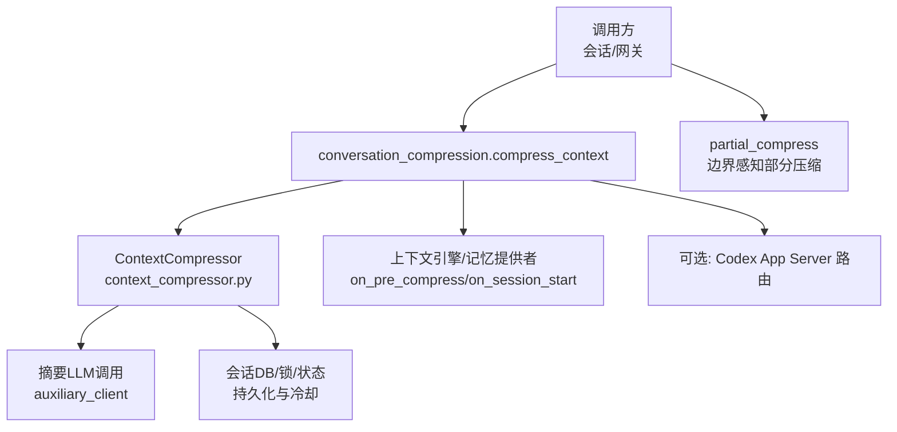
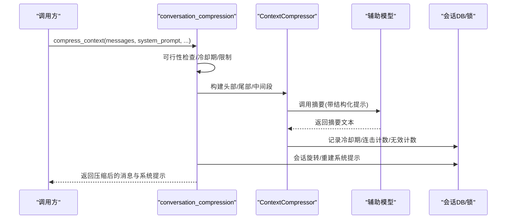
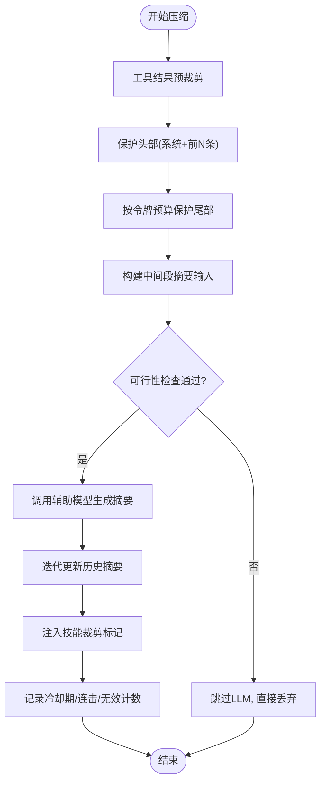
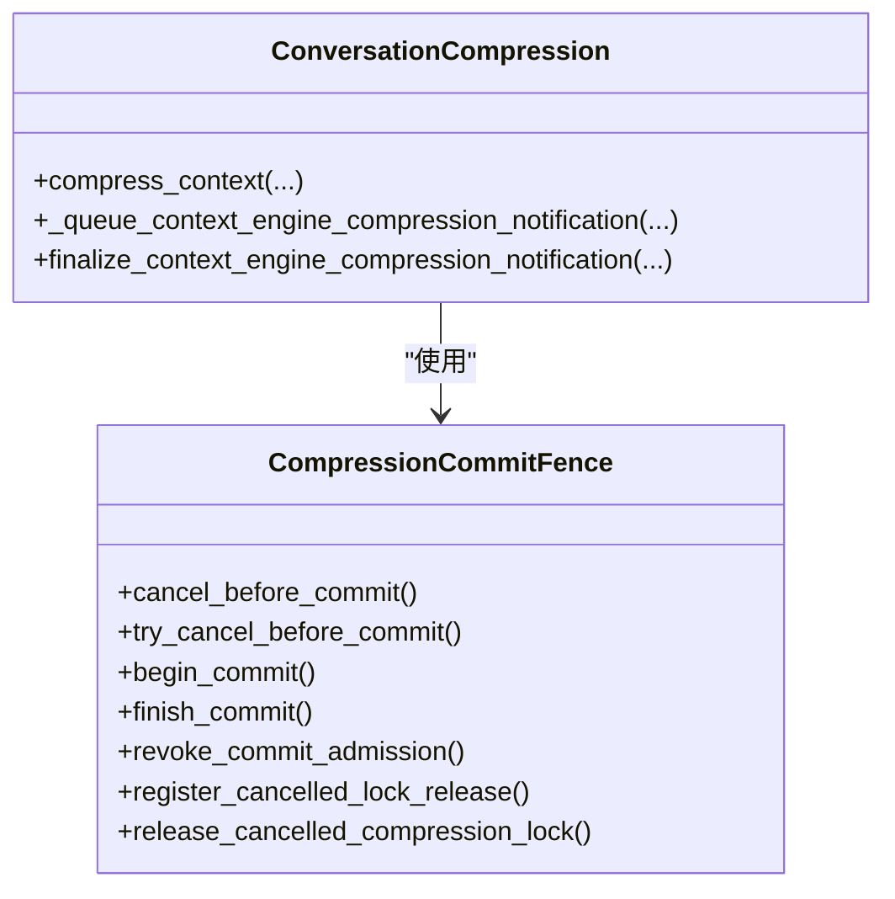
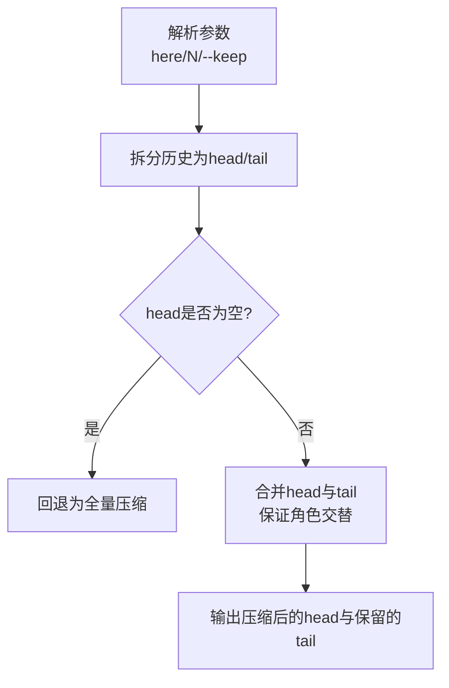
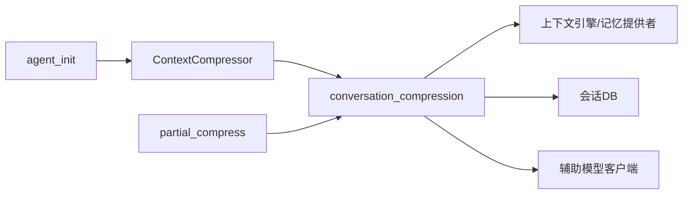

# 对话压缩算法

<cite>
**本文引用的文件**
- [agent/context_compressor.py](file://agent/context_compressor.py)
- [agent/conversation_compression.py](file://agent/conversation_compression.py)
- [agent/agent_init.py](file://agent/agent_init.py)
- [hermes_cli/partial_compress.py](file://hermes_cli/partial_compress.py)
- [trajectory_compressor.py](file://trajectory_compressor.py)
</cite>

## 目录
1. [简介](#简介)
2. [项目结构](#项目结构)
3. [核心组件](#核心组件)
4. [架构总览](#架构总览)
5. [详细组件分析](#详细组件分析)
6. [依赖关系分析](#依赖关系分析)
7. [性能考量](#性能考量)
8. [故障排除指南](#故障排除指南)
9. [结论](#结论)
10. [附录](#附录)

## 简介
本文件系统性阐述 Hermes Agent 的对话上下文压缩算法，覆盖消息重要性评估、摘要生成策略、上下文窗口优化技术、触发条件与阈值计算、保护机制（如 protect_first_n 与 protect_last_n）、数据保留策略、语义完整性保证与性能优化技巧。同时给出关键配置参数说明（如 threshold_percent、context_length 等）及其调优方法，并提供效果评估指标、监控方法与常见使用场景的配置示例和故障排除建议。

## 项目结构
围绕对话压缩的核心代码分布在以下模块：
- agent/context_compressor.py：内置上下文压缩引擎 ContextCompressor，实现多阶段压缩管线、摘要模板、工具输出裁剪、技能指令防“幽灵”丢失、滚动摘要更新、微压缩与反抖保护等。
- agent/conversation_compression.py：会话级压缩编排器，负责压缩入口、超时与提交围栏、执行池限流、状态快照/回滚、冷却期持久化、通知与旋转等。
- agent/agent_init.py：启动时解析压缩相关配置项，包括阈值、保护头尾、重试次数、微压缩开关、空闲压缩、辅助模型 context_length 覆盖等。
- hermes_cli/partial_compress.py：用户驱动的“边界感知部分压缩”，支持“在此处压缩并保留最近 N 轮”的交互能力。
- trajectory_compressor.py：离线轨迹压缩工具，用于训练后处理，策略与在线压缩类似但面向批处理与可观测性。

图表来源
- [agent/conversation_compression.py:2150-2300](file://agent/conversation_compression.py#L2150-L2300)
- [agent/context_compressor.py:1447-1718](file://agent/context_compressor.py#L1447-L1718)
- [hermes_cli/partial_compress.py:213-325](file://hermes_cli/partial_compress.py#L213-L325)

章节来源
- [agent/context_compressor.py:1-180](file://agent/context_compressor.py#L1-L180)
- [agent/conversation_compression.py:1-120](file://agent/conversation_compression.py#L1-L120)
- [agent/agent_init.py:1900-2150](file://agent/agent_init.py#L1900-L2150)
- [hermes_cli/partial_compress.py:1-120](file://hermes_cli/partial_compress.py#L1-L120)

## 核心组件
- ContextCompressor（内置压缩引擎）
  - 多阶段管线：工具结果预裁剪 → 保护头部（系统提示 + 前 N 条非系统消息）→ 按令牌预算保护尾部 → 中间段结构化摘要 → 迭代更新历史摘要。
  - 摘要模板与元数据：明确“参考信息”定位，避免被误当作活跃任务；维护压缩标记键以区分前端渲染。
  - 技能指令防丢失：检测 skill_view 调用与结果，必要时注入“已裁剪”标记，防止模型“幽灵技能”。
  - 微压缩与反抖：滚动摘要、失败计数、可行性跳过、冷却期、无效压缩计数与恢复期限。
- conversation_compression（会话编排）
  - 压缩入口 compress_context：统一入口，支持强制模式、焦点主题、提交围栏、超时与执行池限流。
  - 状态快照与回滚：在取消或超时时安全回滚尝试状态，确保会话一致性。
  - 冷却期与持久化：摘要失败冷却、回退压缩连击计数、无效压缩计数跨会话持久化。
  - 通知与旋转：压缩完成后通知上下文引擎/记忆提供者，必要时拆分会话并重建系统提示。
- agent_init（配置解析）
  - 解析 compression.* 配置：enabled、target_ratio、protect_first_n、protect_last_n、min_tail_user_messages、max_attempts、proactive_prune_*、micro_compact*、idle_compact_after_seconds、threshold_tokens、model_thresholds 等。
  - 辅助模型 context_length 覆盖：为自定义端点提供显式上下文长度，便于启动可行性检查。
- partial_compress（边界感知部分压缩）
  - 解析 /compress here/--keep N 等参数，将历史拆分为“待压缩头部”和“保留尾部”，保证角色交替合法性。
- trajectory_compressor（离线轨迹压缩）
  - 保护首尾、仅压缩中间区域、用单条人类摘要替换被压缩区域，附带丰富指标统计。

章节来源
- [agent/context_compressor.py:1447-2000](file://agent/context_compressor.py#L1447-L2000)
- [agent/conversation_compression.py:2150-2300](file://agent/conversation_compression.py#L2150-L2300)
- [agent/agent_init.py:1900-2150](file://agent/agent_init.py#L1900-L2150)
- [hermes_cli/partial_compress.py:213-325](file://hermes_cli/partial_compress.py#L213-L325)
- [trajectory_compressor.py:332-800](file://trajectory_compressor.py#L332-L800)

## 架构总览
下图展示一次自动压缩从触发到提交的完整流程，包括可行性检查、摘要生成、状态持久化与会话旋转。

图表来源
- [agent/conversation_compression.py:2150-2300](file://agent/conversation_compression.py#L2150-L2300)
- [agent/context_compressor.py:1506-1618](file://agent/context_compressor.py#L1506-L1618)

## 详细组件分析

### 上下文压缩引擎（ContextCompressor）
- 目标与职责
  - 在不超过模型上下文窗口的约束下，通过有损摘要压缩历史对话，同时保护关键信息（系统提示、前 N 条非系统消息、尾部最近令牌预算）。
- 关键算法步骤
  - 工具结果预裁剪：在不调用 LLM 的情况下，对旧工具输出进行低成本裁剪，减少输入大小。
  - 头部保护：系统提示始终受保护；protect_first_n 控制额外保护的前置非系统消息数量。
  - 尾部保护：基于令牌预算（tail_token_budget）保留最近的若干消息，确保当前任务与工具调用链可读。
  - 中间段摘要：使用结构化提示生成摘要，包含“历史任务快照”“进行中状态”“待处理用户请求”“剩余工作”等分区，并在后续压缩中迭代更新。
  - 技能指令防丢失：检测 skill_view 调用与结果，若即将丢失则注入“已裁剪”标记，要求重新加载。
  - 微压缩与反抖：滚动摘要、失败计数、可行性跳过、冷却期、无效压缩计数与恢复期限，避免频繁无意义压缩。
- 数据结构与复杂度
  - 消息列表分片为 head/middle/tail，时间复杂度 O(N)，N 为消息数；摘要生成成本取决于中间段大小与 LLM 调用开销。
- 错误处理
  - 摘要失败冷却：短期失败不阻塞后续压缩；永久错误（鉴权/配额）直接阻断。
  - 回退路径：当摘要不可用时，采用确定性回退摘要，保持连续性但不引入新内容。
- 性能优化
  - 可行性跳过：当可压缩中间段过小且之前无效时，跳过 LLM 调用，直接丢弃。
  - 输入字符上限：限制摘要输入总字符数，避免慢后端超时。
  - 摘要令牌上限：按比例与绝对上限双重约束，避免摘要本身成为上下文压力源。

图表来源
- [agent/context_compressor.py:1447-1718](file://agent/context_compressor.py#L1447-L1718)
- [agent/context_compressor.py:1961-2000](file://agent/context_compressor.py#L1961-L2000)

章节来源
- [agent/context_compressor.py:1-180](file://agent/context_compressor.py#L1-L180)
- [agent/context_compressor.py:1447-2000](file://agent/context_compressor.py#L1447-L2000)

### 会话级压缩编排（conversation_compression）
- 入口函数 compress_context
  - 参数：messages、system_message、approx_tokens、task_id、focus_topic、force、defer_context_engine_notification、commit_fence。
  - 行为：可行性检查、冷却期与限制、Codex App Server 路由、In-place 压缩或会话旋转、通知上下文引擎/记忆提供者、返回压缩后的消息与系统提示。
- 超时与提交围栏
  - CompressionCommitFence：协调取消与提交边界，防止后台线程在取消后仍修改会话状态；支持进度上报与超限告警。
- 执行池限流
  - 共享守护线程池，最大并发 4，避免所有压缩任务堆积导致死锁或长时间等待。
- 状态快照与回滚
  - 在取消或超时时，安全回滚尝试状态，确保会话一致性。
- 冷却期与持久化
  - 摘要失败冷却、回退压缩连击计数、无效压缩计数跨会话持久化，避免重启后状态丢失。

图表来源
- [agent/conversation_compression.py:445-691](file://agent/conversation_compression.py#L445-L691)
- [agent/conversation_compression.py:2117-2148](file://agent/conversation_compression.py#L2117-L2148)
- [agent/conversation_compression.py:2150-2300](file://agent/conversation_compression.py#L2150-L2300)

章节来源
- [agent/conversation_compression.py:445-754](file://agent/conversation_compression.py#L445-L754)
- [agent/conversation_compression.py:2117-2300](file://agent/conversation_compression.py#L2117-L2300)

### 配置解析（agent_init）
- 关键配置项
  - enabled：是否启用压缩。
  - target_ratio：摘要目标比例（默认 0.20）。
  - protect_first_n：保护前置非系统消息数量（默认 3）。
  - protect_last_n：保护尾部消息数量（默认 20）。
  - min_tail_user_messages：尾部至少保留的可操作用户消息数（默认 1）。
  - max_attempts：压缩重试轮次上限（默认 3，硬上限 10）。
  - proactive_prune_*：主动裁剪工具结果的触发阈值与最小回收量。
  - micro_compact*：微压缩开关与频率、碎片整理阈值。
  - idle_compact_after_seconds：空闲后压缩延迟。
  - threshold_tokens：绝对令牌阈值，与比率阈值取较小者。
  - model_thresholds：按模型名子串匹配的阈值覆盖。
  - auxiliary.compression.context_length：辅助模型上下文长度覆盖。
- 作用与调优
  - 小上下文模型阈值地板：小于 512K 的模型在 >=75% 时触发压缩，避免频繁重压。
  - 绝对阈值与比率阈值结合：确保在不同模型上行为一致。
  - 微压缩与主动裁剪：在高负载场景下降低提示缓存破坏频率，提升吞吐。

章节来源
- [agent/agent_init.py:1900-2150](file://agent/agent_init.py#L1900-L2150)

### 边界感知部分压缩（hermes_cli/partial_compress）
- 功能
  - 支持“在此处压缩并保留最近 N 轮”的用户驱动操作，解析 here/here N/--keep N/up to here 等参数。
  - 将历史拆分为“待压缩头部”和“保留尾部”，保证角色交替合法性，必要时合并相邻同角色消息。
- 适用场景
  - 用户在长对话中选择特定边界进行压缩，保留最近交互的精确性，同时释放上下文空间。

图表来源
- [hermes_cli/partial_compress.py:55-109](file://hermes_cli/partial_compress.py#L55-L109)
- [hermes_cli/partial_compress.py:213-325](file://hermes_cli/partial_compress.py#L213-L325)

章节来源
- [hermes_cli/partial_compress.py:55-109](file://hermes_cli/partial_compress.py#L55-L109)
- [hermes_cli/partial_compress.py:213-325](file://hermes_cli/partial_compress.py#L213-L325)

### 离线轨迹压缩（trajectory_compressor）
- 策略
  - 保护首尾（系统、人类、首个助手与工具），仅压缩中间区域，用单条人类摘要替换被压缩区域。
  - 支持异步/同步摘要生成，重试与退避，指标统计（压缩率、节省令牌、API 调用/错误等）。
- 适用场景
  - 训练后处理、批量压缩历史轨迹，便于模型微调或回放。

章节来源
- [trajectory_compressor.py:82-180](file://trajectory_compressor.py#L82-L180)
- [trajectory_compressor.py:332-800](file://trajectory_compressor.py#L332-L800)

## 依赖关系分析
- 模块耦合
  - conversation_compression 依赖 ContextCompressor 完成具体压缩逻辑，并通过上下文引擎/记忆提供者扩展点通知外部系统。
  - ContextCompressor 依赖辅助模型客户端进行摘要生成，并与会话 DB 交互以持久化冷却期与连击计数。
  - agent_init 提供配置解析，影响 ContextCompressor 的行为（阈值、保护范围、微压缩等）。
  - partial_compress 与 conversation_compression 协作，提供用户驱动的边界控制。
- 外部依赖
  - 辅助模型提供商（OpenRouter、Nous、Codex 等）用于摘要生成。
  - 会话 DB 用于持久化压缩状态与冷却期。
- 潜在循环依赖
  - 通过明确的入口函数与回调钩子解耦，避免循环导入；上下文引擎/记忆提供者作为观察者，不影响核心压缩流程。

图表来源
- [agent/agent_init.py:1900-2150](file://agent/agent_init.py#L1900-L2150)
- [agent/context_compressor.py:1447-1718](file://agent/context_compressor.py#L1447-L1718)
- [agent/conversation_compression.py:2150-2300](file://agent/conversation_compression.py#L2150-L2300)
- [hermes_cli/partial_compress.py:213-325](file://hermes_cli/partial_compress.py#L213-L325)

章节来源
- [agent/context_compressor.py:1447-1718](file://agent/context_compressor.py#L1447-L1718)
- [agent/conversation_compression.py:2150-2300](file://agent/conversation_compression.py#L2150-L2300)
- [agent/agent_init.py:1900-2150](file://agent/agent_init.py#L1900-L2150)
- [hermes_cli/partial_compress.py:213-325](file://hermes_cli/partial_compress.py#L213-L325)

## 性能考量
- 触发条件与阈值
  - 比率阈值：threshold_percent × context_length，得到 threshold_tokens。
  - 绝对阈值：compression.threshold_tokens 与比率阈值取较小者。
  - 小上下文模型地板：小于 512K 的模型在 >=75% 时触发，避免频繁重压。
- 摘要预算
  - 摘要令牌上限：按上下文长度的 5% 与绝对上限（10K）双重约束。
  - 输入字符上限：摘要输入限制在 160K 字符，避免慢后端超时。
- 工具结果裁剪
  - 主动裁剪：proactive_prune_tokens、proactive_prune_min_result_chars、proactive_prune_min_reclaim_tokens 控制何时裁剪与最小回收量。
- 微压缩
  - micro_compact 与 micro_compact_every_n_turns 控制滚动摘要的频率，平衡提示缓存破坏与上下文回收。
- 执行与超时
  - 共享执行池最大并发 4，避免队列膨胀。
  - 超时与提交围栏：progress-aware 超时与 total ceiling，防止长时间阻塞。

[本节为通用性能讨论，无需具体文件分析]

## 故障排除指南
- 常见问题
  - 摘要失败冷却：短期失败会进入冷却期，自动压缩会被阻止；手动 /compress 可通过 force=True 绕过。
  - 永久错误：鉴权/配额错误会直接阻断压缩，需检查 API Key 或账户余额。
  - 无效压缩计数：多次压缩未有效降低上下文，触发反抖保护，需调整阈值或保护范围。
  - 技能指令丢失：若出现“幽灵技能”，检查是否注入了“已裁剪”标记，必要时重新加载技能。
- 诊断与监控
  - 压缩尝试遥测：记录主模型、上下文限制、阈值、保护区域令牌数、辅助模型调用时长、回退使用情况等。
  - 状态回调：压缩过程中发送“正在压缩”“压缩完成”等状态，便于前端显示。
- 解决步骤
  - 调整 threshold_percent 或 threshold_tokens，降低触发敏感度。
  - 增加 protect_last_n 或 min_tail_user_messages，确保尾部信息完整。
  - 启用或调整 micro_compact，降低提示缓存破坏频率。
  - 检查辅助模型配置与可用性，必要时切换到更稳定的提供商。

章节来源
- [agent/context_compressor.py:1506-1618](file://agent/context_compressor.py#L1506-L1618)
- [agent/conversation_compression.py:79-180](file://agent/conversation_compression.py#L79-L180)

## 结论
Hermes Agent 的对话压缩算法通过多阶段管线、结构化摘要、保护机制与反抖策略，在保证语义完整性的前提下有效管理上下文窗口。配置灵活可调，支持在线与离线场景，具备完善的监控与故障恢复能力。合理调优阈值与保护范围，可在不同模型与负载下取得稳定高效的压缩效果。

[本节为总结性内容，无需具体文件分析]

## 附录
- 配置参数速查
  - threshold_percent：压缩触发百分比（相对于 context_length）。
  - context_length：模型上下文长度（可被辅助模型覆盖）。
  - protect_first_n：保护前置非系统消息数量。
  - protect_last_n：保护尾部消息数量。
  - min_tail_user_messages：尾部至少保留的可操作用户消息数。
  - max_attempts：压缩重试轮次上限。
  - proactive_prune_*：主动裁剪工具结果的触发阈值与最小回收量。
  - micro_compact*：微压缩开关与频率、碎片整理阈值。
  - idle_compact_after_seconds：空闲后压缩延迟。
  - threshold_tokens：绝对令牌阈值。
  - model_thresholds：按模型名子串匹配的阈值覆盖。
- 使用示例
  - 长对话场景：设置 protect_last_n=20、min_tail_user_messages=1、micro_compact=true，确保最近交互完整且滚动摘要降低缓存破坏。
  - 高负载场景：启用 proactive_prune_tokens 与 micro_compact_every_n_turns=5，平衡回收与提示缓存稳定性。
  - 小上下文模型：利用阈值地板（>=75%）避免频繁重压，必要时提高 threshold_percent。

[本节为补充信息，无需具体文件分析]