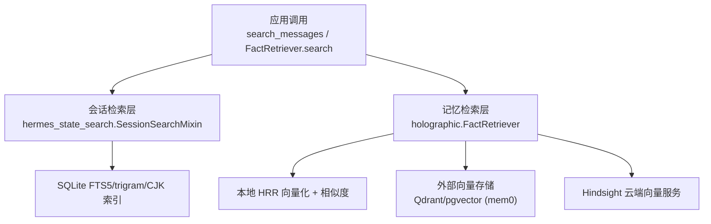
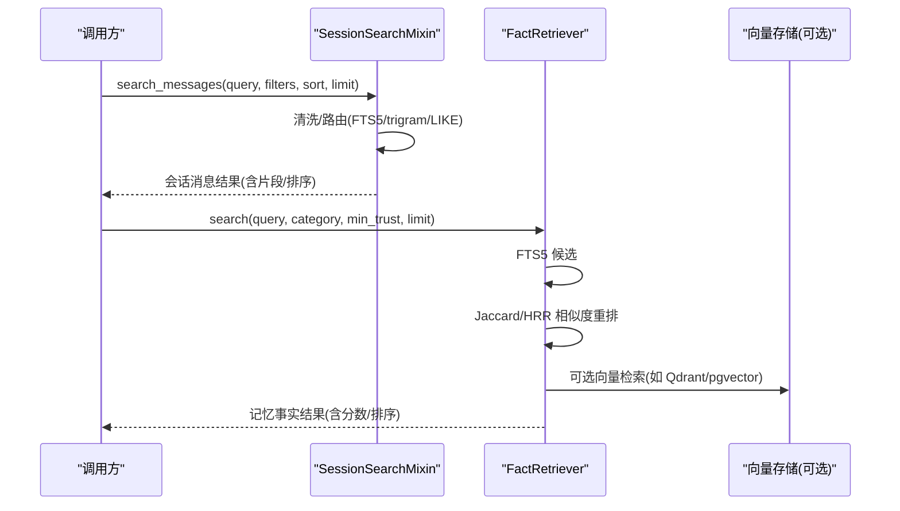
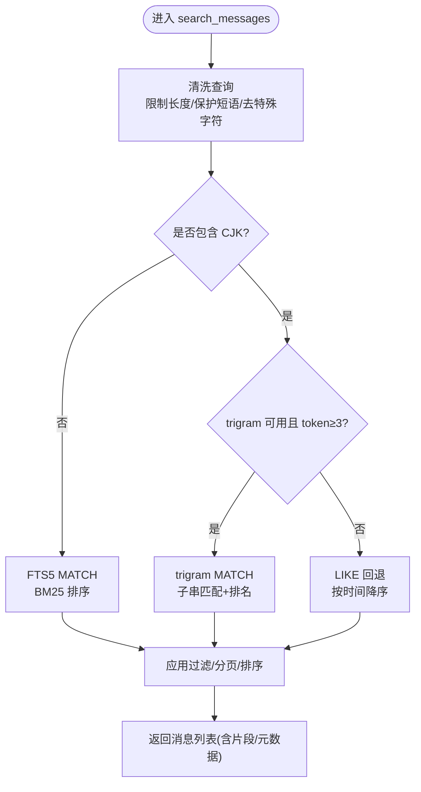
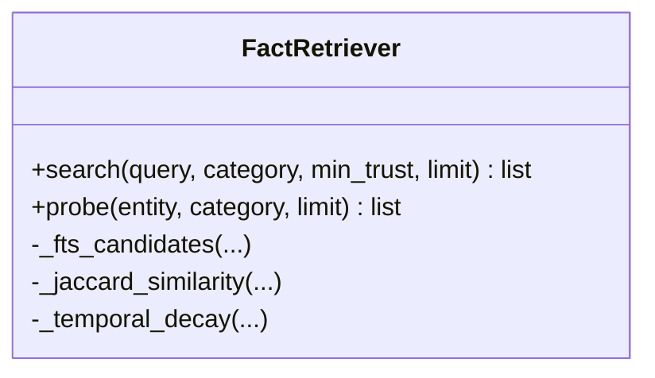
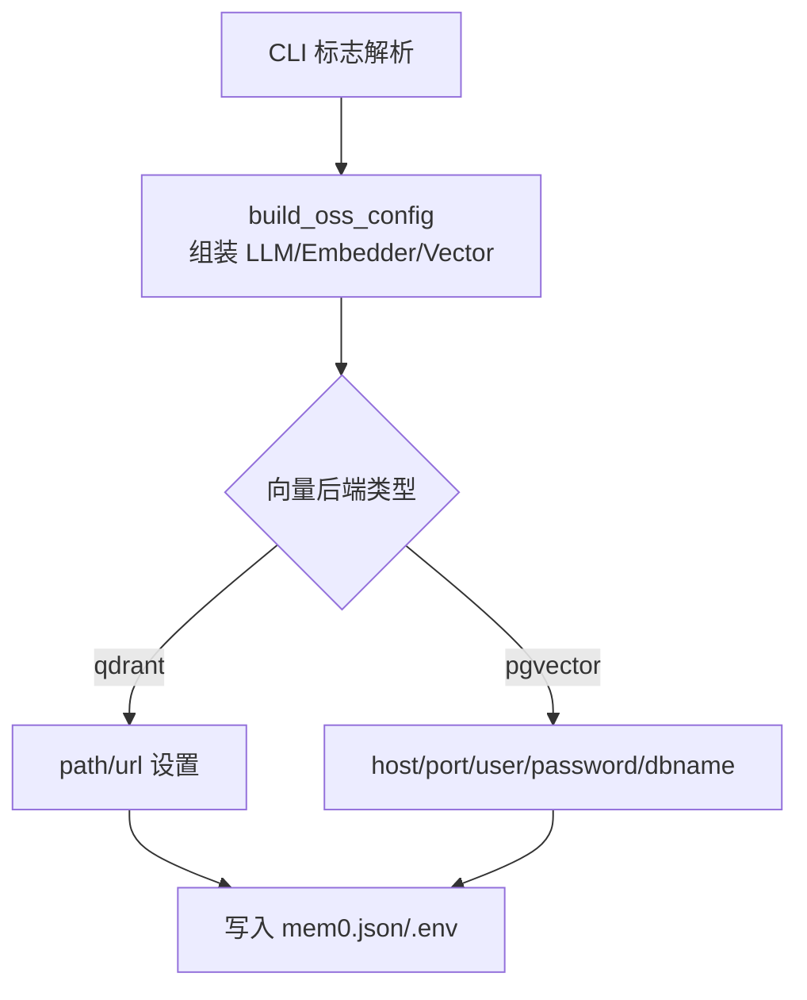
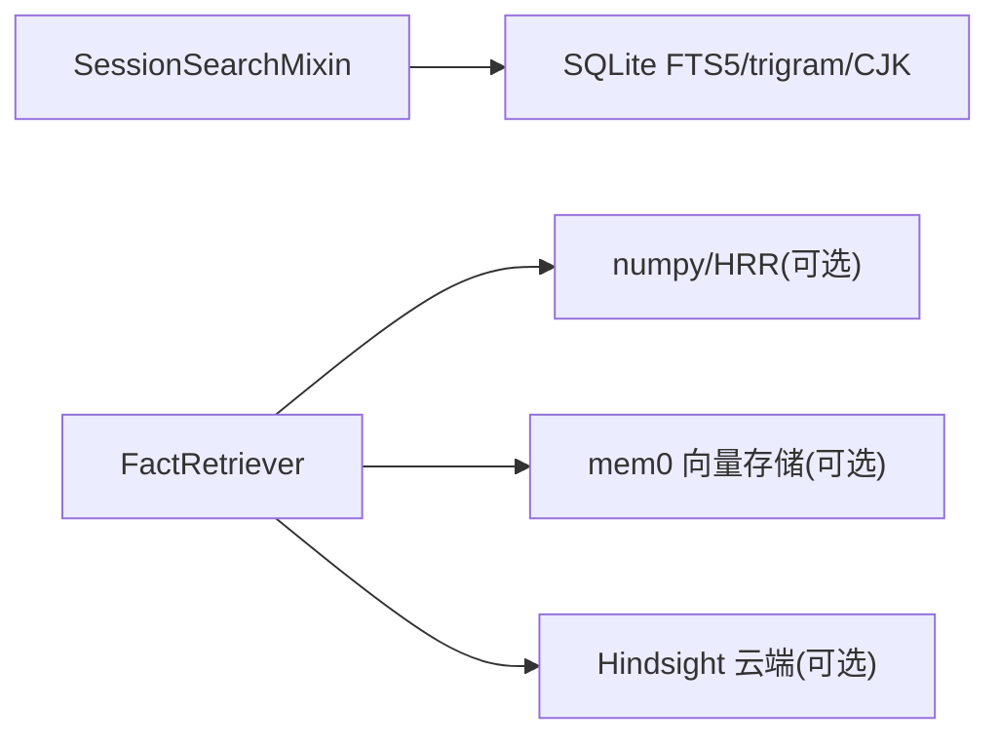

# 向量搜索系统

<cite>
**本文引用的文件**
- [hermes_state_search.py](file://hermes_state_search.py)
- [_oss_providers.py](file://plugins/memory/mem0/_oss_providers.py)
- [_setup.py](file://plugins/memory/mem0/_setup.py)
- [retrieval.py](file://plugins/memory/holographic/retrieval.py)
- [config_schema.py](file://plugins/memory/hindsight/config_schema.py)
</cite>

## 目录
1. [简介](#简介)
2. [项目结构](#项目结构)
3. [核心组件](#核心组件)
4. [架构总览](#架构总览)
5. [详细组件分析](#详细组件分析)
6. [依赖关系分析](#依赖关系分析)
7. [性能考量](#性能考量)
8. [故障排查指南](#故障排查指南)
9. [结论](#结论)
10. [附录](#附录)

## 简介
本文件面向 Hermes 的“向量搜索”能力，系统性梳理其架构与实现：包括嵌入模型集成、相似度计算、索引构建与查询优化；说明向量数据库选择策略、批量操作处理、搜索结果排序与过滤机制；并给出索引维护策略、性能调优参数、大规模数据处理建议、配置示例、结果质量评估方法，以及扩展指南（自定义嵌入模型与搜索算法优化）。

## 项目结构
Hermes 的“向量搜索”由多模块协作构成：
- 会话消息全文检索与 CJK/三元组索引维护：位于 hermes_state_search.py，提供 FTS5、trigram、CJK bigram 等路径的智能路由与维护。
- 外部向量存储插件：mem0 插件通过 _setup.py 与 _oss_providers.py 管理 LLM/Embedder/Vector Store 的配置与安装，支持 Qdrant、pgvector 等后端。
- 混合检索与重排：holographic.retrieval 将 FTS5 候选与 Jaccard/HRR 相似度结合，进行信任加权与时间衰减重排。
- Hindsight 云端向量服务：通过 config_schema 暴露模式化配置项（API Key、URL、Bank ID、召回预算等）。

图表来源
- [hermes_state_search.py:1383-1599](file://hermes_state_search.py#L1383-L1599)
- [retrieval.py:22-122](file://plugins/memory/holographic/retrieval.py#L22-L122)
- [_setup.py:128-188](file://plugins/memory/mem0/_setup.py#L128-L188)
- [config_schema.py:12-76](file://plugins/memory/hindsight/config_schema.py#L12-L76)

章节来源
- [hermes_state_search.py:1-120](file://hermes_state_search.py#L1-L120)
- [retrieval.py:1-122](file://plugins/memory/holographic/retrieval.py#L1-L122)
- [_setup.py:128-188](file://plugins/memory/mem0/_setup.py#L128-L188)
- [config_schema.py:12-76](file://plugins/memory/hindsight/config_schema.py#L12-L76)

## 核心组件
- 会话检索混入 SessionSearchMixin：封装消息级全文检索、CJK 支持、增量合并与重建、优化迁移（v22→v23 外部内容表）、慢查询日志与字段投影。
- 记忆检索 FactRetriever：FTS5 候选 → Jaccard/HRR 相似度重排 → 信任权重 → 可选时间衰减。
- mem0 插件配置器：解析 CLI 标志，组装 LLM/Embedder/Vector Store 配置，支持 Qdrant（本地/远程）与 pgvector（Docker/直连）。
- Hindsight 配置模式：声明式 UI 面板可配置的云端向量服务接入点。

章节来源
- [hermes_state_search.py:36-120](file://hermes_state_search.py#L36-L120)
- [retrieval.py:22-122](file://plugins/memory/holographic/retrieval.py#L22-L122)
- [_setup.py:64-188](file://plugins/memory/mem0/_setup.py#L64-L188)
- [config_schema.py:12-76](file://plugins/memory/hindsight/config_schema.py#L12-L76)

## 架构总览
整体流程分为两条主线：
- 会话消息检索：用户查询经安全清洗后，按语言特征与可用分词器智能路由到 FTS5、trigram 或 LIKE 回退路径，返回带片段与上下文的消息。
- 记忆检索：先以 FTS5 获取候选，再用 Jaccard/HRR 相似度与信任度、时间衰减综合打分，最终输出 Top-K。

图表来源
- [hermes_state_search.py:1383-1599](file://hermes_state_search.py#L1383-L1599)
- [retrieval.py:48-122](file://plugins/memory/holographic/retrieval.py#L48-L122)
- [_setup.py:128-188](file://plugins/memory/mem0/_setup.py#L128-L188)

## 详细组件分析

### 会话检索：FTS5/trigram/CJK 路由与维护
- 查询清洗与安全：限制长度、保护短语、去除危险字符、规范化布尔与通配符。
- 路由策略：
  - 非 CJK：优先 FTS5 BM25 相关性排序。
  - CJK：若具备 trigram 且满足最小 token 长度，走 trigram 路径；否则回退 LIKE。
- 排序与过滤：
  - sort 支持 newest/oldest（时间为主键，rank 为次键），默认仅按 rank。
  - 支持 source_filter/exclude_sources/role_filter/include_inactive 等条件。
- 索引维护：
  - 增量合并与分批重建（高水位标记、进度持久化、边界扫描）。
  - v22→v23 外部内容表迁移，垃圾表分块清理，vacuum/WAL checkpoint。
  - CJK bigram 索引重建与陈旧检测恢复。

图表来源
- [hermes_state_search.py:1160-1237](file://hermes_state_search.py#L1160-L1237)
- [hermes_state_search.py:1383-1599](file://hermes_state_search.py#L1383-L1599)

章节来源
- [hermes_state_search.py:1160-1237](file://hermes_state_search.py#L1160-L1237)
- [hermes_state_search.py:1383-1599](file://hermes_state_search.py#L1383-L1599)
- [hermes_state_search.py:734-955](file://hermes_state_search.py#L734-L955)

### 记忆检索：混合检索与重排
- 候选生成：FTS5 检索获得候选集（通常取 limit×3 作为重排缓冲）。
- 相似度融合：Jaccard 文本重叠 + HRR 相位向量相似度（若可用）。
- 评分公式：relevance = w_fts*fts_score + w_jac*jaccard + w_hrr*hrr_sim；score = relevance * trust_score；可选时间衰减。
- 降级策略：无 numpy/HRR 时自动回退为 FTS5 + Jaccard。

图表来源
- [retrieval.py:22-122](file://plugins/memory/holographic/retrieval.py#L22-L122)

章节来源
- [retrieval.py:22-122](file://plugins/memory/holographic/retrieval.py#L22-L122)

### 向量数据库选择与配置（mem0 插件）
- 支持的向量后端：Qdrant（本地文件或远程 URL）、pgvector（Docker 或直连）。
- 配置入口：CLI 标志解析与 build_oss_config 组装 LLM/Embedder/Vector Store 三段配置。
- 维度推断：根据 embedder 模型名映射已知维度，写入 embedding_dims。
- 环境变量：按需写入 .env 中的密钥字段。

图表来源
- [_setup.py:64-188](file://plugins/memory/mem0/_setup.py#L64-L188)

章节来源
- [_setup.py:64-188](file://plugins/memory/mem0/_setup.py#L64-L188)

### Hindsight 云端向量服务配置
- 模式：cloud/local_external。
- 关键配置项：api_key、api_url、bank_id、recall_budget。
- 用途：轻量接入云端向量检索，适合快速部署与集中化管理。

章节来源
- [config_schema.py:12-76](file://plugins/memory/hindsight/config_schema.py#L12-L76)

## 依赖关系分析
- 会话检索对 SQLite FTS5/trigram/CJK 的强依赖，要求运行时具备相应 tokenizer 与索引状态。
- 记忆检索对 numpy/HRR 的可选依赖，缺失时自动降级。
- mem0 插件对第三方向量库（Qdrant/pgvector）的运行时依赖，需确保环境就绪。
- Hindsight 依赖网络可达性与 API Key。

图表来源
- [hermes_state_search.py:1383-1599](file://hermes_state_search.py#L1383-L1599)
- [retrieval.py:22-122](file://plugins/memory/holographic/retrieval.py#L22-L122)
- [_setup.py:128-188](file://plugins/memory/mem0/_setup.py#L128-L188)
- [config_schema.py:12-76](file://plugins/memory/hindsight/config_schema.py#L12-L76)

章节来源
- [hermes_state_search.py:1383-1599](file://hermes_state_search.py#L1383-L1599)
- [retrieval.py:22-122](file://plugins/memory/holographic/retrieval.py#L22-L122)
- [_setup.py:128-188](file://plugins/memory/mem0/_setup.py#L128-L188)
- [config_schema.py:12-76](file://plugins/memory/hindsight/config_schema.py#L12-L76)

## 性能考量
- 查询性能
  - 使用 FTS5/trigram 避免全表扫描；LIKE 回退仅在必要时启用。
  - 合理设置 limit/offset，减少结果集传输与序列化开销。
  - 通过 sort=newest/oldest 控制主排序键，降低复杂排序成本。
- 索引维护
  - 使用 optimize_fts_storage 进行分阶段迁移与回填，配合 _FTS_REBUILD_MIN_PAUSE/_FTS_REBUILD_DUTY_FACTOR 控制后台任务对在线服务的干扰。
  - 定期 vacuum 与 WAL checkpoint 回收空间，注意磁盘容量与并发读锁冲突。
- 重排与相似度
  - 在 fact 数量较大时，优先 FTS5 缩小候选集再重排，避免全量相似度计算。
  - HRR 相似度需要 numpy，缺失时自动降级，保证可用性。
- 大规模数据
  - 分块回填与高水位标记确保中断恢复与并发安全。
  - 对 CJK 场景启用 trigram/CJK bigram 索引，提升召回率与准确率。

[本节为通用性能指导，不直接分析具体文件]

## 故障排查指南
- 慢查询定位
  - 通过慢查询日志（HERMES_SEARCH_SLOW_MS）识别耗时路径（fts5/trigram/like_scan）。
- 索引状态检查
  - fts_rebuild_status/fts_cjk_rebuild_status 查看回填进度；optimize_fts_storage_available 判断是否需要优化。
- 常见问题
  - 缺少 tokenizer：trigram/cjk 不可用时自动回退，确认运行环境。
  - 向量后端不可用：Qdrant/pgvector 连接失败时，检查端口/凭据/容器状态。
  - Hindsight 认证失败：校验 api_key 与 api_url，确认网络连通性。

章节来源
- [hermes_state_search.py:83-120](file://hermes_state_search.py#L83-L120)
- [hermes_state_search.py:625-665](file://hermes_state_search.py#L625-L665)
- [hermes_state_search.py:734-955](file://hermes_state_search.py#L734-L955)
- [_setup.py:523-725](file://plugins/memory/mem0/_setup.py#L523-L725)
- [config_schema.py:12-76](file://plugins/memory/hindsight/config_schema.py#L12-L76)

## 结论
Hermes 的向量搜索体系以 SQLite FTS5/trigram/CJK 为核心，结合记忆层的混合检索与外部向量存储（Qdrant/pgvector/Hindsight），形成可扩展、可降级、可运维的检索方案。通过精细的路由策略、稳健的索引维护与灵活的配置接口，既满足高性能在线检索，又兼顾离线批处理与大规模数据演进。

[本节为总结性内容，不直接分析具体文件]

## 附录

### 配置示例与参数调优
- 会话检索参数
  - query：支持短语、布尔、前缀；会被安全清洗。
  - source_filter/exclude_sources/role_filter：限定来源与角色。
  - include_inactive：是否包含归档/压缩行。
  - sort：newest/oldest/None（默认 BM25）。
  - limit/offset：分页控制。
- 记忆检索参数
  - category/min_trust/limit：限定类别、最低信任度、返回条数。
  - 权重与半衰期：fts_weight/jaccard_weight/hrr_weight/temporal_decay_half_life。
- 向量后端配置（mem0）
  - oss_vector=qdrant：设置 path 或 url。
  - oss_vector=pgvector：设置 host/port/user/password/dbname。
  - 维度：embedding_dims 由 embedder 模型映射。
- Hindsight 配置
  - mode/api_key/api_url/bank_id/recall_budget：云端模式下的关键开关。

章节来源
- [hermes_state_search.py:1383-1599](file://hermes_state_search.py#L1383-L1599)
- [retrieval.py:22-122](file://plugins/memory/holographic/retrieval.py#L22-L122)
- [_setup.py:128-188](file://plugins/memory/mem0/_setup.py#L128-L188)
- [config_schema.py:12-76](file://plugins/memory/hindsight/config_schema.py#L12-L76)

### 结果质量评估
- 指标建议
  - 精确率/召回率：基于人工标注或黄金集评估不同路由路径。
  - 平均倒数排名（MRR）/NDCG：衡量排序质量。
  - 延迟分布：P50/P95/P99 响应时间，区分 FTS5/trigram/LIKE 路径。
- 实验方法
  - 固定查询集，对比不同权重（fts/jaccard/hrr）与时间衰减效果。
  - 切换向量后端（Qdrant/pgvector/Hindsight）评估稳定性与一致性。
  - 监控慢查询日志，定位热点查询与索引瓶颈。

[本节为方法论指导，不直接分析具体文件]

### 扩展指南：自定义嵌入模型与搜索算法
- 自定义嵌入模型
  - 在 mem0 中新增 embedder provider，定义 model/base_url/embedding_dims 等字段，并在 build_oss_config 中注册。
  - 确保向量后端能接受新维度，必要时调整集合/索引参数。
- 自定义相似度与重排
  - 在 FactRetriever 中扩展相似度函数（如余弦、内积、领域定制），并纳入权重融合。
  - 引入外部信号（如实体链接、知识图谱）增强重排。
- 索引与路由扩展
  - 新增分词器或索引类型（如 n-gram 变体），在路由逻辑中增加判定条件与回退策略。
  - 为特定语言/领域建立专用索引表，复用现有维护与回填框架。

[本节为扩展实践指导，不直接分析具体文件]