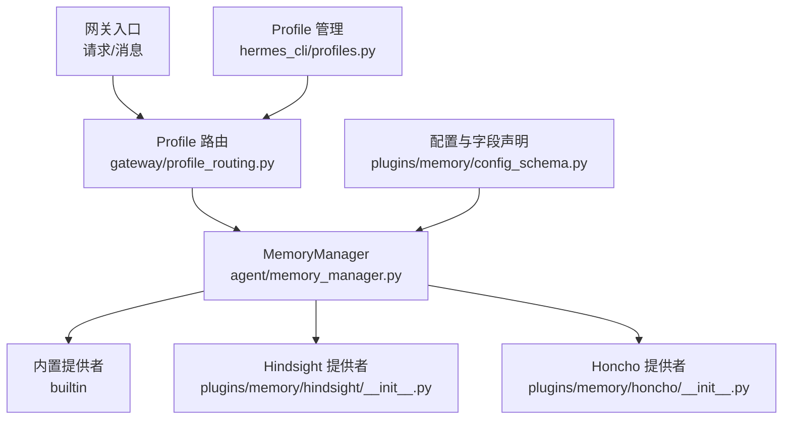
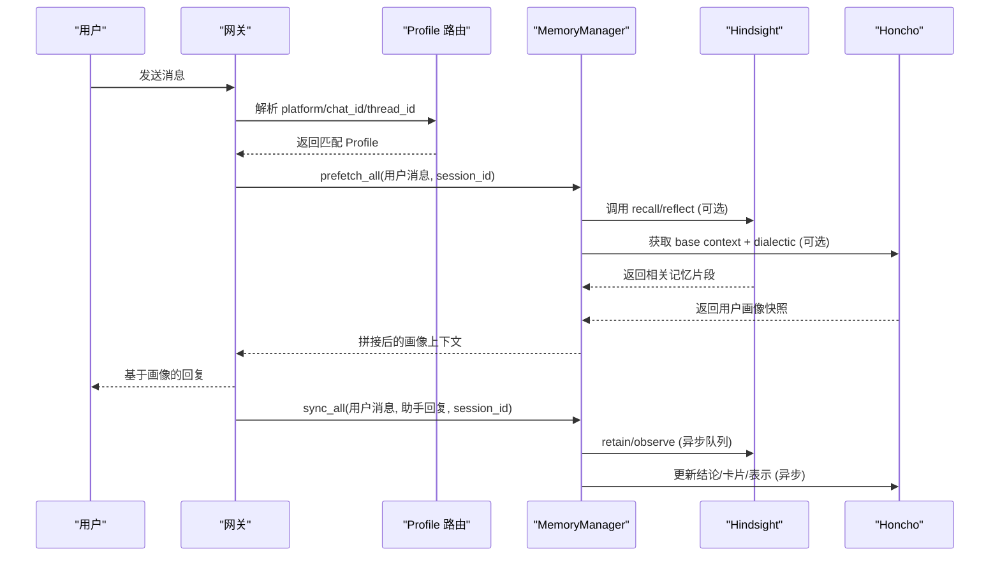
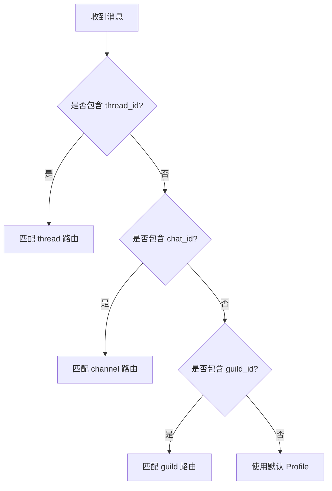
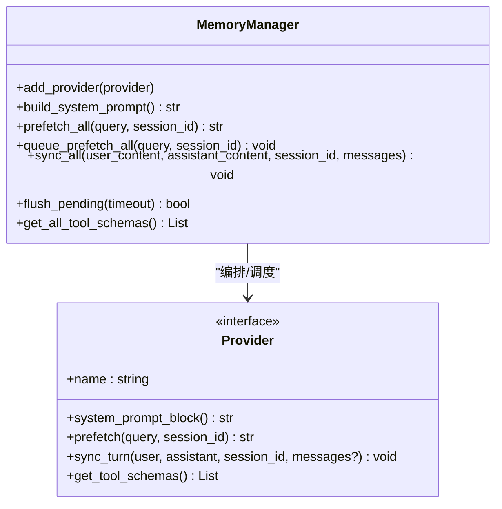
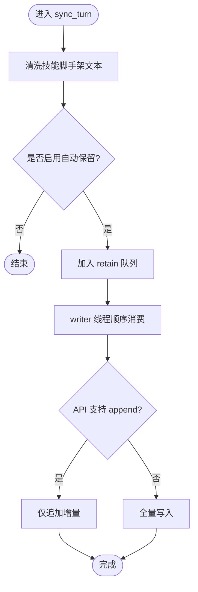
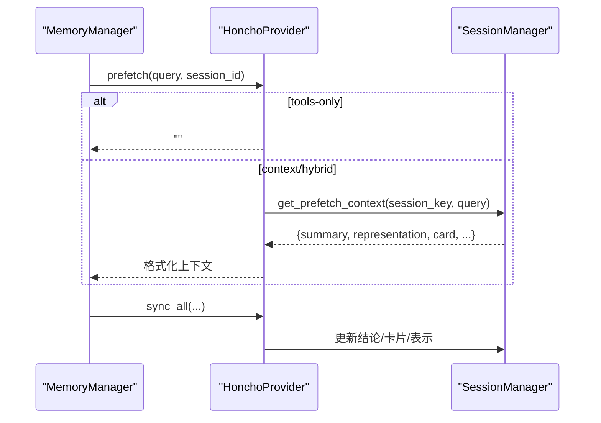
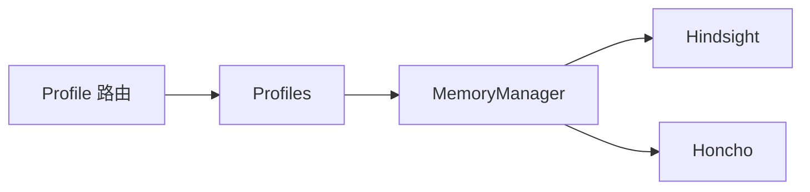

# 用户画像构建

<cite>
**本文引用的文件**
- [gateway/profile_routing.py](file://gateway/profile_routing.py)
- [agent/memory_manager.py](file://agent/memory_manager.py)
- [plugins/memory/hindsight/__init__.py](file://plugins/memory/hindsight/__init__.py)
- [plugins/memory/honcho/__init__.py](file://plugins/memory/honcho/__init__.py)
- [plugins/memory/config_schema.py](file://plugins/memory/config_schema.py)
- [hermes_cli/profiles.py](file://hermes_cli/profiles.py)
- [agent/agent_init.py](file://agent/agent_init.py)
</cite>

## 目录
1. [简介](#简介)
2. [项目结构](#项目结构)
3. [核心组件](#核心组件)
4. [架构总览](#架构总览)
5. [详细组件分析](#详细组件分析)
6. [依赖关系分析](#依赖关系分析)
7. [性能考量](#性能考量)
8. [故障排查指南](#故障排查指南)
9. [结论](#结论)
10. [附录](#附录)

## 简介
本文件面向 Hermes 的用户画像构建系统，围绕“数据结构、提取算法、更新机制、持久化策略”展开，并覆盖“偏好学习、行为模式识别、兴趣标签生成、个性化推荐逻辑”。同时给出隐私保护、版本管理、跨会话一致性保证的实践说明；提供配置示例以定制画像规则，解释可视化与调试方法；并为开发者提供扩展指南（自定义特征提取与推荐算法集成）。

## 项目结构
Hermes 将“用户画像”能力抽象为可插拔的“记忆提供者”，并通过统一的 MemoryManager 编排。路由层支持按平台/频道/线程等维度选择不同 Profile，从而隔离画像数据与模型配置。

图表来源
- [gateway/profile_routing.py:1-167](file://gateway/profile_routing.py#L1-L167)
- [agent/memory_manager.py:364-795](file://agent/memory_manager.py#L364-L795)
- [plugins/memory/hindsight/__init__.py:681-800](file://plugins/memory/hindsight/__init__.py#L681-L800)
- [plugins/memory/honcho/__init__.py:237-336](file://plugins/memory/honcho/__init__.py#L237-L336)
- [plugins/memory/config_schema.py:1-145](file://plugins/memory/config_schema.py#L1-L145)
- [hermes_cli/profiles.py:1-127](file://hermes_cli/profiles.py#L1-L127)

章节来源
- [gateway/profile_routing.py:1-167](file://gateway/profile_routing.py#L1-L167)
- [hermes_cli/profiles.py:1-127](file://hermes_cli/profiles.py#L1-L127)

## 核心组件
- Profile 路由：根据平台、群组、频道、线程等上下文选择 Profile，实现多实例隔离与差异化画像。
- MemoryManager：统一编排多个记忆提供者，负责预取（prefetch）、同步（sync）、工具注入、后台任务调度与超时控制。
- Hindsight 提供者：长期记忆、知识图谱、实体解析、多策略检索（语义/关键词/图遍历/重排），支持云端与本地模式。
- Honcho 提供者：跨会话用户建模、对话式问答、同行卡片、持久化结论，支持 context/tools/hybrid 三种召回模式。
- 配置模式：通过声明式 schema 暴露 provider 的可配置项，支持明文、密钥、枚举、JSON 等类型，并提供 UI 渲染与读写端点。
- Profile 管理：创建、克隆、导出、别名与路径解析，确保每个 profile 拥有独立的 config.yaml、.env、memories、sessions 等。

章节来源
- [gateway/profile_routing.py:50-167](file://gateway/profile_routing.py#L50-L167)
- [agent/memory_manager.py:364-795](file://agent/memory_manager.py#L364-L795)
- [plugins/memory/hindsight/__init__.py:305-354](file://plugins/memory/hindsight/__init__.py#L305-L354)
- [plugins/memory/honcho/__init__.py:36-230](file://plugins/memory/honcho/__init__.py#L36-L230)
- [plugins/memory/config_schema.py:30-104](file://plugins/memory/config_schema.py#L30-L104)
- [hermes_cli/profiles.py:39-127](file://hermes_cli/profiles.py#L39-L127)

## 架构总览
下图展示一次对话中画像数据的读取与写入流程，包括预取、注入、同步与后台刷新。

图表来源
- [agent/memory_manager.py:525-695](file://agent/memory_manager.py#L525-L695)
- [plugins/memory/hindsight/__init__.py:305-354](file://plugins/memory/hindsight/__init__.py#L305-L354)
- [plugins/memory/honcho/__init__.py:699-800](file://plugins/memory/honcho/__init__.py#L699-L800)

## 详细组件分析

### Profile 路由与隔离
- 匹配优先级：线程 > 频道 > 群组 > 默认 Profile。
- 层级匹配：支持父级频道匹配（论坛/线程场景）。
- 安全校验：对 profile 名称进行规范化与合法性校验，防止路径穿越。
- 作用：同一进程内为不同渠道/群组提供独立画像、模型、工具与记忆。

图表来源
- [gateway/profile_routing.py:62-102](file://gateway/profile_routing.py#L62-L102)

章节来源
- [gateway/profile_routing.py:1-167](file://gateway/profile_routing.py#L1-L167)
- [hermes_cli/profiles.py:306-383](file://hermes_cli/profiles.py#L306-L383)

### MemoryManager：画像编排与更新机制
- 预取（prefetch）：在每轮对话前从各提供者收集画像上下文，失败不阻塞其他提供者。
- 同步（sync）：在每轮对话后将用户与助手内容提交到各提供者，采用单工作线程串行化，避免乱序。
- 工具注入：将提供者的工具（如 hindsight_retain/recall/reflect、honcho_profile/search/reasoning/context/conclude）注入到 agent 的工具集。
- 后台任务：提供 queue_prefetch_all/sync_all 的后台执行与超时控制，避免慢提供者卡住主循环。
- 流式清理：对含 <memory-context> 的流式输出进行清洗，防止内部上下文泄露到 UI。

图表来源
- [agent/memory_manager.py:364-795](file://agent/memory_manager.py#L364-L795)

章节来源
- [agent/memory_manager.py:50-157](file://agent/memory_manager.py#L50-L157)
- [agent/memory_manager.py:174-361](file://agent/memory_manager.py#L174-L361)
- [agent/memory_manager.py:525-795](file://agent/memory_manager.py#L525-L795)

### Hindsight：长期记忆与兴趣标签
- 数据结构：事实、观察、证据、实体、时间戳、标签、预算（low/mid/high）等。
- 提取算法：自动抽取结构化事实、实体解析、多策略检索（语义搜索、关键词、知识图谱遍历、重排）。
- 更新机制：retain/observe 写入，支持 append 模式（API 版本检测）以减少重复；后台 writer 队列顺序写入。
- 持久化：云端 API 或本地嵌入式守护进程；支持 bank_id 模板与 profile-scoped 配置。
- 画像用途：作为“兴趣标签”和“行为模式”的来源，供后续推理与推荐使用。

图表来源
- [plugins/memory/hindsight/__init__.py:305-354](file://plugins/memory/hindsight/__init__.py#L305-L354)
- [plugins/memory/hindsight/__init__.py:681-800](file://plugins/memory/hindsight/__init__.py#L681-L800)

章节来源
- [plugins/memory/hindsight/__init__.py:177-252](file://plugins/memory/hindsight/__init__.py#L177-L252)
- [plugins/memory/hindsight/__init__.py:361-404](file://plugins/memory/hindsight/__init__.py#L361-L404)
- [plugins/memory/hindsight/__init__.py:644-675](file://plugins/memory/hindsight/__init__.py#L644-L675)

### Honcho：跨会话用户建模与推荐
- 数据结构：Peer Card（简短稳定事实）、Representation（动态表示）、Summary（会话摘要）、Conclusions（持久化结论）。
- 提取算法：对话式问答（dialectic）、混合检索（语义+关键词）、结论归纳。
- 更新机制：context/tools/hybrid 三种模式；首轮预热、周期性刷新、懒初始化（tools-only）。
- 持久化：profile-scoped 配置文件与全局配置链；支持 per-session 策略。
- 画像用途：用于“偏好学习”、“行为模式识别”与“个性化推荐”的顶层综合。

图表来源
- [plugins/memory/honcho/__init__.py:237-336](file://plugins/memory/honcho/__init__.py#L237-L336)
- [plugins/memory/honcho/__init__.py:699-800](file://plugins/memory/honcho/__init__.py#L699-L800)

章节来源
- [plugins/memory/honcho/__init__.py:337-562](file://plugins/memory/honcho/__init__.py#L337-L562)
- [plugins/memory/honcho/__init__.py:627-697](file://plugins/memory/honcho/__init__.py#L627-L697)

### 配置与可视化
- 声明式 schema：定义 provider 的配置字段（text/select/secret/bool/number/json），以及存储后端（flat_json/honcho_host_block）。
- 通用渲染：桌面端与 Web 端通过统一接口渲染配置面板，无需为每个 provider 编写专用 UI。
- 可视化建议：
  - 使用 profile 列表与状态页查看当前激活 profile 与 gateway 运行状态。
  - 通过 memory status 命令检查各 provider 健康度与缓存命中情况。
  - 结合日志与指标（如 prefetch/sync 耗时、错误率）定位瓶颈。

章节来源
- [plugins/memory/config_schema.py:1-145](file://plugins/memory/config_schema.py#L1-L145)
- [hermes_cli/profiles.py:703-733](file://hermes_cli/profiles.py#L703-L733)

### 隐私保护、版本管理与跨会话一致性
- 隐私保护：
  - secret 字段仅写环境存储，不通过 API 回显。
  - 流式上下文清洗，防止内部画像片段泄露到 UI。
  - 敏感文件权限收紧（如嵌入模式的 .env 文件 0600）。
- 版本管理：
  - 配置迁移与版本检查，保证新旧配置兼容。
  - 提供者能力探测（如 Hindsight API 版本），降级到安全路径。
- 跨会话一致性：
  - 单工作线程串行化写入，保证 turn N 先于 turn N+1。
  - 异步 retain 完成后等待服务端操作完成，再触发下一轮 warm prefetch，避免读后写问题。
  - Honcho 支持 per-session 或共享策略，配合 bank_id 模板隔离数据域。

章节来源
- [plugins/memory/config_schema.py:52-84](file://plugins/memory/config_schema.py#L52-L84)
- [agent/memory_manager.py:174-361](file://agent/memory_manager.py#L174-L361)
- [plugins/memory/hindsight/__init__.py:565-620](file://plugins/memory/hindsight/__init__.py#L565-L620)
- [plugins/memory/hindsight/__init__.py:177-252](file://plugins/memory/hindsight/__init__.py#L177-L252)
- [plugins/memory/honcho/__init__.py:337-562](file://plugins/memory/honcho/__init__.py#L337-L562)

### 个性化推荐逻辑
- 数据来源：Hindsight 的观察/事实、Honcho 的结论/表示/卡片。
- 推荐策略：
  - 基于语义检索与知识图谱遍历召回相关内容。
  - 使用 dialectic 推理生成自然语言答案，支撑复杂推荐。
  - 结合 profile 路由，对不同渠道/群组提供差异化推荐。
- 注入方式：
  - context 模式：自动注入画像上下文。
  - tools 模式：通过 honcho_* 工具按需查询。
  - hybrid 模式：两者兼用。

章节来源
- [plugins/memory/honcho/__init__.py:656-697](file://plugins/memory/honcho/__init__.py#L656-L697)
- [plugins/memory/hindsight/__init__.py:305-354](file://plugins/memory/hindsight/__init__.py#L305-L354)

## 依赖关系分析
- MemoryManager 依赖多个 MemoryProvider，且只允许一个外部 provider。
- Profile 路由依赖 profiles 模块进行名称规范化与校验。
- Hindsight/Honcho 各自维护配置链与运行时环境，遵循 profile-scoped 优先原则。

图表来源
- [agent/memory_manager.py:404-470](file://agent/memory_manager.py#L404-L470)
- [gateway/profile_routing.py:105-151](file://gateway/profile_routing.py#L105-L151)
- [hermes_cli/profiles.py:306-383](file://hermes_cli/profiles.py#L306-L383)

章节来源
- [agent/memory_manager.py:404-470](file://agent/memory_manager.py#L404-L470)
- [gateway/profile_routing.py:105-151](file://gateway/profile_routing.py#L105-L151)

## 性能考量
- 预取超时：外部 provider 的 prefetch 有超时限制，避免阻塞主循环。
- 后台串行化：sync/prefetch 通过单工作线程串行执行，减少竞争与乱序。
- 懒初始化：Honcho 支持 tools-only 模式下的延迟初始化，降低启动开销。
- 流式清洗：StreamingContextScrubber 避免内存上下文块在分片边界泄露。
- 能力探测：Hindsight 对 API 版本进行探测，必要时降级到更安全的写入路径。

章节来源
- [agent/memory_manager.py:547-595](file://agent/memory_manager.py#L547-L595)
- [agent/memory_manager.py:698-757](file://agent/memory_manager.py#L698-L757)
- [plugins/memory/honcho/__init__.py:337-401](file://plugins/memory/honcho/__init__.py#L337-L401)
- [plugins/memory/hindsight/__init__.py:177-252](file://plugins/memory/hindsight/__init__.py#L177-L252)

## 故障排查指南
- 常见问题：
  - prefetch 超时：检查网络与 provider 健康，调整超时参数。
  - 工具冲突：provider 工具名与核心工具冲突会被拒绝，需重命名。
  - 认证失败：Honcho 初始化失败会记录一次性提示，检查 api_key/base_url。
  - 配置加载失败：provider 的 config_schema 加载异常不会缓存失败结果，重启后可重试。
- 诊断手段：
  - 使用 memory status 查看 provider 状态。
  - 检查日志中的警告与调试信息（如 provider 注册、工具注入、超时）。
  - 通过 profile 列表确认当前激活 profile 与 gateway 运行状态。

章节来源
- [agent/memory_manager.py:430-470](file://agent/memory_manager.py#L430-L470)
- [plugins/memory/honcho/__init__.py:337-401](file://plugins/memory/honcho/__init__.py#L337-L401)
- [plugins/memory/config_schema.py:112-145](file://plugins/memory/config_schema.py#L112-L145)

## 结论
Hermes 的用户画像系统通过 Profile 路由与 MemoryManager 实现了多实例隔离与统一编排；Hindsight 与 Honcho 提供了互补的长期记忆与跨会话建模能力。系统在隐私保护、版本管理与一致性方面具备完善机制，并通过声明式配置与通用渲染降低了扩展与维护成本。开发者可按需接入新的 provider 或扩展推荐算法，借助统一接口获得一致的体验与保障。

## 附录

### 配置示例：定制画像规则
- Profile 路由（config.yaml）：
  - 为特定 Discord 频道设置专属 profile，绑定不同的模型、工具与记忆后端。
  - 示例键：platform、guild_id、chat_id、thread_id、profile、enabled。
- Hindsight 配置：
  - 支持云端与本地模式，可通过 $HERMES_HOME/hindsight/config.json 或环境变量配置。
  - 关键键：mode、apiKey、timeout、idle_timeout、retain_tags、observation_scopes、banks。
- Honcho 配置：
  - 支持 $HERMES_HOME/honcho.json 与 ~/.honcho/config.json 两级配置。
  - 关键键：api_key、baseUrl、recall_mode、injection_frequency、context_cadence、dialectic_cadence、session_strategy。

章节来源
- [gateway/profile_routing.py:18-38](file://gateway/profile_routing.py#L18-L38)
- [plugins/memory/hindsight/__init__.py:361-404](file://plugins/memory/hindsight/__init__.py#L361-L404)
- [plugins/memory/honcho/__init__.py:315-336](file://plugins/memory/honcho/__init__.py#L315-L336)

### 画像数据的可视化与调试
- 可视化：
  - 使用 profile 列表与状态页查看当前 profile 与 gateway 运行状态。
  - 通过 memory status 查看 provider 健康与缓存命中率。
- 调试：
  - 关注日志中的 provider 注册、工具注入、超时与错误信息。
  - 针对 Honcho 的首轮预热与 dialectic 过程，观察预热线程与结果缓存。
  - 针对 Hindsight 的 retain 队列与服务器端操作状态，观察写入与可见性。

章节来源
- [hermes_cli/profiles.py:703-733](file://hermes_cli/profiles.py#L703-L733)
- [plugins/memory/honcho/__init__.py:521-562](file://plugins/memory/honcho/__init__.py#L521-L562)
- [plugins/memory/hindsight/__init__.py:724-773](file://plugins/memory/hindsight/__init__.py#L724-L773)

### 扩展指南：自定义特征提取与推荐算法集成
- 新增 MemoryProvider：
  - 实现 name、system_prompt_block、prefetch、sync_turn、get_tool_schemas 等方法。
  - 通过 MemoryManager.add_provider 注册，注意工具名不与核心工具冲突。
- 自定义特征提取：
  - 在 sync_turn 中清洗并提取用户指令（剥离技能脚手架），避免污染记忆库。
  - 使用 sanitize_context 与 StreamingContextScrubber 保证输出安全。
- 推荐算法集成：
  - 在 prefetch 中返回结构化画像上下文（如偏好、行为模式、兴趣标签）。
  - 在 Honcho/Hindsight 中利用 observation/conclusion 沉淀长期偏好，驱动推荐。
- 配置与部署：
  - 通过 config_schema 声明字段，便于 UI 渲染与读写。
  - 使用 profile-scoped 配置隔离不同业务线或渠道的画像规则。

章节来源
- [agent/memory_manager.py:508-524](file://agent/memory_manager.py#L508-L524)
- [agent/memory_manager.py:174-361](file://agent/memory_manager.py#L174-L361)
- [plugins/memory/config_schema.py:30-104](file://plugins/memory/config_schema.py#L30-L104)