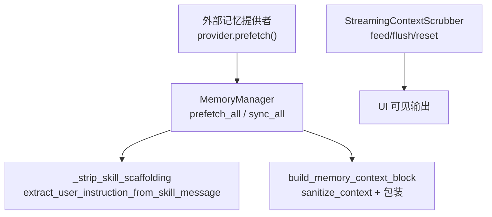
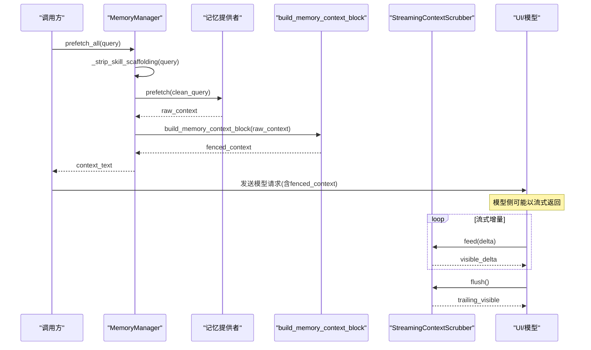
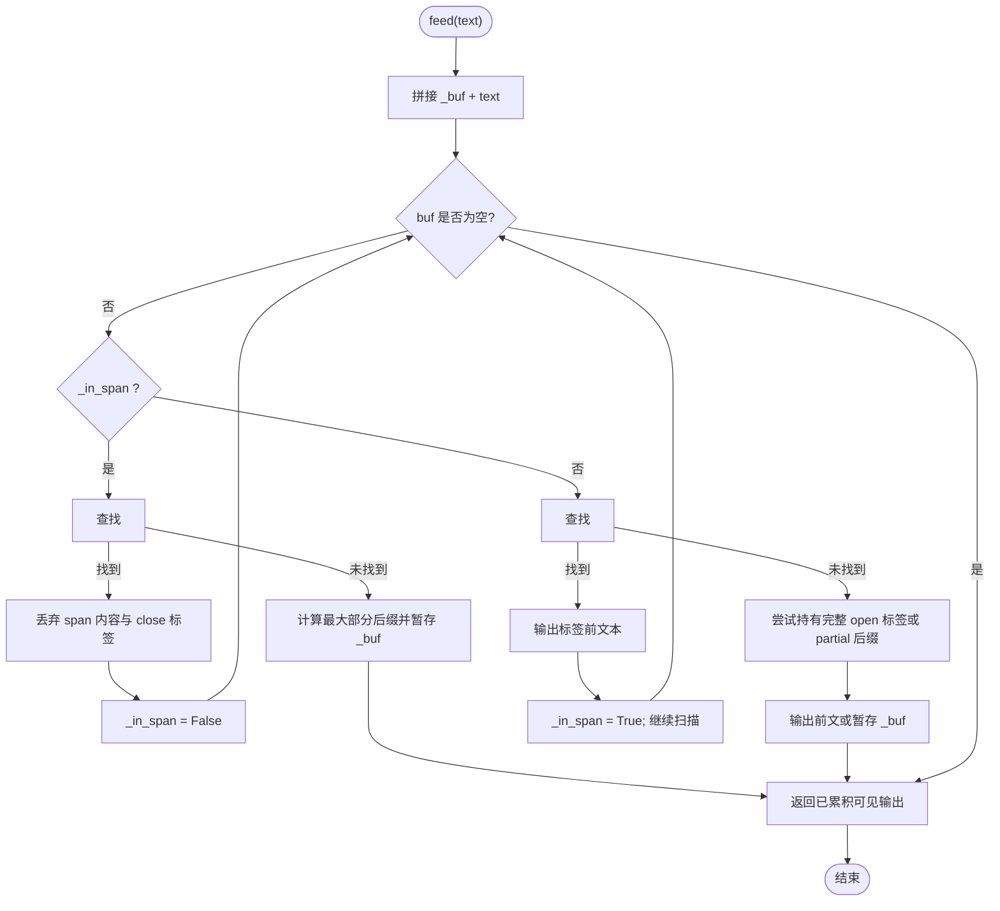
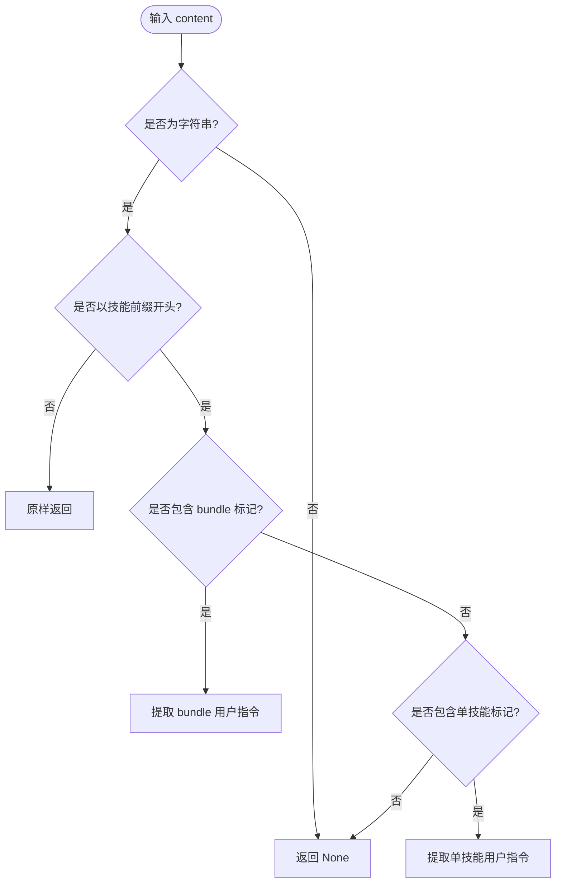
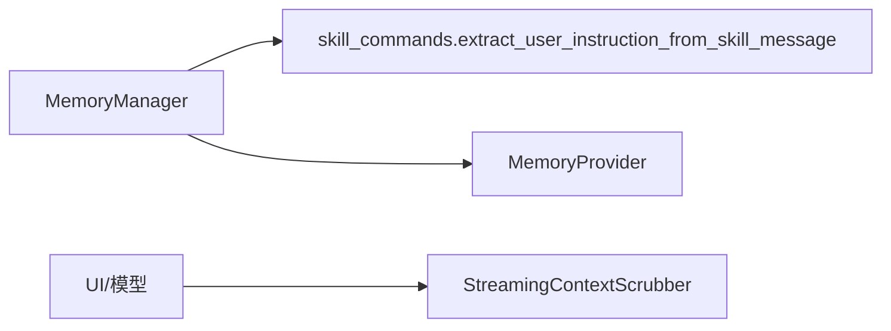

# 上下文处理机制

<cite>
**本文引用的文件**
- [agent/memory_manager.py](file://agent/memory_manager.py)
- [agent/skill_commands.py](file://agent/skill_commands.py)
- [tests/agent/test_streaming_context_scrubber.py](file://tests/agent/test_streaming_context_scrubber.py)
- [tests/agent/test_memory_provider.py](file://tests/agent/test_memory_provider.py)
</cite>

## 目录
1. [简介](#简介)
2. [项目结构](#项目结构)
3. [核心组件](#核心组件)
4. [架构总览](#架构总览)
5. [详细组件分析](#详细组件分析)
6. [依赖关系分析](#依赖关系分析)
7. [性能考量](#性能考量)
8. [故障排查指南](#故障排查指南)
9. [结论](#结论)
10. [附录：端到端流程示例](#附录端到端流程示例)

## 简介
本文件系统性说明记忆上下文处理机制，重点覆盖以下能力：
- StreamingContextScrubber 类在流式文本中对 memory-context 标签的状态机处理，确保跨分片（delta）的上下文块被完整剥离。
- sanitize_context 函数对一次性输入进行清理，移除内部标记与系统注释。
- build_memory_context_block 将检索到的记忆包装为结构化、可识别的上下文块。
- _strip_skill_scaffolding 从技能脚手架中剥离出用户指令，避免将技能体本身污染进记忆存储。
- 提供流式与批量两种场景下的完整处理流程示意与参考路径。

## 项目结构
与上下文处理直接相关的代码集中在 agent 模块：
- agent/memory_manager.py：实现上下文清洗、流式状态机、上下文块构建、记忆管理器编排等。
- agent/skill_commands.py：定义技能脚手架标记与用户指令提取逻辑，供 MemoryManager 复用。
- tests/agent/test_streaming_context_scrubber.py：针对流式状态机的单元测试，覆盖分片、大小写、未闭合等边界。
- tests/agent/test_memory_provider.py：验证一次性 sanitize_context 的行为与健壮性。

图表来源
- [agent/memory_manager.py:174-361](file://agent/memory_manager.py#L174-L361)
- [agent/memory_manager.py:508-545](file://agent/memory_manager.py#L508-L545)
- [agent/skill_commands.py:73-97](file://agent/skill_commands.py#L73-L97)

章节来源
- [agent/memory_manager.py:174-361](file://agent/memory_manager.py#L174-L361)
- [agent/skill_commands.py:73-97](file://agent/skill_commands.py#L73-L97)
- [tests/agent/test_streaming_context_scrubber.py:1-185](file://tests/agent/test_streaming_context_scrubber.py#L1-L185)
- [tests/agent/test_memory_provider.py:620-640](file://tests/agent/test_memory_provider.py#L620-L640)

## 核心组件
- sanitize_context(text): 一次性清理函数，移除 memory-context 围栏、注入的系统提示行以及残留的围栏标签，保证最终进入模型或 UI 的内容不含内部标记。
- StreamingContextScrubber: 面向流式增量文本的状态机，维护“是否在 span 内”“缓冲区”“块边界”等状态，按 delta 安全丢弃 memory-context 内容并保留可见输出。
- build_memory_context_block(raw_context): 将记忆提供者返回的原始上下文清洗后，包裹为带系统提示的标准 memory-context 块，便于下游识别与后续清理。
- MemoryManager._strip_skill_scaffolding(text): 当消息是技能脚手架展开后的产物时，仅提取用户指令；若无指令则返回空，使调用方跳过该轮的记忆写入。

章节来源
- [agent/memory_manager.py:174-179](file://agent/memory_manager.py#L174-L179)
- [agent/memory_manager.py:182-345](file://agent/memory_manager.py#L182-L345)
- [agent/memory_manager.py:347-361](file://agent/memory_manager.py#L347-L361)
- [agent/memory_manager.py:508-523](file://agent/memory_manager.py#L508-L523)
- [agent/skill_commands.py:73-97](file://agent/skill_commands.py#L73-L97)

## 架构总览
下图展示一次“预取记忆 → 构建上下文块 → 流式输出”的整体数据流，以及“同步记忆”时的技能脚手架剥离路径。

图表来源
- [agent/memory_manager.py:525-545](file://agent/memory_manager.py#L525-L545)
- [agent/memory_manager.py:347-361](file://agent/memory_manager.py#L347-L361)
- [agent/memory_manager.py:182-345](file://agent/memory_manager.py#L182-L345)

## 详细组件分析

### StreamingContextScrubber：流式 memory-context 状态机
- 设计目标：应对 provider 以 1~80 字符粒度推送 delta 的场景，防止 memory-context 的 open/close 标签被拆分到不同 delta 导致内容泄漏。
- 关键状态：
  - _in_span：是否处于 memory-context 块内部。
  - _buf：保存可能构成标签前缀的尾部片段，等待下一个 delta 确认。
  - _at_block_boundary：记录当前是否位于“块边界”，用于限制仅在块级出现 <memory-context> 时才视为上下文围栏，避免误删正文中的提及。
- 核心方法：
  - feed(text)：合并缓冲与输入，查找 close/open 标签；若找到 close，丢弃 span 内容并退出；若找到 open，先输出前文，再进入 span；否则将可能的标签前缀暂存至 _buf。
  - flush()：流结束时，若仍处于 span 内则丢弃剩余内容（更安全），否则输出缓冲尾段。
  - reset()：新 turn 开始时重置状态，避免跨 turn 污染。
- 边界保护：
  - 仅当 open 标签出现在块边界且其后紧跟换行符才视为有效围栏，避免误伤如 “The <memory-context> tag name is documented here.” 这类自然语言提及。
  - 大小写不敏感匹配。
  - 未闭合的 span 会丢弃其尾部，避免泄露内部上下文。

图表来源
- [agent/memory_manager.py:221-345](file://agent/memory_manager.py#L221-L345)

章节来源
- [agent/memory_manager.py:182-345](file://agent/memory_manager.py#L182-L345)
- [tests/agent/test_streaming_context_scrubber.py:12-153](file://tests/agent/test_streaming_context_scrubber.py#L12-L153)

### sanitize_context：一次性清理
- 功能：移除 memory-context 围栏、系统提示行以及残留的 open/close 标签，适用于整段文本的一次性清理。
- 行为要点：
  - 使用正则匹配并替换掉整个 <memory-context>...</memory-context> 块。
  - 同时移除形如 “[System note: ...]” 的系统提示行。
  - 最后移除任何残留的围栏标签，确保输出干净。
- 测试覆盖：
  - 能正确去除围栏转义注入。
  - 大小写不敏感。

章节来源
- [agent/memory_manager.py:163-179](file://agent/memory_manager.py#L163-L179)
- [tests/agent/test_memory_provider.py:626-639](file://tests/agent/test_memory_provider.py#L626-L639)

### build_memory_context_block：上下文块构建
- 功能：将记忆提供者返回的原始上下文清洗后，包装为标准 memory-context 块，附带系统提示行，以便下游统一识别与清理。
- 行为要点：
  - 若输入为空或空白，返回空字符串。
  - 先调用 sanitize_context 清理，若发现提供者已预先包装，则记录警告日志。
  - 输出格式固定为：<memory-context>\n[系统提示]\n\n{clean}\n</memory-context>。
- 用途：作为 MemoryManager.prefetch_all 的结果，注入到模型上下文中，并在流式输出阶段由 StreamingContextScrubber 安全剥离。

章节来源
- [agent/memory_manager.py:347-361](file://agent/memory_manager.py#L347-L361)
- [tests/agent/test_streaming_context_scrubber.py:155-185](file://tests/agent/test_streaming_context_scrubber.py#L155-L185)

### _strip_skill_scaffolding：技能脚手架剥离
- 背景：当用户通过 /skill 或 /bundle 调用时，Hermes 会将完整的技能体嵌入消息中。若原样送入记忆提供者，会导致存储/索引中包含大量技能体而非用户真实意图。
- 行为：
  - 非技能消息：原样返回。
  - 单技能/多技能（bundle）：根据内置标记提取用户指令。
  - 无用户指令的技能调用：返回 None，调用方可据此跳过本轮记忆写入。
- 实现位置：MemoryManager._strip_skill_scaffolding 委托给 extract_user_instruction_from_skill_message。

图表来源
- [agent/skill_commands.py:73-97](file://agent/skill_commands.py#L73-L97)
- [agent/skill_commands.py:139-166](file://agent/skill_commands.py#L139-L166)

章节来源
- [agent/memory_manager.py:508-523](file://agent/memory_manager.py#L508-L523)
- [agent/skill_commands.py:73-97](file://agent/skill_commands.py#L73-L97)
- [agent/skill_commands.py:139-166](file://agent/skill_commands.py#L139-L166)

## 依赖关系分析
- MemoryManager 依赖：
  - agent/skill_commands.extract_user_instruction_from_skill_message：用于剥离技能脚手架。
  - 记忆提供者接口 MemoryProvider：负责实际检索与缓存。
- StreamingContextScrubber 独立于提供者，仅关注流式文本的结构化围栏。
- 测试用例覆盖了：
  - 流式分片场景下的状态机正确性。
  - 一次性 sanitize_context 的正反例。
  - 预包装上下文块的告警行为。

图表来源
- [agent/memory_manager.py:508-523](file://agent/memory_manager.py#L508-L523)
- [agent/memory_manager.py:182-345](file://agent/memory_manager.py#L182-L345)
- [agent/skill_commands.py:73-97](file://agent/skill_commands.py#L73-L97)

章节来源
- [agent/memory_manager.py:508-545](file://agent/memory_manager.py#L508-L545)
- [agent/skill_commands.py:73-97](file://agent/skill_commands.py#L73-L97)

## 性能考量
- 流式处理：
  - StreamingContextScrubber 每次 feed 仅做线性扫描与少量字符串操作，适合高频小增量输入。
  - 通过 _buf 暂存潜在标签前缀，减少误判与重复扫描。
- 批量处理：
  - sanitize_context 使用正则一次性替换，开销与输入长度线性相关，适合整段文本。
- 记忆预取：
  - 外部提供者的预取采用线程并发与超时控制，避免阻塞主流程。
  - 同步写入走后台串行执行器，保证顺序且不阻塞对话完成。

## 故障排查指南
- 症状：UI 中出现不应显示的“记忆上下文”或系统提示行。
  - 检查是否使用了 StreamingContextScrubber 处理流式响应，并确保每轮新建或调用 reset()。
  - 参考测试用例验证分片场景下是否正确剥离。
- 症状：一次性文本清理无效。
  - 确认传入的是字符串而非列表或多模态对象；必要时先展平为字符串。
  - 检查是否存在大小写变体的围栏标签。
- 症状：记忆提供者返回了已包装的上下文。
  - build_memory_context_block 会记录警告日志；应修正提供者，使其返回原始上下文。
- 症状：技能调用未写入记忆。
  - 若 _strip_skill_scaffolding 返回 None，表示无用户指令，属预期行为；可在上层决定是否跳过。

章节来源
- [tests/agent/test_streaming_context_scrubber.py:55-153](file://tests/agent/test_streaming_context_scrubber.py#L55-L153)
- [tests/agent/test_memory_provider.py:626-677](file://tests/agent/test_memory_provider.py#L626-L677)
- [agent/memory_manager.py:347-361](file://agent/memory_manager.py#L347-L361)

## 结论
本机制通过“一次性清理 + 流式状态机 + 标准化上下文块 + 技能脚手架剥离”的组合，确保：
- 记忆上下文不会泄漏到 UI 或模型对话中。
- 流式分片不会破坏上下文围栏的完整性。
- 记忆提供者只接收真正有意义的用户意图，避免污染存储与索引。
- 在不同场景（流式/批量）下均具备一致性与鲁棒性。

## 附录：端到端流程示例

### 场景一：流式处理（推荐）
- 步骤：
  1) 创建 StreamingContextScrubber 实例。
  2) 对每个流式增量调用 feed(delta)，收集可见输出。
  3) 流结束时调用 flush()，追加尾部可见内容。
  4) 新 turn 开始时调用 reset() 清空状态。
- 参考路径：
  - [agent/memory_manager.py:182-345](file://agent/memory_manager.py#L182-L345)
  - [tests/agent/test_streaming_context_scrubber.py:29-49](file://tests/agent/test_streaming_context_scrubber.py#L29-L49)

### 场景二：批量处理
- 步骤：
  1) 将记忆提供者返回的原始上下文交给 build_memory_context_block 包装。
  2) 将结果注入模型上下文。
  3) 若需对最终输出做一次性清理，可使用 sanitize_context。
- 参考路径：
  - [agent/memory_manager.py:347-361](file://agent/memory_manager.py#L347-L361)
  - [agent/memory_manager.py:174-179](file://agent/memory_manager.py#L174-L179)
  - [tests/agent/test_memory_provider.py:626-639](file://tests/agent/test_memory_provider.py#L626-L639)

### 场景三：技能调用（剥离脚手架）
- 步骤：
  1) 在 MemoryManager.prefetch_all / sync_all 入口调用 _strip_skill_scaffolding。
  2) 若返回 None，跳过该轮记忆写入；若返回字符串，使用该字符串作为用户内容。
- 参考路径：
  - [agent/memory_manager.py:508-523](file://agent/memory_manager.py#L508-L523)
  - [agent/skill_commands.py:73-97](file://agent/skill_commands.py#L73-L97)