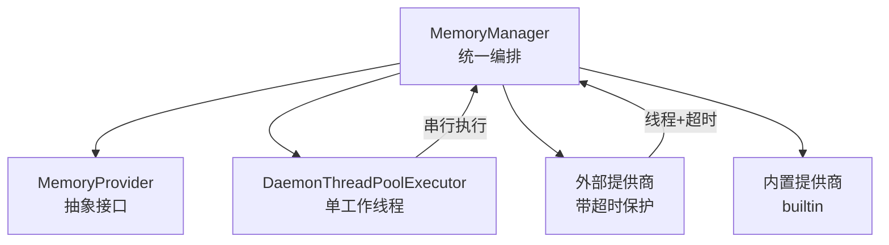
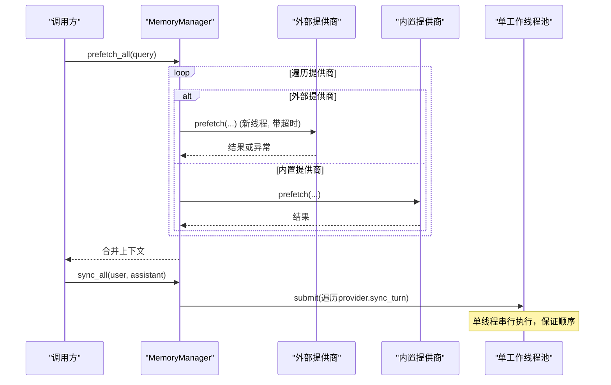
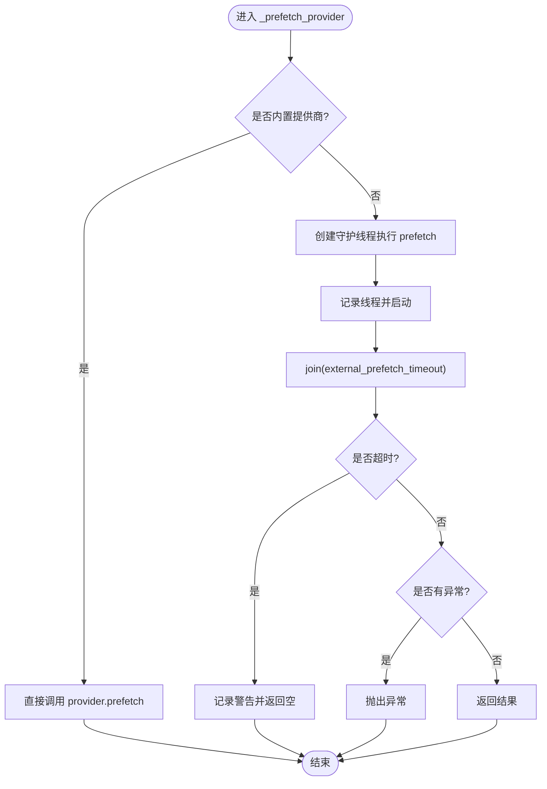
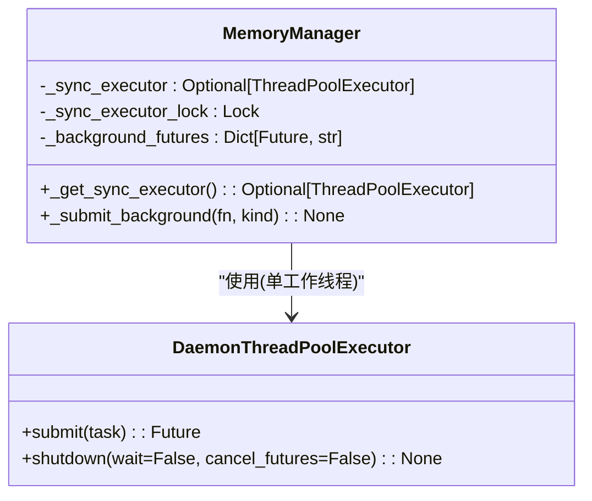
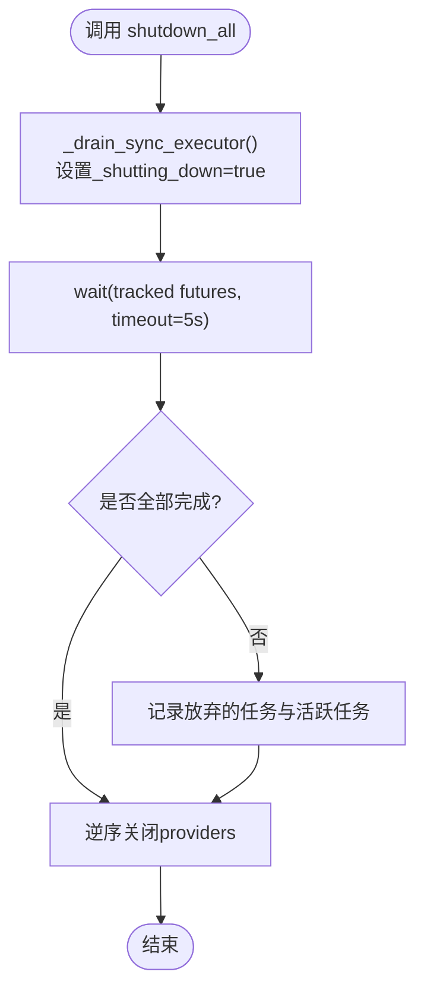
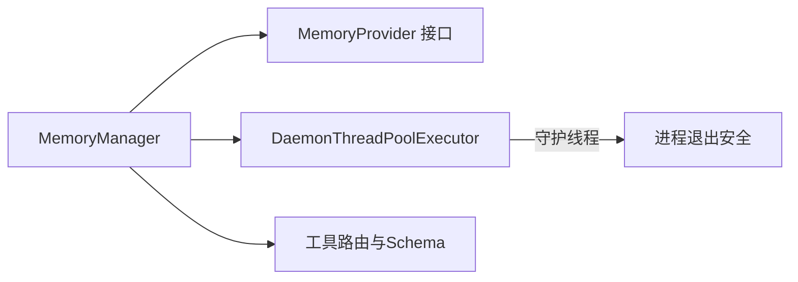

# 存储生命周期管理

<cite>
**本文引用的文件**
- [agent/memory_manager.py](file://agent/memory_manager.py)
- [agent/memory_provider.py](file://agent/memory_provider.py)
- [tools/daemon_pool.py](file://tools/daemon_pool.py)
</cite>

## 目录
1. [简介](#简介)
2. [项目结构](#项目结构)
3. [核心组件](#核心组件)
4. [架构总览](#架构总览)
5. [详细组件分析](#详细组件分析)
6. [依赖关系分析](#依赖关系分析)
7. [性能考量](#性能考量)
8. [故障排查指南](#故障排查指南)
9. [结论](#结论)
10. [附录：使用示例与最佳实践](#附录使用示例与最佳实践)

## 简介
本文件聚焦于记忆存储的生命周期管理，围绕 MemoryManager 的异步操作管理机制展开，重点说明预取（prefetch）与同步（sync）的后台执行策略、线程池管理（DaemonThreadPoolExecutor 的使用与单工作线程序列化保证）、外部提供商预取的超时控制、关闭流程中的 flush_pending 机制，以及并发访问控制与线程安全保证。文档同时提供具体使用示例，展示如何正确处理存储操作的异步性与错误恢复。

## 项目结构
MemoryManager 位于 agent/memory_manager.py，作为记忆系统的统一入口，协调内置与外部记忆提供商；MemoryProvider 抽象接口定义在 agent/memory_provider.py；后台线程池由 tools/daemon_pool.py 提供的 DaemonThreadPoolExecutor 实现。



图表来源
- [agent/memory_manager.py:364-758](file://agent/memory_manager.py#L364-L758)
- [agent/memory_provider.py:81-190](file://agent/memory_provider.py#L81-L190)
- [tools/daemon_pool.py:37-65](file://tools/daemon_pool.py#L37-L65)

章节来源
- [agent/memory_manager.py:1-120](file://agent/memory_manager.py#L1-L120)
- [agent/memory_provider.py:1-32](file://agent/memory_provider.py#L1-L32)
- [tools/daemon_pool.py:1-25](file://tools/daemon_pool.py#L1-L25)

## 核心组件
- MemoryManager：注册与管理多个 MemoryProvider（最多一个外部提供商），负责系统提示构建、预取、同步、工具路由、会话边界处理与关闭流程。
- MemoryProvider：抽象接口，定义 initialize、system_prompt_block、prefetch、queue_prefetch、sync_turn、get_tool_schemas、handle_tool_call、shutdown 等生命周期方法，以及若干可选钩子。
- DaemonThreadPoolExecutor：基于标准库 ThreadPoolExecutor 的变体，使用守护线程并避免被解释器退出时的 join 阻塞，适合“尽力而为”的后台任务。

章节来源
- [agent/memory_manager.py:364-758](file://agent/memory_manager.py#L364-L758)
- [agent/memory_provider.py:81-190](file://agent/memory_provider.py#L81-L190)
- [tools/daemon_pool.py:37-65](file://tools/daemon_pool.py#L37-L65)

## 架构总览
MemoryManager 将“读路径”（prefetch）和“写路径”（sync）解耦为前台快速响应与后台持久化：
- 读路径：prefetch_all 对每个 provider 调用 prefetch；对于外部提供商，采用独立线程 + 超时控制，避免慢/卡住的提供商阻塞当前请求。
- 写路径：sync_all 将 turn 写入所有 provider；通过 _submit_background 提交到单工作线程的 DaemonThreadPoolExecutor，确保写入顺序（turn N 先于 turn N+1）。
- 会话边界：commit_session_boundary_async 将 on_session_end 与 on_session_switch 合并为一个序列化的后台任务，避免竞态。
- 关闭流程：shutdown_all 先尝试有界地排空后台任务（flush_pending/_drain_sync_executor），再按逆序关闭 providers。



图表来源
- [agent/memory_manager.py:525-695](file://agent/memory_manager.py#L525-L695)
- [agent/memory_manager.py:698-758](file://agent/memory_manager.py#L698-L758)
- [agent/memory_provider.py:132-170](file://agent/memory_provider.py#L132-L170)

## 详细组件分析

### 预取（prefetch）与外部提供商超时控制
- 内部逻辑：prefetch_all 会过滤掉无意义的技能脚手架文本，然后逐个 provider 调用 _prefetch_provider。
- 外部提供商：_prefetch_provider 为每个外部提供商启动一个守护线程执行 prefetch，并通过 _external_prefetch_lock 维护线程引用，防止重复启动；随后 join 等待结果，超过 external_prefetch_timeout（默认约 8 秒）则记录警告并跳过该提供商本次预取。
- 错误传播：若线程内抛出异常，将在 join 后重新抛出给调用方；若无异常但结果为空，则返回空字符串。



图表来源
- [agent/memory_manager.py:547-595](file://agent/memory_manager.py#L547-L595)

章节来源
- [agent/memory_manager.py:525-595](file://agent/memory_manager.py#L525-L595)

### 同步（sync）与后台序列化执行
- 触发点：每轮对话结束后调用 sync_all，将用户与助手内容写入所有提供商。
- 后台执行：通过 _submit_background 将遍历 provider.sync_turn 的任务提交到单工作线程的 DaemonThreadPoolExecutor。若 executor 不可用或处于关闭中，会降级为内联执行并记录日志。
- 顺序保证：单工作线程确保 turn N 的写入先于 turn N+1，provider 无需自行实现排序。
- 消息兼容：根据 provider 签名动态决定是否传递 messages 参数。

```mermaid
sequenceDiagram
participant Loop as "对话循环"
participant MM as "MemoryManager"
participant Pool as "单工作线程池"
participant P1 as "Provider A"
participant P2 as "Provider B"
Loop->>MM : sync_all(user, assistant, session_id, messages?)
MM->>Pool : submit(fn=遍历provider.sync_turn)
Pool-->>P1 : sync_turn(...)
Pool-->>P2 : sync_turn(...)
Note over Pool : 单线程串行，保证顺序
```

图表来源
- [agent/memory_manager.py:638-695](file://agent/memory_manager.py#L638-L695)
- [agent/memory_manager.py:698-758](file://agent/memory_manager.py#L698-L758)

章节来源
- [agent/memory_manager.py:626-695](file://agent/memory_manager.py#L626-L695)

### 线程池管理与单工作线程序列化
- 懒创建：_get_sync_executor 首次使用时创建 DaemonThreadPoolExecutor(max_workers=1)，避免在无外部提供商时创建额外线程。
- 守护线程：DaemonThreadPoolExecutor 使用守护线程，避免进程退出时被阻塞；即使 provider 卡在 I/O，也不会阻止解释器退出。
- 提交与追踪：_submit_background 在提交任务时将 Future 与任务类型（write/prefetch）关联，便于关闭时统计与清理。



图表来源
- [agent/memory_manager.py:736-758](file://agent/memory_manager.py#L736-L758)
- [tools/daemon_pool.py:37-65](file://tools/daemon_pool.py#L37-L65)

章节来源
- [agent/memory_manager.py:736-758](file://agent/memory_manager.py#L736-L758)
- [tools/daemon_pool.py:1-25](file://tools/daemon_pool.py#L1-L25)

### 关闭流程与 flush_pending
- flush_pending：向单工作线程提交一个空任务并等待其完成，从而确保之前提交的所有任务已执行完毕。若 executor 不存在或已关闭，立即返回 True。
- shutdown_all：先调用 _drain_sync_executor 进行有界排空（默认约 5 秒），期间设置 _shutting_down 标志以拒绝新任务；然后按逆序关闭各 provider。
- 排空细节：_drain_sync_executor 记录活跃任务数，等待 tracked futures 完成；若超时，取消部分可取消任务并记录放弃数量与状态。



图表来源
- [agent/memory_manager.py:1144-1223](file://agent/memory_manager.py#L1144-L1223)
- [agent/memory_manager.py:759-781](file://agent/memory_manager.py#L759-L781)

章节来源
- [agent/memory_manager.py:759-781](file://agent/memory_manager.py#L759-L781)
- [agent/memory_manager.py:1144-1223](file://agent/memory_manager.py#L1144-L1223)

### 并发访问控制与线程安全
- 外部预取锁：_external_prefetch_lock 保护外部提供商预取线程的注册与清理，避免同一提供商在同一时刻重复启动多个预取线程。
- 执行器锁：_sync_executor_lock 保护 _sync_executor 的懒创建、关闭标记与 future 追踪字典的原子更新。
- 关闭标志：_shutting_down 用于拒绝新任务提交，确保关闭期间的稳定性。
- 异常隔离：各 provider 调用均包裹 try/except，单个 provider 失败不影响其他 provider。

章节来源
- [agent/memory_manager.py:371-400](file://agent/memory_manager.py#L371-L400)
- [agent/memory_manager.py:567-595](file://agent/memory_manager.py#L567-L595)
- [agent/memory_manager.py:712-734](file://agent/memory_manager.py#L712-L734)
- [agent/memory_manager.py:1171-1215](file://agent/memory_manager.py#L1171-L1215)

### 会话边界与压缩前钩子
- commit_session_boundary_async：将 on_session_end 与 on_session_switch 合并为一个后台任务，确保提取旧会话信息后再切换到新会话，避免数据错置。
- on_pre_compress：在上下文压缩前收集 provider 的摘要文本，帮助保留关键信息。

章节来源
- [agent/memory_manager.py:877-925](file://agent/memory_manager.py#L877-L925)
- [agent/memory_manager.py:974-992](file://agent/memory_manager.py#L974-L992)

## 依赖关系分析
- MemoryManager 依赖 MemoryProvider 抽象接口，实现对多提供商的统一编排。
- 外部提供商预取通过独立线程与超时控制，降低主流程延迟风险。
- 写路径依赖 DaemonThreadPoolExecutor 的单工作线程，保证写入顺序与进程退出安全。
- 工具路由与 schema 注入依赖 normalize_tool_schema 与核心工具名白名单，避免冲突。



图表来源
- [agent/memory_manager.py:364-758](file://agent/memory_manager.py#L364-L758)
- [agent/memory_provider.py:81-190](file://agent/memory_provider.py#L81-L190)
- [tools/daemon_pool.py:37-65](file://tools/daemon_pool.py#L37-L65)

章节来源
- [agent/memory_manager.py:364-758](file://agent/memory_manager.py#L364-L758)
- [agent/memory_provider.py:81-190](file://agent/memory_provider.py#L81-L190)
- [tools/daemon_pool.py:37-65](file://tools/daemon_pool.py#L37-L65)

## 性能考量
- 预取超时：外部提供商预取默认约 8 秒超时，避免慢查询拖垮用户体验；超时后跳过该提供商本次预取，保障主流程响应。
- 写路径串行：单工作线程确保写入顺序，减少竞争与重复；但高吞吐场景下需关注队列堆积与关闭排空时间。
- 懒创建线程池：仅在首次需要时创建，减少资源开销。
- 守护线程：避免进程退出阻塞，提升整体可终止性。

## 故障排查指南
- 预取超时：检查外部提供商网络与配置；若频繁超时，考虑调整 external_prefetch_timeout 或优化提供商实现。
- 写路径堆积：监控 flush_pending 与 shutdown drain 状态；若经常超时，评估 provider 写入耗时与队列长度。
- 线程泄漏：确认外部预取线程在完成后从 _external_prefetch_threads 移除；若未移除，可能导致后续跳过预取。
- 工具冲突：若 provider 工具名与核心工具冲突，会被忽略；请重命名 provider 工具以避免覆盖。

章节来源
- [agent/memory_manager.py:547-595](file://agent/memory_manager.py#L547-L595)
- [agent/memory_manager.py:759-781](file://agent/memory_manager.py#L759-L781)
- [agent/memory_manager.py:1144-1223](file://agent/memory_manager.py#L1144-L1223)

## 结论
MemoryManager 通过“读路径超时保护 + 写路径串行后台执行”的设计，实现了记忆存储的高可用与一致性。DaemonThreadPoolExecutor 的守护线程与单工作线程模型确保了进程退出安全与写入顺序。flush_pending 与关闭流程提供了可控的资源回收与状态收敛。结合合理的超时与错误隔离，系统在复杂环境下仍能保持稳健运行。

## 附录：使用示例与最佳实践
- 初始化与注册
  - 创建 MemoryManager 实例，可选择传入 external_prefetch_timeout。
  - 添加至少一个 provider（内置或外部），注意仅允许一个外部提供商。
- 预取与同步
  - 在每轮对话前调用 prefetch_all 获取上下文。
  - 在每轮对话后调用 sync_all 写入 turn，并可选调用 queue_prefetch_all 为下一轮预取排队。
- 会话边界
  - 在会话切换或压缩前，调用 commit_session_boundary_async 与 on_pre_compress。
- 关闭与排空
  - 在进程退出前调用 flush_pending 等待后台任务完成，再调用 shutdown_all 关闭 providers。
- 错误恢复
  - 捕获外部提供商预取异常并记录日志；必要时重试或降级。
  - 对 sync 失败进行告警与重试（在 provider 层实现），确保最终一致性。

章节来源
- [agent/memory_manager.py:364-758](file://agent/memory_manager.py#L364-L758)
- [agent/memory_provider.py:132-170](file://agent/memory_provider.py#L132-L170)