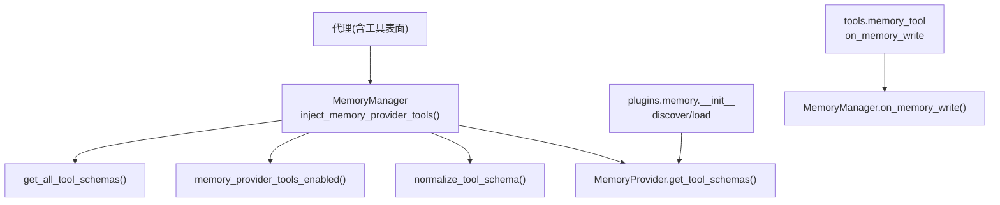
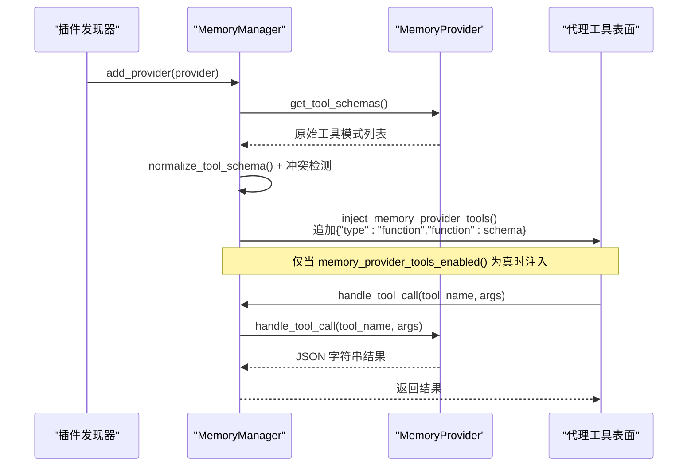
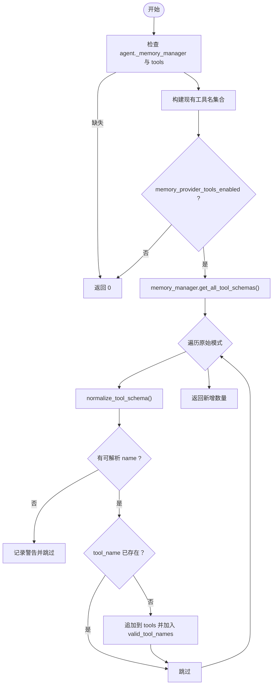
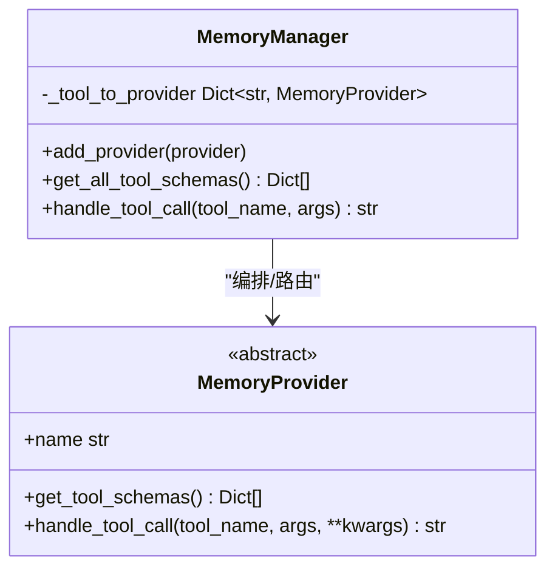
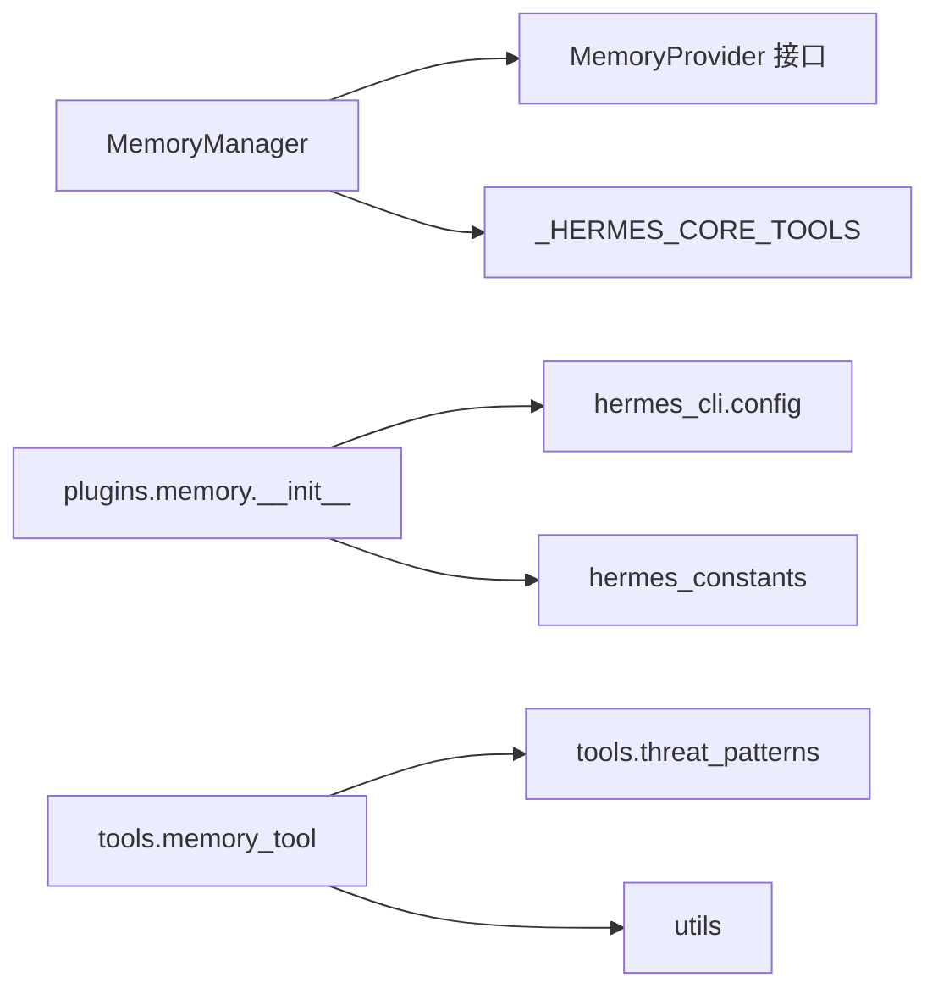

# 工具集成机制

<cite>
**本文引用的文件**
- [agent/memory_manager.py](file://agent/memory_manager.py)
- [agent/memory_provider.py](file://agent/memory_provider.py)
- [plugins/memory/__init__.py](file://plugins/memory/__init__.py)
- [tools/memory_tool.py](file://tools/memory_tool.py)
</cite>

## 目录
1. [简介](#简介)
2. [项目结构](#项目结构)
3. [核心组件](#核心组件)
4. [架构总览](#架构总览)
5. [详细组件分析](#详细组件分析)
6. [依赖关系分析](#依赖关系分析)
7. [性能考量](#性能考量)
8. [故障排查指南](#故障排查指南)
9. [结论](#结论)
10. [附录：自定义记忆提供商集成示例](#附录自定义记忆提供商集成示例)

## 简介
本文件系统性说明“记忆工具集成机制”，重点解释如下内容：
- inject_memory_provider_tools 如何将外部记忆提供商的工具注入到代理工具表面；
- 工具模式发现与注册流程，包括 get_all_tool_schemas 的实现与工具名称冲突检测；
- 工具启用控制 memory_provider_tools_enabled 的配置逻辑与工具集过滤；
- 工具模式标准化 normalize_tool_schema 对不同格式提供商工具定义的处理；
- 提供具体集成示例，指导如何开发自定义记忆提供商并正确暴露工具接口。

## 项目结构
围绕记忆工具集成，关键代码分布在以下模块：
- agent/memory_manager.py：记忆管理器，负责工具模式收集、去重、冲突检测、注入决策与路由；
- agent/memory_provider.py：记忆提供商抽象基类，定义工具模式获取与工具调用处理等契约；
- plugins/memory/__init__.py：插件发现与加载，扫描内置与用户安装的记忆提供商；
- tools/memory_tool.py：内置记忆工具（MEMORY.md/USER.md），用于持久化记忆条目，并通过 on_memory_write 通知外部提供商。

图表来源
- [agent/memory_manager.py:110-156](file://agent/memory_manager.py#L110-L156)
- [agent/memory_manager.py:50-107](file://agent/memory_manager.py#L50-L107)
- [agent/memory_manager.py:784-819](file://agent/memory_manager.py#L784-L819)
- [plugins/memory/__init__.py:157-217](file://plugins/memory/__init__.py#L157-L217)
- [tools/memory_tool.py:1019-1128](file://tools/memory_tool.py#L1019-L1128)

章节来源
- [agent/memory_manager.py:110-156](file://agent/memory_manager.py#L110-L156)
- [agent/memory_manager.py:50-107](file://agent/memory_manager.py#L50-L107)
- [agent/memory_manager.py:784-819](file://agent/memory_manager.py#L784-L819)
- [plugins/memory/__init__.py:157-217](file://plugins/memory/__init__.py#L157-L217)
- [tools/memory_tool.py:1019-1128](file://tools/memory_tool.py#L1019-L1128)

## 核心组件
- MemoryProvider（抽象基类）：定义 name、is_available、initialize、get_tool_schemas、handle_tool_call 等核心方法，以及可选钩子如 on_turn_start、on_session_end、on_session_switch、on_pre_compress、on_memory_write、backup_paths。
- MemoryManager：编排内置与至多一个外部记忆提供商；负责工具模式收集、去重、冲突检测、注入决策、工具路由、预取与同步生命周期管理。
- 插件发现器（plugins.memory.__init__）：扫描内置与用户安装目录，动态加载 MemoryProvider 实现或 register(ctx) 风格插件。
- 内置记忆工具（tools.memory_tool.py）：以文件形式维护 MEMORY.md/USER.md，并在写入时通过 MemoryManager 的 on_memory_write 通知外部提供商镜像写入。

章节来源
- [agent/memory_provider.py:81-188](file://agent/memory_provider.py#L81-L188)
- [agent/memory_manager.py:364-470](file://agent/memory_manager.py#L364-L470)
- [plugins/memory/__init__.py:157-217](file://plugins/memory/__init__.py#L157-L217)
- [tools/memory_tool.py:1019-1128](file://tools/memory_tool.py#L1019-L1128)

## 架构总览
下图展示从“插件发现”到“工具注入”再到“工具路由”的端到端流程。

图表来源
- [plugins/memory/__init__.py:157-217](file://plugins/memory/__init__.py#L157-L217)
- [agent/memory_manager.py:404-470](file://agent/memory_manager.py#L404-L470)
- [agent/memory_manager.py:110-156](file://agent/memory_manager.py#L110-L156)
- [agent/memory_manager.py:829-847](file://agent/memory_manager.py#L829-L847)

## 详细组件分析

### 工具注入入口：inject_memory_provider_tools
- 作用：将外部记忆提供商的工具模式注入到代理的工具表面（tools 列表），并更新 valid_tool_names 以便后续路由识别。
- 关键步骤：
  - 读取 agent.tools、agent.enabled_toolsets、agent.disabled_toolsets；
  - 调用 memory_provider_tools_enabled 判断是否允许注入；
  - 遍历 memory_manager.get_all_tool_schemas() 获取所有提供商的工具模式；
  - 对每个原始模式执行 normalize_tool_schema 标准化；
  - 跳过无名称或已存在的工具名，避免重复与冲突；
  - 将标准化后的模式包装为 OpenAI function tool 形式追加到 tools。
- 返回值：实际新增的工具数量。

图表来源
- [agent/memory_manager.py:110-156](file://agent/memory_manager.py#L110-L156)

章节来源
- [agent/memory_manager.py:110-156](file://agent/memory_manager.py#L110-L156)

### 工具启用控制：memory_provider_tools_enabled
- 作用：决定外部记忆提供商的工具是否应暴露给模型。
- 配置逻辑：
  - 若 disabled_toolsets 包含 "memory"，直接禁用；
  - 若当前工具表面已存在内置 "memory" 工具，则允许暴露（便于统一工具集）；
  - 若 enabled_toolsets 为 None，默认允许；
  - 若 enabled_toolsets 为空列表，则禁用；
  - 若显式包含 "memory"，则允许；
  - 否则尝试通过 toolsets.resolve_toolset(name) 解析各启用工具集，只要任一包含 "memory" 即允许；
  - 解析失败时降级为禁用并记录调试日志。
- 设计要点：兼顾显式白名单/黑名单与工具集解析，确保在复杂配置下仍可控。

章节来源
- [agent/memory_manager.py:83-107](file://agent/memory_manager.py#L83-L107)

### 工具模式标准化：normalize_tool_schema
- 作用：统一不同提供商返回的工具模式格式，确保最终 schema 具备可解析的顶层 name。
- 支持格式：
  - 标准函数模式：{"name": "...", "description": "...", "parameters": {...}}；
  - 已包装的 OpenAI tool 条目：{"type": "function", "function": {...}}，需先解包再校验。
- 失败处理：无法提取 name 的模式将被丢弃并记录警告，避免污染请求导致严格提供商拒绝整个工具集。

章节来源
- [agent/memory_manager.py:50-80](file://agent/memory_manager.py#L50-L80)

### 工具模式发现与注册：get_all_tool_schemas 与冲突检测
- get_all_tool_schemas：
  - 遍历所有已注册的 MemoryProvider；
  - 对每个 provider.get_tool_schemas() 的结果进行 normalize_tool_schema；
  - 跳过保留的核心工具名（来自 _HERMES_CORE_TOOLS）；
  - 去重（按 name），收集有效 schema 列表。
- 冲突检测：
  - 在 add_provider 阶段，对每个 provider 的工具名进行保留名检查与重复名检查；
  - 若与核心工具名冲突，记录警告并忽略该工具；
  - 若与其他提供商工具名冲突，记录警告并忽略后者的工具；
  - 建立 tool_to_provider 映射，供后续路由使用。
- 安全与健壮性：
  - 单个 provider 的 get_tool_schemas 异常不会中断其他 provider 的收集；
  - 无名称或非法模式被静默跳过并记录警告。

图表来源
- [agent/memory_manager.py:404-470](file://agent/memory_manager.py#L404-L470)
- [agent/memory_manager.py:784-819](file://agent/memory_manager.py#L784-L819)
- [agent/memory_manager.py:829-847](file://agent/memory_manager.py#L829-L847)
- [agent/memory_provider.py:172-188](file://agent/memory_provider.py#L172-L188)

章节来源
- [agent/memory_manager.py:404-470](file://agent/memory_manager.py#L404-L470)
- [agent/memory_manager.py:784-819](file://agent/memory_manager.py#L784-L819)
- [agent/memory_provider.py:172-188](file://agent/memory_provider.py#L172-L188)

### 插件发现与加载：plugins.memory.__init__
- 扫描路径：
  - 内置：plugins/memory/<name>/；
  - 用户安装：$HERMES_HOME/plugins/<name>/。
- 发现策略：
  - 优先扫描内置，再扫描用户安装；
  - 同名冲突时，内置优先；
  - 通过轻量文本扫描判断是否为记忆插件（包含 register_memory_provider 或 MemoryProvider）。
- 加载策略：
  - 优先尝试 register(ctx) 模式，捕获 provider；
  - 回退到查找继承自 MemoryProvider 的类并实例化；
  - 为用户插件创建合成命名空间以避免 sys.modules 冲突。
- 可用性检查：
  - discover_memory_providers 会调用 is_available() 快速判定可用状态。

章节来源
- [plugins/memory/__init__.py:157-217](file://plugins/memory/__init__.py#L157-L217)
- [plugins/memory/__init__.py:219-327](file://plugins/memory/__init__.py#L219-L327)
- [plugins/memory/__init__.py:64-121](file://plugins/memory/__init__.py#L64-L121)

### 内置记忆工具与外部提供商镜像写入
- 内置工具职责：
  - 维护 MEMORY.md/USER.md，提供 add/replace/remove/batch 操作；
  - 写入成功后，通过 MemoryManager.notify_memory_tool_write 触发对外部提供商的镜像写入。
- 镜像逻辑：
  - 仅对成功且非 staged 的写入生效；
  - 支持单操作与批量 operations 两种形状；
  - 仅转发 add/replace/remove 动作；
  - 构建 per-op 元数据（含 old_text 等），调用 on_memory_write。

章节来源
- [tools/memory_tool.py:1019-1128](file://tools/memory_tool.py#L1019-L1128)
- [agent/memory_provider.py:322-339](file://agent/memory_provider.py#L322-L339)

## 依赖关系分析
- MemoryManager 依赖：
  - MemoryProvider 抽象接口（get_tool_schemas、handle_tool_call、生命周期钩子）；
  - toolsets 中的核心工具名集合（用于冲突检测）；
  - 插件发现器（间接通过 run_agent 等上层组装 MemoryManager）。
- 插件发现器依赖：
  - hermes_constants（获取 HERMES_HOME）；
  - hermes_cli.config（读取 active memory provider）。
- 内置记忆工具依赖：
  - hermes_constants（获取存储路径）；
  - utils（原子写入）；
  - tools.threat_patterns（内容扫描）。

图表来源
- [agent/memory_manager.py:437-456](file://agent/memory_manager.py#L437-L456)
- [plugins/memory/__init__.py:64-71](file://plugins/memory/__init__.py#L64-L71)
- [plugins/memory/__init__.py:350-362](file://plugins/memory/__init__.py#L350-L362)
- [tools/memory_tool.py:31-34](file://tools/memory_tool.py#L31-L34)
- [tools/memory_tool.py:83-88](file://tools/memory_tool.py#L83-L88)

章节来源
- [agent/memory_manager.py:437-456](file://agent/memory_manager.py#L437-L456)
- [plugins/memory/__init__.py:64-71](file://plugins/memory/__init__.py#L64-L71)
- [plugins/memory/__init__.py:350-362](file://plugins/memory/__init__.py#L350-L362)
- [tools/memory_tool.py:31-34](file://tools/memory_tool.py#L31-L34)
- [tools/memory_tool.py:83-88](file://tools/memory_tool.py#L83-L88)

## 性能考量
- 背景任务隔离：MemoryManager 将 sync/prefetch 放入单工作线程执行器，避免慢/卡住的提供商阻塞主循环；
- 超时保护：外部提供商 prefetch 有独立超时，防止长耗时影响交互；
- 去重与短路：get_all_tool_schemas 与注入阶段均做名称去重与冲突检测，减少无效工具；
- 标准化前置：normalize_tool_schema 提前剔除非法模式，避免整批工具被严格提供商拒绝；
- 插件加载缓存：插件模块加载利用 sys.modules 缓存，避免重复导入开销。

[本节为通用性能建议，不直接分析具体文件]

## 故障排查指南
- 工具未注入：
  - 检查 memory_provider_tools_enabled 的 enabled/disabled toolsets 配置；
  - 确认 agent.tools 中是否存在内置 "memory" 工具（存在时会放宽限制）；
  - 查看 normalize_tool_schema 警告，确认提供商返回了可解析 name。
- 工具冲突：
  - 关注 add_provider 阶段的警告，确认是否与核心工具或其他提供商冲突；
  - 必要时重命名提供商工具。
- 插件加载失败：
  - 检查 $HERMES_HOME/plugins 目录结构与 __init__.py；
  - 确认插件实现了 MemoryProvider 或 register(ctx)；
  - 查看 discover/load 过程的日志输出。
- 内置写入未镜像：
  - 确认 notify_memory_tool_write 的输入为成功且非 staged 的写入；
  - 检查 on_memory_write 签名兼容性（keyword/positional/legacy）。

章节来源
- [agent/memory_manager.py:83-107](file://agent/memory_manager.py#L83-L107)
- [agent/memory_manager.py:437-465](file://agent/memory_manager.py#L437-L465)
- [plugins/memory/__init__.py:219-327](file://plugins/memory/__init__.py#L219-L327)
- [tools/memory_tool.py:1055-1128](file://tools/memory_tool.py#L1055-L1128)

## 结论
记忆工具集成机制通过清晰的抽象（MemoryProvider）、统一的编排（MemoryManager）与健壮的插件发现（plugins.memory.__init__），实现了外部记忆提供商工具的动态注入、标准化与路由。其设计重点在于：
- 严格的工具模式标准化与冲突检测，保障请求合法性与稳定性；
- 灵活的启用控制，适配多种工具集配置；
- 安全的插件加载与命名空间隔离，避免模块冲突；
- 与内置记忆工具的镜像写入机制，保证外部提供商状态一致性。

[本节为总结性内容，不直接分析具体文件]

## 附录：自定义记忆提供商集成示例
以下为开发自定义记忆提供商并正确暴露工具接口的步骤指引（基于仓库现有接口约定）：

- 目录与命名
  - 在 $HERMES_HOME/plugins/<your_provider>/ 下创建插件目录；
  - 在该目录下提供 __init__.py，实现 MemoryProvider 或提供 register(ctx)。

- 最小实现要点
  - 实现 name、is_available、initialize、get_tool_schemas、handle_tool_call；
  - get_tool_schemas 返回标准函数模式或已包装的 OpenAI tool 条目（会被 normalize_tool_schema 自动处理）；
  - handle_tool_call 必须返回 JSON 字符串结果。

- 工具名称与冲突
  - 避免使用核心工具名（如 clarify、delegate_task 等）；
  - 避免与其他提供商工具名冲突，否则后者会被忽略并记录警告。

- 启用与发现
  - 在 config.yaml 设置 memory.provider 为你的插件名；
  - 插件发现器会自动扫描并加载；可通过 discover_memory_providers 验证可用性与描述。

- 与内置记忆工具联动
  - 如需镜像内置记忆写入，实现 on_memory_write(action, target, content, metadata=None)；
  - 注意签名兼容（keyword/positional/legacy），框架会自动适配。

- 参考路径
  - 抽象接口与生命周期：[agent/memory_provider.py:81-188](file://agent/memory_provider.py#L81-L188)
  - 插件发现与加载：[plugins/memory/__init__.py:157-217](file://plugins/memory/__init__.py#L157-L217)
  - 工具注入与标准化：[agent/memory_manager.py:50-107](file://agent/memory_manager.py#L50-L107), [agent/memory_manager.py:110-156](file://agent/memory_manager.py#L110-L156)
  - 内置写入镜像：[tools/memory_tool.py:1019-1128](file://tools/memory_tool.py#L1019-L1128)

章节来源
- [agent/memory_provider.py:81-188](file://agent/memory_provider.py#L81-L188)
- [plugins/memory/__init__.py:157-217](file://plugins/memory/__init__.py#L157-L217)
- [agent/memory_manager.py:50-107](file://agent/memory_manager.py#L50-L107)
- [agent/memory_manager.py:110-156](file://agent/memory_manager.py#L110-L156)
- [tools/memory_tool.py:1019-1128](file://tools/memory_tool.py#L1019-L1128)