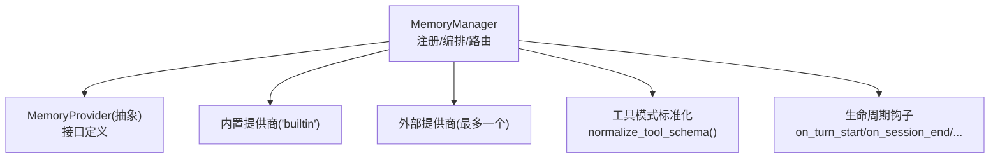
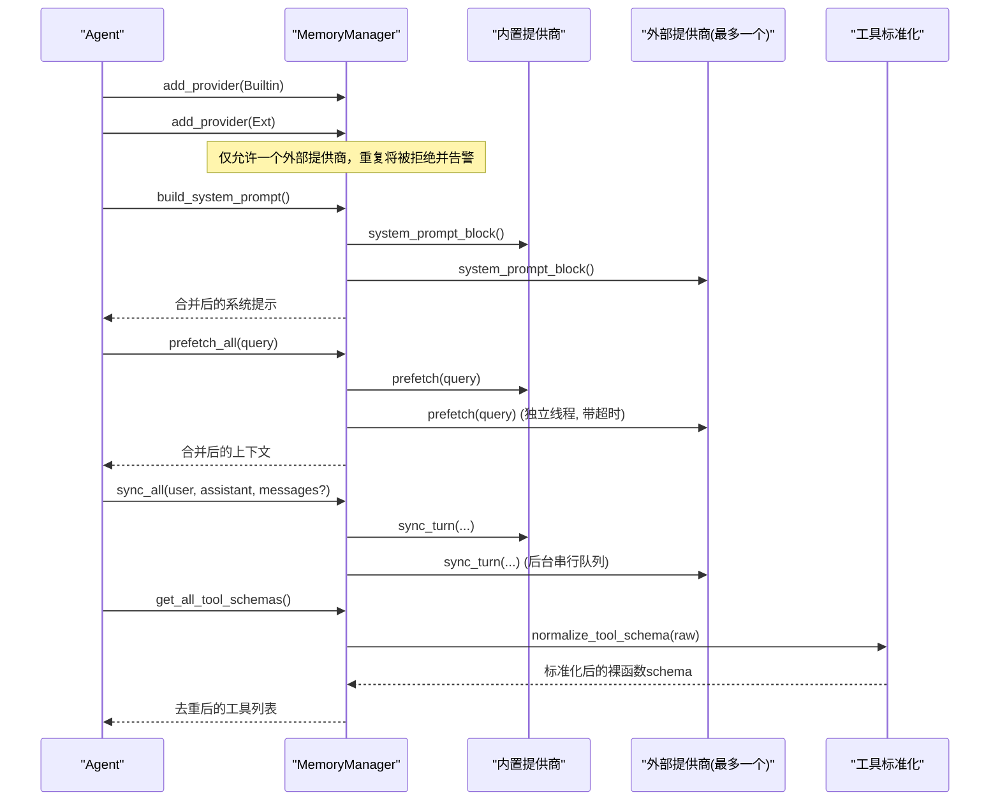
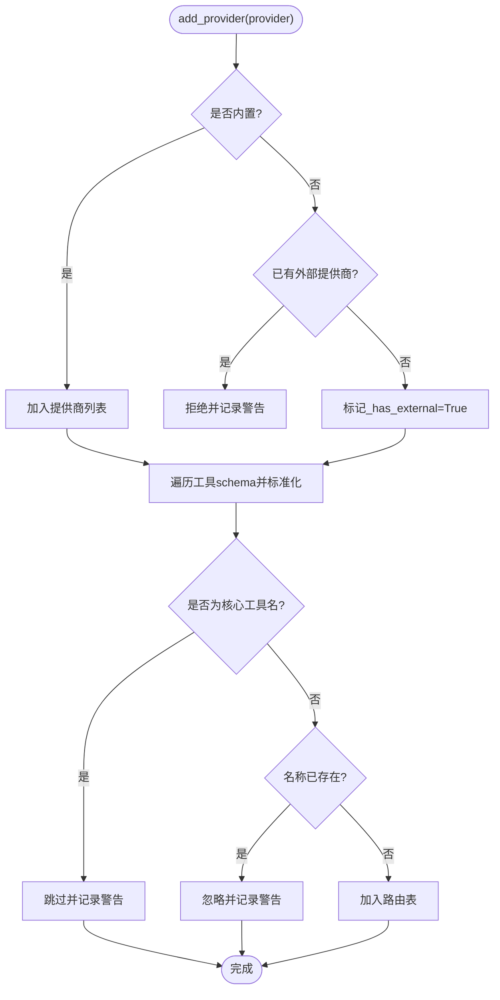
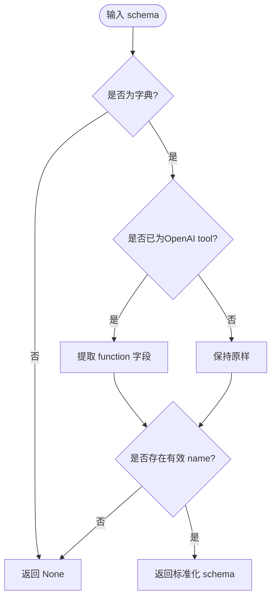
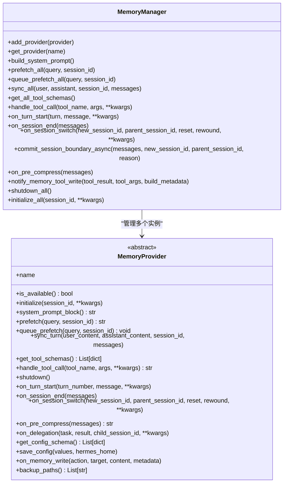
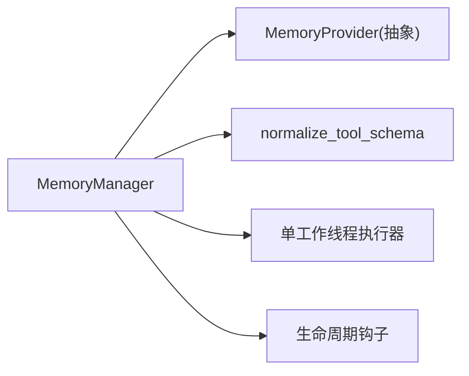

# 提供商管理

<cite>
**本文引用的文件**
- [agent/memory_manager.py](file://agent/memory_manager.py)
- [agent/memory_provider.py](file://agent/memory_provider.py)
</cite>

## 目录
1. [简介](#简介)
2. [项目结构](#项目结构)
3. [核心组件](#核心组件)
4. [架构总览](#架构总览)
5. [详细组件分析](#详细组件分析)
6. [依赖关系分析](#依赖关系分析)
7. [性能考量](#性能考量)
8. [故障排查指南](#故障排查指南)
9. [结论](#结论)
10. [附录：配置与扩展实践](#附录配置与扩展实践)

## 简介
本文件面向“记忆提供商管理系统”，聚焦 MemoryManager 的设计模式、提供商注册机制、单一外部提供商限制策略、内置与外部提供商的优先级处理，以及提供商生命周期管理（添加、获取、移除）。同时说明工具模式标准化处理 normalize_tool_schema 如何统一不同格式的提供商工具定义，确保与 OpenAI 工具格式兼容。文末提供自定义提供商注册示例与冲突检测/解决策略，并给出实现 MemoryProvider 接口的最佳实践与错误处理模式。

## 项目结构
记忆系统由两个核心模块组成：
- agent/memory_provider.py：定义 MemoryProvider 抽象接口与通用辅助逻辑（如 trivial prompt 过滤、可选钩子等）。
- agent/memory_manager.py：实现 MemoryManager，负责注册与管理多个 MemoryProvider，协调系统提示构建、预取召回、同步写入、工具暴露与路由、会话边界事件、后台任务调度与优雅关闭。

图表来源
- [agent/memory_manager.py:364-470](file://agent/memory_manager.py#L364-L470)
- [agent/memory_provider.py:81-192](file://agent/memory_provider.py#L81-L192)

章节来源
- [agent/memory_manager.py:1-158](file://agent/memory_manager.py#L1-L158)
- [agent/memory_provider.py:1-80](file://agent/memory_provider.py#L1-L80)

## 核心组件
- MemoryProvider（抽象基类）
  - 必须实现：name、is_available、initialize、get_tool_schemas
  - 可选实现：system_prompt_block、prefetch、queue_prefetch、sync_turn、handle_tool_call、shutdown、各类 on_* 钩子、get_config_schema/save_config、on_memory_write、backup_paths
- MemoryManager（编排器）
  - 注册与限制：add_provider 仅允许一个外部提供商；内置提供商始终优先
  - 工具暴露：get_all_tool_schemas 收集并去重，跳过保留核心工具名
  - 工具路由：handle_tool_call 将调用转发到对应 provider
  - 上下文注入：build_system_prompt、prefetch_all、queue_prefetch_all、sync_all
  - 会话边界：on_session_end、on_session_switch、commit_session_boundary_async
  - 后台任务：_submit_background 使用单工作线程执行器序列化写操作，避免阻塞主流程
  - 优雅关闭：shutdown_all 带超时回收，记录放弃的任务统计

章节来源
- [agent/memory_provider.py:81-358](file://agent/memory_provider.py#L81-L358)
- [agent/memory_manager.py:364-1242](file://agent/memory_manager.py#L364-L1242)

## 架构总览
MemoryManager 作为单一集成点，统一管理多个 MemoryProvider。其关键职责包括：
- 提供商注册与限制：保证“内置提供商 + 至多一个外部提供商”的组合，防止工具集膨胀与后端冲突
- 工具模式标准化：normalize_tool_schema 将多种输入形状归一为“裸函数 schema”，再包装为 OpenAI function tool
- 并发与隔离：外部提供商 prefetch 使用独立线程+超时；所有写操作通过单线程执行器串行化，保障顺序性
- 容错与降级：单个 provider 异常不影响其他 provider；后台任务失败仅记录日志
- 会话一致性：在 /new、/resume、/branch、压缩等场景下，按序触发 on_session_end → on_session_switch，避免竞态

图表来源
- [agent/memory_manager.py:364-470](file://agent/memory_manager.py#L364-L470)
- [agent/memory_manager.py:525-595](file://agent/memory_manager.py#L525-L595)
- [agent/memory_manager.py:638-694](file://agent/memory_manager.py#L638-L694)
- [agent/memory_manager.py:784-819](file://agent/memory_manager.py#L784-L819)
- [agent/memory_manager.py:50-80](file://agent/memory_manager.py#L50-L80)

## 详细组件分析

### MemoryManager：注册机制与单一外部提供商限制
- 注册流程
  - add_provider 接受任意 MemoryProvider
  - 若 provider.name == "builtin"，总是接受
  - 若为非 builtin，且已存在外部提供商，则拒绝并记录警告，确保“至多一个外部提供商”
  - 对每个 provider 的工具 schema 进行标准化与冲突检测：
    - 跳过保留核心工具名（如 clarify、delegate_task 等），避免覆盖系统内置能力
    - 若工具名冲突，后注册的被忽略并记录警告
- 优先级策略
  - 内置提供商始终优先于外部提供商（在系统提示、工具路由中体现）
  - 工具路由表 _tool_to_provider 仅保留首次注册的工具名映射，后续同名工具会被忽略

图表来源
- [agent/memory_manager.py:404-470](file://agent/memory_manager.py#L404-L470)
- [agent/memory_manager.py:784-819](file://agent/memory_manager.py#L784-L819)

章节来源
- [agent/memory_manager.py:404-470](file://agent/memory_manager.py#L404-L470)
- [agent/memory_manager.py:784-819](file://agent/memory_manager.py#L784-L819)

### 工具模式标准化：normalize_tool_schema
- 目标：将不同来源的工具 schema 统一为“裸函数 schema”（包含 name、description、parameters），以便上层统一包装为 OpenAI function tool
- 行为：
  - 若传入已是 OpenAI tool 条目（{"type":"function","function":{...}}），先解包取出内部 function
  - 校验 name 字段存在且为字符串，否则返回 None（调用方应跳过该工具）
  - 返回标准化后的裸函数 schema
- 作用：避免二次包装导致 tools[N].function.function 嵌套，从而防止严格模型（如 DeepSeek）因缺少顶层 name 而拒绝整个请求

图表来源
- [agent/memory_manager.py:50-80](file://agent/memory_manager.py#L50-L80)

章节来源
- [agent/memory_manager.py:50-80](file://agent/memory_manager.py#L50-L80)

### 提供商生命周期管理
- 初始化：initialize_all 向各 provider 注入 hermes_home 等上下文参数，并调用 initialize
- 系统提示：build_system_prompt 聚合各 provider 的静态提示块
- 预取召回：
  - prefetch_all：依次调用各 provider.prefetch，外部提供商使用独立线程+超时，避免阻塞
  - queue_prefetch_all：在 turn 结束后异步排队下一轮预取
- 同步写入：
  - sync_all：将用户与助手内容持久化到各 provider，支持可选 messages 参数
  - 后台串行：通过单工作线程执行器提交任务，保证 turn N 先于 turn N+1 落地
- 会话边界：
  - on_session_end：会话结束时提取信息
  - on_session_switch：会话切换时刷新 provider 内部状态
  - commit_session_boundary_async：将 end→switch 打包为一个串行任务，避免竞态
- 工具暴露与路由：
  - get_all_tool_schemas：收集并标准化工具 schema，去重并跳过核心工具名
  - handle_tool_call：根据工具名路由到对应 provider 的 handle_tool_call
- 关闭：shutdown_all 先等待后台任务有限时间，再反向调用各 provider.shutdown

图表来源
- [agent/memory_manager.py:364-1242](file://agent/memory_manager.py#L364-L1242)
- [agent/memory_provider.py:81-358](file://agent/memory_provider.py#L81-L358)

章节来源
- [agent/memory_manager.py:486-503](file://agent/memory_manager.py#L486-L503)
- [agent/memory_manager.py:525-595](file://agent/memory_manager.py#L525-L595)
- [agent/memory_manager.py:638-694](file://agent/memory_manager.py#L638-L694)
- [agent/memory_manager.py:784-819](file://agent/memory_manager.py#L784-L819)
- [agent/memory_manager.py:829-847](file://agent/memory_manager.py#L829-L847)
- [agent/memory_manager.py:851-991](file://agent/memory_manager.py#L851-L991)
- [agent/memory_manager.py:1019-1142](file://agent/memory_manager.py#L1019-L1142)
- [agent/memory_manager.py:1144-1242](file://agent/memory_manager.py#L1144-L1242)

### 提供商冲突检测与解决策略
- 工具名冲突：同一工具名多次注册时，后注册的被忽略并记录警告，确保唯一性
- 核心工具保护：若 provider 的工具名命中保留核心工具名集合，直接跳过并警告，避免覆盖系统能力
- 外部提供商唯一性：重复注册外部提供商会被拒绝并警告，提示通过配置选择具体外部提供商
- 结果：保证工具路由表稳定、无歧义，且系统内置能力不被覆盖

章节来源
- [agent/memory_manager.py:404-470](file://agent/memory_manager.py#L404-L470)
- [agent/memory_manager.py:784-819](file://agent/memory_manager.py#L784-L819)

### 工具注入与启用控制
- inject_memory_provider_tools：将外部 memory-provider 的工具 schema 注入到 agent 的工具表面
- 启用判断：memory_provider_tools_enabled 基于 enabled_toolsets/disabled_toolsets 及是否已存在 memory 工具决定
- 去重与标准化：对每个 raw schema 调用 normalize_tool_schema，跳过无效或重复工具名，并以 OpenAI function tool 形式追加

章节来源
- [agent/memory_manager.py:83-157](file://agent/memory_manager.py#L83-L157)

## 依赖关系分析
- MemoryManager 依赖 MemoryProvider 抽象接口，实现松耦合的多后端编排
- 工具标准化依赖 normalize_tool_schema，屏蔽不同 provider 的工具 schema 差异
- 会话边界事件通过 on_session_end → on_session_switch 的顺序执行，确保数据一致性与正确归属
- 后台任务通过单工作线程执行器串行化，避免并发写导致的竞争条件

图表来源
- [agent/memory_manager.py:364-1242](file://agent/memory_manager.py#L364-L1242)
- [agent/memory_manager.py:50-80](file://agent/memory_manager.py#L50-L80)

章节来源
- [agent/memory_manager.py:364-1242](file://agent/memory_manager.py#L364-L1242)

## 性能考量
- 外部提供商 prefetch 使用独立线程+超时，避免慢网络或挂起调用阻塞主流程
- 写操作通过单工作线程执行器串行化，保证 turn 顺序，减少锁竞争与数据不一致
- 懒创建执行器：仅在需要时创建，降低默认路径的开销
- 优雅关闭：shutdown_all 设置超时回收，避免进程退出时被卡住
- 工具注入前进行启用判断与去重，减少不必要的 schema 处理与传输

章节来源
- [agent/memory_manager.py:547-595](file://agent/memory_manager.py#L547-L595)
- [agent/memory_manager.py:698-757](file://agent/memory_manager.py#L698-L757)
- [agent/memory_manager.py:1144-1222](file://agent/memory_manager.py#L1144-L1222)

## 故障排查指南
- 工具 schema 无 name：normalize_tool_schema 返回 None，调用方会跳过并记录警告，检查 provider 的 get_tool_schemas 输出
- 外部提供商超时：prefetch 线程超过阈值会记录警告并跳过本轮，检查网络或后端健康
- 工具名冲突：记录警告并忽略后注册的工具，确认 provider 工具命名唯一且不覆盖核心工具
- 会话边界异常：on_session_end/on_session_switch 异常会被捕获并记录，检查 provider 实现是否正确处理新 session_id
- 后台任务未执行：flush_pending 可用于测试或边界场景等待任务完成；shutdown_all 会记录放弃任务数量

章节来源
- [agent/memory_manager.py:139-157](file://agent/memory_manager.py#L139-L157)
- [agent/memory_manager.py:547-595](file://agent/memory_manager.py#L547-L595)
- [agent/memory_manager.py:759-780](file://agent/memory_manager.py#L759-L780)
- [agent/memory_manager.py:865-991](file://agent/memory_manager.py#L865-L991)
- [agent/memory_manager.py:1144-1222](file://agent/memory_manager.py#L1144-L1222)

## 结论
MemoryManager 以清晰的注册限制（内置优先、外部唯一）、统一的工具模式标准化、健壮的并发与错误处理、以及严格的会话边界顺序，提供了可扩展且稳定的记忆提供商管理体系。开发者只需实现 MemoryProvider 接口，即可无缝接入系统，并获得一致的上下文注入、工具暴露与生命周期管理。

## 附录：配置与扩展实践

### 如何注册自定义提供商
- 实现 MemoryProvider 接口：
  - 必填：name、is_available、initialize、get_tool_schemas
  - 建议：system_prompt_block、prefetch、queue_prefetch、sync_turn、handle_tool_call、shutdown
  - 可选：on_turn_start、on_session_end、on_session_switch、on_pre_compress、on_delegation、get_config_schema、save_config、on_memory_write、backup_paths
- 在应用启动时：
  - 创建 MemoryManager 实例
  - 调用 add_provider 注册内置提供商与一个外部提供商（仅允许一个外部）
  - 调用 initialize_all 完成初始化
  - 在系统提示构建阶段调用 build_system_prompt
  - 在每个 turn 前后调用 prefetch_all、queue_prefetch_all、sync_all
  - 在工具暴露阶段调用 get_all_tool_schemas 并注入到 agent.tools
  - 在会话切换时调用 on_session_switch 或 commit_session_boundary_async
  - 在进程退出时调用 shutdown_all

章节来源
- [agent/memory_provider.py:81-358](file://agent/memory_provider.py#L81-L358)
- [agent/memory_manager.py:364-1242](file://agent/memory_manager.py#L364-L1242)

### 工具模式标准化最佳实践
- 在 get_tool_schemas 中返回“裸函数 schema”（包含 name、description、parameters），不要自行包装为 OpenAI tool 条目
- 确保 name 为字符串且唯一，避免冲突
- 若需兼容旧格式，可参考 normalize_tool_schema 的行为进行预处理

章节来源
- [agent/memory_manager.py:50-80](file://agent/memory_manager.py#L50-L80)
- [agent/memory_manager.py:784-819](file://agent/memory_manager.py#L784-L819)

### 错误处理模式
- 在 provider 方法中捕获并记录异常，避免影响其他 provider
- 对于网络或 I/O 操作，考虑异步与超时，避免阻塞主流程
- 在 on_session_switch 中正确处理 reset/rewound 标志，清理或更新内部状态
- 在 notify_memory_tool_write 中仅对成功且非 staged 的写入进行镜像，避免误报

章节来源
- [agent/memory_manager.py:851-991](file://agent/memory_manager.py#L851-L991)
- [agent/memory_manager.py:1055-1128](file://agent/memory_manager.py#L1055-L1128)