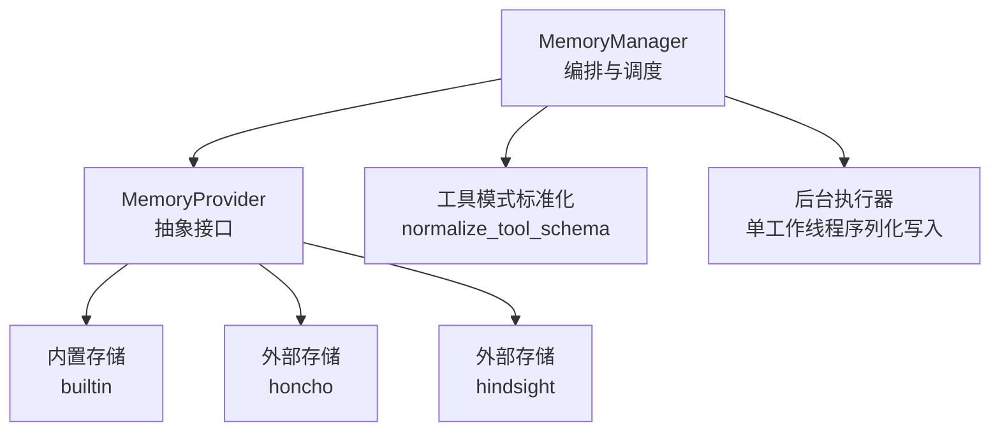
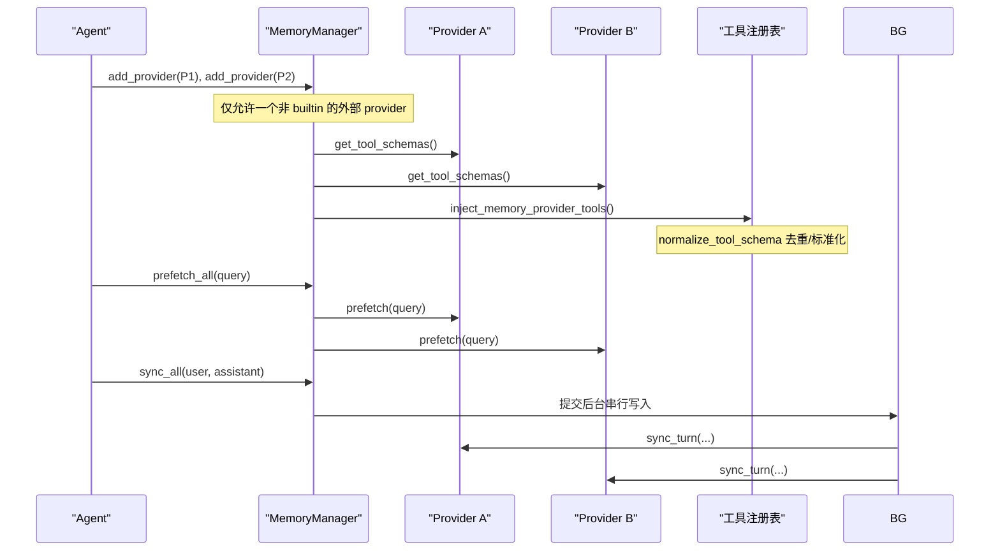
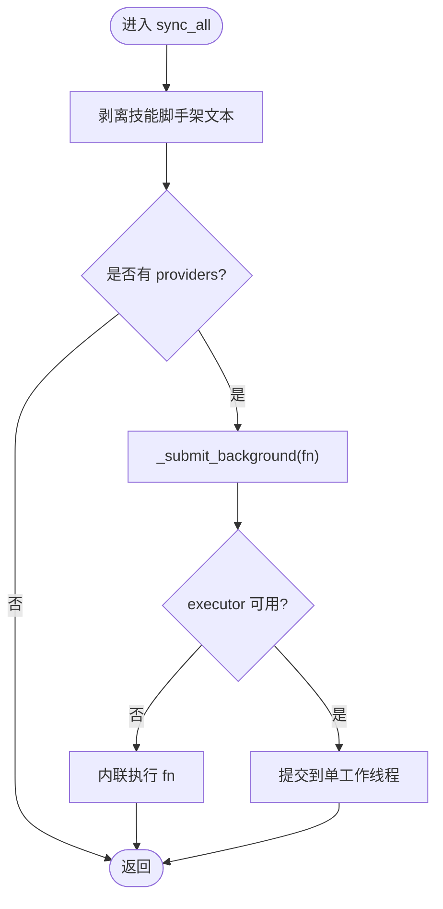
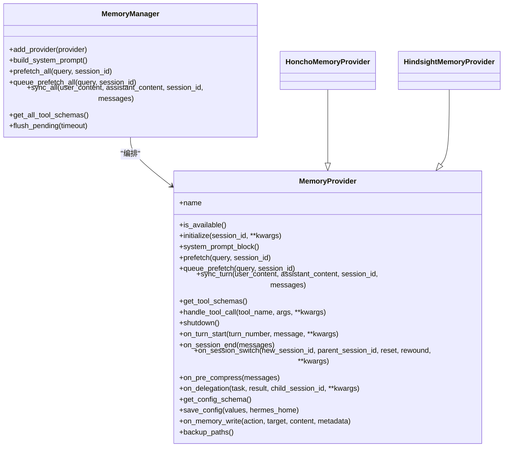

# 记忆存储机制

<cite>
**本文引用的文件**
- [agent/memory_manager.py](file://agent/memory_manager.py)
- [agent/memory_provider.py](file://agent/memory_provider.py)
- [plugins/memory/config_schema.py](file://plugins/memory/config_schema.py)
- [plugins/memory/honcho/__init__.py](file://plugins/memory/honcho/__init__.py)
- [plugins/memory/hindsight/__init__.py](file://plugins/memory/hindsight/__init__.py)
</cite>

## 目录
1. [简介](#简介)
2. [项目结构](#项目结构)
3. [核心组件](#核心组件)
4. [架构总览](#架构总览)
5. [详细组件分析](#详细组件分析)
6. [依赖关系分析](#依赖关系分析)
7. [性能与并发特性](#性能与并发特性)
8. [故障排查指南](#故障排查指南)
9. [结论](#结论)
10. [附录：扩展指南与最佳实践](#附录扩展指南与最佳实践)

## 简介
本文件系统性阐述 Hermes 的记忆存储机制，围绕 MemoryManager 的编排模式、MemoryProvider 接口规范、多提供商管理策略展开。文档覆盖内置与外部存储的注册机制、工具模式标准化处理、存储后端隔离设计；并说明存储生命周期管理、数据一致性保证、并发访问控制与错误恢复机制。最后提供自定义存储后端的集成步骤、配置示例、实现模式与最佳实践，以及新存储类型集成和数据迁移策略建议。

## 项目结构
记忆系统由“核心编排层 + 抽象接口 + 插件实现”构成：
- 核心编排层：MemoryManager 负责统一接入、调度、超时与后台任务编排。
- 抽象接口：MemoryProvider 定义标准生命周期、工具暴露、钩子与配置声明。
- 插件实现：内置 provider（名称为 builtin）与多个外部 provider（如 Honcho、Hindsight），通过 plugins/memory/* 组织。
- 配置声明：每个 provider 可声明其配置项 schema，供 UI/CLI 渲染与持久化。

图表来源
- [agent/memory_manager.py:364-470](file://agent/memory_manager.py#L364-L470)
- [agent/memory_provider.py:81-191](file://agent/memory_provider.py#L81-L191)
- [plugins/memory/honcho/__init__.py:237-336](file://plugins/memory/honcho/__init__.py#L237-L336)
- [plugins/memory/hindsight/__init__.py:681-753](file://plugins/memory/hindsight/__init__.py#L681-L753)

章节来源
- [agent/memory_manager.py:1-157](file://agent/memory_manager.py#L1-L157)
- [agent/memory_provider.py:1-32](file://agent/memory_provider.py#L1-L32)
- [plugins/memory/config_schema.py:1-20](file://plugins/memory/config_schema.py#L1-L20)

## 核心组件
- MemoryManager：唯一入口，维护已注册的 providers，统一构建系统提示、预取上下文、同步对话轮次、注入工具模式，并提供后台串行写入与超时保护。
- MemoryProvider：抽象基类，定义 name、is_available、initialize、system_prompt_block、prefetch、queue_prefetch、sync_turn、get_tool_schemas、handle_tool_call、shutdown 等生命周期方法，以及可选钩子 with on_turn_start、on_session_end、on_session_switch、on_pre_compress、on_delegation、backup_paths、get_config_schema/save_config 等。
- 插件实现：
  - HonchoMemoryProvider：AI 原生用户建模、会话摘要、卡片、推理问答、结论持久化；支持 context/tools/hybrid 三种召回模式。
  - HindsightMemoryProvider：长期记忆、知识图谱、实体解析、多策略检索；支持云与本地模式、异步 retain、操作状态等待等。

章节来源
- [agent/memory_manager.py:364-800](file://agent/memory_manager.py#L364-L800)
- [agent/memory_provider.py:81-358](file://agent/memory_provider.py#L81-L358)
- [plugins/memory/honcho/__init__.py:237-336](file://plugins/memory/honcho/__init__.py#L237-L336)
- [plugins/memory/hindsight/__init__.py:681-800](file://plugins/memory/hindsight/__init__.py#L681-L800)

## 架构总览
MemoryManager 作为编排中心，遵循“仅允许一个外部 provider”的策略，确保工具命名空间与后端行为不冲突。所有 provider 的工具 schema 经 normalize_tool_schema 标准化后再注入到 agent 的工具表面，避免重复或非法 schema 导致请求被拒绝。

图表来源
- [agent/memory_manager.py:404-470](file://agent/memory_manager.py#L404-L470)
- [agent/memory_manager.py:110-157](file://agent/memory_manager.py#L110-L157)
- [agent/memory_manager.py:525-694](file://agent/memory_manager.py#L525-L694)

章节来源
- [agent/memory_manager.py:404-470](file://agent/memory_manager.py#L404-L470)
- [agent/memory_manager.py:110-157](file://agent/memory_manager.py#L110-L157)
- [agent/memory_manager.py:525-694](file://agent/memory_manager.py#L525-L694)

## 详细组件分析

### MemoryManager 设计与模式
- 设计要点
  - 单一外部 provider：防止工具 schema 膨胀与后端冲突。
  - 工具模式标准化：normalize_tool_schema 兼容两种 schema 形态，缺失 name 则跳过，避免污染请求。
  - 后台串行写入：使用单工作线程 executor 保证 turn N 先于 turn N+1 落地，provider 无需自行排序。
  - 外部预取超时：对非 builtin provider 的 prefetch 设置超时，避免阻塞主流程。
  - 流式上下文清洗：StreamingContextScrubber 在流式输出中安全剔除 <memory-context> 块，防止泄露内部上下文。
  - 系统提示聚合：build_system_prompt 收集各 provider 的静态提示块。
  - 工具注入：inject_memory_provider_tools 将 provider 的工具 schema 注入 agent 工具表面，同时保留核心工具优先权。

- 关键流程
  - 注册阶段：add_provider 校验外部 provider 数量、过滤核心工具名冲突、建立 tool→provider 路由表。
  - 预取阶段：prefetch_all 遍历 providers，builtin 直接调用，外部 provider 在新线程中执行并受超时限制。
  - 同步阶段：sync_all 剥离技能脚手架文本，提交后台任务，按 provider 能力决定是否传递 messages。
  - 后台执行：_submit_background 使用 DaemonThreadPoolExecutor，失败时回退为内联执行，保障健壮性。
  - 刷新与关闭：flush_pending 等待队列排空；shutdown_all 有超时保护，避免卡死进程退出。

图表来源
- [agent/memory_manager.py:638-694](file://agent/memory_manager.py#L638-L694)
- [agent/memory_manager.py:698-757](file://agent/memory_manager.py#L698-L757)

章节来源
- [agent/memory_manager.py:50-157](file://agent/memory_manager.py#L50-L157)
- [agent/memory_manager.py:364-470](file://agent/memory_manager.py#L364-L470)
- [agent/memory_manager.py:525-694](file://agent/memory_manager.py#L525-L694)
- [agent/memory_manager.py:698-757](file://agent/memory_manager.py#L698-L757)

### MemoryProvider 接口规范
- 必需方法
  - name：标识 provider。
  - is_available：检查配置与依赖是否就绪（不应发起网络）。
  - initialize：创建资源、连接、预热；接收 session_id 与平台信息。
  - system_prompt_block：返回静态提示块。
  - prefetch：快速返回缓存结果，实际召回应在后台完成。
  - queue_prefetch：为下一轮准备召回。
  - sync_turn：持久化已完成轮次，应非阻塞。
  - get_tool_schemas：暴露工具 schema。
  - handle_tool_call：处理工具调用。
  - shutdown：清理资源。
- 可选钩子
  - on_turn_start、on_session_end、on_session_switch、on_pre_compress、on_delegation、backup_paths、get_config_schema/save_config、on_memory_write。

章节来源
- [agent/memory_provider.py:81-358](file://agent/memory_provider.py#L81-L358)

### 内置与外部存储注册机制
- 内置 provider（name 为 builtin）始终接受。
- 外部 provider 仅允许一个，重复注册会记录警告并忽略。
- 工具名冲突：若 provider 工具名与核心工具冲突，会被拒绝，核心工具优先。
- 工具注入：inject_memory_provider_tools 根据 enabled/disabled toolsets 决定是否注入 memory 工具，并对重复工具名进行去重。

章节来源
- [agent/memory_manager.py:404-470](file://agent/memory_manager.py#L404-L470)
- [agent/memory_manager.py:110-157](file://agent/memory_manager.py#L110-L157)

### 工具模式标准化处理
- normalize_tool_schema 兼容两种 schema 形态：
  - 裸函数 schema：{"name": "...", "description": "...", "parameters": {...}}
  - OpenAI 工具条目：{"type": "function", "function": {...}}
- 若无法解析出 name，则丢弃该 schema 并记录警告，避免整个工具集失效。

章节来源
- [agent/memory_manager.py:50-80](file://agent/memory_manager.py#L50-L80)
- [agent/memory_manager.py:110-157](file://agent/memory_manager.py#L110-L157)

### 存储后端隔离设计
- 每个 provider 独立维护自身状态与资源（如 Honcho 的 session manager、Hindsight 的客户端与会话）。
- 外部 provider 的 prefetch 运行在独立线程，且受超时保护，避免影响主流程。
- 写入路径通过单工作线程串行化，避免并发写竞争。
- 备份路径：provider 可通过 backup_paths 声明额外磁盘路径，便于 hermes backup/import 包含外部状态。

章节来源
- [agent/memory_manager.py:547-595](file://agent/memory_manager.py#L547-L595)
- [agent/memory_manager.py:698-757](file://agent/memory_manager.py#L698-L757)
- [agent/memory_provider.py:341-358](file://agent/memory_provider.py#L341-L358)
- [plugins/memory/honcho/__init__.py:240-251](file://plugins/memory/honcho/__init__.py#L240-L251)
- [plugins/memory/hindsight/__init__.py:684-692](file://plugins/memory/hindsight/__init__.py#L684-L692)

### 存储生命周期管理
- 初始化：initialize 中完成连接、资源创建、预热（例如 Honcho 的会话创建与预取预热）。
- 会话切换：on_session_switch 用于 mid-process 的 session_id 旋转，更新 provider 内部状态。
- 会话结束：on_session_end 用于提取总结或归档。
- 压缩前钩子：on_pre_compress 可在消息压缩前提取洞察，确保重要信息不被丢弃。
- 关闭：shutdown 清理队列与连接。

章节来源
- [agent/memory_provider.py:100-191](file://agent/memory_provider.py#L100-L191)
- [plugins/memory/honcho/__init__.py:343-410](file://plugins/memory/honcho/__init__.py#L343-L410)
- [plugins/memory/hindsight/__init__.py:681-753](file://plugins/memory/hindsight/__init__.py#L681-L753)

### 数据一致性保证
- 写入顺序：单工作线程保证 turn N 先于 turn N+1 落地。
- 读取可见性：Hindsight 在异步 retain 场景下，prefetch 会等待服务端操作完成，避免读到未生效的数据。
- 工具路由：核心工具优先，避免 provider 工具覆盖系统功能。

章节来源
- [agent/memory_manager.py:659-694](file://agent/memory_manager.py#L659-L694)
- [plugins/memory/hindsight/__init__.py:724-773](file://plugins/memory/hindsight/__init__.py#L724-L773)

### 并发访问控制
- 外部 provider 的 prefetch 使用独立线程，并设置超时，避免阻塞。
- 后台写入使用单工作线程，避免并发写竞争。
- 流式上下文清洗：StreamingContextScrubber 在流式输出中安全剔除内部上下文片段。

章节来源
- [agent/memory_manager.py:547-595](file://agent/memory_manager.py#L547-L595)
- [agent/memory_manager.py:698-757](file://agent/memory_manager.py#L698-L757)
- [agent/memory_manager.py:182-361](file://agent/memory_manager.py#L182-L361)

### 错误恢复机制
- 预取失败：单个 provider 的 prefetch 异常不会阻断其他 provider。
- 同步失败：sync_turn 异常被捕获并记录日志，不影响后续流程。
- 启动失败：Honcho 在 tools-only 模式下可延迟初始化，失败时降级为无自动注入。
- 关闭保护：shutdown_all 有超时，避免卡死进程退出。

章节来源
- [agent/memory_manager.py:525-545](file://agent/memory_manager.py#L525-L545)
- [agent/memory_manager.py:672-694](file://agent/memory_manager.py#L672-L694)
- [plugins/memory/honcho/__init__.py:396-410](file://plugins/memory/honcho/__init__.py#L396-L410)

## 依赖关系分析
- MemoryManager 依赖 MemoryProvider 接口，并通过 normalize_tool_schema 与工具注册表交互。
- Honcho/Hindsight 实现 MemoryProvider，各自管理客户端与会话。
- 配置 schema 通过 plugins/memory/config_schema.py 声明，供 UI/CLI 渲染与持久化。

图表来源
- [agent/memory_provider.py:81-358](file://agent/memory_provider.py#L81-L358)
- [agent/memory_manager.py:364-800](file://agent/memory_manager.py#L364-L800)
- [plugins/memory/honcho/__init__.py:237-336](file://plugins/memory/honcho/__init__.py#L237-L336)
- [plugins/memory/hindsight/__init__.py:681-800](file://plugins/memory/hindsight/__init__.py#L681-L800)

章节来源
- [agent/memory_provider.py:81-358](file://agent/memory_provider.py#L81-L358)
- [agent/memory_manager.py:364-800](file://agent/memory_manager.py#L364-L800)
- [plugins/memory/honcho/__init__.py:237-336](file://plugins/memory/honcho/__init__.py#L237-L336)
- [plugins/memory/hindsight/__init__.py:681-800](file://plugins/memory/hindsight/__init__.py#L681-L800)

## 性能与并发特性
- 预取优化：外部 provider 的 prefetch 在独立线程执行，并设置超时，避免阻塞主流程。
- 写入串行化：单工作线程保证写入顺序，减少锁竞争与数据不一致风险。
- 流式清洗：StreamingContextScrubber 在流式输出中安全剔除内部上下文，避免泄露。
- 懒加载：Honcho 在 tools-only 模式下延迟初始化，降低启动开销。
- 异步 retain：Hindsight 支持异步 retain，并在 prefetch 中等待服务端操作完成，确保读一致性与时效性。

章节来源
- [agent/memory_manager.py:547-595](file://agent/memory_manager.py#L547-L595)
- [agent/memory_manager.py:698-757](file://agent/memory_manager.py#L698-L757)
- [plugins/memory/honcho/__init__.py:396-410](file://plugins/memory/honcho/__init__.py#L396-L410)
- [plugins/memory/hindsight/__init__.py:724-773](file://plugins/memory/hindsight/__init__.py#L724-L773)

## 故障排查指南
- 工具 schema 无效：若 provider 返回的 schema 缺少 name，将被丢弃并记录警告。检查 normalize_tool_schema 的处理逻辑。
- 外部 provider 预取超时：若 prefetch 超过阈值，将被跳过并记录警告。检查 provider 的网络与依赖服务健康。
- 写入阻塞：若 sync_turn 耗时过长，会被后台任务处理。确认 provider 是否实现了非阻塞写入。
- 会话切换问题：若 on_session_switch 未正确更新内部状态，可能导致写入错位。检查 provider 的实现。
- 备份遗漏：若 provider 状态不在 HERMES_HOME 下，需通过 backup_paths 声明额外路径。

章节来源
- [agent/memory_manager.py:110-157](file://agent/memory_manager.py#L110-L157)
- [agent/memory_manager.py:547-595](file://agent/memory_manager.py#L547-L595)
- [agent/memory_manager.py:672-694](file://agent/memory_manager.py#L672-L694)
- [agent/memory_provider.py:341-358](file://agent/memory_provider.py#L341-L358)

## 结论
Hermes 的记忆存储机制以 MemoryManager 为核心，通过 MemoryProvider 接口实现插件化扩展，严格限制外部 provider 数量以避免冲突。工具模式标准化、后台串行写入、超时保护与流式上下文清洗共同保障了系统的稳定性与一致性。内置与外部存储的隔离设计使得不同后端可独立演进，而配置 schema 的统一声明简化了集成与维护。

## 附录：扩展指南与最佳实践

### 自定义存储后端集成步骤
- 实现 MemoryProvider 接口：
  - 实现 name、is_available、initialize、system_prompt_block、prefetch、queue_prefetch、sync_turn、get_tool_schemas、handle_tool_call、shutdown。
  - 可选实现 on_turn_start、on_session_end、on_session_switch、on_pre_compress、on_delegation、backup_paths、get_config_schema/save_config、on_memory_write。
- 注册 provider：
  - 在 MemoryManager.add_provider 中注册，确保名称不与核心工具冲突。
- 配置声明：
  - 在 plugins/memory/<your_provider>/config_schema.py 中声明 CONFIG_SCHEMA，供 UI/CLI 渲染与持久化。
- 测试与验证：
  - 验证 prefetch 与 sync_turn 的非阻塞性。
  - 验证 on_session_switch 的状态更新。
  - 验证 backup_paths 的正确性。

章节来源
- [agent/memory_provider.py:81-358](file://agent/memory_provider.py#L81-L358)
- [plugins/memory/config_schema.py:94-145](file://plugins/memory/config_schema.py#L94-L145)
- [agent/memory_manager.py:404-470](file://agent/memory_manager.py#L404-L470)

### 配置示例（概念性）
- 在 provider 的 config_schema.py 中声明字段：
  - key：配置键名。
  - label：显示标签。
  - kind：text、secret、bool、number、select、json。
  - default：默认值。
  - description：描述。
  - env_key：环境变量键（用于 secret）。
  - scope：host 或 root（flat_json 忽略）。
- 在 provider 的 save_config 中持久化非 secret 配置。

章节来源
- [plugins/memory/config_schema.py:43-107](file://plugins/memory/config_schema.py#L43-L107)
- [agent/memory_provider.py:305-320](file://agent/memory_provider.py#L305-L320)

### 实现模式与最佳实践
- 非阻塞写入：sync_turn 应使用队列或后台线程，避免阻塞主流程。
- 预取缓存：prefetch 应返回缓存结果，实际召回在后台完成。
- 会话隔离：on_session_switch 中更新内部状态，确保写入正确会话。
- 工具命名：避免与核心工具冲突，必要时重命名。
- 备份路径：通过 backup_paths 声明外部状态路径，便于备份与导入。

章节来源
- [agent/memory_manager.py:638-694](file://agent/memory_manager.py#L638-L694)
- [agent/memory_provider.py:146-170](file://agent/memory_provider.py#L146-L170)
- [agent/memory_provider.py:214-256](file://agent/memory_provider.py#L214-L256)
- [agent/memory_provider.py:341-358](file://agent/memory_provider.py#L341-L358)

### 数据迁移策略建议
- 版本兼容：在 initialize 中检测后端版本，必要时执行迁移脚本。
- 增量迁移：对于大型数据集，采用增量迁移，避免长时间锁定。
- 回滚机制：迁移失败时提供回滚路径，确保数据一致性。
- 监控与日志：记录迁移进度与异常，便于排查。

[本节为概念性内容，不直接引用具体文件]