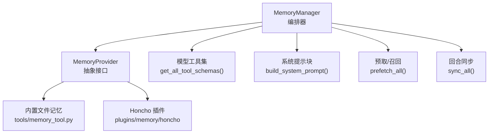
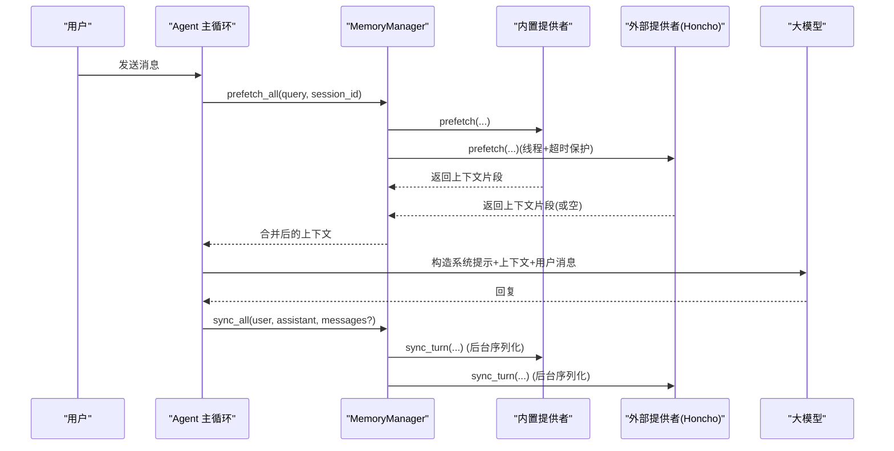
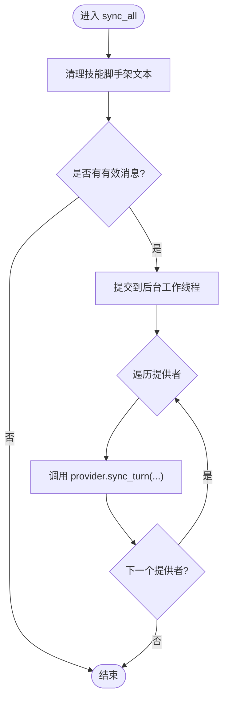
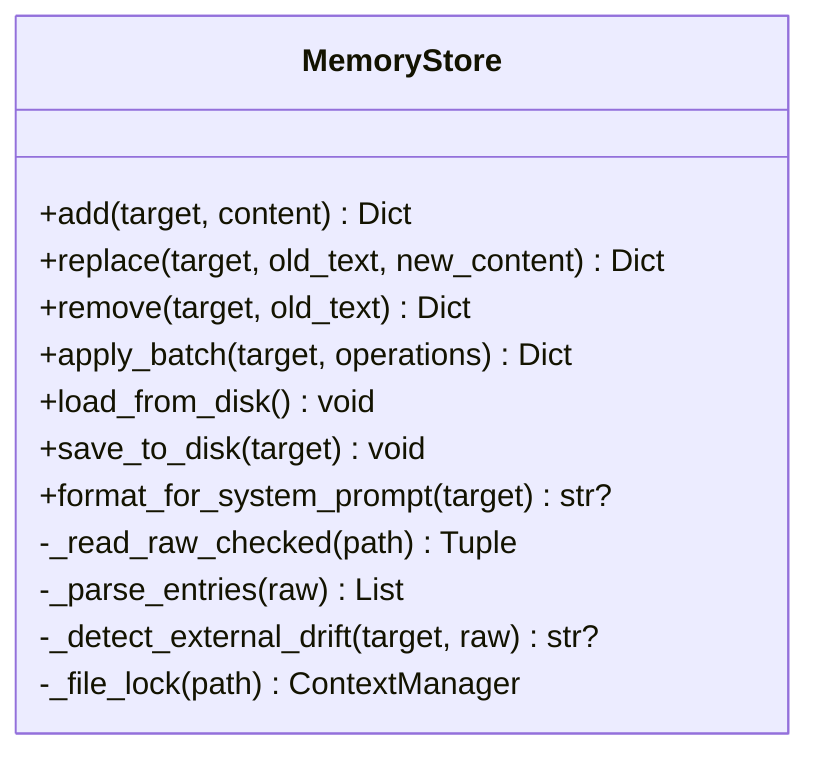
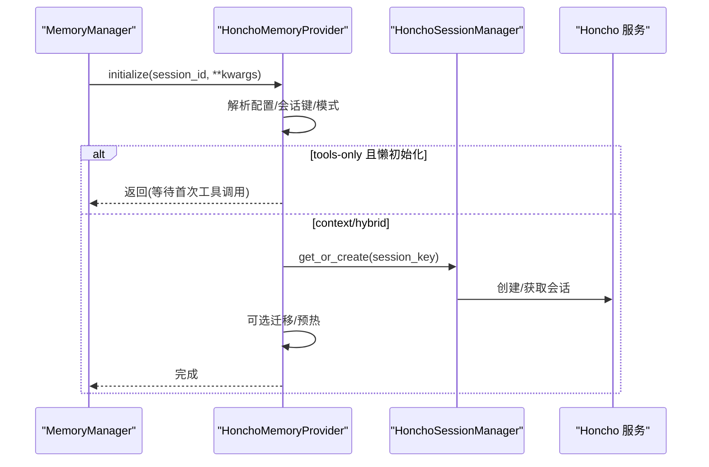
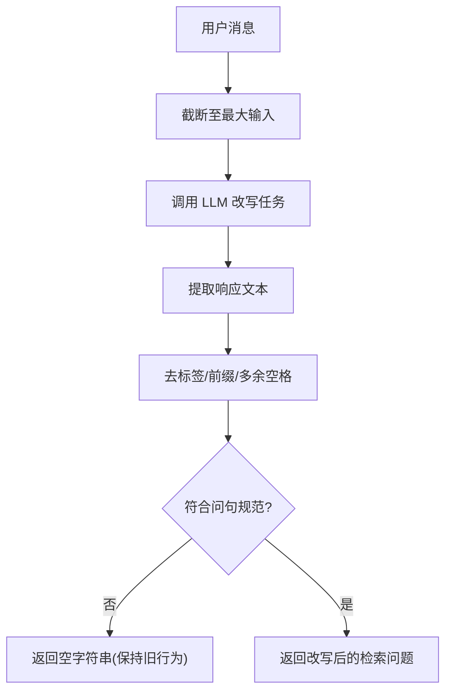
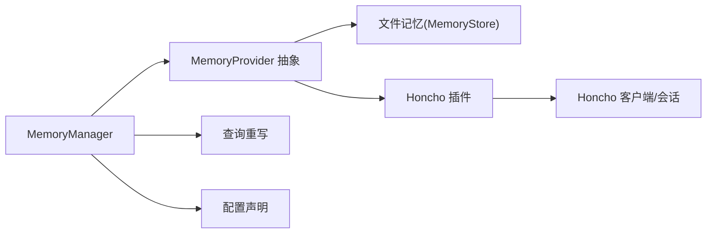

# 记忆系统架构

<cite>
**本文引用的文件**
- [agent/memory_manager.py](file://agent/memory_manager.py)
- [agent/memory_provider.py](file://agent/memory_provider.py)
- [plugins/memory/config_schema.py](file://plugins/memory/config_schema.py)
- [plugins/memory/query_rewrite.py](file://plugins/memory/query_rewrite.py)
- [plugins/memory/honcho/__init__.py](file://plugins/memory/honcho/__init__.py)
- [plugins/memory/honcho/config_schema.py](file://plugins/memory/honcho/config_schema.py)
- [tools/memory_tool.py](file://tools/memory_tool.py)
</cite>

## 目录
1. [简介](#简介)
2. [项目结构](#项目结构)
3. [核心组件](#核心组件)
4. [架构总览](#架构总览)
5. [详细组件分析](#详细组件分析)
6. [依赖关系分析](#依赖关系分析)
7. [性能考量](#性能考量)
8. [故障排查指南](#故障排查指南)
9. [结论](#结论)
10. [附录：配置与扩展指南](#附录：配置与扩展指南)

## 简介
本文件面向 Hermes 记忆系统的整体设计与实现，覆盖持久化存储、上下文管理、向量/语义检索、用户画像构建、记忆生命周期、数据一致性、性能优化与扩展性。文档同时提供配置示例与扩展指南，帮助开发者集成新存储后端与优化检索算法。

## 项目结构
Hermes 的记忆系统由“管理器 + 抽象接口 + 插件提供者 + 内置工具”构成：
- 管理器：统一编排多个记忆提供者（内置与外部），负责系统提示注入、预取、同步、工具暴露与后台调度。
- 抽象接口：定义提供者的生命周期、钩子与配置声明能力。
- 插件提供者：以 Honcho 为代表，提供跨会话的用户建模、对话式推理、混合检索与持久结论。
- 内置工具：基于文件的有界记忆（MEMORY.md/USER.md），用于可审计的条目级增删改与快照注入。

图表来源
- [agent/memory_manager.py:364-503](file://agent/memory_manager.py#L364-L503)
- [agent/memory_provider.py:81-192](file://agent/memory_provider.py#L81-L192)
- [tools/memory_tool.py:148-240](file://tools/memory_tool.py#L148-L240)
- [plugins/memory/honcho/__init__.py:237-336](file://plugins/memory/honcho/__init__.py#L237-L336)

章节来源
- [agent/memory_manager.py:1-108](file://agent/memory_manager.py#L1-L108)
- [agent/memory_provider.py:1-32](file://agent/memory_provider.py#L1-L32)
- [tools/memory_tool.py:1-24](file://tools/memory_tool.py#L1-L24)
- [plugins/memory/honcho/__init__.py:1-14](file://plugins/memory/honcho/__init__.py#L1-L14)

## 核心组件
- MemoryManager：注册提供者、组装系统提示、聚合预取结果、后台同步、工具模式开关、流式上下文清洗。
- MemoryProvider：定义 is_available/initialize/prefetch/sync_turn/get_tool_schemas/handle_tool_call/shutdown 等生命周期；提供可选钩子 on_session_switch/on_pre_compress/on_memory_write 等。
- 内置文件记忆（MemoryStore）：以 MEMORY.md/USER.md 为持久化载体，提供 add/replace/remove/batch 操作、字符预算控制、防注入扫描、原子写入与并发锁。
- Honcho 插件：提供 hybrid/context/tools 三种召回模式、会话策略、对话式推理、结论持久化、消息保存频率、观测模式等丰富配置。
- 查询重写：将最新用户消息改写为“仅检索”的问题，提升召回质量并降低指令泄露风险。
- 配置声明：通过 ProviderConfigSchema 描述字段类型、是否密钥、作用域与默认值，驱动桌面端与 Web 端通用渲染。

章节来源
- [agent/memory_manager.py:364-800](file://agent/memory_manager.py#L364-L800)
- [agent/memory_provider.py:81-358](file://agent/memory_provider.py#L81-L358)
- [tools/memory_tool.py:148-800](file://tools/memory_tool.py#L148-L800)
- [plugins/memory/honcho/__init__.py:237-800](file://plugins/memory/honcho/__init__.py#L237-L800)
- [plugins/memory/query_rewrite.py:1-140](file://plugins/memory/query_rewrite.py#L1-L140)
- [plugins/memory/config_schema.py:1-145](file://plugins/memory/config_schema.py#L1-L145)

## 架构总览
记忆系统采用“多提供者 + 统一编排”的架构：
- 启动阶段：加载各提供者的配置与可用性，生成系统提示块。
- 每轮对话前：对 trivial 提示进行过滤，必要时调用查询重写，再并行/串行预取相关上下文。
- 每轮对话后：异步同步本轮用户与助手内容到各提供者，保证顺序与不阻塞主流程。
- 工具模式：按需暴露提供者工具（如搜索、推理、结论），供模型主动检索与写入。
- 流式输出：对包含内部标记的上下文进行清洗，避免泄露内部片段。

图表来源
- [agent/memory_manager.py:525-694](file://agent/memory_manager.py#L525-L694)
- [agent/memory_provider.py:132-170](file://agent/memory_provider.py#L132-L170)
- [plugins/memory/honcho/__init__.py:699-800](file://plugins/memory/honcho/__init__.py#L699-L800)

## 详细组件分析

### MemoryManager：编排与调度
- 提供者注册：仅允许一个外部提供者，防止工具 schema 膨胀与冲突；保留核心工具名不被覆盖。
- 系统提示：聚合所有提供者的静态提示块，便于缓存与稳定。
- 预取：支持同步与后台队列；外部提供者使用独立线程与超时，避免拖慢主流程。
- 同步：单工作线程串行执行，确保 turn N 先于 turn N+1 落地；失败不阻断其他提供者。
- 工具暴露：收集并提供提供者工具 schema，按启用/禁用工具集策略决定是否注入。
- 流式清洗：StreamingContextScrubber 处理跨分片的 <memory-context> 标签，避免泄露内部片段。

图表来源
- [agent/memory_manager.py:626-694](file://agent/memory_manager.py#L626-L694)

章节来源
- [agent/memory_manager.py:364-800](file://agent/memory_manager.py#L364-L800)

### MemoryProvider：抽象与钩子
- 生命周期：is_available/initialize/system_prompt_block/prefetch/sync_turn/get_tool_schemas/handle_tool_call/shutdown。
- 可选钩子：on_turn_start/on_session_end/on_session_switch/on_pre_compress/on_delegation/on_memory_write/backup_paths/get_config_schema/save_config。
- 小提示过滤：is_trivial_prompt 避免无意义的网络请求与上下文污染。

章节来源
- [agent/memory_provider.py:44-358](file://agent/memory_provider.py#L44-L358)

### 内置文件记忆（MemoryStore）：有界、可审计、强一致
- 持久化：MEMORY.md/USER.md，条目以分隔符组织，支持批量操作。
- 安全：严格的内容扫描，阻止注入/泄露；加载时构建系统提示快照，会话内稳定。
- 并发：文件锁 + 原子写入，避免并发写导致的数据丢失。
- 一致性：检测外部漂移（非解析器可回写的修改），拒绝可能丢数据的写入并给出修复指引。
- 容量：按字符预算限制，超限时引导模型在当轮合并/删除后再重试，最多尝试次数后降级为终止提示。

图表来源
- [tools/memory_tool.py:148-800](file://tools/memory_tool.py#L148-L800)

章节来源
- [tools/memory_tool.py:148-800](file://tools/memory_tool.py#L148-L800)

### Honcho 插件：跨会话用户建模与混合检索
- 召回模式：hybrid（自动注入 + 工具）、context（仅注入）、tools（仅工具）。
- 会话策略：per-session/per-directory/per-repo/global，灵活映射 Hermes 会话到 Honcho 会话。
- 对话式推理：dialectic 深度与级别可调，支持启发式与上限控制。
- 消息写入：async/turn/session/N 多种刷新策略，兼顾延迟与一致性。
- 观测模式：directional/unified，控制跨 peer 的观察视角。
- 初始化：支持懒初始化与后台预热，失败不阻塞主流程；认证失败提供一次性提示。

图表来源
- [plugins/memory/honcho/__init__.py:343-562](file://plugins/memory/honcho/__init__.py#L343-L562)

章节来源
- [plugins/memory/honcho/__init__.py:237-800](file://plugins/memory/honcho/__init__.py#L237-L800)
- [plugins/memory/honcho/config_schema.py:27-325](file://plugins/memory/honcho/config_schema.py#L27-L325)

### 查询重写：从用户消息到高质量检索问题
- 目标：将最新用户消息改写为“仅检索”的问题，聚焦用户历史、偏好与上下文。
- 约束：截断输入长度、去除指令泄露、规范化输出格式、强制问句结尾。
- 容错：异常或无效输出时回退到旧行为，不影响主流程。

图表来源
- [plugins/memory/query_rewrite.py:55-140](file://plugins/memory/query_rewrite.py#L55-L140)

章节来源
- [plugins/memory/query_rewrite.py:1-140](file://plugins/memory/query_rewrite.py#L1-L140)

### 配置声明：ProviderConfigSchema
- 字段类型：text/select/secret/bool/number/json。
- 存储后端：flat_json 或 honcho_host_block，由 Web 层统一读写。
- 作用域：host/root，控制配置落盘位置。
- 通用渲染：桌面端与 Web 端共享同一套声明，新增提供者无需定制 UI。

章节来源
- [plugins/memory/config_schema.py:1-145](file://plugins/memory/config_schema.py#L1-L145)
- [plugins/memory/honcho/config_schema.py:27-325](file://plugins/memory/honcho/config_schema.py#L27-L325)

## 依赖关系分析
- MemoryManager 依赖 MemoryProvider 抽象，具体实现包括内置文件记忆与 Honcho 插件。
- Honcho 插件依赖其客户端与会话管理器，进行会话创建、上下文获取与消息写入。
- 查询重写依赖辅助 LLM 调用，将用户消息转换为检索问题。
- 配置声明模块被 Web 层动态加载，避免引入运行时依赖。

图表来源
- [agent/memory_manager.py:364-503](file://agent/memory_manager.py#L364-L503)
- [agent/memory_provider.py:81-192](file://agent/memory_provider.py#L81-L192)
- [plugins/memory/honcho/__init__.py:237-336](file://plugins/memory/honcho/__init__.py#L237-L336)
- [plugins/memory/query_rewrite.py:109-140](file://plugins/memory/query_rewrite.py#L109-L140)
- [plugins/memory/config_schema.py:112-145](file://plugins/memory/config_schema.py#L112-L145)

章节来源
- [agent/memory_manager.py:364-503](file://agent/memory_manager.py#L364-L503)
- [agent/memory_provider.py:81-192](file://agent/memory_provider.py#L81-L192)
- [plugins/memory/honcho/__init__.py:237-336](file://plugins/memory/honcho/__init__.py#L237-L336)
- [plugins/memory/query_rewrite.py:109-140](file://plugins/memory/query_rewrite.py#L109-L140)
- [plugins/memory/config_schema.py:112-145](file://plugins/memory/config_schema.py#L112-L145)

## 性能考量
- 后台调度：sync_all 与 queue_prefetch_all 均走后台工作线程，避免阻塞主循环；外部提供者预取带超时保护。
- 单线程串行写入：保证 turn 顺序，简化提供者一致性要求。
- 懒初始化与预热：Honcho 支持懒初始化与首轮等待窗口，减少冷启动影响。
- 上下文预算：内置记忆按字符预算限制，超限时引导合并；Honcho 支持 context_tokens 上限。
- 流式清洗：StreamingContextScrubber 避免跨分片标签导致的额外开销与泄露。
- 查询重写：限制输入长度与输出长度，降低 LLM 调用成本。

[本节为通用指导，不直接分析具体文件]

## 故障排查指南
- 外部提供者预取超时：检查超时阈值与网络状况；若仍卡住，将在后续轮次跳过该提供者。
- 同步失败：查看日志中 provider.sync_turn 的错误信息；由于后台执行，不会阻塞用户响应。
- 文件记忆写入失败：
  - 读取失败：文件存在但不可读（权限/编码/锁定），会拒绝写入以避免数据丢失。
  - 外部漂移：检测到非解析器可回写的修改，需先恢复为干净状态再重试。
  - 容量超限：根据提示在当前轮次合并或删除条目后再重试。
- Honcho 初始化失败：认证失败会在首轮提供一次性提示；tools-only 模式可延迟到首次工具调用。
- 查询重写失败：异常或无效输出会回退到旧行为，不影响主流程。

章节来源
- [agent/memory_manager.py:547-595](file://agent/memory_manager.py#L547-L595)
- [agent/memory_manager.py:626-694](file://agent/memory_manager.py#L626-L694)
- [tools/memory_tool.py:91-145](file://tools/memory_tool.py#L91-L145)
- [plugins/memory/honcho/__init__.py:564-625](file://plugins/memory/honcho/__init__.py#L564-L625)
- [plugins/memory/query_rewrite.py:109-140](file://plugins/memory/query_rewrite.py#L109-L140)

## 结论
Hermes 记忆系统通过统一的编排器与抽象接口，实现了多提供者共存、异步可靠同步、可配置的检索与注入策略，以及强一致的文件记忆。Honcho 插件提供了强大的跨会话用户建模与对话式推理能力，配合查询重写与配置声明，使系统在可扩展性与易用性之间取得平衡。内置文件记忆则提供了可审计、安全的本地持久化方案。

[本节为总结，不直接分析具体文件]

## 附录：配置与扩展指南

### 配置示例（Honcho）
- 连接：apiKey/baseUrl/environment/workspace
- 身份：peerName/aiPeer/pinUserPeer/runtimePeerPrefix/userPeerAliases
- 会话：sessionStrategy/sessionPeerPrefix/sessions
- 消息写入：saveMessages/writeFrequency
- 对话式推理：dialecticReasoningLevel/dialecticDynamic/dialecticMaxChars/dialecticDepth/dialecticDepthLevels/dialecticMaxInputChars
- 推理启发：reasoningHeuristic/reasoningLevelCap
- 召回模式：recallMode/contextTokens/initOnSessionStart
- 限制与观测：messageMaxChars/observationMode

章节来源
- [plugins/memory/honcho/config_schema.py:27-325](file://plugins/memory/honcho/config_schema.py#L27-L325)

### 自定义存储后端实现要点
- 实现 MemoryProvider 接口：
  - 必须实现：name/is_available/initialize/get_tool_schemas/handle_tool_call/shutdown
  - 建议实现：system_prompt_block/prefetch/sync_turn/queue_prefetch
  - 可选钩子：on_session_switch/on_pre_compress/on_memory_write/backup_paths/get_config_schema/save_config
- 注册提供者：通过 MemoryManager.add_provider 注册，注意仅允许一个外部提供者。
- 工具暴露：get_tool_schemas 返回 OpenAI function 格式；名称不得与核心工具冲突。
- 配置声明：在插件目录下提供 config_schema.py，声明字段类型与作用域，交由通用渲染。

章节来源
- [agent/memory_provider.py:81-358](file://agent/memory_provider.py#L81-L358)
- [agent/memory_manager.py:404-470](file://agent/memory_manager.py#L404-L470)
- [plugins/memory/config_schema.py:1-145](file://plugins/memory/config_schema.py#L1-L145)

### 检索算法优化建议
- 查询重写：启用 query_rewrite 以提升检索问题质量；结合 Honcho 的 dialectic 深度与级别控制。
- 上下文预算：合理设置 context_tokens 与 max result chars，避免过长注入。
- 注入频率：first-turn 或 every-turn 根据场景选择，减少不必要开销。
- 会话策略：per-session/per-directory/per-repo/global 按业务需求选择，平衡隔离与共享。
- 消息写入：async/turn/session/N 根据延迟与一致性需求调整。

章节来源
- [plugins/memory/query_rewrite.py:109-140](file://plugins/memory/query_rewrite.py#L109-L140)
- [plugins/memory/honcho/config_schema.py:176-247](file://plugins/memory/honcho/config_schema.py#L176-L247)
- [plugins/memory/honcho/config_schema.py:266-300](file://plugins/memory/honcho/config_schema.py#L266-L300)