# AI代理架构

<cite>
**本文引用的文件**
- [run_agent.py](file://run_agent.py)
- [agent_loop.md](file://website/docs/developer-guide/agent-loop.md)
- [architecture.md](file://website/docs/developer-guide/architecture.md)
- [conversation_loop.py](file://agent/conversation_loop.py)
- [trajectory.py](file://agent/trajectory.py)
- [agent_runtime_helpers.py](file://agent/agent_runtime_helpers.py)
- [prompt_builder.py](file://agent/prompt_builder.py)
- [prompt_caching.py](file://agent/prompt_caching.py)
- [context_compressor.py](file://agent/context_compressor.py)
- [memory_manager.py](file://agent/memory_manager.py)
- [memory_provider.py](file://agent/memory_provider.py)
- [tool_executor.py](file://agent/tool_executor.py)
- [tool_dispatch_helpers.py](file://agent/tool_dispatch_helpers.py)
- [retry_utils.py](file://agent/retry_utils.py)
- [iteration_budget.py](file://agent/iteration_budget.py)
- [system_prompt.py](file://agent/system_prompt.py)
- [model_tools.py](file://model_tools.py)
- [tools/registry.py](file://tools/registry.py)
- [gateway/run.py](file://gateway/run.py)
- [test_memory_nudge_counter_hydration.py](file://tests/run_agent/test_memory_nudge_counter_hydration.py)
- [test_steer.py](file://tests/run_agent/test_steer.py)
- [test_tool_result_storage.py](file://tests/tools/test_tool_result_storage.py)
- [test_queue_consumption.py](file://tests/gateway/test_queue_consumption.py)
- [test_platform_registry.py](file://tests/gateway/test_platform_registry.py)
</cite>

## 目录
1. [引言](#引言)
2. [项目结构](#项目结构)
3. [核心组件](#核心组件)
4. [架构总览](#架构总览)
5. [详细组件分析](#详细组件分析)
6. [依赖关系分析](#依赖关系分析)
7. [性能考量](#性能考量)
8. [故障排查指南](#故障排查指南)
9. [结论](#结论)
10. [附录](#附录)

## 引言
本技术文档聚焦于Hermes Agent的AI代理架构，围绕AIAgent类的设计理念、生命周期管理与核心工作流展开，系统阐述对话循环机制、轨迹跟踪系统与运行时助手功能；并覆盖代理初始化、消息处理管道、错误恢复机制与性能优化策略。文档同时解释代理如何与工具系统、记忆系统和平台适配器交互，以及其可扩展性设计与自改进机制。

## 项目结构
Hermes Agent采用“平台无关核心 + 多入口适配”的分层架构：核心代理引擎位于run_agent.py中的AIAgent类，负责统一的提示构建、模型调用、工具调度、上下文压缩与持久化；工具系统通过tools/registry.py实现自动发现与注册；记忆系统由memory_manager与memory_provider提供；平台适配器在gateway模块中按需加载。开发者指南页面提供了关于代理循环、提示装配、提供方运行时解析与工具运行时的权威说明。

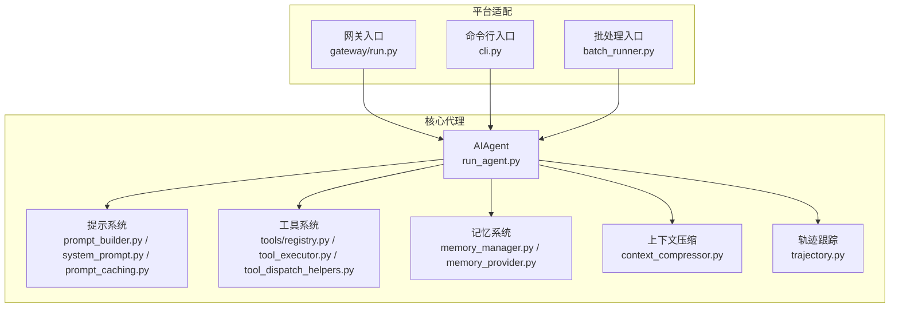

**图表来源**
- [run_agent.py](file://run_agent.py)
- [prompt_builder.py](file://agent/prompt_builder.py)
- [prompt_caching.py](file://agent/prompt_caching.py)
- [context_compressor.py](file://agent/context_compressor.py)
- [memory_manager.py](file://agent/memory_manager.py)
- [memory_provider.py](file://agent/memory_provider.py)
- [trajectory.py](file://agent/trajectory.py)
- [tools/registry.py](file://tools/registry.py)
- [tool_executor.py](file://agent/tool_executor.py)
- [tool_dispatch_helpers.py](file://agent/tool_dispatch_helpers.py)
- [gateway/run.py](file://gateway/run.py)

**章节来源**
- [architecture.md](file://website/docs/developer-guide/architecture.md)
- [agent_loop.md](file://website/docs/developer-guide/agent-loop.md)

## 核心组件
- AIAgent：同步编排引擎，负责提示组装、提供方选择、可中断模型调用、工具调用、对话历史维护、压缩/重试/回退、迭代预算与持久化记忆。
- 提示系统：由system_prompt与prompt_builder组合，按稳定/上下文/易变层级构建系统提示；prompt_caching提供缓存断点以提升推理效率。
- 工具系统：通过tools/registry.py在导入期自动注册，tool_executor与tool_dispatch_helpers负责调度与执行。
- 记忆系统：memory_manager与memory_provider提供会话级记忆的读写与刷新，确保上下文不丢失前持久化。
- 上下文压缩：context_compressor在阈值触发时对中间轮次进行摘要，避免上下文溢出。
- 轨迹跟踪：trajectory.py记录会话轨迹，便于复盘与训练数据生成。
- 平台适配：gateway/run.py等入口根据平台差异注入消息流与状态，但核心逻辑保持一致。

**章节来源**
- [agent_loop.md](file://website/docs/developer-guide/agent-loop.md)
- [architecture.md](file://website/docs/developer-guide/architecture.md)

## 架构总览
AIAgent作为单一核心，贯穿以下关键流程：
- 初始化阶段：加载配置、构建提示、准备工具与记忆、建立会话上下文。
- 对话循环：接收用户消息 → 组装提示 → 选择提供方 → 发起模型调用 → 解析响应/工具调用 → 执行工具 → 更新历史 → 压缩/持久化 → 输出结果。
- 错误恢复：重试策略、回退模型切换、中断处理与可观测回调。
- 自改进：通过轨迹与内存触发“自我改进评审”提醒，结合平台适配器进行持续优化。

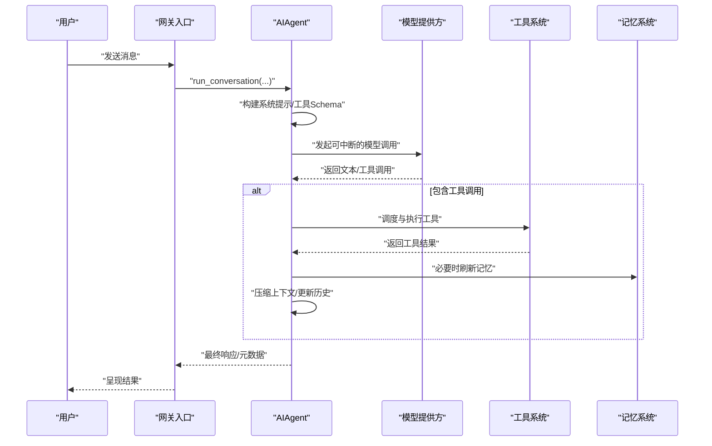

**图表来源**
- [run_agent.py](file://run_agent.py)
- [gateway/run.py](file://gateway/run.py)
- [prompt_builder.py](file://agent/prompt_builder.py)
- [tool_executor.py](file://agent/tool_executor.py)
- [memory_manager.py](file://agent/memory_manager.py)

## 详细组件分析

### AIAgent类与生命周期管理
- 设计理念：以“平台无关核心”为原则，将平台差异置于入口层，保证AIAgent在CLI、网关、ACP、批处理与API服务中的一致行为。
- 生命周期阶段：
  - 初始化：加载配置、构建提示、注册工具、准备记忆与上下文。
  - 运行期：run_conversation主循环，处理消息、工具、压缩与持久化。
  - 结束：输出最终响应与统计信息，触发自改进评审。
- 关键职责：提示组装、提供方选择(API模式)、可中断调用、工具执行、历史维护、压缩/重试/回退、迭代预算、持久化记忆。

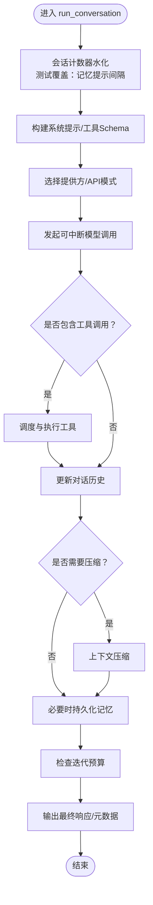

**图表来源**
- [run_agent.py](file://run_agent.py)
- [test_memory_nudge_counter_hydration.py](file://tests/run_agent/test_memory_nudge_counter_hydration.py)

**章节来源**
- [agent_loop.md](file://website/docs/developer-guide/agent-loop.md)
- [architecture.md](file://website/docs/developer-guide/architecture.md)
- [test_memory_nudge_counter_hydration.py](file://tests/run_agent/test_memory_nudge_counter_hydration.py)

### 对话循环机制
- 循环入口：run_conversation提供完整接口，chat为简化包装。
- 循环控制：每轮迭代包含提示构建、模型调用、工具调度、历史更新、压缩与持久化。
- 中断与恢复：支持用户输入或信号中断；工具执行与API调用均可取消。
- 回退策略：在失败时切换到备用模型或重试，保障可用性。

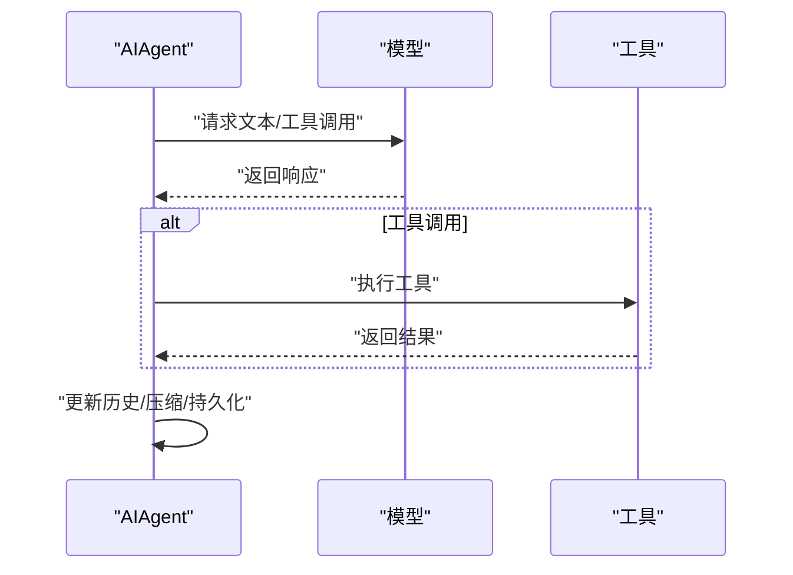

**图表来源**
- [run_agent.py](file://run_agent.py)
- [tool_executor.py](file://agent/tool_executor.py)

**章节来源**
- [agent_loop.md](file://website/docs/developer-guide/agent-loop.md)

### 轨迹跟踪系统
- 目标：生成ShareGPT格式轨迹，用于训练数据生成与复盘。
- 机制：在会话期间记录消息、工具调用与结果，最终导出标准化轨迹。
- 应用：结合测试用例验证轨迹压缩与异步处理的正确性。

**图表来源**
- [trajectory.py](file://agent/trajectory.py)
- [run_agent.py](file://run_agent.py)

**章节来源**
- [trajectory.py](file://agent/trajectory.py)

### 运行时助手与自改进机制
- 运行时助手：通过“自我改进评审”提醒，引导用户进行反思与优化。
- 触发条件：基于会话轮次与记忆提示间隔的水化逻辑，确保长期对话中不会遗漏评审提示。
- 测试保障：针对计数器水化行为进行回归测试，防止缓存失效导致评审缺失。

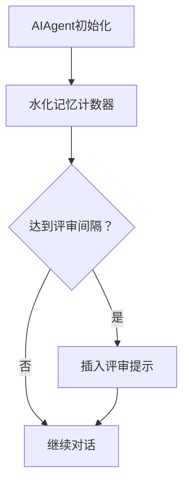

**图表来源**
- [test_memory_nudge_counter_hydration.py](file://tests/run_agent/test_memory_nudge_counter_hydration.py)
- [run_agent.py](file://run_agent.py)

**章节来源**
- [test_memory_nudge_counter_hydration.py](file://tests/run_agent/test_memory_nudge_counter_hydration.py)

### 提示系统与上下文压缩
- 提示构建：system_prompt与prompt_builder按稳定/上下文/易变层级组装；prompt_caching提供缓存断点以减少重复计算。
- 上下文压缩：context_compressor在阈值触发时对中间轮次进行摘要，避免上下文溢出影响性能与成本。

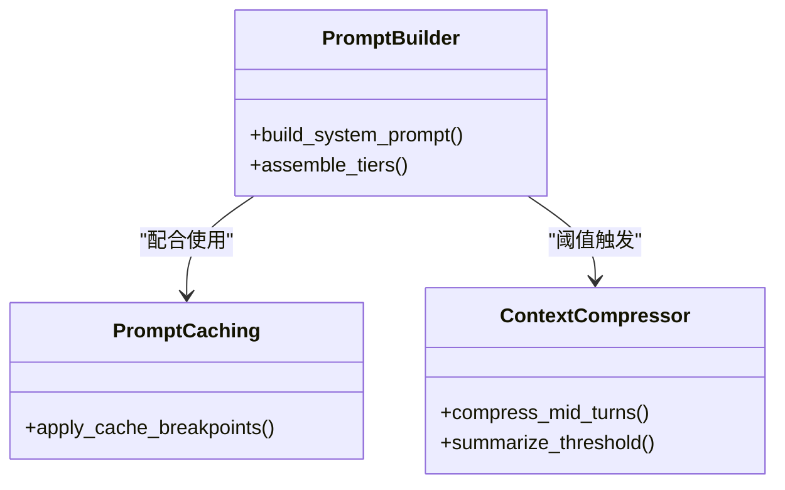

**图表来源**
- [prompt_builder.py](file://agent/prompt_builder.py)
- [prompt_caching.py](file://agent/prompt_caching.py)
- [context_compressor.py](file://agent/context_compressor.py)

**章节来源**
- [architecture.md](file://website/docs/developer-guide/architecture.md)

### 工具系统与执行管道
- 注册与发现：tools/registry.py在导入期自动注册工具，无需手动维护列表。
- 调度与执行：tool_dispatch_helpers负责解析与路由，tool_executor提供顺序或并发执行能力。
- 中间件与回退：支持工具执行中间件链路，异常时进行降级与回退。

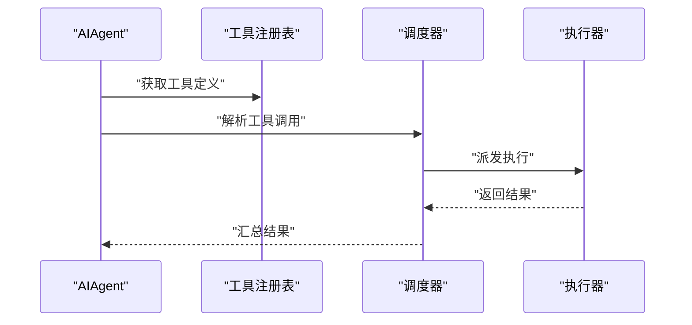

**图表来源**
- [tools/registry.py](file://tools/registry.py)
- [tool_dispatch_helpers.py](file://agent/tool_dispatch_helpers.py)
- [tool_executor.py](file://agent/tool_executor.py)

**章节来源**
- [architecture.md](file://website/docs/developer-guide/architecture.md)

### 记忆系统与平台适配器
- 记忆管理：memory_manager与memory_provider提供会话级记忆的读写与刷新，确保在上下文丢失前完成持久化。
- 平台适配：gateway/run.py等入口按平台差异注入消息流与状态，核心代理逻辑保持一致。

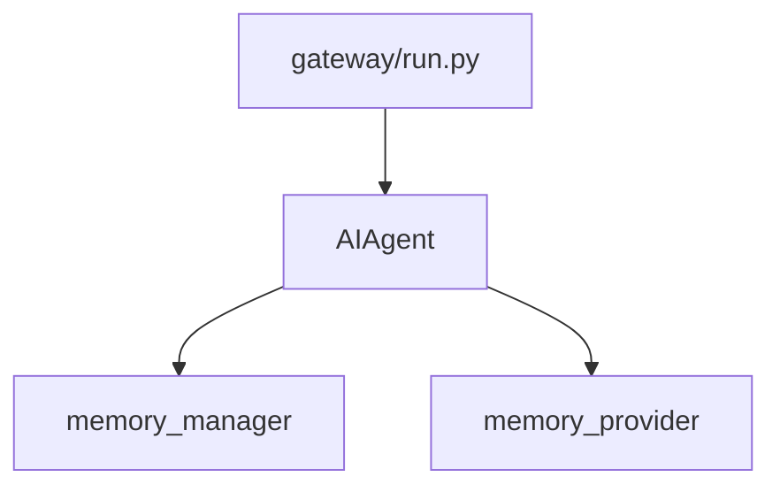

**图表来源**
- [memory_manager.py](file://agent/memory_manager.py)
- [memory_provider.py](file://agent/memory_provider.py)
- [gateway/run.py](file://gateway/run.py)

**章节来源**
- [architecture.md](file://website/docs/developer-guide/architecture.md)

### 错误恢复与重试机制
- 重试策略：retry_utils提供通用重试与退避逻辑，适用于网络波动与瞬时错误。
- 回退模型：在主模型失败时自动切换到备用模型，提升鲁棒性。
- 中断处理：API调用与工具执行支持用户输入或信号中断，保证可控性。

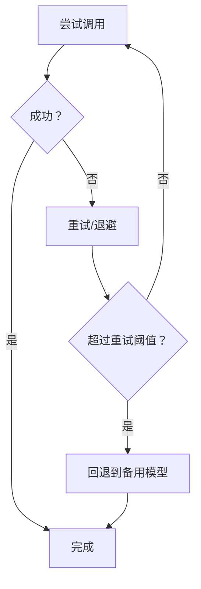

**图表来源**
- [retry_utils.py](file://agent/retry_utils.py)
- [run_agent.py](file://run_agent.py)

**章节来源**
- [agent_loop.md](file://website/docs/developer-guide/agent-loop.md)

### 性能优化策略
- 提示缓存：prompt_caching利用缓存断点减少重复计算。
- 上下文压缩：context_compressor在阈值触发时进行摘要，降低token消耗与延迟。
- 工具结果预算：iteration_budget与tool_result_storage确保大结果优先持久化，避免超限。
- 并发执行：工具执行支持线程池并发，缩短端到端时延。

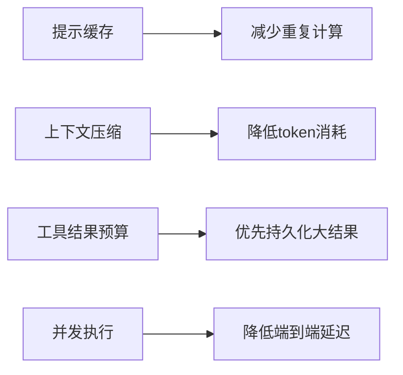

**图表来源**
- [prompt_caching.py](file://agent/prompt_caching.py)
- [context_compressor.py](file://agent/context_compressor.py)
- [iteration_budget.py](file://agent/iteration_budget.py)
- [test_tool_result_storage.py](file://tests/tools/test_tool_result_storage.py)

**章节来源**
- [architecture.md](file://website/docs/developer-guide/architecture.md)
- [test_tool_result_storage.py](file://tests/tools/test_tool_result_storage.py)

## 依赖关系分析
- 工具注册链：tools/registry.py为根，各tools/*.py在导入期注册，model_tools.py触发工具发现。
- 提示依赖：prompt_builder依赖system_prompt与prompt_caching。
- 记忆依赖：memory_manager依赖memory_provider。
- 网关依赖：gateway/run.py创建AIAgent实例并注入消息事件队列，测试覆盖队列消费与文本保留策略。

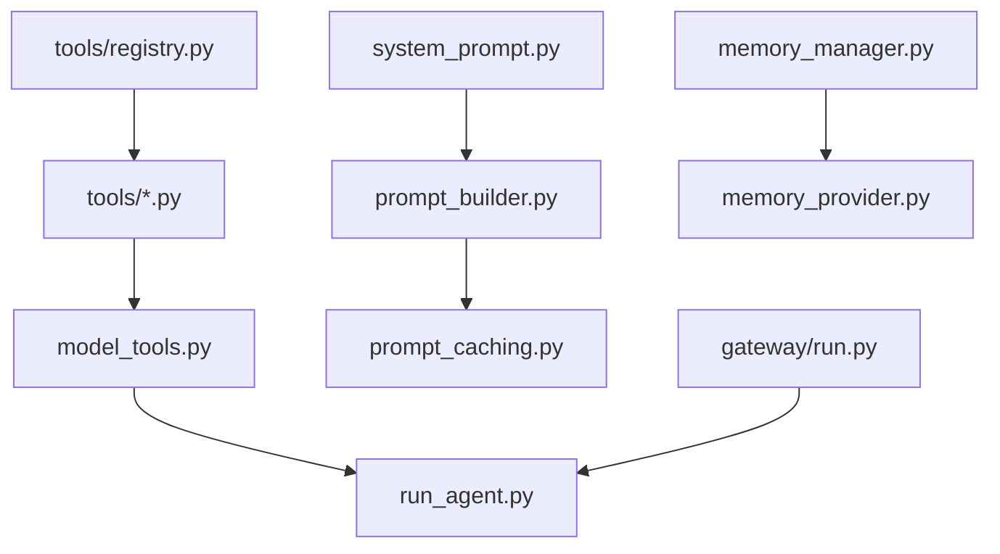

**图表来源**
- [tools/registry.py](file://tools/registry.py)
- [model_tools.py](file://model_tools.py)
- [run_agent.py](file://run_agent.py)
- [system_prompt.py](file://agent/system_prompt.py)
- [prompt_builder.py](file://agent/prompt_builder.py)
- [prompt_caching.py](file://agent/prompt_caching.py)
- [memory_manager.py](file://agent/memory_manager.py)
- [memory_provider.py](file://agent/memory_provider.py)
- [gateway/run.py](file://gateway/run.py)

**章节来源**
- [architecture.md](file://website/docs/developer-guide/architecture.md)

## 性能考量
- 提示稳定性：系统提示在对话中保持稳定，避免缓存破坏。
- 可观测执行：工具调用通过回调对用户可见，CLI与网关均有进度反馈。
- 可中断性：API调用与工具执行可被中断，降低无效资源占用。
- 松耦合设计：可选子系统通过注册表与check_fn门控，避免硬依赖带来的性能负担。
- Profile隔离：多profile并发运行互不影响，提升整体吞吐。

**章节来源**
- [architecture.md](file://website/docs/developer-guide/architecture.md)

## 故障排查指南
- 计数器水化问题：若出现“自我改进评审”未触发，检查会话计数器水化逻辑与历史消息注入。
- 工具执行中间件异常：确认中间件链路的前置/后置处理是否正确传递参数与异常。
- 队列消费与文本保留：确保网关队列消费不合并相邻文本，避免语义丢失。
- 平台令牌占位符：启动时拒绝已知弱令牌，避免静默失败。

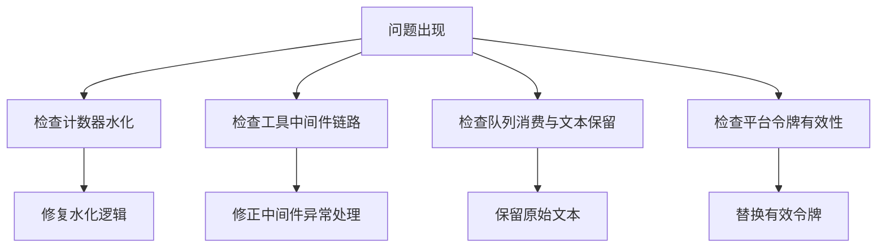

**图表来源**
- [test_memory_nudge_counter_hydration.py](file://tests/run_agent/test_memory_nudge_counter_hydration.py)
- [test_steer.py](file://tests/run_agent/test_steer.py)
- [test_queue_consumption.py](file://tests/gateway/test_queue_consumption.py)
- [test_platform_registry.py](file://tests/gateway/test_platform_registry.py)

**章节来源**
- [test_memory_nudge_counter_hydration.py](file://tests/run_agent/test_memory_nudge_counter_hydration.py)
- [test_steer.py](file://tests/run_agent/test_steer.py)
- [test_queue_consumption.py](file://tests/gateway/test_queue_consumption.py)
- [test_platform_registry.py](file://tests/gateway/test_platform_registry.py)

## 结论
Hermes Agent的AIAgent以“平台无关核心”为核心，通过提示系统、工具系统、记忆系统与上下文压缩等子系统协同，实现了可中断、可观测、可回退且可扩展的智能代理架构。借助轨迹跟踪与自改进机制，代理能够在真实使用中持续优化；通过严格的错误恢复与性能优化策略，确保在复杂场景下的稳定性与高效性。

## 附录
- 入口与运行模式：run_agent提供两种入口，chat为简化接口，run_conversation提供完整输出与元数据。
- 提示装配：system_prompt与prompt_builder按层级组装，prompt_caching提供缓存断点。
- 工具运行时：tools/registry.py自动注册，model_tools.py触发发现，run_agent在运行期调度执行。
- 网关集成：gateway/run.py负责消息队列与适配，测试覆盖队列深度与文本保留策略。

**章节来源**
- [agent_loop.md](file://website/docs/developer-guide/agent-loop.md)
- [architecture.md](file://website/docs/developer-guide/architecture.md)