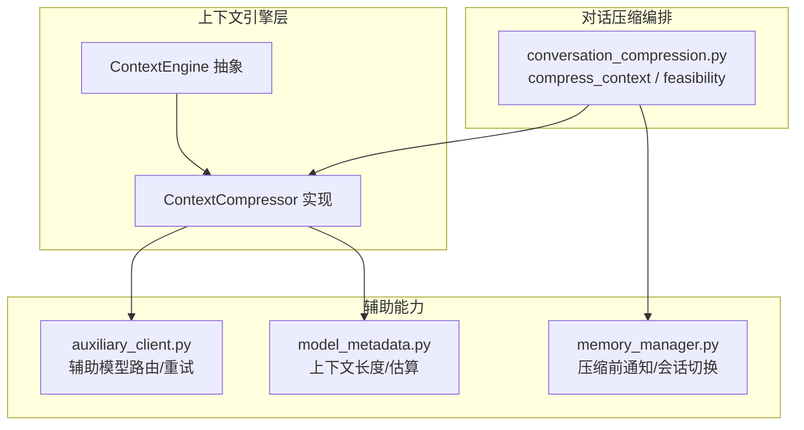
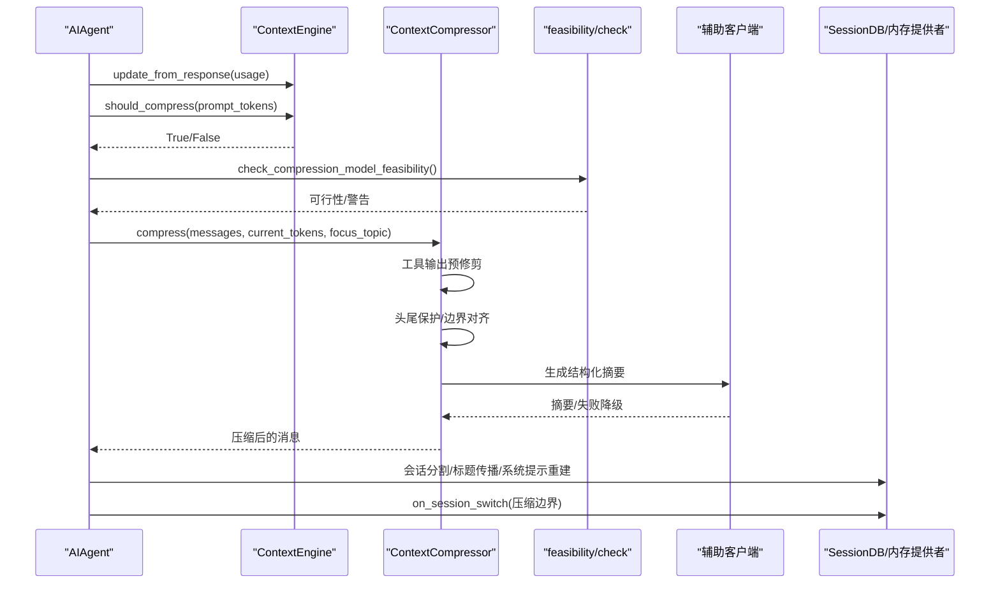
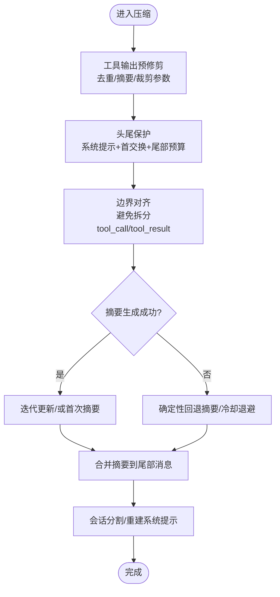
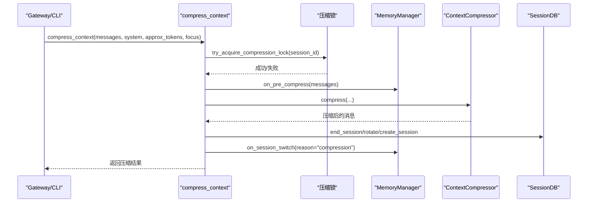
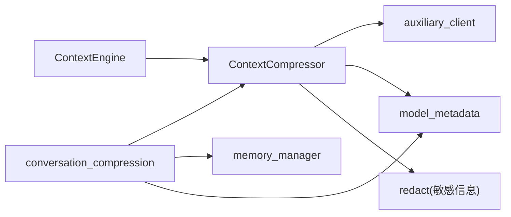

# 上下文处理算法

<cite>
**本文引用的文件**
- [agent/context_compressor.py](file://agent/context_compressor.py)
- [agent/conversation_compression.py](file://agent/conversation_compression.py)
- [agent/manual_compression_feedback.py](file://agent/manual_compression_feedback.py)
- [agent/context_engine.py](file://agent/context_engine.py)
- [agent/memory_manager.py](file://agent/memory_manager.py)
- [agent/model_metadata.py](file://agent/model_metadata.py)
- [agent/auxiliary_client.py](file://agent/auxiliary_client.py)
- [tests/agent/test_compressor_image_tokens.py](file://tests/agent/test_compressor_image_tokens.py)
- [website/docs/developer-guide/context-compression-and-caching.md](file://website/docs/developer-guide/context-compression-and-caching.md)
</cite>

## 目录
1. [引言](#引言)
2. [项目结构](#项目结构)
3. [核心组件](#核心组件)
4. [架构总览](#架构总览)
5. [详细组件分析](#详细组件分析)
6. [依赖关系分析](#依赖关系分析)
7. [性能考量](#性能考量)
8. [故障排查指南](#故障排查指南)
9. [结论](#结论)
10. [附录](#附录)

## 引言
本文件面向Hermes Agent的上下文处理算法，系统化阐述上下文压缩算法、对话压缩策略与手动压缩反馈机制，解析令牌预算管理、优先级排序与内容选择算法，并给出压缩效率优化、质量保证与性能监控的实践建议。文档同时覆盖长对话与复杂任务场景下的应用策略，并通过图示与路径引用帮助读者快速定位实现细节。

## 项目结构
围绕上下文处理的关键模块包括：
- 上下文引擎抽象层：定义统一接口与生命周期钩子，便于插拔式扩展（如LCM等第三方引擎）。
- 内置压缩器：默认的上下文压缩实现，采用“工具输出预修剪 + 头尾保护 + 结构化摘要”的四阶段流程。
- 对话压缩编排：负责可行性检查、并发锁、会话分割、内存提供者联动与状态广播。
- 辅助客户端：为压缩摘要生成提供“廉价/快速”的辅助模型路由与重试链路。
- 模型元数据：提供上下文长度探测、默认窗口与估算工具，支撑预检与阈值计算。
- 手动压缩反馈：为用户命令式压缩提供一致化的反馈摘要。

**图表来源**
- [agent/context_engine.py](file://agent/context_engine.py)
- [agent/context_compressor.py](file://agent/context_compressor.py)
- [agent/conversation_compression.py](file://agent/conversation_compression.py)
- [agent/auxiliary_client.py](file://agent/auxiliary_client.py)
- [agent/memory_manager.py](file://agent/memory_manager.py)
- [agent/model_metadata.py](file://agent/model_metadata.py)

**章节来源**
- [agent/context_engine.py](file://agent/context_engine.py)
- [agent/context_compressor.py](file://agent/context_compressor.py)
- [agent/conversation_compression.py](file://agent/conversation_compression.py)
- [agent/auxiliary_client.py](file://agent/auxiliary_client.py)
- [agent/memory_manager.py](file://agent/memory_manager.py)
- [agent/model_metadata.py](file://agent/model_metadata.py)

## 核心组件
- 上下文引擎抽象（ContextEngine）：定义名称、阈值、头尾保护策略、压缩触发与执行、生命周期钩子与状态展示等接口。
- 上下文压缩器（ContextCompressor）：内置默认实现，包含工具输出预修剪、头尾保护、结构化摘要生成、迭代更新与失败降级等能力。
- 对话压缩编排（conversation_compression）：负责可行性检查、压缩锁、会话分割、内存提供者联动、状态广播与错误处理。
- 辅助客户端（auxiliary_client）：为压缩摘要生成提供自动检测与回退的辅助模型链路，支持支付耗尽自动切换与超时控制。
- 模型元数据（model_metadata）：提供上下文长度探测、默认窗口、估算函数，支撑阈值与预算计算。
- 手动压缩反馈（manual_compression_feedback）：为用户命令式压缩提供一致化的摘要反馈。

**章节来源**
- [agent/context_engine.py](file://agent/context_engine.py)
- [agent/context_compressor.py](file://agent/context_compressor.py)
- [agent/conversation_compression.py](file://agent/conversation_compression.py)
- [agent/auxiliary_client.py](file://agent/auxiliary_client.py)
- [agent/model_metadata.py](file://agent/model_metadata.py)
- [agent/manual_compression_feedback.py](file://agent/manual_compression_feedback.py)

## 架构总览
上下文压缩在“预检—决策—执行—后处理”闭环中运行：
- 预检：根据当前消息与工具集估算请求令牌，结合阈值判断是否需要压缩。
- 决策：依据引擎策略与历史压缩效果（抗抖动）决定是否压缩。
- 执行：工具输出预修剪、头尾保护、结构化摘要生成、迭代更新或降级回退。
- 后处理：会话分割、内存提供者联动、状态缓存与日志记录。

**图表来源**
- [agent/context_engine.py](file://agent/context_engine.py)
- [agent/context_compressor.py](file://agent/context_compressor.py)
- [agent/conversation_compression.py](file://agent/conversation_compression.py)
- [agent/auxiliary_client.py](file://agent/auxiliary_client.py)

## 详细组件分析

### 上下文压缩器（ContextCompressor）
- 四阶段压缩流程
  1) 工具输出预修剪：将冗长工具结果替换为1行摘要，去重相同结果，裁剪长参数，降低后续摘要负担。
  2) 头尾保护：系统提示与首次交互始终保留；尾部按“令牌预算”或“消息计数”上限保护最新内容。
  3) 结构化摘要：使用辅助模型生成结构化摘要（目标比例随内容规模动态调整），支持迭代更新与焦点主题引导。
  4) 失败降级：摘要不可用时生成确定性回退摘要，记录丢弃轮次数量，必要时中止压缩并返回原消息列表。

- 关键参数与预算
  - 阈值百分比（threshold_percent）：超过阈值才触发压缩。
  - 尾部预算（tail_token_budget）：阈值×目标比例，用于尾部保护。
  - 最大摘要令牌（max_summary_tokens）：随模型上下文窗口动态调整，上限受常量限制。
  - 摘要预算比例（summary_target_ratio）：与压缩内容规模成比例，避免固定上限导致大模型摘要不足。

- 令牌预算与内容选择
  - 文本长度换算：按字符/令牌换算系数估算消息长度，图像部分按固定字符等价计入，确保尾部切分准确。
  - 工具调用参数裁剪：对assistant消息中的tool_calls参数进行安全JSON裁剪，避免下游提供商校验失败。
  - 图像内容处理：对旧轮次图像进行占位替换，减少重复传输与带宽占用。

- 迭代摘要与降级策略
  - 若存在上次摘要，采用“迭代更新”模板，保留有效信息并合并新进展。
  - 摘要生成失败时，按冷却时间退避或直接降级为确定性摘要，保证连续性与可恢复性。

- 并发与一致性
  - 压缩锁：基于会话ID的数据库锁，避免并发压缩导致孤儿会话。
  - 会话分割：压缩成功后结束旧会话、生成新会话ID、传播标题、重建系统提示。

**图表来源**
- [agent/context_compressor.py](file://agent/context_compressor.py)
- [agent/conversation_compression.py](file://agent/conversation_compression.py)

**章节来源**
- [agent/context_compressor.py](file://agent/context_compressor.py)
- [agent/conversation_compression.py](file://agent/conversation_compression.py)
- [tests/agent/test_compressor_image_tokens.py](file://tests/agent/test_compressor_image_tokens.py)

### 对话压缩编排（conversation_compression）
- 可行性检查：在首次压缩尝试时探测辅助压缩模型上下文窗口，若小于主模型阈值则自动下调阈值，或发出警告。
- 压缩锁：原子锁防止同一会话并发压缩，避免孤儿会话与消息分裂。
- 会话分割：压缩成功后结束旧会话、生成新会话ID、传播标题、重建系统提示并写入数据库。
- 内存提供者联动：压缩前通知外部记忆提供者，压缩后触发会话切换事件，确保跨提供者的状态一致性。
- 错误处理：摘要失败时返回原消息不变，向用户发出警告；摘要模型不可用时短冷却后重试或降级。

**图表来源**
- [agent/conversation_compression.py](file://agent/conversation_compression.py)
- [agent/memory_manager.py](file://agent/memory_manager.py)

**章节来源**
- [agent/conversation_compression.py](file://agent/conversation_compression.py)
- [agent/memory_manager.py](file://agent/memory_manager.py)

### 手动压缩反馈（manual_compression_feedback）
- 提供一致的用户反馈摘要，包括消息数量变化、近似请求大小变化与注意事项（例如消息减少但估算上升的场景说明）。
- 用于命令式压缩（/compress）的可视化反馈，便于用户评估压缩效果。

**章节来源**
- [agent/manual_compression_feedback.py](file://agent/manual_compression_feedback.py)

### 上下文引擎抽象（ContextEngine）
- 定义统一接口：名称、阈值、头尾保护策略、should_compress、compress、生命周期钩子与状态展示。
- 支持第三方引擎（如LCM）替换内置压缩器，保持上层调用一致性。

**章节来源**
- [agent/context_engine.py](file://agent/context_engine.py)

### 辅助客户端（auxiliary_client）
- 自动检测与回退：提供文本/视觉任务的辅助模型链路，支持支付耗尽自动切换、超时与网络异常的快速回退。
- 与压缩器协作：压缩摘要生成通过辅助客户端调用，具备超时控制与错误分类处理。

**章节来源**
- [agent/auxiliary_client.py](file://agent/auxiliary_client.py)

### 模型元数据（model_metadata）
- 上下文长度探测与默认窗口：为压缩器提供阈值与预算计算所需的上下文长度。
- 估算工具：提供消息级粗略令牌估算，支撑预检与压缩后估算。

**章节来源**
- [agent/model_metadata.py](file://agent/model_metadata.py)

## 依赖关系分析
- ContextCompressor 依赖：
  - auxiliary_client：摘要生成的辅助模型调用。
  - model_metadata：上下文长度与估算工具。
  - redact：敏感信息脱敏（摘要与回退摘要均进行脱敏）。
- conversation_compression 依赖：
  - ContextCompressor：实际压缩执行。
  - memory_manager：压缩前后与会话切换联动。
  - model_metadata：可行性检查中的上下文长度探测。
- ContextEngine 为抽象层，ContextCompressor为其具体实现。

**图表来源**
- [agent/context_compressor.py](file://agent/context_compressor.py)
- [agent/conversation_compression.py](file://agent/conversation_compression.py)
- [agent/auxiliary_client.py](file://agent/auxiliary_client.py)
- [agent/model_metadata.py](file://agent/model_metadata.py)
- [agent/context_engine.py](file://agent/context_engine.py)
- [agent/memory_manager.py](file://agent/memory_manager.py)

**章节来源**
- [agent/context_compressor.py](file://agent/context_compressor.py)
- [agent/conversation_compression.py](file://agent/conversation_compression.py)
- [agent/context_engine.py](file://agent/context_engine.py)
- [agent/memory_manager.py](file://agent/memory_manager.py)
- [agent/model_metadata.py](file://agent/model_metadata.py)
- [agent/auxiliary_client.py](file://agent/auxiliary_client.py)

## 性能考量
- 预修剪成本低、收益高：将冗长工具输出替换为1行摘要，显著降低摘要生成负担与令牌消耗。
- 令牌预算驱动的尾部保护：基于“尾部预算×目标比例”而非固定消息数，适配不同模型上下文窗口，提升压缩效率。
- 动态摘要预算：摘要目标令牌随压缩内容规模线性增长，避免小模型摘要不足、大模型摘要浪费。
- 图像内容处理：对旧轮次图像进行占位替换，避免重复传输与带宽占用，提升尾部切分准确性。
- 并发与一致性：压缩锁避免孤儿会话与消息分裂，减少无效重试与资源竞争。
- 可观测性：压缩前后估算、冷却时间、摘要错误与回退统计，便于性能监控与问题定位。

[本节为通用指导，不直接分析具体文件]

## 故障排查指南
- 摘要模型不可用
  - 现象：无辅助LLM提供程序列，摘要失败并进入冷却。
  - 排查：检查辅助压缩模型配置与凭据，确认可用提供程序列。
  - 处理：启用自动回退至主模型，或调整辅助模型配置。
- 摘要生成失败（超时/网络异常/JSON解码错误）
  - 现象：摘要生成失败，进入短暂冷却或降级为确定性摘要。
  - 排查：检查网络连通性、超时设置与上游响应格式。
  - 处理：适当放宽超时、修复上游响应格式或切换到更稳定的提供程序列。
- 并发压缩冲突
  - 现象：多个路径同时压缩同一会话，返回原消息不变并发出警告。
  - 排查：检查压缩锁状态与会话ID一致性。
  - 处理：等待其他路径完成压缩后再重试。
- 图像过大导致请求失败
  - 现象：图像超限（如5MB）导致请求被拒。
  - 排查：检查图像尺寸与编码大小。
  - 处理：使用图像收缩工具进行二次编码，或降低分辨率。

**章节来源**
- [agent/context_compressor.py](file://agent/context_compressor.py)
- [agent/conversation_compression.py](file://agent/conversation_compression.py)

## 结论
Hermes Agent的上下文处理算法通过“预修剪—头尾保护—结构化摘要—降级回退”的四阶段流程，在保证连续性与可恢复性的前提下，最大化压缩效率与质量。借助令牌预算管理、动态摘要预算与图像内容处理，系统在长对话与复杂任务中仍能稳定运行。配合可行性检查、压缩锁与内存提供者联动，整体流程具备良好的可观测性与可维护性。

[本节为总结性内容，不直接分析具体文件]

## 附录

### 压缩配置与参数调优要点
- 配置入口：config.yaml 中 compression 与 auxiliary.compression 节点。
- 关键参数
  - threshold：阈值比例（默认0.50），触发压缩的上下文使用率。
  - target_ratio：尾部预算占比（默认0.20），控制摘要与尾部的平衡。
  - protect_last_n：尾部最少保留消息数（默认20）。
  - auxiliary.compression.model/provider/base_url：辅助摘要模型与提供程序列。
- 调优建议
  - 大上下文模型：提高target_ratio以保留更多尾部细节；适度提高threshold以减少频繁压缩。
  - 创意/图像密集工作流：关注图像占位与字符等价估算，确保尾部切分准确。
  - 复杂任务：启用焦点主题（/compress <focus>）引导摘要优先保留关键信息。

**章节来源**
- [website/docs/developer-guide/context-compression-and-caching.md](file://website/docs/developer-guide/context-compression-and-caching.md)

### 效果评估与监控
- 压缩前后估算对比：比较压缩前后的近似请求大小，评估压缩收益。
- 压缩次数与质量：压缩次数过多可能影响准确性，应结合提示进行干预（/new）。
- 摘要错误与回退：关注摘要失败率与回退摘要的覆盖范围，及时调整辅助模型或参数。
- 令牌预算与尾部保护：观察尾部预算是否足够承载最新交互，避免频繁截断。

**章节来源**
- [agent/context_compressor.py](file://agent/context_compressor.py)
- [agent/conversation_compression.py](file://agent/conversation_compression.py)