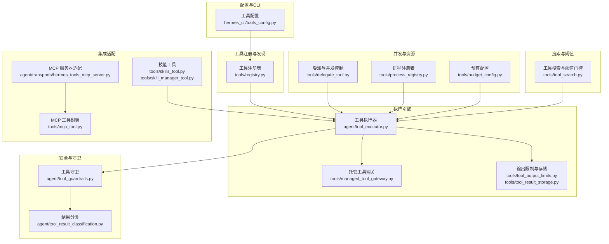
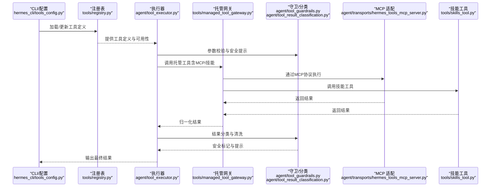
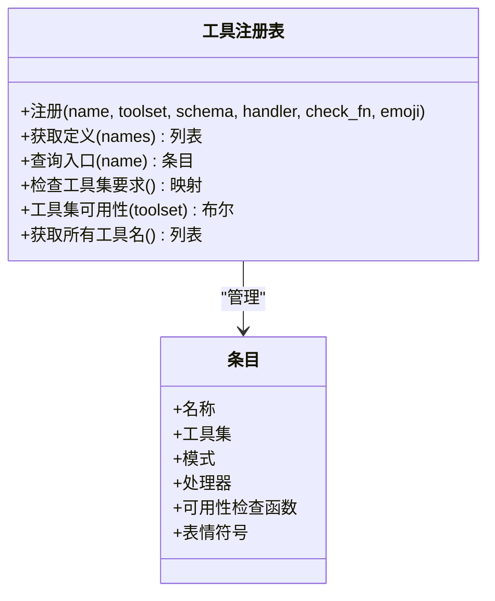
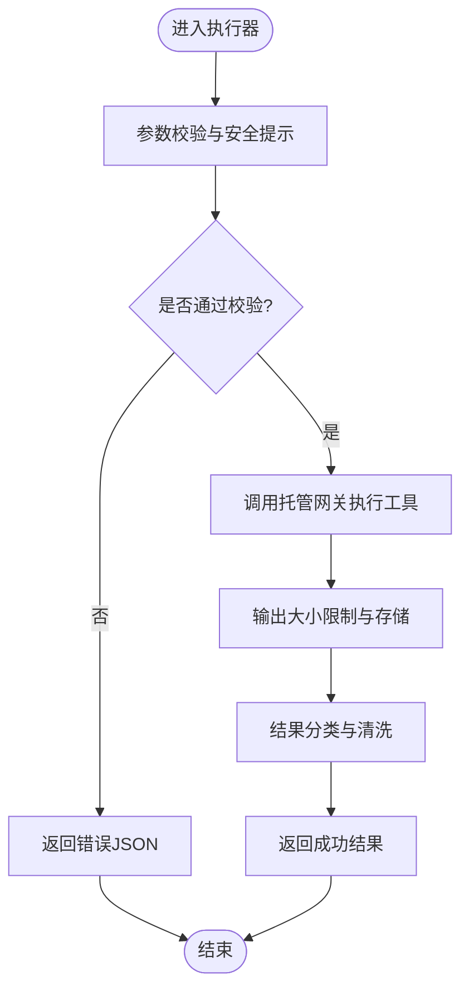
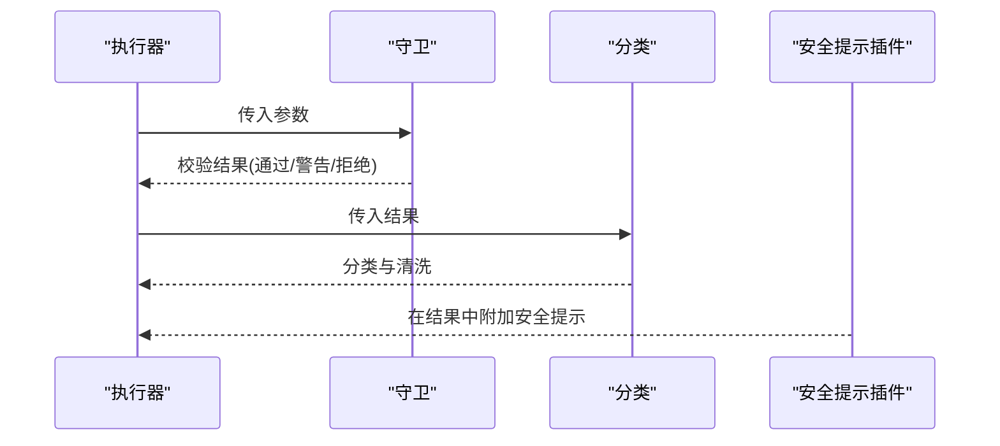
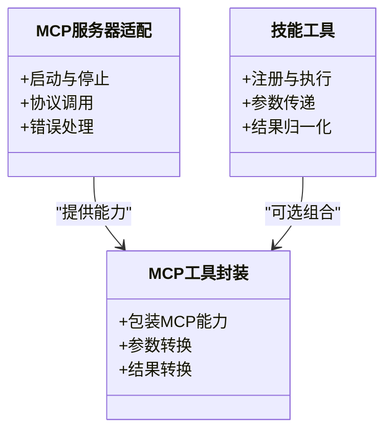
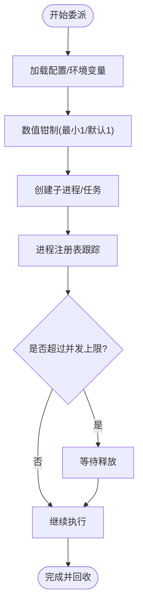
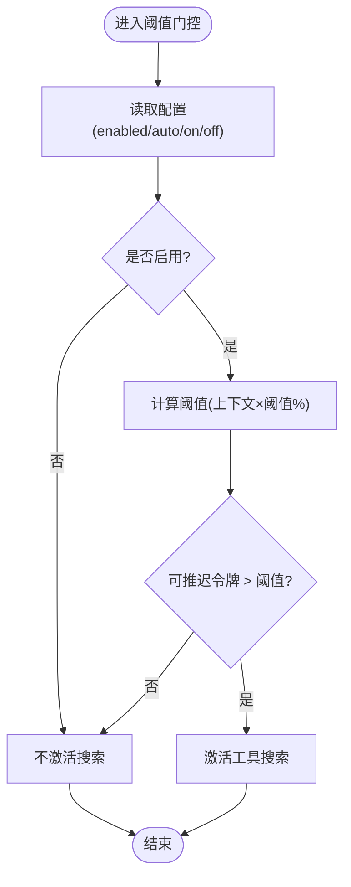
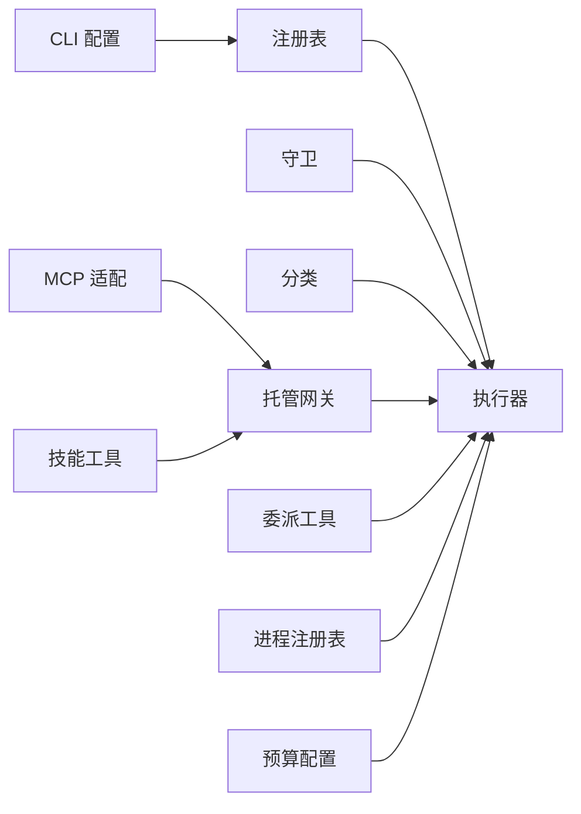

# 工具系统原理

<cite>
**本文引用的文件**
- [tools/registry.py](file://tools/registry.py)
- [agent/tool_executor.py](file://agent/tool_executor.py)
- [agent/tool_guardrails.py](file://agent/tool_guardrails.py)
- [agent/tool_result_classification.py](file://agent/tool_result_classification.py)
- [agent/tool_dispatch_helpers.py](file://agent/tool_dispatch_helpers.py)
- [agent/transports/hermes_tools_mcp_server.py](file://agent/transports/hermes_tools_mcp_server.py)
- [hermes_cli/tools_config.py](file://hermes_cli/tools_config.py)
- [plugins/spotify/tools.py](file://plugins/spotify/tools.py)
- [plugins/google_meet/tools.py](file://plugins/google_meet/tools.py)
- [tools/mcp_tool.py](file://tools/mcp_tool.py)
- [tools/skill_manager_tool.py](file://tools/skill_manager_tool.py)
- [tools/skills_tool.py](file://tools/skills_tool.py)
- [tools/managed_tool_gateway.py](file://tools/managed_tool_gateway.py)
- [tools/tool_output_limits.py](file://tools/tool_output_limits.py)
- [tools/tool_result_storage.py](file://tools/tool_result_storage.py)
- [tools/tool_search.py](file://tools/tool_search.py)
- [tools/delegate_tool.py](file://tools/delegate_tool.py)
- [tools/process_registry.py](file://tools/process_registry.py)
- [tools/budget_config.py](file://tools/budget_config.py)
- [tests/tools/test_registry.py](file://tests/tools/test_registry.py)
- [tests/tools/test_tool_search.py](file://tests/tools/test_tool_search.py)
- [tests/agent/test_tool_guardrails.py](file://tests/agent/test_tool_guardrails.py)
- [tests/agent/transports/test_hermes_tools_mcp_server.py](file://tests/agent/transports/test_hermes_tools_mcp_server.py)
- [tests/run_agent/test_iteration_budget_race.py](file://tests/run_agent/test_iteration_budget_race.py)
- [tests/plugins/test_security_guidance_plugin.py](file://tests/plugins/test_security_guidance_plugin.py)
- [website/docs/developer-guide/tools-runtime.md](file://website/docs/developer-guide/tools-runtime.md)
</cite>

## 目录
1. [引言](#引言)
2. [项目结构](#项目结构)
3. [核心组件](#核心组件)
4. [架构总览](#架构总览)
5. [详细组件分析](#详细组件分析)
6. [依赖关系分析](#依赖关系分析)
7. [性能考量](#性能考量)
8. [故障排查指南](#故障排查指南)
9. [结论](#结论)
10. [附录](#附录)

## 引言
本文件系统化阐述 Hermes Agent 的工具系统原理，覆盖工具定义规范、执行引擎设计、安全防护机制与生命周期管理。内容包括工具注册流程、参数验证、结果处理与错误恢复策略，以及并发控制与资源管理。同时提供可操作的实践建议与扩展性设计思路，并通过图示与测试用例来源帮助读者快速定位实现细节。

## 项目结构
工具系统主要由以下层次构成：
- 工具注册与发现：集中于工具注册表，负责工具定义、可用性检查与分发。
- 执行引擎：负责工具调用、并发调度、超时与资源限制。
- 安全与守卫：在调用前后进行参数校验、结果分类与安全提示。
- 集成适配层：支持 MCP、技能（Skill）等外部能力接入。
- CLI 与配置：提供工具集与工具的配置入口。
- 测试与文档：验证工具可用性、并发安全与运行时行为。

图表来源
- [tools/registry.py](file://tools/registry.py)
- [agent/tool_executor.py](file://agent/tool_executor.py)
- [agent/tool_guardrails.py](file://agent/tool_guardrails.py)
- [agent/tool_result_classification.py](file://agent/tool_result_classification.py)
- [agent/transports/hermes_tools_mcp_server.py](file://agent/transports/hermes_tools_mcp_server.py)
- [hermes_cli/tools_config.py](file://hermes_cli/tools_config.py)
- [tools/mcp_tool.py](file://tools/mcp_tool.py)
- [tools/skill_manager_tool.py](file://tools/skill_manager_tool.py)
- [tools/skills_tool.py](file://tools/skills_tool.py)
- [tools/managed_tool_gateway.py](file://tools/managed_tool_gateway.py)
- [tools/tool_output_limits.py](file://tools/tool_output_limits.py)
- [tools/tool_result_storage.py](file://tools/tool_result_storage.py)
- [tools/tool_search.py](file://tools/tool_search.py)
- [tools/delegate_tool.py](file://tools/delegate_tool.py)
- [tools/process_registry.py](file://tools/process_registry.py)
- [tools/budget_config.py](file://tools/budget_config.py)

章节来源
- [tools/registry.py](file://tools/registry.py)
- [agent/tool_executor.py](file://agent/tool_executor.py)
- [agent/tool_guardrails.py](file://agent/tool_guardrails.py)
- [agent/tool_result_classification.py](file://agent/tool_result_classification.py)
- [agent/transports/hermes_tools_mcp_server.py](file://agent/transports/hermes_tools_mcp_server.py)
- [hermes_cli/tools_config.py](file://hermes_cli/tools_config.py)
- [tools/mcp_tool.py](file://tools/mcp_tool.py)
- [tools/skill_manager_tool.py](file://tools/skill_manager_tool.py)
- [tools/skills_tool.py](file://tools/skills_tool.py)
- [tools/managed_tool_gateway.py](file://tools/managed_tool_gateway.py)
- [tools/tool_output_limits.py](file://tools/tool_output_limits.py)
- [tools/tool_result_storage.py](file://tools/tool_result_storage.py)
- [tools/tool_search.py](file://tools/tool_search.py)
- [tools/delegate_tool.py](file://tools/delegate_tool.py)
- [tools/process_registry.py](file://tools/process_registry.py)
- [tools/budget_config.py](file://tools/budget_config.py)

## 核心组件
- 工具注册表：统一管理工具定义、可用性检查函数与工具集分组，提供查询、过滤与快照一致性保障。
- 工具执行器：负责工具调用、并发调度、异常捕获与结果归一化。
- 守卫与分类：对输入参数进行安全校验与提示，对输出结果进行分类与清洗。
- 托管工具网关：封装外部工具（如 MCP、技能）的调用与生命周期管理。
- 输出限制与存储：控制工具输出大小与持久化，避免资源滥用。
- 并发与委派：通过委派工具与进程注册表实现子任务并发与深度控制。
- 搜索与阈值：根据上下文长度与令牌阈值动态决定是否启用工具搜索。

章节来源
- [tools/registry.py](file://tools/registry.py)
- [agent/tool_executor.py](file://agent/tool_executor.py)
- [agent/tool_guardrails.py](file://agent/tool_guardrails.py)
- [agent/tool_result_classification.py](file://agent/tool_result_classification.py)
- [tools/managed_tool_gateway.py](file://tools/managed_tool_gateway.py)
- [tools/tool_output_limits.py](file://tools/tool_output_limits.py)
- [tools/tool_result_storage.py](file://tools/tool_result_storage.py)
- [tools/delegate_tool.py](file://tools/delegate_tool.py)
- [tools/process_registry.py](file://tools/process_registry.py)
- [tools/tool_search.py](file://tools/tool_search.py)

## 架构总览
下图展示了从“工具定义”到“执行与安全”的完整链路，以及与 MCP、技能与 CLI 的集成点。

图表来源
- [hermes_cli/tools_config.py](file://hermes_cli/tools_config.py)
- [tools/registry.py](file://tools/registry.py)
- [agent/tool_executor.py](file://agent/tool_executor.py)
- [agent/tool_guardrails.py](file://agent/tool_guardrails.py)
- [agent/tool_result_classification.py](file://agent/tool_result_classification.py)
- [agent/transports/hermes_tools_mcp_server.py](file://agent/transports/hermes_tools_mcp_server.py)
- [tools/skills_tool.py](file://tools/skills_tool.py)
- [tools/managed_tool_gateway.py](file://tools/managed_tool_gateway.py)

## 详细组件分析

### 工具注册与可用性
- 注册表职责：维护工具名称、模式(schema)、处理器(handler)、可用性检查函数(check_fn)、工具集(toolset)与表情符号等元数据；提供按名称/集合查询、快照一致性与线程安全保证。
- 可用性检查：check_fn 控制工具集是否可用；异常被捕获并视为不可用，避免崩溃影响主流程。
- 错误处理：未知工具返回标准错误JSON；定义获取时跳过抛出check_fn的工具条目。
- 线程安全：在查询工具集可用性时使用一致快照，避免并发条件下状态不一致。

图表来源
- [tools/registry.py](file://tools/registry.py)

章节来源
- [tools/registry.py](file://tools/registry.py)
- [tests/tools/test_registry.py](file://tests/tools/test_registry.py)

### 工具执行引擎
- 调用流程：执行器接收工具名与参数，先经守卫进行参数校验与安全提示，再调用托管网关执行具体工具，最后进行结果分类与清洗。
- 异常处理：捕获工具执行中的异常，返回标准化错误；对未知工具返回错误JSON。
- 输出控制：结合输出限制与存储模块，控制结果大小与持久化，防止资源滥用。
- 并发与资源：通过委派工具与进程注册表实现子任务并发与深度控制；预算配置用于整体资源约束。

图表来源
- [agent/tool_executor.py](file://agent/tool_executor.py)
- [agent/tool_guardrails.py](file://agent/tool_guardrails.py)
- [agent/tool_result_classification.py](file://agent/tool_result_classification.py)
- [tools/managed_tool_gateway.py](file://tools/managed_tool_gateway.py)
- [tools/tool_output_limits.py](file://tools/tool_output_limits.py)
- [tools/tool_result_storage.py](file://tools/tool_result_storage.py)

章节来源
- [agent/tool_executor.py](file://agent/tool_executor.py)
- [agent/tool_guardrails.py](file://agent/tool_guardrails.py)
- [agent/tool_result_classification.py](file://agent/tool_result_classification.py)
- [tools/managed_tool_gateway.py](file://tools/managed_tool_gateway.py)
- [tools/tool_output_limits.py](file://tools/tool_output_limits.py)
- [tools/tool_result_storage.py](file://tools/tool_result_storage.py)

### 安全与守卫机制
- 输入校验：在执行前对参数进行合法性与安全性检查，必要时给出安全提示或阻断。
- 结果分类：对工具输出进行分类与清洗，避免敏感信息泄露。
- 插件式安全提示：当检测到潜在风险（如反序列化），在结果中附加安全提示但保留原始JSON。
- 运行时安全：对工具执行过程中的异常进行捕获与归一化，避免崩溃传播。

图表来源
- [agent/tool_guardrails.py](file://agent/tool_guardrails.py)
- [agent/tool_result_classification.py](file://agent/tool_result_classification.py)
- [tests/plugins/test_security_guidance_plugin.py](file://tests/plugins/test_security_guidance_plugin.py)

章节来源
- [agent/tool_guardrails.py](file://agent/tool_guardrails.py)
- [agent/tool_result_classification.py](file://agent/tool_result_classification.py)
- [tests/plugins/test_security_guidance_plugin.py](file://tests/plugins/test_security_guidance_plugin.py)

### 集成适配层（MCP 与技能）
- MCP 适配：通过 MCP 服务器适配器与外部工具交互，封装协议调用与错误处理。
- 技能工具：将技能作为工具注册与执行，便于统一调度与管理。
- MCP 工具封装：对 MCP 工具进行统一包装，便于与执行器协同工作。

图表来源
- [agent/transports/hermes_tools_mcp_server.py](file://agent/transports/hermes_tools_mcp_server.py)
- [tools/skills_tool.py](file://tools/skills_tool.py)
- [tools/mcp_tool.py](file://tools/mcp_tool.py)

章节来源
- [agent/transports/hermes_tools_mcp_server.py](file://agent/transports/hermes_tools_mcp_server.py)
- [tools/skills_tool.py](file://tools/skills_tool.py)
- [tools/mcp_tool.py](file://tools/mcp_tool.py)
- [tests/agent/transports/test_hermes_tools_mcp_server.py](file://tests/agent/transports/test_hermes_tools_mcp_server.py)

### 并发控制与资源管理
- 委派工具：通过委派工具与进程注册表实现子任务并发与最大并发数控制，支持环境变量与配置项覆盖默认值。
- 迭代预算：在多线程环境下保护共享状态，确保读写一致性，避免竞态条件导致的数据损坏。
- 最大并发与深度：对委派并发数与最大生成深度进行上限控制，防止资源耗尽。

图表来源
- [tools/delegate_tool.py](file://tools/delegate_tool.py)
- [tools/process_registry.py](file://tools/process_registry.py)
- [tests/run_agent/test_iteration_budget_race.py](file://tests/run_agent/test_iteration_budget_race.py)

章节来源
- [tools/delegate_tool.py](file://tools/delegate_tool.py)
- [tools/process_registry.py](file://tools/process_registry.py)
- [tests/run_agent/test_iteration_budget_race.py](file://tests/run_agent/test_iteration_budget_race.py)

### 工具搜索与阈值门控
- 门控逻辑：根据上下文长度与可推迟令牌数量，结合阈值百分比决定是否激活工具搜索。
- 配置选项：支持关闭、开启与自动三种模式；自动模式下以阈值百分比为触发条件。

图表来源
- [tools/tool_search.py](file://tools/tool_search.py)
- [tests/tools/test_tool_search.py](file://tests/tools/test_tool_search.py)

章节来源
- [tools/tool_search.py](file://tools/tool_search.py)
- [tests/tools/test_tool_search.py](file://tests/tools/test_tool_search.py)

### CLI 与配置
- 工具配置：通过 CLI 配置工具集与工具参数，驱动注册表与执行器的行为。
- 集成点：CLI 将用户配置映射到注册表与执行器，形成端到端的工具调用链。

章节来源
- [hermes_cli/tools_config.py](file://hermes_cli/tools_config.py)

## 依赖关系分析
- 组件耦合：执行器依赖注册表、守卫、分类与托管网关；守卫与分类相互独立但共同作用于执行器；MCP 与技能通过托管网关接入。
- 外部依赖：MCP 协议、进程管理与资源预算；CLI 配置驱动工具集可用性与参数。
- 循环依赖：未见直接循环依赖；各模块通过接口与回调解耦。

图表来源
- [tools/registry.py](file://tools/registry.py)
- [agent/tool_executor.py](file://agent/tool_executor.py)
- [agent/tool_guardrails.py](file://agent/tool_guardrails.py)
- [agent/tool_result_classification.py](file://agent/tool_result_classification.py)
- [agent/transports/hermes_tools_mcp_server.py](file://agent/transports/hermes_tools_mcp_server.py)
- [tools/skills_tool.py](file://tools/skills_tool.py)
- [tools/managed_tool_gateway.py](file://tools/managed_tool_gateway.py)
- [hermes_cli/tools_config.py](file://hermes_cli/tools_config.py)
- [tools/delegate_tool.py](file://tools/delegate_tool.py)
- [tools/process_registry.py](file://tools/process_registry.py)
- [tools/budget_config.py](file://tools/budget_config.py)

## 性能考量
- 并发策略：工具调用可能串行或并发，取决于工具组合与交互需求；委派工具与进程注册表提供并发上限控制。
- 输出限制：通过输出大小限制与存储模块减少内存与IO压力。
- 阈值门控：在高上下文场景下按阈值动态启用工具搜索，避免不必要的开销。
- 文档参考：开发者指南明确说明并发行为与相关文档链接。

章节来源
- [website/docs/developer-guide/tools-runtime.md](file://website/docs/developer-guide/tools-runtime.md)
- [tools/delegate_tool.py](file://tools/delegate_tool.py)
- [tools/tool_output_limits.py](file://tools/tool_output_limits.py)
- [tools/tool_search.py](file://tools/tool_search.py)

## 故障排查指南
- 未知工具：执行器返回标准错误JSON，包含“未知工具”提示；检查工具名称与注册表条目。
- 可用性检查异常：check_fn 抛出异常会被捕获并视作不可用；修复检查函数或移除异常路径。
- 守卫与分类：若出现安全提示叠加错误，优先关注工具自身错误；安全提示仅在工具成功时附加。
- 并发问题：迭代预算的 used 属性需加锁访问，避免竞态；确保多线程读写时使用受保护接口。
- MCP 适配：确认 MCP 服务器状态与协议调用；检查适配器日志与错误码。

章节来源
- [agent/tool_executor.py](file://agent/tool_executor.py)
- [tests/tools/test_registry.py](file://tests/tools/test_registry.py)
- [tests/plugins/test_security_guidance_plugin.py](file://tests/plugins/test_security_guidance_plugin.py)
- [tests/run_agent/test_iteration_budget_race.py](file://tests/run_agent/test_iteration_budget_race.py)
- [tests/agent/transports/test_hermes_tools_mcp_server.py](file://tests/agent/transports/test_hermes_tools_mcp_server.py)

## 结论
Hermes Agent 的工具系统以注册表为核心，配合执行器、守卫与分类模块，构建了可扩展、可并发且具备安全防护的工具执行框架。通过 CLI 配置、MCP 与技能适配，系统实现了对外部能力的统一接入。测试用例与文档进一步验证了线程安全、阈值门控与运行时行为的正确性。建议在扩展新工具时遵循统一的定义规范、参数校验与结果处理流程，并合理设置并发与资源限制。

## 附录

### 如何定义新工具
- 使用注册表注册工具，提供名称、工具集、模式与处理器；可选提供可用性检查函数与表情符号。
- 若工具需要外部能力，可通过托管网关封装（如 MCP 或技能）。
- 在 CLI 中配置工具集与参数，驱动工具可用性与行为。

章节来源
- [tools/registry.py](file://tools/registry.py)
- [hermes_cli/tools_config.py](file://hermes_cli/tools_config.py)
- [tools/managed_tool_gateway.py](file://tools/managed_tool_gateway.py)
- [tools/mcp_tool.py](file://tools/mcp_tool.py)
- [tools/skills_tool.py](file://tools/skills_tool.py)

### 如何配置工具参数
- 通过 CLI 配置工具集与参数；配置会反映到注册表与执行器。
- 对于委派工具，可通过环境变量或配置项调整最大并发与最大生成深度。

章节来源
- [hermes_cli/tools_config.py](file://hermes_cli/tools_config.py)
- [tools/delegate_tool.py](file://tools/delegate_tool.py)

### 如何处理工具输出
- 使用输出限制与存储模块控制结果大小与持久化。
- 通过守卫与分类模块进行安全提示与结果清洗。

章节来源
- [tools/tool_output_limits.py](file://tools/tool_output_limits.py)
- [tools/tool_result_storage.py](file://tools/tool_result_storage.py)
- [agent/tool_guardrails.py](file://agent/tool_guardrails.py)
- [agent/tool_result_classification.py](file://agent/tool_result_classification.py)

### 生命周期与并发控制要点
- 工具生命周期：定义 → 注册 → 可用性检查 → 调用 → 结果处理 → 清理。
- 并发控制：委派工具与进程注册表提供上限控制；迭代预算确保线程安全。

章节来源
- [tools/delegate_tool.py](file://tools/delegate_tool.py)
- [tools/process_registry.py](file://tools/process_registry.py)
- [tests/run_agent/test_iteration_budget_race.py](file://tests/run_agent/test_iteration_budget_race.py)