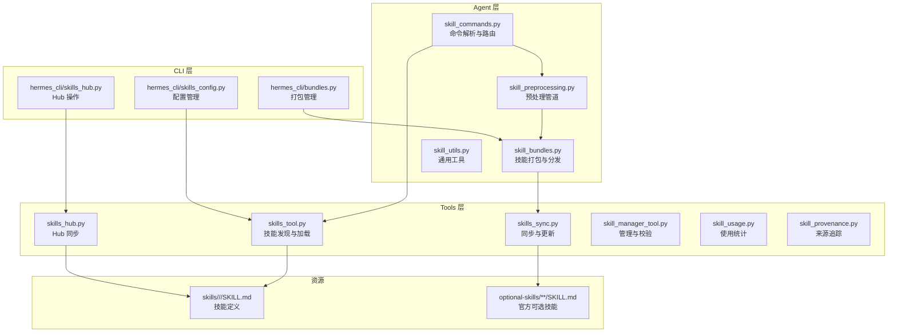
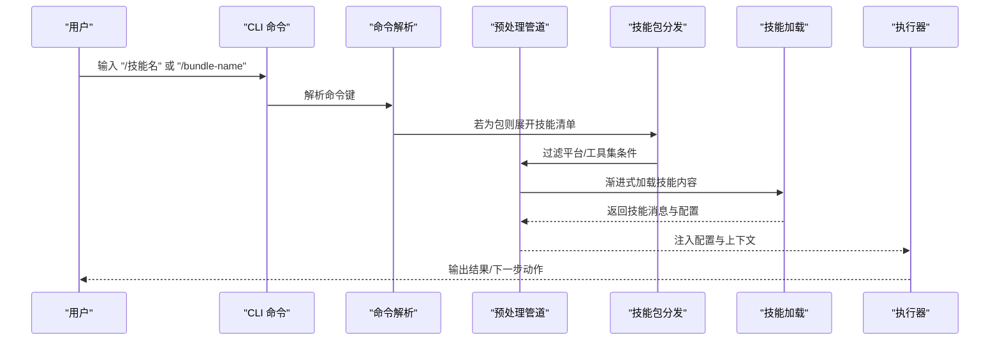
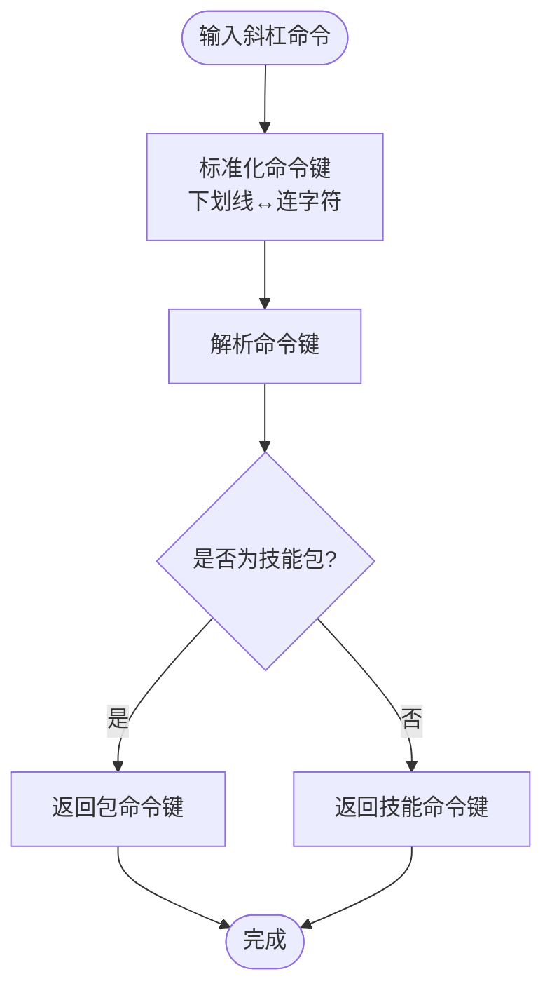
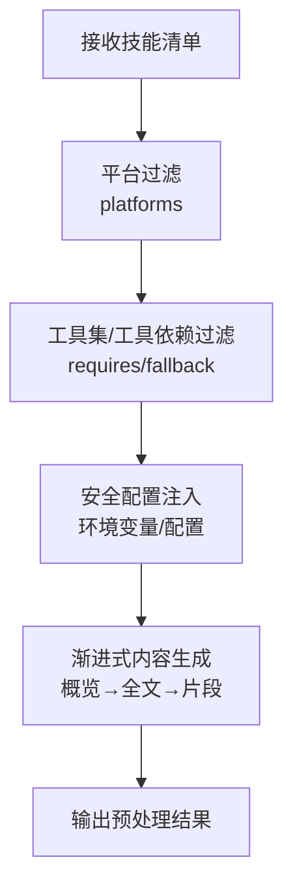
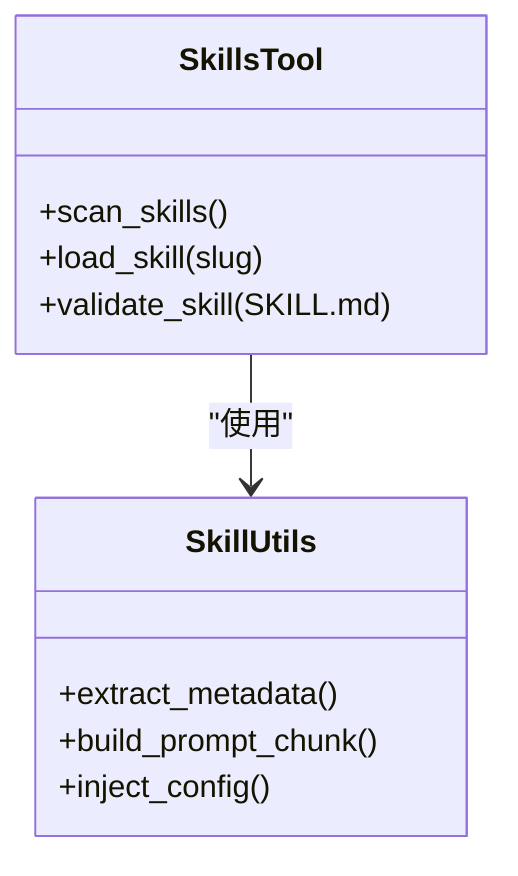
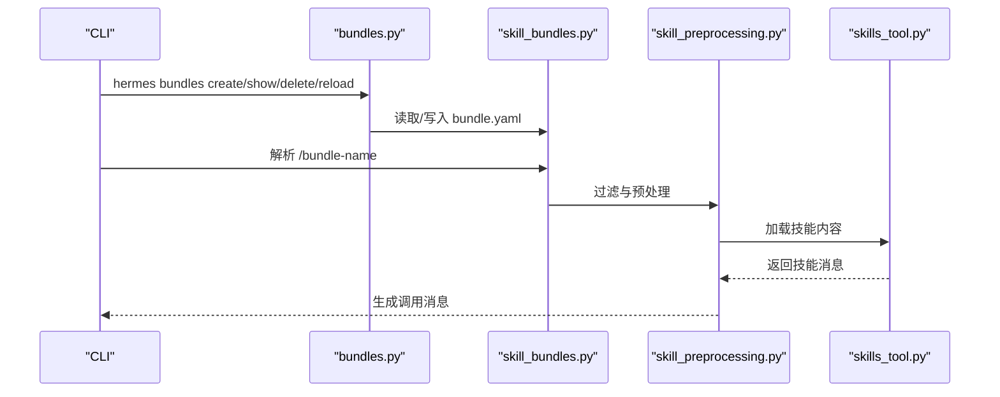
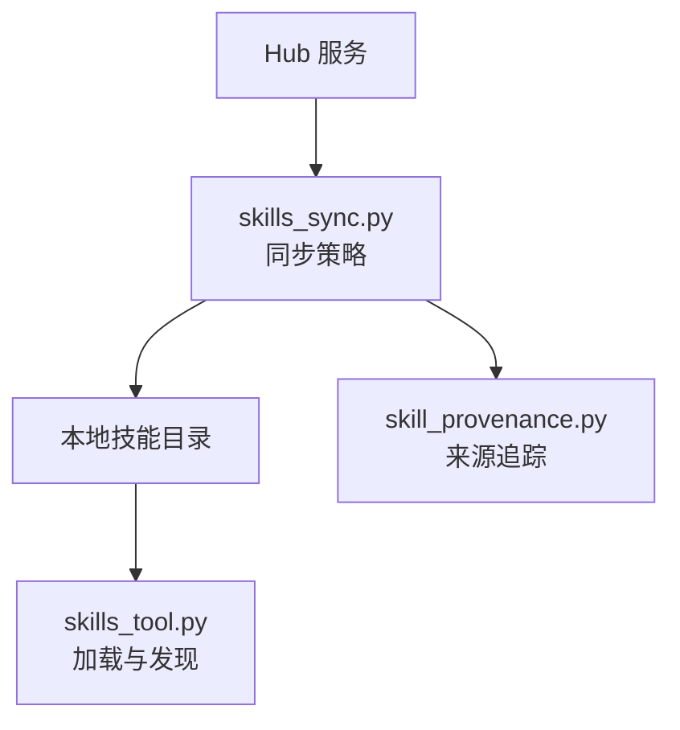
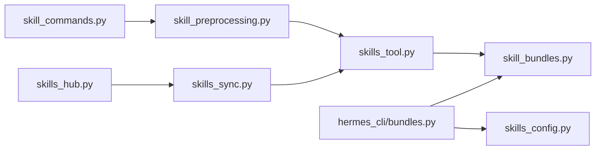

# 技能系统设计

<cite>
**本文档引用的文件**
- [agent/skill_bundles.py](file://agent/skill_bundles.py)
- [agent/skill_commands.py](file://agent/skill_commands.py)
- [agent/skill_preprocessing.py](file://agent/skill_preprocessing.py)
- [agent/skill_utils.py](file://agent/skill_utils.py)
- [tools/skill_manager_tool.py](file://tools/skill_manager_tool.py)
- [tools/skills_tool.py](file://tools/skills_tool.py)
- [tools/skills_hub.py](file://tools/skills_hub.py)
- [tools/skills_sync.py](file://tools/skills_sync.py)
- [tools/skill_usage.py](file://tools/skill_usage.py)
- [tools/skill_provenance.py](file://tools/skill_provenance.py)
- [hermes_cli/skills_config.py](file://hermes_cli/skills_config.py)
- [hermes_cli/skills_hub.py](file://hermes_cli/skills_hub.py)
- [hermes_cli/bundles.py](file://hermes_cli/bundles.py)
- [tests/agent/test_skill_commands.py](file://tests/agent/test_skill_commands.py)
- [tests/agent/test_skill_bundles.py](file://tests/agent/test_skill_bundles.py)
- [tests/hermes_cli/test_bundles.py](file://tests/hermes_cli/test_bundles.py)
- [optional-skills/software-development/subagent-driven-development/SKILL.md](file://optional-skills/software-development/subagent-driven-development/SKILL.md)
- [website/docs/user-guide/features/skills.md](file://website/docs/user-guide/features/skills.md)
- [website/i18n/zh-Hans/docusaurus-plugin-content-docs/current/developer-guide/creating-skills.md](file://website/i18n/zh-Hans/docusaurus-plugin-content-docs/current/developer-guide/creating-skills.md)
</cite>

## 目录
1. [引言](#引言)
2. [项目结构](#项目结构)
3. [核心组件](#核心组件)
4. [架构总览](#架构总览)
5. [详细组件分析](#详细组件分析)
6. [依赖关系分析](#依赖关系分析)
7. [性能考量](#性能考量)
8. [故障排查指南](#故障排查指南)
9. [结论](#结论)
10. [附录](#附录)

## 引言
本文件面向Hermes Agent的技能系统，提供从概念到实现的完整技术文档。重点覆盖技能定义格式、执行器架构与分发机制、技能加载流程、预处理管道、命令解析系统、技能打包与版本管理、依赖处理、模块化设计与扩展策略，并给出可操作的实践指引与最佳实践。

## 项目结构
技能系统围绕“技能定义（SKILL.md）+ 命令解析 + 预处理 + 执行器 + 打包与同步”的链路构建，核心代码位于agent与tools目录，CLI层提供配置与管理能力。

图表来源
- [agent/skill_commands.py](file://agent/skill_commands.py)
- [agent/skill_preprocessing.py](file://agent/skill_preprocessing.py)
- [agent/skill_bundles.py](file://agent/skill_bundles.py)
- [agent/skill_utils.py](file://agent/skill_utils.py)
- [tools/skills_tool.py](file://tools/skills_tool.py)
- [tools/skills_hub.py](file://tools/skills_hub.py)
- [tools/skills_sync.py](file://tools/skills_sync.py)
- [tools/skill_manager_tool.py](file://tools/skill_manager_tool.py)
- [hermes_cli/skills_config.py](file://hermes_cli/skills_config.py)
- [hermes_cli/skills_hub.py](file://hermes_cli/skills_hub.py)
- [hermes_cli/bundles.py](file://hermes_cli/bundles.py)

章节来源
- [agent/skill_commands.py](file://agent/skill_commands.py)
- [agent/skill_preprocessing.py](file://agent/skill_preprocessing.py)
- [agent/skill_bundles.py](file://agent/skill_bundles.py)
- [agent/skill_utils.py](file://agent/skill_utils.py)
- [tools/skills_tool.py](file://tools/skills_tool.py)
- [tools/skills_hub.py](file://tools/skills_hub.py)
- [tools/skills_sync.py](file://tools/skills_sync.py)
- [tools/skill_manager_tool.py](file://tools/skill_manager_tool.py)
- [hermes_cli/skills_config.py](file://hermes_cli/skills_config.py)
- [hermes_cli/skills_hub.py](file://hermes_cli/skills_hub.py)
- [hermes_cli/bundles.py](file://hermes_cli/bundles.py)

## 核心组件
- 技能定义与元数据：以SKILL.md为载体，采用YAML Front Matter声明元信息（名称、描述、版本、平台、标签、分类、条件激活、配置项等），正文为自然语言工作流。
- 命令解析与路由：将斜杠命令映射到具体技能或技能包，支持下划线与连字符互转兼容。
- 预处理管道：对技能内容进行渐进式加载、令牌优化、平台与工具集条件过滤、安全配置注入。
- 执行器与分发：集中式调度，按需加载完整技能内容，生成用户消息并注入配置，避免污染系统提示。
- 打包与版本管理：技能包（bundle）聚合多个技能，支持重载扫描、去重、缺失跳过、版本与来源追踪。
- 同步与Hub：从Hub拉取/更新技能，支持增量同步与冲突处理。
- CLI与配置：提供技能与打包的创建、查看、删除、重载等命令，以及技能配置的迁移与展示。

章节来源
- [website/docs/user-guide/features/skills.md](file://website/docs/user-guide/features/skills.md)
- [website/i18n/zh-Hans/docusaurus-plugin-content-docs/current/developer-guide/creating-skills.md](file://website/i18n/zh-Hans/docusaurus-plugin-content-docs/current/developer-guide/creating-skills.md)
- [optional-skills/software-development/subagent-driven-development/SKILL.md](file://optional-skills/software-development/subagent-driven-development/SKILL.md)

## 架构总览
技能系统采用“定义即契约”的模块化设计：定义层（SKILL.md）与执行层（Agent/Tools/CLI）解耦，通过统一的命令解析、预处理与分发机制实现跨平台、跨网关的一致体验。

图表来源
- [agent/skill_commands.py](file://agent/skill_commands.py)
- [agent/skill_preprocessing.py](file://agent/skill_preprocessing.py)
- [agent/skill_bundles.py](file://agent/skill_bundles.py)
- [tools/skills_tool.py](file://tools/skills_tool.py)

## 详细组件分析

### 组件A：命令解析与路由（skill_commands）
职责
- 将斜杠命令解析为技能或技能包标识
- 支持下划线与连字符互转（如 foo_bar -> /foo-bar）
- 提供命令键解析与冲突处理（包优先于同名技能）

关键点
- 命令键生成规则与兼容性保证
- 与技能包解析的衔接
- 测试覆盖命令解析与预加载提示构建

图表来源
- [agent/skill_commands.py](file://agent/skill_commands.py)
- [tests/agent/test_skill_commands.py](file://tests/agent/test_skill_commands.py)

章节来源
- [agent/skill_commands.py](file://agent/skill_commands.py)
- [tests/agent/test_skill_commands.py](file://tests/agent/test_skill_commands.py)

### 组件B：预处理管道（skill_preprocessing）
职责
- 渐进式加载：skills_list（概览）→ skill_view（全文）→ skill_view(path)（片段）
- 条件过滤：平台（platforms）、工具集/工具依赖（requires/fallback）
- 安全配置注入：required_environment_variables、config.yaml中的技能配置
- 令牌优化：按需加载，避免一次性加载全部技能内容

图表来源
- [agent/skill_preprocessing.py](file://agent/skill_preprocessing.py)
- [website/docs/user-guide/features/skills.md](file://website/docs/user-guide/features/skills.md)
- [website/i18n/zh-Hans/docusaurus-plugin-content-docs/current/developer-guide/creating-skills.md](file://website/i18n/zh-Hans/docusaurus-plugin-content-docs/current/developer-guide/creating-skills.md)

章节来源
- [agent/skill_preprocessing.py](file://agent/skill_preprocessing.py)
- [website/docs/user-guide/features/skills.md](file://website/docs/user-guide/features/skills.md)
- [website/i18n/zh-Hans/docusaurus-plugin-content-docs/current/developer-guide/creating-skills.md](file://website/i18n/zh-Hans/docusaurus-plugin-content-docs/current/developer-guide/creating-skills.md)

### 组件C：技能加载与执行（skills_tool + skill_utils）
职责
- 发现与加载：扫描技能目录，解析SKILL.md，提取元数据与正文
- 管理与校验：验证Front Matter格式、长度、引用等
- 执行器桥接：将技能内容转换为可执行的消息模板，注入配置与环境变量

图表来源
- [tools/skills_tool.py](file://tools/skills_tool.py)
- [tools/skill_manager_tool.py](file://tools/skill_manager_tool.py)
- [agent/skill_utils.py](file://agent/skill_utils.py)

章节来源
- [tools/skills_tool.py](file://tools/skills_tool.py)
- [tools/skill_manager_tool.py](file://tools/skill_manager_tool.py)
- [agent/skill_utils.py](file://agent/skill_utils.py)

### 组件D：技能包与分发（skill_bundles + hermes_cli/bundles）
职责
- 技能包定义与解析：YAML别名，聚合多个技能
- 分发策略：包优先于同名技能；缺失技能跳过；去重
- CLI管理：创建、查看、删除、重载技能包
- 与执行器集成：构建调用消息，不污染系统提示

图表来源
- [agent/skill_bundles.py](file://agent/skill_bundles.py)
- [hermes_cli/bundles.py](file://hermes_cli/bundles.py)
- [tests/agent/test_skill_bundles.py](file://tests/agent/test_skill_bundles.py)
- [tests/hermes_cli/test_bundles.py](file://tests/hermes_cli/test_bundles.py)

章节来源
- [agent/skill_bundles.py](file://agent/skill_bundles.py)
- [hermes_cli/bundles.py](file://hermes_cli/bundles.py)
- [tests/agent/test_skill_bundles.py](file://tests/agent/test_skill_bundles.py)
- [tests/hermes_cli/test_bundles.py](file://tests/hermes_cli/test_bundles.py)

### 组件E：同步与Hub（skills_hub + skills_sync）
职责
- 从Hub拉取技能清单与内容
- 增量同步与冲突处理
- 版本与来源追踪（provenance）

图表来源
- [tools/skills_hub.py](file://tools/skills_hub.py)
- [tools/skills_sync.py](file://tools/skills_sync.py)
- [tools/skill_provenance.py](file://tools/skill_provenance.py)

章节来源
- [tools/skills_hub.py](file://tools/skills_hub.py)
- [tools/skills_sync.py](file://tools/skills_sync.py)
- [tools/skill_provenance.py](file://tools/skill_provenance.py)

### 组件F：配置与使用统计（skills_config + skill_usage）
职责
- 技能配置迁移与展示（config.yaml）
- 使用统计与来源记录，辅助优化与审计

章节来源
- [hermes_cli/skills_config.py](file://hermes_cli/skills_config.py)
- [tools/skill_usage.py](file://tools/skill_usage.py)

## 依赖关系分析
- 命令解析依赖技能发现与包解析
- 预处理依赖平台与工具集状态、配置与环境变量
- 执行器依赖预处理输出与沙箱环境
- CLI层提供管理与配置入口，驱动Agent层行为

图表来源
- [agent/skill_commands.py](file://agent/skill_commands.py)
- [agent/skill_preprocessing.py](file://agent/skill_preprocessing.py)
- [agent/skill_bundles.py](file://agent/skill_bundles.py)
- [tools/skills_tool.py](file://tools/skills_tool.py)
- [hermes_cli/bundles.py](file://hermes_cli/bundles.py)
- [hermes_cli/skills_config.py](file://hermes_cli/skills_config.py)
- [tools/skills_sync.py](file://tools/skills_sync.py)
- [tools/skills_hub.py](file://tools/skills_hub.py)

## 性能考量
- 渐进式加载：仅在需要时加载完整技能内容，降低初始开销
- 条件过滤：在预处理阶段剔除不适用技能，减少后续计算
- 去重与跳过：技能包去重与缺失跳过，避免无效I/O
- 缓存与重载：CLI提供重载能力，便于动态更新技能集合

## 故障排查指南
常见问题与定位
- 命令键不生效：检查命令键标准化与兼容性（下划线/连字符）
- 技能未出现：确认platforms、requires/fallback条件是否满足
- 配置缺失导致功能异常：检查required_environment_variables与config.yaml
- 技能包冲突：包优先于同名技能，确认命名策略
- 同步失败：检查网络与Hub可达性，核对同步日志

章节来源
- [tests/agent/test_skill_commands.py](file://tests/agent/test_skill_commands.py)
- [tests/agent/test_skill_bundles.py](file://tests/agent/test_skill_bundles.py)
- [tests/hermes_cli/test_bundles.py](file://tests/hermes_cli/test_bundles.py)
- [website/i18n/zh-Hans/docusaurus-plugin-content-docs/current/developer-guide/creating-skills.md](file://website/i18n/zh-Hans/docusaurus-plugin-content-docs/current/developer-guide/creating-skills.md)

## 结论
Hermes技能系统通过“定义即契约”的模块化设计，实现了跨平台、跨网关的一致体验。命令解析、预处理、分发与CLI管理形成闭环，既保证了灵活性，又确保了安全性与可维护性。建议在扩展时遵循统一的定义格式与测试规范，充分利用条件激活与配置注入机制，以获得最佳的工程实践效果。

## 附录

### A. 技能定义格式要点
- 必填：name、description
- 元数据：version、platforms、metadata.hermes.tags/category/fallback_for_toolsets/requires_toolsets/config
- 配置项：metadata.hermes.config[key, description, default, prompt]
- 条件激活：requires_toolsets/tools、fallback_for_toolsets/tools
- 环境变量：required_environment_variables（含prompt/help/required_for）

章节来源
- [website/docs/user-guide/features/skills.md](file://website/docs/user-guide/features/skills.md)
- [website/i18n/zh-Hans/docusaurus-plugin-content-docs/current/developer-guide/creating-skills.md](file://website/i18n/zh-Hans/docusaurus-plugin-content-docs/current/developer-guide/creating-skills.md)
- [optional-skills/software-development/subagent-driven-development/SKILL.md](file://optional-skills/software-development/subagent-driven-development/SKILL.md)

### B. 创建自定义技能的步骤
- 参考同类技能的结构与语气，准备SKILL.md
- 使用tools/skill_manager_tool.py的验证器约束进行本地验证
- 提交至仓库或用户目录，等待新会话加载

章节来源
- [website/i18n/zh-Hans/docusaurus-plugin-content-docs/current/user-guide/skills/bundled/software-development/software-development-hermes-agent-skill-authoring.md](file://website/i18n/zh-Hans/docusaurus-plugin-content-docs/current/user-guide/skills/bundled/software-development/software-development-hermes-agent-skill-authoring.md)
- [tools/skill_manager_tool.py](file://tools/skill_manager_tool.py)

### C. 技能打包与版本管理
- 技能包：YAML别名，支持重载、去重、缺失跳过
- 版本与来源：通过provenance追踪，支持Hub同步
- CLI：提供创建、查看、删除、重载等管理命令

章节来源
- [agent/skill_bundles.py](file://agent/skill_bundles.py)
- [hermes_cli/bundles.py](file://hermes_cli/bundles.py)
- [tools/skill_provenance.py](file://tools/skill_provenance.py)
- [tools/skills_sync.py](file://tools/skills_sync.py)