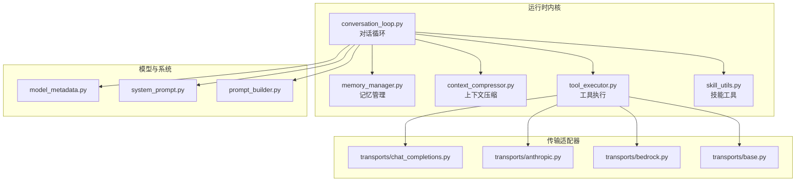
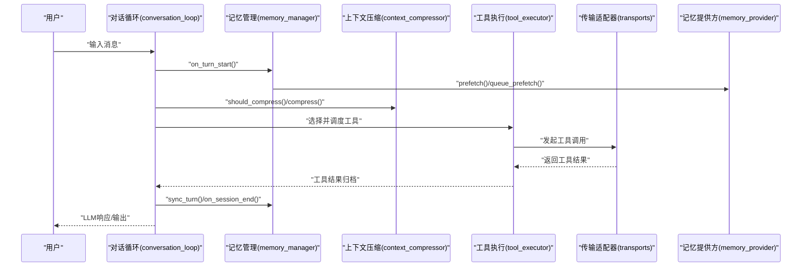
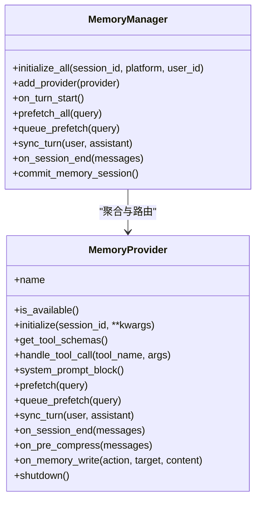
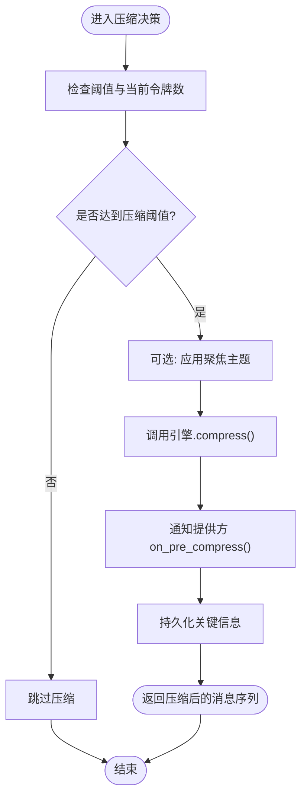
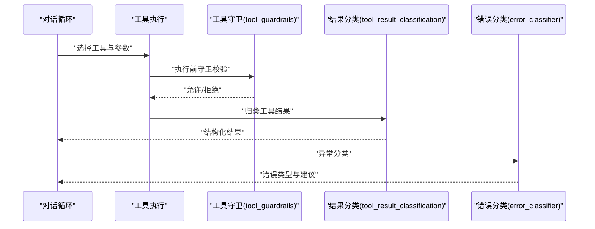
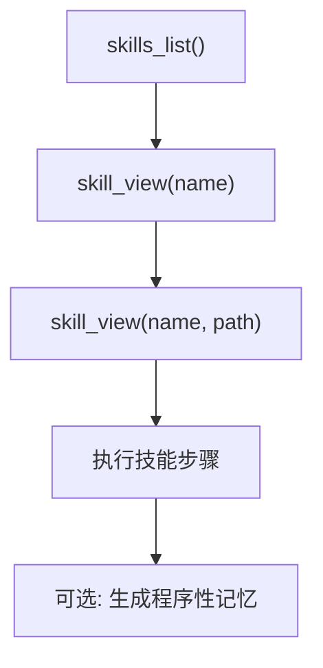
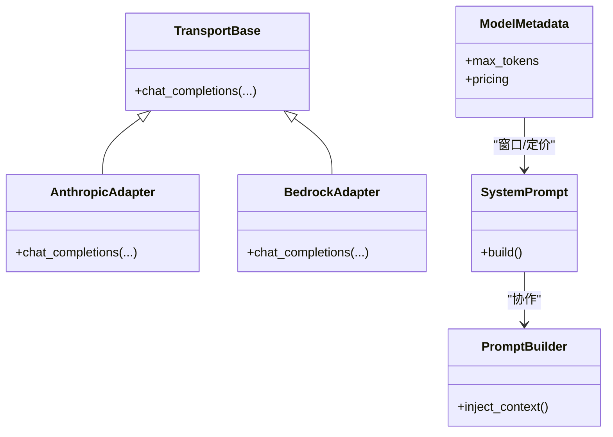
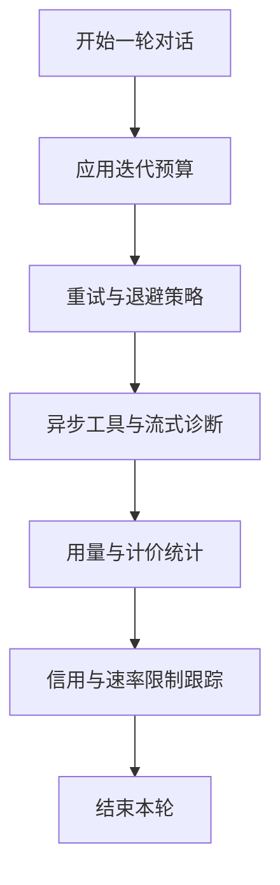
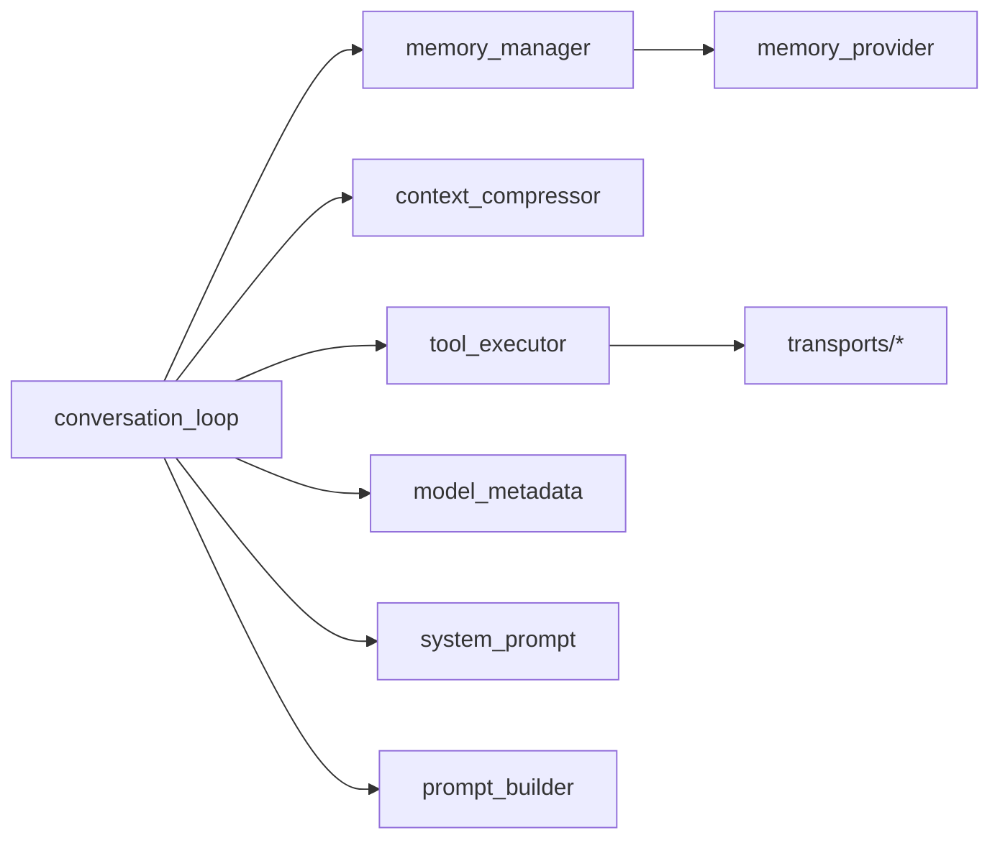

# 核心概念

<cite>
**本文引用的文件**
- [agent/memory_manager.py](file://agent/memory_manager.py)
- [agent/context_compressor.py](file://agent/context_compressor.py)
- [agent/conversation_loop.py](file://agent/conversation_loop.py)
- [agent/tool_executor.py](file://agent/tool_executor.py)
- [agent/skill_utils.py](file://agent/skill_utils.py)
- [agent/memory_provider.py](file://agent/memory_provider.py)
- [agent/context_engine.py](file://agent/context_engine.py)
- [agent/trajectory.py](file://agent/trajectory.py)
- [agent/conversation_compression.py](file://agent/conversation_compression.py)
- [agent/manual_compression_feedback.py](file://agent/manual_compression_feedback.py)
- [agent/system_prompt.py](file://agent/system_prompt.py)
- [agent/prompt_builder.py](file://agent/prompt_builder.py)
- [agent/model_metadata.py](file://agent/model_metadata.py)
- [agent/tool_guardrails.py](file://agent/tool_guardrails.py)
- [agent/tool_dispatch_helpers.py](file://agent/tool_dispatch_helpers.py)
- [agent/tool_result_classification.py](file://agent/tool_result_classification.py)
- [agent/error_classifier.py](file://agent/error_classifier.py)
- [agent/iteration_budget.py](file://agent/iteration_budget.py)
- [agent/credits_tracker.py](file://agent/credits_tracker.py)
- [agent/rate_limit_tracker.py](file://agent/rate_limit_tracker.py)
- [agent/usage_pricing.py](file://agent/usage_pricing.py)
- [agent/account_usage.py](file://agent/account_usage.py)
- [agent/runtime_cwd.py](file://agent/runtime_cwd.py)
- [agent/runtime_cwd.py](file://agent/runtime_cwd.py)
- [agent/async_utils.py](file://agent/async_utils.py)
- [agent/retry_utils.py](file://agent/retry_utils.py)
- [agent/stream_diag.py](file://agent/stream_diag.py)
- [agent/display.py](file://agent/display.py)
- [agent/title_generator.py](file://agent/title_generator.py)
- [agent/think_scrubber.py](file://agent/think_scrubber.py)
- [agent/message_sanitization.py](file://agent/message_sanitization.py)
- [agent/subdirectory_hints.py](file://agent/subdirectory_hints.py)
- [agent/jiter_preload.py](file://agent/jiter_preload.py)
- [agent/lmstudio_reasoning.py](file://agent/lmstudio_reasoning.py)
- [agent/gemini_schema.py](file://agent/gemini_schema.py)
- [agent/moonshot_schema.py](file://agent/moonshot_schema.py)
- [agent/google_code_assist.py](file://agent/google_code_assist.py)
- [agent/anthropic_adapter.py](file://agent/anthropic_adapter.py)
- [agent/azure_identity_adapter.py](file://agent/azure_identity_adapter.py)
- [agent/bedrock_adapter.py](file://agent/bedrock_adapter.py)
- [agent/gemini_native_adapter.py](file://agent/gemini_native_adapter.py)
- [agent/gemini_cloudcode_adapter.py](file://agent/gemini_cloudcode_adapter.py)
- [agent/transports/chat_completions.py](file://agent/transports/chat_completions.py)
- [agent/transports/codex.py](file://agent/transports/codex.py)
- [agent/transports/anthropic.py](file://agent/transports/anthropic.py)
- [agent/transports/bedrock.py](file://agent/transports/bedrock.py)
- [agent/transports/base.py](file://agent/transports/base.py)
- [agent/transports/hermes_tools_mcp_server.py](file://agent/transports/hermes_tools_mcp_server.py)
- [agent/transports/types.py](file://agent/transports/types.py)
- [agent/lsp/client.py](file://agent/lsp/client.py)
- [agent/lsp/manager.py](file://agent/lsp/manager.py)
- [agent/lsp/protocol.py](file://agent/lsp/protocol.py)
- [agent/lsp/workspace.py](file://agent/lsp/workspace.py)
- [agent/lsp/install.py](file://agent/lsp/install.py)
- [agent/lsp/range_shift.py](file://agent/lsp/range_shift.py)
- [agent/lsp/reporter.py](file://agent/lsp/reporter.py)
- [agent/lsp/eventlog.py](file://agent/lsp/eventlog.py)
- [agent/lsp/servers.py](file://agent/lsp/servers.py)
- [agent/lsp/cli.py](file://agent/lsp/cli.py)
- [agent/lsp/protocol.py](file://agent/lsp/protocol.py)
- [agent/lsp/manager.py](file://agent/lsp/manager.py)
- [agent/lsp/client.py](file://agent/lsp/client.py)
- [agent/lsp/workspace.py](file://agent/lsp/workspace.py)
- [agent/lsp/install.py](file://agent/lsp/install.py)
- [agent/lsp/range_shift.py](file://agent/lsp/range_shift.py)
- [agent/lsp/reporter.py](file://agent/lsp/reporter.py)
- [agent/lsp/eventlog.py](file://agent/lsp/eventlog.py)
- [agent/lsp/servers.py](file://agent/lsp/servers.py)
- [agent/lsp/cli.py](file://agent/lsp/cli.py)
- [agent/secret_sources/bitwarden.py](file://agent/secret_sources/bitwarden.py)
- [agent/credential_sources.py](file://agent/credential_sources.py)
- [agent/credential_pool.py](file://agent/credential_pool.py)
- [agent/credential_persistence.py](file://agent/credential_persistence.py)
- [agent/browser_provider.py](file://agent/browser_provider.py)
- [agent/browser_registry.py](file://agent/browser_registry.py)
- [agent/web_search_provider.py](file://agent/web_search_provider.py)
- [agent/web_search_registry.py](file://agent/web_search_registry.py)
- [agent/image_gen_provider.py](file://agent/image_gen_provider.py)
- [agent/image_gen_registry.py](file://agent/image_gen_registry.py)
- [agent/tts_provider.py](file://agent/tts_provider.py)
- [agent/tts_registry.py](file://agent/tts_registry.py)
- [agent/video_gen_provider.py](file://agent/video_gen_provider.py)
- [agent/video_gen_registry.py](file://agent/video_gen_registry.py)
- [agent/transcription_provider.py](file://agent/transcription_provider.py)
- [agent/transcription_registry.py](file://agent/transcription_registry.py)
- [agent/image_routing.py](file://agent/image_routing.py)
- [agent/webhook.py](file://agent/webhook.py)
- [agent/portal_tags.py](file://agent/portal_tags.py)
- [agent/process_bootstrap.py](file://agent/process_bootstrap.py)
- [agent/background_review.py](file://agent/background_review.py)
- [agent/insights.py](file://agent/insights.py)
- [agent/curator.py](file://agent/curator.py)
- [agent/curator_backup.py](file://agent/curator_backup.py)
- [agent/i18n.py](file://agent/i18n.py)
- [agent/trajectory.py](file://agent/trajectory.py)
- [agent/trajectory_compressor.py](file://agent/trajectory_compressor.py)
- [agent/agent_runtime_helpers.py](file://agent/agent_runtime_helpers.py)
- [agent/agent_init.py](file://agent/agent_init.py)
- [agent/auxiliary_client.py](file://agent/auxiliary_client.py)
- [agent/codex_responses_adapter.py](file://agent/codex_responses_adapter.py)
- [agent/codex_runtime.py](file://agent/codex_runtime.py)
- [agent/codex_runtime.py](file://agent/codex_runtime.py)
- [agent/codex_runtime.py](file://agent/codex_runtime.py)
- [agent/codex_runtime.py](file://agent/codex_runtime.py)
- [agent/codex_runtime.py](file://agent/codex_runtime.py)
- [agent/codex_runtime.py](file://agent/codex_runtime.py)
- [agent/codex_runtime.py](file://agent/codex_runtime.py)
- [agent/codex_runtime.py](file://agent/codex_runtime.py)
- [agent/codex_runtime.py](file://agent/codex_runtime.py)
- [agent/codex_runtime.py](file://agent/codex_runtime.py)
- [agent/codex_runtime.py](file://agent/codex_runtime.py)
- [agent/codex_runtime.py](file://agent/codex_runtime.py)
- [agent/codex_runtime.py](file://agent/codex_runtime.py)
- [agent/codex_runtime.py](file://agent/codex_runtime.py)
- [agent/codex_runtime.py](file://agent/codex_runtime.py)
- [agent/codex_runtime.py](file://agent/codex_runtime.py)
- [agent/codex_runtime.py](file://agent/codex_runtime.py)
- [agent/codex_runtime.py](file://agent/codex_runtime.py)
- [agent/codex_runtime.py](file://agent/codex_runtime.py)
- [agent/codex_runtime.py](file://agent/codex_runtime.py)
- [agent/codex_runtime.py](file://agent/codex_runtime.py)
- [agent/codex_runtime.py](file://agent/codex_runtime.py)
- [agent/codex_runtime.py](file://agent/codex_runtime.py)
- [agent/codex_runtime.py](file://agent/codex_runtime.py)
- [agent/codex_runtime.py](file://agent/codex_runtime.py)
- [agent/codex_runtime.py](file://agent/codex_runtime.py)
- [agent/codex_runtime.py](file://agent/codex_runtime.py)
- [agent/codex_runtime.py](file://agent/codex_runtime.py)
- [......]
</cite>

## 目录
1. [引言](#引言)
2. [项目结构](#项目结构)
3. [核心组件](#核心组件)
4. [架构总览](#架构总览)
5. [详细组件分析](#详细组件分析)
6. [依赖分析](#依赖分析)
7. [性能考量](#性能考量)
8. [故障排查指南](#故障排查指南)
9. [结论](#结论)
10. [附录](#附录)

## 引言
本文件面向Hermes Agent的核心概念，系统化阐述AI代理架构、工具系统原理、技能系统设计、记忆管理机制与上下文压缩算法。文档既提供面向初学者的清晰概念解释，也为高级开发者呈现深入的技术洞察与实现细节。内容覆盖控制流、数据流、组件间关系、性能与扩展性设计，并辅以可视化图示与参考路径。

## 项目结构
Hermes Agent采用模块化分层组织：核心运行时位于agent目录，传输适配器与模型提供商位于transports与providers目录，工具与技能位于tools与skills目录，网关与平台集成位于gateway与plugins目录，CLI与脚本位于hermes_cli与scripts目录。整体遵循“运行时内核 + 外部适配器 + 工具/技能生态”的架构风格。

**图表来源**
- [agent/conversation_loop.py](file://agent/conversation_loop.py)
- [agent/memory_manager.py](file://agent/memory_manager.py)
- [agent/context_compressor.py](file://agent/context_compressor.py)
- [agent/tool_executor.py](file://agent/tool_executor.py)
- [agent/skill_utils.py](file://agent/skill_utils.py)
- [agent/transports/chat_completions.py](file://agent/transports/chat_completions.py)
- [agent/transports/anthropic.py](file://agent/transports/anthropic.py)
- [agent/transports/bedrock.py](file://agent/transports/bedrock.py)
- [agent/transports/base.py](file://agent/transports/base.py)
- [agent/model_metadata.py](file://agent/model_metadata.py)
- [agent/system_prompt.py](file://agent/system_prompt.py)
- [agent/prompt_builder.py](file://agent/prompt_builder.py)

**章节来源**
- [agent/conversation_loop.py](file://agent/conversation_loop.py)
- [agent/memory_manager.py](file://agent/memory_manager.py)
- [agent/context_compressor.py](file://agent/context_compressor.py)
- [agent/tool_executor.py](file://agent/tool_executor.py)
- [agent/skill_utils.py](file://agent/skill_utils.py)
- [agent/transports/chat_completions.py](file://agent/transports/chat_completions.py)
- [agent/transports/anthropic.py](file://agent/transports/anthropic.py)
- [agent/transports/bedrock.py](file://agent/transports/bedrock.py)
- [agent/transports/base.py](file://agent/transports/base.py)
- [agent/model_metadata.py](file://agent/model_metadata.py)
- [agent/system_prompt.py](file://agent/system_prompt.py)
- [agent/prompt_builder.py](file://agent/prompt_builder.py)

## 核心组件
- AI代理架构：以对话循环为核心，驱动记忆、上下文压缩、工具执行与技能调度的闭环。
- 工具系统：统一的工具定义、调度、执行与结果分类，支持多传输适配器与守卫规则。
- 技能系统：基于SKILL.md的渐进式披露与条件激活，提供程序性记忆与Hub生态。
- 记忆管理：多提供方聚合、会话生命周期钩子、预取与同步、安全上下文清理。
- 上下文压缩：可插拔的ContextEngine接口，支持阈值触发与聚焦压缩，保障长程对话稳定性。

**章节来源**
- [agent/conversation_loop.py](file://agent/conversation_loop.py)
- [agent/tool_executor.py](file://agent/tool_executor.py)
- [agent/skill_utils.py](file://agent/skill_utils.py)
- [agent/memory_manager.py](file://agent/memory_manager.py)
- [agent/context_engine.py](file://agent/context_engine.py)

## 架构总览
下图展示从用户输入到LLM响应再到工具执行与记忆同步的端到端流程。

**图表来源**
- [agent/conversation_loop.py](file://agent/conversation_loop.py)
- [agent/memory_manager.py](file://agent/memory_manager.py)
- [agent/context_compressor.py](file://agent/context_compressor.py)
- [agent/tool_executor.py](file://agent/tool_executor.py)
- [agent/transports/chat_completions.py](file://agent/transports/chat_completions.py)
- [agent/memory_provider.py](file://agent/memory_provider.py)

## 详细组件分析

### 记忆管理机制
- 生命周期钩子：提供方在初始化、每轮开始、压缩前、会话结束等阶段参与；支持配置声明与持久化。
- 预取与同步：在每次调用前进行上下文召回，回合结束后持久化对话，确保状态一致性。
- 安全上下文：对嵌入的记忆块进行清理，避免污染后续推理。
- 多提供方聚合：统一注入工具Schema，按需路由到不同后端。

**图表来源**
- [agent/memory_manager.py](file://agent/memory_manager.py)
- [agent/memory_provider.py](file://agent/memory_provider.py)

**章节来源**
- [agent/memory_manager.py](file://agent/memory_manager.py)
- [agent/memory_provider.py](file://agent/memory_provider.py)
- [agent/message_sanitization.py](file://agent/message_sanitization.py)

### 上下文压缩算法
- ContextEngine接口：定义名称、令牌统计、压缩触发与压缩实现，支持聚焦主题引导。
- 触发策略：基于阈值与当前令牌数判断是否压缩；支持手动反馈与历史记录。
- 压缩流程：在压缩前通知提供方保存关键信息，在压缩后恢复必要上下文。

**图表来源**
- [agent/context_engine.py](file://agent/context_engine.py)
- [agent/context_compressor.py](file://agent/context_compressor.py)
- [agent/conversation_compression.py](file://agent/conversation_compression.py)
- [agent/manual_compression_feedback.py](file://agent/manual_compression_feedback.py)

**章节来源**
- [agent/context_engine.py](file://agent/context_engine.py)
- [agent/context_compressor.py](file://agent/context_compressor.py)
- [agent/conversation_compression.py](file://agent/conversation_compression.py)
- [agent/manual_compression_feedback.py](file://agent/manual_compression_feedback.py)

### 工具系统原理
- 统一调度：根据工具Schema解析调用，执行前进行守卫校验与结果分类。
- 结果处理：对工具结果进行分类与清洗，决定是否回传给LLM或作为下一步计划依据。
- 错误分类：对异常进行分类，辅助重试与降级策略。

**图表来源**
- [agent/tool_executor.py](file://agent/tool_executor.py)
- [agent/tool_guardrails.py](file://agent/tool_guardrails.py)
- [agent/tool_result_classification.py](file://agent/tool_result_classification.py)
- [agent/error_classifier.py](file://agent/error_classifier.py)

**章节来源**
- [agent/tool_executor.py](file://agent/tool_executor.py)
- [agent/tool_guardrails.py](file://agent/tool_guardrails.py)
- [agent/tool_result_classification.py](file://agent/tool_result_classification.py)
- [agent/error_classifier.py](file://agent/error_classifier.py)

### 技能系统设计
- 渐进式披露：列表级、视图级、文件级三阶段加载，降低token开销。
- 条件激活：基于平台与所需工具集的条件字段，实现智能启用。
- Hub生态：支持在线注册表与本地技能管理，提供创建、修补、编辑、删除与文件增删能力。

**图表来源**
- [agent/skill_utils.py](file://agent/skill_utils.py)

**章节来源**
- [agent/skill_utils.py](file://agent/skill_utils.py)

### 传输适配器与模型元数据
- 适配器抽象：统一ChatCompletion接口，支持Anthropic、Bedrock、自定义等。
- 元数据与提示：模型元数据用于窗口与成本估算，系统提示与提示构建器负责上下文注入。

**图表来源**
- [agent/transports/base.py](file://agent/transports/base.py)
- [agent/transports/anthropic.py](file://agent/transports/anthropic.py)
- [agent/transports/bedrock.py](file://agent/transports/bedrock.py)
- [agent/model_metadata.py](file://agent/model_metadata.py)
- [agent/system_prompt.py](file://agent/system_prompt.py)
- [agent/prompt_builder.py](file://agent/prompt_builder.py)

**章节来源**
- [agent/transports/base.py](file://agent/transports/base.py)
- [agent/transports/anthropic.py](file://agent/transports/anthropic.py)
- [agent/transports/bedrock.py](file://agent/transports/bedrock.py)
- [agent/model_metadata.py](file://agent/model_metadata.py)
- [agent/system_prompt.py](file://agent/system_prompt.py)
- [agent/prompt_builder.py](file://agent/prompt_builder.py)

### 对话循环与预算控制
- 循环控制：单轮内迭代预算、重试策略、异步工具与流式诊断。
- 资源跟踪：信用与速率限制跟踪，结合用量计价与账户用量展示。

**图表来源**
- [agent/conversation_loop.py](file://agent/conversation_loop.py)
- [agent/iteration_budget.py](file://agent/iteration_budget.py)
- [agent/retry_utils.py](file://agent/retry_utils.py)
- [agent/async_utils.py](file://agent/async_utils.py)
- [agent/stream_diag.py](file://agent/stream_diag.py)
- [agent/credits_tracker.py](file://agent/credits_tracker.py)
- [agent/rate_limit_tracker.py](file://agent/rate_limit_tracker.py)
- [agent/usage_pricing.py](file://agent/usage_pricing.py)
- [agent/account_usage.py](file://agent/account_usage.py)

**章节来源**
- [agent/conversation_loop.py](file://agent/conversation_loop.py)
- [agent/iteration_budget.py](file://agent/iteration_budget.py)
- [agent/retry_utils.py](file://agent/retry_utils.py)
- [agent/async_utils.py](file://agent/async_utils.py)
- [agent/stream_diag.py](file://agent/stream_diag.py)
- [agent/credits_tracker.py](file://agent/credits_tracker.py)
- [agent/rate_limit_tracker.py](file://agent/rate_limit_tracker.py)
- [agent/usage_pricing.py](file://agent/usage_pricing.py)
- [agent/account_usage.py](file://agent/account_usage.py)

## 依赖分析
- 组件耦合：对话循环依赖记忆、压缩、工具与传输；工具执行依赖守卫与结果分类；记忆管理依赖提供方接口。
- 外部依赖：模型提供商适配器、浏览器/搜索/图像/TTS/视频/转录等提供方与注册表。
- 循环依赖规避：通过接口抽象与延迟绑定避免强耦合。

**图表来源**
- [agent/conversation_loop.py](file://agent/conversation_loop.py)
- [agent/memory_manager.py](file://agent/memory_manager.py)
- [agent/context_compressor.py](file://agent/context_compressor.py)
- [agent/tool_executor.py](file://agent/tool_executor.py)
- [agent/transports/chat_completions.py](file://agent/transports/chat_completions.py)
- [agent/memory_provider.py](file://agent/memory_provider.py)
- [agent/model_metadata.py](file://agent/model_metadata.py)
- [agent/system_prompt.py](file://agent/system_prompt.py)
- [agent/prompt_builder.py](file://agent/prompt_builder.py)

**章节来源**
- [agent/conversation_loop.py](file://agent/conversation_loop.py)
- [agent/memory_manager.py](file://agent/memory_manager.py)
- [agent/context_compressor.py](file://agent/context_compressor.py)
- [agent/tool_executor.py](file://agent/tool_executor.py)
- [agent/transports/chat_completions.py](file://agent/transports/chat_completions.py)
- [agent/memory_provider.py](file://agent/memory_provider.py)
- [agent/model_metadata.py](file://agent/model_metadata.py)
- [agent/system_prompt.py](file://agent/system_prompt.py)
- [agent/prompt_builder.py](file://agent/prompt_builder.py)

## 性能考量
- Token优化：上下文压缩与渐进式技能加载显著降低token占用；提供方预取与队列预热减少等待。
- 并行与异步：异步工具与流式诊断提升吞吐；重试与退避策略平衡可靠性与延迟。
- 成本与限额：用量计价与信用/速率限制跟踪帮助控制成本与避免限流。
- 缓存与预热：提示缓存、模型元数据缓存与提供方连接池提升启动与调用效率。

[本节为通用性能指导，不直接分析具体文件]

## 故障排查指南
- 工具执行失败：检查工具守卫规则、结果分类与错误分类，确认参数与权限。
- 记忆泄漏：确认会话结束时同时调用记忆管理与上下文引擎的收尾钩子。
- 上下文污染：核查上下文清理逻辑，避免嵌入记忆块影响推理。
- 传输适配器问题：验证适配器初始化、请求体与响应解析。

**章节来源**
- [agent/tool_guardrails.py](file://agent/tool_guardrails.py)
- [agent/tool_result_classification.py](file://agent/tool_result_classification.py)
- [agent/error_classifier.py](file://agent/error_classifier.py)
- [agent/memory_manager.py](file://agent/memory_manager.py)
- [agent/message_sanitization.py](file://agent/message_sanitization.py)
- [agent/transports/chat_completions.py](file://agent/transports/chat_completions.py)

## 结论
Hermes Agent通过模块化的运行时内核、可插拔的传输适配器、渐进式技能与记忆系统，以及可配置的上下文压缩机制，实现了高扩展性与稳健的长程对话能力。理解各组件职责与数据流，有助于在实际部署中进行性能优化与功能扩展。

[本节为总结性内容，不直接分析具体文件]

## 附录
- 运行时辅助：工作目录、JIT预加载、推理模式切换等辅助能力。
- LSP与语言服务：客户端、管理器、协议与工作区集成。
- 凭据与密钥：Bitwarden等密钥源与凭证池管理。
- 媒体与搜索：浏览器、Web搜索、图像/TTS/视频/转录等提供方与注册表。

**章节来源**
- [agent/runtime_cwd.py](file://agent/runtime_cwd.py)
- [agent/jiter_preload.py](file://agent/jiter_preload.py)
- [agent/lmstudio_reasoning.py](file://agent/lmstudio_reasoning.py)
- [agent/lsp/client.py](file://agent/lsp/client.py)
- [agent/lsp/manager.py](file://agent/lsp/manager.py)
- [agent/lsp/protocol.py](file://agent/lsp/protocol.py)
- [agent/lsp/workspace.py](file://agent/lsp/workspace.py)
- [agent/secret_sources/bitwarden.py](file://agent/secret_sources/bitwarden.py)
- [agent/credential_sources.py](file://agent/credential_sources.py)
- [agent/credential_pool.py](file://agent/credential_pool.py)
- [agent/browser_provider.py](file://agent/browser_provider.py)
- [agent/browser_registry.py](file://agent/browser_registry.py)
- [agent/web_search_provider.py](file://agent/web_search_provider.py)
- [agent/web_search_registry.py](file://agent/web_search_registry.py)
- [agent/image_gen_provider.py](file://agent/image_gen_provider.py)
- [agent/image_gen_registry.py](file://agent/image_gen_registry.py)
- [agent/tts_provider.py](file://agent/tts_provider.py)
- [agent/tts_registry.py](file://agent/tts_registry.py)
- [agent/video_gen_provider.py](file://agent/video_gen_provider.py)
- [agent/video_gen_registry.py](file://agent/video_gen_registry.py)
- [agent/transcription_provider.py](file://agent/transcription_provider.py)
- [agent/transcription_registry.py](file://agent/transcription_registry.py)