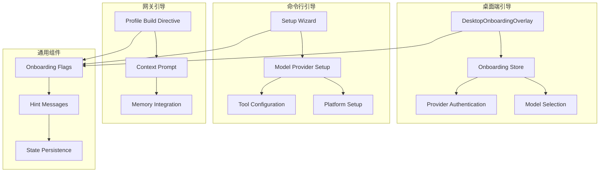
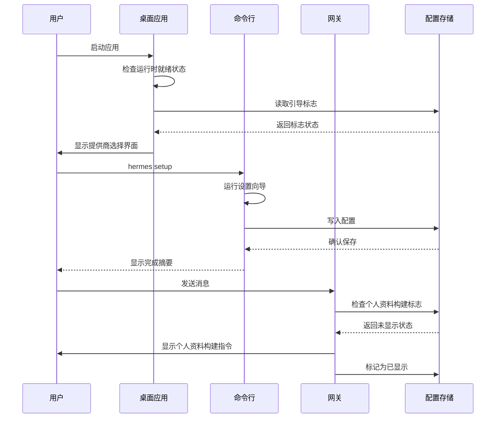
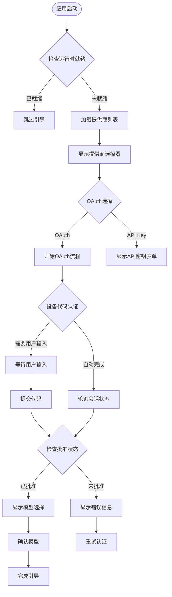
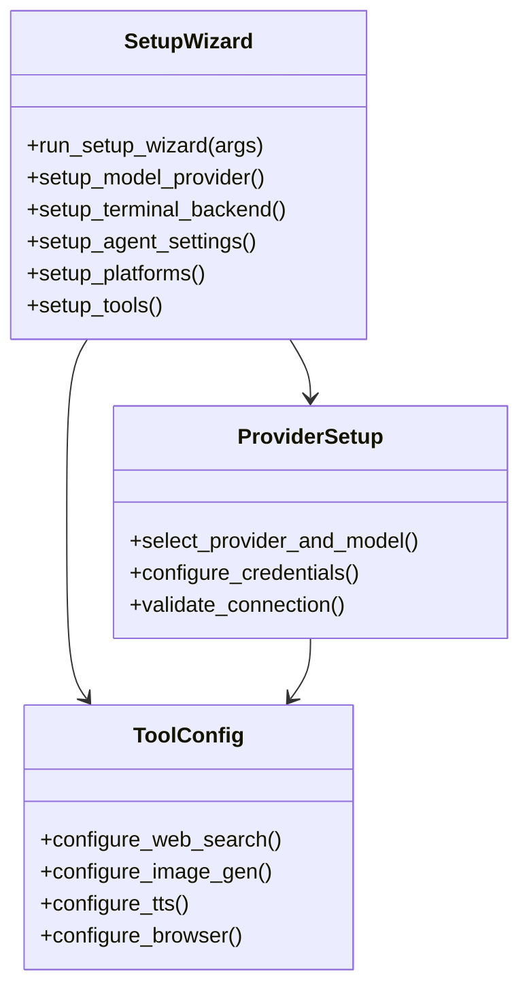
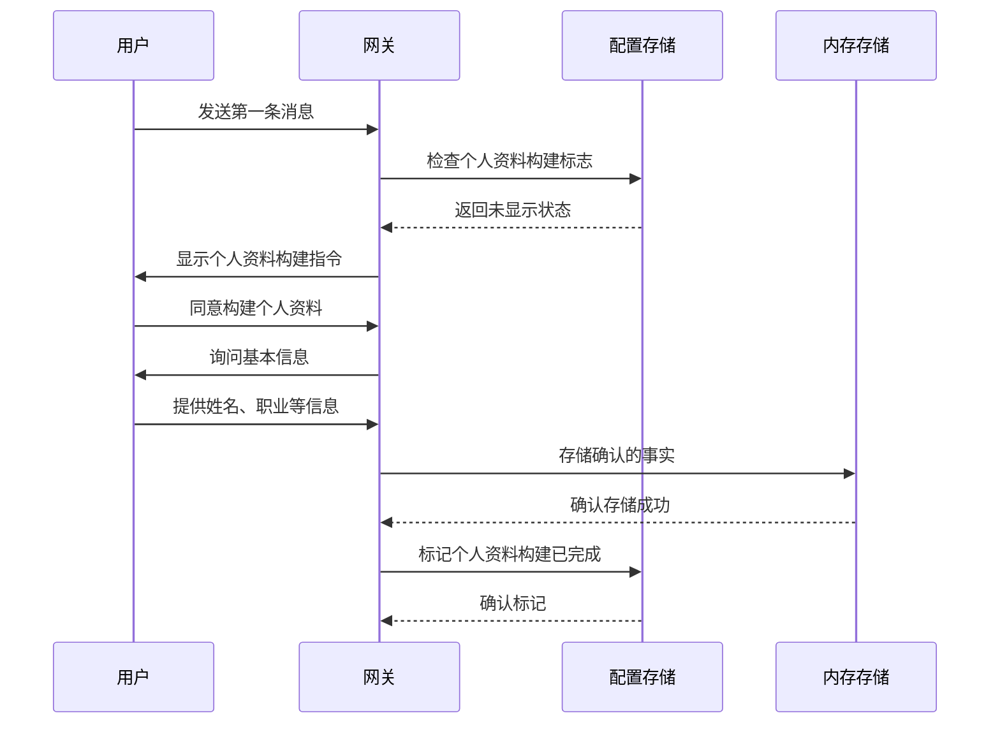
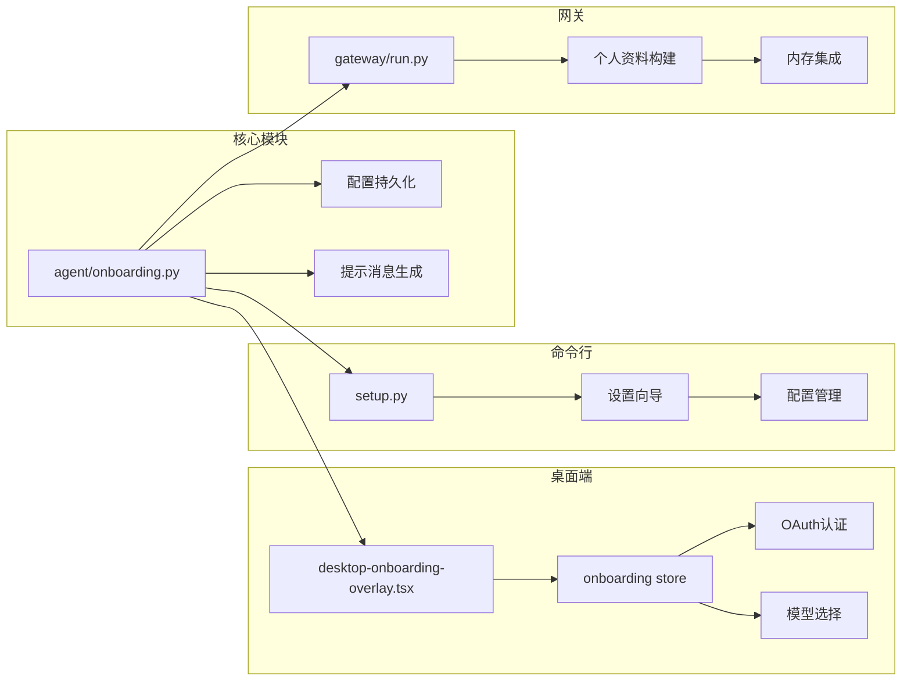

# 用户引导系统

<cite>
**本文档引用的文件**
- [agent/onboarding.py](file://agent/onboarding.py)
- [apps/desktop/src/components/desktop-onboarding-overlay.tsx](file://apps/desktop/src/components/desktop-onboarding-overlay.tsx)
- [apps/desktop/src/store/onboarding.ts](file://apps/desktop/src/store/onboarding.ts)
- [hermes_cli/setup.py](file://hermes_cli/setup.py)
- [tests/agent/test_onboarding.py](file://tests/agent/test_onboarding.py)
- [tests/hermes_cli/test_setup_reconfigure.py](file://tests/hermes_cli/test_setup_reconfigure.py)
- [gateway/run.py](file://gateway/run.py)
- [cli.py](file://cli.py)
- [hermes_cli/tips.py](file://hermes_cli/tips.py)
- [web/src/pages/ChannelsPage.tsx](file://web/src/pages/ChannelsPage.tsx)
</cite>

## 目录
1. [简介](#简介)
2. [项目结构](#项目结构)
3. [核心组件](#核心组件)
4. [架构概览](#架构概览)
5. [详细组件分析](#详细组件分析)
6. [依赖关系分析](#依赖关系分析)
7. [性能考虑](#性能考虑)
8. [故障排除指南](#故障排除指南)
9. [结论](#结论)

## 简介

用户引导系统是 Hermes Agent 中一个精心设计的多层引导机制，旨在为用户提供无缝、非侵入性的首次使用体验。该系统通过"情境化首次接触提示"的方式，在用户遇到特定行为分支时显示一次性提示，而不是传统的阻塞式问卷调查。

系统的核心设计理念包括：
- **非侵入性**：只在用户触发特定行为时显示提示
- **一次性显示**：每个提示在安装范围内只显示一次
- **情境化**：根据用户的实际使用场景提供相关帮助
- **可配置性**：支持用户选择跳过或延迟某些引导步骤

## 项目结构

用户引导系统跨越多个组件层次，形成了完整的引导生态系统：

**图表来源**
- [apps/desktop/src/components/desktop-onboarding-overlay.tsx:194-357](file://apps/desktop/src/components/desktop-onboarding-overlay.tsx#L194-L357)
- [hermes_cli/setup.py:694-750](file://hermes_cli/setup.py#L694-L750)
- [agent/onboarding.py:22-254](file://agent/onboarding.py#L22-L254)

**章节来源**
- [agent/onboarding.py:1-254](file://agent/onboarding.py#L1-L254)
- [apps/desktop/src/components/desktop-onboarding-overlay.tsx:1-800](file://apps/desktop/src/components/desktop-onboarding-overlay.tsx#L1-L800)
- [hermes_cli/setup.py:1-800](file://hermes_cli/setup.py#L1-L800)

## 核心组件

### 情境化提示引擎

系统的核心是 `agent/onboarding.py`，它提供了以下关键功能：

**标志管理**
- `BUSY_INPUT_FLAG`：忙碌输入行为提示
- `TOOL_PROGRESS_FLAG`：工具进度提示  
- `OPENCLAW_RESIDUE_FLAG`：OpenClaw残留检测
- `PROFILE_BUILD_FLAG`：个人资料构建流程

**提示消息生成**
- 支持网关和CLI两种格式的消息
- 基于用户当前状态动态调整内容
- 包含 `/busy` 和 `/verbose` 等实用命令指导

**状态持久化**
- 使用原子YAML写入确保数据安全
- 支持跨进程一致性
- 提供幂等操作避免重复显示

**章节来源**
- [agent/onboarding.py:22-254](file://agent/onboarding.py#L22-L254)
- [tests/agent/test_onboarding.py:1-312](file://tests/agent/test_onboarding.py#L1-L312)

### 桌面端引导界面

桌面应用提供了完整的引导界面，包含：

**认证流程**
- OAuth提供商选择（Nou, OpenAI, Anthropic等）
- API密钥输入表单
- 设备代码认证流程
- 外部命令执行支持

**模型选择**
- 自动默认模型推荐
- 手动模型确认界面
- 工具网关通知

**用户体验优化**
- 平滑的过渡动画效果
- 本地存储缓存机制
- 错误处理和重试逻辑

**章节来源**
- [apps/desktop/src/components/desktop-onboarding-overlay.tsx:431-511](file://apps/desktop/src/components/desktop-onboarding-overlay.tsx#L431-L511)
- [apps/desktop/src/store/onboarding.ts:53-75](file://apps/desktop/src/store/onboarding.ts#L53-L75)

### 命令行设置向导

`hermes_cli/setup.py` 提供了交互式的设置向导：

**模块化设计**
- 推理提供者配置
- 终端后端设置
- 代理设置
- 消息平台连接
- 工具配置

**智能检测**
- 自动检测可用的工具和功能
- 提供缺失依赖的安装指导
- 支持快速设置和完整设置模式

**章节来源**
- [hermes_cli/setup.py:694-750](file://hermes_cli/setup.py#L694-L750)
- [tests/hermes_cli/test_setup_reconfigure.py:1-224](file://tests/hermes_cli/test_setup_reconfigure.py#L1-L224)

## 架构概览

用户引导系统采用分层架构，确保各组件间的松耦合和高内聚：

**图表来源**
- [apps/desktop/src/store/onboarding.ts:471-504](file://apps/desktop/src/store/onboarding.ts#L471-L504)
- [hermes_cli/setup.py:2907-2948](file://hermes_cli/setup.py#L2907-L2948)
- [gateway/run.py:9461-9478](file://gateway/run.py#L9461-L9478)

## 详细组件分析

### 桌面端引导流程

桌面端引导系统提供了最完整的用户体验：

**图表来源**
- [apps/desktop/src/components/desktop-onboarding-overlay.tsx:782-867](file://apps/desktop/src/components/desktop-onboarding-overlay.tsx#L782-L867)
- [apps/desktop/src/store/onboarding.ts:526-627](file://apps/desktop/src/store/onboarding.ts#L526-L627)

#### 认证流程实现

系统支持多种认证方式：

**OAuth认证流程**
- PKCE流：适用于大多数现代提供商
- 设备代码流：适用于无法直接访问浏览器的环境
- 循环回流：适用于本地后端监听的场景

**API密钥认证**
- 支持多种提供商的API密钥
- 自定义端点配置
- 本地模型端点验证

**章节来源**
- [apps/desktop/src/store/onboarding.ts:25-51](file://apps/desktop/src/store/onboarding.ts#L25-L51)
- [apps/desktop/src/store/onboarding.ts:526-627](file://apps/desktop/src/store/onboarding.ts#L526-L627)

### 命令行设置向导

命令行向导提供了灵活的配置选项：

**图表来源**
- [hermes_cli/setup.py:694-750](file://hermes_cli/setup.py#L694-L750)
- [hermes_cli/setup.py:2907-2948](file://hermes_cli/setup.py#L2907-L2948)

#### 智能检测机制

向导能够智能检测系统状态：

**依赖检测**
- 自动检测可用的终端后端
- 检测已安装的工具和插件
- 验证外部服务的可达性

**配置建议**
- 基于检测结果提供建议
- 自动填充合理的默认值
- 提供缺失组件的安装指导

**章节来源**
- [hermes_cli/setup.py:356-580](file://hermes_cli/setup.py#L356-L580)

### 网关引导集成

网关作为用户与系统交互的入口，集成了个人资料构建功能：

**图表来源**
- [gateway/run.py:9461-9478](file://gateway/run.py#L9461-L9478)
- [agent/onboarding.py:157-183](file://agent/onboarding.py#L157-L183)

#### 个人资料构建流程

系统提供了隐私友好的个人资料构建：

**同意驱动**
- 必须明确同意才能进行
- 每个外部查询都需要单独同意
- 不会静默读取连接的账户信息

**知识存储**
- 使用用户个人资料内存存储
- 保持条目简洁且高信号
- 支持后续编辑和更新

**章节来源**
- [agent/onboarding.py:134-183](file://agent/onboarding.py#L134-L183)

## 依赖关系分析

用户引导系统展现了良好的模块化设计：

**图表来源**
- [agent/onboarding.py:190-236](file://agent/onboarding.py#L190-L236)
- [apps/desktop/src/store/onboarding.ts:178-183](file://apps/desktop/src/store/onboarding.ts#L178-L183)

### 耦合度分析

系统采用了松耦合的设计原则：

**低耦合优势**
- 各组件可以独立开发和测试
- 支持渐进式功能添加
- 便于维护和扩展

**接口契约**
- 统一的配置访问接口
- 标准化的状态管理
- 明确的错误处理机制

**章节来源**
- [agent/onboarding.py:190-236](file://agent/onboarding.py#L190-L236)
- [apps/desktop/src/store/onboarding.ts:163-167](file://apps/desktop/src/store/onboarding.ts#L163-L167)

## 性能考虑

用户引导系统在性能方面采取了多项优化措施：

### 内存优化
- 使用原子YAML写入避免部分写入
- 缓存提供商列表减少网络请求
- 智能的轮询间隔控制

### 网络效率
- 批量加载提供商信息
- 条件性API调用
- 连接池复用

### 用户体验优化
- 平滑的过渡动画
- 即时反馈机制
- 错误恢复策略

## 故障排除指南

### 常见问题及解决方案

**桌面端引导问题**
- OAuth认证失败：检查网络连接和提供商状态
- API密钥验证错误：确认密钥格式正确
- 模型选择失败：验证提供商连接

**命令行设置问题**
- 设置向导卡住：检查TTY可用性和权限
- 配置保存失败：确认文件系统权限
- 工具检测错误：检查依赖安装状态

**网关引导问题**
- 个人资料构建不生效：检查内存存储权限
- 提示消息重复显示：清理配置文件中的标志
- 模型选择异常：重新配置提供商

**章节来源**
- [apps/desktop/src/store/onboarding.ts:564-589](file://apps/desktop/src/store/onboarding.ts#L564-L589)
- [hermes_cli/setup.py:176-193](file://hermes_cli/setup.py#L176-L193)

## 结论

用户引导系统展现了现代软件引导的最佳实践：

**设计亮点**
- 情境化提示避免了传统问卷的侵入性
- 多层次引导适应不同用户需求
- 智能检测减少了手动配置工作
- 隐私友好的个人资料构建流程

**技术优势**
- 模块化架构便于维护和扩展
- 统一的状态管理确保一致性
- 完善的错误处理提升稳定性
- 良好的性能优化保证流畅体验

**未来发展方向**
- 更智能的个性化引导
- 增强的上下文感知能力
- 更丰富的学习资源集成
- 改进的用户反馈收集机制

该系统为用户提供了从初次接触到深度使用的完整引导路径，是Hermes Agent用户体验的重要组成部分。