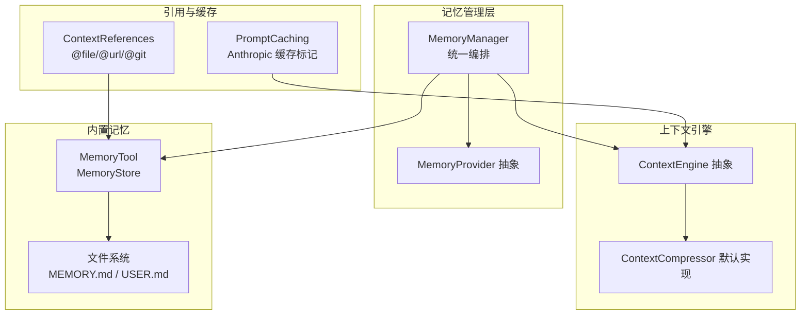
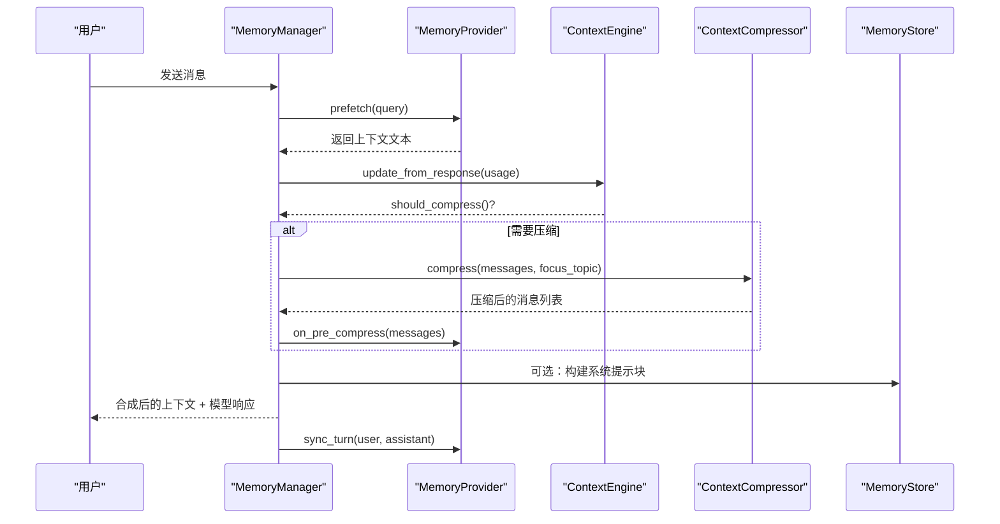
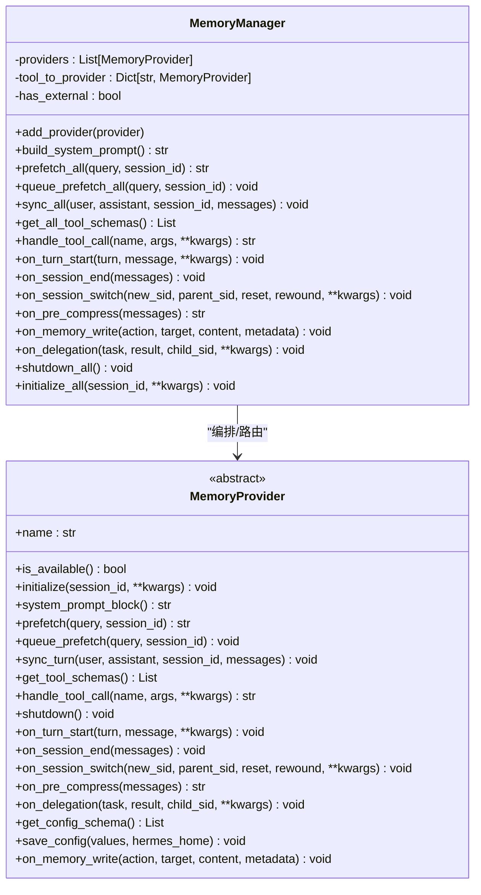
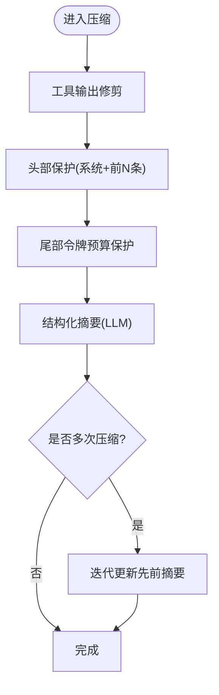
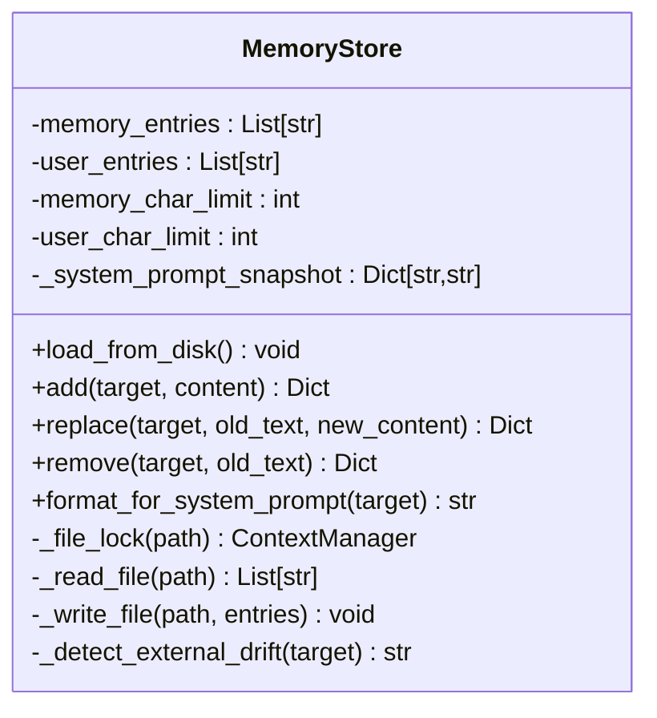
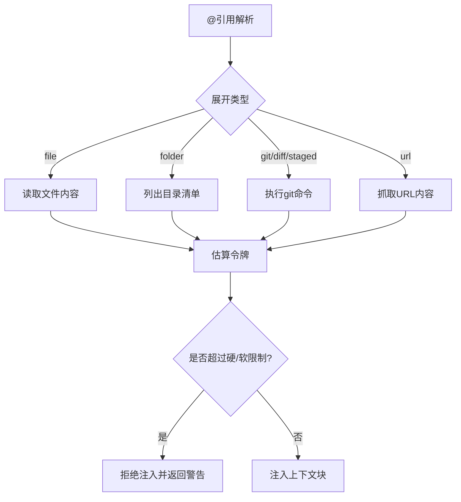
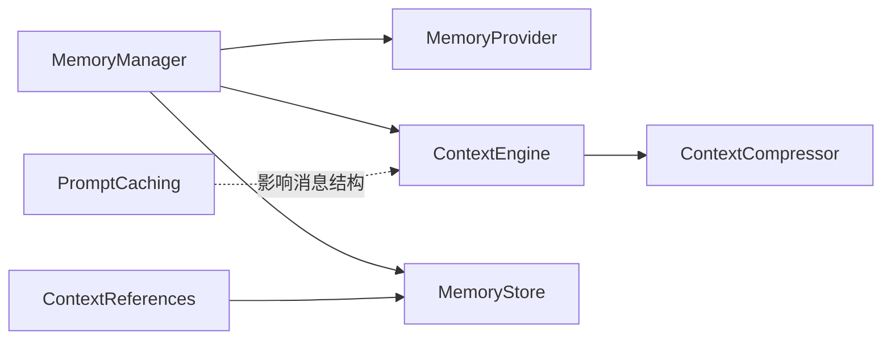

# 记忆管理机制

<cite>
**本文档引用的文件**
- [memory_manager.py](file://agent/memory_manager.py)
- [memory_provider.py](file://agent/memory_provider.py)
- [context_engine.py](file://agent/context_engine.py)
- [context_compressor.py](file://agent/context_compressor.py)
- [conversation_compression.py](file://agent/conversation_compression.py)
- [context_references.py](file://agent/context_references.py)
- [memory_tool.py](file://tools/memory_tool.py)
- [prompt_caching.py](file://agent/prompt_caching.py)
</cite>

## 目录
1. [简介](#简介)
2. [项目结构](#项目结构)
3. [核心组件](#核心组件)
4. [架构总览](#架构总览)
5. [详细组件分析](#详细组件分析)
6. [依赖关系分析](#依赖关系分析)
7. [性能考量](#性能考量)
8. [故障排查指南](#故障排查指南)
9. [结论](#结论)
10. [附录](#附录)

## 简介
本文件系统性阐述 Hermes Agent 的记忆管理机制，覆盖记忆存储架构、上下文引擎设计与引用管理策略，详解记忆持久化、检索优化与缓存机制，并给出记忆压缩算法、令牌管理与性能调优方法。文档同时提供配置与使用示例（以路径引用形式呈现），帮助开发者在不直接阅读源码的情况下完成集成与调优。

## 项目结构
围绕记忆管理的关键模块分布如下：
- 记忆管理层：统一编排内置与外部记忆提供者，负责系统提示注入、预取与同步、工具路由与生命周期事件通知。
- 上下文引擎：抽象接口定义压缩策略与令牌统计，内置默认压缩器实现。
- 记忆工具：内置文件型持久化存储（MEMORY.md、USER.md），支持原子写入、并发锁与威胁扫描。
- 引用注入：解析并安全地将文件、Git 差异、URL 内容等上下文注入到会话中，受令牌预算约束。
- 提示缓存：针对特定供应商的提示缓存控制标记注入，降低重复输入开销。

**图表来源**
- [memory_manager.py:244-654](file://agent/memory_manager.py#L244-L654)
- [memory_provider.py:42-297](file://agent/memory_provider.py#L42-L297)
- [context_engine.py:32-227](file://agent/context_engine.py#L32-L227)
- [context_compressor.py:522-800](file://agent/context_compressor.py#L522-L800)
- [memory_tool.py:113-724](file://tools/memory_tool.py#L113-L724)
- [context_references.py:62-203](file://agent/context_references.py#L62-L203)
- [prompt_caching.py:49-80](file://agent/prompt_caching.py#L49-L80)

**章节来源**
- [memory_manager.py:1-654](file://agent/memory_manager.py#L1-L654)
- [memory_provider.py:1-297](file://agent/memory_provider.py#L1-L297)
- [context_engine.py:1-227](file://agent/context_engine.py#L1-L227)
- [context_compressor.py:1-800](file://agent/context_compressor.py#L1-L800)
- [memory_tool.py:1-724](file://tools/memory_tool.py#L1-L724)
- [context_references.py:1-519](file://agent/context_references.py#L1-L519)
- [prompt_caching.py:1-80](file://agent/prompt_caching.py#L1-L80)

## 核心组件
- MemoryManager：集中式记忆编排器，负责注册提供者、构建系统提示、预取与同步、工具分发、生命周期事件广播与外部提供者写入镜像。
- MemoryProvider：记忆提供者抽象，定义可用性检查、初始化、系统提示块、预取、后台队列预取、回合同步、工具模式与可选钩子（回合开始、会话结束、会话切换、压缩前提取、委托观察、内存写入镜像）。
- ContextEngine：上下文引擎抽象，定义令牌状态、阈值参数、响应更新、是否压缩判断、压缩执行、会话生命周期钩子与工具模式。
- ContextCompressor：内置压缩器，默认实现，包含工具输出修剪、尾部保护、结构化摘要模板、迭代更新、失败冷却与回退策略。
- MemoryStore：内置文件型记忆存储，支持原子写入、并发锁、威胁扫描、快照注入系统提示、字符限制与去重。
- ContextReferences：上下文引用解析与注入，支持文件、文件夹、Git 差异/日志、URL，受硬软阈值限制，避免过度注入。
- PromptCaching：提示缓存标记注入，针对 Anthropic 的缓存控制断点策略，减少重复输入成本。

**章节来源**
- [memory_manager.py:244-654](file://agent/memory_manager.py#L244-L654)
- [memory_provider.py:42-297](file://agent/memory_provider.py#L42-L297)
- [context_engine.py:32-227](file://agent/context_engine.py#L32-L227)
- [context_compressor.py:522-800](file://agent/context_compressor.py#L522-L800)
- [memory_tool.py:113-724](file://tools/memory_tool.py#L113-L724)
- [context_references.py:62-203](file://agent/context_references.py#L62-L203)
- [prompt_caching.py:49-80](file://agent/prompt_caching.py#L49-L80)

## 架构总览
记忆管理由“提供者层 + 引擎层 + 存储层 + 注入层”构成，通过 MemoryManager 协调，形成“预取—生成—同步—压缩”的闭环。

**图表来源**
- [memory_manager.py:339-412](file://agent/memory_manager.py#L339-L412)
- [context_engine.py:70-106](file://agent/context_engine.py#L70-L106)
- [context_compressor.py:728-748](file://agent/context_compressor.py#L728-L748)
- [memory_tool.py:443-454](file://tools/memory_tool.py#L443-L454)

## 详细组件分析

### MemoryManager 组件分析
- 职责边界
  - 仅允许一个外部提供者，防止工具模式冲突；内置提供者始终优先。
  - 统一系统提示构建、预取合并、回合同步、工具路由与生命周期事件广播。
- 关键流程
  - 预取：按顺序调用各提供者的 prefetch，拼接非空结果。
  - 同步：根据提供者签名兼容性选择带或不带 messages 的 sync_turn。
  - 工具：基于工具名路由至对应提供者，处理冲突与错误。
  - 生命周期：turn 开始、会话结束、会话切换（含压缩触发）、压缩前提取、委托观察、内存写入镜像。
- 安全与健壮性
  - 提供者异常不影响其他提供者；对内置提供者写入镜像时跳过自身。
  - 流式上下文清洗器确保跨块边界的安全输出。

**图表来源**
- [memory_manager.py:244-654](file://agent/memory_manager.py#L244-L654)
- [memory_provider.py:42-297](file://agent/memory_provider.py#L42-L297)

**章节来源**
- [memory_manager.py:244-654](file://agent/memory_manager.py#L244-L654)
- [memory_provider.py:42-297](file://agent/memory_provider.py#L42-L297)

### ContextEngine 与 ContextCompressor 组件分析
- ContextEngine
  - 定义令牌状态字段（上次提示/补全/总计、阈值、上下文长度、压缩次数）。
  - 提供阈值百分比、头尾保护数量等参数，支持预检压缩、手动预检与模型切换更新。
- ContextCompressor（内置）
  - 算法步骤：工具输出修剪 → 头部保护 → 尾部令牌预算保护 → 结构化摘要 → 迭代更新。
  - 配置项：阈值百分比、头保护数、尾保护数、摘要目标比例、摘要模型覆盖、静默模式、摘要失败中止策略。
  - 容错：摘要失败冷却、确定性回退、辅助模型失败恢复提示、无效压缩反抖动保护。
  - 令牌估算：结合模型上下文长度与比例计算阈值与摘要预算，支持实时使用量更新与延迟预检策略。

**图表来源**
- [context_engine.py:64-106](file://agent/context_engine.py#L64-L106)
- [context_compressor.py:522-748](file://agent/context_compressor.py#L522-L748)

**章节来源**
- [context_engine.py:32-227](file://agent/context_engine.py#L32-L227)
- [context_compressor.py:522-800](file://agent/context_compressor.py#L522-L800)

### 内置记忆存储（MemoryStore）分析
- 文件布局
  - MEMORY.md：个人笔记与观察（环境事实、项目约定、工具特性、经验教训）。
  - USER.md：用户画像（姓名、角色、偏好、沟通风格、习惯）。
- 设计要点
  - 冻结快照：系统提示注入时使用加载时刻的冻结快照，保持前缀缓存稳定。
  - 实时状态：工具响应反映实时内存列表，便于用户查看与修正。
  - 字符限制：独立的字符上限，采用“段落分隔符”连接，避免令牌依赖。
  - 原子写入：临时文件 + 原子替换，避免截断与竞态。
  - 并发安全：独立锁文件实现互斥写入。
  - 威胁扫描：严格范围扫描，发现后在快照中替换为占位符，保留原始内容供用户删除。
  - 外部漂移检测：若磁盘内容无法与工具格式往返一致或单条超限，拒绝写入并备份 .bak.* 文件。

**图表来源**
- [memory_tool.py:113-724](file://tools/memory_tool.py#L113-L724)

**章节来源**
- [memory_tool.py:113-724](file://tools/memory_tool.py#L113-L724)

### 上下文引用注入（ContextReferences）分析
- 解析规则
  - 支持 @file、@folder、@git、@diff、@staged、@url 等语法，自动识别行号范围与包裹引号。
- 安全与限制
  - 限制敏感路径与凭证文件，禁止二进制文件直接注入。
  - 硬限制（50%）与软限制（25%）的令牌预算，超过硬限制直接拒绝注入。
- 扩展与警告
  - 对于 @url 自动抓取并进行令牌估算；对 @git 使用本地命令执行差异/日志。
  - 注入后附加警告与上下文块，便于用户理解与审计。

**图表来源**
- [context_references.py:62-203](file://agent/context_references.py#L62-L203)

**章节来源**
- [context_references.py:62-519](file://agent/context_references.py#L62-L519)

### 提示缓存（PromptCaching）分析
- 策略
  - 采用“system_and_3”布局：系统提示 + 最近三条非系统消息，统一 TTL（5 分钟或 1 小时）。
- 实现
  - 为消息或其最后一段文本添加 cache_control 断点，适配不同内容形态与原生供应商格式。
- 效果
  - 显著降低多轮对话的输入令牌成本，提升吞吐与降低成本。

**章节来源**
- [prompt_caching.py:49-80](file://agent/prompt_caching.py#L49-L80)

## 依赖关系分析
- MemoryManager 依赖 MemoryProvider 接口，聚合多个提供者并屏蔽异常。
- ContextEngine 与 ContextCompressor 之间存在继承与组合关系，后者实现前者抽象。
- MemoryStore 与文件系统交互，通过原子替换与锁文件保障一致性。
- ContextReferences 与 MemoryStore 在“系统提示注入”场景协同工作（引用注入与冻结快照）。
- PromptCaching 与 ContextEngine 解耦，仅影响消息结构，不改变压缩逻辑。

**图表来源**
- [memory_manager.py:244-654](file://agent/memory_manager.py#L244-L654)
- [context_engine.py:32-227](file://agent/context_engine.py#L32-L227)
- [context_compressor.py:522-800](file://agent/context_compressor.py#L522-L800)
- [memory_tool.py:113-724](file://tools/memory_tool.py#L113-L724)
- [context_references.py:62-203](file://agent/context_references.py#L62-L203)
- [prompt_caching.py:49-80](file://agent/prompt_caching.py#L49-L80)

**章节来源**
- [memory_manager.py:244-654](file://agent/memory_manager.py#L244-L654)
- [context_engine.py:32-227](file://agent/context_engine.py#L32-L227)
- [context_compressor.py:522-800](file://agent/context_compressor.py#L522-L800)
- [memory_tool.py:113-724](file://tools/memory_tool.py#L113-L724)
- [context_references.py:62-203](file://agent/context_references.py#L62-L203)
- [prompt_caching.py:49-80](file://agent/prompt_caching.py#L49-L80)

## 性能考量
- 令牌预算与阈值
  - 基于模型上下文长度与阈值百分比动态计算压缩阈值；摘要预算按压缩窗口比例分配，避免一次性摘要过大。
- 反抖动保护
  - 若连续两次压缩节省不足 10%，跳过压缩以避免无限循环与低效。
- 预检与延迟策略
  - 高估 schema 导致的预检可能噪声较大时，延迟至真实使用量反馈后再决定是否压缩。
- 原子写入与锁
  - 写入采用原子替换与锁文件，避免截断与竞态，降低 IO 失败概率。
- 缓存控制
  - 提示缓存断点策略显著降低重复输入成本，适合长会话与多轮对话。

**章节来源**
- [context_engine.py:64-126](file://agent/context_engine.py#L64-L126)
- [context_compressor.py:684-748](file://agent/context_compressor.py#L684-L748)
- [prompt_caching.py:49-80](file://agent/prompt_caching.py#L49-L80)
- [memory_tool.py:570-600](file://tools/memory_tool.py#L570-L600)

## 故障排查指南
- 压缩失败与回退
  - 摘要失败时启用冷却与确定性回退，必要时中止压缩并提示用户手动重试或新建会话。
  - 辅助压缩模型失败会回退主模型并发出警告，提示检查配置。
- 并发压缩冲突
  - 通过会话级数据库锁避免并发压缩导致的会话树分裂；若未获取锁则跳过并提示。
- 外部漂移与写入拒绝
  - 当磁盘内容无法往返一致或单条内容超限，拒绝写入并生成 .bak.* 备份，指导用户修复后重试。
- 引用注入被拒
  - 超过硬限制（50%）直接拒绝；超过软限制（25%）发出警告但继续注入。

**章节来源**
- [conversation_compression.py:428-465](file://agent/conversation_compression.py#L428-L465)
- [memory_tool.py:515-568](file://tools/memory_tool.py#L515-L568)
- [context_references.py:167-186](file://agent/context_references.py#L167-L186)

## 结论
Hermes Agent 的记忆管理以 MemoryManager 为核心，结合 MemoryProvider 抽象与内置 MemoryStore，实现了“可插拔 + 持久化 + 安全”的记忆体系；通过 ContextEngine/ContextCompressor 提供稳健的上下文压缩与令牌管理；ContextReferences 与 PromptCaching 则分别强化了上下文注入与输入成本控制。整体设计兼顾可扩展性与数据一致性，适用于复杂长会话场景。

## 附录

### 配置与使用示例（以路径引用代替具体代码）
- 配置记忆提供者
  - 在配置中选择 memory.provider 指定外部提供者名称，确保仅启用一个外部提供者。
  - 示例参考：[memory_manager.py:258-302](file://agent/memory_manager.py#L258-L302)
- 查询历史记录与构建系统提示
  - 使用 MemoryManager.build_system_prompt() 获取所有提供者的静态提示块。
  - 使用 MemoryManager.prefetch_all(query) 获取预取上下文。
  - 示例参考：[memory_manager.py:318-356](file://agent/memory_manager.py#L318-L356)
- 管理上下文大小与压缩
  - 通过 ContextEngine 的阈值参数与 ContextCompressor 的摘要比例、尾部预算控制压缩强度。
  - 示例参考：[context_engine.py:64-66](file://agent/context_engine.py#L64-L66)、[context_compressor.py:584-636](file://agent/context_compressor.py#L584-L636)
- 内置记忆工具（添加/替换/删除）
  - 使用 memory(action=..., target=..., content=..., old_text=...) 完成增删改查。
  - 示例参考：[memory_tool.py:602-640](file://tools/memory_tool.py#L602-L640)
- 引用注入（@file/@url/@git）
  - 在消息中使用 @file、@folder、@git、@diff、@staged、@url，系统自动解析并注入上下文。
  - 示例参考：[context_references.py:105-203](file://agent/context_references.py#L105-L203)
- 提示缓存（Anthropic）
  - 为消息注入 cache_control 断点，减少重复输入成本。
  - 示例参考：[prompt_caching.py:49-79](file://agent/prompt_caching.py#L49-L79)