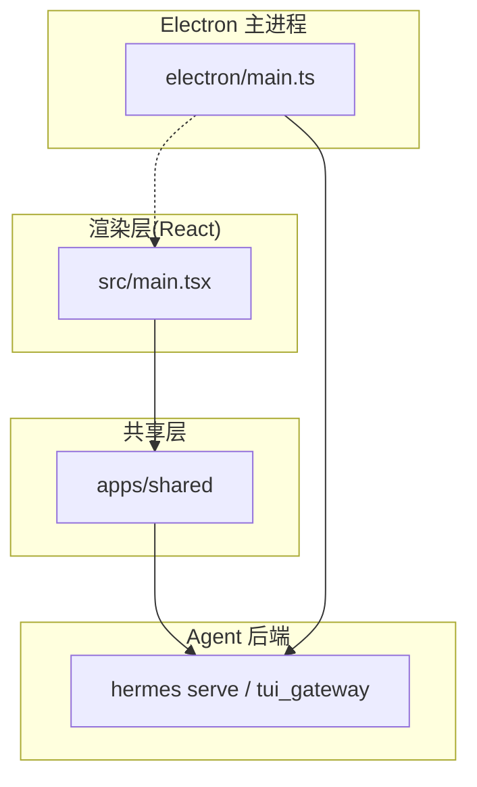
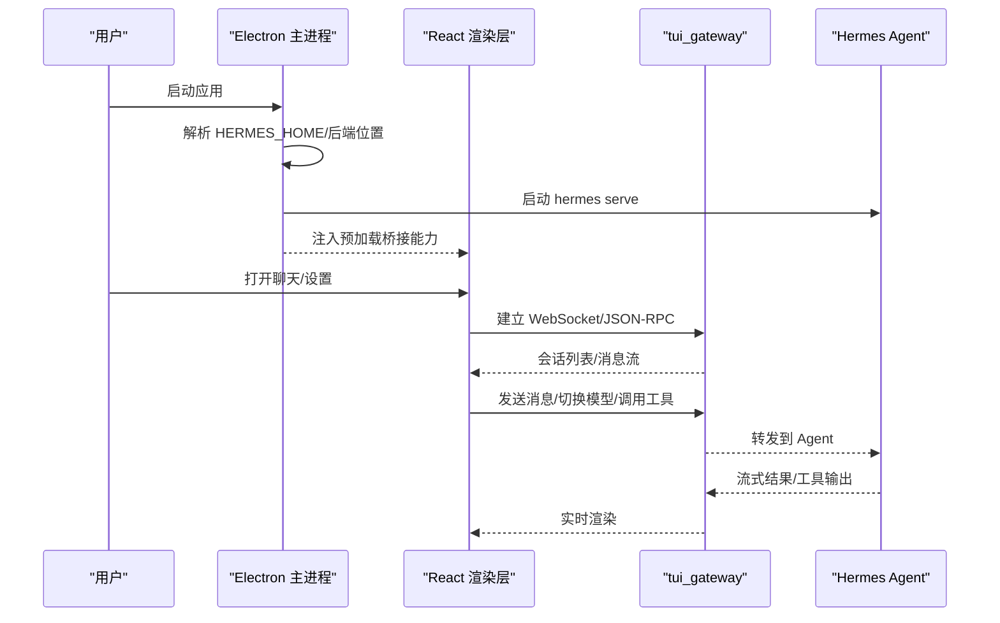
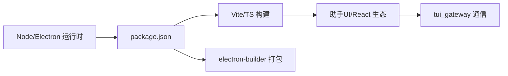

# 桌面应用

<cite>
**本文引用的文件**
- [apps/desktop/README.md](file://apps/desktop/README.md)
- [apps/desktop/package.json](file://apps/desktop/package.json)
- [apps/desktop/electron/main.ts](file://apps/desktop/electron/main.ts)
- [apps/desktop/src/main.tsx](file://apps/desktop/src/main.tsx)
- [apps/desktop/AGENTS.md](file://apps/desktop/AGENTS.md)
</cite>

## 目录
1. [简介](#简介)
2. [项目结构](#项目结构)
3. [核心组件](#核心组件)
4. [架构总览](#架构总览)
5. [详细组件分析](#详细组件分析)
6. [依赖分析](#依赖分析)
7. [性能考虑](#性能考虑)
8. [故障排除指南](#故障排除指南)
9. [结论](#结论)
10. [附录](#附录)

## 简介
Hermes 桌面应用是基于 Electron 的本地客户端，提供与 CLI 和网关一致的 Agent、技能与记忆能力，但拥有更友好的原生窗口体验：流式对话、工具输出预览、文件浏览器、语音输入与设置面板。支持 macOS、Windows、Linux，内置更新机制，首次启动可自动安装或连接现有 Hermes 运行时。

## 项目结构
桌面端由三层组成：
- Electron 主进程：负责系统能力（文件系统、Git、窗口）、后端解析与生命周期管理、安全加固、平台策略。
- React 渲染层：路由、面板、交互状态、会话转录与预览。
- Hermes Agent 后端：以无头 hermes serve 运行，通过 tui_gateway JSON-RPC/WebSocket 暴露能力；渲染器通过 apps/shared 与之通信。

图表来源
- [apps/desktop/electron/main.ts:1-250](file://apps/desktop/electron/main.ts#L1-L250)
- [apps/desktop/src/main.tsx:1-83](file://apps/desktop/src/main.tsx#L1-L83)

章节来源
- [apps/desktop/README.md:88-123](file://apps/desktop/README.md#L88-L123)
- [apps/desktop/package.json:1-65](file://apps/desktop/package.json#L1-L65)

## 核心组件
- 后端发现与启动：按优先级链查找可用后端（环境变量、源码检出、托管安装、PATH、系统 Python、首次引导安装），并处理旧版兼容路径。
- 连接与会话：支持本地、远程网关与云端连接；首次运行可先连接已有网关再安装本地运行时；保存加密的连接配置。
- 窗口与主题：原生窗口控制、透明度、标题栏主题同步、最小化时保持渲染优先级。
- 更新与打包：后台检查更新、一键升级；跨平台安装包构建与签名。
- 安全与健壮性：WSL/远程显示优化、Windows GPU 沙箱回退、日志轮转与磁盘保护。

章节来源
- [apps/desktop/README.md:23-49](file://apps/desktop/README.md#L23-L49)
- [apps/desktop/electron/main.ts:252-327](file://apps/desktop/electron/main.ts#L252-L327)
- [apps/desktop/electron/main.ts:430-449](file://apps/desktop/electron/main.ts#L430-L449)
- [apps/desktop/electron/main.ts:525-628](file://apps/desktop/electron/main.ts#L525-L628)

## 架构总览
桌面应用遵循“职责分离”的设计：Electron 管机器与运行时，渲染层管体验与交互，Agent 后端管会话、模型调用与工具执行。三者通过窄接口协作，避免越界。

图表来源
- [apps/desktop/electron/main.ts:34-52](file://apps/desktop/electron/main.ts#L34-L52)
- [apps/desktop/electron/main.ts:525-628](file://apps/desktop/electron/main.ts#L525-L628)
- [apps/desktop/src/main.tsx:16-83](file://apps/desktop/src/main.tsx#L16-L83)

章节来源
- [apps/desktop/AGENTS.md:11-25](file://apps/desktop/AGENTS.md#L11-L25)
- [apps/desktop/README.md:88-123](file://apps/desktop/README.md#L88-L123)

## 详细组件分析

### 安装与系统要求
- 推荐方式：使用已安装的 Hermes CLI 直接启动桌面端，复用同一份配置、密钥、会话与技能。
- 预安装包：从官网下载对应平台的安装包。
- 系统要求：安装程序会自动处理 Python、Git、ripgrep 等依赖。

章节来源
- [apps/desktop/README.md:23-54](file://apps/desktop/README.md#L23-L54)

### 首次运行与连接模式
- 若未检测到可用本地后端或已保存的远程连接，首次运行会优先引导连接现有 Hermes 网关，再进行本地安装。
- 连接测试需同时验证 HTTP 与 WebSocket，并通过加密存储保存连接信息。
- 远程模式下，执行边界在远端网关侧，工具、终端命令与文件操作均在远端主机上执行。

章节来源
- [apps/desktop/README.md:131-149](file://apps/desktop/README.md#L131-L149)

### 会话管理与工作区
- 项目是工作区抽象，可绑定多个文件夹/仓库/工作树与多会话；新建聊天默认独立，除非进入项目或设置默认目录。
- 切换连接/模式为软重定位：保留外壳与当前管理覆盖层，仅清理网关相关数据并重建视图，防止上下文泄漏。
- 会话身份区分稳定标识与运行时标识，避免历史丢失与“找不到会话”。

章节来源
- [apps/desktop/README.md:149-159](file://apps/desktop/README.md#L149-L159)
- [apps/desktop/AGENTS.md:48-56](file://apps/desktop/AGENTS.md#L48-L56)
- [apps/desktop/AGENTS.md:79-101](file://apps/desktop/AGENTS.md#L79-L101)

### 模型切换与工具配置
- 模型切换与工具配置在设置面板中完成；桌面端与 CLI/Gateway 共享同一套配置与凭据。
- 工具能力由 Session 的客户端属性决定，而非后端环境变量，确保远程/云端场景下行为一致。

章节来源
- [apps/desktop/README.md:10-18](file://apps/desktop/README.md#L10-L18)
- [apps/desktop/AGENTS.md:156-162](file://apps/desktop/AGENTS.md#L156-L162)

### 界面布局与交互
- 左侧导航/会话列表，中间聊天流，右侧预览窗格（网页、文件、工具输出）。
- 支持语音输入与播放、文件浏览、键盘快捷键与焦点管理。
- 渲染层基于 React + Assistant UI，统一 Tooltip 提供者，减少无关重渲染。

章节来源
- [apps/desktop/README.md:10-18](file://apps/desktop/README.md#L10-L18)
- [apps/desktop/src/main.tsx:51-76](file://apps/desktop/src/main.tsx#L51-L76)

### 更新机制
- 后台检测更新并提供一键升级；也可通过 CLI 触发更新。
- 更新过程包含版本标记、重新构建与重启流程，支持远程与本地模式。

章节来源
- [apps/desktop/README.md:41-48](file://apps/desktop/README.md#L41-L48)
- [apps/desktop/electron/main.ts:189-208](file://apps/desktop/electron/main.ts#L189-L208)

### 与 CLI 版本的同步与数据共享
- 桌面端与 CLI 共享同一 HERMES_HOME 布局与安装产物，保证配置、会话、技能一致。
- 首次引导将 Agent 运行时安装至 HERMES_HOME，后续启动复用该环境。

章节来源
- [apps/desktop/README.md:88-117](file://apps/desktop/README.md#L88-L117)
- [apps/desktop/electron/main.ts:525-590](file://apps/desktop/electron/main.ts#L525-L590)

## 依赖分析
- 运行时依赖：Node.js（引擎版本要求）、Electron、Vite、React、Assistant UI、Xterm、Shiki、Mermaid 等。
- 构建与打包：electron-builder、TypeScript、Vitest、Playwright（E2E）。
- 协议与集成：注册 hermes 协议；通过 apps/shared 与 tui_gateway 通信。

图表来源
- [apps/desktop/package.json:1-65](file://apps/desktop/package.json#L1-L65)
- [apps/desktop/package.json:163-274](file://apps/desktop/package.json#L163-L274)

章节来源
- [apps/desktop/package.json:10-12](file://apps/desktop/package.json#L10-L12)
- [apps/desktop/package.json:163-274](file://apps/desktop/package.json#L163-L274)

## 性能考虑
- 背景节流：仅在活跃对话期间解除渲染器后台节流，空闲时恢复默认节流，降低 CPU 占用。
- 远程显示优化：检测到 SSH/VNC/RDP 等远程显示时禁用 GPU 加速，避免闪烁与卡顿。
- Windows 沙箱回退：GPU 子进程崩溃时自动以 no-sandbox 重启一次，提升稳定性。
- 日志轮转：限制 desktop.log 大小与备份数量，防止磁盘耗尽导致更新/安装失败。
- 渲染优化：统一 Tooltip 提供者、关闭路由过渡以避免高负载下的卡顿。

章节来源
- [apps/desktop/electron/main.ts:275-327](file://apps/desktop/electron/main.ts#L275-L327)
- [apps/desktop/electron/main.ts:430-449](file://apps/desktop/electron/main.ts#L430-L449)
- [apps/desktop/electron/main.ts:625-648](file://apps/desktop/electron/main.ts#L625-L648)
- [apps/desktop/src/main.tsx:51-76](file://apps/desktop/src/main.tsx#L51-L76)

## 故障排除指南
- 启动失败：查看 HERMES_HOME/logs/desktop.log，包含后端输出与最近 Python 回溯。
- 重置首次引导：删除引导完成标记，强制重新走首次安装流程。
- 修复 Python venv：删除并重建虚拟环境。
- macOS 麦克风权限问题：重置麦克风授权后重试。
- Windows 路径与环境：确认 LOCALAPPDATA\hermes 或自定义 HERMES_HOME；必要时以管理员权限修复 ACL。

章节来源
- [apps/desktop/README.md:176-200](file://apps/desktop/README.md#L176-L200)

## 结论
Hermes 桌面应用将强大的 Agent 能力封装为直观的原生界面，兼顾易用性与工程严谨性。通过清晰的职责划分、稳健的后端发现与连接机制、完善的更新与排障流程，以及针对多平台的性能优化，为用户提供了高效、稳定的桌面端使用体验。建议结合 CLI 与 Gateway 协同工作，充分利用项目与工作区能力，获得最佳实践效果。

## 附录

### 快速上手清单
- 安装：通过 CLI 启动或下载安装包。
- 首次运行：选择连接现有网关或安装本地运行时并完成提供商与模型配置。
- 日常使用：在聊天面板发送消息，右侧预览工具输出与文件，使用语音与文件浏览器。
- 设置：在设置面板管理提供商、模型、工具与凭据。
- 更新：后台提示或 CLI 触发更新。

章节来源
- [apps/desktop/README.md:23-49](file://apps/desktop/README.md#L23-L49)
- [apps/desktop/README.md:10-18](file://apps/desktop/README.md#L10-L18)