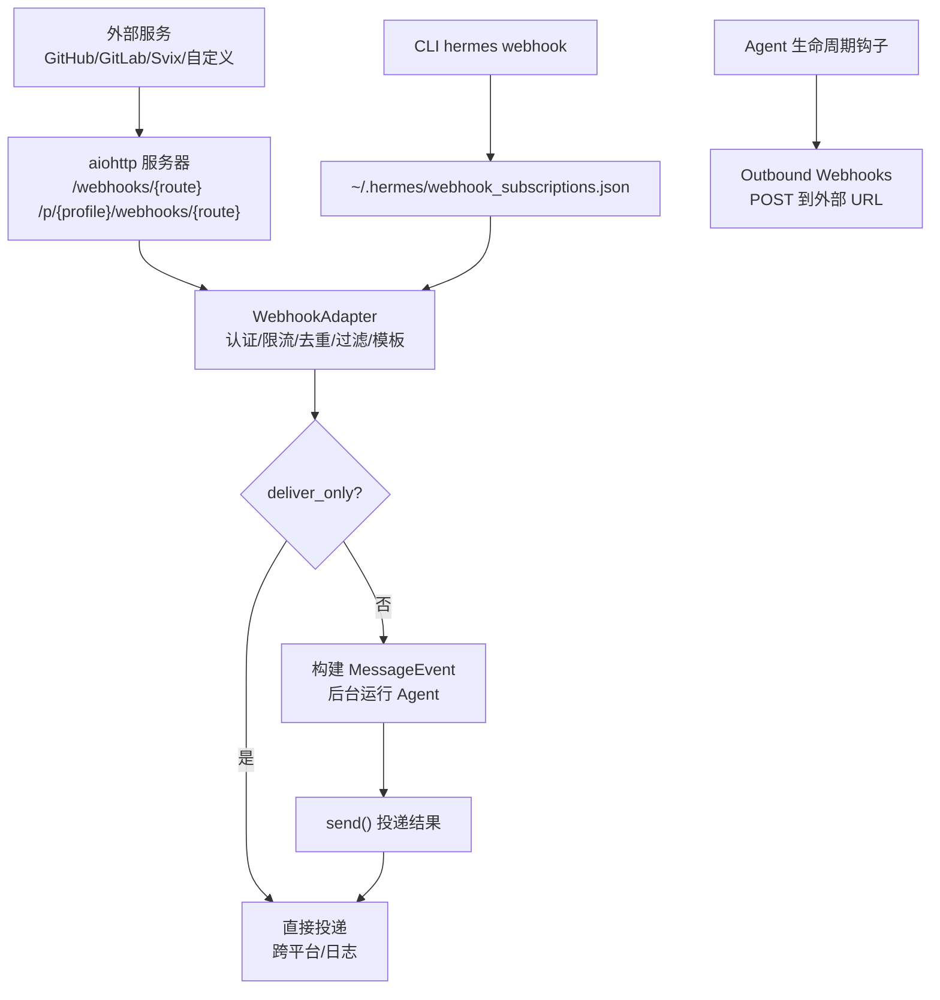
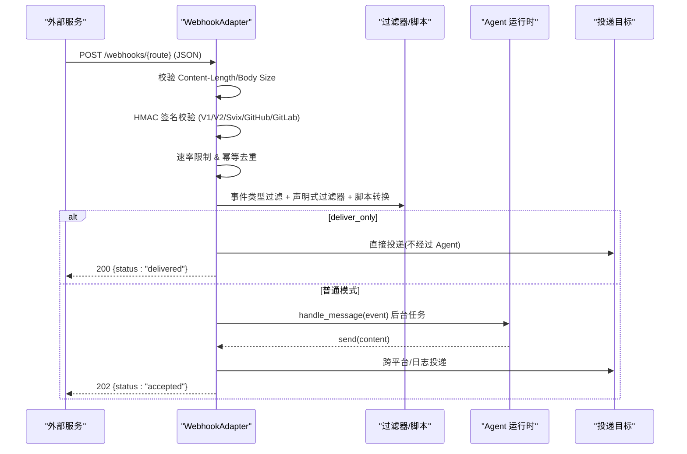
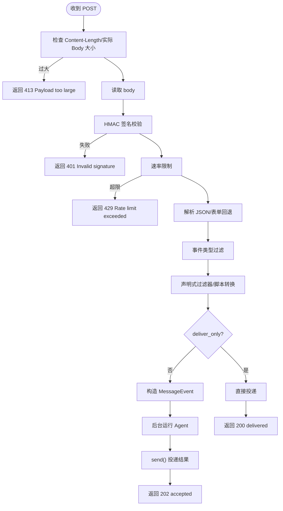
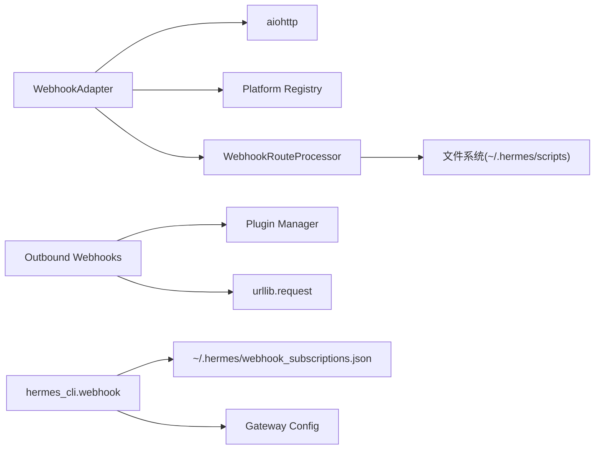

# Webhook 支持

<cite>
**本文引用的文件**   
- [gateway/platforms/webhook.py](file://gateway/platforms/webhook.py)
- [gateway/platforms/webhook_filters.py](file://gateway/platforms/webhook_filters.py)
- [agent/outbound_webhooks.py](file://agent/outbound_webhooks.py)
- [hermes_cli/webhook.py](file://hermes_cli/webhook.py)
</cite>

## 目录
1. [简介](#简介)
2. [项目结构](#项目结构)
3. [核心组件](#核心组件)
4. [架构总览](#架构总览)
5. [详细组件分析](#详细组件分析)
6. [依赖关系分析](#依赖关系分析)
7. [性能与容量规划](#性能与容量规划)
8. [故障排除指南](#故障排除指南)
9. [结论](#结论)
10. [附录：配置与示例](#附录：配置与示例)

## 简介
本系统提供完整的 Webhook 支持，包括：
- 接收外部服务（GitHub、GitLab、Svix/AgentMail 等）的 HTTP POST 事件
- 请求验证与签名校验（GitHub/GitLab/Svix/通用 HMAC V1/V2），并内置防重放机制
- 内容过滤、格式转换与路由规则（声明式过滤器 + 可选脚本转换）
- 将事件转换为 Agent 提示或直投消息（deliver_only 模式）
- 跨平台投递（Telegram、Discord、Slack、GitHub Comment 等）
- 出站 Webhook（Hermes 主动通知外部系统），带签名与重试
- CLI 动态订阅管理（热加载，无需重启网关）

## 项目结构
Webhook 能力由以下模块协作实现：
- 入站 Webhook 适配器：监听 HTTP 端口，处理认证、过滤、模板渲染、异步执行与投递
- 过滤器与脚本处理器：对事件进行条件过滤与内容转换
- 出站 Webhook：在 Agent 生命周期中向外部 URL 发送签名事件
- CLI：创建、列出、删除、测试动态订阅

图表来源
- [gateway/platforms/webhook.py:248-344](file://gateway/platforms/webhook.py#L248-L344)
- [gateway/platforms/webhook.py:584-934](file://gateway/platforms/webhook.py#L584-L934)
- [hermes_cli/webhook.py:140-159](file://hermes_cli/webhook.py#L140-L159)
- [agent/outbound_webhooks.py:156-207](file://agent/outbound_webhooks.py#L156-L207)

章节来源
- [gateway/platforms/webhook.py:1-344](file://gateway/platforms/webhook.py#L1-L344)
- [hermes_cli/webhook.py:1-159](file://hermes_cli/webhook.py#L1-L159)
- [agent/outbound_webhooks.py:1-207](file://agent/outbound_webhooks.py#L1-L207)

## 核心组件
- WebhookAdapter：HTTP 入口、安全校验、速率限制、幂等缓存、事件过滤、模板渲染、异步执行与投递
- WebhookRouteProcessor：声明式过滤器（all/any/not/exists/equals/contains/in/in_file/regex）与脚本转换（bash/python）
- Outbound Webhooks：基于队列+单线程 worker 的出站通知，支持 HMAC-SHA256 签名、超时与重试
- CLI Webhook：动态订阅 CRUD、自动生成密钥、测试请求

章节来源
- [gateway/platforms/webhook.py:177-344](file://gateway/platforms/webhook.py#L177-L344)
- [gateway/platforms/webhook_filters.py:94-303](file://gateway/platforms/webhook_filters.py#L94-L303)
- [agent/outbound_webhooks.py:112-207](file://agent/outbound_webhooks.py#L112-L207)
- [hermes_cli/webhook.py:140-308](file://hermes_cli/webhook.py#L140-L308)

## 架构总览
Webhook 系统分为“入站”和“出站”两条通道。入站通过 aiohttp 暴露 RESTful 接口；出站通过插件钩子在 Agent 生命周期内触发。

图表来源
- [gateway/platforms/webhook.py:584-934](file://gateway/platforms/webhook.py#L584-L934)
- [gateway/platforms/webhook.py:1028-1191](file://gateway/platforms/webhook.py#L1028-L1191)
- [gateway/platforms/webhook_filters.py:208-303](file://gateway/platforms/webhook_filters.py#L208-L303)

## 详细组件分析

### 入站 Webhook 适配器（WebhookAdapter）
职责
- 启动 aiohttp 服务，注册健康检查与路由
- 每请求热加载动态订阅（~/.hermes/webhook_subscriptions.json）
- 认证与安全：HMAC 签名校验（GitHub/GitLab/Svix/通用 V1/V2）、大小限制、速率限制、幂等去重
- 事件过滤：按事件头/负载字段过滤，支持声明式过滤器与脚本转换
- 模板渲染：将负载注入 prompt/deliver_extra
- 执行模型：非阻塞返回 202，后台运行 Agent；deliver_only 跳过 Agent 直接投递
- 会话清理：完成后关闭会话，避免状态库膨胀

关键流程（请求处理）

图表来源
- [gateway/platforms/webhook.py:584-934](file://gateway/platforms/webhook.py#L584-L934)

章节来源
- [gateway/platforms/webhook.py:248-344](file://gateway/platforms/webhook.py#L248-L344)
- [gateway/platforms/webhook.py:584-934](file://gateway/platforms/webhook.py#L584-L934)
- [gateway/platforms/webhook.py:936-1023](file://gateway/platforms/webhook.py#L936-L1023)

### 签名校验与防重放
支持的协议与头部
- Svix/AgentMail：svix-id、svix-timestamp、svix-signature（支持多签名用于密钥轮换）
- GitHub：X-Hub-Signature-256 = sha256=<hex>
- GitLab：X-Gitlab-Token 明文比对
- 通用 V2：X-Webhook-Signature-V2 + X-Webhook-Timestamp（绑定时间戳，防重放窗口 300 秒）
- 通用 V1（遗留）：X-Webhook-Signature（仅 body，无时间戳，存在重放风险，会记录警告）

防重放要点
- V2 必须携带有效时间戳，且与当前时间差不超过阈值
- Svix 同样校验时间戳
- 若检测到 V2 头但缺少时间戳，拒绝且不降级到 V1，防止攻击者剥离时间戳后回落到 V1

章节来源
- [gateway/platforms/webhook.py:1028-1191](file://gateway/platforms/webhook.py#L1028-L1191)

### 过滤器系统与脚本转换
能力
- 声明式过滤器：all/any/not/exists/missing/equals/not_equals/contains/in/in_file/regex
- 上下文解析：payload、event_type、headers 的 dotted 路径访问
- 脚本转换：支持 bash/python，输入为 JSON，输出 JSON 文本或 [SILENT]；可设置超时；输出会被敏感信息脱敏

典型用法
- 按事件类型、仓库名、作者邮箱等字段过滤
- 使用 in_file 从文件加载白名单/黑名单
- 用脚本对 payload 做清洗、合并、裁剪，再进入后续流程

章节来源
- [gateway/platforms/webhook_filters.py:21-92](file://gateway/platforms/webhook_filters.py#L21-L92)
- [gateway/platforms/webhook_filters.py:104-226](file://gateway/platforms/webhook_filters.py#L104-L226)
- [gateway/platforms/webhook_filters.py:228-303](file://gateway/platforms/webhook_filters.py#L228-L303)

### 模板渲染与投递
模板渲染
- 支持点号路径访问嵌套字段，如 {pull_request.title}
- 特殊占位符 {__raw__} 输出完整 JSON（截断）
- deliver_extra 中的字符串值也会被渲染

投递目标
- log：仅记录日志
- github_comment：调用 gh CLI 发布 PR/Issue 评论（严格参数校验）
- 其他平台：通过 gateway runner 的跨平台适配器（telegram、discord、slack、signal、sms、whatsapp、matrix、mattermost、homeassistant、email、dingtalk、feishu、wecom、weixin、bluebubbles、qqbot、yuanbao）

章节来源
- [gateway/platforms/webhook.py:1197-1249](file://gateway/platforms/webhook.py#L1197-L1249)
- [gateway/platforms/webhook.py:1255-1413](file://gateway/platforms/webhook.py#L1255-L1413)

### 出站 Webhook（Outbound Webhooks）
功能
- 从 Agent 生命周期钩子（如 on_session_end、pre/post_tool_call）推送事件到外部 URL
- 载荷包含事件名、工具名、会话 ID、工作目录、额外字段、delivery_id、时间戳
- 可选 HMAC-SHA256 签名（X-Hermes-Signature-256）
- 队列+单线程 worker 投递，最多重试 2 次，指数退避
- 禁止跟随 3xx 重定向，避免签名体丢失

配置要点
- hooks.outbound 列表，每项包含 url、events、secret_env/secret、matcher（工具级匹配）、timeout、name
- 支持 HERMES_SAFE_MODE=1 跳过注册

章节来源
- [agent/outbound_webhooks.py:1-65](file://agent/outbound_webhooks.py#L1-L65)
- [agent/outbound_webhooks.py:156-207](file://agent/outbound_webhooks.py#L156-L207)
- [agent/outbound_webhooks.py:250-355](file://agent/outbound_webhooks.py#L250-L355)
- [agent/outbound_webhooks.py:380-570](file://agent/outbound_webhooks.py#L380-L570)

### CLI 动态订阅管理
命令
- hermes webhook subscribe <name> [选项]
- hermes webhook list
- hermes webhook remove <name>
- hermes webhook test <name> [--payload ...]

特性
- 动态订阅文件：~/.hermes/webhook_subscriptions.json，权限 0600，原子写入
- 自动生成长度安全的 secret
- 支持 events、prompt、skills、deliver、deliver_only、deliver_chat_id、script
- 热加载：网关每次请求都会检查文件变更并合并静态/动态路由

章节来源
- [hermes_cli/webhook.py:1-308](file://hermes_cli/webhook.py#L1-L308)

## 依赖关系分析
- WebhookAdapter 依赖 aiohttp 提供 HTTP 服务，依赖 gateway 基础适配器和平台注册表进行跨平台投递
- WebhookRouteProcessor 负责过滤器与脚本执行，脚本路径受限于 ~/.hermes/scripts
- Outbound Webhooks 使用标准库 urllib 发起 POST，并通过插件管理器注册回调
- CLI 读写动态订阅文件，并与网关配置联动

图表来源
- [gateway/platforms/webhook.py:47-67](file://gateway/platforms/webhook.py#L47-L67)
- [gateway/platforms/webhook_filters.py:49-71](file://gateway/platforms/webhook_filters.py#L49-L71)
- [agent/outbound_webhooks.py:182-207](file://agent/outbound_webhooks.py#L182-L207)
- [hermes_cli/webhook.py:40-81](file://hermes_cli/webhook.py#L40-L81)

章节来源
- [gateway/platforms/webhook.py:47-67](file://gateway/platforms/webhook.py#L47-L67)
- [gateway/platforms/webhook_filters.py:49-71](file://gateway/platforms/webhook_filters.py#L49-L71)
- [agent/outbound_webhooks.py:182-207](file://agent/outbound_webhooks.py#L182-L207)
- [hermes_cli/webhook.py:40-81](file://hermes_cli/webhook.py#L40-L81)

## 性能与容量规划
- 请求处理为非阻塞：立即返回 202，后台执行 Agent；deliver_only 直接投递，零 LLM 成本
- 速率限制：固定窗口（默认每分钟 30 次），可按 route 调整
- 幂等去重：基于 delivery_id 的 TTL 缓存（默认 1 小时），避免重复执行
- 内存控制：delivery_info 与 seen_deliveries 定期清理，避免无限增长
- 脚本执行：独立进程+超时保护，避免阻塞事件循环
- 网络：出站 Webhook 有最大重试次数与超时，避免长时间挂起

建议
- 在高并发场景下，适当提高 rate_limit 与 idempotency TTL，并监控队列长度
- 使用 deliver_only 模式承载高频告警/心跳类事件，降低 LLM 开销
- 合理设置 script_timeout_seconds，避免慢脚本拖垮吞吐

[本节为通用指导，不直接分析具体文件]

## 故障排除指南
常见问题与定位
- 401 无效签名：确认使用的签名协议与头部是否正确；优先使用 V2 或 Svix；检查 secret 是否一致
- 413 负载过大：检查 Content-Length 与实际 body；必要时调大 max_body_bytes
- 429 速率限制：提高 rate_limit 或优化上游发送频率
- 404 未知路由/未授权 profile：确认路由名称与 profile 绑定；确保 multiplex_profiles 开启时 profile 已配置
- 投递失败：deliver_only 模式下检查 deliver 目标与 deliver_extra；github_comment 需安装 gh CLI 且 repo/pr_number 合法
- 动态订阅未生效：确认 webhook_subscriptions.json 权限与内容；查看网关日志中的热加载提示

调试技巧
- 使用 hermes webhook test 发送测试请求，观察响应与日志
- 启用更详细的日志级别，关注 “[webhook]” 前缀日志
- 对于脚本转换，检查脚本返回值与 stdout 是否为合法 JSON 或 [SILENT]

章节来源
- [gateway/platforms/webhook.py:584-934](file://gateway/platforms/webhook.py#L584-L934)
- [gateway/platforms/webhook.py:1028-1191](file://gateway/platforms/webhook.py#L1028-L1191)
- [hermes_cli/webhook.py:267-308](file://hermes_cli/webhook.py#L267-L308)

## 结论
本 Webhook 支持系统提供了企业级的入站/出站事件处理能力：
- 强安全：多协议签名校验、防重放、速率限制、幂等去重、最小权限绑定
- 高灵活：声明式过滤器、脚本转换、模板渲染、多投递目标
- 高性能：非阻塞处理、deliver_only 直达、资源回收与内存控制
- 易运维：CLI 动态管理、热加载、完善的错误码与日志

生产部署建议
- 始终启用 HMAC 签名，优先使用 V2 或 Svix；禁用 INSECURE_NO_AUTH 在非本地环境
- 将 webhook 服务置于反向代理之后，限制源 IP 与 TLS 终止
- 合理配置 rate_limit、max_body_bytes、script_timeout_seconds
- 使用 deliver_only 承载高频低价值事件，减少 LLM 成本
- 定期审计 webhook_subscriptions.json 权限与内容

[本节为总结性内容，不直接分析具体文件]

## 附录：配置与示例
- 入站路由配置（config.yaml 中 platforms.webhook.extra.routes）
  - 关键字段：events、secret、prompt、skills、deliver、deliver_extra、deliver_only、filters、script、enabled、profile
- 动态订阅（CLI）
  - hermes webhook subscribe <name> --events "push,pull_request" --secret "<your-secret>" --prompt "处理事件 {event_type}" --deliver telegram --deliver-chat-id "<chat_id>"
  - hermes webhook list/remove/test
- 出站 Webhook（config.yaml 中 hooks.outbound）
  - url、events、secret_env/secret、matcher、timeout、name

章节来源
- [gateway/platforms/webhook.py:1-31](file://gateway/platforms/webhook.py#L1-L31)
- [hermes_cli/webhook.py:162-224](file://hermes_cli/webhook.py#L162-L224)
- [agent/outbound_webhooks.py:32-65](file://agent/outbound_webhooks.py#L32-L65)