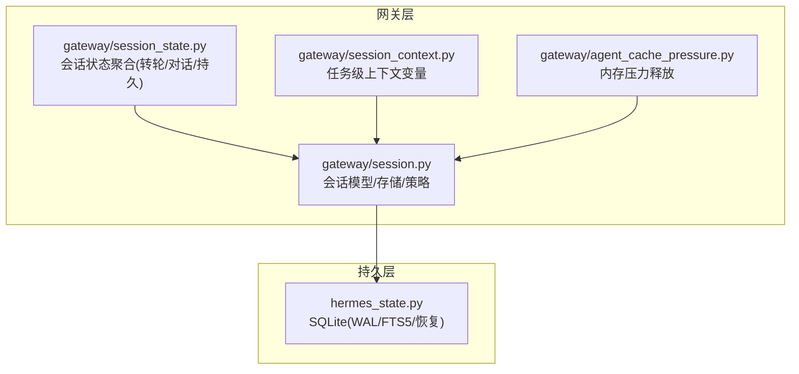
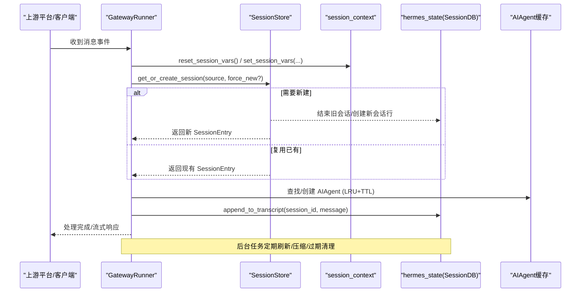
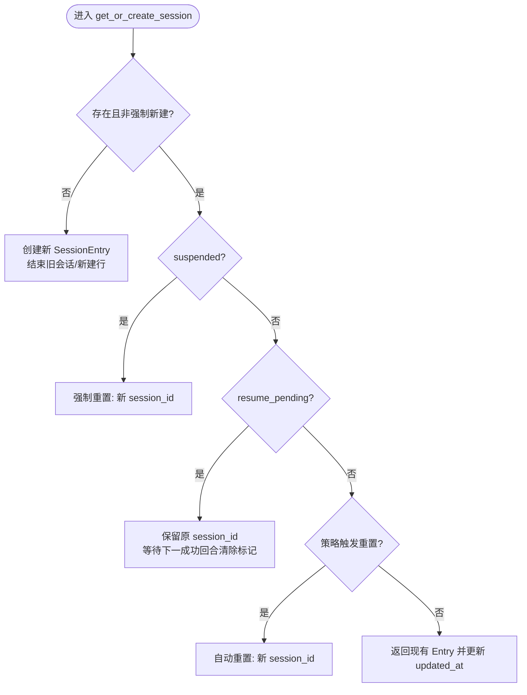
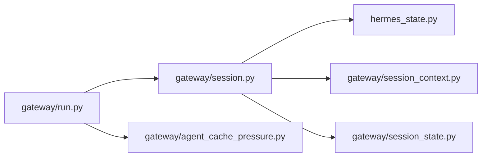

# 会话管理

<cite>
**本文引用的文件**
- [gateway/session.py](file://gateway/session.py)
- [gateway/session_context.py](file://gateway/session_context.py)
- [gateway/session_state.py](file://gateway/session_state.py)
- [hermes_state.py](file://hermes_state.py)
- [gateway/agent_cache_pressure.py](file://gateway/agent_cache_pressure.py)
- [docs/session-lifecycle.md](file://docs/session-lifecycle.md)
</cite>

## 目录
1. [简介](#简介)
2. [项目结构](#项目结构)
3. [核心组件](#核心组件)
4. [架构总览](#架构总览)
5. [详细组件分析](#详细组件分析)
6. [依赖关系分析](#依赖关系分析)
7. [性能与高并发优化](#性能与高并发优化)
8. [故障诊断与监控](#故障诊断与监控)
9. [结论](#结论)
10. [附录](#附录)

## 简介
本文件系统化梳理 Hermes Agent 的会话管理机制，覆盖会话生命周期（创建、激活、暂停、恢复、销毁）、状态持久化、上下文保持、跨进程同步、隔离策略、权限控制、资源管理、会话池与会话缓存复用、内存优化、监控调试以及高并发场景下的最佳实践。文档以代码为依据，提供可追溯的源码路径与图示，帮助读者快速理解并安全地扩展或调优系统。

## 项目结构
围绕会话管理的核心模块分布在 gateway 与 hermes_state：
- gateway/session.py：会话数据模型、键生成、存储与策略评估（SessionSource、SessionEntry、SessionStore）。
- gateway/session_context.py：基于 contextvars 的任务级会话上下文变量，替代进程全局环境变量，确保并发安全。
- gateway/session_state.py：将 GatewayRunner 中分散的 per-session 字典状态整合为 SessionState（turn/conversation/persistent），并提供兼容视图。
- hermes_state.py：SQLite 会话数据库（WAL、FTS5、压缩拆分、恢复保护等）。
- gateway/agent_cache_pressure.py：按匿名 RSS 预算对 AIAgent 缓存进行压力释放，避免长会话导致内存膨胀。
- docs/session-lifecycle.md：官方会话生命周期设计说明（策略、恢复、队列、上下文注入等）。

**图表来源**
- [gateway/session.py:1-120](file://gateway/session.py#L1-L120)
- [gateway/session_context.py:1-120](file://gateway/session_context.py#L1-L120)
- [gateway/session_state.py:1-180](file://gateway/session_state.py#L1-L180)
- [hermes_state.py:1-120](file://hermes_state.py#L1-L120)
- [gateway/agent_cache_pressure.py:1-60](file://gateway/agent_cache_pressure.py#L1-L60)

**章节来源**
- [docs/session-lifecycle.md:1-20](file://docs/session-lifecycle.md#L1-L20)

## 核心组件
- 会话源与上下文
  - SessionSource：描述消息来源（平台、聊天ID、用户、线程、作用域等），用于路由、隔离与动态系统提示注入。
  - SessionContext：构建动态系统提示段，包含连接平台、默认投递通道、是否多用户共享会话等。
- 会话存储与策略
  - SessionEntry：会话元数据（session_key→session_id映射、时间戳、标记位、token计数等）。
  - SessionStore：会话索引与操作（创建/重置/切换/挂起/恢复/清理、转录追加/重写/回滚、列表查询）。
- 会话上下文变量
  - session_context：使用 ContextVar 实现任务级会话上下文，避免并发覆盖；提供 set/clear/reset/get 接口，支持 CLI/网关/定时任务兼容。
- 会话状态聚合
  - SessionState：将运行期状态按“转轮/对话/持久”三范围组织，统一生命周期清理，避免历史散落字典导致的边界漂移。
- 持久化与恢复
  - hermes_state：SQLite WAL + FTS5 全文检索；会话压缩拆分链；崩溃恢复与自动续传；测试隔离保护。
- 内存与缓存
  - agent_cache_pressure：按匿名 RSS 预算释放 LRU 最久未用会话的 transcript，防止内存泄漏；结合 idle TTL 与最大条目数共同约束。

**章节来源**
- [gateway/session.py:148-347](file://gateway/session.py#L148-L347)
- [gateway/session.py:773-800](file://gateway/session.py#L773-L800)
- [gateway/session_context.py:1-120](file://gateway/session_context.py#L1-L120)
- [gateway/session_state.py:51-179](file://gateway/session_state.py#L51-L179)
- [hermes_state.py:1-16](file://hermes_state.py#L1-L16)
- [gateway/agent_cache_pressure.py:1-60](file://gateway/agent_cache_pressure.py#L1-L60)

## 架构总览
下图展示消息进入网关后，会话上下文绑定、会话查找/创建、状态更新、转录写入与缓存复用的整体流程。

**图表来源**
- [gateway/session.py:148-347](file://gateway/session.py#L148-L347)
- [gateway/session_context.py:206-313](file://gateway/session_context.py#L206-L313)
- [hermes_state.py:1-120](file://hermes_state.py#L1-L120)
- [docs/session-lifecycle.md:578-652](file://docs/session-lifecycle.md#L578-L652)

## 详细组件分析

### 会话生命周期管理（创建、激活、暂停、恢复、销毁）
- 创建与激活
  - 通过 SessionStore.get_or_create_session(source, force_new=False) 决定复用或新建会话。
  - 若需新建：生成新的 session_id，结束旧会话（SQLite），创建新记录，设置 is_fresh_reset 等标记。
  - 激活时更新 updated_at，必要时注入动态系统提示（build_session_context_prompt）。
- 暂停与恢复
  - 暂停：suspend_session 标记 suspended=True，下次访问强制重置。
  - 恢复：mark_resume_pending 标记 resume_pending，重启后 suspend_recently_active 将最近活跃会话标记为可恢复；get_or_create_session 遇到 resume_pending 则保留原 session_id 继续。
- 销毁与清理
  - 过期清理：background expiry watcher 周期性检查 _is_session_expired，调用 on_session_finalize 钩子，清理工具资源、驱逐缓存、提升状态到 session_reset。
  - 会话条目修剪：prune_old_entries 基于 updated_at 清理陈旧 entries。

**图表来源**
- [docs/session-lifecycle.md:99-141](file://docs/session-lifecycle.md#L99-L141)

**章节来源**
- [docs/session-lifecycle.md:99-141](file://docs/session-lifecycle.md#L99-L141)
- [docs/session-lifecycle.md:345-440](file://docs/session-lifecycle.md#L345-L440)
- [docs/session-lifecycle.md:539-576](file://docs/session-lifecycle.md#L539-L576)

### 会话状态持久化、上下文保持与跨进程同步
- 持久化
  - 会话元数据与转录存储在 SQLite（WAL 模式，FTS5 搜索），sessions.json 仅保存 key→id 映射与轻量元数据。
  - 支持压缩拆分（parent_session_id 链）、导出限制、恢复保护（跳过历史 harness 与残留标记）。
- 上下文保持
  - 使用 session_context 的 ContextVar 在异步任务内维护会话标识（平台、聊天、用户、线程、消息ID、profile 等），避免 os.environ 被并发覆盖。
  - 支持 scoped_current_session_id 临时切换会话 ID（如委托子代理），并在退出时恢复。
- 跨进程同步
  - 通过 SQLite WAL 保证并发读写；macOS 下启用 checkpoint_fullfsync/synchronous=FULL 增强稳定性。
  - 压缩锁持有者检测（PID 存活判断）避免死锁；WAL 不兼容文件系统降级为 DELETE 模式。

**章节来源**
- [hermes_state.py:1-16](file://hermes_state.py#L1-L16)
- [hermes_state.py:485-540](file://hermes_state.py#L485-L540)
- [hermes_state.py:697-780](file://hermes_state.py#L697-L780)
- [gateway/session_context.py:1-120](file://gateway/session_context.py#L1-L120)
- [gateway/session_context.py:151-204](file://gateway/session_context.py#L151-L204)

### 会话隔离策略、权限控制与资源管理
- 隔离策略
  - DM 始终私有；群组/频道默认按用户隔离（group_sessions_per_user）；线程默认共享（thread_sessions_per_user）。
  - 多用户共享会话时在系统提示中标注“多用户”，避免固定用户名破坏提示缓存。
- 权限控制
  - SessionSource.role_authorized 表示由平台角色授权而非用户ID；delivered_via_upstream_relay 标记来自受信任中继通道。
  - PII 脱敏：在系统提示中对部分平台进行用户/聊天ID哈希化处理，但路由与键生成仍使用原始值。
- 资源管理
  - 会话过期时清理工具资源、记忆提供者、缓存条目；后台任务定期驱逐空闲/压力下的 AIAgent。

**章节来源**
- [docs/session-lifecycle.md:261-291](file://docs/session-lifecycle.md#L261-L291)
- [gateway/session.py:148-347](file://gateway/session.py#L148-L347)
- [gateway/session.py:479-745](file://gateway/session.py#L479-L745)
- [docs/session-lifecycle.md:539-576](file://docs/session-lifecycle.md#L539-L576)

### 会话池管理、连接复用与内存优化
- 会话池/缓存
  - 网关维护 AIAgent 的 LRU 缓存（max_size、idle_ttl_secs），按 session_key 复用，减少提示重建成本。
  - 内存压力释放：根据匿名 RSS 预算（cgroup memory.high/max 或总内存），计划并执行 LRU 淘汰，仅当转录已落盘才安全释放。
- 连接复用
  - 通过 AIAgent 缓存复用 LLM 客户端、工具 schema、记忆提供者等资源，降低启动开销。
- 内存优化技术
  - 转录持久化与软释放：transcript_persistence_caught_up 确保磁盘同步后再释放内存。
  - 保护最近会话：protect_recent 避免热会话被误删。
  - 批量驱逐上限：max_evictions_per_pass 控制单次压力释放规模，避免长时间阻塞。

**章节来源**
- [docs/session-lifecycle.md:578-652](file://docs/session-lifecycle.md#L578-L652)
- [gateway/agent_cache_pressure.py:1-60](file://gateway/agent_cache_pressure.py#L1-L60)
- [gateway/agent_cache_pressure.py:156-224](file://gateway/agent_cache_pressure.py#L156-L224)
- [gateway/agent_cache_pressure.py:227-311](file://gateway/agent_cache_pressure.py#L227-L311)

### 消息队列与中断跟随
- 单槽待处理 + FIFO 溢出缓冲：adapter._pending_messages 为单槽，重复发送会合并；/queue 命令进入 _queued_events 按序排队。
- 入队/出队/晋升：空闲时直接放置，占用时追加尾部；每次消费后从头部晋升一个。
- 清空策略：/new 与 /reset 时清空队列，保证每个 /queue 产生完整一轮。

**章节来源**
- [docs/session-lifecycle.md:443-500](file://docs/session-lifecycle.md#L443-L500)

## 依赖关系分析
- 模块耦合
  - gateway/session.py 依赖 hermes_state 进行持久化，依赖 session_context 进行上下文绑定，依赖 config 获取重置策略。
  - gateway/session_state.py 将 GatewayRunner 的多字典状态收敛为 SessionState，并通过 legacy 视图兼容测试。
  - gateway/agent_cache_pressure.py 读取配置与系统信息，为 run.py 的压力释放提供决策。
- 外部依赖
  - SQLite（WAL/FTS5）、psutil（可选，用于 PID 存活检测与内存统计）、cgroup（Linux 内存限制探测）。

**图表来源**
- [gateway/session.py:1-120](file://gateway/session.py#L1-L120)
- [hermes_state.py:1-120](file://hermes_state.py#L1-L120)
- [gateway/session_context.py:1-120](file://gateway/session_context.py#L1-L120)
- [gateway/session_state.py:1-180](file://gateway/session_state.py#L1-L180)
- [gateway/agent_cache_pressure.py:1-60](file://gateway/agent_cache_pressure.py#L1-L60)

**章节来源**
- [gateway/session.py:1-120](file://gateway/session.py#L1-L120)
- [hermes_state.py:1-120](file://hermes_state.py#L1-L120)
- [gateway/session_context.py:1-120](file://gateway/session_context.py#L1-L120)
- [gateway/session_state.py:1-180](file://gateway/session_state.py#L1-L180)
- [gateway/agent_cache_pressure.py:1-60](file://gateway/agent_cache_pressure.py#L1-L60)

## 性能与高并发优化
- 并发安全
  - 使用 ContextVar 替代进程全局环境变量，避免并发覆盖；reset_session_vars 在任务入口处阻断继承泄露。
  - SQLite WAL 模式支持并发读与单写；macOS 强化 fsync 保障。
- 缓存与复用
  - AIAgent LRU 缓存 + idle TTL 减少重建成本；压力释放按需淘汰冷会话。
- 内存控制
  - 基于 cgroup 的匿名 RSS 预算自动释放；保护最近会话，限制单次驱逐数量。
- 队列与背压
  - 单槽 + FIFO 溢出缓冲避免乱序；/queue 严格顺序执行。
- 建议
  - 合理设置 group/thread 隔离策略，避免过多会话导致缓存膨胀。
  - 调整 agent_cache.memory_high_mb 与 max_evictions_per_pass，平衡吞吐与延迟。
  - 在高负载环境下关注 WAL 兼容性，必要时降级为 DELETE 模式。

[本节为通用指导，无需特定文件引用]

## 故障诊断与监控
- 常见错误与定位
  - SQLite WAL 不兼容：NFS/SMB/FUSE/ZFS 上可能报 locking protocol/disk i/o error；系统会自动降级并提示。
  - 会话数据库不可用：slash 命令（/resume 等）会显示上次初始化失败原因。
  - 压缩锁冲突：通过 PID 存活检测回收死锁；TTL 作为最终恢复路径。
- 监控指标
  - 会话活跃度、队列深度、缓存命中率、内存 RSS、压缩成功率/失败次数。
- 调试工具
  - session_context 提供 get_session_env 与 async_delivery_supported 等接口，便于排查上下文与投递能力。
  - hermes_state 提供 format_session_db_unavailable 等辅助函数输出友好错误信息。

**章节来源**
- [hermes_state.py:520-565](file://hermes_state.py#L520-L565)
- [hermes_state.py:674-695](file://hermes_state.py#L674-L695)
- [gateway/session_context.py:363-496](file://gateway/session_context.py#L363-L496)

## 结论
Hermes Agent 的会话管理系统以“任务级上下文 + 结构化状态聚合 + SQLite 持久化 + 智能缓存与内存控制”为核心，实现了高并发、强一致、易恢复的会话生命周期管理。通过明确的隔离策略、权限控制与资源清理机制，系统在多平台、多租户场景下具备良好可扩展性与稳定性。配合监控与诊断工具，可有效应对生产环境的复杂问题。

[本节为总结性内容，无需特定文件引用]

## 附录
- 关键配置项参考
  - 会话重置策略：mode/at_hour/idle_minutes/notify。
  - 会话存储：session_store_max_age_days。
  - 网关超时与自动续传窗口：agent.gateway_timeout、agent.gateway_auto_continue_freshness。
  - 缓存参数：agent.agent_cache.max_size/idle_ttl_secs/memory_high_mb/max_evictions_per_pass/protect_recent。

**章节来源**
- [docs/session-lifecycle.md:654-680](file://docs/session-lifecycle.md#L654-L680)