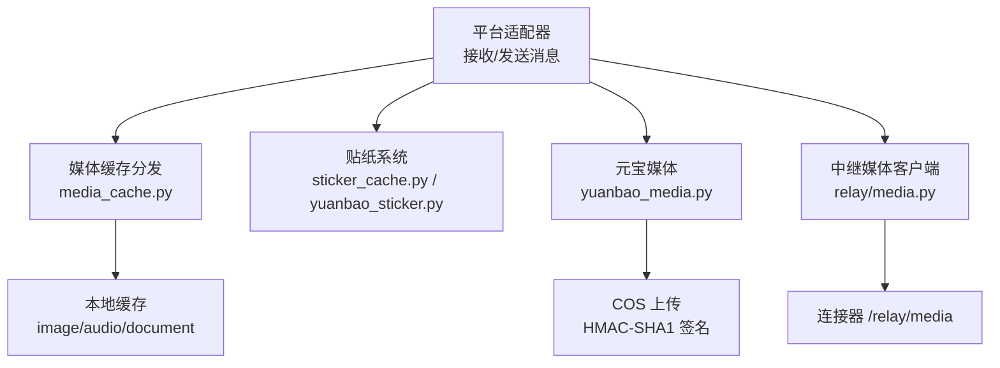
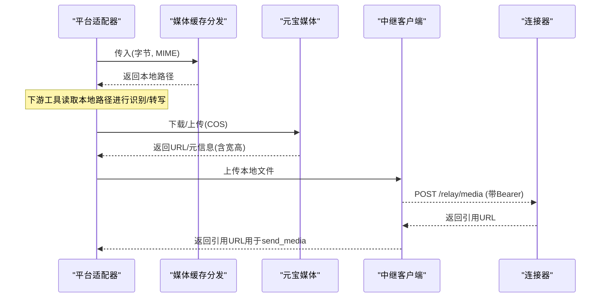
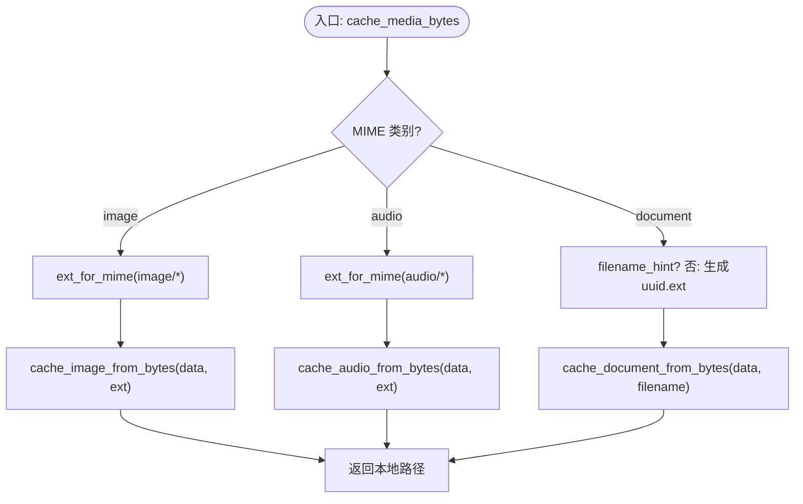
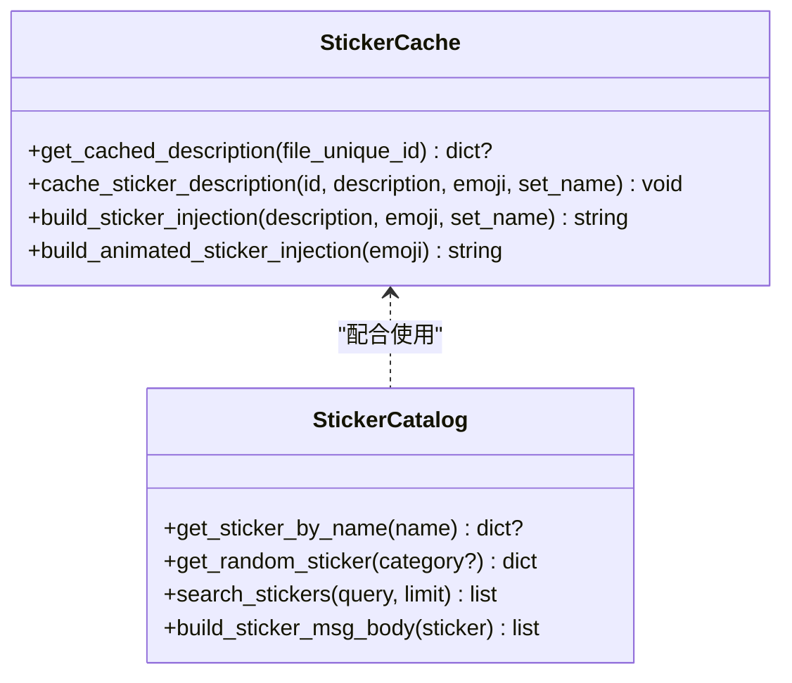
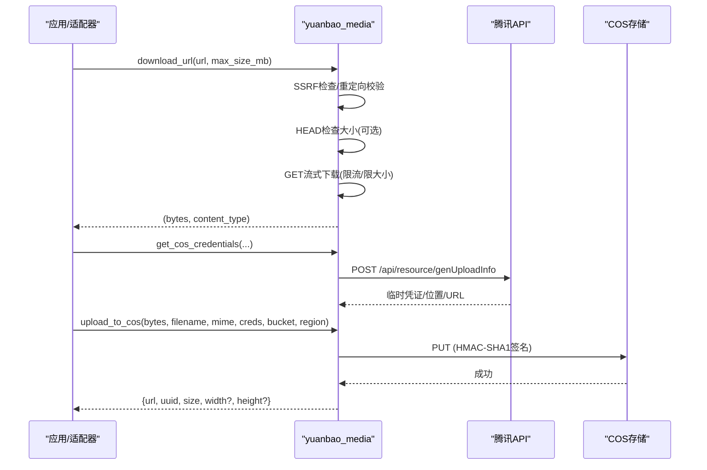
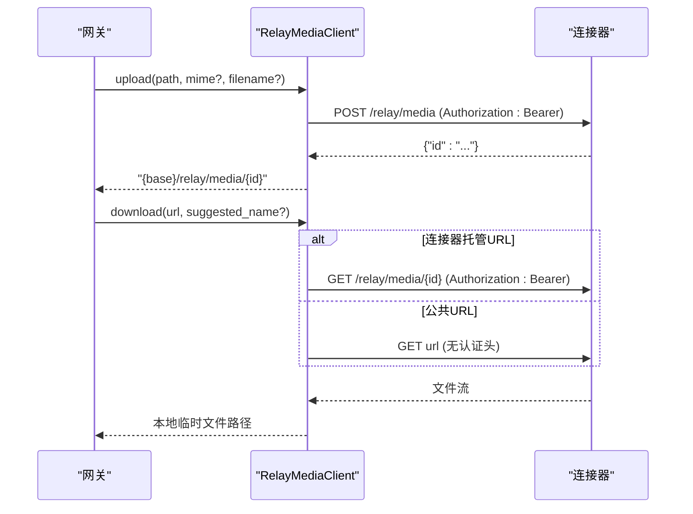
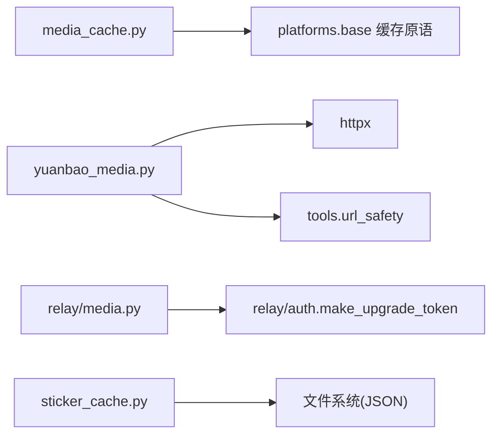

# 媒体处理

<cite>
**本文引用的文件**
- [gateway/platforms/media_cache.py](file://gateway/platforms/media_cache.py)
- [gateway/sticker_cache.py](file://gateway/sticker_cache.py)
- [gateway/platforms/yuanbao_sticker.py](file://gateway/platforms/yuanbao_sticker.py)
- [gateway/platforms/yuanbao_media.py](file://gateway/platforms/yuanbao_media.py)
- [gateway/relay/media.py](file://gateway/relay/media.py)
</cite>

## 目录
1. [简介](#简介)
2. [项目结构](#项目结构)
3. [核心组件](#核心组件)
4. [架构总览](#架构总览)
5. [详细组件分析](#详细组件分析)
6. [依赖关系分析](#依赖关系分析)
7. [性能考虑](#性能考虑)
8. [故障排查指南](#故障排查指南)
9. [结论](#结论)
10. [附录](#附录)

## 简介
本文件面向开发者与运维人员，系统化说明本仓库中的媒体处理能力：包括媒体文件的上传、下载、缓存与转换机制；支持的媒体格式、压缩策略与质量优化；贴纸识别与注入；图片识别（尺寸解析）；以及跨网关的媒体中继。同时给出性能优化建议、存储空间管理方案与安全扫描、访问控制要点，并提供扩展自定义处理器的实践指引。

## 项目结构
媒体相关能力主要分布在以下模块：
- 平台侧媒体缓存与分发：统一 MIME→扩展名映射、按类型写入本地缓存并返回路径
- 贴纸系统：内置表情目录、模糊搜索、描述缓存与消息体构建
- 元宝平台媒体：COS 临时凭证获取与上传、URL 下载、图片尺寸解析、TIM 消息体构建
- 中继媒体客户端：网关到连接器的媒体平面（上传/下载），使用签名令牌鉴权

图表来源
- [gateway/platforms/media_cache.py:1-203](file://gateway/platforms/media_cache.py#L1-L203)
- [gateway/sticker_cache.py:1-125](file://gateway/sticker_cache.py#L1-L125)
- [gateway/platforms/yuanbao_sticker.py:1-559](file://gateway/platforms/yuanbao_sticker.py#L1-L559)
- [gateway/platforms/yuanbao_media.py:1-666](file://gateway/platforms/yuanbao_media.py#L1-L666)
- [gateway/relay/media.py:1-206](file://gateway/relay/media.py#L1-L206)

章节来源
- [gateway/platforms/media_cache.py:1-203](file://gateway/platforms/media_cache.py#L1-L203)
- [gateway/sticker_cache.py:1-125](file://gateway/sticker_cache.py#L1-L125)
- [gateway/platforms/yuanbao_sticker.py:1-559](file://gateway/platforms/yuanbao_sticker.py#L1-L559)
- [gateway/platforms/yuanbao_media.py:1-666](file://gateway/platforms/yuanbao_media.py#L1-L666)
- [gateway/relay/media.py:1-206](file://gateway/relay/media.py#L1-L206)

## 核心组件
- 媒体缓存分发器：根据 MIME 将字节写入图像/音频/文档三类缓存，并返回本地路径，供下游工具消费
- 贴纸缓存与注入：基于 Telegram 唯一 ID 缓存贴纸描述，避免重复视觉分析；支持构造注入文本
- 元宝媒体：COS 临时凭证获取与上传、URL 安全下载、图片尺寸解析、TIM 消息体构建
- 中继媒体客户端：网关到连接器的媒体平面，提供带签名的上传/下载，限制大小并落盘为本地临时文件

章节来源
- [gateway/platforms/media_cache.py:1-203](file://gateway/platforms/media_cache.py#L1-L203)
- [gateway/sticker_cache.py:1-125](file://gateway/sticker_cache.py#L1-L125)
- [gateway/platforms/yuanbao_media.py:1-666](file://gateway/platforms/yuanbao_media.py#L1-L666)
- [gateway/relay/media.py:1-206](file://gateway/relay/media.py#L1-L206)

## 架构总览
媒体处理贯穿“接入—缓存—转换—发送”全链路：
- 入站：平台适配器收到媒体后，通过分发器分类缓存为本地文件，便于后续视觉/语音工具直接读取路径
- 出站：生成或转码后的媒体通过中继客户端上传至连接器，或以 COS 直传方式获得公网 URL，再封装为 TIM 消息体发送
- 贴纸：对静态贴纸进行视觉描述并缓存，动态/视频贴纸以提示文案替代

图表来源
- [gateway/platforms/media_cache.py:155-203](file://gateway/platforms/media_cache.py#L155-L203)
- [gateway/platforms/yuanbao_media.py:202-270](file://gateway/platforms/yuanbao_media.py#L202-L270)
- [gateway/platforms/yuanbao_media.py:437-570](file://gateway/platforms/yuanbao_media.py#L437-L570)
- [gateway/relay/media.py:96-152](file://gateway/relay/media.py#L96-L152)
- [gateway/relay/media.py:154-202](file://gateway/relay/media.py#L154-L202)

## 详细组件分析

### 媒体缓存分发（MIME→扩展名→本地缓存）
- 职责：统一不同平台的 MIME 差异，决定扩展名并写入对应缓存（图像/音频/文档），返回本地路径
- 关键行为：
  - 维护默认映射表，兼容历史差异（如 audio/ogg → .ogg）
  - 支持 per-adapter 覆盖，保证字节级一致性
  - 自动推断类别：image/audio/document
  - 文档类可指定文件名提示，否则生成随机名+扩展

图表来源
- [gateway/platforms/media_cache.py:155-203](file://gateway/platforms/media_cache.py#L155-L203)
- [gateway/platforms/media_cache.py:97-149](file://gateway/platforms/media_cache.py#L97-L149)

章节来源
- [gateway/platforms/media_cache.py:1-203](file://gateway/platforms/media_cache.py#L1-L203)

### 贴纸系统与缓存
- 贴纸目录与检索：内置表情目录，支持名称/描述模糊匹配与随机选取
- 描述缓存：按 Telegram 唯一 ID 缓存视觉描述，减少重复调用；持久化到用户家目录 JSON 文件
- 注入文本：为无法分析的动图/视频贴纸生成友好提示

图表来源
- [gateway/sticker_cache.py:29-125](file://gateway/sticker_cache.py#L29-L125)
- [gateway/platforms/yuanbao_sticker.py:331-559](file://gateway/platforms/yuanbao_sticker.py#L331-L559)

章节来源
- [gateway/sticker_cache.py:1-125](file://gateway/sticker_cache.py#L1-L125)
- [gateway/platforms/yuanbao_sticker.py:1-559](file://gateway/platforms/yuanbao_sticker.py#L1-L559)

### 元宝平台媒体（COS 上传与 URL 下载）
- URL 下载：SSRF 防护（拒绝私有/内网地址）、重定向校验、流式读取与大小限制
- COS 上传：获取临时凭证、HMAC-SHA1 签名、PUT 上传、解析图片宽高
- 消息体构建：TIMImageElem/TIMFileElem 标准结构

图表来源
- [gateway/platforms/yuanbao_media.py:202-270](file://gateway/platforms/yuanbao_media.py#L202-L270)
- [gateway/platforms/yuanbao_media.py:359-434](file://gateway/platforms/yuanbao_media.py#L359-L434)
- [gateway/platforms/yuanbao_media.py:437-570](file://gateway/platforms/yuanbao_media.py#L437-L570)

章节来源
- [gateway/platforms/yuanbao_media.py:1-666](file://gateway/platforms/yuanbao_media.py#L1-L666)

### 中继媒体客户端（网关↔连接器）
- 上传：读取本地文件，校验大小，携带 Bearer 令牌 POST 到 /relay/media，返回引用 URL
- 下载：识别是否为连接器托管 URL，必要时携带 Bearer 令牌 GET，落盘为临时文件并返回路径
- 大小限制：统一上限，防止过大请求

图表来源
- [gateway/relay/media.py:96-152](file://gateway/relay/media.py#L96-L152)
- [gateway/relay/media.py:154-202](file://gateway/relay/media.py#L154-L202)

章节来源
- [gateway/relay/media.py:1-206](file://gateway/relay/media.py#L1-L206)

## 依赖关系分析
- 媒体缓存分发依赖平台基础缓存实现（在 base 中定义的具体写入函数），并通过 MIME→扩展名映射统一行为
- 元宝媒体依赖 httpx 进行网络请求，依赖工具层的 URL 安全客户端进行 SSRF 防护
- 中继客户端依赖网关认证令牌生成，确保仅本网关可引用其上传的资源
- 贴纸系统依赖用户家目录下的 JSON 缓存文件，原子写入保障一致性

图表来源
- [gateway/platforms/media_cache.py:173-179](file://gateway/platforms/media_cache.py#L173-L179)
- [gateway/platforms/yuanbao_media.py:223-241](file://gateway/platforms/yuanbao_media.py#L223-L241)
- [gateway/relay/media.py:44-90](file://gateway/relay/media.py#L44-L90)
- [gateway/sticker_cache.py:17-56](file://gateway/sticker_cache.py#L17-L56)

章节来源
- [gateway/platforms/media_cache.py:1-203](file://gateway/platforms/media_cache.py#L1-L203)
- [gateway/platforms/yuanbao_media.py:1-666](file://gateway/platforms/yuanbao_media.py#L1-L666)
- [gateway/relay/media.py:1-206](file://gateway/relay/media.py#L1-L206)
- [gateway/sticker_cache.py:1-125](file://gateway/sticker_cache.py#L1-L125)

## 性能考虑
- 入站媒体优先缓存为本地文件，避免重复网络 IO；视觉/语音工具直接读路径，降低序列化开销
- 图片尺寸解析采用零依赖的头部解析（PNG/JPEG/GIF/WebP），减少第三方库加载与内存占用
- 下载过程流式读取并限制最大体积，避免大文件导致内存峰值
- 贴纸描述缓存显著减少重复视觉分析成本
- 中继上传/下载均设置超时与大小上限，失败快速返回，避免阻塞主流程

[本节为通用性能建议，不直接分析具体文件]

## 故障排查指南
- 下载失败/被拦截：检查是否命中 SSRF 保护（私有/内网地址）或重定向到不安全地址；确认目标服务器支持 HEAD（部分不支持会被忽略）
- 上传失败：核对 COS 临时凭证字段是否完整；确认签名时间窗口有效；检查 Content-Type 是否正确
- 中继上传/下载失败：确认网关已配置 gateway_id 与 secret；检查连接器可达性与 /relay/media 路由；关注日志中的大小超限警告
- 贴纸描述未命中缓存：确认 file_unique_id 一致；检查缓存文件权限与写入是否成功

章节来源
- [gateway/platforms/yuanbao_media.py:223-270](file://gateway/platforms/yuanbao_media.py#L223-L270)
- [gateway/platforms/yuanbao_media.py:437-570](file://gateway/platforms/yuanbao_media.py#L437-L570)
- [gateway/relay/media.py:96-202](file://gateway/relay/media.py#L96-L202)
- [gateway/sticker_cache.py:29-92](file://gateway/sticker_cache.py#L29-L92)

## 结论
本系统的媒体处理围绕“统一分发、安全下载、可靠上传、高效缓存”展开：通过 MIME 分发与本地缓存提升稳定性与性能；借助 SSRF 防护与大小限制保障安全；贴纸缓存与图片尺寸解析进一步优化体验与资源消耗；中继媒体客户端打通网关与连接器之间的媒体平面。整体设计兼顾可扩展性与健壮性，适合在多平台场景下复用与演进。

[本节为总结性内容，不直接分析具体文件]

## 附录

### 支持的媒体格式与转换
- 图片：JPEG/PNG/GIF/WebP/BMP/HEIC/TIFF/ICO（上传时映射为 TIM image_format）
- 音频：OGG/OPUS(MP4容器)/MP3/WAV/M4A/AAC
- 视频：MP4/WebM
- 文档：PDF/ZIP/TAR/GZ/Office 系列等
- 转换策略：
  - 入站：按 MIME 选择扩展名并写入对应缓存（图像/音频/文档）
  - 图片：仅做尺寸解析，不进行像素级重编码（如需压缩可在上层工具链实现）
  - 音频/视频：当前未内置转码逻辑，建议在外部工具链完成后再入库

章节来源
- [gateway/platforms/yuanbao_media.py:45-84](file://gateway/platforms/yuanbao_media.py#L45-L84)
- [gateway/platforms/media_cache.py:52-85](file://gateway/platforms/media_cache.py#L52-L85)

### 媒体缓存系统（策略、后端、过期）
- 策略：按 MIME 分类缓存；贴纸描述按唯一 ID 缓存；中继下载落盘为临时文件
- 后端：本地文件系统（JSON 缓存、临时文件）
- 过期：贴纸缓存未内置 TTL，需自行清理或结合外部任务；中继临时文件由调用方生命周期管理

章节来源
- [gateway/sticker_cache.py:29-92](file://gateway/sticker_cache.py#L29-L92)
- [gateway/relay/media.py:154-202](file://gateway/relay/media.py#L154-L202)

### 贴纸处理、图片识别与视频转码
- 贴纸处理：名称/描述模糊匹配、随机选取、注入文本构造
- 图片识别：零依赖解析 PNG/JPEG/GIF/WebP 宽高
- 视频转码：代码库未包含内置转码；建议在外部工具链处理后以文档/视频形式入库

章节来源
- [gateway/platforms/yuanbao_sticker.py:331-559](file://gateway/platforms/yuanbao_sticker.py#L331-L559)
- [gateway/platforms/yuanbao_media.py:121-197](file://gateway/platforms/yuanbao_media.py#L121-L197)

### 性能优化建议与存储空间管理
- 入站媒体尽量缓存本地，避免重复下载；合理设置下载大小上限
- 图片仅在必要时解析尺寸；避免不必要的重编码
- 定期清理贴纸缓存与中继临时文件，释放磁盘空间
- 对高频贴纸启用描述缓存，降低视觉模型调用频率

[本节为通用建议，不直接分析具体文件]

### 安全扫描、病毒检测与访问控制
- 安全扫描/病毒检测：当前代码未集成；建议在入站媒体进入缓存前增加扫描环节（例如沙箱扫描）
- 访问控制：
  - 中继媒体使用每网关签名令牌鉴权，仅允许本网关引用其上传的资源
  - 下载时对连接器托管 URL 进行鉴权判断，公共 URL 无需令牌
  - 下载阶段实施 SSRF 防护与重定向校验

章节来源
- [gateway/relay/media.py:92-152](file://gateway/relay/media.py#L92-L152)
- [gateway/platforms/yuanbao_media.py:223-270](file://gateway/platforms/yuanbao_media.py#L223-L270)

### 自定义媒体处理器扩展指南
- 扩展点建议：
  - 在入站路径增加预处理钩子（如格式校验、病毒扫描、缩略图生成）
  - 在出站路径增加后处理钩子（如压缩、水印、格式转换）
  - 通过 per-adapter 覆盖 MIME→扩展名映射，保持历史行为一致
- 注意事项：
  - 保持字节级兼容性，避免破坏下游工具对扩展名的期望
  - 所有网络请求均需遵循 SSRF 防护与大小限制
  - 新增缓存项应提供清理策略，避免无限增长

[本节为通用扩展建议，不直接分析具体文件]