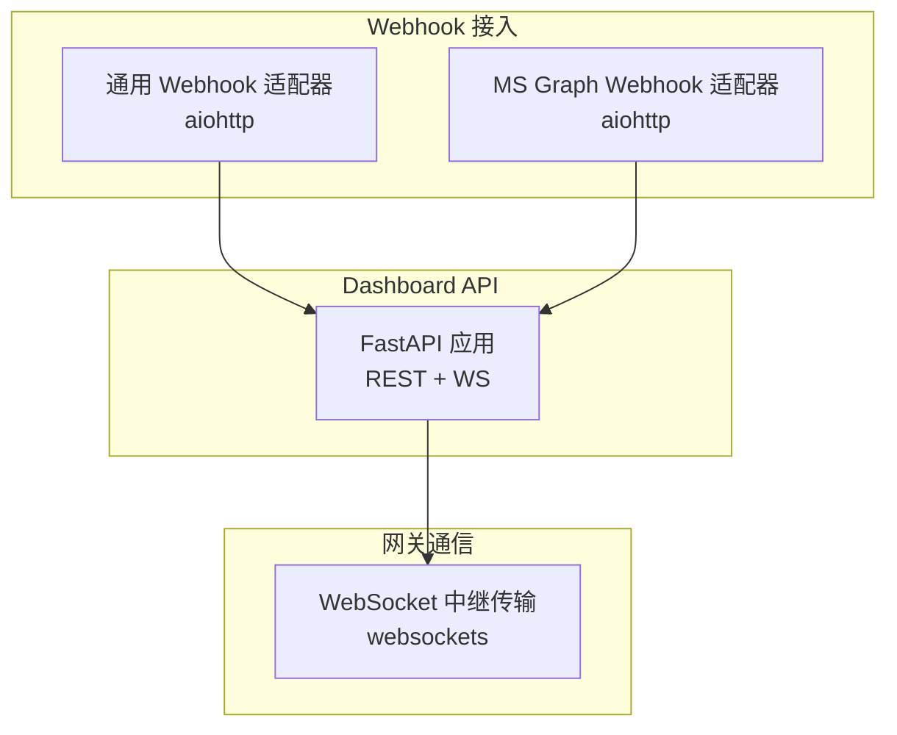
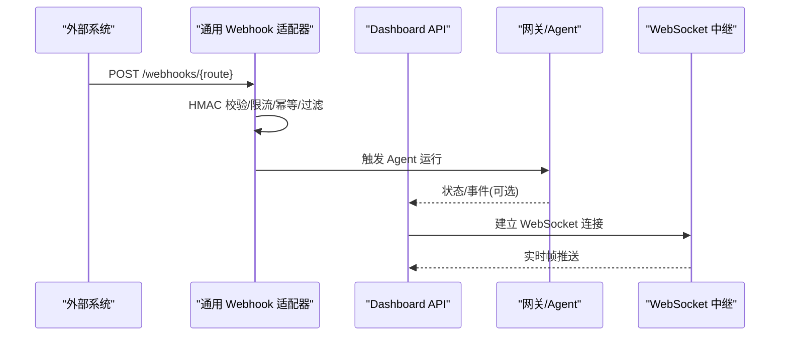
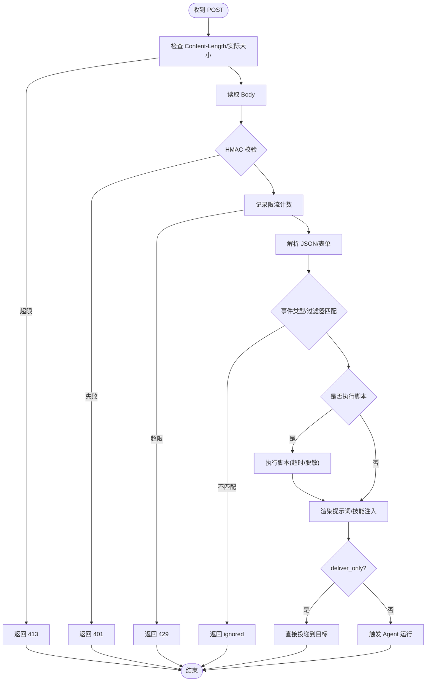
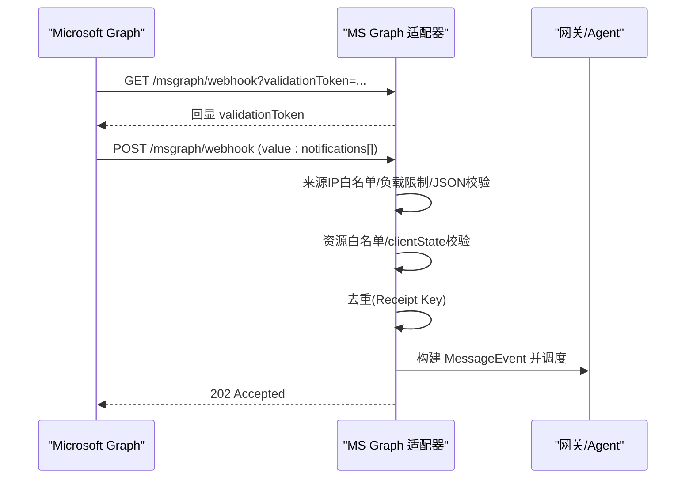
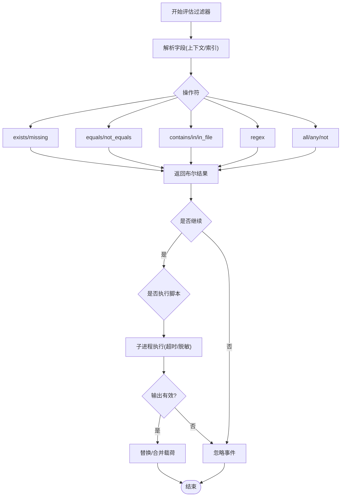
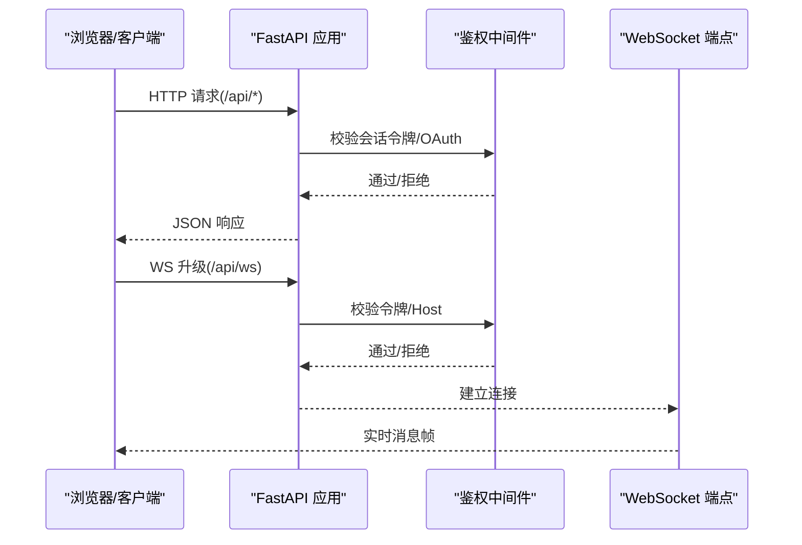
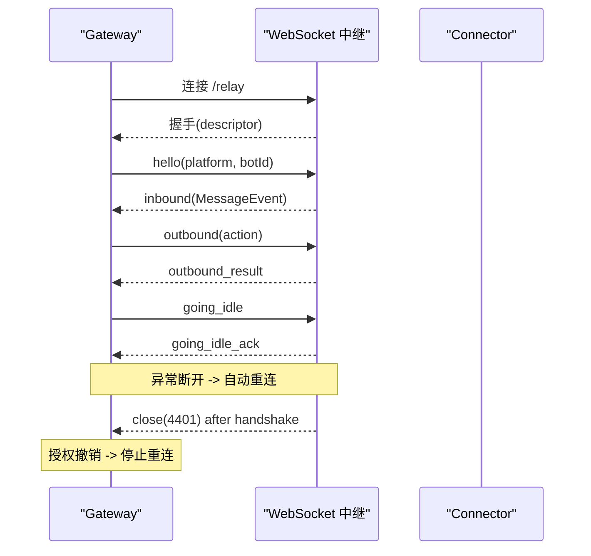
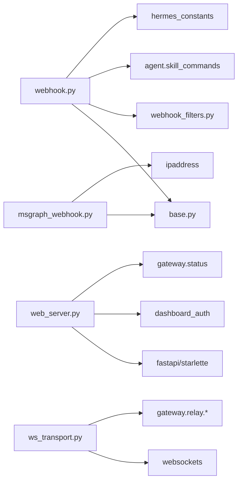

# Webhook 和 API Server

<cite>
**本文引用的文件**
- [gateway/platforms/webhook.py](file://gateway/platforms/webhook.py)
- [gateway/platforms/msgraph_webhook.py](file://gateway/platforms/msgraph_webhook.py)
- [gateway/platforms/webhook_filters.py](file://gateway/platforms/webhook_filters.py)
- [hermes_cli/web_server.py](file://hermes_cli/web_server.py)
- [gateway/relay/ws_transport.py](file://gateway/relay/ws_transport.py)
</cite>

## 目录
1. [简介](#简介)
2. [项目结构](#项目结构)
3. [核心组件](#核心组件)
4. [架构总览](#架构总览)
5. [详细组件分析](#详细组件分析)
6. [依赖关系分析](#依赖关系分析)
7. [性能考量](#性能考量)
8. [故障排查指南](#故障排查指南)
9. [结论](#结论)
10. [附录](#附录)

## 简介
本文件面向“Webhook 与 API Server 集成”的开发者与运维人员，系统性说明通用 Webhook 接收器、Microsoft Graph Webhook 适配器、Dashboard REST/WS API、以及 WebSocket 实时通信与事件订阅机制。文档覆盖请求验证、签名校验、过滤器配置、路由规则、RESTful 设计规范、WebSocket 实时通信、事件订阅、自定义处理器开发与安全最佳实践。

## 项目结构
围绕 Webhook 与 API Server 的关键代码分布在以下模块：
- 通用 Webhook 平台适配器：提供 HTTP 服务器、HMAC 签名校验、事件过滤、脚本转换、幂等与限流、多配置文件路由与跨平台投递。
- Microsoft Graph Webhook 适配器：实现 Graph 变更通知的 GET 验证握手与 POST 通知处理、来源 CIDR 白名单、clientState 校验、去重与调度。
- Webhook 过滤器与脚本：声明式过滤器（字段解析、存在性、包含、正则、文件匹配、all/any/not 组合）与外部脚本执行（沙箱化路径、超时、输出脱敏）。
- Dashboard Web 服务：基于 FastAPI 的 REST API 与 WebSocket 端点，内置会话令牌鉴权、Host 头校验、CORS、插件路由门控与健康自检。
- 网关到连接器 WebSocket 传输：长连接、握手、入站事件映射、出站请求/响应、空闲/休眠模式、断线重连与授权撤销处理。

图表来源
- [gateway/platforms/webhook.py:177-344](file://gateway/platforms/webhook.py#L177-L344)
- [gateway/platforms/msgraph_webhook.py:52-185](file://gateway/platforms/msgraph_webhook.py#L52-L185)
- [hermes_cli/web_server.py:313-378](file://hermes_cli/web_server.py#L313-L378)
- [gateway/relay/ws_transport.py:339-443](file://gateway/relay/ws_transport.py#L339-L443)

章节来源
- [gateway/platforms/webhook.py:1-344](file://gateway/platforms/webhook.py#L1-L344)
- [gateway/platforms/msgraph_webhook.py:1-185](file://gateway/platforms/msgraph_webhook.py#L1-L185)
- [hermes_cli/web_server.py:1-378](file://hermes_cli/web_server.py#L1-L378)
- [gateway/relay/ws_transport.py:1-443](file://gateway/relay/ws_transport.py#L1-L443)

## 核心组件
- 通用 Webhook 适配器：启动 aiohttp 服务，注册 /health、/webhooks/{route}、/p/{profile}/webhooks/{route}；按路由进行 HMAC 签名校验、事件类型过滤、脚本转换、幂等与限流、渲染提示词并触发 Agent 运行；支持 deliver_only 直投与跨平台投递。
- Microsoft Graph Webhook 适配器：GET /msgraph/webhook?validationToken=... 回显 token 完成验证；POST 接收变更通知，校验 clientState、资源白名单、来源 CIDR，构建 MessageEvent 并调度处理。
- Webhook 过滤器：支持字段解析（payload/event/headers）、存在性、相等/不等、包含、in/in_file、regex、逻辑组合 all/any/not；可执行外部脚本对载荷进行转换或忽略。
- Dashboard Web 服务：FastAPI 应用，提供 REST API 与 WebSocket；通过会话令牌或 OAuth 门控保护敏感接口；Host 头校验防 DNS 重绑定；CORS 限制本地访问；健康自检与错误统计。
- WebSocket 中继传输：Gateway 主动拨号 Connector 的 /relay 端点，发送 hello 握手，维护 inbound/outbound 帧；支持 going_idle/go_dormant、断线重连、授权撤销（4401）终止。

章节来源
- [gateway/platforms/webhook.py:177-800](file://gateway/platforms/webhook.py#L177-L800)
- [gateway/platforms/msgraph_webhook.py:52-454](file://gateway/platforms/msgraph_webhook.py#L52-L454)
- [gateway/platforms/webhook_filters.py:94-303](file://gateway/platforms/webhook_filters.py#L94-L303)
- [hermes_cli/web_server.py:313-800](file://hermes_cli/web_server.py#L313-L800)
- [gateway/relay/ws_transport.py:339-800](file://gateway/relay/ws_transport.py#L339-L800)

## 架构总览
Webhook 与 API Server 的端到端流程如下：
- 外部系统通过 HTTP 向通用 Webhook 或 MS Graph Webhook 发送事件。
- 适配器进行安全校验（HMAC/clientState/CIDR）、速率限制、幂等控制、事件过滤与脚本转换。
- 将事件转换为内部消息事件，交由 Gateway/Agent 处理。
- Dashboard 提供 REST 与 WebSocket 用于管理、监控与实时交互；WebSocket 中继用于 Gateway 与 Connector 之间的实时双向通信。

图表来源
- [gateway/platforms/webhook.py:584-800](file://gateway/platforms/webhook.py#L584-L800)
- [hermes_cli/web_server.py:313-800](file://hermes_cli/web_server.py#L313-L800)
- [gateway/relay/ws_transport.py:441-543](file://gateway/relay/ws_transport.py#L441-L543)

## 详细组件分析

### 通用 Webhook 适配器
- 生命周期：connect() 加载动态订阅、校验路由 secret、创建 aiohttp 应用并注册路由、启动 TCPSite；disconnect() 清理 runner。
- 路由与多 Profile：支持 /webhooks/{route} 与 /p/{profile}/webhooks/{route}；当 multiplex_profiles 开启时，根据 profile 选择配置。
- 安全与防护：
  - HMAC 签名校验（V2 带时间戳防重放，兼容 V1 但告警）；INSECURE_NO_AUTH 仅允许 loopback。
  - 请求体大小限制（header 与 body 双重检查）。
  - 每路由固定窗口限流。
  - 幂等缓存（delivery_id TTL）。
- 事件处理：
  - 事件类型过滤（X-GitHub-Event/X-GitLab-Event/payload.type）。
  - 声明式过滤器与脚本转换（超时、输出脱敏）。
  - 提示词模板渲染与技能注入。
  - deliver_only 直投与跨平台投递（内置与插件平台）。
- 健康检查：/health 返回 ok。

图表来源
- [gateway/platforms/webhook.py:584-800](file://gateway/platforms/webhook.py#L584-L800)
- [gateway/platforms/webhook_filters.py:228-303](file://gateway/platforms/webhook_filters.py#L228-L303)

章节来源
- [gateway/platforms/webhook.py:177-800](file://gateway/platforms/webhook.py#L177-L800)
- [gateway/platforms/webhook_filters.py:94-303](file://gateway/platforms/webhook_filters.py#L94-L303)

### Microsoft Graph Webhook 适配器
- 生命周期：connect() 校验 client_state、网络可达性与 CIDR 白名单要求；注册 health/validation/notification 路由；启动服务。
- 验证握手：GET /msgraph/webhook?validationToken=... 必须原样回显文本。
- 通知处理：
  - 来源 IP 白名单校验（allowed_source_cidrs），非 loopback 时必须配置。
  - 负载大小限制、JSON 解析与结构校验。
  - 资源白名单（支持前缀匹配）。
  - clientState 校验（时序安全比较）。
  - 去重（receipt key 集合+有序队列，容量上限）。
  - 构建 MessageEvent 并调度处理（异步任务）。
- 健康检查：/health 返回状态、路径与计数。

图表来源
- [gateway/platforms/msgraph_webhook.py:153-185](file://gateway/platforms/msgraph_webhook.py#L153-L185)
- [gateway/platforms/msgraph_webhook.py:219-314](file://gateway/platforms/msgraph_webhook.py#L219-L314)
- [gateway/platforms/msgraph_webhook.py:316-454](file://gateway/platforms/msgraph_webhook.py#L316-L454)

章节来源
- [gateway/platforms/msgraph_webhook.py:52-454](file://gateway/platforms/msgraph_webhook.py#L52-L454)

### Webhook 过滤器与脚本
- 字段解析：支持 payload.event.headers 等上下文，支持列表索引与缺失值处理。
- 操作符：exists/missing/equals/not_equals/contains/in/in_file/regex，支持 all/any/not 组合。
- 脚本执行：
  - 路径解析限制在 HERMES_HOME/scripts 下，拒绝越界路径。
  - 支持 .sh/.bash 与 Python；使用子进程执行，设置超时。
  - 输出脱敏（敏感信息隐藏），非零退出码视为忽略。
  - 支持返回 [SILENT] 或 __hermes_ignore__ 以忽略事件。

图表来源
- [gateway/platforms/webhook_filters.py:104-226](file://gateway/platforms/webhook_filters.py#L104-L226)
- [gateway/platforms/webhook_filters.py:228-303](file://gateway/platforms/webhook_filters.py#L228-L303)

章节来源
- [gateway/platforms/webhook_filters.py:94-303](file://gateway/platforms/webhook_filters.py#L94-L303)

### Dashboard REST 与 WebSocket
- REST API：
  - 会话令牌鉴权：支持 X-Hermes-Session-Token 与 Bearer 两种形式；非 loopback 绑定启用 OAuth 门控。
  - Host 头校验：防止 DNS 重绑定攻击。
  - CORS：限制 localhost/127.0.0.1。
  - 插件路由门控：运行时禁用插件 API 立即生效。
  - 健康自检：周期性调用受保护的 /api/sessions?limit=1 验证后端可用性。
- WebSocket：
  - 用于 PTY、事件推送等实时通道；具备大附件传输能力（384 MiB 上限）。
  - 中间件链：token_auth_seam → dashboard_auth_gate → auth_middleware → host_header_middleware → _plugin_api_runtime_gate。

图表来源
- [hermes_cli/web_server.py:398-671](file://hermes_cli/web_server.py#L398-L671)
- [hermes_cli/web_server.py:777-800](file://hermes_cli/web_server.py#L777-L800)

章节来源
- [hermes_cli/web_server.py:313-800](file://hermes_cli/web_server.py#L313-L800)

### WebSocket 实时通信与事件订阅（网关到连接器）
- 连接与握手：
  - 规范化 URL（http(s)->ws(s)，确保 /relay 路径）。
  - 发送 hello（含 platform/botId，Discord 附带命令清单）。
  - 等待 descriptor 能力描述。
- 入站事件：
  - 解析标准化 MessageEvent，附加 channel_context、prompt_response 等。
  - 特殊处理 Slack 父命令归一化。
- 出站请求：
  - 基于 requestId 的 Future 等待 outbound_result。
  - 支持 per-frame platform/botId 标记。
- 空闲与休眠：
  - going_idle：切换到缓冲模式并等待 ack。
  - go_dormant：关闭 socket 进入休眠，唤醒后重连并排空缓冲。
- 重连与授权撤销：
  - 意外断开自动重连（指数退避）。
  - 4401 授权撤销：握手成功后出现 4401 则停止重连，标记为禁用。

图表来源
- [gateway/relay/ws_transport.py:69-95](file://gateway/relay/ws_transport.py#L69-L95)
- [gateway/relay/ws_transport.py:441-543](file://gateway/relay/ws_transport.py#L441-L543)
- [gateway/relay/ws_transport.py:608-679](file://gateway/relay/ws_transport.py#L608-L679)
- [gateway/relay/ws_transport.py:731-800](file://gateway/relay/ws_transport.py#L731-L800)

章节来源
- [gateway/relay/ws_transport.py:1-800](file://gateway/relay/ws_transport.py#L1-L800)

## 依赖关系分析
- 通用 Webhook 适配器依赖：
  - aiohttp（HTTP 服务器）
  - gateway.platforms.base（BasePlatformAdapter、MessageEvent、SendResult）
  - webhook_filters（过滤器与脚本）
  - agent.skill_commands（技能注入）
  - hermes_constants（动态订阅路径）
- MS Graph Webhook 适配器依赖：
  - aiohttp
  - gateway.platforms.base
  - ipaddress（CIDR 解析）
- Dashboard 依赖：
  - fastapi、uvicorn（可选懒加载）
  - starlette.middleware.cors
  - pydantic
  - hermes_cli.config、dashboard_auth、status
- WebSocket 中继依赖：
  - websockets（可选）
  - gateway.relay.descriptor、transport、auth

图表来源
- [gateway/platforms/webhook.py:47-67](file://gateway/platforms/webhook.py#L47-L67)
- [gateway/platforms/msgraph_webhook.py:14-29](file://gateway/platforms/msgraph_webhook.py#L14-L29)
- [hermes_cli/web_server.py:103-133](file://hermes_cli/web_server.py#L103-L133)
- [gateway/relay/ws_transport.py:46-51](file://gateway/relay/ws_transport.py#L46-L51)

章节来源
- [gateway/platforms/webhook.py:47-67](file://gateway/platforms/webhook.py#L47-L67)
- [gateway/platforms/msgraph_webhook.py:14-29](file://gateway/platforms/msgraph_webhook.py#L14-L29)
- [hermes_cli/web_server.py:103-133](file://hermes_cli/web_server.py#L103-L133)
- [gateway/relay/ws_transport.py:46-51](file://gateway/relay/ws_transport.py#L46-L51)

## 性能考量
- 通用 Webhook：
  - 请求体大小限制与 chunked 绕过防护，避免内存膨胀。
  - 固定窗口限流与幂等缓存，降低重复处理成本。
  - 脚本执行在 worker 线程中运行，避免阻塞事件循环；超时与输出脱敏保障稳定性。
  - 动态订阅热重载（mtime 检测）减少重启开销。
- MS Graph Webhook：
  - 来源 CIDR 白名单前置拦截，减少无效请求处理。
  - 去重集合与有序队列，控制内存占用。
  - 异步调度通知处理，避免同步阻塞。
- Dashboard：
  - 懒加载 FastAPI 依赖，减少冷启动开销。
  - 预导入重型模块，避免首次请求卡顿。
  - 健康自检与错误统计，快速定位退化。
- WebSocket 中继：
  - 指数退避重连与休眠模式，适应 scale-to-zero 场景。
  - 请求-响应 Future 超时控制，避免挂起。
  - 授权撤销识别，避免无效重试。

[本节未直接分析具体文件，故无章节来源]

## 故障排查指南
- Webhook 签名失败：
  - 确认路由 secret 已配置且不为空；INSECURE_NO_AUTH 仅在 loopback 绑定可用。
  - 检查 V2 签名是否包含时间戳；V1 签名将被警告但仍接受。
  - 参考路径：[gateway/platforms/webhook.py:653-674](file://gateway/platforms/webhook.py#L653-L674)
- 事件被忽略：
  - 检查事件类型与 filters 配置；确认脚本是否返回 [SILENT] 或非零退出码。
  - 参考路径：[gateway/platforms/webhook.py:699-756](file://gateway/platforms/webhook.py#L699-L756)、[gateway/platforms/webhook_filters.py:228-303](file://gateway/platforms/webhook_filters.py#L228-L303)
- MS Graph 通知被拒：
  - 确认 clientState 配置正确；来源 IP 是否在 allowed_source_cidrs；资源白名单是否匹配。
  - 参考路径：[gateway/platforms/msgraph_webhook.py:219-314](file://gateway/platforms/msgraph_webhook.py#L219-L314)、[gateway/platforms/msgraph_webhook.py:316-374](file://gateway/platforms/msgraph_webhook.py#L316-L374)
- Dashboard 鉴权失败：
  - 检查 X-Hermes-Session-Token 或 Bearer 令牌；非 loopback 绑定需启用 OAuth。
  - Host 头是否与绑定地址一致；CORS 是否允许来源。
  - 参考路径：[hermes_cli/web_server.py:398-671](file://hermes_cli/web_server.py#L398-L671)
- WebSocket 中继断开：
  - 观察是否出现 4401 授权撤销；若握手后出现，停止重连。
  - 检查 going_idle/go_dormant 流程是否正常；重连退避是否合理。
  - 参考路径：[gateway/relay/ws_transport.py:731-800](file://gateway/relay/ws_transport.py#L731-L800)、[gateway/relay/ws_transport.py:608-679](file://gateway/relay/ws_transport.py#L608-L679)

章节来源
- [gateway/platforms/webhook.py:653-756](file://gateway/platforms/webhook.py#L653-L756)
- [gateway/platforms/webhook_filters.py:228-303](file://gateway/platforms/webhook_filters.py#L228-L303)
- [gateway/platforms/msgraph_webhook.py:219-374](file://gateway/platforms/msgraph_webhook.py#L219-L374)
- [hermes_cli/web_server.py:398-671](file://hermes_cli/web_server.py#L398-L671)
- [gateway/relay/ws_transport.py:608-800](file://gateway/relay/ws_transport.py#L608-L800)

## 结论
本仓库实现了健壮的 Webhook 接入体系与 Dashboard API/WS 服务：
- 通用 Webhook 适配器提供高安全、可扩展的事件处理流水线，支持 HMAC 校验、过滤器、脚本转换、幂等与限流、多 Profile 路由与跨平台投递。
- MS Graph Webhook 适配器严格遵循 Graph 协议，提供验证握手、来源白名单、clientState 校验与去重，确保变更通知可靠入站。
- Dashboard 提供安全的 REST/WS 接口，具备会话令牌/OAuth 鉴权、Host 头校验、CORS 限制与健康自检。
- WebSocket 中继实现 Gateway 与 Connector 的实时双向通信，支持空闲/休眠、断线重连与授权撤销处理。
建议在生产环境始终启用签名校验与来源白名单，谨慎使用 INSECURE_NO_AUTH，并结合限流与幂等策略保障稳定性。

[本节未直接分析具体文件，故无章节来源]

## 附录
- RESTful API 设计规范（Dashboard）：
  - 认证：优先使用 X-Hermes-Session-Token；非 loopback 绑定启用 OAuth。
  - 安全：Host 头校验、CORS 限制、插件路由运行时门控。
  - 健康：/api/status 暴露组件健康快照；周期性自检受保护端点。
  - 参考路径：[hermes_cli/web_server.py:398-800](file://hermes_cli/web_server.py#L398-L800)
- WebSocket 实时通信（Dashboard）：
  - 大附件传输上限 384 MiB；中间件链保证鉴权与主机校验。
  - 参考路径：[hermes_cli/web_server.py:357-363](file://hermes_cli/web_server.py#L357-L363)、[hermes_cli/web_server.py:538-671](file://hermes_cli/web_server.py#L538-L671)
- 事件订阅机制（Webhook）：
  - 静态路由与动态订阅（webhook_subscriptions.json）合并，静态优先。
  - 支持 enabled/disabled 开关，便于仪表盘管理。
  - 参考路径：[gateway/platforms/webhook.py:474-532](file://gateway/platforms/webhook.py#L474-L532)、[gateway/platforms/webhook.py:617-624](file://gateway/platforms/webhook.py#L617-L624)
- 自定义 Webhook 处理器开发指南：
  - 继承 BasePlatformAdapter，实现 connect/disconnect/send/get_chat_info。
  - 在 connect() 中注册路由与校验配置；在 send() 中实现投递逻辑。
  - 使用过滤器与脚本扩展事件处理；遵循安全与性能最佳实践。
  - 参考路径：[gateway/platforms/webhook.py:177-344](file://gateway/platforms/webhook.py#L177-L344)、[gateway/platforms/webhook_filters.py:94-303](file://gateway/platforms/webhook_filters.py#L94-L303)
- 安全最佳实践：
  - 始终配置 HMAC secret 或 MS Graph clientState；生产环境禁止 INSECURE_NO_AUTH。
  - 配置 allowed_source_cidrs 限制 MS Graph 来源；Dashboard 绑定 loopback 或使用 OAuth。
  - 启用 Host 头校验与 CORS 限制；定期审查过滤器与脚本权限。
  - 参考路径：[gateway/platforms/webhook.py:248-284](file://gateway/platforms/webhook.py#L248-L284)、[gateway/platforms/msgraph_webhook.py:148-167](file://gateway/platforms/msgraph_webhook.py#L148-L167)、[hermes_cli/web_server.py:467-565](file://hermes_cli/web_server.py#L467-L565)

章节来源
- [hermes_cli/web_server.py:357-800](file://hermes_cli/web_server.py#L357-L800)
- [gateway/platforms/webhook.py:248-624](file://gateway/platforms/webhook.py#L248-L624)
- [gateway/platforms/msgraph_webhook.py:148-167](file://gateway/platforms/msgraph_webhook.py#L148-L167)
- [gateway/platforms/webhook_filters.py:94-303](file://gateway/platforms/webhook_filters.py#L94-L303)