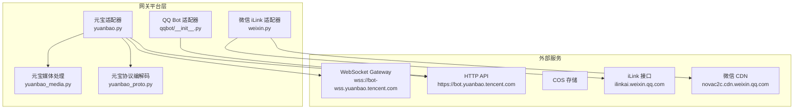
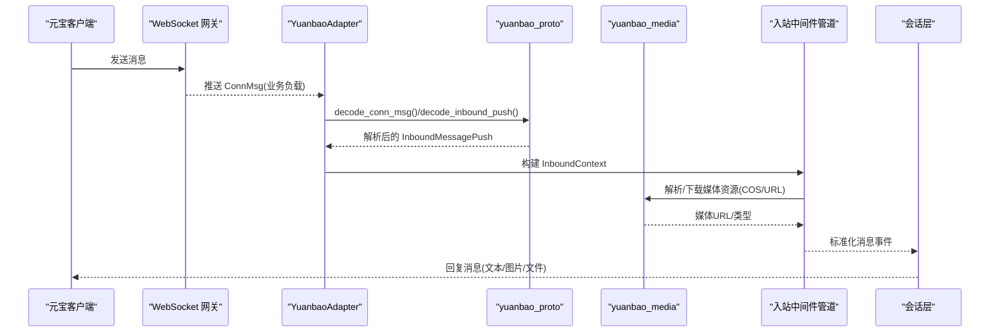
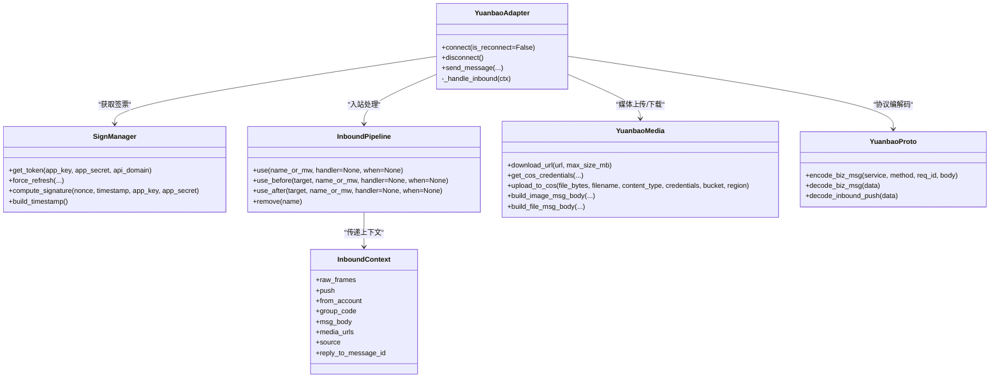
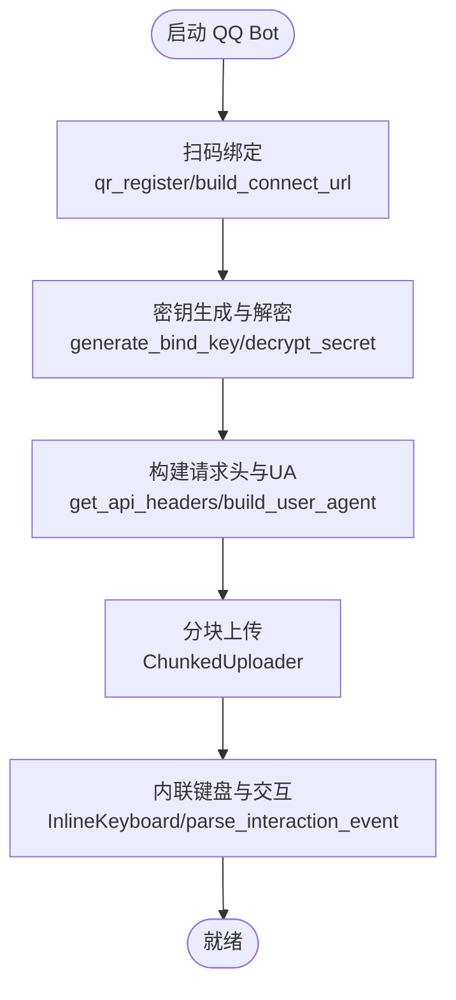
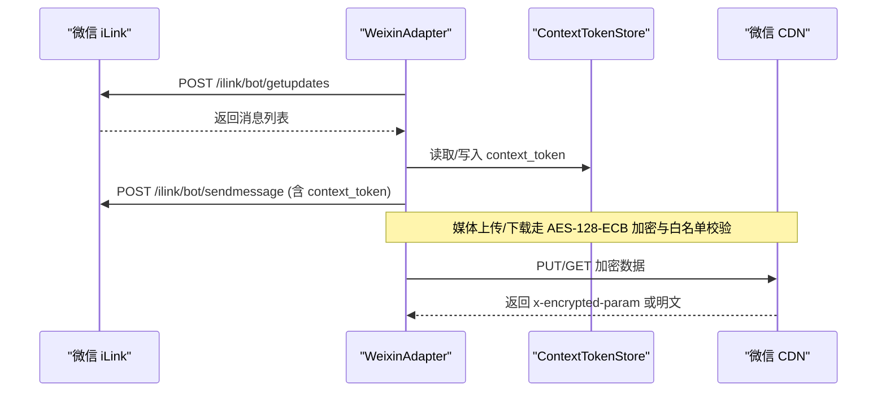
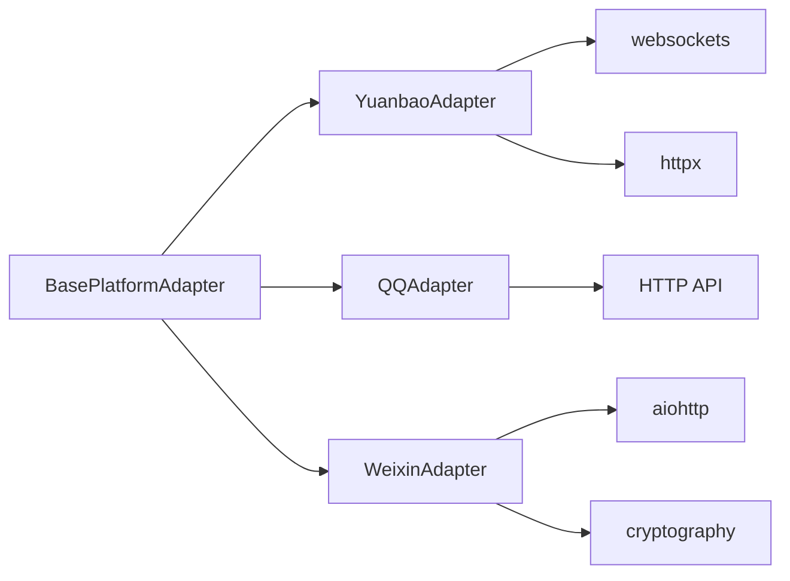

# 国内平台集成

<cite>
**本文引用的文件**
- [gateway/platforms/yuanbao.py](file://gateway/platforms/yuanbao.py)
- [gateway/platforms/yuanbao_media.py](file://gateway/platforms/yuanbao_media.py)
- [gateway/platforms/yuanbao_proto.py](file://gateway/platforms/yuanbao_proto.py)
- [gateway/platforms/qqbot/__init__.py](file://gateway/platforms/qqbot/__init__.py)
- [gateway/platforms/weixin.py](file://gateway/platforms/weixin.py)
- [locales/zh.yaml](file://locales/zh.yaml)
- [tests/gateway/test_adapter_connect_is_reconnect_contract.py](file://tests/gateway/test_adapter_connect_is_reconnect_contract.py)
</cite>

## 目录
1. [简介](#简介)
2. [项目结构](#项目结构)
3. [核心组件](#核心组件)
4. [架构总览](#架构总览)
5. [详细组件分析](#详细组件分析)
6. [依赖关系分析](#依赖关系分析)
7. [性能考量](#性能考量)
8. [故障排查指南](#故障排查指南)
9. [结论](#结论)
10. [附录](#附录)

## 简介
本文件面向在国内平台（元宝、QQ Bot、微信 iLink）集成的开发者与运维人员，系统说明各平台的适配器实现、特殊协议、加密机制、消息格式、本地化与多媒体传输能力，并提供配置要点、API 调用流程与常见问题解决方案。文档基于仓库中现有实现进行梳理，确保可落地、可验证。

## 项目结构
国内平台相关代码主要位于 gateway/platforms 目录下：
- 元宝平台：yuanbao.py、yuanbao_media.py、yuanbao_proto.py
- QQ Bot：qqbot 包（adapter、onboard、crypto、utils、chunked_upload、keyboards 等）
- 微信 iLink：weixin.py
- 中文本地化：locales/zh.yaml
- 平台适配契约测试：tests/gateway/test_adapter_connect_is_reconnect_contract.py

**图表来源**
- [gateway/platforms/yuanbao.py:1-120](file://gateway/platforms/yuanbao.py#L1-L120)
- [gateway/platforms/yuanbao_media.py:1-60](file://gateway/platforms/yuanbao_media.py#L1-L60)
- [gateway/platforms/yuanbao_proto.py:1-100](file://gateway/platforms/yuanbao_proto.py#L1-L100)
- [gateway/platforms/weixin.py:90-115](file://gateway/platforms/weixin.py#L90-L115)

**章节来源**
- [gateway/platforms/yuanbao.py:1-120](file://gateway/platforms/yuanbao.py#L1-L120)
- [gateway/platforms/yuanbao_media.py:1-60](file://gateway/platforms/yuanbao_media.py#L1-L60)
- [gateway/platforms/yuanbao_proto.py:1-100](file://gateway/platforms/yuanbao_proto.py#L1-L100)
- [gateway/platforms/qqbot/__init__.py:1-92](file://gateway/platforms/qqbot/__init__.py#L1-L92)
- [gateway/platforms/weixin.py:90-115](file://gateway/platforms/weixin.py#L90-L115)

## 核心组件
- 元宝平台
  - 连接与认证：通过 WebSocket 长连接，使用 sign-token 获取鉴权票据，建立 AUTH_BIND；心跳保活与重连策略。
  - 消息收发：入站消息解析（InboundMessagePush），出站消息发送（C2C/群组）。
  - 媒体上传：COS 临时凭证签名上传，构建 TIM 图片/文件消息体。
  - 协议编解码：手写 protobuf varint/wire-format，避免引入第三方 protobuf 库。
- QQ Bot
  - 适配器入口与导出：统一从 qqbot 包导出 QQAdapter 及辅助能力（onboard、crypto、utils、chunked_upload、keyboards）。
  - 安全与配置：二维码扫码绑定、AES-256-GCM 密钥生成与解密、用户代理与请求头构造。
- 微信 iLink
  - 长轮询拉取：getupdates 驱动入站消息，sendmessage 回发需携带 context_token。
  - 媒体传输：AES-128-ECB 加密的 CDN 上传/下载，严格白名单校验防止 SSRF。
  - 会话上下文：context_token 持久化缓存，typing 状态管理。

**章节来源**
- [gateway/platforms/yuanbao.py:1-120](file://gateway/platforms/yuanbao.py#L1-L120)
- [gateway/platforms/yuanbao_media.py:1-60](file://gateway/platforms/yuanbao_media.py#L1-L60)
- [gateway/platforms/yuanbao_proto.py:1-100](file://gateway/platforms/yuanbao_proto.py#L1-L100)
- [gateway/platforms/qqbot/__init__.py:1-92](file://gateway/platforms/qqbot/__init__.py#L1-L92)
- [gateway/platforms/weixin.py:90-115](file://gateway/platforms/weixin.py#L90-L115)

## 架构总览
下图展示元宝平台的消息流：客户端消息经 WebSocket 推送至网关，适配器解码为内部事件，再经由中间件管道处理（解码、字段提取、路由、内容提取、引用回复、媒体解析等），最终输出到上层会话。

**图表来源**
- [gateway/platforms/yuanbao.py:640-800](file://gateway/platforms/yuanbao.py#L640-L800)
- [gateway/platforms/yuanbao_proto.py:674-746](file://gateway/platforms/yuanbao_proto.py#L674-L746)
- [gateway/platforms/yuanbao_media.py:200-270](file://gateway/platforms/yuanbao_media.py#L200-L270)

## 详细组件分析

### 元宝平台适配器
- 连接与认证
  - 默认 WebSocket 地址与 API 域名常量定义，心跳间隔、超时、重连次数、关闭超时等参数集中管理。
  - SignManager 负责 sign-token 获取、HMAC-SHA256 签名、北京时区时间戳、缓存与过期刷新、并发锁保护。
- 入站消息处理
  - InboundContext 承载中间件管道上下文，包含原始帧、解码结果、字段提取、聊天路由、内容提取、引用回复、媒体解析等。
  - InboundMiddleware 抽象基类与 InboundPipeline 引擎支持命名中间件、条件守卫、动态插入/移除。
- 媒体处理
  - yuanbao_media 提供 COS 临时凭证获取、HMAC-SHA1 签名上传、图片尺寸解析、TIM 消息体构建（图片/文件）。
- 协议编解码
  - yuanbao_proto 手写 protobuf wire-format，支持 ConnMsg 层与业务层（InboundMessagePush、SendC2CMessageReq 等）编解码，含 WeChat 转发消息解析。

**图表来源**
- [gateway/platforms/yuanbao.py:398-639](file://gateway/platforms/yuanbao.py#L398-L639)
- [gateway/platforms/yuanbao.py:640-800](file://gateway/platforms/yuanbao.py#L640-L800)
- [gateway/platforms/yuanbao_media.py:357-570](file://gateway/platforms/yuanbao_media.py#L357-L570)
- [gateway/platforms/yuanbao_proto.py:429-475](file://gateway/platforms/yuanbao_proto.py#L429-L475)

**章节来源**
- [gateway/platforms/yuanbao.py:1-120](file://gateway/platforms/yuanbao.py#L1-L120)
- [gateway/platforms/yuanbao.py:398-639](file://gateway/platforms/yuanbao.py#L398-L639)
- [gateway/platforms/yuanbao.py:640-800](file://gateway/platforms/yuanbao.py#L640-L800)
- [gateway/platforms/yuanbao_media.py:357-570](file://gateway/platforms/yuanbao_media.py#L357-L570)
- [gateway/platforms/yuanbao_proto.py:429-475](file://gateway/platforms/yuanbao_proto.py#L429-L475)

### QQ Bot 适配器
- 包结构与导出
  - 统一从 qqbot 包导出 QQAdapter、check_qq_requirements、onboard、crypto、utils、chunked_upload、keyboards 等能力，保持导入路径兼容。
- 关键能力
  - onboard：二维码扫码绑定流程，构建连接 URL。
  - crypto：AES-256-GCM 密钥生成与解密。
  - utils：User-Agent 构建、API 请求头构造、列表参数转换。
  - chunked_upload：分块上传与错误类型（每日限额、文件过大）。
  - keyboards：内联键盘与交互事件解析（审批请求、更新提示等）。

**图表来源**
- [gateway/platforms/qqbot/__init__.py:17-92](file://gateway/platforms/qqbot/__init__.py#L17-L92)

**章节来源**
- [gateway/platforms/qqbot/__init__.py:1-92](file://gateway/platforms/qqbot/__init__.py#L1-L92)

### 微信 iLink 适配器
- 长轮询与消息
  - getupdates 拉取消息，sendmessage 回发需携带 context_token；typing 状态通过 sendtyping 控制。
- 媒体传输
  - AES-128-ECB 加密/解密，CDN 上传/下载；严格的域名白名单校验防止 SSRF。
- 会话上下文
  - ContextTokenStore 持久化 context_token；TypingTicketCache 缓存 typing ticket。

**图表来源**
- [gateway/platforms/weixin.py:447-502](file://gateway/platforms/weixin.py#L447-L502)
- [gateway/platforms/weixin.py:549-606](file://gateway/platforms/weixin.py#L549-L606)
- [gateway/platforms/weixin.py:624-683](file://gateway/platforms/weixin.py#L624-L683)

**章节来源**
- [gateway/platforms/weixin.py:90-115](file://gateway/platforms/weixin.py#L90-L115)
- [gateway/platforms/weixin.py:447-502](file://gateway/platforms/weixin.py#L447-L502)
- [gateway/platforms/weixin.py:549-606](file://gateway/platforms/weixin.py#L549-L606)
- [gateway/platforms/weixin.py:624-683](file://gateway/platforms/weixin.py#L624-L683)

## 依赖关系分析
- 平台适配器与基础组件
  - 所有平台适配器继承 BasePlatformAdapter，遵循统一的 connect/disconnect/send/receive 契约。
  - 测试强制要求 connect() 接受 is_reconnect 关键字参数，保障网关重连器能正确回调。
- 外部依赖
  - 元宝：websockets、httpx、腾讯云 COS（通过 HTTP 签名上传）、protobuf wire-format（手写）。
  - QQ Bot：HTTP API、二维码绑定、AES-256-GCM。
  - 微信 iLink：aiohttp、cryptography（AES-128-ECB）、CDN 白名单。

**图表来源**
- [tests/gateway/test_adapter_connect_is_reconnect_contract.py:109-145](file://tests/gateway/test_adapter_connect_is_reconnect_contract.py#L109-L145)

**章节来源**
- [tests/gateway/test_adapter_connect_is_reconnect_contract.py:109-145](file://tests/gateway/test_adapter_connect_is_reconnect_contract.py#L109-L145)

## 性能考量
- 元宝平台
  - 媒体解析并发度可配置（默认 6，上限 12），平衡首字延迟与后端压力。
  - 心跳与重连：连续错过 N 次 pong 触发重连；关闭握手超时限制避免阻塞。
  - Markdown 分块与合并：按段落边界切分，避免打断代码块/表格，提升流式体验。
- 微信 iLink
  - 长轮询超时与重试：getupdates 超时不抛错，避免阻塞；typing 状态短 TTL 缓存减少重复请求。
  - CDN 上传/下载：严格白名单与超时控制，防止慢连接拖垮进程。
- QQ Bot
  - 分块上传：大文件分片上传，避免单次请求过大导致失败。

[本节为通用性能讨论，无需特定文件分析]

## 故障排查指南
- 平台适配器重连契约
  - 若 connect() 未接受 is_reconnect 关键字，网关重连时会抛出异常并静默断开平台。测试会静态扫描所有适配器文件以确保契约一致。
- 元宝平台
  - sign-token 失败：检查 app_key/app_secret、签名计算、北京时间戳；关注可重试错误码与最大重试次数。
  - COS 上传失败：确认临时凭证有效、签名头部正确、bucket/region 匹配；查看日志中的 PUT 请求与响应。
  - 入站消息解析失败：启用 DEBUG_MODE 查看 proto 字节流；检查 ext_map 中 WeChat 转发消息的 base64 编码是否正确。
- 微信 iLink
  - 会话过期：errcode=-14 表示会话失效，需重新登录或刷新 token。
  - 频率限制：ret=-2/errcode=-2 且未知错误时视为会话过期信号，应退避重试。
  - 媒体下载失败：检查 CDN 域名是否在白名单；确认 AES-128-ECB 密钥格式与填充。
- QQ Bot
  - 绑定失败：核对二维码扫码流程与密钥解密；检查 User-Agent 与请求头是否完整。
  - 上传失败：区分“每日限额”与“文件过大”错误，调整分块大小或等待配额重置。

**章节来源**
- [tests/gateway/test_adapter_connect_is_reconnect_contract.py:109-145](file://tests/gateway/test_adapter_connect_is_reconnect_contract.py#L109-L145)
- [gateway/platforms/yuanbao.py:398-639](file://gateway/platforms/yuanbao.py#L398-L639)
- [gateway/platforms/yuanbao_media.py:357-570](file://gateway/platforms/yuanbao_media.py#L357-L570)
- [gateway/platforms/yuanbao_proto.py:674-746](file://gateway/platforms/yuanbao_proto.py#L674-L746)
- [gateway/platforms/weixin.py:118-127](file://gateway/platforms/weixin.py#L118-L127)
- [gateway/platforms/weixin.py:549-606](file://gateway/platforms/weixin.py#L549-L606)
- [gateway/platforms/qqbot/__init__.py:17-92](file://gateway/platforms/qqbot/__init__.py#L17-L92)

## 结论
本项目对国内主流平台提供了稳定、可扩展的适配器实现：
- 元宝平台具备完整的 WebSocket 连接、sign-token 鉴权、protobuf 编解码、COS 媒体上传与 Markdown 流式处理能力。
- QQ Bot 提供扫码绑定、加密通信、分块上传与内联键盘交互，便于审批与工作流集成。
- 微信 iLink 通过长轮询与加密 CDN 实现可靠的消息与媒体传输，具备严格的 SSRF 防护与会话上下文管理。
结合中文本地化与丰富的工具链，可在生产环境中快速部署与运维。

[本节为总结性内容，无需特定文件分析]

## 附录
- 配置要点
  - 元宝：app_id、app_secret、ws_url、api_domain；可选 bot_id、route_env。
  - QQ Bot：通过 onboard 扫码完成绑定；配置 User-Agent 与请求头。
  - 微信 iLink：token、base_url、context_token 持久化；CDN 白名单已内置。
- API 调用示例（路径参考）
  - 元宝 sign-token：SignManager.fetch/get_token
  - 元宝 COS 上传：get_cos_credentials/upload_to_cos
  - 微信 iLink 发消息：_send_message/_get_updates
  - QQ Bot 分块上传：ChunkedUploader
- 常见问题速查
  - 重连失败：检查 connect() 是否接受 is_reconnect。
  - 媒体无法显示：确认 MIME 类型、图片尺寸解析、COS 公网 URL 可达。
  - 会话丢失：微信 iLink 检查 context_token；QQ Bot 检查绑定状态。

[本节为补充信息，无需特定文件分析]