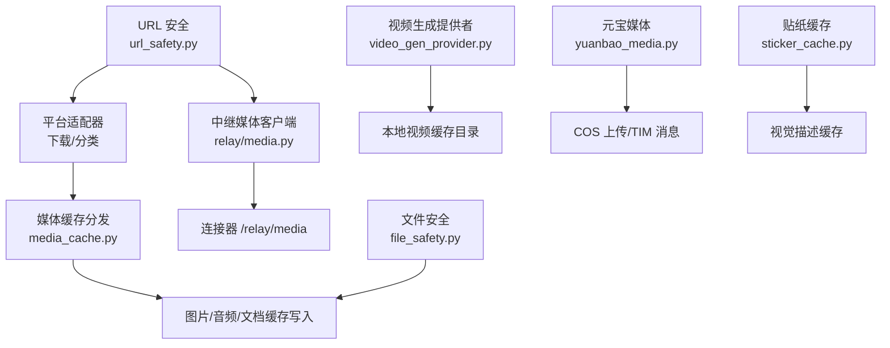
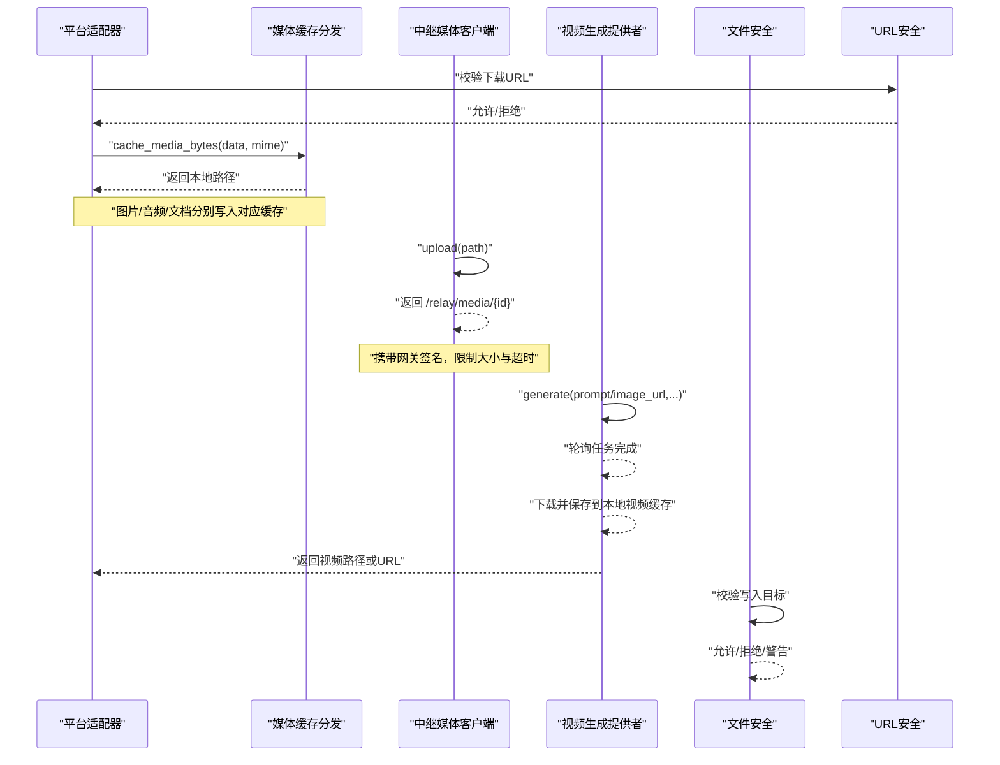
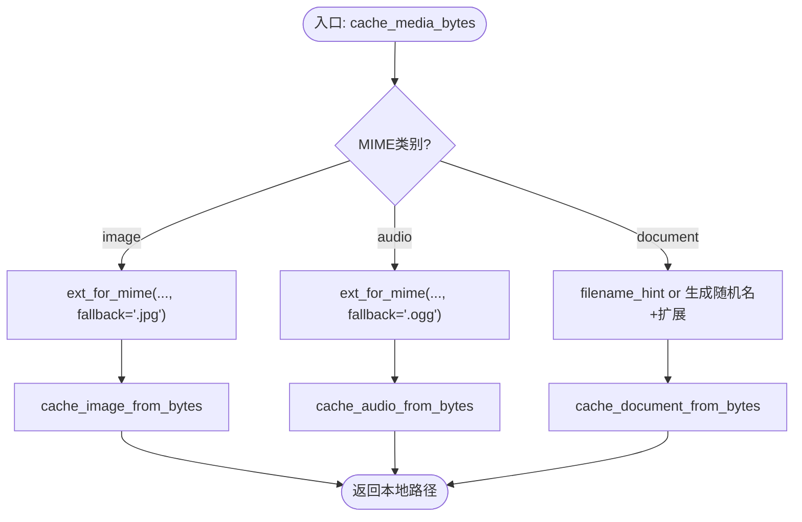
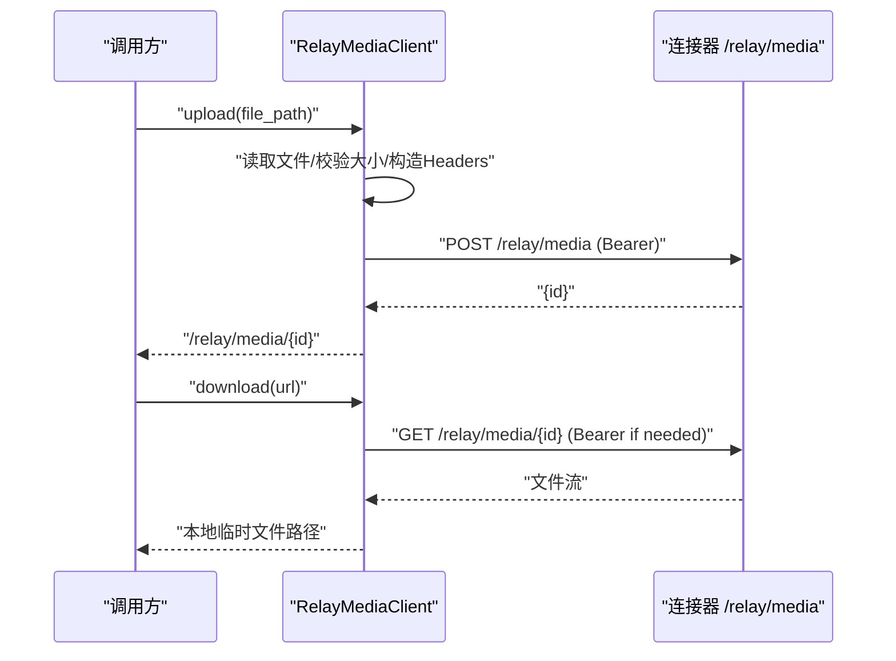
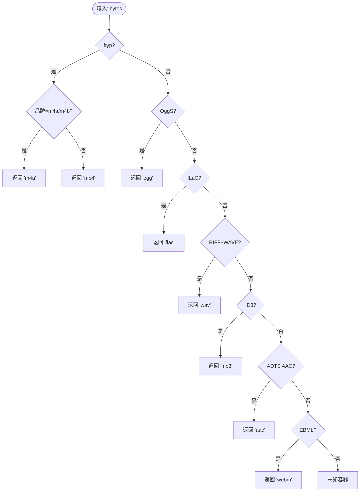
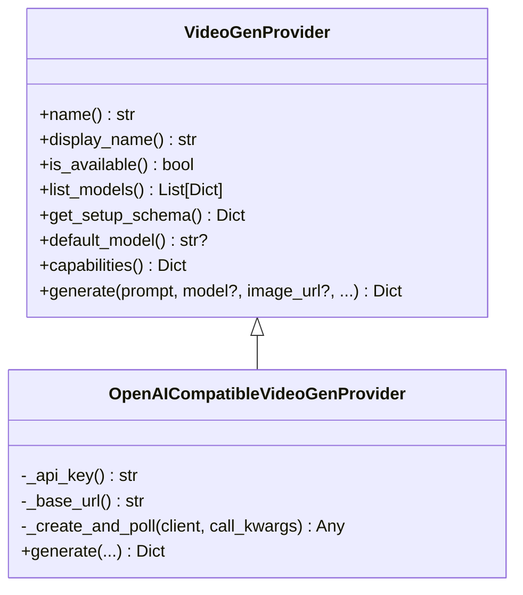
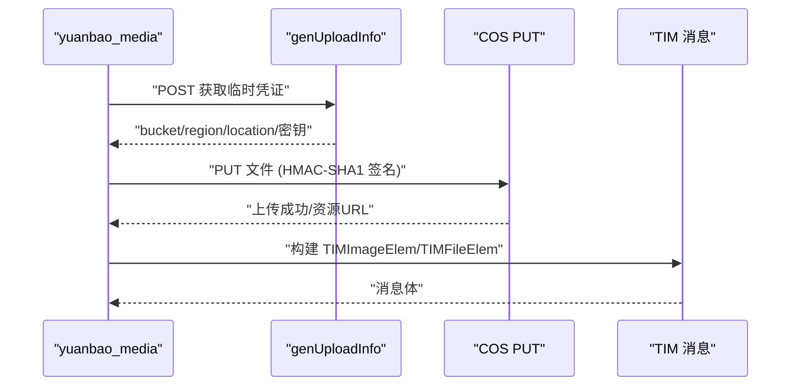
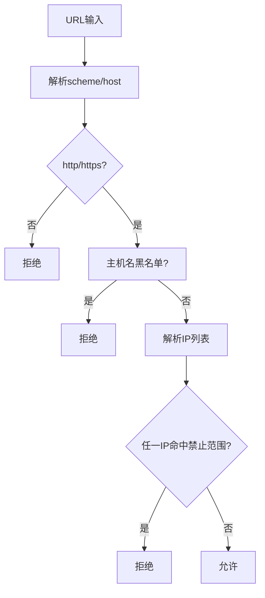
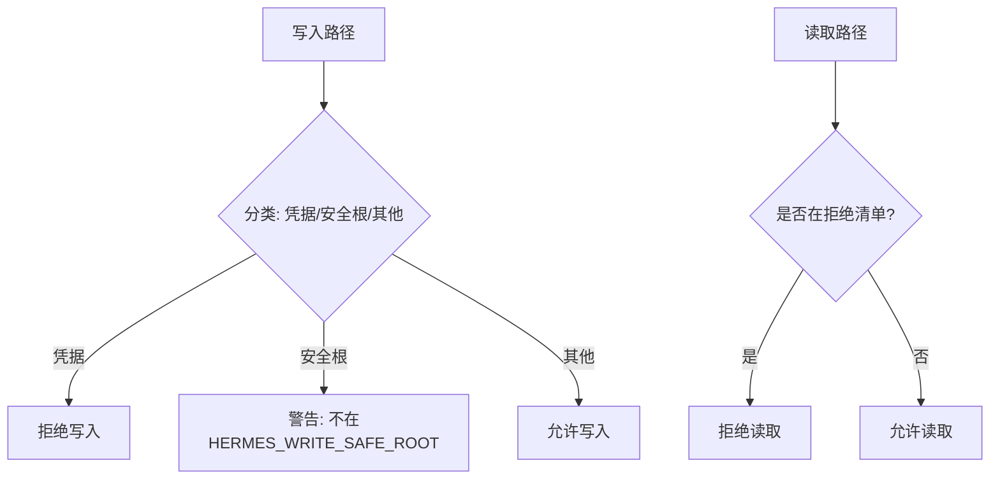
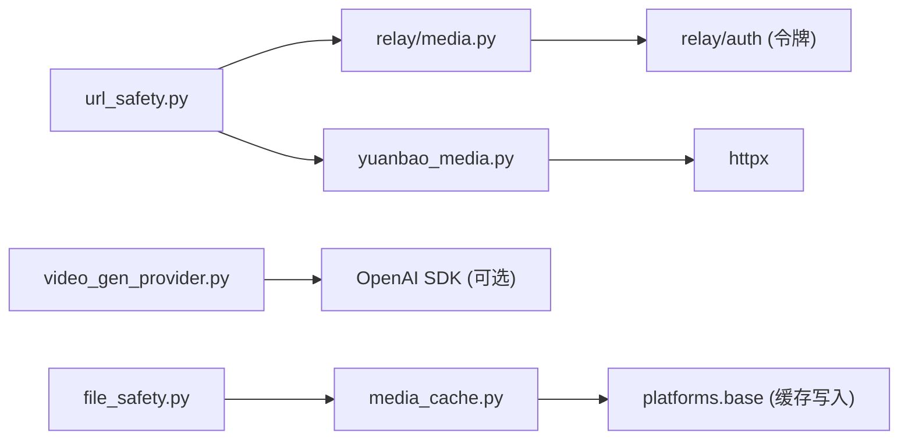

# 媒体处理

<cite>
**本文引用的文件**
- [gateway/platforms/media_cache.py](file://gateway/platforms/media_cache.py)
- [gateway/relay/media.py](file://gateway/relay/media.py)
- [tools/audio_container.py](file://tools/audio_container.py)
- [agent/video_gen_provider.py](file://agent/video_gen_provider.py)
- [gateway/platforms/yuanbao_media.py](file://gateway/platforms/yuanbao_media.py)
- [tools/url_safety.py](file://tools/url_safety.py)
- [agent/file_safety.py](file://agent/file_safety.py)
- [gateway/sticker_cache.py](file://gateway/sticker_cache.py)
</cite>

## 目录
1. [简介](#简介)
2. [项目结构](#项目结构)
3. [核心组件](#核心组件)
4. [架构总览](#架构总览)
5. [详细组件分析](#详细组件分析)
6. [依赖关系分析](#依赖关系分析)
7. [性能考量](#性能考量)
8. [故障排查指南](#故障排查指南)
9. [结论](#结论)
10. [附录](#附录)

## 简介
本文件系统化梳理 Hermes Agent 的媒体处理能力，覆盖以下主题：
- 媒体文件的缓存机制、下载策略与存储管理
- 多格式编码识别、容器嗅探与扩展名修复
- 视频生成提供者的统一接口、轮询与本地化保存
- HTTP 客户端配置、超时控制与连接安全（SSRF）
- 媒体安全扫描、访问权限控制与敏感路径保护

该文档面向不同技术背景的读者，既提供高层架构图，也给出代码级流程图与时序图，帮助快速定位实现位置与关键行为。

## 项目结构
围绕媒体处理的代码主要分布在以下模块：
- 平台侧媒体缓存与分发：gateway/platforms/media_cache.py
- 中继媒体传输（网关↔连接器）：gateway/relay/media.py
- 音频容器嗅探与扩展名修复：tools/audio_container.py
- 视频生成提供者抽象与通用实现：agent/video_gen_provider.py
- 元宝平台媒体上传与消息构建：gateway/platforms/yuanbao_media.py
- URL 安全与 SSRF 防护：tools/url_safety.py
- 文件读写安全与敏感路径保护：agent/file_safety.py
- 贴纸描述缓存（Telegram）：gateway/sticker_cache.py

**图示来源**
- [gateway/platforms/media_cache.py:155-203](file://gateway/platforms/media_cache.py#L155-L203)
- [gateway/relay/media.py:71-203](file://gateway/relay/media.py#L71-L203)
- [agent/video_gen_provider.py:204-316](file://agent/video_gen_provider.py#L204-L316)
- [gateway/platforms/yuanbao_media.py:202-570](file://gateway/platforms/yuanbao_media.py#L202-L570)
- [tools/url_safety.py:415-528](file://tools/url_safety.py#L415-L528)
- [agent/file_safety.py:28-178](file://agent/file_safety.py#L28-L178)
- [gateway/sticker_cache.py:29-92](file://gateway/sticker_cache.py#L29-L92)

**章节来源**
- [gateway/platforms/media_cache.py:1-203](file://gateway/platforms/media_cache.py#L1-L203)
- [gateway/relay/media.py:1-206](file://gateway/relay/media.py#L1-L206)
- [tools/audio_container.py:1-98](file://tools/audio_container.py#L1-L98)
- [agent/video_gen_provider.py:1-591](file://agent/video_gen_provider.py#L1-L591)
- [gateway/platforms/yuanbao_media.py:1-666](file://gateway/platforms/yuanbao_media.py#L1-L666)
- [tools/url_safety.py:1-800](file://tools/url_safety.py#L1-L800)
- [agent/file_safety.py:1-694](file://agent/file_safety.py#L1-L694)
- [gateway/sticker_cache.py:1-125](file://gateway/sticker_cache.py#L1-L125)

## 核心组件
- 媒体缓存分发器：根据 MIME 类型与可选覆盖表，将字节流路由到图片、音频或文档缓存，并决定扩展名。
- 中继媒体客户端：通过标准库 urllib 在子线程中执行上传/下载，携带网关签名令牌，限制大小与超时。
- 音频容器嗅探：基于魔数识别音频/音视频容器，修正扩展名以适配下游 STT/播放器。
- 视频生成提供者：统一抽象文本/图像转视频，内置 OpenAI 兼容后端，带轮询超时与本地持久化。
- 元宝媒体：COS 临时凭证获取、HMAC-SHA1 签名上传、TIM 消息体构建，含 SSRF 检查与大小限制。
- URL 安全：DNS/IP 白名单、云元数据强制拦截、代理环境降级、连接时重校验。
- 文件安全：读/写拒绝清单、跨配置文件/沙箱镜像写入警告。
- 贴纸缓存：对 Telegram 贴纸进行视觉描述缓存，减少重复分析。

**章节来源**
- [gateway/platforms/media_cache.py:97-203](file://gateway/platforms/media_cache.py#L97-L203)
- [gateway/relay/media.py:71-203](file://gateway/relay/media.py#L71-L203)
- [tools/audio_container.py:33-98](file://tools/audio_container.py#L33-L98)
- [agent/video_gen_provider.py:75-196](file://agent/video_gen_provider.py#L75-L196)
- [gateway/platforms/yuanbao_media.py:89-116](file://gateway/platforms/yuanbao_media.py#L89-L116)
- [tools/url_safety.py:163-528](file://tools/url_safety.py#L163-L528)
- [agent/file_safety.py:28-178](file://agent/file_safety.py#L28-L178)
- [gateway/sticker_cache.py:29-92](file://gateway/sticker_cache.py#L29-L92)

## 架构总览
媒体处理的关键交互如下：
- 入站媒体：平台适配器下载 → 媒体缓存分发 → 按类型写入缓存 → 下游工具消费本地路径
- 出站媒体：本地文件 → 中继客户端上传 → 返回引用 URL → send_media 操作使用
- 视频生成：调用提供者 → 异步任务轮询 → 下载/保存本地 → 返回路径或 URL
- 安全层：所有网络请求经 URL 安全检查；文件读写经文件安全策略；部分平台（如元宝）自带 SSRF 与大小限制

**图示来源**
- [gateway/platforms/media_cache.py:155-203](file://gateway/platforms/media_cache.py#L155-L203)
- [gateway/relay/media.py:96-203](file://gateway/relay/media.py#L96-L203)
- [agent/video_gen_provider.py:419-591](file://agent/video_gen_provider.py#L419-L591)
- [tools/url_safety.py:415-528](file://tools/url_safety.py#L415-L528)
- [agent/file_safety.py:161-178](file://agent/file_safety.py#L161-L178)

## 详细组件分析

### 媒体缓存分发（MIME→扩展名→缓存写入）
- 功能要点
  - 维护统一的 MIME→扩展名映射与反向映射，支持每适配器覆盖
  - 自动推断类别（image/audio/document），选择对应缓存写入函数
  - 为图片/音频设置默认扩展名，文档使用文件名提示或随机命名
- 复杂度
  - 查找 O(1)，写入取决于底层缓存实现
- 优化点
  - 复用覆盖表避免重复判断
  - 延迟导入 base 模块以减少启动耦合

**图示来源**
- [gateway/platforms/media_cache.py:97-203](file://gateway/platforms/media_cache.py#L97-L203)

**章节来源**
- [gateway/platforms/media_cache.py:1-203](file://gateway/platforms/media_cache.py#L1-L203)

### 中继媒体客户端（上传/下载）
- 功能要点
  - 上传：读取本地文件，计算 Content-Type，携带 Bearer 令牌 POST 到 /relay/media，返回引用 URL
  - 下载：识别是否需认证，GET 到临时文件，依据 Content-Disposition/Content-Type 推导扩展名
  - 限制：最大 25MB，超时 30s，错误日志记录并返回 None（最佳努力）
- 复杂度
  - I/O 为主，阻塞在网络层；使用线程执行器避免阻塞事件循环
- 优化点
  - 提前 HEAD 检查（某些平台）或响应头长度限制
  - 流式读取防止内存溢出

**图示来源**
- [gateway/relay/media.py:96-203](file://gateway/relay/media.py#L96-L203)

**章节来源**
- [gateway/relay/media.py:1-206](file://gateway/relay/media.py#L1-L206)

### 音频容器嗅探与扩展名修复
- 功能要点
  - 基于魔数识别 m4a/mp4/ogg/flac/wav/mp3/aac/webm
  - 在音频上下文中，MP4 容器统一映射为 .m4a，便于 STT 与语音气泡路由
- 复杂度
  - 头部解析 O(1)，仅读取前若干字节
- 优化点
  - 避免引入重型解码库，降低依赖与开销

**图示来源**
- [tools/audio_container.py:49-80](file://tools/audio_container.py#L49-L80)

**章节来源**
- [tools/audio_container.py:1-98](file://tools/audio_container.py#L1-L98)

### 视频生成提供者（统一接口与通用实现）
- 功能要点
  - 抽象 VideoGenProvider，定义 name、capabilities、generate 等
  - OpenAICompatibleVideoGenProvider 实现文本/图像转视频，带轮询超时与本地保存
  - 支持多种后端（DeepInfra/FAL/OpenAI/Sora），统一成功/错误响应结构
- 复杂度
  - 网络轮询 O(n) 次请求，受超时限制；I/O 写入本地文件
- 优化点
  - 粗粒度轮询间隔 + 硬截止超时，避免无限等待
  - 优先保存本地路径，避免短生命周期 URL 失效

**图示来源**
- [agent/video_gen_provider.py:75-196](file://agent/video_gen_provider.py#L75-L196)
- [agent/video_gen_provider.py:379-591](file://agent/video_gen_provider.py#L379-L591)

**章节来源**
- [agent/video_gen_provider.py:1-591](file://agent/video_gen_provider.py#L1-L591)

### 元宝平台媒体（COS 上传与 TIM 消息）
- 功能要点
  - 下载：HEAD 预检大小，流式 GET，SSRF 检查，限制最大 MB
  - COS 鉴权：HMAC-SHA1 签名，临时凭证，加速域名优先
  - 消息构建：TIMImageElem/TIMFileElem，包含尺寸、UUID、大小等
- 复杂度
  - 网络 I/O 为主；图片尺寸解析 O(1) 头部读取
- 优化点
  - 先 HEAD 再 GET，避免大文件浪费带宽
  - 流式读取，边收边校验大小

**图示来源**
- [gateway/platforms/yuanbao_media.py:202-570](file://gateway/platforms/yuanbao_media.py#L202-L570)
- [gateway/platforms/yuanbao_media.py:575-654](file://gateway/platforms/yuanbao_media.py#L575-L654)

**章节来源**
- [gateway/platforms/yuanbao_media.py:1-666](file://gateway/platforms/yuanbao_media.py#L1-L666)

### URL 安全与 SSRF 防护
- 功能要点
  - is_safe_url：DNS 解析后检查 IP 范围，阻止私有/环回/保留/CGNAT，云元数据始终拦截
  - 代理环境：DNS 失败且配置代理时放行给代理侧解析
  - 连接时校验：httpx 传输包装，确保 connect 阶段再次验证 IP
- 复杂度
  - DNS 解析与 IP 检查 O(k)（k 为解析结果数量）
- 优化点
  - 全局开关缓存，避免重复配置读取
  - 连接时重校验，弥补 DNS 重绑定风险

**图示来源**
- [tools/url_safety.py:415-528](file://tools/url_safety.py#L415-L528)
- [tools/url_safety.py:539-595](file://tools/url_safety.py#L539-L595)

**章节来源**
- [tools/url_safety.py:1-800](file://tools/url_safety.py#L1-L800)

### 文件安全与访问控制
- 功能要点
  - 写拒绝：精确路径与目录前缀（SSH、.env、OAuth 缓存等）
  - 读拒绝：Hermes 内部缓存、凭据文件、项目 .env 等
  - 跨配置文件/沙箱镜像写入：软守卫，输出警告而非硬性阻断
- 复杂度
  - 路径匹配 O(1)~O(n)（n 为规则数量）
- 优化点
  - 集中规则表，便于维护与审计

**图示来源**
- [agent/file_safety.py:28-178](file://agent/file_safety.py#L28-L178)
- [agent/file_safety.py:194-337](file://agent/file_safety.py#L194-L337)

**章节来源**
- [agent/file_safety.py:1-694](file://agent/file_safety.py#L1-L694)

### 贴纸描述缓存（Telegram）
- 功能要点
  - 基于 file_unique_id 缓存视觉描述，减少重复分析
  - 原子写入 JSON 缓存文件，异常清理临时文件
- 复杂度
  - 磁盘 I/O 为主，JSON 序列化 O(n)
- 优化点
  - 原子替换避免损坏缓存

**章节来源**
- [gateway/sticker_cache.py:1-125](file://gateway/sticker_cache.py#L1-L125)

## 依赖关系分析
- 媒体缓存分发依赖基础缓存写入函数（位于 gateway.platforms.base，延迟导入以降低耦合）
- 中继媒体客户端依赖网关认证令牌生成（gateway.relay.auth）
- 视频生成提供者依赖 OpenAI SDK（可选），并封装轮询与本地保存
- 元宝媒体依赖 httpx 与腾讯云 COS 协议，内置 SSRF 检查
- URL 安全被多处网络调用复用，提供同步/异步安全传输包装
- 文件安全被工具与 ACP shim 共享，统一读写策略

**图示来源**
- [gateway/platforms/media_cache.py:173-179](file://gateway/platforms/media_cache.py#L173-L179)
- [gateway/relay/media.py:44-90](file://gateway/relay/media.py#L44-L90)
- [agent/video_gen_provider.py:474-591](file://agent/video_gen_provider.py#L474-L591)
- [gateway/platforms/yuanbao_media.py:20-31](file://gateway/platforms/yuanbao_media.py#L20-L31)
- [tools/url_safety.py:707-752](file://tools/url_safety.py#L707-L752)
- [agent/file_safety.py:28-178](file://agent/file_safety.py#L28-L178)

**章节来源**
- [gateway/platforms/media_cache.py:1-203](file://gateway/platforms/media_cache.py#L1-L203)
- [gateway/relay/media.py:1-206](file://gateway/relay/media.py#L1-L206)
- [agent/video_gen_provider.py:1-591](file://agent/video_gen_provider.py#L1-L591)
- [gateway/platforms/yuanbao_media.py:1-666](file://gateway/platforms/yuanbao_media.py#L1-L666)
- [tools/url_safety.py:1-800](file://tools/url_safety.py#L1-L800)
- [agent/file_safety.py:1-694](file://agent/file_safety.py#L1-L694)

## 性能考量
- 缓存命中率：媒体缓存与贴纸缓存可显著减少重复 I/O 与模型分析
- 网络 I/O：中继媒体与视频生成采用流式下载与大小限制，避免内存峰值
- 轮询策略：视频生成使用粗间隔轮询 + 硬超时，平衡响应时间与资源占用
- 安全校验：URL 安全在 DNS 与连接阶段双重校验，增加少量开销但提升安全性
- 文件写入：原子替换与临时文件清理保证缓存一致性

[本节提供一般性指导，无需特定文件来源]

## 故障排查指南
- 中继媒体上传失败
  - 检查文件大小是否超过 25MB
  - 确认网关 ID 与密钥已配置，令牌有效
  - 查看日志中的 upload failed 警告
- 中继媒体下载失败
  - 确认 URL 是否为中继地址，是否需要 Bearer 认证
  - 检查 Content-Length 与响应头，确认未超限
- 视频生成超时
  - 检查轮询截止时间（默认 900s）与间隔（默认 5s）
  - 确认后端可用性与 API Key
- 下载被 URL 安全拦截
  - 检查目标主机名与解析 IP 是否在禁止范围
  - 若使用代理，确认 DNS 失败场景下的代理配置
- 文件写入被拒绝
  - 检查路径是否在凭据或系统敏感目录
  - 若启用 HERMES_WRITE_SAFE_ROOT，确认写入路径在白名单内

**章节来源**
- [gateway/relay/media.py:117-152](file://gateway/relay/media.py#L117-L152)
- [gateway/relay/media.py:171-202](file://gateway/relay/media.py#L171-L202)
- [agent/video_gen_provider.py:419-441](file://agent/video_gen_provider.py#L419-L441)
- [tools/url_safety.py:415-528](file://tools/url_safety.py#L415-L528)
- [agent/file_safety.py:161-178](file://agent/file_safety.py#L161-L178)

## 结论
Hermes Agent 的媒体处理体系以“安全优先、缓存驱动、统一接口”为核心设计：
- 通过媒体缓存分发与音频容器嗅探，确保多格式兼容与高效复用
- 中继媒体客户端提供安全的网关↔连接器传输通道
- 视频生成提供者统一抽象，屏蔽后端差异并提供健壮轮询与本地化
- URL 安全与文件安全贯穿网络与磁盘 I/O，保障系统稳健运行
- 元宝平台集成展示了云存储与 IM 消息构建的完整链路

建议在生产环境中：
- 合理配置缓存目录与清理策略
- 监控中继媒体与视频生成的成功率与耗时
- 定期审计 URL 安全与文件安全规则，适应新威胁与业务需求

[本节总结性内容，无需特定文件来源]

## 附录
- 相关测试文件（用于理解行为契约与回归保护）
  - tests/gateway/test_media_cache.py
  - tests/gateway/test_media_download_retry.py
  - tests/gateway/test_relay_media.py
  - tests/tools/test_audio_container.py
  - tests/plugins/video_gen/test_*
- 配置与环境变量
  - security.allow_private_urls 与 HERMES_ALLOW_PRIVATE_URLS
  - HERMES_HOME 与 HERMES_WRITE_SAFE_ROOT
  - 各视频生成提供者的 API Key 与 BASE_URL

[本节列出参考信息，无需特定文件来源]