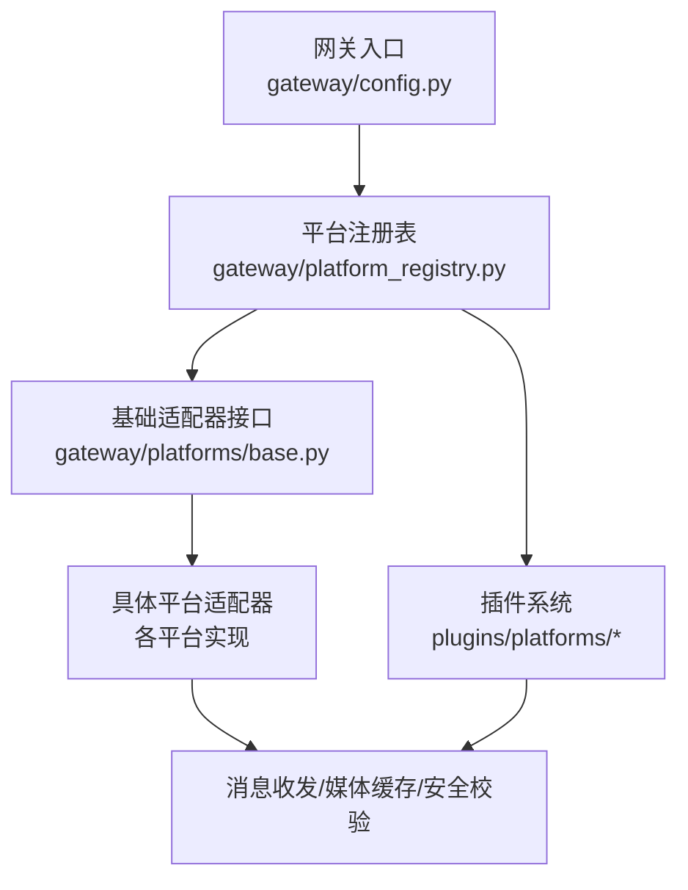
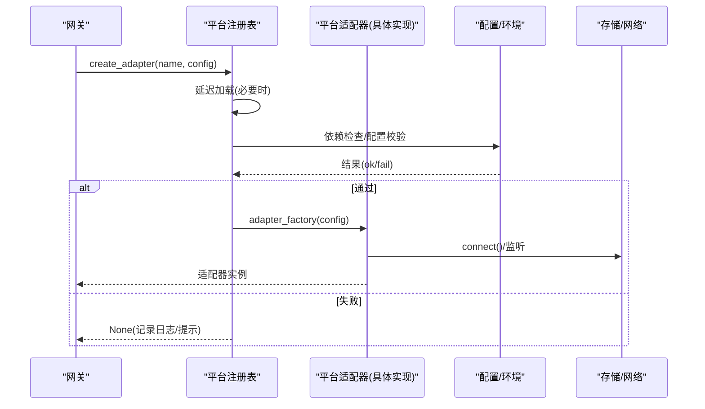
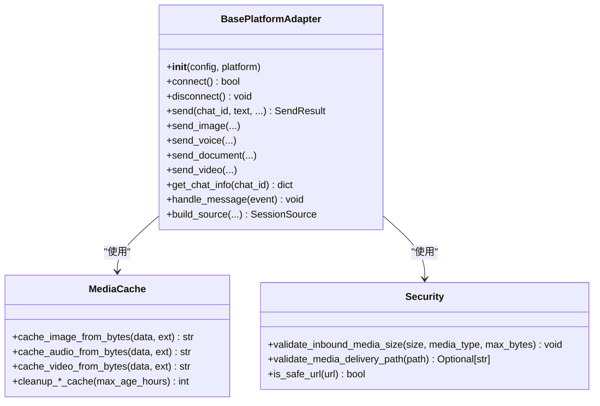
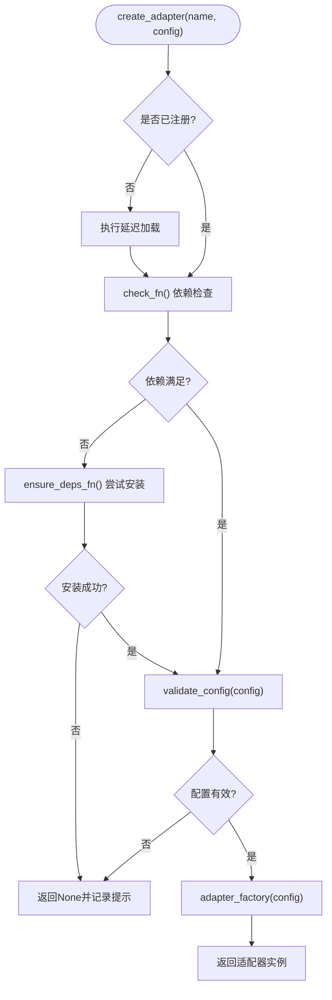
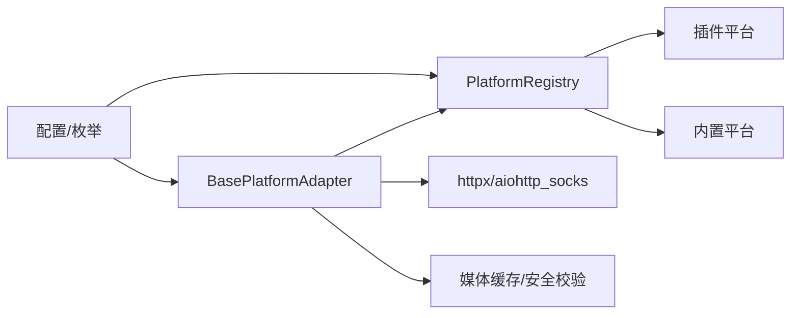

# 平台架构设计

<cite>
**本文引用的文件**
- [gateway/platforms/base.py](file://gateway/platforms/base.py)
- [gateway/platform_registry.py](file://gateway/platform_registry.py)
- [gateway/platforms/__init__.py](file://gateway/platforms/__init__.py)
- [gateway/platforms/ADDING_A_PLATFORM.md](file://gateway/platforms/ADDING_A_PLATFORM.md)
- [gateway/config.py](file://gateway/config.py)
</cite>

## 目录
1. [简介](#简介)
2. [项目结构](#项目结构)
3. [核心组件](#核心组件)
4. [架构总览](#架构总览)
5. [详细组件分析](#详细组件分析)
6. [依赖关系分析](#依赖关系分析)
7. [性能考量](#性能考量)
8. [故障排查指南](#故障排查指南)
9. [结论](#结论)
10. [附录](#附录)

## 简介
本文件面向 Hermes Agent 平台的“平台适配器”体系，系统化阐述 BasePlatformAdapter 的基础接口、生命周期管理、消息处理流程与错误处理机制；说明平台注册机制、插件系统与动态加载过程；文档化平台配置模型、环境变量管理与安全认证流程；并总结平台间通信协议、消息格式标准化与事件驱动架构的设计模式，最后给出开发最佳实践与性能优化建议。

## 项目结构
Hermes 的平台适配层位于 gateway/platforms 下，提供统一的 BasePlatformAdapter 抽象与多种具体平台实现（如 Telegram、Discord、WhatsApp、Weixin、QQBot、Yuanbao 等）。平台通过 gateway/platform_registry 进行统一注册与按需加载，并通过 gateway/config 完成配置与环境变量解析。

图表来源
- [gateway/config.py:272-368](file://gateway/config.py#L272-L368)
- [gateway/platform_registry.py:183-382](file://gateway/platform_registry.py#L183-L382)
- [gateway/platforms/base.py:1-1200](file://gateway/platforms/base.py#L1-L1200)

章节来源
- [gateway/platforms/base.py:1-1200](file://gateway/platforms/base.py#L1-L1200)
- [gateway/platform_registry.py:1-382](file://gateway/platform_registry.py#L1-L382)
- [gateway/config.py:272-368](file://gateway/config.py#L272-L368)

## 核心组件
- BasePlatformAdapter：定义所有平台适配器必须实现的统一接口，包括连接/断开、发送文本/图片/语音/视频/文档、类型指示、会话源构建、消息分发、媒体缓存与安全校验等。
- PlatformRegistry：集中管理平台适配器条目（名称、标签、工厂函数、依赖检查、配置校验、安装提示、环境启用钩子、独立发送器等），支持延迟加载与插件覆盖。
- 平台枚举与配置：Platform 枚举统一管理内置与插件平台标识；配置模块负责从 YAML/环境变量加载平台配置，并提供连接状态判断、端口绑定策略等。

章节来源
- [gateway/platforms/base.py:1-1200](file://gateway/platforms/base.py#L1-L1200)
- [gateway/platform_registry.py:38-181](file://gateway/platform_registry.py#L38-L181)
- [gateway/config.py:272-400](file://gateway/config.py#L272-L400)

## 架构总览
平台适配器采用“统一抽象 + 注册发现 + 延迟加载”的架构：
- 统一抽象：BasePlatformAdapter 定义跨平台一致的消息收发与生命周期方法。
- 注册发现：PlatformRegistry 维护平台条目，支持插件覆盖与延迟导入，避免启动时加载重型 SDK。
- 动态加载：首次访问某平台时触发延迟导入，按需安装依赖并完成配置校验后创建适配器实例。
- 配置与环境：Platform 枚举与配置模块将 YAML 配置与环境变量融合，支持多租户/多 Profile 场景。
- 安全与媒体：统一的媒体下载、缓存、大小限制、SSRF 防护与路径白名单/黑名单校验，保障入站与出站安全。

图表来源
- [gateway/platform_registry.py:299-377](file://gateway/platform_registry.py#L299-L377)
- [gateway/config.py:272-368](file://gateway/config.py#L272-L368)

## 详细组件分析

### BasePlatformAdapter 基础接口与生命周期
- 生命周期
  - 初始化：解析配置、建立平台特定状态、调用基类构造并传入平台标识。
  - 连接：建立长连接或轮询监听，处理重连与退避。
  - 断开：停止监听、关闭连接、取消任务。
- 消息处理
  - 接收：平台侧事件转换为 MessageEvent，调用 handle_message 分派到网关。
  - 发送：send/send_image/send_voice/send_document/send_video 等统一出口，内部复用媒体缓存与安全校验。
  - 线程/引用：根据平台特性计算 reply_to/thread_id 元数据，确保回复与线程路由正确。
- 媒体与安全
  - 入站媒体：统一下载与缓存（图片/音频/视频/文档），带大小上限与重试。
  - 出站媒体：validate_media_delivery_path 基于白名单/黑名单/时效性校验，支持严格模式。
  - SSRF 防护：对重定向目标进行二次校验，防止内网地址泄露。
- 流式 TTS
  - begin_streaming_tts/write_streaming_tts/abort_streaming_tts 提供流式语音输出能力，按平台格式封装 PCM 片段。

图表来源
- [gateway/platforms/base.py:1-1200](file://gateway/platforms/base.py#L1-L1200)

章节来源
- [gateway/platforms/base.py:1-1200](file://gateway/platforms/base.py#L1-L1200)

### 平台注册机制与插件系统
- 平台条目（PlatformEntry）
  - name/label：唯一标识与显示名。
  - adapter_factory：工厂函数，接收 PlatformConfig 返回适配器实例。
  - check_fn/ensure_deps_fn：被动依赖探测与主动依赖安装分离，避免在状态展示中触发安装。
  - validate_config/is_connected：配置校验与连接状态判定。
  - required_env/install_hint/setup_fn：用于 setup 向导与环境提示。
  - env_enablement_fn/apply_yaml_config_fn：从环境变量/YAML 自动启用与字段映射。
  - standalone_sender_fn：进程外发送能力，供 cron 等场景使用。
- 延迟加载
  - register_deferred/_resolve/_resolve_all：仅在需要时导入平台模块，降低 CLI/网关冷启动开销。
- 插件覆盖
  - 同一 name 可被插件重新注册，实现覆盖内置行为。

图表来源
- [gateway/platform_registry.py:299-377](file://gateway/platform_registry.py#L299-L377)

章节来源
- [gateway/platform_registry.py:1-382](file://gateway/platform_registry.py#L1-L382)

### 平台配置模型、环境变量与安全认证
- 平台枚举与动态成员
  - Platform 枚举包含内置平台，同时支持通过 _missing_ 为已知插件平台动态生成成员，保证 identity-stable 比较。
  - 扫描 plugins/platforms 下的 plugin.yaml/yml 以识别捆绑插件平台。
- 配置加载与环境变量
  - 通过 _getenv 系列函数读取环境变量，优先使用当前 secret scope 的值，再回退到 os.getenv。
  - 支持布尔/整数/浮点/字典等类型的强制转换与默认值。
- 端口绑定策略
  - PORT_BINDING_PLATFORM_VALUES 列出会绑定 TCP 端口的平台，避免多 Profile 冲突。
  - PORT_BINDING_CONDITIONAL_MODES 描述某些平台在不同模式下才绑定端口（如飞书 webhook vs websocket）。
- 认证与授权
  - 平台条目可声明 allowed_users_env/allow_all_env，配合网关侧授权逻辑控制用户访问。
  - 插件可通过 setup_fn 提供交互式配置流程。

章节来源
- [gateway/config.py:272-400](file://gateway/config.py#L272-L400)
- [gateway/platform_registry.py:107-181](file://gateway/platform_registry.py#L107-L181)

### 平台间通信协议、消息格式与事件驱动
- 消息格式
  - 统一使用 MessageEvent/SendResult 抽象，屏蔽平台差异。
  - 线程/回复锚点通过 _reply_anchor_for_event 与 _thread_metadata_for_source 计算，确保跨平台路由一致性。
- 事件驱动
  - 平台适配器将入站事件转换为 MessageEvent 后交由网关处理，形成事件驱动的流水线。
- 传输与媒体
  - 统一媒体缓存与大小限制，避免 OOM 与恶意上传。
  - 支持流式 TTS 输出，按平台原生语音格式（如 Ogg/Opus）交付。

章节来源
- [gateway/platforms/base.py:78-151](file://gateway/platforms/base.py#L78-L151)
- [gateway/platforms/base.py:837-927](file://gateway/platforms/base.py#L837-L927)
- [gateway/platforms/base.py:988-1068](file://gateway/platforms/base.py#L988-L1068)

### 错误处理机制
- 依赖与配置错误
  - check_fn/ensure_deps_fn/validate_config 失败时记录警告并返回 None，避免阻塞其他平台。
- 网络与媒体错误
  - 媒体下载带指数退避重试，捕获超时与状态码错误；对 Content-Length 与流式读取进行双重校验。
  - SSRF 防护：对重定向目标进行安全校验，拒绝内网/私有地址。
- 路径安全
  - validate_media_delivery_path 支持严格模式与非严格模式，结合白名单/黑名单/时效性校验，防止敏感文件泄露。

章节来源
- [gateway/platform_registry.py:315-377](file://gateway/platform_registry.py#L315-L377)
- [gateway/platforms/base.py:782-810](file://gateway/platforms/base.py#L782-L810)
- [gateway/platforms/base.py:866-927](file://gateway/platforms/base.py#L866-L927)
- [gateway/platforms/base.py:1463-1542](file://gateway/platforms/base.py#L1463-L1542)

## 依赖关系分析
- 耦合与内聚
  - BasePlatformAdapter 高内聚地封装了媒体、安全、TTS、线程/回复等通用能力，具体平台仅关注协议细节。
  - PlatformRegistry 解耦了平台发现与实例化，支持插件覆盖与延迟加载。
- 外部依赖
  - 各平台 SDK（如 discord.py、slack_bolt、lark_oapi 等）通过延迟导入避免冷启动开销。
  - httpx/aiohttp_socks 用于代理与网络请求，支持 SOCKS/HTTP 代理与远程 DNS 解析。
- 循环依赖
  - 通过延迟导入与模块级 __getattr__ 避免循环导入与不必要的初始化。

图表来源
- [gateway/platforms/base.py:1-1200](file://gateway/platforms/base.py#L1-L1200)
- [gateway/platform_registry.py:183-382](file://gateway/platform_registry.py#L183-L382)
- [gateway/config.py:272-400](file://gateway/config.py#L272-L400)

章节来源
- [gateway/platforms/base.py:1-1200](file://gateway/platforms/base.py#L1-L1200)
- [gateway/platform_registry.py:183-382](file://gateway/platform_registry.py#L183-L382)
- [gateway/config.py:272-400](file://gateway/config.py#L272-L400)

## 性能考量
- 延迟加载：平台模块仅在首次使用时导入，显著减少 CLI/网关冷启动时间。
- 媒体大小限制：入站媒体限制默认 128 MiB，防止大文件导致内存峰值。
- 代理与 DNS：SOCKS 代理启用 rdns=True，绕过 DNS 污染并提升连通性。
- 缓存清理：定期清理过期媒体缓存，释放磁盘空间。
- 流式 TTS：按平台原生格式输出，减少转码开销与延迟。

[本节为通用指导，不直接分析具体文件]

## 故障排查指南
- 依赖未满足
  - 现象：create_adapter 返回 None，日志提示依赖缺失或安装失败。
  - 处理：检查 ensure_deps_fn 是否可用，确认网络与 pip/uv 环境；查看 install_hint。
- 配置无效
  - 现象：validate_config 失败，适配器未创建。
  - 处理：核对 PlatformConfig.extra 与 required_env；使用 hermes setup 向导补齐。
- 媒体下载失败
  - 现象：图片/音频/视频无法缓存，抛出异常。
  - 处理：检查 URL 安全性、Content-Length、网络代理与重试次数；确认大小未超限。
- 出站路径被拒
  - 现象：validate_media_delivery_path 返回 None。
  - 处理：确认文件位于白名单目录或处于时效窗口；严格模式下调整 HERMES_MEDIA_DELIVERY_STRICT 与相关环境变量。
- 端口冲突
  - 现象：多 Profile 下端口绑定失败。
  - 处理：避免在次要 Profile 启用端口绑定型平台；参考 PORT_BINDING_PLATFORM_VALUES。

章节来源
- [gateway/platform_registry.py:315-377](file://gateway/platform_registry.py#L315-L377)
- [gateway/platforms/base.py:782-810](file://gateway/platforms/base.py#L782-L810)
- [gateway/platforms/base.py:866-927](file://gateway/platforms/base.py#L866-L927)
- [gateway/platforms/base.py:1463-1542](file://gateway/platforms/base.py#L1463-L1542)
- [gateway/config.py:376-400](file://gateway/config.py#L376-L400)

## 结论
Hermes 平台适配器体系通过统一抽象、注册发现与延迟加载，实现了高扩展性与低耦合；借助严格的媒体安全与配置模型，保障了多平台接入的安全性与稳定性。遵循本文的最佳实践与性能建议，可高效开发与运维新的平台适配器。

[本节为总结性内容，不直接分析具体文件]

## 附录

### 新增平台适配器最佳实践
- 继承 BasePlatformAdapter，实现必要方法与可选交互能力（按钮/选择器）。
- 通过 PlatformRegistry.register_platform 注册条目，声明依赖检查、配置校验与环境启用钩子。
- 遵循消息与媒体规范，使用统一缓存与安全校验工具。
- 在配置模块中补充平台枚举、环境变量与端口绑定策略。
- 编写测试覆盖初始化、配置加载、发送/接收流程与错误分支。

章节来源
- [gateway/platforms/ADDING_A_PLATFORM.md:1-405](file://gateway/platforms/ADDING_A_PLATFORM.md#L1-L405)
- [gateway/platforms/__init__.py:1-46](file://gateway/platforms/__init__.py#L1-L46)
- [gateway/platform_registry.py:38-181](file://gateway/platform_registry.py#L38-L181)
- [gateway/config.py:272-400](file://gateway/config.py#L272-L400)