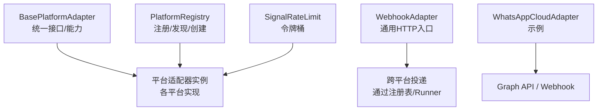
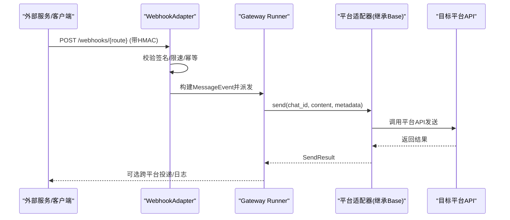
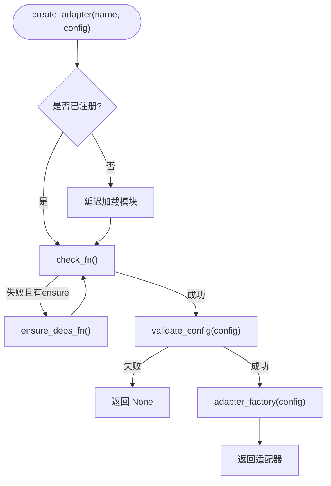
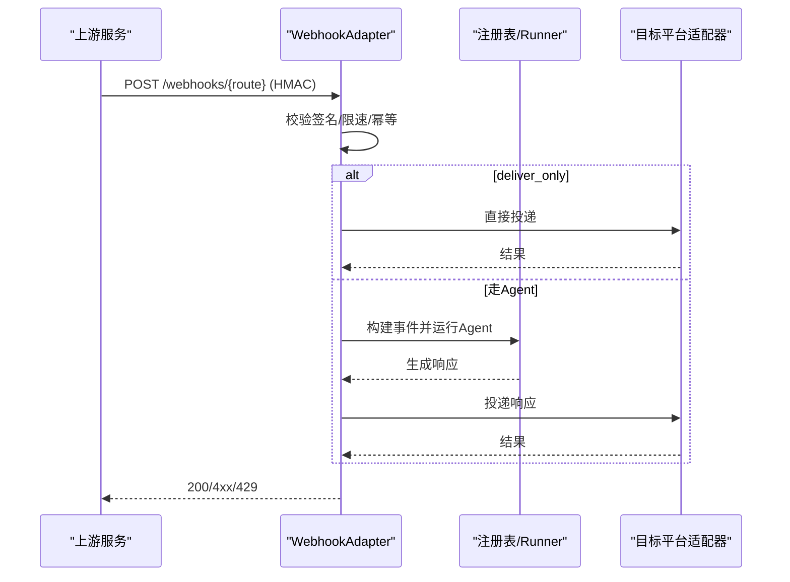
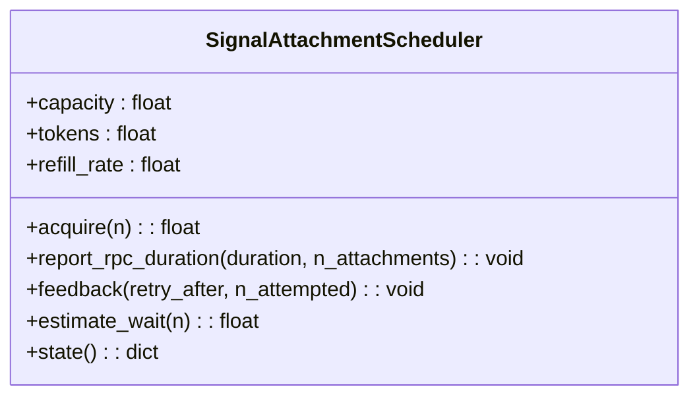
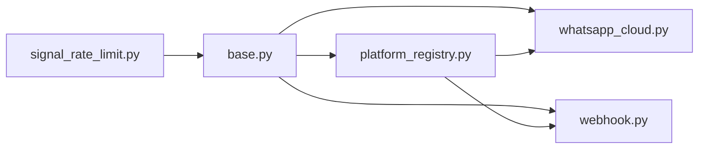

# 平台集成

<cite>
**本文引用的文件**
- [gateway/platforms/base.py](file://gateway/platforms/base.py)
- [gateway/platform_registry.py](file://gateway/platform_registry.py)
- [gateway/platforms/webhook.py](file://gateway/platforms/webhook.py)
- [gateway/platforms/whatsapp_cloud.py](file://gateway/platforms/whatsapp_cloud.py)
- [gateway/platforms/signal_rate_limit.py](file://gateway/platforms/signal_rate_limit.py)
- [gateway/platforms/ADDING_A_PLATFORM.md](file://gateway/platforms/ADDING_A_PLATFORM.md)
</cite>

## 目录
1. [简介](#简介)
2. [项目结构](#项目结构)
3. [核心组件](#核心组件)
4. [架构总览](#架构总览)
5. [详细组件分析](#详细组件分析)
6. [依赖关系分析](#依赖关系分析)
7. [性能考量](#性能考量)
8. [故障排查指南](#故障排查指南)
9. [结论](#结论)
10. [附录](#附录)

## 简介
本文件面向需要在消息网关中接入新平台的开发者，系统性说明平台适配器架构、生命周期管理、认证与鉴权、消息格式转换、错误处理与重试策略、速率限制、连接管理与资源清理，以及配置与环境变量、安全最佳实践和测试调试方法。文档基于仓库中的基础适配器、注册表、通用 Webhook 适配器和若干平台实现进行提炼与归纳。

## 项目结构
- 平台适配器基类与公共能力集中在 gateway/platforms/base.py，提供统一的接口、媒体处理、代理与网络工具、TTS 流式输出等。
- 平台注册表 gateway/platform_registry.py 负责插件与内置适配器的发现、依赖检查、配置校验与实例化。
- 通用 Webhook 适配器 gateway/platforms/webhook.py 提供可配置的 HTTP 接收、HMAC 签名校验、路由、限速、幂等与跨平台投递。
- 具体平台示例：WhatsApp Cloud 适配器 gateway/platforms/whatsapp_cloud.py，展示官方 API 的认证、Webhook 验证、媒体上传与大小限制等。
- 速率限制示例：Signal 附件发送的令牌桶调度器 gateway/platforms/signal_rate_limit.py，演示如何根据服务端反馈校准速率。
- 新增平台指南 gateway/platforms/ADDING_A_PLATFORM.md 给出从插件路径或内置路径集成的完整清单。

图表来源
- [gateway/platforms/base.py:1-120](file://gateway/platforms/base.py#L1-L120)
- [gateway/platform_registry.py:183-382](file://gateway/platform_registry.py#L183-L382)
- [gateway/platforms/webhook.py:177-403](file://gateway/platforms/webhook.py#L177-L403)
- [gateway/platforms/whatsapp_cloud.py:1-200](file://gateway/platforms/whatsapp_cloud.py#L1-L200)
- [gateway/platforms/signal_rate_limit.py:170-375](file://gateway/platforms/signal_rate_limit.py#L170-L375)

章节来源
- [gateway/platforms/base.py:1-120](file://gateway/platforms/base.py#L1-L120)
- [gateway/platform_registry.py:183-382](file://gateway/platform_registry.py#L183-L382)
- [gateway/platforms/webhook.py:177-403](file://gateway/platforms/webhook.py#L177-L403)
- [gateway/platforms/whatsapp_cloud.py:1-200](file://gateway/platforms/whatsapp_cloud.py#L1-L200)
- [gateway/platforms/signal_rate_limit.py:170-375](file://gateway/platforms/signal_rate_limit.py#L170-L375)
- [gateway/platforms/ADDING_A_PLATFORM.md:1-405](file://gateway/platforms/ADDING_A_PLATFORM.md#L1-L405)

## 核心组件
- BasePlatformAdapter：所有平台适配器的抽象基类，定义 connect/disconnect/send/typing/get_chat_info 等接口，并提供媒体缓存、代理解析、TTS 流式输出、消息长度截断等通用能力。
- PlatformRegistry：集中管理平台条目（名称、标签、工厂函数、依赖检查、配置校验、安装提示、环境变量、YAML→环境桥接、独立发送器等），并负责延迟加载与实例化。
- WebhookAdapter：通用 HTTP 入口，支持多路由、HMAC 签名校验、事件过滤、脚本预处理、限速、幂等、deliver_only 直投与跨平台投递。
- WhatsAppCloudAdapter：以 Meta Cloud API 为例，展示 OAuth/Token、Webhook HMAC 校验、媒体上传大小限制、MIME 扩展映射、会话窗口等。
- SignalAttachmentScheduler：进程级令牌桶，模拟服务端附件速率限制，支持 Retry-After 反馈校准与并发序列化。

章节来源
- [gateway/platforms/base.py:1-120](file://gateway/platforms/base.py#L1-L120)
- [gateway/platform_registry.py:38-181](file://gateway/platform_registry.py#L38-L181)
- [gateway/platforms/webhook.py:177-403](file://gateway/platforms/webhook.py#L177-L403)
- [gateway/platforms/whatsapp_cloud.py:1-200](file://gateway/platforms/whatsapp_cloud.py#L1-L200)
- [gateway/platforms/signal_rate_limit.py:170-375](file://gateway/platforms/signal_rate_limit.py#L170-L375)

## 架构总览
平台适配器采用“基类 + 注册表 + 具体实现”的分层设计：
- 基类统一接口与通用逻辑，屏蔽平台差异。
- 注册表解耦平台发现与实例化，支持插件与内置混合，延迟加载重型 SDK。
- 具体适配器专注协议细节（认证、消息格式、媒体、重连）。
- Webhook 作为通用入站通道，将外部事件转换为内部消息事件，再交由网关调度。

图表来源
- [gateway/platforms/webhook.py:584-800](file://gateway/platforms/webhook.py#L584-L800)
- [gateway/platforms/base.py:1-120](file://gateway/platforms/base.py#L1-L120)

章节来源
- [gateway/platforms/webhook.py:584-800](file://gateway/platforms/webhook.py#L584-L800)
- [gateway/platforms/base.py:1-120](file://gateway/platforms/base.py#L1-L120)

## 详细组件分析

### 基础适配器与生命周期
- 生命周期
  - connect：建立连接、启动监听、初始化资源；失败需回滚已分配资源。
  - disconnect：停止监听、关闭连接、取消任务、释放资源。
  - send/typing/get_chat_info：出站消息、输入指示、聊天信息。
- 通用能力
  - 代理解析与绕过（NO_PROXY/no_proxy、macOS 系统代理）。
  - 媒体下载与大小限制（防止 OOM）。
  - TTS 流式输出句柄与抑制逻辑。
  - UTF-16 长度计算与消息截断。
- 建议
  - 在 connect 中做最小化依赖加载，避免启动阻塞。
  - 使用异步锁/信号量保护共享状态。
  - 对长连接实现指数退避+抖动重连。

章节来源
- [gateway/platforms/base.py:1-120](file://gateway/platforms/base.py#L1-L120)
- [gateway/platforms/base.py:417-517](file://gateway/platforms/base.py#L417-L517)
- [gateway/platforms/base.py:738-800](file://gateway/platforms/base.py#L738-L800)

### 平台注册表与延迟加载
- 职责
  - 维护 PlatformEntry（名称、标签、工厂、依赖检查、配置校验、安装提示、环境变量、YAML→环境桥接、独立发送器等）。
  - 延迟加载：仅在实际使用时导入重型模块，缩短冷启动时间。
  - create_adapter：按顺序执行依赖检查→按需安装→配置校验→工厂实例化。
- 关键点
  - check_fn 必须无副作用；ensure_deps_fn 用于主动安装依赖。
  - validate_config 可在构造前尽早发现错误。
  - standalone_sender_fn 支持 cron 等进程外场景的独立发送。

图表来源
- [gateway/platform_registry.py:299-377](file://gateway/platform_registry.py#L299-L377)

章节来源
- [gateway/platform_registry.py:38-181](file://gateway/platform_registry.py#L38-L181)
- [gateway/platform_registry.py:299-377](file://gateway/platform_registry.py#L299-L377)

### Webhook 适配器：认证、路由与投递
- 认证与安全
  - 每路由强制 HMAC secret；支持 V2 签名（含时间戳防重放）。
  - INSECURE_NO_AUTH 仅限本地环回绑定，防止公网暴露。
  - 请求体大小限制（Content-Length 与实际读取双重校验）。
- 路由与处理
  - 静态/动态路由合并；事件类型过滤；脚本预处理。
  - deliver_only 跳过 Agent，直接投递到目标平台。
- 限速与幂等
  - 固定窗口限速；去重缓存（delivery ID TTL）。
- 跨平台投递
  - 通过注册表识别目标平台，调用对应适配器发送。

图表来源
- [gateway/platforms/webhook.py:177-403](file://gateway/platforms/webhook.py#L177-L403)
- [gateway/platforms/webhook.py:584-800](file://gateway/platforms/webhook.py#L584-L800)

章节来源
- [gateway/platforms/webhook.py:177-403](file://gateway/platforms/webhook.py#L177-L403)
- [gateway/platforms/webhook.py:584-800](file://gateway/platforms/webhook.py#L584-L800)

### WhatsApp Cloud 适配器：认证、媒体与限制
- 认证
  - 使用系统用户永久访问令牌；可选应用密钥用于 Webhook HMAC。
- Webhook
  - 默认双栈监听；可配置 host/port/path；X-Hub-Signature-256 校验。
- 媒体
  - 严格的大小限制（image/video/audio/document/sticker）。
  - MIME 到扩展映射覆盖，保证下游工具兼容性。
- 会话窗口
  - 24 小时对话窗口与模板消息回退策略。

章节来源
- [gateway/platforms/whatsapp_cloud.py:1-200](file://gateway/platforms/whatsapp_cloud.py#L1-L200)

### Signal 附件速率限制：令牌桶与反馈校准
- 令牌桶
  - 容量与服务端一致；按 Retry-After 校准 refill_rate。
  - 并发 acquire 通过 asyncio.Lock 序列化，FIFO 公平。
- 反馈
  - 捕获 429 及 retry_after，更新桶状态与速率。
- 超时
  - 根据附件数量调整 RPC 超时，避免误报。

图表来源
- [gateway/platforms/signal_rate_limit.py:170-375](file://gateway/platforms/signal_rate_limit.py#L170-L375)

章节来源
- [gateway/platforms/signal_rate_limit.py:170-375](file://gateway/platforms/signal_rate_limit.py#L170-L375)

### 开发新平台适配器的步骤（插件路径优先）
- 推荐插件路径
  - 在 ~/.hermes/plugins/ 或 plugins/platforms/ 下创建 adapter.py 与 plugin.yaml。
  - 继承 BasePlatformAdapter，实现必要方法；在 register(ctx) 中通过 ctx.register_platform() 注册。
  - 利用可选钩子：env_enablement_fn、apply_yaml_config_fn、cron_deliver_env_var、standalone_sender_fn。
- 内置路径（核心贡献者）
  - 在 config 枚举、run 工厂、授权映射、SessionSource、系统提示、工具集、Cron、send_message 工具、渠道目录、状态显示、设置向导、脱敏、文档与测试等多处补齐。
- 关键模式
  - 使用 build_source/handle_message 构建事件；过滤自消息与同步回声；敏感标识脱敏；重连指数退避+抖动；必要时设置 MAX_MESSAGE_LENGTH。

章节来源
- [gateway/platforms/ADDING_A_PLATFORM.md:1-405](file://gateway/platforms/ADDING_A_PLATFORM.md#L1-L405)

## 依赖关系分析
- 耦合与内聚
  - base.py 高内聚于通用能力；各平台适配器低耦合地实现协议细节。
  - platform_registry.py 解耦平台发现与实例化，降低核心代码与第三方 SDK 的耦合。
- 外部依赖
  - aiohttp/httpx 等仅在需要时导入（延迟加载），减少启动开销。
  - 平台 SDK（如 WhatsApp Graph、Signal CLI）按需安装与校验。
- 循环依赖
  - 通过延迟导入与回调（如 Webhook 跨平台投递）避免循环。

图表来源
- [gateway/platforms/base.py:1-120](file://gateway/platforms/base.py#L1-L120)
- [gateway/platform_registry.py:183-382](file://gateway/platform_registry.py#L183-L382)
- [gateway/platforms/whatsapp_cloud.py:1-200](file://gateway/platforms/whatsapp_cloud.py#L1-L200)
- [gateway/platforms/webhook.py:177-403](file://gateway/platforms/webhook.py#L177-L403)
- [gateway/platforms/signal_rate_limit.py:170-375](file://gateway/platforms/signal_rate_limit.py#L170-L375)

章节来源
- [gateway/platforms/base.py:1-120](file://gateway/platforms/base.py#L1-L120)
- [gateway/platform_registry.py:183-382](file://gateway/platform_registry.py#L183-L382)
- [gateway/platforms/whatsapp_cloud.py:1-200](file://gateway/platforms/whatsapp_cloud.py#L1-L200)
- [gateway/platforms/webhook.py:177-403](file://gateway/platforms/webhook.py#L177-L403)
- [gateway/platforms/signal_rate_limit.py:170-375](file://gateway/platforms/signal_rate_limit.py#L170-L375)

## 性能考量
- 延迟加载：平台模块与重型 SDK 仅在首次使用时导入，显著缩短启动时间。
- 媒体限制：入站媒体缓冲上限与流式读取，防止内存爆炸。
- 速率限制：令牌桶与固定窗口限速，结合服务端 Retry-After 校准，避免 429 风暴。
- 连接复用：aiohttp/httpx 连接池与代理连接器，提升吞吐。
- 并发控制：异步锁/信号量保护共享状态，避免竞争。

[本节为通用指导，不直接分析具体文件]

## 故障排查指南
- 依赖缺失
  - 现象：create_adapter 返回 None，日志提示依赖未满足。
  - 处理：确认 check_fn/ensure_deps_fn 是否正确；查看 install_hint。
- 配置错误
  - 现象：validate_config 失败或 connect 时报错。
  - 处理：核对 YAML/环境变量；使用 hermes setup/gateway status 检查。
- 认证失败
  - Webhook：检查 HMAC secret、V2 签名头、时间戳；确认非环回禁用 INSECURE_NO_AUTH。
  - WhatsApp：确认访问令牌与应用密钥；检查 Webhook verify_token。
- 速率限制
  - 现象：429 或限流日志。
  - 处理：观察限速窗口；根据 Retry-After 调整；检查令牌桶状态。
- 媒体问题
  - 现象：上传失败或格式不被接受。
  - 处理：检查 MIME 与扩展映射；确认文件大小限制；确保 ffmpeg 可用（如需转码）。
- 连接与重连
  - 现象：长连接断开。
  - 处理：确认指数退避+抖动策略；检查网络代理与 NO_PROXY。

章节来源
- [gateway/platform_registry.py:299-377](file://gateway/platform_registry.py#L299-L377)
- [gateway/platforms/webhook.py:248-351](file://gateway/platforms/webhook.py#L248-L351)
- [gateway/platforms/webhook.py:584-800](file://gateway/platforms/webhook.py#L584-L800)
- [gateway/platforms/whatsapp_cloud.py:1-200](file://gateway/platforms/whatsapp_cloud.py#L1-L200)
- [gateway/platforms/signal_rate_limit.py:170-375](file://gateway/platforms/signal_rate_limit.py#L170-L375)

## 结论
通过 BasePlatformAdapter 的统一接口与 PlatformRegistry 的灵活注册机制，平台适配器实现了高内聚、低耦合的可插拔架构。Webhook 适配器提供了通用的入站通道与安全的处理能力，而 WhatsApp 与 Signal 的实现展示了认证、媒体、速率限制与反馈校准的最佳实践。遵循本文档的步骤与规范，可高效、安全地集成新的消息平台。

[本节为总结，不直接分析具体文件]

## 附录

### 平台特定配置与环境变量（示例）
- WhatsApp Cloud
  - 必需：WHATSAPP_CLOUD_PHONE_NUMBER_ID、WHATSAPP_CLOUD_ACCESS_TOKEN
  - 可选：WHATSAPP_CLOUD_APP_ID、WHATSAPP_CLOUD_APP_SECRET、WHATSAPP_CLOUD_WABA_ID、WHATSAPP_CLOUD_VERIFY_TOKEN、WHATSAPP_CLOUD_WEBHOOK_HOST/PORT/PATH、WHATSAPP_CLOUD_API_VERSION
- Webhook
  - routes.*.secret：HMAC 密钥（必填）
  - rate_limit：每分钟请求数
  - max_body_bytes：请求体大小限制
  - script_timeout_seconds：脚本执行超时
- Signal
  - 通过 signal-cli 版本与 RPC 错误码获取 retry_after；令牌桶容量与默认间隔已在实现中设定。

章节来源
- [gateway/platforms/whatsapp_cloud.py:27-40](file://gateway/platforms/whatsapp_cloud.py#L27-L40)
- [gateway/platforms/webhook.py:177-243](file://gateway/platforms/webhook.py#L177-L243)
- [gateway/platforms/signal_rate_limit.py:33-38](file://gateway/platforms/signal_rate_limit.py#L33-L38)

### 安全最佳实践
- 认证
  - 强制 HMAC 签名；优先使用 V2 签名（含时间戳）；禁止在生产环境使用 INSECURE_NO_AUTH。
- 输入校验
  - 先校验 Content-Length，再读取 body；对 JSON/表单解析失败返回明确错误。
- 速率限制
  - 启用固定窗口限速；对高频路由单独限制。
- 隐私
  - 日志中脱敏敏感标识（电话号、令牌等）；会话描述可开启 PII 安全。
- 代理与网络
  - 支持 NO_PROXY/no_proxy；自动检测 macOS 系统代理；SOCKS 通过 connector 注入。

章节来源
- [gateway/platforms/webhook.py:177-243](file://gateway/platforms/webhook.py#L177-L243)
- [gateway/platforms/webhook.py:584-800](file://gateway/platforms/webhook.py#L584-L800)
- [gateway/platforms/base.py:417-517](file://gateway/platforms/base.py#L417-L517)

### 测试与调试技巧
- 单元测试
  - 覆盖：平台枚举、配置加载、适配器初始化、辅助函数、SessionSource 往返、授权集成、send_message 路由。
- 集成测试
  - 模拟平台 API 与 Webhook 回调；验证 HMAC 校验、限速、幂等、跨平台投递。
- 调试
  - 使用 hermes setup/gateway status 检查平台状态；查看日志中的依赖安装与配置校验信息；对 Webhook 使用 curl 模拟请求并检查签名。

章节来源
- [gateway/platforms/ADDING_A_PLATFORM.md:372-405](file://gateway/platforms/ADDING_A_PLATFORM.md#L372-L405)