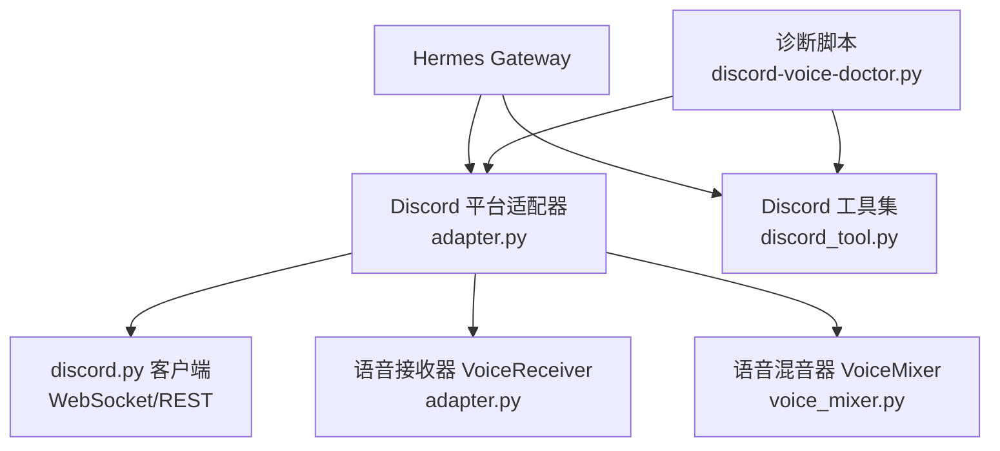
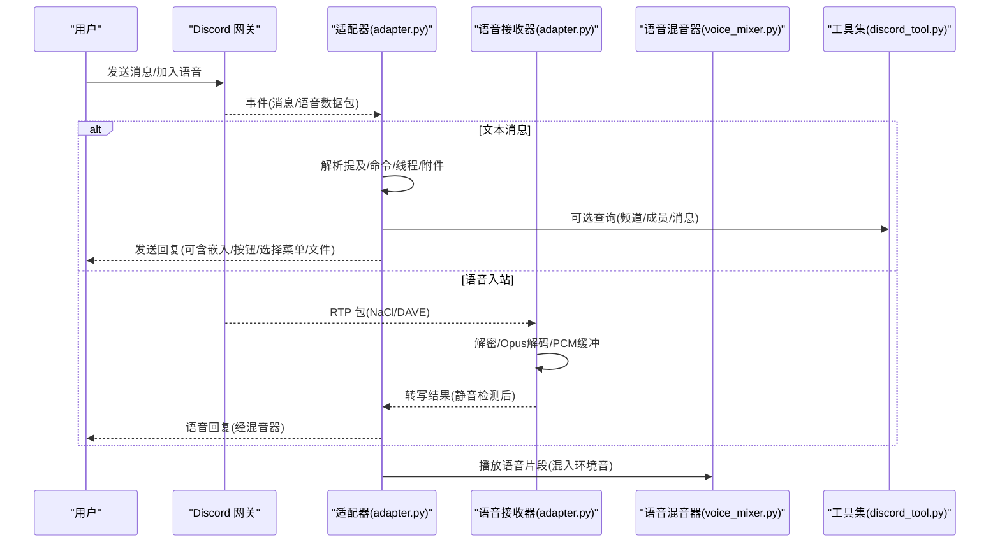
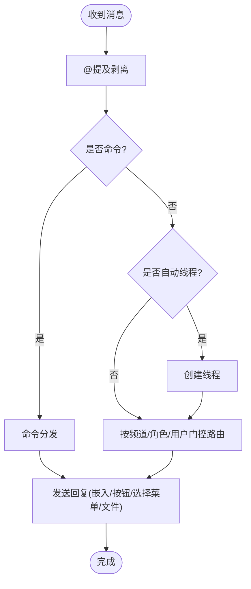
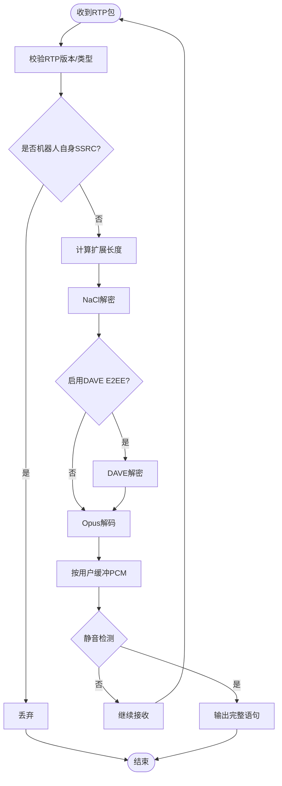
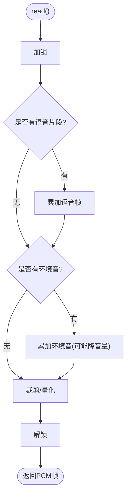
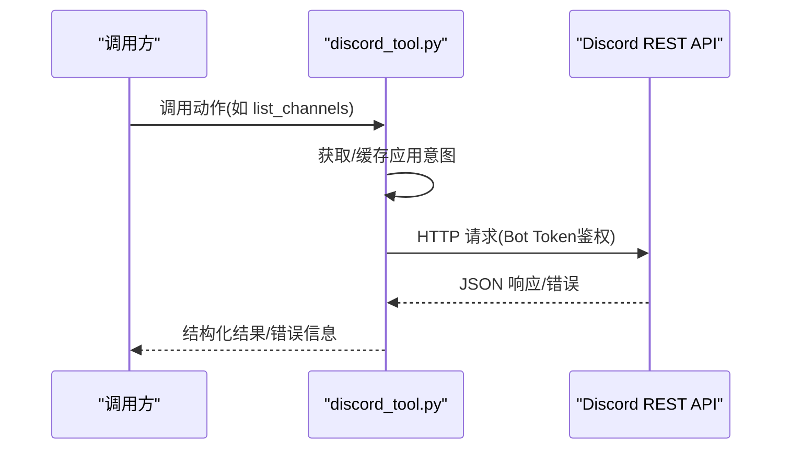
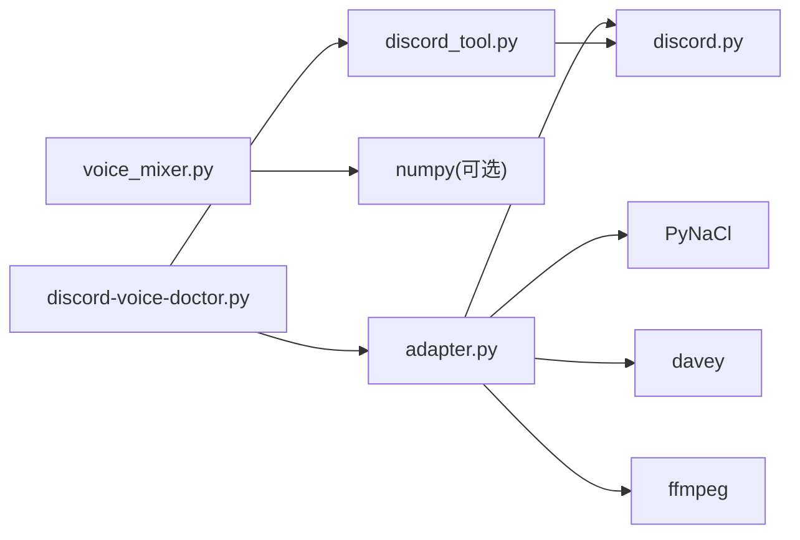

# Discord 集成

<cite>
**本文引用的文件**
- [adapter.py](file://plugins/platforms/discord/adapter.py)
- [plugin.yaml](file://plugins/platforms/discord/plugin.yaml)
- [voice_mixer.py](file://plugins/platforms/discord/voice_mixer.py)
- [discord_tool.py](file://tools/discord_tool.py)
- [discord-voice-doctor.py](file://scripts/discord-voice-doctor.py)
- [test_discord_adapter.py](file://tests/e2e/test_discord_adapter.py)
</cite>

## 目录
1. [简介](#简介)
2. [项目结构](#项目结构)
3. [核心组件](#核心组件)
4. [架构总览](#架构总览)
5. [详细组件分析](#详细组件分析)
6. [依赖关系分析](#依赖关系分析)
7. [性能与速率限制](#性能与速率限制)
8. [故障排除指南](#故障排除指南)
9. [结论](#结论)
10. [附录](#附录)

## 简介
本文件面向在 Hermes Agent 中集成 Discord 平台的工程与运维人员，系统性说明基于 discord.py 的 Bot 接入方案，涵盖：
- OAuth 认证流程（Bot Token 配置与应用权限）
- WebSocket 连接管理（连接、就绪、重连与超时）
- 消息事件处理（提及、命令、线程、附件、富文本格式）
- 速率限制与错误恢复
- Discord 特定能力：嵌入消息、按钮与选择菜单、文件上传、语音通道（入/出）、角色与频道权限控制
- 故障诊断与性能优化建议

## 项目结构
Discord 平台以插件形式注册到网关，核心由以下模块组成：
- 平台适配器：负责与 Discord 交互（消息收发、事件处理、语音等）
- 工具集：提供服务器/频道/成员/消息等 REST 操作能力
- 语音混合器：实现多路 PCM 混音与“环境音+语音”避让
- 诊断脚本：检查依赖、环境变量、机器人权限

图表来源
- [adapter.py:123-128](file://plugins/platforms/discord/adapter.py#L123-L128)
- [voice_mixer.py:156-191](file://plugins/platforms/discord/voice_mixer.py#L156-L191)
- [discord_tool.py:79-130](file://tools/discord_tool.py#L79-L130)
- [discord-voice-doctor.py:60-118](file://scripts/discord-voice-doctor.py#L60-L118)

章节来源
- [adapter.py:1-170](file://plugins/platforms/discord/adapter.py#L1-L170)
- [plugin.yaml:1-35](file://plugins/platforms/discord/plugin.yaml#L1-L35)

## 核心组件
- 平台适配器（adapter.py）
  - 使用 discord.py 建立 Bot 客户端，处理消息、线程、命令、附件、富文本、按钮/选择菜单等交互组件。
  - 维护 AllowedMentions、非对话消息去重、命令同步状态、非对话消息历史识别等。
  - 提供连接就绪等待、WebSocket 传输中止、Windows Opus DLL 定位等基础设施。
- 语音接收器（VoiceReceiver，adapter.py）
  - 监听语音通道 RTP 包，解密（NaCl + DAVE E2EE），解码 Opus 为 PCM，按用户缓冲并检测静音结束。
- 语音混音器（VoiceMixer，voice_mixer.py）
  - 将环境音与语音片段混合输出，支持语音播放时自动降低环境音音量（ducking）。
- Discord 工具集（discord_tool.py）
  - 通过 REST API 直接访问 Discord，提供服务器/频道/成员/消息/线程/角色等操作，并基于应用意图动态暴露可用动作。
- 诊断脚本（discord-voice-doctor.py）
  - 检查 Python 包、系统工具（opus/ffmpeg）、环境变量、机器人权限，辅助排障。

章节来源
- [adapter.py:123-170](file://plugins/platforms/discord/adapter.py#L123-L170)
- [adapter.py:525-800](file://plugins/platforms/discord/adapter.py#L525-L800)
- [voice_mixer.py:156-305](file://plugins/platforms/discord/voice_mixer.py#L156-L305)
- [discord_tool.py:79-130](file://tools/discord_tool.py#L79-L130)
- [discord-voice-doctor.py:60-118](file://scripts/discord-voice-doctor.py#L60-L118)

## 架构总览
下图展示从消息到达至回复发送的关键路径，以及语音通道的入/出流。

图表来源
- [adapter.py:123-170](file://plugins/platforms/discord/adapter.py#L123-L170)
- [adapter.py:525-800](file://plugins/platforms/discord/adapter.py#L525-L800)
- [voice_mixer.py:156-305](file://plugins/platforms/discord/voice_mixer.py#L156-L305)
- [discord_tool.py:79-130](file://tools/discord_tool.py#L79-L130)

## 详细组件分析

### 平台适配器（Discord Adapter）
职责
- 初始化 discord.py 客户端与 Intents，构建 AllowedMentions，避免误 ping。
- 处理消息事件：@提及、命令路由、自动线程、引用回复、附件缓存。
- 管理命令同步与状态持久化，限制全局斜杠命令数量。
- 连接就绪等待与失败快速上报，保障网关重连策略。
- 非对话消息识别与去重，避免刷屏。

关键流程（消息处理）

图表来源
- [adapter.py:476-508](file://plugins/platforms/discord/adapter.py#L476-L508)
- [adapter.py:232-267](file://plugins/platforms/discord/adapter.py#L232-L267)
- [adapter.py:289-354](file://plugins/platforms/discord/adapter.py#L289-L354)

章节来源
- [adapter.py:123-170](file://plugins/platforms/discord/adapter.py#L123-L170)
- [adapter.py:232-267](file://plugins/platforms/discord/adapter.py#L232-L267)
- [adapter.py:476-508](file://plugins/platforms/discord/adapter.py#L476-L508)
- [adapter.py:289-354](file://plugins/platforms/discord/adapter.py#L289-L354)

### 语音接收器（VoiceReceiver）
职责
- 安装说话者事件钩子，维护 SSRC→用户映射。
- 解析 RTP 头，跳过机器人自身音频，计算扩展长度。
- 执行 NaCl 解密与 DAVE E2EE 解密，剥离填充，Opus 解码为 PCM。
- 按用户缓冲音频，检测静音结束，触发后续转写或处理。

关键流程（RTP 包处理）

图表来源
- [adapter.py:610-785](file://plugins/platforms/discord/adapter.py#L610-L785)

章节来源
- [adapter.py:610-785](file://plugins/platforms/discord/adapter.py#L610-L785)

### 语音混音器（VoiceMixer）
职责
- 作为 discord.AudioSource 持续输出混合后的 PCM 帧。
- 支持设置循环环境音与一次性语音片段，语音播放期间自动降低环境音音量。
- 安全地在异步事件循环线程添加子源，在发送线程读取帧。

关键流程（读帧与混音）

图表来源
- [voice_mixer.py:156-305](file://plugins/platforms/discord/voice_mixer.py#L156-L305)

章节来源
- [voice_mixer.py:156-305](file://plugins/platforms/discord/voice_mixer.py#L156-L305)

### Discord 工具集（discord_tool.py）
职责
- 通过 REST API 直接访问 Discord，提供服务器、频道、成员、消息、线程、角色等管理能力。
- 基于应用意图（GUILD_MEMBERS、MESSAGE_CONTENT）动态过滤可用动作，并在缺失时给出提示。
- 对响应体大小进行限制，防止异常大响应导致内存问题。

关键流程（API 请求）

图表来源
- [discord_tool.py:79-130](file://tools/discord_tool.py#L79-L130)
- [discord_tool.py:231-333](file://tools/discord_tool.py#L231-L333)

章节来源
- [discord_tool.py:79-130](file://tools/discord_tool.py#L79-L130)
- [discord_tool.py:231-333](file://tools/discord_tool.py#L231-L333)

### 诊断脚本（discord-voice-doctor.py）
职责
- 检查 Python 包（discord.py、PyNaCl、davey、faster-whisper、edge-tts、elevenlabs）。
- 检查系统工具（opus、ffmpeg）。
- 检查环境变量（DISCORD_BOT_TOKEN、DISCORD_ALLOWED_USERS、STT/TTS 密钥）。
- 检查机器人权限（Connect、Speak、View Channel、Send Messages 等）。

章节来源
- [discord-voice-doctor.py:60-118](file://scripts/discord-voice-doctor.py#L60-L118)
- [discord-voice-doctor.py:121-170](file://scripts/discord-voice-doctor.py#L121-L170)
- [discord-voice-doctor.py:173-234](file://scripts/discord-voice-doctor.py#L173-L234)
- [discord-voice-doctor.py:281-367](file://scripts/discord-voice-doctor.py#L281-L367)

## 依赖关系分析
- 外部依赖
  - discord.py：WebSocket 与 REST 客户端、语音编解码接口。
  - PyNaCl：RTP 载荷加密解密。
  - davey：DAVE 端到端加密。
  - ffmpeg：音频格式转换与解码。
  - numpy（可选 voice extra）：PCM 混音加速。
- 内部依赖
  - 平台适配器依赖基础网关能力（消息去重、线程参与跟踪、富文本存储等）。
  - 工具集独立于适配器，直接通过 REST 访问 Discord。
  - 诊断脚本用于验证环境与权限。

图表来源
- [adapter.py:123-170](file://plugins/platforms/discord/adapter.py#L123-L170)
- [voice_mixer.py:51-73](file://plugins/platforms/discord/voice_mixer.py#L51-L73)
- [discord_tool.py:79-130](file://tools/discord_tool.py#L79-L130)
- [discord-voice-doctor.py:60-118](file://scripts/discord-voice-doctor.py#L60-L118)

章节来源
- [adapter.py:123-170](file://plugins/platforms/discord/adapter.py#L123-L170)
- [voice_mixer.py:51-73](file://plugins/platforms/discord/voice_mixer.py#L51-L73)
- [discord_tool.py:79-130](file://tools/discord_tool.py#L79-L130)
- [discord-voice-doctor.py:60-118](file://scripts/discord-voice-doctor.py#L60-L118)

## 性能与速率限制
- 速率限制
  - 全局斜杠命令上限：注册阶段需控制在 100 以内，否则整体同步失败。
  - 组件字段限制：选择菜单选项上限、按钮标签长度限制。
  - 图片重定向保护：最多允许一定次数重定向，防止 SSRF 与无限跳转。
- 连接与重连
  - 就绪等待与任务失败快速上报，避免长时间阻塞网关启动。
  - WebSocket 传输中止：在关闭超时时尝试底层 abort，确保资源释放。
- 语音性能
  - 每 20ms 一帧的 PCM 混音，CPU 开销低；使用 numpy 向量化加法与裁剪。
  - 语音播放期间自动降低环境音音量，提升听感与清晰度。
- 消息处理
  - 非对话消息识别与持久化 ID 集合，减少历史噪音。
  - 允许的提及默认拒绝 @everyone 与角色 ping，避免误广播。

章节来源
- [adapter.py:72-88](file://plugins/platforms/discord/adapter.py#L72-L88)
- [adapter.py:171-205](file://plugins/platforms/discord/adapter.py#L171-L205)
- [adapter.py:232-267](file://plugins/platforms/discord/adapter.py#L232-L267)
- [adapter.py:476-508](file://plugins/platforms/discord/adapter.py#L476-L508)
- [voice_mixer.py:156-305](file://plugins/platforms/discord/voice_mixer.py#L156-L305)

## 故障排除指南
常见问题与处理
- 连接断开/启动失败
  - 症状：Bot 未就绪或启动任务提前退出。
  - 排查：检查网络代理/防火墙、SOCKS 配置、令牌有效性；关注就绪等待超时与任务异常。
  - 参考：就绪等待与任务失败快速上报逻辑。
- 消息发送失败
  - 症状：发送被限流或权限不足。
  - 排查：检查 AllowedMentions、频道权限、角色权限；确认嵌入/按钮/选择菜单字段长度限制。
  - 参考：AllowedMentions 构建与组件字段截断。
- 语音无法工作
  - 症状：无法进入语音、无法播放/录制。
  - 排查：运行诊断脚本，检查 discord.py[voice]、PyNaCl、davey、ffmpeg、opus；确认机器人具备 Connect/Speak/View Channel/Send Messages 权限。
  - 参考：诊断脚本与环境变量检查。
- 性能优化建议
  - 控制斜杠命令数量，避免超过全局上限。
  - 合理使用非对话消息标记，减少历史噪音。
  - 语音混音保持单一路径，避免频繁切换播放源。

章节来源
- [adapter.py:232-267](file://plugins/platforms/discord/adapter.py#L232-L267)
- [adapter.py:476-508](file://plugins/platforms/discord/adapter.py#L476-L508)
- [discord-voice-doctor.py:173-234](file://scripts/discord-voice-doctor.py#L173-L234)
- [discord-voice-doctor.py:281-367](file://scripts/discord-voice-doctor.py#L281-L367)

## 结论
该 Discord 集成以适配器为核心，结合语音接收器与混音器，提供了完整的消息与语音通道能力；工具集补充了服务器与频道管理能力；诊断脚本帮助快速定位环境问题与权限缺失。通过合理的速率限制、连接管理与性能优化，可在生产环境中稳定运行。

## 附录

### OAuth 认证与 Bot Token 配置
- 必需环境变量：DISCORD_BOT_TOKEN（机器人令牌）。
- 可选环境变量：DISCORD_ALLOWED_USERS、DISCORD_ALLOW_ALL_USERS、DISCORD_HOME_CHANNEL、DISCORD_HOME_CHANNEL_NAME。
- 应用权限：在开发者门户启用必要意图（如 MESSAGE_CONTENT、GUILD_MEMBERS），并在服务器中授予机器人所需权限。

章节来源
- [plugin.yaml:12-35](file://plugins/platforms/discord/plugin.yaml#L12-L35)
- [discord_tool.py:74-77](file://tools/discord_tool.py#L74-L77)

### 服务器权限与角色控制
- 最小权限：Connect、Speak、View Channel、Send Messages。
- 推荐权限：Embed Links、Attach Files、Read Message History、Use VAD、Send Voice Messages。
- 可通过工具集列出角色与成员，进行细粒度权限管理。

章节来源
- [discord-voice-doctor.py:295-312](file://scripts/discord-voice-doctor.py#L295-L312)
- [discord_tool.py:453-468](file://tools/discord_tool.py#L453-L468)

### 频道管理与技能绑定
- 支持按频道白名单/黑名单、免线程频道、自由响应频道等策略。
- 可将技能绑定到特定频道，实现场景化能力。

章节来源
- [adapter.py:382-405](file://plugins/platforms/discord/adapter.py#L382-L405)

### 消息事件与富文本格式
- 支持嵌入消息、按钮、选择菜单、文件上传。
- 富文本链接与 URL 预览处理，避免无效链接显示。
- 自动线程与命令识别，确保在自动线程中仍能正确路由命令。

章节来源
- [adapter.py:43-57](file://plugins/platforms/discord/adapter.py#L43-L57)
- [test_discord_adapter.py:83-107](file://tests/e2e/test_discord_adapter.py#L83-L107)

### 语音通道支持
- 入站：RTP 包解密（NaCl + DAVE）、Opus 解码、静音检测。
- 出站：PCM 混音、环境音与语音避让、连续播放。
- 诊断：依赖与权限检查、常见错误提示。

章节来源
- [adapter.py:610-785](file://plugins/platforms/discord/adapter.py#L610-L785)
- [voice_mixer.py:156-305](file://plugins/platforms/discord/voice_mixer.py#L156-L305)
- [discord-voice-doctor.py:60-118](file://scripts/discord-voice-doctor.py#L60-L118)