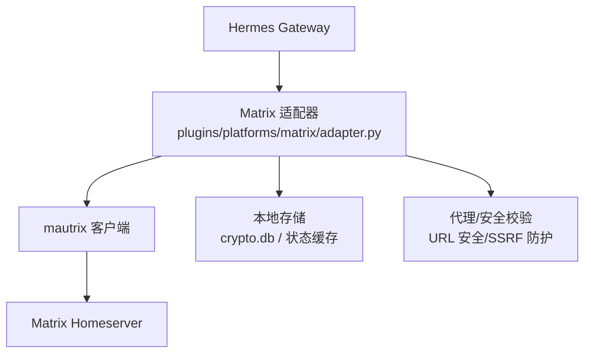
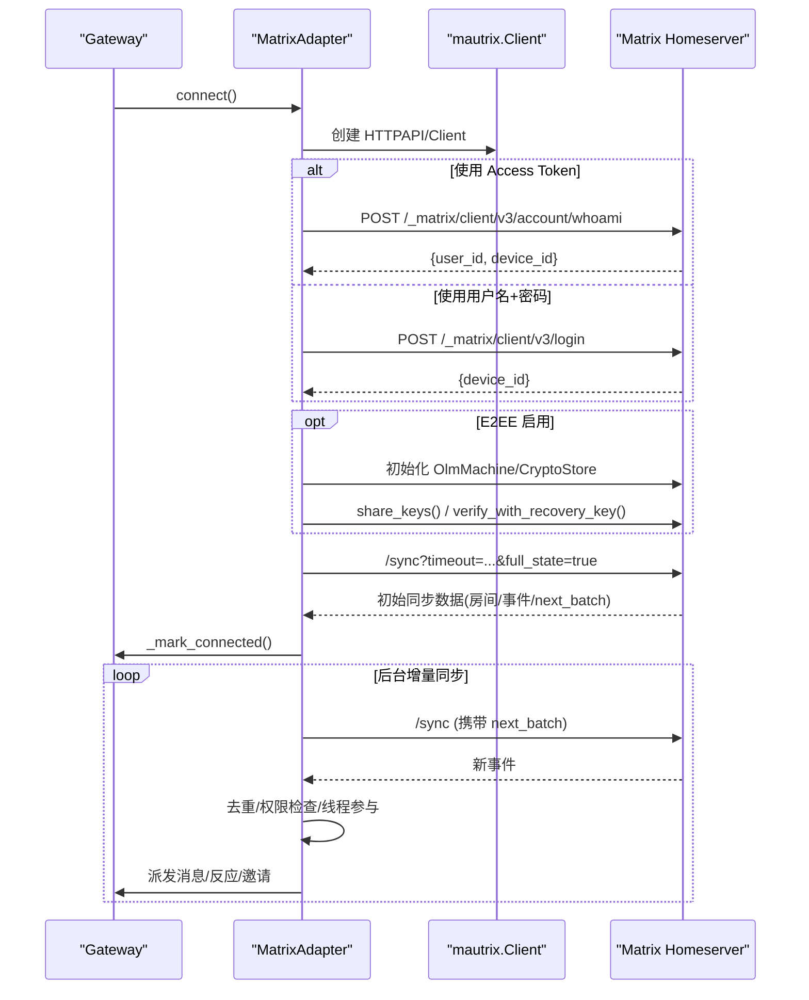
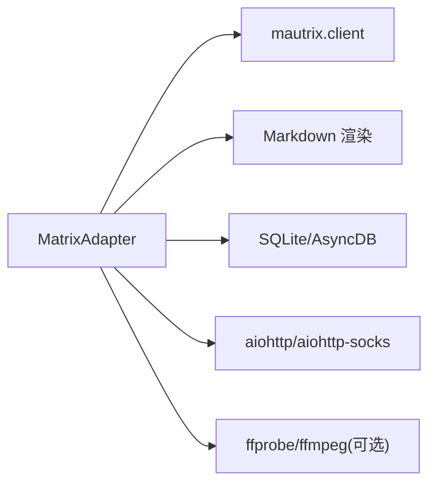

# Matrix 集成

<cite>
**本文引用的文件**
- [adapter.py](file://plugins/platforms/matrix/adapter.py)
- [plugin.yaml](file://plugins/platforms/matrix/plugin.yaml)
- [__init__.py](file://plugins/platforms/matrix/__init__.py)
- [config.py](file://gateway/config.py)
- [test_matrix.py](file://tests/gateway/test_matrix.py)
</cite>

## 目录
1. [简介](#简介)
2. [项目结构](#项目结构)
3. [核心组件](#核心组件)
4. [架构总览](#架构总览)
5. [详细组件分析](#详细组件分析)
6. [依赖关系分析](#依赖关系分析)
7. [性能与容量规划](#性能与容量规划)
8. [故障排除指南](#故障排除指南)
9. [结论](#结论)
10. [附录：配置与环境变量](#附录：配置与环境变量)

## 简介
本文件面向在 Hermes Agent 中集成 Matrix 平台的工程与运维人员，系统性说明 Matrix Client-Server API 的接入实现，覆盖身份认证、房间管理、消息同步与处理、端到端加密（E2EE）、富文本与媒体上传、语音/视频事件、自定义事件与权限控制等。文档同时给出服务器配置、用户账户管理、访问令牌设置、常见问题排查与性能优化建议，帮助快速落地并稳定运行。

## 项目结构
Matrix 平台以插件形式提供，核心位于 plugins/platforms/matrix 目录：
- adapter.py：Matrix 适配器实现，封装连接、认证、同步、消息收发、E2EE、权限策略、媒体上传等能力。
- plugin.yaml：插件元数据与所需环境变量声明。
- __init__.py：对外暴露注册入口。

图表来源
- [adapter.py:1677-2108](file://plugins/platforms/matrix/adapter.py#L1677-L2108)
- [plugin.yaml:1-42](file://plugins/platforms/matrix/plugin.yaml#L1-L42)

章节来源
- [adapter.py:1-145](file://plugins/platforms/matrix/adapter.py#L1-L145)
- [plugin.yaml:1-42](file://plugins/platforms/matrix/plugin.yaml#L1-L42)
- [__init__.py:1-4](file://plugins/platforms/matrix/__init__.py#L1-L4)

## 核心组件
- MatrixAdapter：继承自 BasePlatformAdapter，实现 connect/disconnect/send/edit_message/get_chat_info/diagnostics 等接口，负责与 Matrix homeserver 交互。
- 认证与会话：支持 access token 登录与用户名+密码登录；通过 whoami 解析用户与设备信息；可选 E2EE（Olm/Megolm）及跨签名恢复密钥。
- 同步与事件：初始 full sync + 后台增量 sync；处理 m.room.message、m.reaction、邀请事件；线程参与与去重。
- 权限与策略：允许用户白名单、房间白名单、忽略模式、是否必须 @mention、是否允许 @room 通知、是否处理 m.notice 等。
- 媒体与富文本：HTML/Markdown 渲染、图片/音频/视频上传、语音波形与时长元数据、最大消息长度分片发送。
- 诊断与健康：输出连接状态、E2EE 模式、策略计数、媒体限制等。

章节来源
- [adapter.py:1136-1345](file://plugins/platforms/matrix/adapter.py#L1136-L1345)
- [adapter.py:1677-2108](file://plugins/platforms/matrix/adapter.py#L1677-L2108)
- [adapter.py:2153-2270](file://plugins/platforms/matrix/adapter.py#L2153-L2270)

## 架构总览
下图展示从 Gateway 到 Matrix 的完整链路，包括认证、同步、事件分发、消息发送与 E2EE 流程。

图表来源
- [adapter.py:1677-2108](file://plugins/platforms/matrix/adapter.py#L1677-L2108)

## 详细组件分析

### 身份认证与设备管理
- 支持两种认证方式：
  - Access Token：优先使用，调用 whoami 获取 user_id/device_id，若配置了 MATRIX_DEVICE_ID 且与 token 绑定设备不一致则记录告警并采用 token 实际设备。
  - 用户名+密码：调用 login 获取 device_id。
- 设备与密钥：
  - 可配置 MATRIX_DEVICE_ID 用于持久化 E2EE 身份。
  - 支持跨签名恢复密钥（MATRIX_RECOVERY_KEY），支持自动写入一次性恢复密钥文件（MATRIX_RECOVERY_KEY_OUTPUT_FILE）。
  - 启动时验证服务端设备密钥一致性，必要时删除陈旧设备或重新上传密钥。
- 代理与安全：
  - 支持 HTTP(S)/SOCKS 代理（MATRIX_PROXY），aiohttp session 级别注入。
  - URL 安全校验防止 SSRF。

章节来源
- [adapter.py:1677-1824](file://plugins/platforms/matrix/adapter.py#L1677-L1824)
- [adapter.py:1826-2030](file://plugins/platforms/matrix/adapter.py#L1826-L2030)
- [adapter.py:716-746](file://plugins/platforms/matrix/adapter.py#L716-L746)
- [adapter.py:2336-2366](file://plugins/platforms/matrix/adapter.py#L2336-L2366)

### 端到端加密（E2EE）
- 模式：off / optional / required，由 MATRIX_E2EE_MODE 或 legacy MATRIX_ENCRYPTION 决定。
- 依赖：需要 mautrix[encryption]、asyncpg、aiosqlite、libolm。
- 存储：SQLite 加密数据库（crypto.db），按 profile 隔离。
- 行为：
  - 启动时加载 OlmMachine，校验/上传设备密钥，必要时执行跨签名验证或生成恢复密钥。
  - 发送失败时尝试 share_keys() 后重试。
  - 可选模式下缺失依赖会降级为不启用 E2EE 并记录警告。

章节来源
- [adapter.py:749-793](file://plugins/platforms/matrix/adapter.py#L749-L793)
- [adapter.py:996-1065](file://plugins/platforms/matrix/adapter.py#L996-L1065)
- [adapter.py:1826-2030](file://plugins/platforms/matrix/adapter.py#L1826-L2030)
- [adapter.py:2186-2215](file://plugins/platforms/matrix/adapter.py#L2186-L2215)

### 房间管理与权限控制
- 房间白名单：MATRIX_ALLOWED_ROOMS 限定仅响应指定房间（DM 豁免）。
- 用户白名单：MATRIX_ALLOWED_USERS 限定可触发 turn 的用户。
- 忽略模式：MATRIX_IGNORE_USER_PATTERNS 匹配 appservice/bridge ghost 用户。
- @mention 要求：MATRIX_REQUIRE_MENTION 默认 true；可配置 free_response_rooms 豁免。
- @room 通知：MATRIX_ALLOW_ROOM_MENTIONS 默认 false。
- 线程参与：自动创建线程（MATRIX_AUTO_THREAD），DM 可配置（MATRIX_DM_AUTO_THREAD），@mention 在 DM 中创建线程（MATRIX_DM_MENTION_THREADS）。
- 邀请处理：自动加入邀请房间（内部调度任务）。

章节来源
- [adapter.py:1225-1271](file://plugins/platforms/matrix/adapter.py#L1225-L1271)
- [adapter.py:2030-2051](file://plugins/platforms/matrix/adapter.py#L2030-L2051)

### 消息同步与处理机制
- 初始同步：full_state=true，保存 next_batch 以便增量同步。
- 后台同步：持续拉取增量事件，维护 last_sync_ts 用于健康诊断。
- 事件去重：基于 event_id 的有界队列与集合，避免重复处理。
- 时间容差：启动宽限期内丢弃旧事件，检测系统时钟偏差导致“机器人加入房间但不回复”的问题。
- 文本批处理：合并短时间内的连续消息，减少 LLM 上下文碎片。
- 命令别名：将 !command 转换为 /command 并交由网关分发。

章节来源
- [adapter.py:2053-2090](file://plugins/platforms/matrix/adapter.py#L2053-L2090)
- [adapter.py:1346-1357](file://plugins/platforms/matrix/adapter.py#L1346-L1357)
- [adapter.py:278-345](file://plugins/platforms/matrix/adapter.py#L278-L345)
- [adapter.py:1294-1303](file://plugins/platforms/matrix/adapter.py#L1294-L1303)

### 富文本、媒体与语音/视频
- 富文本：HTML 白名单过滤与 Markdown 转换，去除危险脚本/属性。
- 图片：下载外部图片并上传至 Matrix，支持 caption 与 reply_to。
- 语音：提取时长与波形（ffprobe/ffmpeg），转码为 Ogg/Opus（MSC3245 voice）。
- 视频：支持视频事件类型（能力声明包含 video）。
- 消息分片：根据 max_message_length 切分长消息，默认 16000 字符，上限 65535。

章节来源
- [adapter.py:414-490](file://plugins/platforms/matrix/adapter.py#L414-L490)
- [adapter.py:147-275](file://plugins/platforms/matrix/adapter.py#L147-L275)
- [adapter.py:2327-2399](file://plugins/platforms/matrix/adapter.py#L2327-L2399)
- [adapter.py:562-594](file://plugins/platforms/matrix/adapter.py#L562-L594)

### 自定义事件与审批交互
- 反应式审批：通过 emoji 反应（✅/🌀/♾️/❌ 等）进行一次性/会话级/永久审批或拒绝。
- 模型选择器：通过数字键反应选择模型。
- 选择器：通用选择器（如 /reasoning、/fast）扩展按键集。
- 超时与请求者校验：可配置超时与强制原始请求者批准。

章节来源
- [adapter.py:1305-1328](file://plugins/platforms/matrix/adapter.py#L1305-L1328)

### 发送、编辑与诊断
- send：格式化消息、分片、设置 relation（reply/edit）、E2EE 失败重试。
- edit_message：通过 m.replace 更新消息。
- get_chat_info：返回房间名与类型（dm/group）。
- diagnostics：输出平台、认证、同步、E2EE、策略、媒体限制等信息。

章节来源
- [adapter.py:2153-2215](file://plugins/platforms/matrix/adapter.py#L2153-L2215)
- [adapter.py:2217-2270](file://plugins/platforms/matrix/adapter.py#L2217-L2270)
- [adapter.py:2295-2325](file://plugins/platforms/matrix/adapter.py#L2295-L2325)

## 依赖关系分析
- 运行时依赖：
  - mautrix（含 encryption 可选特性）
  - asyncpg、aiosqlite（E2EE 存储）
  - aiohttp/aiohttp-socks（HTTP/SOCKS 代理）
  - Markdown（富文本渲染）
  - ffprobe/ffmpeg（语音元数据与转码，可选）
- 模块导入与懒加载：
  - 通过 ensure_matrix_deps 按需安装/绑定依赖，避免未安装时报错阻断。
  - E2EE 相关类按需 import，缺失时按模式降级或报错。

图表来源
- [adapter.py:996-1065](file://plugins/platforms/matrix/adapter.py#L996-L1065)
- [adapter.py:1826-1900](file://plugins/platforms/matrix/adapter.py#L1826-L1900)
- [adapter.py:716-746](file://plugins/platforms/matrix/adapter.py#L716-L746)

章节来源
- [adapter.py:996-1065](file://plugins/platforms/matrix/adapter.py#L996-L1065)
- [adapter.py:1826-1900](file://plugins/platforms/matrix/adapter.py#L1826-L1900)

## 性能与容量规划
- 消息长度与分片：
  - 默认 16000 字符，可通过 MATRIX_MAX_MESSAGE_LENGTH 调整，上限 65535。
  - 接近阈值时自动追加续行，避免截断表格等富文本结构。
- 媒体大小限制：
  - 通过 MATRIX_MAX_MEDIA_BYTES 限制外部媒体下载大小，防止大文件占用资源。
- 同步与延迟：
  - 初始 full sync 后进入增量 sync，last_sync_ts 可用于监控延迟。
  - 启动宽限期避免回补历史事件误判。
- 并发与任务：
  - 邀请加入、反应删除等异步任务独立管理，断开时统一取消。
- 代理与网络：
  - 全局 aiohttp session 注入代理，减少连接开销。

章节来源
- [adapter.py:562-594](file://plugins/platforms/matrix/adapter.py#L562-L594)
- [adapter.py:1285-1292](file://plugins/platforms/matrix/adapter.py#L1285-L1292)
- [adapter.py:2053-2090](file://plugins/platforms/matrix/adapter.py#L2053-L2090)
- [adapter.py:2110-2151](file://plugins/platforms/matrix/adapter.py#L2110-L2151)

## 故障排除指南
- 无法连接或认证失败
  - 检查 MATRIX_HOMESERVER、MATRIX_ACCESS_TOKEN 或 MATRIX_USER_ID + MATRIX_PASSWORD。
  - 确认 whoami/login 成功，设备 ID 一致。
  - 代理配置正确（MATRIX_PROXY），必要时安装 aiohttp-socks。
- E2EE 不可用或解密失败
  - 确认已安装 mautrix[encryption]、asyncpg、aiosqlite、libolm。
  - 检查 crypto.db 是否存在且可读；设备变更时可能需要重置存储。
  - 如需跨签名验证，配置 MATRIX_RECOVERY_KEY 或允许自动生成恢复密钥。
- 机器人加入房间但不回复
  - 检查系统时钟偏差导致的启动宽限丢弃；关注 late grace drops。
  - 确认 require_mention 与 allowed rooms/users 策略。
- 消息同步延迟
  - 查看 diagnostics 中的 last_sync_age_seconds；检查网络与代理。
  - 增大同步超时或降低消息体积。
- 媒体上传失败
  - 检查 is_safe_url 与内容类型；确认文件大小不超过 MATRIX_MAX_MEDIA_BYTES。
  - 缺少 ffmpeg 时语音波形可能为空，但基础传输仍可用。

章节来源
- [adapter.py:1677-1824](file://plugins/platforms/matrix/adapter.py#L1677-L1824)
- [adapter.py:1826-2030](file://plugins/platforms/matrix/adapter.py#L1826-L2030)
- [adapter.py:2053-2090](file://plugins/platforms/matrix/adapter.py#L2053-L2090)
- [adapter.py:2336-2399](file://plugins/platforms/matrix/adapter.py#L2336-L2399)

## 结论
该 Matrix 适配器提供了完整的 Client-Server API 集成能力，涵盖认证、同步、权限控制、E2EE、富文本与多媒体、自定义事件与审批交互。通过合理的配置与环境变量，可在多种部署场景下稳定运行。结合诊断与健康指标，可有效定位连接、同步与加密问题，并通过参数调优提升性能与用户体验。

## 附录：配置与环境变量
- 必需
  - MATRIX_HOMESERVER：Homeserver 地址
  - MATRIX_ACCESS_TOKEN：访问令牌（推荐）
  - 或 MATRIX_USER_ID + MATRIX_PASSWORD：用户名+密码登录
- 可选
  - MATRIX_DEVICE_ID：固定设备 ID（E2EE 持久化）
  - MATRIX_ENCRYPTION / MATRIX_E2EE_MODE：开启 E2EE 及模式
  - MATRIX_RECOVERY_KEY：跨签名恢复密钥
  - MATRIX_RECOVERY_KEY_OUTPUT_FILE：一次性写入恢复密钥的文件路径
  - MATRIX_PROXY：HTTP(S)/SOCKS 代理
  - MATRIX_ALLOWED_USERS / MATRIX_ALLOWED_ROOMS：用户与房间白名单
  - MATRIX_IGNORE_USER_PATTERNS：忽略用户模式
  - MATRIX_REQUIRE_MENTION / MATRIX_FREE_RESPONSE_ROOMS：@mention 策略
  - MATRIX_ALLOW_ROOM_MENTIONS：允许 @room 通知
  - MATRIX_PROCESS_NOTICES：处理 m.notice 事件
  - MATRIX_AUTO_THREAD / MATRIX_DM_AUTO_THREAD / MATRIX_DM_MENTION_THREADS：线程策略
  - MATRIX_MAX_MESSAGE_LENGTH：最大消息长度（默认 16000，上限 65535）
  - MATRIX_MAX_MEDIA_BYTES：媒体下载大小限制
  - MATRIX_APPROVAL_REQUIRE_SENDER / MATRIX_APPROVAL_TIMEOUT_SECONDS：审批策略

章节来源
- [plugin.yaml:12-42](file://plugins/platforms/matrix/plugin.yaml#L12-L42)
- [adapter.py:1153-1271](file://plugins/platforms/matrix/adapter.py#L1153-L1271)
- [config.py:2044-2053](file://gateway/config.py#L2044-L2053)