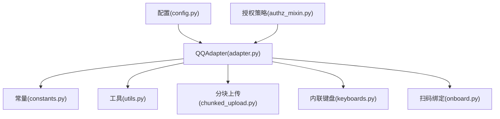
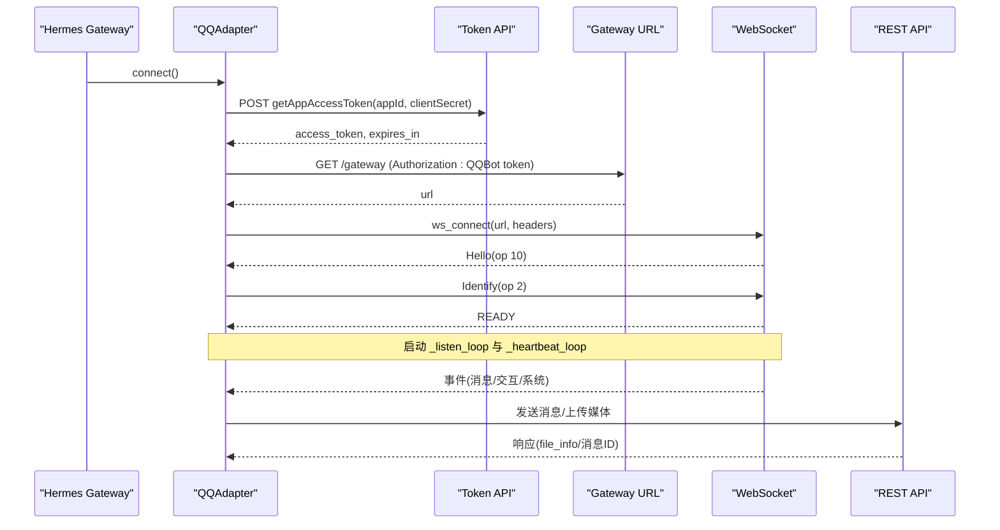
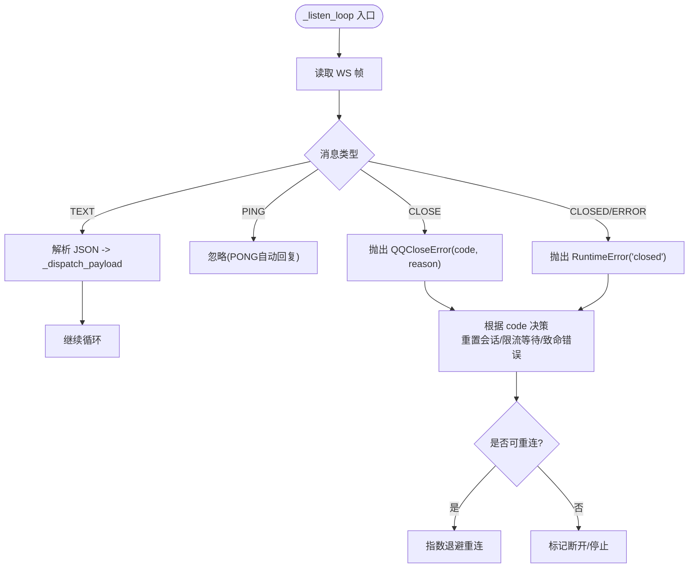
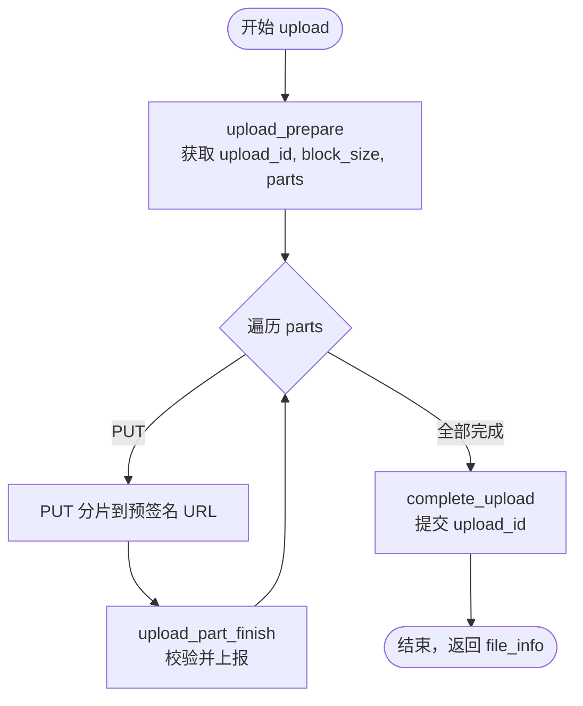
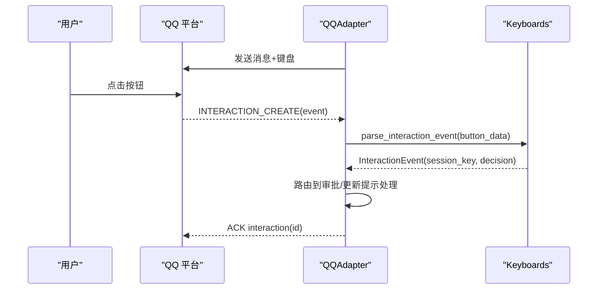
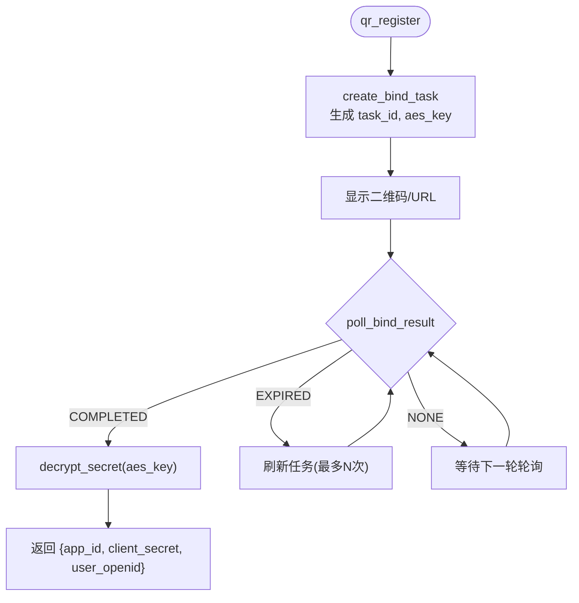
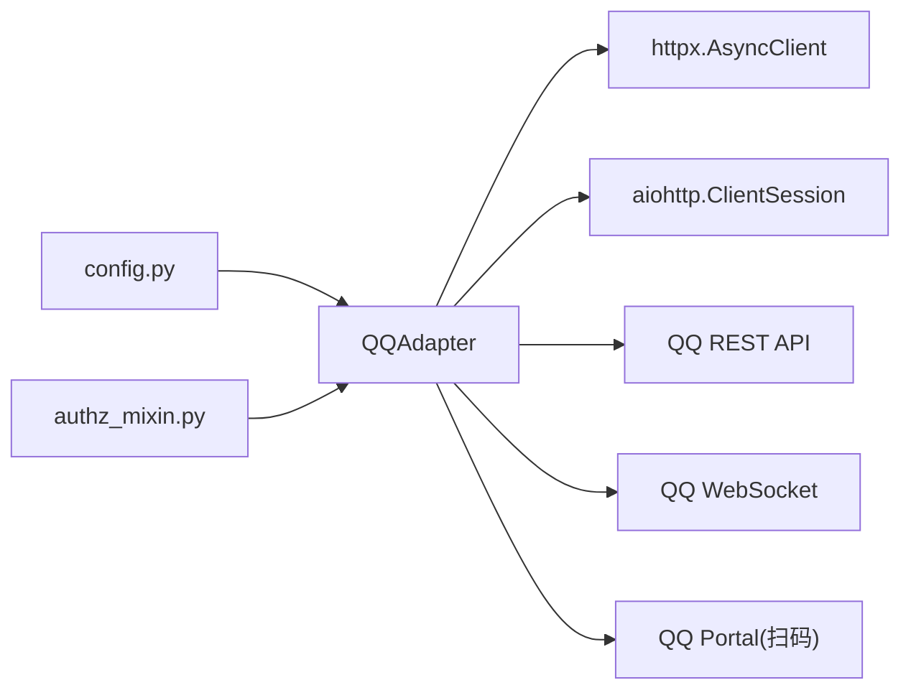

# QQ Bot 集成

<cite>
**本文引用的文件**
- [adapter.py](file://gateway/platforms/qqbot/adapter.py)
- [constants.py](file://gateway/platforms/qqbot/constants.py)
- [onboard.py](file://gateway/platforms/qqbot/onboard.py)
- [chunked_upload.py](file://gateway/platforms/qqbot/chunked_upload.py)
- [keyboards.py](file://gateway/platforms/qqbot/keyboards.py)
- [utils.py](file://gateway/platforms/qqbot/utils.py)
- [__init__.py](file://gateway/platforms/qqbot/__init__.py)
- [config.py](file://gateway/config.py)
- [authz_mixin.py](file://gateway/authz_mixin.py)
- [qqbot.md](file://website/docs/user-guide/messaging/qqbot.md)
- [test_qqbot.py](file://tests/gateway/test_qqbot.py)
</cite>

## 目录
1. [简介](#简介)
2. [项目结构](#项目结构)
3. [核心组件](#核心组件)
4. [架构总览](#架构总览)
5. [详细组件分析](#详细组件分析)
6. [依赖关系分析](#依赖关系分析)
7. [性能与速率限制](#性能与速率限制)
8. [故障排除指南](#故障排除指南)
9. [结论](#结论)
10. [附录：配置与环境变量](#附录配置与环境变量)

## 简介
本文件面向在 Hermes Agent 中集成 QQ Bot（官方 API v2）的开发者与运维人员，系统性说明 OAuth 认证、WebSocket 连接管理、消息事件处理、富文本与媒体上传、群组管理与机器人指令交互、以及速率限制与故障恢复策略。文档同时覆盖应用配置、权限设置、消息白名单与回调 URL 配置，并提供连接超时、发送失败等问题的排查与调优建议。

## 项目结构
QQ Bot 平台以适配器模式实现，位于 gateway/platforms/qqbot 下，按职责拆分为多个模块：
- adapter.py：核心适配器，负责认证、网关连接、心跳、事件分发、消息收发、媒体上传与 STT 语音转写。
- constants.py：API 地址、超时、重试、消息类型等常量。
- onboard.py：扫码绑定流程（创建任务、生成二维码、轮询结果、解密密钥）。
- chunked_upload.py：大文件分块上传（prepare → PUT parts → complete），含并发与重试。
- keyboards.py：内联键盘与审批/更新提示交互（按钮数据解析、事件封装）。
- utils.py：User-Agent、标准请求头、配置列表转换工具。
- __init__.py：统一导出包接口，保持向后兼容。

图表来源
- [adapter.py:180-333](file://gateway/platforms/qqbot/adapter.py#L180-L333)
- [constants.py:17-56](file://gateway/platforms/qqbot/constants.py#L17-L56)
- [utils.py:25-53](file://gateway/platforms/qqbot/utils.py#L25-L53)
- [chunked_upload.py:200-304](file://gateway/platforms/qqbot/chunked_upload.py#L200-L304)
- [keyboards.py:204-259](file://gateway/platforms/qqbot/keyboards.py#L204-L259)
- [onboard.py:156-221](file://gateway/platforms/qqbot/onboard.py#L156-L221)
- [config.py:2414-2422](file://gateway/config.py#L2414-L2422)
- [authz_mixin.py:444-551](file://gateway/authz_mixin.py#L444-L551)

章节来源
- [adapter.py:1-143](file://gateway/platforms/qqbot/adapter.py#L1-L143)
- [constants.py:1-75](file://gateway/platforms/qqbot/constants.py#L1-L75)
- [utils.py:1-72](file://gateway/platforms/qqbot/utils.py#L1-L72)
- [__init__.py:1-92](file://gateway/platforms/qqbot/__init__.py#L1-L92)

## 核心组件
- QQAdapter：实现 QQ Bot 的完整生命周期（认证、获取网关、建立 WebSocket、心跳保活、事件监听、重连策略、消息发送、富文本与媒体上传、语音转写、内联键盘交互）。
- ChunkedUploader：处理 10MB~100MB 级别的大文件上传，包含并发上传、重试、错误分类（每日配额超限、单文件过大）。
- InlineKeyboard + ApprovalSender：构建内联键盘与审批消息，支持“允许一次/始终允许/拒绝”和“确认/取消”两类交互。
- Onboard：扫码绑定流程，生成二维码并轮询完成状态，本地解密返回的加密密钥。
- Constants/Utils：集中化常量与通用工具（UA、请求头、配置列表转换）。

章节来源
- [adapter.py:180-333](file://gateway/platforms/qqbot/adapter.py#L180-L333)
- [chunked_upload.py:200-304](file://gateway/platforms/qqbot/chunked_upload.py#L200-L304)
- [keyboards.py:204-259](file://gateway/platforms/qqbot/keyboards.py#L204-L259)
- [onboard.py:156-221](file://gateway/platforms/qqbot/onboard.py#L156-L221)
- [constants.py:17-56](file://gateway/platforms/qqbot/constants.py#L17-L56)
- [utils.py:25-53](file://gateway/platforms/qqbot/utils.py#L25-L53)

## 架构总览
QQ Bot 适配器通过 REST 获取访问令牌与网关地址，再使用 WebSocket 接收事件；出站消息与媒体上传走 REST API。心跳维持连接，异常时按错误码进行差异化重连或终止。

图表来源
- [adapter.py:309-366](file://gateway/platforms/qqbot/adapter.py#L309-L366)
- [adapter.py:424-479](file://gateway/platforms/qqbot/adapter.py#L424-L479)
- [adapter.py:485-514](file://gateway/platforms/qqbot/adapter.py#L485-L514)
- [adapter.py:717-760](file://gateway/platforms/qqbot/adapter.py#L717-L760)
- [constants.py:21-23](file://gateway/platforms/qqbot/constants.py#L21-L23)

## 详细组件分析

### QQAdapter 连接与事件处理
- 认证与网关：
  - 通过 REST 获取 access_token，缓存并在过期前刷新。
  - 使用 token 获取 WebSocket 网关 URL，建立连接。
- 心跳与保活：
  - 收到 Hello 后设置心跳间隔，定时发送 op 1 心跳携带最新 seq。
- 事件监听与重连：
  - 读取文本帧并解析 JSON，分发到具体处理器。
  - 对关闭码进行分类处理：无效 token、会话失效、限流、沙箱/封禁等。
  - 快速断开检测：短时间内频繁断线触发致命错误提示。
- 消息发送与富文本：
  - 支持文本、Markdown（msg_type 2）、媒体（图片/视频/语音/文件）。
  - 支持输入通知（typing）与去抖。
- 语音转写（STT）：
  - 优先使用 QQ 内置 ASR（asr_refer_text），失败则回退到配置的 OpenAI 兼容 STT。
- 内联键盘与交互：
  - 支持 INTERACTION_CREATE 事件，解析按钮数据并路由到审批/更新提示逻辑。

图表来源
- [adapter.py:516-693](file://gateway/platforms/qqbot/adapter.py#L516-L693)
- [adapter.py:717-740](file://gateway/platforms/qqbot/adapter.py#L717-L740)
- [constants.py:41-45](file://gateway/platforms/qqbot/constants.py#L41-L45)

章节来源
- [adapter.py:309-366](file://gateway/platforms/qqbot/adapter.py#L309-L366)
- [adapter.py:424-479](file://gateway/platforms/qqbot/adapter.py#L424-L479)
- [adapter.py:485-514](file://gateway/platforms/qqbot/adapter.py#L485-L514)
- [adapter.py:516-693](file://gateway/platforms/qqbot/adapter.py#L516-L693)
- [adapter.py:717-760](file://gateway/platforms/qqbot/adapter.py#L717-L760)

### 分块上传（ChunkedUploader）
- 适用场景：大于约 10MB 的文件需走三阶段上传（prepare → PUT parts → complete）。
- 关键特性：
  - 并发上传分片，受限于服务器返回的 concurrency。
  - 针对 upload_part_finish 的可重试错误码进行轮询重试。
  - 区分每日配额超限与单文件过大两种非重试错误。
  - 计算 md5/sha1/md5_10m 哈希，满足 QQ 规范。
- 错误处理：
  - 每日配额超限：抛出 UploadDailyLimitExceededError，调用方可友好提示用户。
  - 单文件过大：抛出 UploadFileTooLargeError，提示平台限制。
  - 网络/服务端错误：指数退避重试，超过上限抛错。

图表来源
- [chunked_upload.py:221-304](file://gateway/platforms/qqbot/chunked_upload.py#L221-L304)
- [chunked_upload.py:310-340](file://gateway/platforms/qqbot/chunked_upload.py#L310-L340)
- [chunked_upload.py:346-488](file://gateway/platforms/qqbot/chunked_upload.py#L346-L488)
- [chunked_upload.py:494-528](file://gateway/platforms/qqbot/chunked_upload.py#L494-L528)

章节来源
- [chunked_upload.py:1-603](file://gateway/platforms/qqbot/chunked_upload.py#L1-L603)

### 内联键盘与交互（Approval/Update Prompt）
- 数据结构：
  - KeyboardButton/Row/Content/InlineKeyboard：序列化到消息体的 keyboard 字段。
  - InteractionEvent：解析 INTERACTION_CREATE 事件，提取操作者 openid、按钮数据等。
- 交互流程：
  - 构建审批键盘（允许一次/始终允许/拒绝）或更新提示键盘（确认/取消）。
  - 用户点击按钮后，平台派发 INTERACTION_CREATE，适配器 ACK 并路由到默认或自定义回调。
  - 按钮数据格式：approve:<session_key>:<decision> 或 update_prompt:<y|n>。

图表来源
- [keyboards.py:204-259](file://gateway/platforms/qqbot/keyboards.py#L204-L259)
- [keyboards.py:404-462](file://gateway/platforms/qqbot/keyboards.py#L404-L462)
- [adapter.py:276-290](file://gateway/platforms/qqbot/adapter.py#L276-L290)

章节来源
- [keyboards.py:1-462](file://gateway/platforms/qqbot/keyboards.py#L1-L462)
- [adapter.py:276-290](file://gateway/platforms/qqbot/adapter.py#L276-L290)

### 扫码绑定（Onboard）
- 流程：
  - 创建绑定任务，生成 AES 密钥。
  - 渲染二维码或输出链接，引导用户在手机端扫描。
  - 轮询绑定结果，完成后解密得到 client_secret。
  - 返回 app_id、client_secret、user_openid，用于后续配置。
- 错误与超时：
  - 二维码过期会刷新，最多尝试一定次数。
  - 超时未绑定则返回 None。

图表来源
- [onboard.py:84-147](file://gateway/platforms/qqbot/onboard.py#L84-L147)
- [onboard.py:156-221](file://gateway/platforms/qqbot/onboard.py#L156-L221)

章节来源
- [onboard.py:1-221](file://gateway/platforms/qqbot/onboard.py#L1-L221)

## 依赖关系分析
- 运行时依赖：
  - aiohttp：WebSocket 客户端。
  - httpx：REST 客户端与大文件上传。
- 外部服务：
  - QQ Bot REST API（令牌、网关、消息、媒体）。
  - QQ Portal（扫码绑定）。
- 内部依赖：
  - gateway.config：平台启用与额外配置注入。
  - gateway.authz_mixin：DM/群组访问策略（allowlist/pairing/disabled/open）。

图表来源
- [config.py:2414-2422](file://gateway/config.py#L2414-L2422)
- [authz_mixin.py:444-551](file://gateway/authz_mixin.py#L444-L551)
- [adapter.py:339-366](file://gateway/platforms/qqbot/adapter.py#L339-L366)
- [adapter.py:485-514](file://gateway/platforms/qqbot/adapter.py#L485-L514)

章节来源
- [config.py:2414-2422](file://gateway/config.py#L2414-L2422)
- [authz_mixin.py:444-551](file://gateway/authz_mixin.py#L444-L551)
- [adapter.py:339-366](file://gateway/platforms/qqbot/adapter.py#L339-L366)
- [adapter.py:485-514](file://gateway/platforms/qqbot/adapter.py#L485-L514)

## 性能与速率限制
- 速率限制与重连：
  - 遇到 4008 限流码，等待固定时长后重连，避免雪崩。
  - 指数退避重连，最大尝试次数限制，防止无限重试。
- 心跳与连接健康：
  - 基于 Hello 的心跳间隔，提前 20% 时间发送心跳，降低超时风险。
  - 快速断开检测：短时间多次断线视为配置或权限问题，直接报致命错误。
- 上传性能：
  - 分片并发上传，限制最大并发度，避免压垮服务端。
  - 分片上传失败指数退避重试，整体完成也具备重试。
- 内存与 I/O：
  - 大文件分块读取，避免一次性加载到内存。
  - 临时文件在 STT 失败时清理，减少磁盘占用。

章节来源
- [adapter.py:516-693](file://gateway/platforms/qqbot/adapter.py#L516-L693)
- [adapter.py:742-760](file://gateway/platforms/qqbot/adapter.py#L742-L760)
- [chunked_upload.py:280-304](file://gateway/platforms/qqbot/chunked_upload.py#L280-L304)
- [chunked_upload.py:393-441](file://gateway/platforms/qqbot/chunked_upload.py#L393-L441)
- [chunked_upload.py:494-528](file://gateway/platforms/qqbot/chunked_upload.py#L494-L528)

## 故障排除指南
- 连接立即断开（快速断开）：
  - 检查 App ID/Secret 是否正确。
  - 确保已启用所需 intents（C2C、群 @、公会消息）。
  - 沙箱模式下仅能接收测试频道消息。
- 语音消息未转写：
  - 检查 QQ 内置 ASR 是否返回文本。
  - 若使用第三方 STT，确认 API Key 与模型配置正确。
  - 查看网关日志中的 STT 错误信息。
- 消息未送达：
  - 确认 intents 已启用。
  - DM 受限请检查 QQ_ALLOWED_USERS。
  - 群消息需 @提及，且可能需白名单。
  - 定时通知目标通道 QQBOT_HOME_CHANNEL 是否配置。
- 连接错误：
  - 安装依赖：pip install aiohttp httpx。
  - 检查网络连通性至 api.sgroup.qq.com 与 WebSocket 网关。
  - 查看网关日志中的重连行为与错误码。

章节来源
- [qqbot.md:97-124](file://website/docs/user-guide/messaging/qqbot.md#L97-L124)
- [adapter.py:516-693](file://gateway/platforms/qqbot/adapter.py#L516-L693)
- [test_qqbot.py:116-131](file://tests/gateway/test_qqbot.py#L116-L131)

## 结论
QQ Bot 适配器提供了完整的接入能力：OAuth 认证、WebSocket 长连接、事件驱动的消息处理、富文本与媒体上传、群组与私聊控制、内联键盘交互、以及稳健的重连与速率限制策略。通过合理的配置与排障流程，可在生产环境中稳定运行。

## 附录：配置与环境变量
- 环境变量：
  - QQ_APP_ID、QQ_CLIENT_SECRET：必填。
  - QQ_ALLOWED_USERS、QQ_GROUP_ALLOWED_USERS、QQ_ALLOW_ALL_USERS：访问控制。
  - QQBOT_HOME_CHANNEL、QQBOT_HOME_CHANNEL_NAME：定时通知目标。
  - QQ_PORTAL_HOST：覆盖门户域名（沙箱环境可用 sandbox.q.qq.com）。
  - QQ_STT_API_KEY、QQ_STT_MODEL：语音转写配置。
- config.yaml 平台配置：
  - platforms.qqbot.enabled：启用开关。
  - extra.app_id、extra.client_secret：应用凭据。
  - extra.markdown_support：启用 Markdown 消息。
  - extra.dm_policy、extra.group_policy：访问策略（open/allowlist/disabled/pairing）。
  - extra.allow_from、extra.group_allow_from：白名单。
  - extra.stt：语音转写提供商配置（provider/baseUrl/apiKey/model）。

章节来源
- [qqbot.md:45-84](file://website/docs/user-guide/messaging/qqbot.md#L45-L84)
- [config.py:2414-2422](file://gateway/config.py#L2414-L2422)
- [authz_mixin.py:444-551](file://gateway/authz_mixin.py#L444-L551)