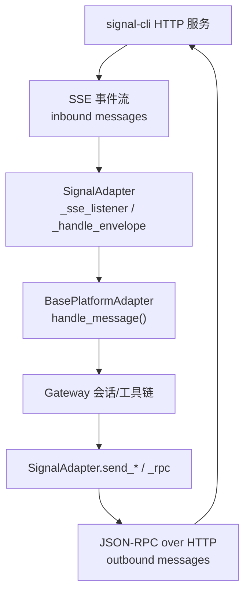
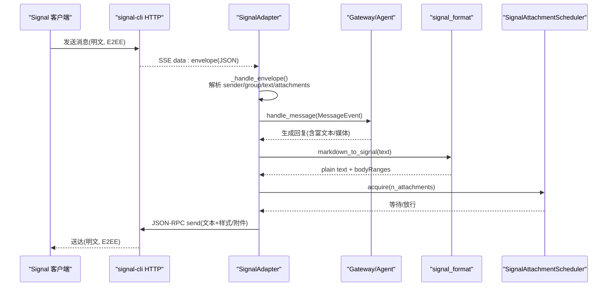
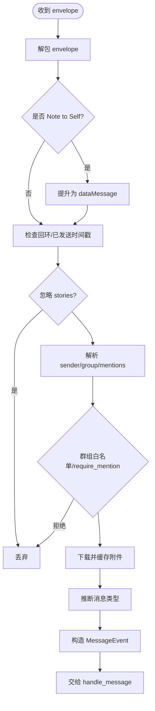
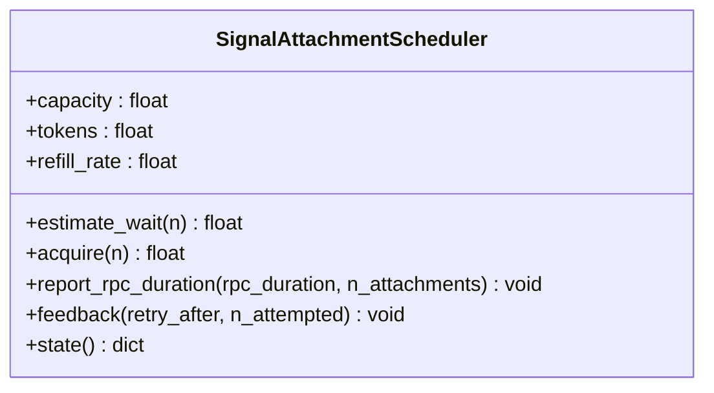
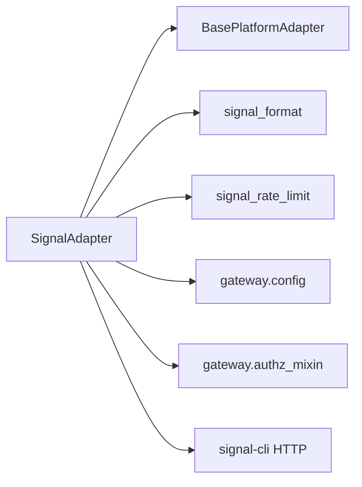

# Signal 集成

<cite>
**本文引用的文件**
- [gateway/platforms/signal.py](file://gateway/platforms/signal.py)
- [gateway/platforms/signal_format.py](file://gateway/platforms/signal_format.py)
- [gateway/platforms/signal_rate_limit.py](file://gateway/platforms/signal_rate_limit.py)
- [website/docs/user-guide/messaging/signal.md](file://website/docs/user-guide/messaging/signal.md)
- [tests/gateway/test_signal.py](file://tests/gateway/test_signal.py)
- [gateway/platforms/base.py](file://gateway/platforms/base.py)
- [gateway/config.py](file://gateway/config.py)
- [gateway/authz_mixin.py](file://gateway/authz_mixin.py)
</cite>

## 目录
1. [简介](#简介)
2. [项目结构](#项目结构)
3. [核心组件](#核心组件)
4. [架构总览](#架构总览)
5. [详细组件分析](#详细组件分析)
6. [依赖关系分析](#依赖关系分析)
7. [性能考量](#性能考量)
8. [故障排除指南](#故障排除指南)
9. [结论](#结论)
10. [附录](#附录)

## 简介
本文件面向需要在 Hermes Agent 中集成 Signal 平台的工程与运维人员，系统性说明 Signal 平台适配器的实现、端到端加密的边界、消息路由与速率限制策略、富文本/媒体能力、群组聊天、账户配置、设备注册、联系人同步与消息存储管理，以及常见问题的排查与优化建议。

Signal 通过 signal-cli HTTP 模式与 Hermes 通信：入站消息经 SSE 流式推送，出站消息与操作通过 JSON-RPC over HTTP 完成。Hermes 不直接持有 Signal 协议密钥或实现 Signal Protocol；端到端加密由 signal-cli 与 Signal 服务端负责，Hermes 仅作为“桥接层”进行消息收发、格式转换与调度。

## 项目结构
围绕 Signal 的核心代码集中在 gateway/platforms 下，并配套格式化、速率限制与用户文档：
- gateway/platforms/signal.py：Signal 适配器主逻辑（连接、SSE 监听、消息处理、发送）
- gateway/platforms/signal_format.py：Markdown → Signal 原生样式转换
- gateway/platforms/signal_rate_limit.py：进程级令牌桶调度器，模拟并遵循 Signal 附件上传速率限制
- website/docs/user-guide/messaging/signal.md：安装、配置、功能与安全指南
- tests/gateway/test_signal.py：适配器行为与边界用例测试
- gateway/platforms/base.py：平台适配器基类与通用能力（类型、缓存、TTS 等）
- gateway/config.py：环境变量到平台配置的映射与默认值
- gateway/authz_mixin.py：访问控制与环境变量策略（DM/群组白名单）

图表来源
- [gateway/platforms/signal.py:426-490](file://gateway/platforms/signal.py#L426-L490)
- [gateway/platforms/signal.py:536-770](file://gateway/platforms/signal.py#L536-L770)
- [gateway/platforms/base.py:1-200](file://gateway/platforms/base.py#L1-L200)

章节来源
- [gateway/platforms/signal.py:1-120](file://gateway/platforms/signal.py#L1-L120)
- [website/docs/user-guide/messaging/signal.md:1-120](file://website/docs/user-guide/messaging/signal.md#L1-L120)

## 核心组件
- SignalAdapter：继承自 BasePlatformAdapter，封装与 signal-cli 的 HTTP/SSE 交互、消息解析、附件处理、群组过滤、提及处理、回复引用、健康监控与重连。
- Markdown→Signal 转换器：将 Markdown 转换为 Signal 原生 bodyRanges（粗体、斜体、删除线、等宽、标题），保证在客户端正确渲染。
- 速率限制调度器：进程级令牌桶，模拟 Signal 附件上传速率限制，支持从服务器反馈校准 refill rate，避免 429 风暴。
- 配置与访问控制：通过环境变量注入信号地址、账号、允许列表、群组策略等；网关层统一鉴权。

章节来源
- [gateway/platforms/signal.py:253-342](file://gateway/platforms/signal.py#L253-L342)
- [gateway/platforms/signal_format.py:12-141](file://gateway/platforms/signal_format.py#L12-L141)
- [gateway/platforms/signal_rate_limit.py:170-375](file://gateway/platforms/signal_rate_limit.py#L170-L375)
- [gateway/config.py:2008-2023](file://gateway/config.py#L2008-L2023)
- [gateway/authz_mixin.py:513-540](file://gateway/authz_mixin.py#L513-L540)

## 架构总览
Signal 集成采用“适配器 + 外部 daemon”的分层架构：
- 传输层：HTTPX 异步客户端，SSE 长连接接收事件，JSON-RPC 调用发送消息与动作。
- 适配层：SignalAdapter 负责事件解包、内容清洗、媒体缓存、群组/提及策略、回复上下文、发送路径。
- 格式层：markdown_to_signal 将 LLM 输出转为 Signal 原生样式。
- 调度层：SignalAttachmentScheduler 对附件上传做令牌桶限流，结合服务器反馈动态校准。
- 安全与访问控制：环境变量与网关鉴权共同决定 DM/群组访问权限。

图表来源
- [gateway/platforms/signal.py:426-490](file://gateway/platforms/signal.py#L426-L490)
- [gateway/platforms/signal.py:536-770](file://gateway/platforms/signal.py#L536-L770)
- [gateway/platforms/signal_format.py:12-141](file://gateway/platforms/signal_format.py#L12-L141)
- [gateway/platforms/signal_rate_limit.py:228-329](file://gateway/platforms/signal_rate_limit.py#L228-L329)

## 详细组件分析

### SignalAdapter（消息接入与发送）
- 连接与健康监控
  - connect() 校验必要配置，建立 HTTPX 客户端，执行 health check，启动 SSE 监听与健康监控任务。
  - disconnect() 取消任务、关闭客户端、释放平台锁。
- SSE 监听
  - 持续读取 text/event-stream，解析 data: 行，更新最后活动时间，异常时指数退避重连。
- 消息处理
  - 解包 envelope，处理 syncMessage（Note to Self）、过滤故事消息、提取 sender/group、应用群组白名单与 require_mention。
  - 解析 mentions，清理自身 @mention，保留 quote 引用上下文（reply_to_id/author）。
  - 下载并缓存附件，推断 MIME 类型，按媒体类型设置消息类型（文本/语音/图片/视频/文档）。
  - 构建 MessageEvent 并交由上层 handle_message。
- 发送路径
  - 使用 JSON-RPC 调用发送文本（带 bodyRanges）与附件；附件上传前通过调度器申请令牌，超时随附件数量动态调整。

图表来源
- [gateway/platforms/signal.py:536-770](file://gateway/platforms/signal.py#L536-L770)

章节来源
- [gateway/platforms/signal.py:347-421](file://gateway/platforms/signal.py#L347-L421)
- [gateway/platforms/signal.py:426-531](file://gateway/platforms/signal.py#L426-L531)
- [gateway/platforms/signal.py:536-770](file://gateway/platforms/signal.py#L536-L770)

### Markdown→Signal 格式转换
- 将 Markdown 的粗体、斜体、删除线、等宽、标题等转换为 Signal 的 bodyRanges（UTF-16 偏移）。
- 规范化列表标记，保持代码块内内容不变。
- 输出纯文本与样式范围列表，供发送时使用。

章节来源
- [gateway/platforms/signal_format.py:12-141](file://gateway/platforms/signal_format.py#L12-L141)

### 速率限制与令牌桶调度
- 目标：避免触发 Signal 附件上传速率限制（429），在多会话共享同一 signal-cli 时公平排队。
- 机制：
  - 进程级单例 Scheduler，容量=50（匹配服务端桶大小），默认 refill 间隔 4s/token。
  - acquire(n) 阻塞直到可用，report_rpc_duration(n) 在 RPC 完成后扣减令牌且不计算上传期 refill。
  - feedback(retry_after, n) 根据服务器提示校准 refill rate，并将 tokens 置零以快速收敛。
  - 检测 429 错误（包括结构化字段与字符串匹配），提取 Retry-After。
- 超时：send 超时随附件数线性增长，避免大附件批次被截断。

图表来源
- [gateway/platforms/signal_rate_limit.py:170-375](file://gateway/platforms/signal_rate_limit.py#L170-L375)

章节来源
- [gateway/platforms/signal_rate_limit.py:29-164](file://gateway/platforms/signal_rate_limit.py#L29-L164)
- [gateway/platforms/signal_rate_limit.py:170-375](file://gateway/platforms/signal_rate_limit.py#L170-L375)

### 富文本、文件上传、语音消息与群组聊天
- 富文本：通过 markdown_to_signal 生成 bodyRanges，确保客户端原生渲染。
- 文件上传：附件大小上限 100MB；音频容器自动识别与修复（ADTS AAC→M4A），提高 STT 兼容性。
- 语音消息：音频类型识别为 voice，走语音通道；若未配置 STT，则作为附件传递。
- 群组聊天：支持群组白名单与 require_mention；自动清理机器人自身的 @mention，避免误解析。

章节来源
- [gateway/platforms/signal.py:85-137](file://gateway/platforms/signal.py#L85-L137)
- [gateway/platforms/signal.py:194-213](file://gateway/platforms/signal.py#L194-L213)
- [gateway/platforms/signal.py:594-668](file://gateway/platforms/signal.py#L594-L668)
- [website/docs/user-guide/messaging/signal.md:148-193](file://website/docs/user-guide/messaging/signal.md#L148-L193)

### 账户配置、设备注册、联系人同步与消息存储
- 账户配置：通过环境变量 SIGNAL_HTTP_URL、SIGNAL_ACCOUNT 注入；支持额外 extra 字段覆盖。
- 设备注册：使用 signal-cli link 流程将 Hermes 作为“链接设备”，无需修改代码。
- 联系人同步：适配器维护 number↔UUID 映射缓存，用于出站寻址优化；不主动拉取通讯录。
- 消息存储：Hermes 不持久化 Signal 消息；消息生命周期由 Gateway/Agent 会话管理，附件落盘缓存由适配器内部缓存模块管理。

章节来源
- [website/docs/user-guide/messaging/signal.md:45-120](file://website/docs/user-guide/messaging/signal.md#L45-L120)
- [gateway/platforms/signal.py:310-337](file://gateway/platforms/signal.py#L310-L337)
- [gateway/platforms/signal.py:771-777](file://gateway/platforms/signal.py#L771-L777)

## 依赖关系分析
- 运行时依赖：signal-cli（Java 17+），HTTPX（Python 标准库之外唯一第三方依赖）。
- 模块耦合：
  - SignalAdapter 依赖 base.BasePlatformAdapter 提供通用能力（消息类型、缓存、TTS）。
  - 依赖 signal_format 进行文本样式转换。
  - 依赖 signal_rate_limit 进行附件上传限速。
  - 依赖 gateway.config 与 authz_mixin 完成配置加载与访问控制。
- 外部系统：signal-cli HTTP 服务（健康检查、事件流、JSON-RPC）。

图表来源
- [gateway/platforms/signal.py:33-59](file://gateway/platforms/signal.py#L33-L59)
- [gateway/platforms/base.py:1-200](file://gateway/platforms/base.py#L1-L200)
- [gateway/config.py:2008-2023](file://gateway/config.py#L2008-L2023)
- [gateway/authz_mixin.py:513-540](file://gateway/authz_mixin.py#L513-L540)

章节来源
- [gateway/platforms/signal.py:33-59](file://gateway/platforms/signal.py#L33-L59)
- [gateway/config.py:2008-2023](file://gateway/config.py#L2008-L2023)
- [gateway/authz_mixin.py:513-540](file://gateway/authz_mixin.py#L513-L540)

## 性能考量
- SSE 重连：指数退避（2s→60s）加抖动，避免雪崩。
- 健康监控：每 30s 检查 SSE 空闲，超过 120s 无活动触发健康检查与强制重连。
- 打字指示：每 8s 刷新一次，针对网络失败场景有冷却跳过，减少无效 RPC。
- 附件上传：令牌桶调度，按附件数动态调整超时，避免大批次被截断。
- 音频转码：ADTS AAC→M4A 无损 remux，提升 STT 兼容性且开销极低。

章节来源
- [gateway/platforms/signal.py:66-73](file://gateway/platforms/signal.py#L66-L73)
- [gateway/platforms/signal.py:426-490](file://gateway/platforms/signal.py#L426-L490)
- [gateway/platforms/signal.py:495-531](file://gateway/platforms/signal.py#L495-L531)
- [gateway/platforms/signal_rate_limit.py:152-164](file://gateway/platforms/signal_rate_limit.py#L152-L164)
- [gateway/platforms/signal_rate_limit.py:228-329](file://gateway/platforms/signal_rate_limit.py#L228-L329)
- [gateway/platforms/signal.py:139-192](file://gateway/platforms/signal.py#L139-L192)

## 故障排除指南
- 无法连接 signal-cli
  - 确认 daemon 运行：signal-cli --account <E.164> daemon --http 127.0.0.1:8080
  - 检查环境变量 SIGNAL_HTTP_URL、SIGNAL_ACCOUNT
  - 参考健康检查接口返回状态
- 消息未收到
  - 检查 SIGNAL_ALLOWED_USERS 是否包含发送者号码（E.164）
  - 群组消息需配置 SIGNAL_GROUP_ALLOWED_USERS（具体 ID 或 *）
- 频繁掉线/重连
  - 查看 signal-cli 日志，确认 Java 版本与进程稳定性
  - 关注 SSE 空闲告警与强制重连日志
- 附件上传失败/限速
  - 观察 429 错误与 Retry-After，确认调度器状态
  - 降低并发或分批发送，避免超出 per-message 附件上限
- 语音无法转录
  - 确认 ffmpeg 可用，以便 ADTS→M4A 转码
  - 检查音频容器识别是否正确（WAV/M4A/AAC）
- 重复消息/回环
  - 检查 Note to Self 与 echo-back 保护（最近发送时间戳缓存）

章节来源
- [website/docs/user-guide/messaging/signal.md:221-246](file://website/docs/user-guide/messaging/signal.md#L221-L246)
- [tests/gateway/test_signal.py:83-103](file://tests/gateway/test_signal.py#L83-L103)
- [gateway/platforms/signal_rate_limit.py:111-138](file://gateway/platforms/signal_rate_limit.py#L111-L138)
- [gateway/platforms/signal.py:310-337](file://gateway/platforms/signal.py#L310-L337)

## 结论
Hermes 的 Signal 集成通过 signal-cli HTTP 模式实现了稳定可靠的消息桥接：SSE 实时入站、JSON-RPC 出站、Markdown 原生样式转换、附件限速调度与群组/提及策略完善。端到端加密由 signal-cli 与 Signal 服务端保障，Hermes 专注于适配层与业务编排。通过合理的配置、访问控制与性能调优，可在生产环境获得高可用、低延迟的 Signal 机器人体验。

## 附录
- 环境变量参考
  - SIGNAL_HTTP_URL：signal-cli HTTP 地址
  - SIGNAL_ACCOUNT：机器人号码（E.164）
  - SIGNAL_ALLOWED_USERS：允许 DM 的用户列表
  - SIGNAL_GROUP_ALLOWED_USERS：允许的群组 ID 或 *
  - SIGNAL_HOME_CHANNEL：定时任务默认投递渠道
- 关键常量
  - 附件大小上限：100MB
  - 最大消息长度：8000 字符
  - 单次消息附件上限：32
  - 令牌桶容量：50，默认 refill 间隔：4s/token

章节来源
- [website/docs/user-guide/messaging/signal.md:249-259](file://website/docs/user-guide/messaging/signal.md#L249-L259)
- [gateway/platforms/signal.py:66-68](file://gateway/platforms/signal.py#L66-L68)
- [gateway/platforms/signal_rate_limit.py:33-38](file://gateway/platforms/signal_rate_limit.py#L33-L38)