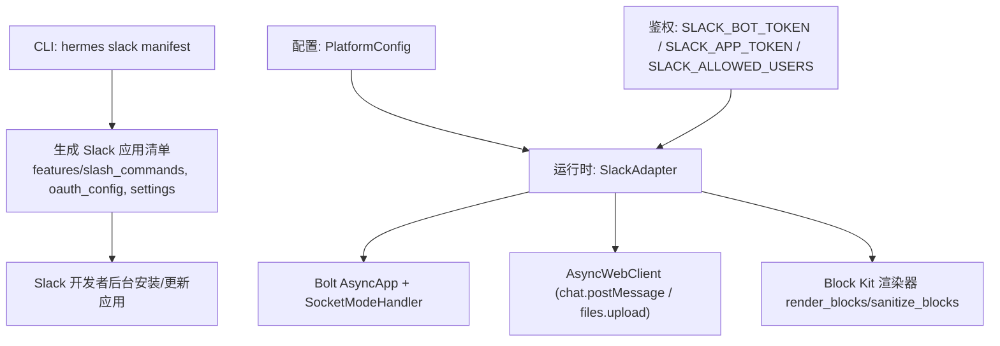
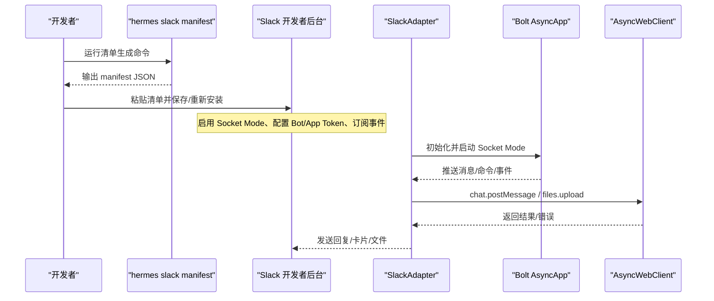
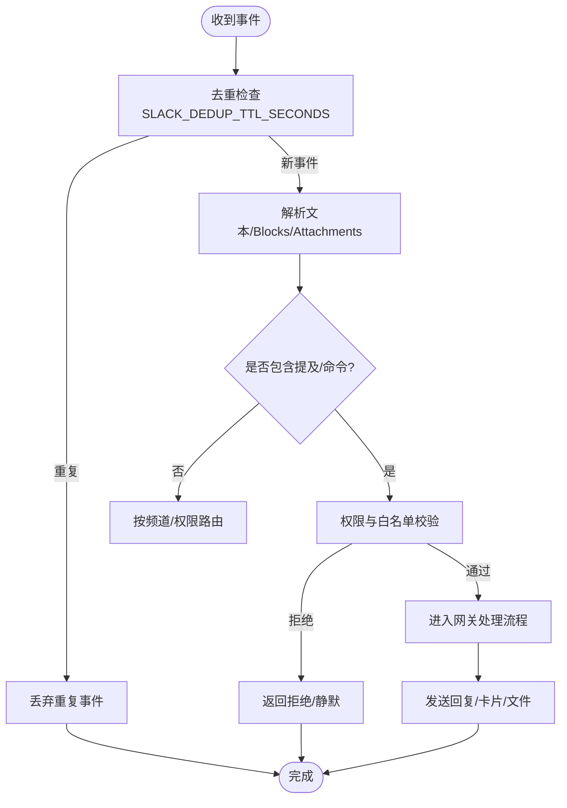
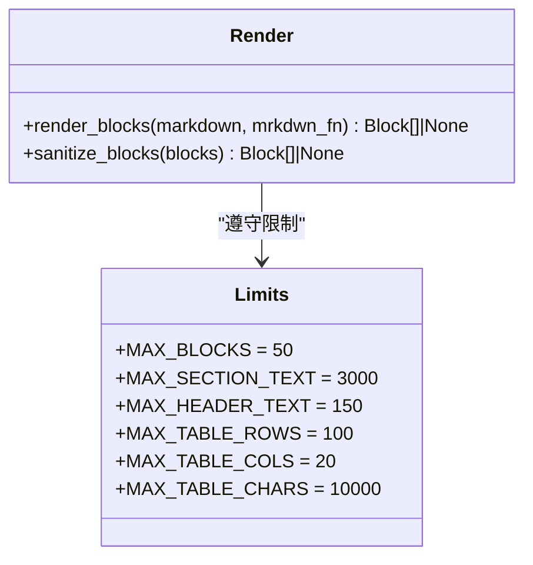
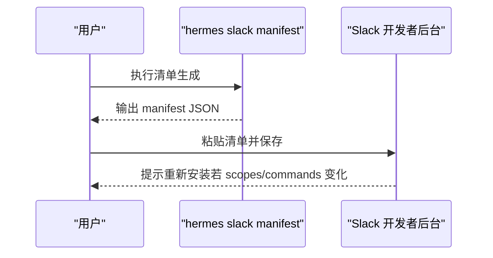
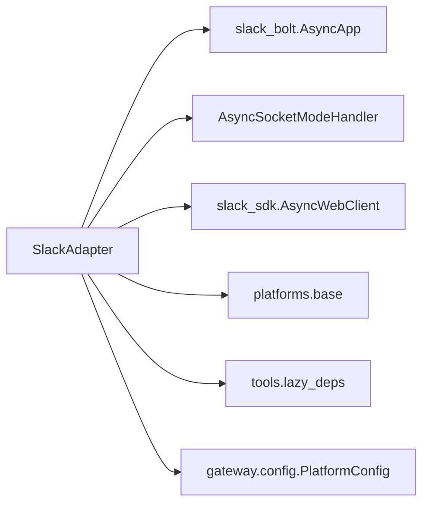

# Slack 集成

<cite>
**本文引用的文件**
- [adapter.py](file://plugins/platforms/slack/adapter.py)
- [block_kit.py](file://plugins/platforms/slack/block_kit.py)
- [slack_cli.py](file://hermes_cli/slack_cli.py)
- [subcommands/slack.py](file://hermes_cli/subcommands/slack.py)
- [config.py](file://gateway/config.py)
- [authz_mixin.py](file://gateway/authz_mixin.py)
- [test_slack.py](file://tests/gateway/test_slack.py)
</cite>

## 目录
1. [简介](#简介)
2. [项目结构](#项目结构)
3. [核心组件](#核心组件)
4. [架构总览](#架构总览)
5. [详细组件分析](#详细组件分析)
6. [依赖关系分析](#依赖关系分析)
7. [性能与速率限制](#性能与速率限制)
8. [故障排除指南](#故障排除指南)
9. [结论](#结论)
10. [附录：配置与环境变量](#附录：配置与环境变量)

## 简介
本文件面向在 Hermes Agent 中集成 Slack 平台的工程与运维人员，系统性说明基于 Slack Bolt SDK（Socket Mode）的接入方式、OAuth 与应用清单生成、事件订阅、消息回调处理、Block Kit 富文本渲染、文件上传、工作空间权限与频道管理、以及速率限制与故障排查。文档同时覆盖 Slack App Token 与 Bot Token 的配置要点、用户与工作区权限控制策略，并提供可操作的排障建议与性能调优指引。

## 项目结构
Slack 集成主要分布在以下模块：
- 平台适配器：plugins/platforms/slack/adapter.py
- Block Kit 渲染器：plugins/platforms/slack/block_kit.py
- CLI 清单生成：hermes_cli/slack_cli.py、hermes_cli/subcommands/slack.py
- 平台配置与鉴权：gateway/config.py、gateway/authz_mixin.py
- 测试用例：tests/gateway/test_slack.py

图表来源
- [slack_cli.py:30-163](file://hermes_cli/slack_cli.py#L30-L163)
- [adapter.py:25-65](file://plugins/platforms/slack/adapter.py#L25-L65)
- [block_kit.py:368-535](file://plugins/platforms/slack/block_kit.py#L368-L535)
- [config.py:580-600](file://gateway/config.py#L580-L600)

章节来源
- [slack_cli.py:1-163](file://hermes_cli/slack_cli.py#L1-L163)
- [adapter.py:1-120](file://plugins/platforms/slack/adapter.py#L1-L120)
- [block_kit.py:1-60](file://plugins/platforms/slack/block_kit.py#L1-L60)
- [config.py:580-600](file://gateway/config.py#L580-L600)

## 核心组件
- Slack 平台适配器（SlackAdapter）
  - 使用 Bolt 异步应用与 Socket Mode 接收消息、命令、线程上下文等事件；通过 Web API 发送消息、文件与交互响应。
  - 负责消息去重、代理设置、错误体截断、Block Kit 提取与还原、音频容器映射、线程上下文缓存等。
- Block Kit 渲染器
  - 将 Agent 输出的 Markdown 转换为 Slack Block Kit blocks，支持标题、分隔线、代码块、引用、列表、表格（原生 table 或等宽回退）、段落分段与长度限制。
  - 提供 sanitize_blocks 对最终 payload 做边界保护，避免 invalid_blocks 导致整条消息失败。
- CLI 清单生成
  - 生成包含 slash commands、bot scopes、event subscriptions、interactivity、socket_mode 的应用清单，支持 assistant/agent/none 三种消息体验模式。
- 配置与鉴权
  - 平台令牌读取、环境变量映射、允许用户白名单、忽略频道等。

章节来源
- [adapter.py:25-120](file://plugins/platforms/slack/adapter.py#L25-L120)
- [block_kit.py:368-535](file://plugins/platforms/slack/block_kit.py#L368-L535)
- [slack_cli.py:30-163](file://hermes_cli/slack_cli.py#L30-L163)
- [config.py:580-600](file://gateway/config.py#L580-L600)

## 架构总览
Slack 集成采用“适配器 + 渲染器 + CLI”的分层设计：
- CLI 负责生成并下发应用清单，完成 OAuth 授权、事件订阅、Slash 命令注册。
- 运行时由适配器维护 Bolt 应用与 Socket Mode 连接，统一收发消息与事件。
- Block Kit 渲染器确保富文本与结构化内容正确落地，并在超限或异常时降级为纯文本。

图表来源
- [slack_cli.py:30-163](file://hermes_cli/slack_cli.py#L30-L163)
- [adapter.py:25-65](file://plugins/platforms/slack/adapter.py#L25-L65)

## 详细组件分析

### Slack 适配器（SlackAdapter）
- 关键职责
  - 通过 Bolt 异步应用与 Socket Mode 建立长连接，接收 channel/DM 消息、slash 命令、reaction、assistant/agent 上下文变更等事件。
  - 调用 Web API 发送消息、文件、更新消息、处理交互回调。
  - 实现消息去重（Socket Mode 重投递窗口）、代理解析与注入、错误体大小限制、Block Kit 内容提取与还原、音频容器扩展名映射、线程上下文缓存。
- 重要行为
  - 支持从 rich_text 与 legacy attachments 中提取可读文本，保证转发/引用内容可见。
  - 对链接进行规范化以增强去重效果。
  - 对 Block Kit 中的提及进行收集，用于触发路由与权限判断。
  - 对 Socket Mode 后台任务进行可控取消与超时等待，保障优雅关闭。
  - 支持 ignored_channels 配置，屏蔽特定频道出站消息。

图表来源
- [adapter.py:748-770](file://plugins/platforms/slack/adapter.py#L748-L770)
- [adapter.py:325-380](file://plugins/platforms/slack/adapter.py#L325-L380)
- [adapter.py:494-533](file://plugins/platforms/slack/adapter.py#L494-L533)
- [adapter.py:665-745](file://plugins/platforms/slack/adapter.py#L665-L745)

章节来源
- [adapter.py:25-120](file://plugins/platforms/slack/adapter.py#L25-L120)
- [adapter.py:325-380](file://plugins/platforms/slack/adapter.py#L325-L380)
- [adapter.py:494-533](file://plugins/platforms/slack/adapter.py#L494-L533)
- [adapter.py:665-745](file://plugins/platforms/slack/adapter.py#L665-L745)
- [adapter.py:748-770](file://plugins/platforms/slack/adapter.py#L748-L770)

### Block Kit 渲染器
- 功能要点
  - 将 Markdown 转换为 Slack Block Kit blocks，包括 header、divider、preformatted、quote、list、table、section 等。
  - 严格遵循 Slack 限制：最大 50 个 block、section 文本 3000 字符、header 文本 150 字符、table 行列与字符上限。
  - 当内容过大或无法安全表达时，返回 None 让上层回退到纯文本路径，确保不丢消息。
  - sanitize_blocks 对最终 payload 做兜底裁剪与修复，避免 invalid_blocks 导致整条消息失败。
- 典型场景
  - 大表格优先尝试原生 table，超限则回退为等宽文本。
  - 代码块与引用保持原样，列表支持嵌套与有序/无序混合。
  - 段落自动拆分以避免超过 section 文本限制。

图表来源
- [block_kit.py:34-42](file://plugins/platforms/slack/block_kit.py#L34-L42)
- [block_kit.py:368-535](file://plugins/platforms/slack/block_kit.py#L368-L535)
- [block_kit.py:591-689](file://plugins/platforms/slack/block_kit.py#L591-L689)

章节来源
- [block_kit.py:1-60](file://plugins/platforms/slack/block_kit.py#L1-L60)
- [block_kit.py:368-535](file://plugins/platforms/slack/block_kit.py#L368-L535)
- [block_kit.py:591-689](file://plugins/platforms/slack/block_kit.py#L591-L689)

### CLI 清单生成（OAuth 与事件订阅）
- 能力
  - 生成完整 Slack 应用清单，包含：
    - features.slash_commands：将网关命令注册为原生 Slash 命令。
    - oauth_config.scopes.bot：Bot 所需权限范围。
    - settings.event_subscriptions.bot_events：订阅消息、反应、助手/代理上下文事件。
    - settings.interactivity.is_enabled：启用交互。
    - settings.socket_mode_enabled：启用 Socket Mode。
  - 支持三种消息体验：assistant_view、agent_view、none（仅 DM 平面聊天）。
- 使用方式
  - 通过 hermes slack manifest 输出 JSON，粘贴至 Slack 开发者后台 Features → App Manifest → Edit，保存后根据提示重新安装应用。

图表来源
- [slack_cli.py:30-163](file://hermes_cli/slack_cli.py#L30-L163)
- [slack_cli.py:166-283](file://hermes_cli/slack_cli.py#L166-L283)

章节来源
- [slack_cli.py:1-163](file://hermes_cli/slack_cli.py#L1-L163)
- [slack_cli.py:166-283](file://hermes_cli/slack_cli.py#L166-L283)
- [subcommands/slack.py:12-94](file://hermes_cli/subcommands/slack.py#L12-L94)

### 工作区权限与频道管理
- 令牌与环境变量
  - 平台令牌映射：Platform.SLACK -> SLACK_BOT_TOKEN。
  - 应用令牌：SLACK_APP_TOKEN（Socket Mode 需要）。
  - 用户白名单：SLACK_ALLOWED_USERS（限制哪些用户可触发机器人）。
- 频道控制
  - ignored_channels：来自 PlatformConfig.extra，用于屏蔽特定频道出站消息。
  - 测试覆盖：忽略频道的出站消息会被抑制并返回错误码。

章节来源
- [config.py:580-600](file://gateway/config.py#L580-L600)
- [authz_mixin.py:512-858](file://gateway/authz_mixin.py#L512-L858)
- [test_slack.py:116-140](file://tests/gateway/test_slack.py#L116-L140)

## 依赖关系分析
- 外部依赖
  - slack_bolt：AsyncApp、AsyncSocketModeHandler。
  - slack_sdk：AsyncWebClient。
  - aiohttp：网络请求底层库。
- 内部依赖
  - gateway.config.PlatformConfig：平台配置与额外参数。
  - gateway.platforms.base：消息事件类型、发送结果、代理与 SSRF 防护等通用能力。
  - tools.lazy_deps：按需安装与绑定依赖。

图表来源
- [adapter.py:25-65](file://plugins/platforms/slack/adapter.py#L25-L65)
- [adapter.py:286-323](file://plugins/platforms/slack/adapter.py#L286-L323)

章节来源
- [adapter.py:25-65](file://plugins/platforms/slack/adapter.py#L25-L65)
- [adapter.py:286-323](file://plugins/platforms/slack/adapter.py#L286-L323)

## 性能与速率限制
- 速率限制与重试
  - 适配器未内置显式指数退避逻辑，但通过 Socket Mode 重投递窗口与去重 TTL（默认 1 小时）降低重复处理风险。
  - 可通过环境变量 SLACK_DEDUP_TTL_SECONDS 调整去重窗口，覆盖 Socket Mode 重连重发导致的重复事件。
- 流式编辑与打字指示
  - 平台配置支持 typing_indicator 与 typing_status_text，适配 Slack 的“正在输入”状态。
  - 流式编辑间隔与缓冲阈值在全局 StreamingConfig 中定义，避免频繁 edit 触发速率限制。
- 代理与网络
  - 支持解析并注入代理 URL，排除 NO_PROXY 主机（如 slack.com、files.slack.com、wss-primary.slack.com）。
- Block Kit 限制
  - 严格遵守 Slack 的结构限制（50 个 block、section 3000 字符、header 150 字符、table 行列与字符上限），超限自动回退，避免无效 payload。

章节来源
- [adapter.py:720-770](file://plugins/platforms/slack/adapter.py#L720-L770)
- [config.py:614-630](file://gateway/config.py#L614-L630)
- [config.py:710-718](file://gateway/config.py#L710-L718)
- [block_kit.py:34-42](file://plugins/platforms/slack/block_kit.py#L34-L42)

## 故障排除指南
- 事件处理失败
  - 现象：重复事件或消息未处理。
  - 排查：检查 SLACK_DEDUP_TTL_SECONDS 是否过小；确认 Socket Mode 已启用且 token 有效；查看 adapter 日志中的 Socket Mode 任务取消与超时信息。
  - 参考：[adapter.py:684-718](file://plugins/platforms/slack/adapter.py#L684-L718)、[adapter.py:748-770](file://plugins/platforms/slack/adapter.py#L748-L770)
- 消息同步问题
  - 现象：rich_text 引用/转发内容丢失或链接显示异常。
  - 排查：确认 _extract_text_from_slack_blocks 与 _normalize_slack_text_for_dedupe 正常工作；检查 Block Kit 提取与链接规范化逻辑。
  - 参考：[adapter.py:399-492](file://plugins/platforms/slack/adapter.py#L399-L492)、[adapter.py:540-555](file://plugins/platforms/slack/adapter.py#L540-L555)
- Block Kit 渲染失败
  - 现象：invalid_blocks 错误导致消息发送失败。
  - 排查：使用 sanitize_blocks 兜底裁剪；检查 table 行列与字符数是否超限；必要时回退为纯文本。
  - 参考：[block_kit.py:591-689](file://plugins/platforms/slack/block_kit.py#L591-L689)
- 权限与访问控制
  - 现象：用户无法触发机器人或被忽略频道拦截。
  - 排查：检查 SLACK_ALLOWED_USERS 白名单；确认 ignored_channels 配置；验证 bot scopes 是否包含必要权限。
  - 参考：[authz_mixin.py:512-858](file://gateway/authz_mixin.py#L512-L858)、[test_slack.py:116-140](file://tests/gateway/test_slack.py#L116-L140)
- 代理与网络
  - 现象：无法连接 Slack 或文件下载失败。
  - 排查：确认代理 URL 合法且未被 NO_PROXY 排除；检查 _apply_slack_proxy 与 _resolve_slack_proxy_url。
  - 参考：[adapter.py:665-745](file://plugins/platforms/slack/adapter.py#L665-L745)

章节来源
- [adapter.py:684-718](file://plugins/platforms/slack/adapter.py#L684-L718)
- [adapter.py:748-770](file://plugins/platforms/slack/adapter.py#L748-L770)
- [adapter.py:399-492](file://plugins/platforms/slack/adapter.py#L399-L492)
- [adapter.py:540-555](file://plugins/platforms/slack/adapter.py#L540-L555)
- [block_kit.py:591-689](file://plugins/platforms/slack/block_kit.py#L591-L689)
- [authz_mixin.py:512-858](file://gateway/authz_mixin.py#L512-L858)
- [test_slack.py:116-140](file://tests/gateway/test_slack.py#L116-L140)
- [adapter.py:665-745](file://plugins/platforms/slack/adapter.py#L665-L745)

## 结论
该 Slack 集成方案通过 Bolt Socket Mode 实现稳定可靠的消息收发与事件处理，配合 Block Kit 渲染器提供丰富的富文本与结构化界面能力。CLI 清单生成简化了 OAuth 授权与事件订阅配置，平台配置与鉴权机制确保工作区与频道级别的精细控制。结合去重、代理、错误体限制与流式编辑等特性，整体具备较强的鲁棒性与可扩展性。在生产环境中，建议关注速率限制与网络代理配置，并通过环境变量与配置项优化去重窗口与用户体验。

## 附录：配置与环境变量
- 必需令牌
  - SLACK_BOT_TOKEN：Bot 令牌（xoxb-...）。
  - SLACK_APP_TOKEN：应用令牌（xapp-...），用于 Socket Mode。
- 可选配置
  - SLACK_ALLOWED_USERS：允许的用户 ID 列表（逗号分隔）。
  - SLACK_DEDUP_TTL_SECONDS：Socket Mode 重投递去重窗口（秒），默认 3600。
  - PlatformConfig.extra.ignored_channels：忽略的频道集合。
  - PlatformConfig.typing_indicator / typing_status_text：打字指示与状态文案。
  - PlatformConfig.reply_to_mode：回复线程模式（off/first/all）。
- 清单生成
  - 使用 hermes slack manifest 生成并粘贴到 Slack 开发者后台，选择 assistant/agent/none 消息体验模式。

章节来源
- [config.py:580-600](file://gateway/config.py#L580-L600)
- [authz_mixin.py:512-858](file://gateway/authz_mixin.py#L512-L858)
- [adapter.py:748-770](file://plugins/platforms/slack/adapter.py#L748-L770)
- [slack_cli.py:30-163](file://hermes_cli/slack_cli.py#L30-L163)