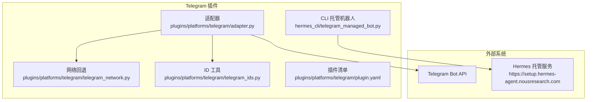
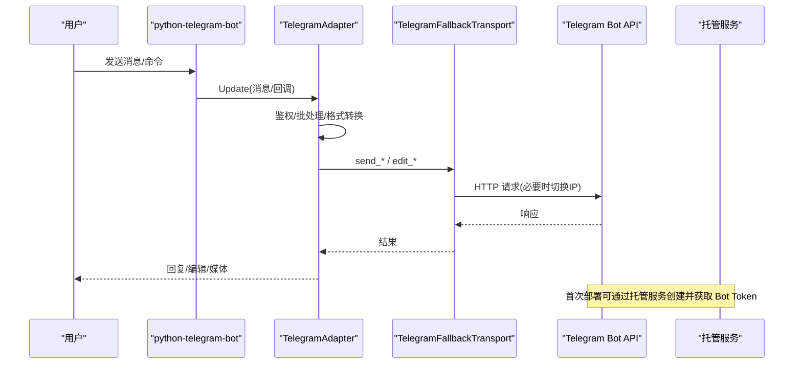
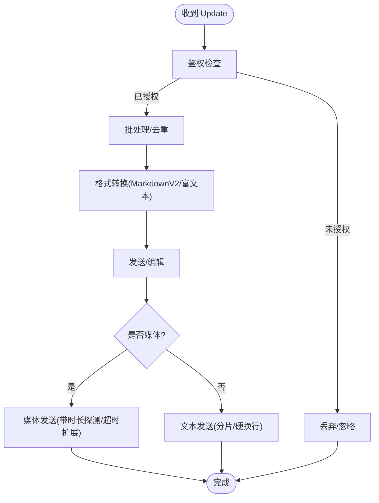
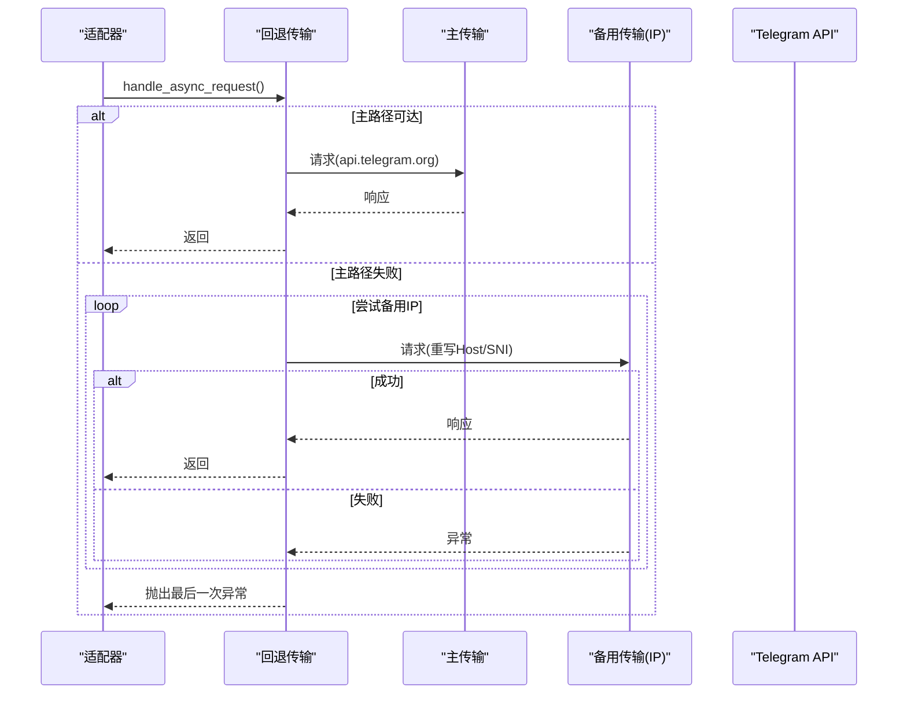
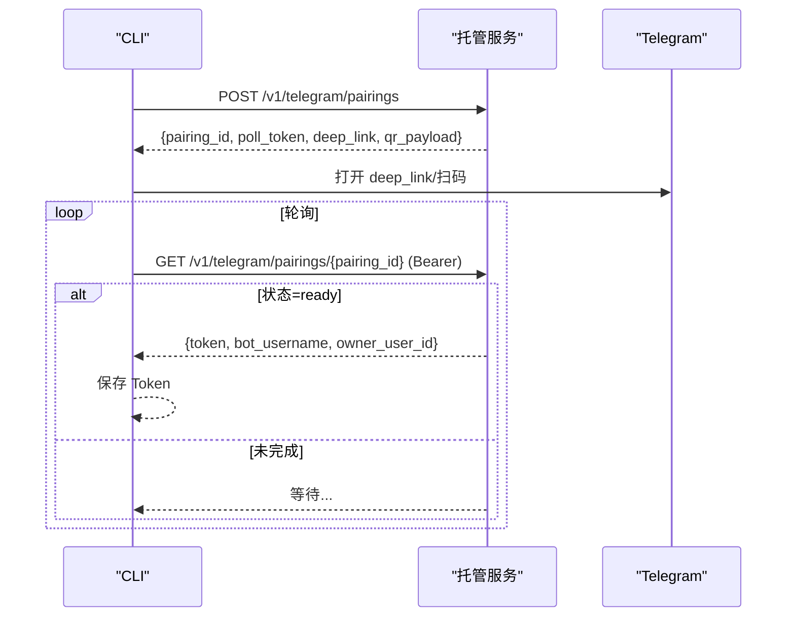
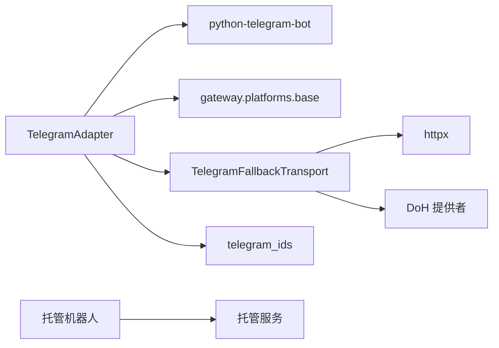

# Telegram 集成

<cite>
**本文引用的文件**
- [adapter.py](file://plugins/platforms/telegram/adapter.py)
- [plugin.yaml](file://plugins/platforms/telegram/plugin.yaml)
- [telegram_network.py](file://plugins/platforms/telegram/telegram_network.py)
- [telegram_ids.py](file://plugins/platforms/telegram/telegram_ids.py)
- [telegram_managed_bot.py](file://hermes_cli/telegram_managed_bot.py)
- [test_telegram_connect.py](file://tests/gateway/test_telegram_connect.py)
- [test_telegram_auth_check.py](file://tests/gateway/test_telegram_auth_check.py)
</cite>

## 目录
1. [简介](#简介)
2. [项目结构](#项目结构)
3. [核心组件](#核心组件)
4. [架构总览](#架构总览)
5. [详细组件分析](#详细组件分析)
6. [依赖关系分析](#依赖关系分析)
7. [性能与速率限制](#性能与速率限制)
8. [故障排除指南](#故障排除指南)
9. [结论](#结论)
10. [附录：配置与环境变量](#附录：配置与环境变量)

## 简介
本文件面向在 Hermes Agent 中集成 Telegram Bot 的开发者与运维人员，系统性说明以下主题：
- OAuth 认证流程（Managed Bots 自动创建与配对）
- Webhook 与长轮询模式配置（默认基于 python-telegram-bot 的长轮询）
- 消息格式转换（MarkdownV2、富文本、表格、代码块等）
- 速率限制与重试策略（Telegram API 限流、连接池、回退 IP）
- Telegram 特定能力（内联键盘、媒体上传、语音/视频、富文本草稿预览）
- 环境变量与 Bot Token 管理、群组与工作线程管理
- 故障排除（连接问题、消息丢失、性能调优）

## 项目结构
Telegram 平台以插件形式接入 Gateway，核心由适配器、网络层、ID 工具与 CLI 托管机器人组成：
- 适配器：负责消息收发、格式化、会话与批处理、错误与限流处理
- 网络层：提供 DNS-over-HTTPS 发现与直连 IP 回退，保持 TLS/SNI 不变
- ID 工具：规范化 chat_id（数字或 @username），避免类型错误
- CLI 托管机器人：通过 Nous 托管服务完成 Managed Bots 配对与令牌获取

**图示来源**
- [adapter.py:633-800](file://plugins/platforms/telegram/adapter.py#L633-L800)
- [telegram_network.py:52-166](file://plugins/platforms/telegram/telegram_network.py#L52-L166)
- [telegram_ids.py:23-52](file://plugins/platforms/telegram/telegram_ids.py#L23-L52)
- [plugin.yaml:1-36](file://plugins/platforms/telegram/plugin.yaml#L1-L36)
- [telegram_managed_bot.py:166-359](file://hermes_cli/telegram_managed_bot.py#L166-L359)

**章节来源**
- [adapter.py:633-800](file://plugins/platforms/telegram/adapter.py#L633-L800)
- [plugin.yaml:1-36](file://plugins/platforms/telegram/plugin.yaml#L1-L36)

## 核心组件
- TelegramAdapter：实现消息接收/发送、MarkdownV2/富文本转换、批处理、编辑与最终交付、错误重定向与限流保护、工作线程与心跳监控。
- TelegramFallbackTransport：当 api.telegram.org 不可达时，通过 DoH 发现或种子 IP 进行 TCP 直连回退，保持 Host/SNI 不变。
- telegram_ids：统一 chat_id 为 Bot API 可接受的 int 或 @username 字符串。
- telegram_managed_bot：通过托管服务创建用户子机器人，生成深链/二维码，轮询获取 Bot Token。

**章节来源**
- [adapter.py:633-800](file://plugins/platforms/telegram/adapter.py#L633-L800)
- [telegram_network.py:52-166](file://plugins/platforms/telegram/telegram_network.py#L52-L166)
- [telegram_ids.py:23-52](file://plugins/platforms/telegram/telegram_ids.py#L23-L52)
- [telegram_managed_bot.py:166-359](file://hermes_cli/telegram_managed_bot.py#L166-L359)

## 架构总览
Telegram 集成采用“适配器 + 网络回退 + 托管服务”的分层设计：
- 适配器封装 Telegram Bot API 调用，屏蔽 MarkdownV2/富文本差异，处理消息批处理与编辑流。
- 网络层在连接失败时自动切换到备用 IP，降低因 DNS/网络策略导致的断连概率。
- 托管服务简化 Bot 创建与授权，避免手动复制 Token 的错误路径。

**图示来源**
- [adapter.py:633-800](file://plugins/platforms/telegram/adapter.py#L633-L800)
- [telegram_network.py:105-166](file://plugins/platforms/telegram/telegram_network.py#L105-L166)
- [telegram_managed_bot.py:166-359](file://hermes_cli/telegram_managed_bot.py#L166-L359)

## 详细组件分析

### 适配器（TelegramAdapter）
职责与关键点：
- 消息长度与分片：使用 UTF-16 长度计算，支持最大消息长度与长消息分片；对富文本路径设置字符上限。
- 格式转换：MarkdownV2 转义/清理、表格转列表、代码块保护、单换行转硬换行（富文本路径）。
- 批处理：文本与媒体批量聚合，减少客户端拆分造成的重复对话。
- 编辑与最终交付：支持流式编辑与最终消息提交，异常时回退到新建消息。
- 心跳与保活：按聊天维度节流 keep-typing，避免频繁触发限流。
- 健壮性：超时、死锁检测、任务放弃清理、连接池释放、健康检查事件。

**图示来源**
- [adapter.py:461-573](file://plugins/platforms/telegram/adapter.py#L461-L573)
- [adapter.py:633-800](file://plugins/platforms/telegram/adapter.py#L633-L800)

**章节来源**
- [adapter.py:461-573](file://plugins/platforms/telegram/adapter.py#L461-L573)
- [adapter.py:633-800](file://plugins/platforms/telegram/adapter.py#L633-L800)

### 网络回退（TelegramFallbackTransport）
- 目标：当主路径不可用时，保持逻辑主机名与 TLS SNI 不变，改用已知可达 IP 发起连接。
- 机制：优先尝试主路径；失败后按顺序尝试 DoH 发现的 IP 或种子 IP；成功则“粘性 IP”一段时间；失败则重置对应传输。
- 资源控制：限制连接数与 KeepAlive 数量，避免 CLOSE-WAIT 泄漏导致 FD 耗尽。

**图示来源**
- [telegram_network.py:52-166](file://plugins/platforms/telegram/telegram_network.py#L52-L166)
- [telegram_network.py:231-285](file://plugins/platforms/telegram/telegram_network.py#L231-L285)

**章节来源**
- [telegram_network.py:52-166](file://plugins/platforms/telegram/telegram_network.py#L52-L166)
- [telegram_network.py:231-285](file://plugins/platforms/telegram/telegram_network.py#L231-L285)

### ID 工具（chat_id 规范化）
- 将 chat_id 标准化为 Bot API 接受的 int 或 @username 字符串，避免 ValueError。
- 提供稳定键用于持久化状态。

**章节来源**
- [telegram_ids.py:23-52](file://plugins/platforms/telegram/telegram_ids.py#L23-L52)

### 托管机器人（Managed Bots 流程）
- 创建配对：向托管服务 POST 创建 pairing，返回 deep link、QR payload、poll token。
- 展示引导：终端输出 QR 码与链接，引导用户在 Telegram 中确认创建。
- 轮询结果：周期性 GET 查询配对状态，直到 ready 并返回有效 Bot Token。
- 超时与容错：网络异常或超时返回 None，提示重试或手工粘贴 Token。

**图示来源**
- [telegram_managed_bot.py:166-359](file://hermes_cli/telegram_managed_bot.py#L166-L359)

**章节来源**
- [telegram_managed_bot.py:166-359](file://hermes_cli/telegram_managed_bot.py#L166-L359)

## 依赖关系分析
- 适配器依赖：
  - python-telegram-bot（可选，懒加载与依赖检查）
  - gateway.platforms.base（通用平台抽象、缓存、代理解析）
  - telegram_network（回退传输）
  - telegram_ids（ID 规范化）
- 网络层依赖：
  - httpx（异步 HTTP 客户端与传输）
  - 系统 DNS 与 DoH 提供者（Google/Cloudflare）
- CLI 依赖：
  - httpx（与托管服务通信）
  - qrcode（可选，终端 QR 渲染）

**图示来源**
- [adapter.py:236-308](file://plugins/platforms/telegram/adapter.py#L236-L308)
- [telegram_network.py:18-44](file://plugins/platforms/telegram/telegram_network.py#L18-L44)
- [telegram_managed_bot.py:19-24](file://hermes_cli/telegram_managed_bot.py#L19-L24)

**章节来源**
- [adapter.py:236-308](file://plugins/platforms/telegram/adapter.py#L236-L308)
- [telegram_network.py:18-44](file://plugins/platforms/telegram/telegram_network.py#L18-L44)
- [telegram_managed_bot.py:19-24](file://hermes_cli/telegram_managed_bot.py#L19-L24)

## 性能与速率限制
- 文本批处理：短消息快速路径（~180ms 收敛），长消息延迟合并，避免客户端拆分造成多次对话。
- 媒体批处理：照片/视频短时间窗口聚合，减少自中断。
- 富文本路径：对单换行注入硬换行，保证多行内容正确显示；表格/代码块区域受保护不被破坏。
- 媒体发送超时：视频等媒体发送可能较长，单独放宽读取超时以避免误判。
- 连接池与回退：限制连接数，失败时切换备用 IP，粘性 IP 提升稳定性。
- 心跳节流：按聊天维度限制 keep-typing 频率，避免触发 Telegram 限流。

[本节为通用性能建议，不直接分析具体文件]

## 故障排除指南
常见问题与定位要点：
- 缺少依赖或 Token：connect() 会设置非重试致命错误，Gateway 不再后台重试。
  - 参考：[测试用例验证缺失依赖时的致命错误:1-57](file://tests/gateway/test_telegram_connect.py#L1-L57)
- 鉴权失败：未授权用户消息在构建事件前被拦截，避免无谓处理。
  - 参考：[鉴权前置阻断测试:1-200](file://tests/gateway/test_telegram_auth_check.py#L1-L200)
- 连接阻塞/挂起：初始化阶段使用线程级截止时间与堆栈转储诊断，避免事件循环完全卡死。
  - 参考：[适配器中的超时与诊断:97-173](file://plugins/platforms/telegram/adapter.py#L97-L173)
- 连接池泄漏/CLOSE-WAIT：回退传输在失败时主动关闭旧传输，防止 FD 耗尽。
  - 参考：[回退传输释放逻辑:88-104](file://plugins/platforms/telegram/telegram_network.py#L88-L104)
- 消息丢失/重复：启用文本与媒体批处理，减少客户端拆分导致的重复；注意批处理延迟参数。
  - 参考：[批处理相关字段:758-785](file://plugins/platforms/telegram/adapter.py#L758-L785)
- 富文本渲染异常：确保表格/代码块区域未被硬换行污染；必要时禁用富文本路径。
  - 参考：[富文本换行保护:530-573](file://plugins/platforms/telegram/adapter.py#L530-L573)

**章节来源**
- [test_telegram_connect.py:1-57](file://tests/gateway/test_telegram_connect.py#L1-L57)
- [test_telegram_auth_check.py:1-200](file://tests/gateway/test_telegram_auth_check.py#L1-L200)
- [adapter.py:97-173](file://plugins/platforms/telegram/adapter.py#L97-L173)
- [telegram_network.py:88-104](file://plugins/platforms/telegram/telegram_network.py#L88-L104)
- [adapter.py:758-785](file://plugins/platforms/telegram/adapter.py#L758-L785)
- [adapter.py:530-573](file://plugins/platforms/telegram/adapter.py#L530-L573)

## 结论
本集成通过适配器、网络回退与托管服务三层协作，实现了高可用、易用的 Telegram Bot 接入：
- 适配层屏蔽了格式差异与限流细节，提供稳定的消息收发体验。
- 网络层提升了连通性与稳定性，降低因地域/网络策略导致的失败。
- 托管服务简化了初始配置，降低人工操作风险。
建议在部署时合理配置批处理与超时参数，结合日志与诊断工具持续优化。

[本节为总结性内容，不直接分析具体文件]

## 附录：配置与环境变量
- 必需环境变量：
  - TELEGRAM_BOT_TOKEN：BotFather 提供的 Bot Token
- 可选环境变量：
  - TELEGRAM_ALLOWED_USERS：允许的用户 ID 列表（逗号分隔）
  - TELEGRAM_ALLOW_ALL_USERS：开发模式允许所有用户
  - TELEGRAM_HOME_CHANNEL：默认频道 ID（用于定时/通知）
  - TELEGRAM_HOME_CHANNEL_NAME：频道显示名称
- 其他配置项（通过 extra 传入）：
  - rich_messages：启用富文本路径（默认关闭）
  - rich_drafts：启用富文本草稿预览（默认关闭）
  - typing_cooldown_seconds：keep-typing 节流间隔
  - HERMES_TELEGRAM_TEXT_BATCH_DELAY_SECONDS：文本批处理延迟
  - HERMES_TELEGRAM_MEDIA_BATCH_DELAY_SECONDS：媒体批处理延迟

**章节来源**
- [plugin.yaml:13-36](file://plugins/platforms/telegram/plugin.yaml#L13-L36)
- [adapter.py:714-785](file://plugins/platforms/telegram/adapter.py#L714-L785)