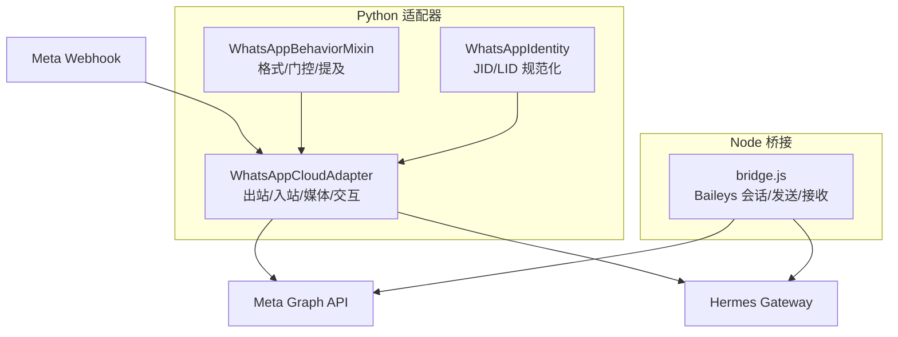
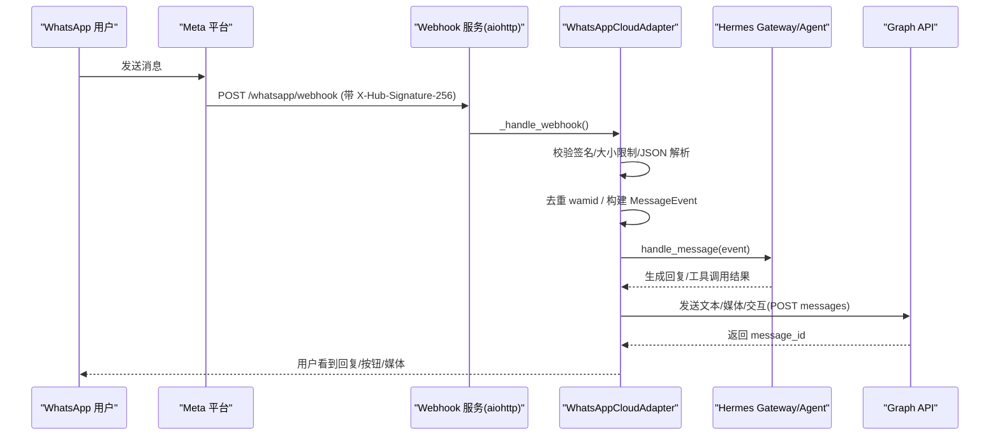
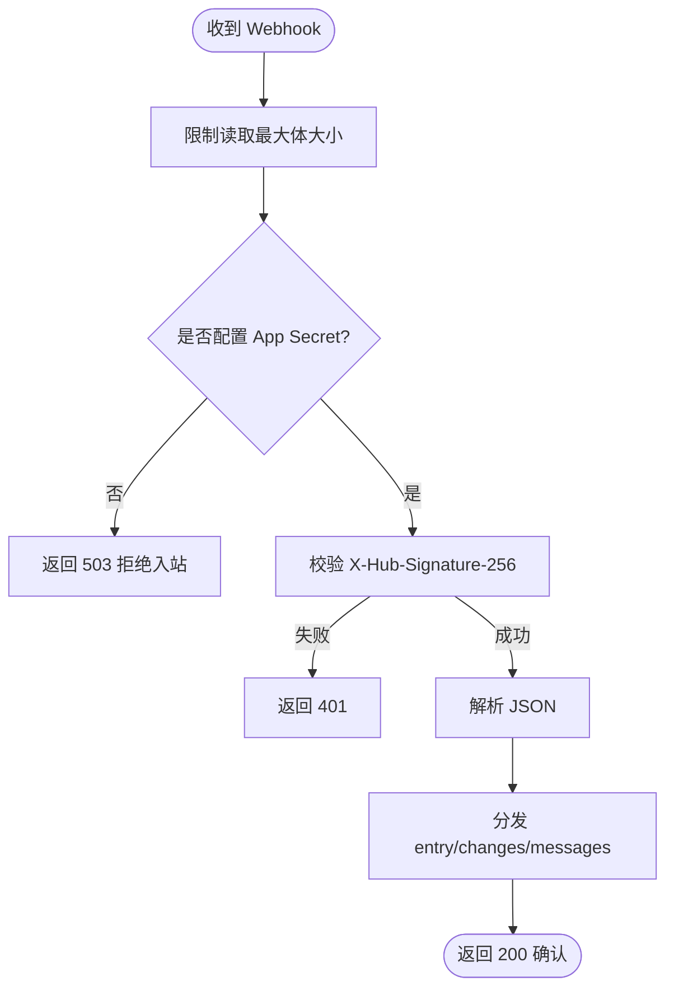
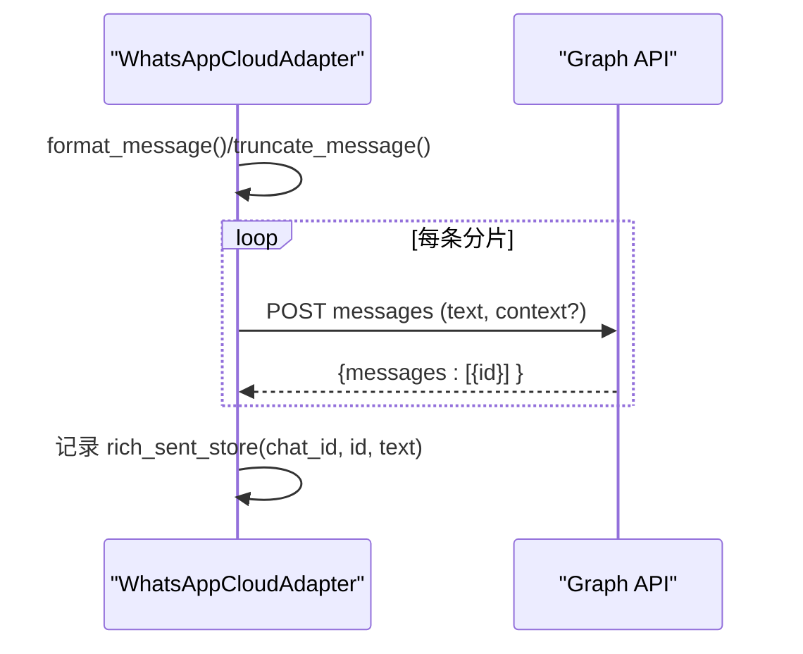
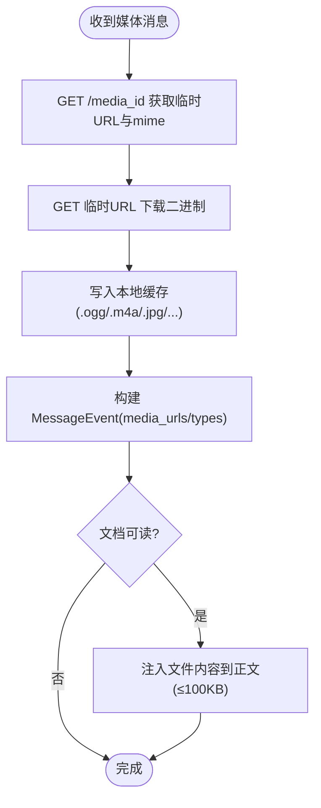
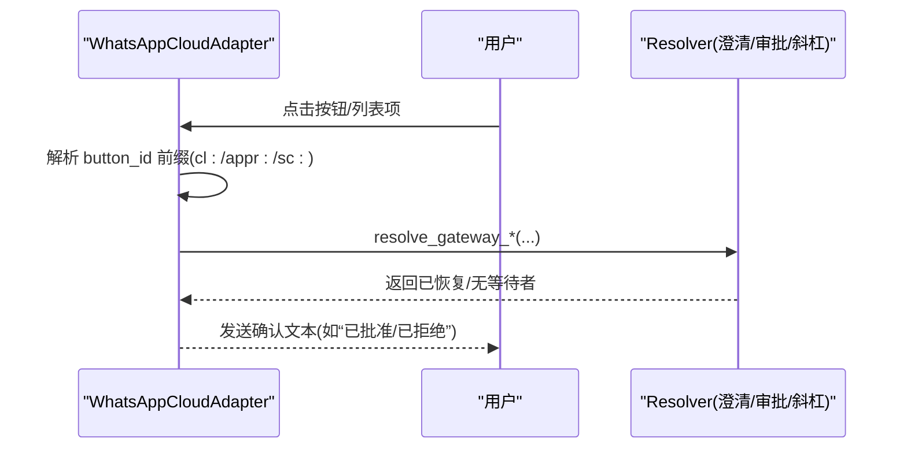
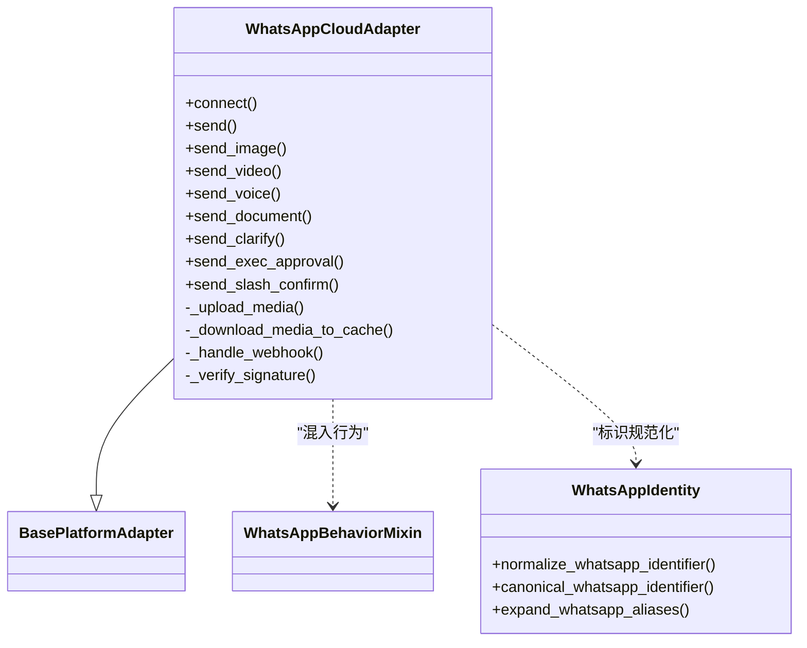

# WhatsApp 集成

<cite>
**本文引用的文件**
- [whatsapp_cloud.py](file://gateway/platforms/whatsapp_cloud.py)
- [whatsapp_common.py](file://gateway/platforms/whatsapp_common.py)
- [whatsapp_identity.py](file://gateway/whatsapp_identity.py)
- [setup_whatsapp_cloud.py](file://hermes_cli/setup_whatsapp_cloud.py)
- [bridge.js](file://scripts/whatsapp-bridge/bridge.js)
</cite>

## 目录
1. [简介](#简介)
2. [项目结构](#项目结构)
3. [核心组件](#核心组件)
4. [架构总览](#架构总览)
5. [详细组件分析](#详细组件分析)
6. [依赖关系分析](#依赖关系分析)
7. [性能与速率限制](#性能与速率限制)
8. [故障排除指南](#故障排除指南)
9. [结论](#结论)
10. [附录](#附录)

## 简介
本文件面向在 Hermes Agent 中集成 WhatsApp Cloud API 的工程与运维人员，系统性说明以下能力：
- OAuth/令牌认证、Webhook 配置与签名校验
- 消息模板与交互式按钮（澄清、审批、斜杠命令确认）
- 多媒体消息（图片、视频、音频/语音、文档、贴纸）、位置分享、联系人信息
- WhatsApp Business Account 配置、电话号码验证、模板消息审批流程指引
- 消息队列与去重、重试与幂等处理
- 速率限制与限流策略、性能调优建议
- 常见问题排查（Webhook 验证失败、发送受限、性能瓶颈）

## 项目结构
WhatsApp 集成由 Python 适配器与 Node 桥接两部分组成：
- Python 侧：官方 WhatsApp Cloud API 适配器（HTTP + Webhook），负责出站消息、入站 Webhook 解析、媒体上传/下载、交互按钮路由、身份与权限门控。
- Node 侧：Baileys 桥接（非官方），提供本地会话、二维码配对、长轮询与原生发送能力；与 Cloud API 适配器互补而非替代。

图表来源
- [whatsapp_cloud.py:203-495](file://gateway/platforms/whatsapp_cloud.py#L203-L495)
- [whatsapp_common.py:64-126](file://gateway/platforms/whatsapp_common.py#L64-L126)
- [whatsapp_identity.py:48-107](file://gateway/whatsapp_identity.py#L48-L107)
- [bridge.js:1-20](file://scripts/whatsapp-bridge/bridge.js#L1-L20)

章节来源
- [whatsapp_cloud.py:1-120](file://gateway/platforms/whatsapp_cloud.py#L1-L120)
- [whatsapp_common.py:1-30](file://gateway/platforms/whatsapp_common.py#L1-L30)
- [bridge.js:1-20](file://scripts/whatsapp-bridge/bridge.js#L1-L20)

## 核心组件
- WhatsAppCloudAdapter：实现 Cloud API 的出站消息、媒体上传/发送、typing/read 指示器、Webhook 接收与签名校验、交互按钮路由、入站媒体缓存与文本注入。
- WhatsAppBehaviorMixin：跨传输共享的行为层（Markdown 转换、DM/群组门控、提及检测、消息分片）。
- WhatsAppIdentity：统一 JID/LID 标识归一化与别名展开，确保授权与会话键一致。
- setup_whatsapp_cloud：交互式向导，引导填写 Phone Number ID、Access Token、App Secret、Verify Token、允许用户列表等，并输出后续步骤。
- bridge.js：基于 Baileys 的 Node 桥接，提供本地会话、长轮询、原生发送（含位置、投票、媒体等），与 Cloud API 适配器并存。

章节来源
- [whatsapp_cloud.py:203-495](file://gateway/platforms/whatsapp_cloud.py#L203-L495)
- [whatsapp_common.py:64-126](file://gateway/platforms/whatsapp_common.py#L64-L126)
- [whatsapp_identity.py:48-107](file://gateway/whatsapp_identity.py#L48-L107)
- [setup_whatsapp_cloud.py:232-542](file://hermes_cli/setup_whatsapp_cloud.py#L232-L542)
- [bridge.js:1-20](file://scripts/whatsapp-bridge/bridge.js#L1-L20)

## 架构总览
下图展示端到端数据流：用户通过 WhatsApp 客户端发送消息 → Meta 经 Webhook 推送至 Hermes → Python 适配器校验签名、解析事件、执行门控与去重 → 调用 Agent/Gateway → 回复消息通过 Graph API 发出；同时支持媒体上传/下载与交互按钮回调。

图表来源
- [whatsapp_cloud.py:1457-1522](file://gateway/platforms/whatsapp_cloud.py#L1457-L1522)
- [whatsapp_cloud.py:1571-1662](file://gateway/platforms/whatsapp_cloud.py#L1571-L1662)
- [whatsapp_cloud.py:513-589](file://gateway/platforms/whatsapp_cloud.py#L513-L589)

## 详细组件分析

### 认证与 Webhook 配置
- 必需环境变量：Phone Number ID、Access Token（系统用户永久令牌或短期令牌）。
- 可选：App ID/WABA ID（用于分析）、Verify Token（订阅握手）、App Secret（HMAC 校验）、Webhook Host/Port/Path、API Version。
- Webhook GET 验证：检查 hub.mode=subscribe、hub.verify_token 常量时间比较，回显 challenge。
- Webhook POST 校验：读取原始 body，使用 App Secret 对 X-Hub-Signature-256 进行 HMAC-SHA256 校验，未配置时拒绝所有 POST。
- 健康检查：/health 暴露 verify_token_configured、app_secret_configured、ffmpeg_present、计数器等指标。

图表来源
- [whatsapp_cloud.py:1426-1522](file://gateway/platforms/whatsapp_cloud.py#L1426-L1522)
- [whatsapp_cloud.py:1410-1424](file://gateway/platforms/whatsapp_cloud.py#L1410-L1424)

章节来源
- [whatsapp_cloud.py:217-319](file://gateway/platforms/whatsapp_cloud.py#L217-L319)
- [whatsapp_cloud.py:435-495](file://gateway/platforms/whatsapp_cloud.py#L435-L495)
- [whatsapp_cloud.py:1426-1522](file://gateway/platforms/whatsapp_cloud.py#L1426-L1522)
- [setup_whatsapp_cloud.py:232-542](file://hermes_cli/setup_whatsapp_cloud.py#L232-L542)

### 消息发送与分片
- 文本发送：格式化 Markdown → 分片 → 逐条 POST Graph API，首条携带 context.message_id 以引用用户消息。
- 发送 typing/read：通过同一 messages 接口设置 status=read 与 typing_indicator，自动消失或响应后关闭。
- 分片策略：保留前缀空间，按 MAX_MESSAGE_LENGTH 切分，避免移动端不可读。

图表来源
- [whatsapp_cloud.py:513-589](file://gateway/platforms/whatsapp_cloud.py#L513-L589)
- [whatsapp_cloud.py:607-660](file://gateway/platforms/whatsapp_cloud.py#L607-L660)

章节来源
- [whatsapp_cloud.py:513-589](file://gateway/platforms/whatsapp_cloud.py#L513-L589)
- [whatsapp_cloud.py:607-660](file://gateway/platforms/whatsapp_cloud.py#L607-L660)

### 多媒体消息（图片/视频/音频/文档/贴纸）
- 上传：POST /media，校验文件大小上限（image 5MB、video/audio 16MB、document 100MB、sticker 100KB/500KB），返回 media_id。
- 发送：引用 media_id 或 link（HTTPS），支持 caption/filename。
- 语音：优先将 MP3 转码为 opus（audio/ogg; codecs=opus）以获得绿色波形气泡；若 ffmpeg 缺失则退回 MP3 附件。
- 入站媒体：两步下载（GET /<media_id> 获取临时 URL → 再下载二进制），写入本地缓存并按 MIME 决定扩展名；文档类型可注入可读内容到正文（≤100KB）。

图表来源
- [whatsapp_cloud.py:970-1148](file://gateway/platforms/whatsapp_cloud.py#L970-L1148)
- [whatsapp_cloud.py:1194-1260](file://gateway/platforms/whatsapp_cloud.py#L1194-L1260)
- [whatsapp_cloud.py:1263-1311](file://gateway/platforms/whatsapp_cloud.py#L1263-L1311)
- [whatsapp_cloud.py:1314-1406](file://gateway/platforms/whatsapp_cloud.py#L1314-L1406)
- [whatsapp_cloud.py:1988-2054](file://gateway/platforms/whatsapp_cloud.py#L1988-L2054)

章节来源
- [whatsapp_cloud.py:970-1148](file://gateway/platforms/whatsapp_cloud.py#L970-L1148)
- [whatsapp_cloud.py:1194-1260](file://gateway/platforms/whatsapp_cloud.py#L1194-L1260)
- [whatsapp_cloud.py:1263-1311](file://gateway/platforms/whatsapp_cloud.py#L1263-L1311)
- [whatsapp_cloud.py:1314-1406](file://gateway/platforms/whatsapp_cloud.py#L1314-L1406)
- [whatsapp_cloud.py:1988-2054](file://gateway/platforms/whatsapp_cloud.py#L1988-L2054)

### 位置分享与联系人信息
- 位置：Node 桥接暴露 /send-location 端点，构造位置负载并通过 Baileys 发送；Cloud API 适配器当前阶段聚焦 DM 与文本/媒体，群组与位置能力可通过桥接路径补充。
- 联系人：入站 webhook 会附带 contacts[].profile.name，适配器将其映射到 sender_name，便于显示与上下文。

章节来源
- [bridge.js:1-20](file://scripts/whatsapp-bridge/bridge.js#L1-L20)
- [whatsapp_cloud.py:1600-1614](file://gateway/platforms/whatsapp_cloud.py#L1600-L1614)

### 交互式按钮（澄清/审批/斜杠命令确认）
- 澄清（clarify）：1–3 选项渲染为 inline 按钮；≥4 选项渲染为 list 选择表；“其他”切换为文本捕获模式。
- 执行审批（exec_approval）：Approve/Deny 两按钮，点击后调用 approval 解析器恢复等待线程。
- 斜杠命令确认（slash_confirm）：一次批准/始终批准/取消三按钮。
- 状态管理：每个交互类型维护 FIFO 有界字典（clarify/exec/slash），点击后弹出并路由到对应 resolver；过期或未命中则降级为普通文本。

图表来源
- [whatsapp_cloud.py:678-949](file://gateway/platforms/whatsapp_cloud.py#L678-L949)
- [whatsapp_cloud.py:1663-1885](file://gateway/platforms/whatsapp_cloud.py#L1663-L1885)

章节来源
- [whatsapp_cloud.py:678-949](file://gateway/platforms/whatsapp_cloud.py#L678-L949)
- [whatsapp_cloud.py:1663-1885](file://gateway/platforms/whatsapp_cloud.py#L1663-L1885)

### 身份与门控（DM/群组/提及）
- DM 策略：open/allowlist/pairing/disabled；allow_from 支持 phone/LID/JID 多形态匹配，动态读取环境变量或配置。
- 群组策略：open/allowlist/pairing/disabled；支持 free_response_chats 白名单免提及。
- 提及检测：@botId、正则模式、回复机器人消息。
- 广播过滤：status@broadcast、Channel/Newsletter 不处理。

章节来源
- [whatsapp_common.py:127-177](file://gateway/platforms/whatsapp_common.py#L127-L177)
- [whatsapp_common.py:215-289](file://gateway/platforms/whatsapp_common.py#L215-L289)
- [whatsapp_common.py:291-423](file://gateway/platforms/whatsapp_common.py#L291-L423)
- [whatsapp_identity.py:48-107](file://gateway/whatsapp_identity.py#L48-L107)

### WhatsApp Business Account 配置、号码验证与模板审批
- 账号与号码：在 Meta App Dashboard 创建应用并启用 WhatsApp，获取 Phone Number ID 与 Access Token。
- 号码验证：将测试号码加入“收件人列表”，以便开发模式下接收消息。
- 模板审批：如需在 24 小时外主动触达，需准备并提审模板消息（名称、语言、类别、组件）；审核通过后通过 Graph API 发送模板。
- 向导辅助：setup_whatsapp_cloud 提供字段校验与操作指引，降低常见配置错误。

章节来源
- [setup_whatsapp_cloud.py:232-542](file://hermes_cli/setup_whatsapp_cloud.py#L232-L542)

### 消息队列管理与幂等
- 入站去重：wamid 内存 FIFO 缓存（默认 5000 条），重复消息直接跳过。
- 发送顺序：Node 桥接内部对 sendMessage 串行化，避免并发覆盖导致错发。
- 富文本索引：rich_sent_store 记录 outbound 消息文本，支持 reply_to 上下文还原。

章节来源
- [whatsapp_cloud.py:1551-1569](file://gateway/platforms/whatsapp_cloud.py#L1551-L1569)
- [bridge.js:128-157](file://scripts/whatsapp-bridge/bridge.js#L128-L157)
- [whatsapp_cloud.py:580-589](file://gateway/platforms/whatsapp_cloud.py#L580-L589)

## 依赖关系分析

图表来源
- [whatsapp_cloud.py:203-319](file://gateway/platforms/whatsapp_cloud.py#L203-L319)
- [whatsapp_common.py:64-126](file://gateway/platforms/whatsapp_common.py#L64-L126)
- [whatsapp_identity.py:48-107](file://gateway/whatsapp_identity.py#L48-L107)

章节来源
- [whatsapp_cloud.py:203-319](file://gateway/platforms/whatsapp_cloud.py#L203-L319)
- [whatsapp_common.py:64-126](file://gateway/platforms/whatsapp_common.py#L64-L126)
- [whatsapp_identity.py:48-107](file://gateway/whatsapp_identity.py#L48-L107)

## 性能与速率限制
- 连接与超时：httpx.AsyncClient 使用平台级 keepalive 限制，避免 CLOSE_WAIT 堆积；Webhook 请求体限制 3MB。
- 媒体大小限制：严格遵循 Meta 各类型上限，超限时提前拒绝并返回清晰错误。
- 语音转码：优先使用 ffmpeg 将 MP3 转为 opus 以获得原生语音气泡；缺失时降级为音频附件。
- 去重与缓存：wamid 去重与 inbound 媒体缓存减少重复处理与网络开销。
- 速率限制建议：
  - 控制并发：合理设置 httpx 并发与超时，避免触发 Graph API 限流。
  - 批量发送：长消息分片发送，避免单条过大。
  - 监控指标：/health 中的 accepted/duplicates/rejected_signature 计数用于观察吞吐与异常。
  - 重试策略：对 4xx/5xx 做指数退避重试，注意幂等与去重。

章节来源
- [whatsapp_cloud.py:98-118](file://gateway/platforms/whatsapp_cloud.py#L98-L118)
- [whatsapp_cloud.py:453-459](file://gateway/platforms/whatsapp_cloud.py#L453-L459)
- [whatsapp_cloud.py:1410-1424](file://gateway/platforms/whatsapp_cloud.py#L1410-L1424)
- [whatsapp_cloud.py:1551-1569](file://gateway/platforms/whatsapp_cloud.py#L1551-L1569)

## 故障排除指南
- Webhook 验证失败
  - 现象：GET 验证返回 503/403，POST 返回 401/503。
  - 排查：确认已配置 Verify Token 与 App Secret；检查回调 URL 与端口可达性；查看 /health 中 verify_token_configured/app_secret_configured。
  - 参考：[whatsapp_cloud.py:1426-1522](file://gateway/platforms/whatsapp_cloud.py#L1426-L1522)
- 消息发送受限
  - 现象：Graph API 返回 4xx/5xx，或提示超出大小限制。
  - 排查：检查 Access Token 权限与有效期；确认媒体大小不超过上限；检查网络与代理；查看错误码与消息。
  - 参考：[whatsapp_cloud.py:970-1148](file://gateway/platforms/whatsapp_cloud.py#L970-L1148)
- 语音无法显示为气泡
  - 现象：发送语音为普通音频附件。
  - 排查：安装 ffmpeg；确认 MP3 转码成功；查看日志中 ffmpeg 警告。
  - 参考：[whatsapp_cloud.py:1263-1311](file://gateway/platforms/whatsapp_cloud.py#L1263-L1311)
- 入站媒体未下载
  - 现象：仅看到元数据，无媒体文件。
  - 排查：检查 media_id 合法性；确认 Graph 元数据与临时 URL 可用；查看下载日志。
  - 参考：[whatsapp_cloud.py:1314-1406](file://gateway/platforms/whatsapp_cloud.py#L1314-L1406)
- 交互按钮无效
  - 现象：点击按钮无响应或降级为文本。
  - 排查：确认交互状态未过期；检查 sender 授权；查看 resolver 是否找到等待者。
  - 参考：[whatsapp_cloud.py:1663-1885](file://gateway/platforms/whatsapp_cloud.py#L1663-L1885)
- 性能调优
  - 建议：调整 httpx 并发与超时；启用 ffmpeg；合理设置分片长度；监控 /health 指标；避免大体积媒体频繁发送。
  - 参考：[whatsapp_cloud.py:453-459](file://gateway/platforms/whatsapp_cloud.py#L453-L459)
  - [whatsapp_cloud.py:1410-1424](file://gateway/platforms/whatsapp_cloud.py#L1410-L1424)

章节来源
- [whatsapp_cloud.py:1426-1522](file://gateway/platforms/whatsapp_cloud.py#L1426-L1522)
- [whatsapp_cloud.py:970-1148](file://gateway/platforms/whatsapp_cloud.py#L970-L1148)
- [whatsapp_cloud.py:1263-1311](file://gateway/platforms/whatsapp_cloud.py#L1263-L1311)
- [whatsapp_cloud.py:1314-1406](file://gateway/platforms/whatsapp_cloud.py#L1314-L1406)
- [whatsapp_cloud.py:1663-1885](file://gateway/platforms/whatsapp_cloud.py#L1663-L1885)
- [whatsapp_cloud.py:453-459](file://gateway/platforms/whatsapp_cloud.py#L453-L459)
- [whatsapp_cloud.py:1410-1424](file://gateway/platforms/whatsapp_cloud.py#L1410-L1424)

## 结论
本集成通过 Python 适配器对接官方 WhatsApp Cloud API，结合 Node 桥接提供本地会话能力，形成稳定、可扩展的消息通道。其核心优势包括：
- 安全可靠的 Webhook 签名校验与订阅握手
- 丰富的消息类型与交互能力（文本、多媒体、语音、按钮、列表）
- 完善的身份与门控机制（DM/群组/提及/广播过滤）
- 健壮的媒体处理与文本注入、去重与幂等保障
- 清晰的配置向导与健康检查，便于部署与排障

建议在生产环境启用 App Secret、配置允许用户列表、合理设置并发与超时，并持续监控 /health 指标与 Graph API 错误码，以确保高可用与高性能。

## 附录
- 环境变量速查（部分）
  - WHATSAPP_CLOUD_PHONE_NUMBER_ID：必填，Meta 内部编号
  - WHATSAPP_CLOUD_ACCESS_TOKEN：必填，访问令牌
  - WHATSAPP_CLOUD_APP_SECRET：推荐，Webhook 签名密钥
  - WHATSAPP_CLOUD_VERIFY_TOKEN：推荐，订阅握手令牌
  - WHATSAPP_CLOUD_WABA_ID：可选，业务账户 ID
  - WHATSAPP_CLOUD_WEBHOOK_HOST/PORT/PATH：Webhook 监听地址
  - WHATSAPP_CLOUD_API_VERSION：Graph API 版本
- 常用端点
  - Webhook：/whatsapp/webhook（GET 验证、POST 消息）
  - 健康检查：/health
  - Graph API：https://graph.facebook.com/{version}/{phone_number_id}/...

章节来源
- [whatsapp_cloud.py:217-319](file://gateway/platforms/whatsapp_cloud.py#L217-L319)
- [whatsapp_cloud.py:1410-1424](file://gateway/platforms/whatsapp_cloud.py#L1410-L1424)
- [setup_whatsapp_cloud.py:232-542](file://hermes_cli/setup_whatsapp_cloud.py#L232-L542)