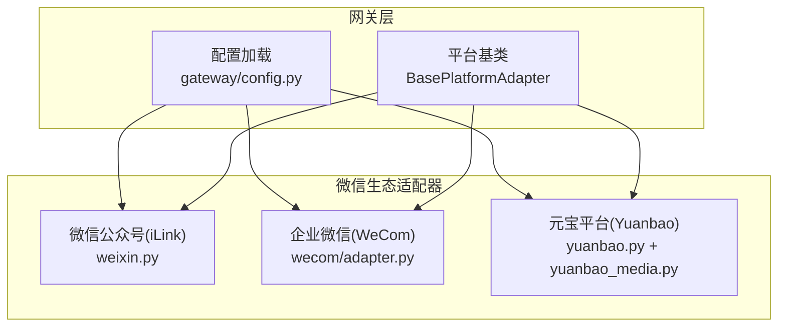
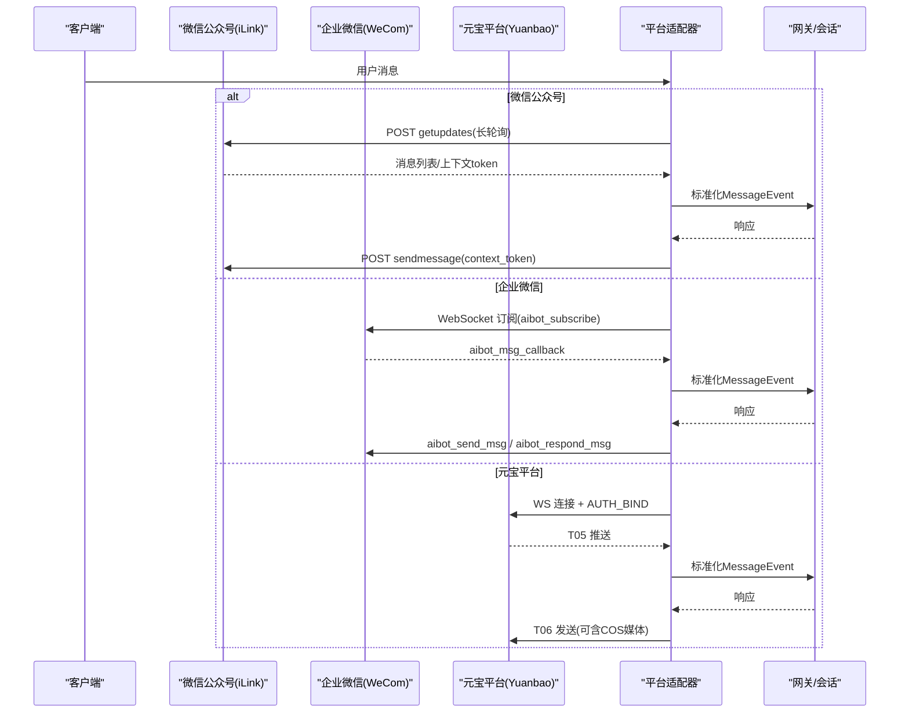
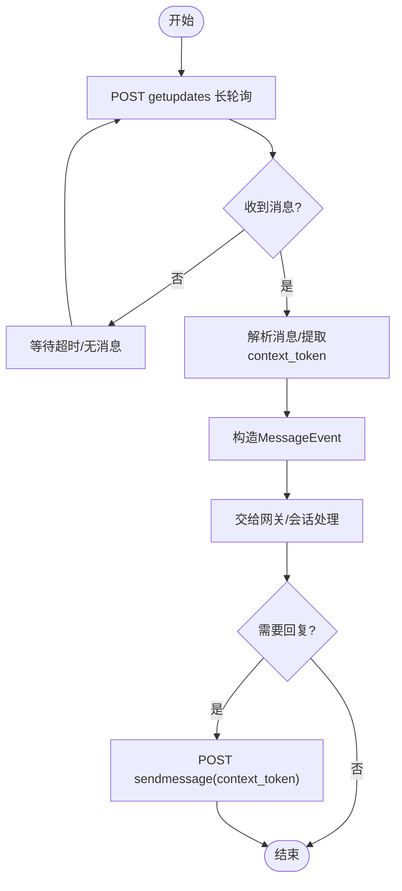
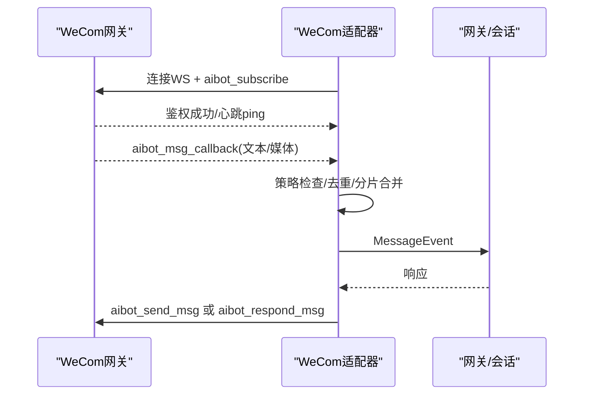
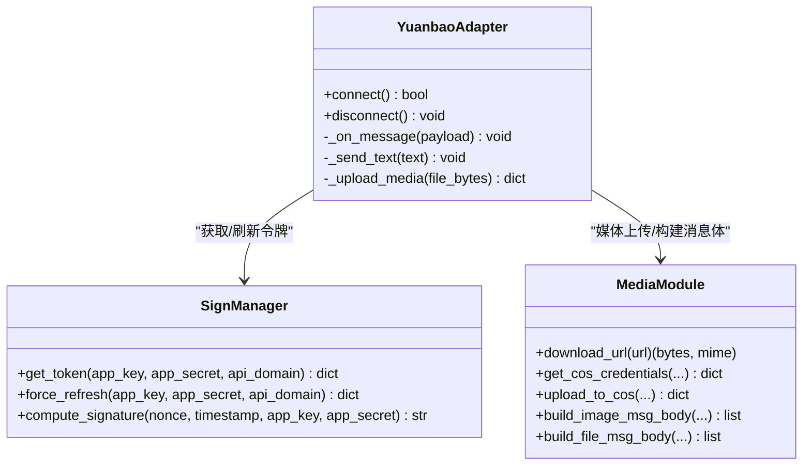
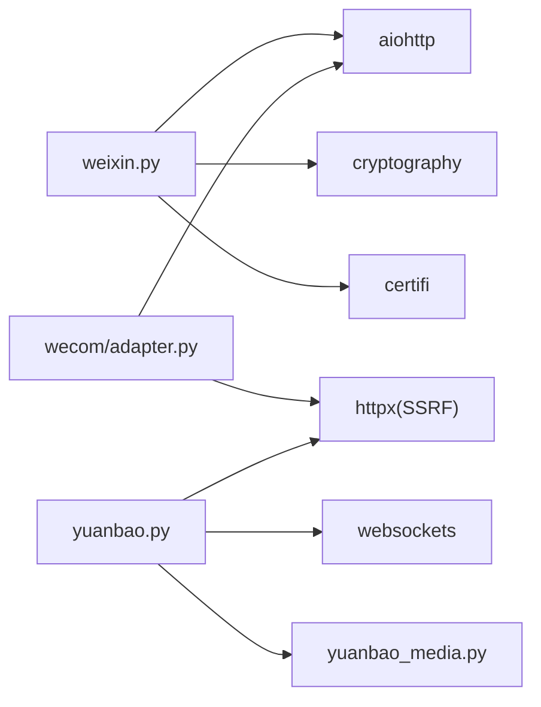

# 微信集成

<cite>
**本文引用的文件**
- [gateway/platforms/weixin.py](file://gateway/platforms/weixin.py)
- [plugins/platforms/wecom/adapter.py](file://plugins/platforms/wecom/adapter.py)
- [gateway/platforms/yuanbao.py](file://gateway/platforms/yuanbao.py)
- [gateway/platforms/yuanbao_media.py](file://gateway/platforms/yuanbao_media.py)
- [gateway/config.py](file://gateway/config.py)
</cite>

## 目录
1. [简介](#简介)
2. [项目结构](#项目结构)
3. [核心组件](#核心组件)
4. [架构总览](#架构总览)
5. [详细组件分析](#详细组件分析)
6. [依赖关系分析](#依赖关系分析)
7. [性能与频率限制](#性能与频率限制)
8. [故障排除指南](#故障排除指南)
9. [结论](#结论)
10. [附录：配置与环境变量](#附录：配置与环境变量)

## 简介
本文件面向在微信生态中集成的开发者，覆盖微信公众号（个人号 iLink）、企业微信（WeCom AI Bot）以及元宝平台（Yuanbao）的接入方案。文档重点说明：
- OAuth 认证流程与鉴权方式
- 消息推送机制与长连接/轮询模型
- 模板消息、富文本、图片上传、语音识别、小程序链接与企业应用支持
- AppID 配置、服务器域名设置、消息签名验证与频率限制处理
- 常见问题排查与性能优化建议

## 项目结构
本项目将微信生态相关能力以“平台适配器”的形式组织在 gateway 与 plugins 目录下：
- 微信公众号（个人号 iLink）：gateway/platforms/weixin.py
- 企业微信：plugins/platforms/wecom/adapter.py
- 元宝平台：gateway/platforms/yuanbao.py 及 yuanbao_media.py
- 统一配置入口：gateway/config.py

图表来源
- [gateway/config.py:299-2357](file://gateway/config.py#L299-L2357)
- [gateway/platforms/weixin.py:1-120](file://gateway/platforms/weixin.py#L1-L120)
- [plugins/platforms/wecom/adapter.py:1-136](file://plugins/platforms/wecom/adapter.py#L1-L136)
- [gateway/platforms/yuanbao.py:1-160](file://gateway/platforms/yuanbao.py#L1-L160)

章节来源
- [gateway/config.py:299-2357](file://gateway/config.py#L299-L2357)

## 核心组件
- 微信公众号（iLink）适配器：通过长轮询 getupdates 获取消息，使用 sendmessage 发送文本，媒体走 AES-128-ECB 加密 CDN 协议；提供 context_token 持久化、typing 票据缓存、限频退避等能力。
- 企业微信（WeCom）适配器：基于 WebSocket 的 AI Bot 网关，完成订阅鉴权、事件回调、消息发送与媒体上传；内置消息去重、文本分片合并、心跳保活与断线重连。
- 元宝平台（Yuanbao）适配器：WebSocket 网关 + HTTP 签票服务，实现 AUTH_BIND、心跳、T05/T06 收发；媒体通过 COS 临时凭证上传并构建 TIM 消息体；内建中间件管道解析转发消息、引用回复与资源下载。

章节来源
- [gateway/platforms/weixin.py:1-120](file://gateway/platforms/weixin.py#L1-L120)
- [plugins/platforms/wecom/adapter.py:1-136](file://plugins/platforms/wecom/adapter.py#L1-L136)
- [gateway/platforms/yuanbao.py:1-160](file://gateway/platforms/yuanbao.py#L1-L160)

## 架构总览
三个平台分别采用不同的通信模型与鉴权方式，但都遵循统一的平台适配器接口，便于网关层统一管理生命周期、会话与路由。

图表来源
- [gateway/platforms/weixin.py:447-502](file://gateway/platforms/weixin.py#L447-L502)
- [plugins/platforms/wecom/adapter.py:312-444](file://plugins/platforms/wecom/adapter.py#L312-L444)
- [gateway/platforms/yuanbao.py:1-160](file://gateway/platforms/yuanbao.py#L1-L160)

## 详细组件分析

### 微信公众号（iLink）适配器
- 认证与会话
  - 使用 Bearer Token 调用 iLink API；维护 context_token 磁盘缓存，按账号+对端用户键值存储，重启后可恢复。
- 消息接收
  - 通过 POST ilink/bot/getupdates 进行长轮询；超时返回空结果并保留同步缓冲区。
- 消息发送
  - 通过 POST ilink/bot/sendmessage 发送文本，需携带 context_token；支持 typing 状态上报。
- 媒体处理
  - 上传：先获取上传 URL，再上传 AES-128-ECB 密文，CDN 返回加密参数用于后续下载。
  - 下载：从 CDN 下载后按 aes_key 解密；对外部 URL 做白名单校验防止 SSRF。
- 频率限制与稳定性
  - 识别限频错误码并退避重试；会话过期错误码触发重新登录或刷新。
  - 使用 certifi CA 提升 TLS 兼容性；tight keepalive 减少 CLOSE_WAIT。

图表来源
- [gateway/platforms/weixin.py:447-502](file://gateway/platforms/weixin.py#L447-L502)
- [gateway/platforms/weixin.py:528-578](file://gateway/platforms/weixin.py#L528-L578)
- [gateway/platforms/weixin.py:581-606](file://gateway/platforms/weixin.py#L581-L606)
- [gateway/platforms/weixin.py:661-683](file://gateway/platforms/weixin.py#L661-L683)

章节来源
- [gateway/platforms/weixin.py:236-251](file://gateway/platforms/weixin.py#L236-L251)
- [gateway/platforms/weixin.py:298-346](file://gateway/platforms/weixin.py#L298-L346)
- [gateway/platforms/weixin.py:447-502](file://gateway/platforms/weixin.py#L447-L502)
- [gateway/platforms/weixin.py:528-578](file://gateway/platforms/weixin.py#L528-L578)
- [gateway/platforms/weixin.py:581-606](file://gateway/platforms/weixin.py#L581-L606)
- [gateway/platforms/weixin.py:624-683](file://gateway/platforms/weixin.py#L624-L683)

### 企业微信（WeCom）适配器
- 认证与连接
  - 通过 WebSocket 连接 AI Bot 网关，发送 aibot_subscribe 完成鉴权；建立心跳任务与监听任务。
- 消息接收
  - 接收 aibot_msg_callback/aibot_event_callback；对群聊/私聊策略进行准入控制；对超长消息进行文本分片合并。
- 消息发送
  - 使用 aibot_send_msg 主动发送；在群聊中回退到 aibot_respond_msg 配合入站 req_id 回复。
- 媒体上传
  - 分块上传（init/chunk/finish），支持图片、视频、语音、文件；大小限制与 MIME 类型校验。
- 稳定性
  - 指数退避重连；失败时清理 pending futures 与资源；关闭时取消任务并释放连接。

图表来源
- [plugins/platforms/wecom/adapter.py:312-364](file://plugins/platforms/wecom/adapter.py#L312-L364)
- [plugins/platforms/wecom/adapter.py:365-444](file://plugins/platforms/wecom/adapter.py#L365-L444)
- [plugins/platforms/wecom/adapter.py:523-599](file://plugins/platforms/wecom/adapter.py#L523-L599)

章节来源
- [plugins/platforms/wecom/adapter.py:176-269](file://plugins/platforms/wecom/adapter.py#L176-L269)
- [plugins/platforms/wecom/adapter.py:312-444](file://plugins/platforms/wecom/adapter.py#L312-L444)
- [plugins/platforms/wecom/adapter.py:523-682](file://plugins/platforms/wecom/adapter.py#L523-L682)

### 元宝平台（Yuanbao）适配器
- 认证与令牌
  - 通过 HTTP 获取 sign-token（HMAC-SHA256 签名），带缓存与自动刷新；WS 连接后进行 AUTH_BIND。
- 消息收发
  - 使用自定义协议（T05/T06）进行推送与发送；支持引用回复、转发消息解析与资源锚点注入。
- 媒体处理
  - 通过 genUploadInfo 获取 COS 临时凭证，计算 HMAC-SHA1 签名后 PUT 上传；构建 TIMImageElem/TIMFileElem 消息体。
- 中间件管道
  - 解码、字段提取、内容提取、路由、引用上下文、媒体解析、分组归属等中间件串联处理入站消息。

图表来源
- [gateway/platforms/yuanbao.py:398-639](file://gateway/platforms/yuanbao.py#L398-L639)
- [gateway/platforms/yuanbao_media.py:359-570](file://gateway/platforms/yuanbao_media.py#L359-L570)
- [gateway/platforms/yuanbao_media.py:575-654](file://gateway/platforms/yuanbao_media.py#L575-L654)

章节来源
- [gateway/platforms/yuanbao.py:1-160](file://gateway/platforms/yuanbao.py#L1-L160)
- [gateway/platforms/yuanbao.py:398-639](file://gateway/platforms/yuanbao.py#L398-L639)
- [gateway/platforms/yuanbao_media.py:202-270](file://gateway/platforms/yuanbao_media.py#L202-L270)
- [gateway/platforms/yuanbao_media.py:359-570](file://gateway/platforms/yuanbao_media.py#L359-L570)
- [gateway/platforms/yuanbao_media.py:575-654](file://gateway/platforms/yuanbao_media.py#L575-L654)

## 依赖关系分析
- 微信公众号（iLink）
  - 依赖 aiohttp 进行 HTTP 请求；可选 cryptography 用于 AES-128-ECB 加解密；依赖 certifi 提升证书链兼容性。
- 企业微信（WeCom）
  - 依赖 aiohttp 进行 WebSocket 通信；httpx 用于安全 HTTP 客户端（SSRF 防护）。
- 元宝平台（Yuanbao）
  - 依赖 websockets 进行 WS 通信；httpx 用于 HTTP 请求与 COS 上传；内部模块提供媒体下载与消息体构建。

图表来源
- [gateway/platforms/weixin.py:38-57](file://gateway/platforms/weixin.py#L38-L57)
- [plugins/platforms/wecom/adapter.py:47-71](file://plugins/platforms/wecom/adapter.py#L47-L71)
- [gateway/platforms/yuanbao.py:41-99](file://gateway/platforms/yuanbao.py#L41-L99)
- [gateway/platforms/yuanbao_media.py:20-31](file://gateway/platforms/yuanbao_media.py#L20-L31)

章节来源
- [gateway/platforms/weixin.py:38-57](file://gateway/platforms/weixin.py#L38-L57)
- [plugins/platforms/wecom/adapter.py:47-71](file://plugins/platforms/wecom/adapter.py#L47-L71)
- [gateway/platforms/yuanbao.py:41-99](file://gateway/platforms/yuanbao.py#L41-L99)
- [gateway/platforms/yuanbao_media.py:20-31](file://gateway/platforms/yuanbao_media.py#L20-L31)

## 性能与频率限制
- 微信公众号（iLink）
  - 长轮询超时与空结果处理，避免阻塞；限频错误码识别与退避重试；会话过期错误码特殊处理。
  - 媒体上传使用 AES 加密与 CDN，下载前校验白名单防止 SSRF；tight keepalive 降低 CLOSE_WAIT。
- 企业微信（WeCom）
  - 文本分片合并（接近 4000 字符阈值时延长等待）；消息去重；心跳保活与指数退避重连。
  - 媒体上传分块与大小限制；群聊/私聊策略控制减少无效流量。
- 元宝平台（Yuanbao）
  - 令牌缓存与提前刷新；WS 关闭握手超时上限保障快速销毁；媒体下载流式读取与大小限制；COS 上传使用加速域名。

[本节为通用指导，不直接分析具体文件]

## 故障排除指南
- 消息接收失败
  - 微信公众号：检查 getupdates 超时与 ret/errcode；确认 context_token 是否有效；查看限频错误码并调整重试间隔。
  - 企业微信：确认 aibot_subscribe 鉴权成功；检查回调命令是否为 aibot_msg_callback；核对群/私聊策略与 allowlist。
  - 元宝平台：检查 AUTH_BIND 返回码；确认 WS 心跳正常；查看 T05 推送解析与中间件管道是否拦截。
- 素材上传问题
  - 微信公众号：确保 AES 密钥格式正确；CDN 上传返回 x-encrypted-param；外部 URL 必须命中白名单。
  - 企业微信：分块上传 init/chunk/finish 顺序正确；MIME 类型与大小限制符合规范。
  - 元宝平台：genUploadInfo 返回必要字段；COS 签名参数齐全；PUT 上传使用加速域名。
- 性能优化建议
  - 合理设置长轮询超时与重试退避；批量合并短消息；限制并发媒体解析；使用缓存与去重减少重复处理。

章节来源
- [gateway/platforms/weixin.py:118-127](file://gateway/platforms/weixin.py#L118-L127)
- [gateway/platforms/weixin.py:581-606](file://gateway/platforms/weixin.py#L581-L606)
- [plugins/platforms/wecom/adapter.py:365-444](file://plugins/platforms/wecom/adapter.py#L365-L444)
- [gateway/platforms/yuanbao_media.py:202-270](file://gateway/platforms/yuanbao_media.py#L202-L270)
- [gateway/platforms/yuanbao_media.py:437-570](file://gateway/platforms/yuanbao_media.py#L437-L570)

## 结论
本项目通过统一的平台适配器抽象，将微信公众号（iLink）、企业微信（WeCom）与元宝平台（Yuanbao）的差异化协议与鉴权方式收敛到一致的 MessageEvent 与发送接口。各适配器具备完善的连接管理、消息去重、媒体处理与限频容错能力，适合在生产环境稳定运行。结合合理的配置与监控，可实现高可用的微信生态集成。

[本节为总结性内容，不直接分析具体文件]

## 附录：配置与环境变量
- 微信公众号（iLink）
  - 环境变量：WEIXIN_TOKEN、WEIXIN_ACCOUNT_ID、WEIXIN_BASE_URL、WEIXIN_CDN_BASE_URL、WEIXIN_DM_POLICY、WEIXIN_GROUP_POLICY、WEIXIN_ALLOWED_USERS
  - 作用：配置 token、账户标识、基础 URL、CDN 域名、DM/群组策略与允许用户列表。
- 企业微信（WeCom）
  - 配置项：bot_id、secret、websocket_url、dm_policy、allow_from、group_policy、group_allow_from、groups
  - 作用：鉴权凭据、网关地址、私聊/群组策略与白名单。
- 元宝平台（Yuanbao）
  - 配置项：app_id、app_secret、bot_id、ws_url、api_domain
  - 作用：应用标识、签名密钥、Bot ID、WebSocket 与 API 域名。

章节来源
- [gateway/config.py:2333-2357](file://gateway/config.py#L2333-L2357)
- [plugins/platforms/wecom/adapter.py:13-28](file://plugins/platforms/wecom/adapter.py#L13-L28)
- [gateway/platforms/yuanbao.py:7-16](file://gateway/platforms/yuanbao.py#L7-L16)