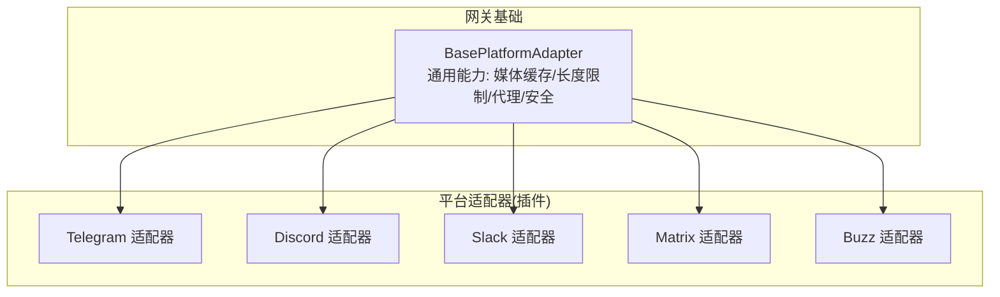
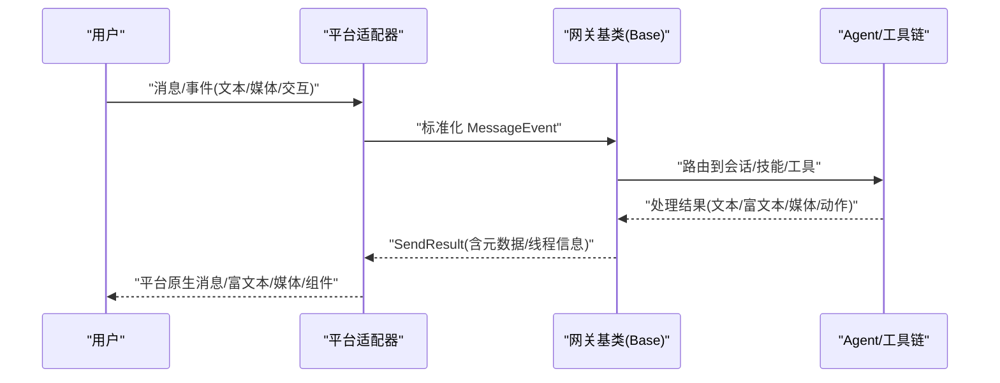
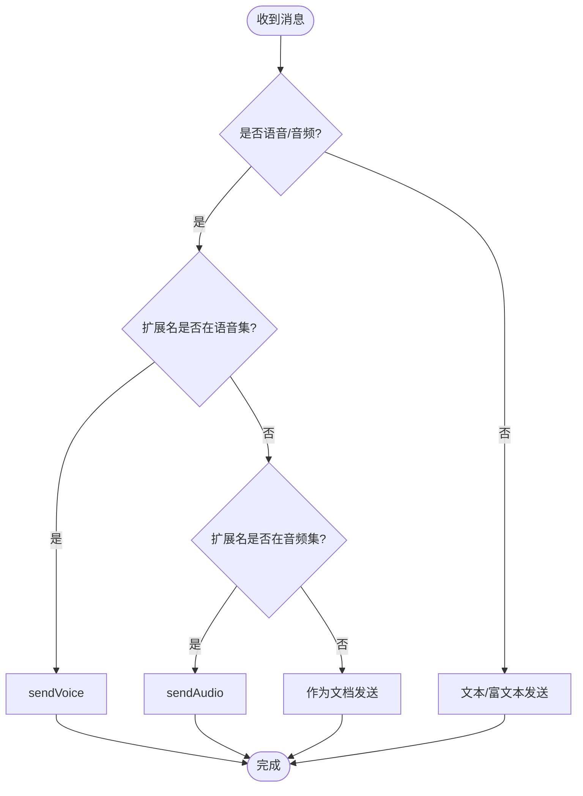
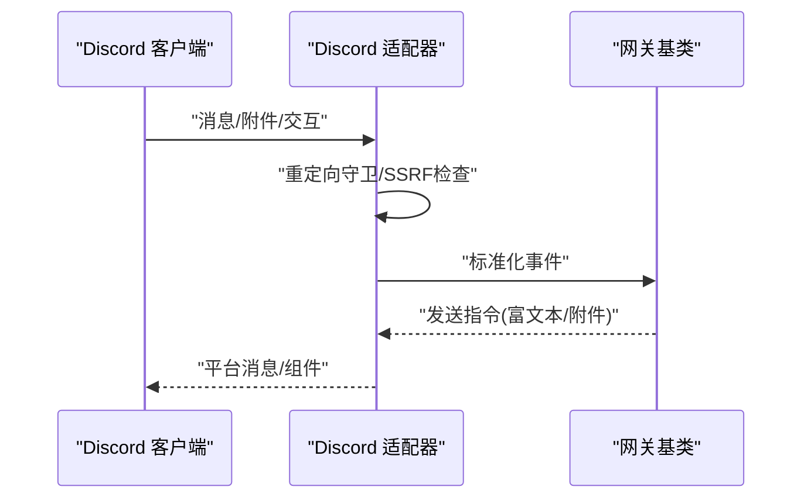
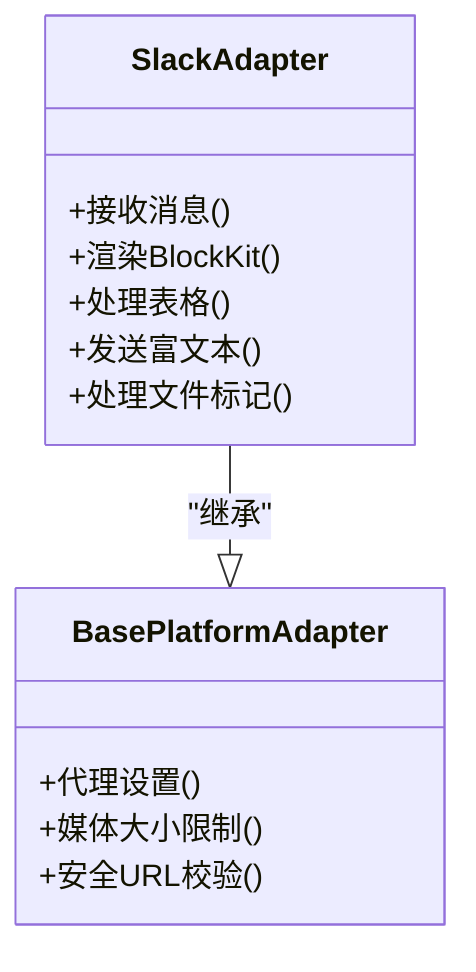
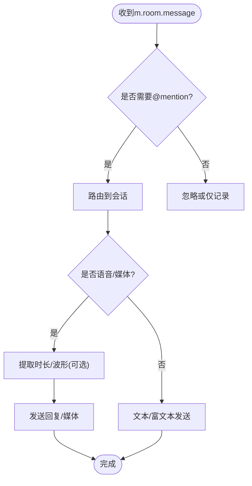
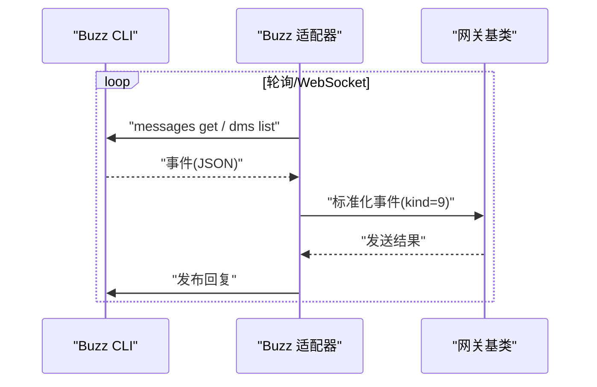
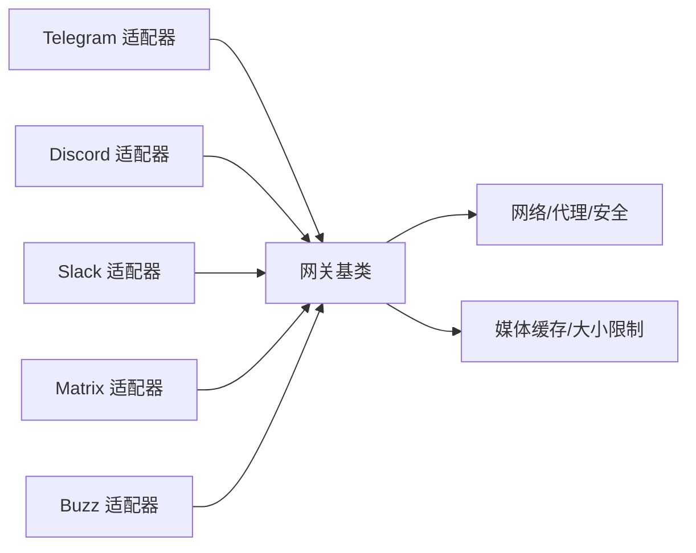

# 社交平台集成

<cite>
**本文引用的文件**
- [gateway/platforms/base.py](file://gateway/platforms/base.py)
- [plugins/platforms/telegram/__init__.py](file://plugins/platforms/telegram/__init__.py)
- [plugins/platforms/telegram/adapter.py](file://plugins/platforms/telegram/adapter.py)
- [plugins/platforms/discord/__init__.py](file://plugins/platforms/discord/__init__.py)
- [plugins/platforms/discord/adapter.py](file://plugins/platforms/discord/adapter.py)
- [plugins/platforms/slack/__init__.py](file://plugins/platforms/slack/__init__.py)
- [plugins/platforms/slack/adapter.py](file://plugins/platforms/slack/adapter.py)
- [plugins/platforms/matrix/__init__.py](file://plugins/platforms/matrix/__init__.py)
- [plugins/platforms/matrix/adapter.py](file://plugins/platforms/matrix/adapter.py)
- [plugins/platforms/buzz/__init__.py](file://plugins/platforms/buzz/__init__.py)
- [plugins/platforms/buzz/adapter.py](file://plugins/platforms/buzz/adapter.py)
</cite>

## 目录
1. [简介](#简介)
2. [项目结构](#项目结构)
3. [核心组件](#核心组件)
4. [架构总览](#架构总览)
5. [详细组件分析](#详细组件分析)
6. [依赖关系分析](#依赖关系分析)
7. [性能考量](#性能考量)
8. [故障排除指南](#故障排除指南)
9. [结论](#结论)
10. [附录](#附录)

## 简介
本文件面向 Hermes Agent 的社交平台集成，聚焦 Telegram、Discord、Slack、Matrix、Buzz 等平台的适配器实现。内容涵盖：
- OAuth/认证流程与凭据管理
- API 调用封装与安全（代理、重定向防护、SSRF）
- 消息格式转换（富文本、表格、图片/音视频/文档）
- 速率限制与重试策略
- 平台特定能力（文件上传、语音消息、富文本、交互式组件）
- 配置项与环境变量、部署注意事项
- 故障排除与性能调优建议

## 项目结构
Hermes 将“平台适配器”以插件形式组织在 plugins/platforms 下，每个平台一个子包；网关侧提供统一的基类与通用能力（base.py），各平台适配器继承并扩展。

图表来源
- [gateway/platforms/base.py:1-120](file://gateway/platforms/base.py#L1-L120)
- [plugins/platforms/telegram/adapter.py:1-60](file://plugins/platforms/telegram/adapter.py#L1-L60)
- [plugins/platforms/discord/adapter.py:1-60](file://plugins/platforms/discord/adapter.py#L1-L60)
- [plugins/platforms/slack/adapter.py:1-60](file://plugins/platforms/slack/adapter.py#L1-L60)
- [plugins/platforms/matrix/adapter.py:1-60](file://plugins/platforms/matrix/adapter.py#L1-L60)
- [plugins/platforms/buzz/adapter.py:1-60](file://plugins/platforms/buzz/adapter.py#L1-L60)

章节来源
- [gateway/platforms/base.py:1-120](file://gateway/platforms/base.py#L1-L120)

## 核心组件
- BasePlatformAdapter（网关基类）
  - 统一的消息事件模型、发送结果、处理结果枚举
  - 媒体入站大小限制、本地缓存、URL 安全校验、重定向保护
  - 代理解析（支持 SOCKS/HTTP）、NO_PROXY 匹配、macOS 系统代理自动发现
  - 线程/会话元数据构建、TTS 输出路径选择、UTF-16 长度计算与截断
- 平台适配器
  - 继承基类，实现各自平台的连接、鉴权、消息收发、富文本/多媒体、交互组件、速率限制等
  - 通过各自的 __init__.py 暴露 register 入口供网关注册

章节来源
- [gateway/platforms/base.py:1-120](file://gateway/platforms/base.py#L1-L120)
- [plugins/platforms/telegram/__init__.py:1-4](file://plugins/platforms/telegram/__init__.py#L1-L4)
- [plugins/platforms/discord/__init__.py:1-4](file://plugins/platforms/discord/__init__.py#L1-L4)
- [plugins/platforms/slack/__init__.py:1-4](file://plugins/platforms/slack/__init__.py#L1-L4)
- [plugins/platforms/matrix/__init__.py:1-4](file://plugins/platforms/matrix/__init__.py#L1-L4)
- [plugins/platforms/buzz/__init__.py:1-4](file://plugins/platforms/buzz/__init__.py#L1-L4)

## 架构总览
下图展示从平台事件到消息处理的通用流程，以及各平台适配器的接入点。

图表来源
- [gateway/platforms/base.py:78-115](file://gateway/platforms/base.py#L78-L115)
- [plugins/platforms/telegram/adapter.py:1-60](file://plugins/platforms/telegram/adapter.py#L1-L60)
- [plugins/platforms/discord/adapter.py:1-60](file://plugins/platforms/discord/adapter.py#L1-L60)
- [plugins/platforms/slack/adapter.py:1-60](file://plugins/platforms/slack/adapter.py#L1-L60)
- [plugins/platforms/matrix/adapter.py:1-60](file://plugins/platforms/matrix/adapter.py#L1-L60)
- [plugins/platforms/buzz/adapter.py:1-60](file://plugins/platforms/buzz/adapter.py#L1-L60)

## 详细组件分析

### Telegram 适配器
- 认证与连接
  - 使用 python-telegram-bot 库进行长轮询/Webhook 连接
  - 支持按 profile 隔离的授权门控环境变量读取，避免多进程共享环境导致的跨 profile 泄露
  - 启动阶段具备超时与死锁诊断（事件循环阻塞时打印堆栈），保障冷启动可观测性
- 消息与富文本
  - 支持 Markdown/HTML 混排、链接转义、表情与富文本渲染
  - 对 Telegram 私有聊天主题（DM Topic）采用 reply_to_message_id 或 direct_messages_topic_id 回退策略，确保回复落在活跃通道
- 媒体与语音
  - 根据扩展名与 is_voice 标志决定走 sendAudio/sendVoice 还是普通文档
  - 自动 TTS 输出路径按平台要求生成 .ogg/.mp3，保证语音气泡兼容
- 速率限制与稳定性
  - 初始化与网络请求具备超时保护；异常日志脱敏
  - 对 PTB/httpx 半建状态的任务进行清理，避免连接池泄漏
- 配置与环境变量
  - 通过 gateway.multiplex_profiles 下的平台门控环境变量控制访问白名单等

图表来源
- [gateway/platforms/base.py:153-173](file://gateway/platforms/base.py#L153-L173)
- [plugins/platforms/telegram/adapter.py:1-60](file://plugins/platforms/telegram/adapter.py#L1-L60)

章节来源
- [plugins/platforms/telegram/adapter.py:1-60](file://plugins/platforms/telegram/adapter.py#L1-L60)
- [gateway/platforms/base.py:153-173](file://gateway/platforms/base.py#L153-L173)

### Discord 适配器
- 认证与连接
  - 基于 discord.py，支持 Bot Token 登录与权限范围
  - 命令同步策略（safe/bulk/off）与全局命令数量上限保护
- 消息与富文本
  - 链接标签去 scheme 以避免预览冲突；Markdown 链接转义
  - 非对话消息（状态更新、后台任务进度）通过正则与元数据标记过滤
- 媒体与语音
  - 图片下载支持重定向守卫（最多 N 次跳转），防止 SSRF
  - 语音/视频通过 ffmpeg 工具链处理（可选）
- 速率限制与稳定性
  - 命令同步节流、失败重试与状态持久化
  - 图像下载限速与重定向安全校验
- 配置与环境变量
  - 可通过代理参数注入 connector/proxy，支持 SOCKS/HTTP

图表来源
- [plugins/platforms/discord/adapter.py:171-200](file://plugins/platforms/discord/adapter.py#L171-L200)
- [plugins/platforms/discord/adapter.py:1-60](file://plugins/platforms/discord/adapter.py#L1-L60)

章节来源
- [plugins/platforms/discord/adapter.py:1-200](file://plugins/platforms/discord/adapter.py#L1-L200)

### Slack 适配器
- 认证与连接
  - 基于 slack-bolt Socket Mode，支持多工作区 scope_id 透传
  - 自定义 User-Agent 前缀便于平台伙伴识别流量
- 消息与富文本
  - Block Kit 渲染与清洗；GFM 表格预处理（列宽对齐、CJK 宽度感知）
  - 线程根消息的图片上下文优先加载，减少冗余下载
- 媒体与文档
  - 文件标记渲染（图片/视频/音频/文档）用于上下文提示
  - 视频/文档缓存与大小限制
- 速率限制与稳定性
  - 错误体大小限制，避免大响应拖垮内存
  - 代理与 NO_PROXY 规则复用网关基类能力
- 配置与环境变量
  - 支持 Socket Mode 凭据与工作区隔离

图表来源
- [plugins/platforms/slack/adapter.py:1-200](file://plugins/platforms/slack/adapter.py#L1-L200)
- [gateway/platforms/base.py:417-517](file://gateway/platforms/base.py#L417-L517)

章节来源
- [plugins/platforms/slack/adapter.py:1-200](file://plugins/platforms/slack/adapter.py#L1-L200)
- [gateway/platforms/base.py:417-517](file://gateway/platforms/base.py#L417-L517)

### Matrix 适配器
- 认证与连接
  - 基于 mautrix SDK，支持端到端加密（E2EE）
  - 环境变量覆盖 E2EE 模式、设备 ID、恢复密钥等
- 消息与富文本
  - 支持房间/DM 自动线程创建、@room 提及开关
  - 语音消息元数据（时长、波形）最佳尝试提取，无 ffprobe/ffmpeg 仍可发送
- 媒体与文档
  - 音频/视频/文档上传与缓存，遵循入站媒体大小限制
- 速率限制与稳定性
  - 代理与重定向保护复用基类
  - 允许/禁止用户与房间白名单控制
- 配置与环境变量
  - 丰富的矩阵式配置项（房间、提及、工具权限、消息长度等）

图表来源
- [plugins/platforms/matrix/adapter.py:1-60](file://plugins/platforms/matrix/adapter.py#L1-L60)
- [plugins/platforms/matrix/adapter.py:147-200](file://plugins/platforms/matrix/adapter.py#L147-L200)

章节来源
- [plugins/platforms/matrix/adapter.py:1-200](file://plugins/platforms/matrix/adapter.py#L1-L200)

### Buzz 适配器
- 认证与连接
  - 通过外部 CLI（buzz）以 JSON 协议通信，支持轮询与 WebSocket（NIP-42）
  - 私钥（nsec/hex）通过受管凭据传入子进程，不落地日志
- 消息与频道
  - 仅处理 kind=9 聊天事件；支持 DM 发现与频道列表
  - 允许用户白名单（npub/hex pubkey 互转）
- 速率限制与稳定性
  - 轮询间隔、CLI 超时、消息大小限制
  - 成员变更事件（kind=44100）用于动态发现
- 配置与环境变量
  - relay_url、channels、home_channel、poll_interval、cli_path、credentials_file、allowed_users 等

图表来源
- [plugins/platforms/buzz/adapter.py:1-60](file://plugins/platforms/buzz/adapter.py#L1-L60)
- [plugins/platforms/buzz/adapter.py:87-108](file://plugins/platforms/buzz/adapter.py#L87-L108)

章节来源
- [plugins/platforms/buzz/adapter.py:1-200](file://plugins/platforms/buzz/adapter.py#L1-L200)

## 依赖关系分析
- 耦合与内聚
  - 各平台适配器高度内聚于自身协议与 SDK，通过网关基类解耦通用能力
  - 基类集中了媒体、代理、安全、长度限制等横切关注点，降低重复实现
- 直接/间接依赖
  - Telegram: python-telegram-bot、httpx/aiohttp（通过基类）
  - Discord: discord.py、ffmpeg（可选）
  - Slack: slack-bolt、aiohttp
  - Matrix: mautrix、ffprobe/ffmpeg（可选）
  - Buzz: 外部 buzz CLI（JSON 协议）
- 外部集成点
  - 平台 OAuth/Token 管理（由平台 SDK/CLI 负责）
  - 代理与 NO_PROXY（统一由基类解析）
  - 媒体缓存目录与会话隔离（由基类与配置驱动）

图表来源
- [gateway/platforms/base.py:417-517](file://gateway/platforms/base.py#L417-L517)
- [gateway/platforms/base.py:707-800](file://gateway/platforms/base.py#L707-L800)

章节来源
- [gateway/platforms/base.py:417-517](file://gateway/platforms/base.py#L417-L517)
- [gateway/platforms/base.py:707-800](file://gateway/platforms/base.py#L707-L800)

## 性能考量
- 媒体入站大小限制
  - 默认 128 MiB，可通过配置关闭或调整；下载过程流式检查 Content-Length 与累计字节，防止 OOM
- UTF-16 长度与截断
  - 针对 Telegram 4096 字符限制，使用 UTF-16 单位计数与二分查找安全截断，避免破坏代理对
- 代理与 DNS
  - 支持 SOCKS/HTTP 代理，强制远程 DNS（rdns=True）绕过污染；NO_PROXY 支持通配与 CIDR
- 线程与事件循环
  - Telegram 初始化具备线程级超时与死锁诊断，避免事件循环被同步调用卡死
- 速率限制
  - Discord 命令同步限流与最大命令数保护；Slack 错误体大小限制；Buzz 轮询间隔与 CLI 超时

[本节为通用指导，无需具体文件引用]

## 故障排除指南
- 无法连接平台
  - 检查代理设置与 NO_PROXY 匹配；确认平台凭据与作用域
  - 查看平台 SDK 日志与网关日志中的安全 URL/重定向拦截信息
- 消息未送达或乱码
  - 确认富文本格式与平台限制（如 Discord 链接标签、Slack Block Kit）
  - 检查 UTF-16 截断逻辑是否误伤多字节字符
- 媒体上传失败
  - 验证扩展名与平台支持的音频/视频类型；检查 ffmpeg/ffprobe 是否可用
  - 关注入站媒体大小限制与本地缓存目录权限
- 线程/会话错乱
  - 核对 thread_id、reply_to_message_id、direct_messages_topic_id 等元数据是否正确传递
- 性能问题
  - 调整轮询间隔（Buzz）、命令同步策略（Discord）、错误体限制（Slack）
  - 监控代理与网络延迟，必要时启用直连或更换代理

章节来源
- [gateway/platforms/base.py:417-517](file://gateway/platforms/base.py#L417-L517)
- [gateway/platforms/base.py:707-800](file://gateway/platforms/base.py#L707-L800)
- [plugins/platforms/telegram/adapter.py:1-60](file://plugins/platforms/telegram/adapter.py#L1-L60)
- [plugins/platforms/discord/adapter.py:171-200](file://plugins/platforms/discord/adapter.py#L171-L200)
- [plugins/platforms/slack/adapter.py:1-200](file://plugins/platforms/slack/adapter.py#L1-L200)
- [plugins/platforms/matrix/adapter.py:147-200](file://plugins/platforms/matrix/adapter.py#L147-L200)
- [plugins/platforms/buzz/adapter.py:87-108](file://plugins/platforms/buzz/adapter.py#L87-L108)

## 结论
Hermes 通过统一的网关基类与各平台适配器的插件化设计，实现了跨平台消息互通与能力收敛。基类提供了媒体、安全、代理、长度限制等关键横切能力，各平台适配器专注协议细节与特性实现。建议在部署中合理配置代理、媒体大小限制与平台特有选项，结合日志与诊断工具快速定位问题，并根据负载特征调优轮询、同步与缓存策略。

[本节为总结，无需具体文件引用]

## 附录
- 平台特定配置与环境变量要点
  - Telegram
    - 授权门控环境变量（按 profile 隔离）
    - 语音/音频扩展名与发送路径选择
  - Discord
    - 命令同步策略、全局命令上限、重定向守卫
  - Slack
    - Socket Mode 凭据、Block Kit 渲染、表格预处理
  - Matrix
    - E2EE 模式、设备 ID、恢复密钥、房间/用户白名单、消息长度
  - Buzz
    - relay_url、channels、home_channel、poll_interval、cli_path、credentials_file、allowed_users

[本节为概览，无需具体文件引用]