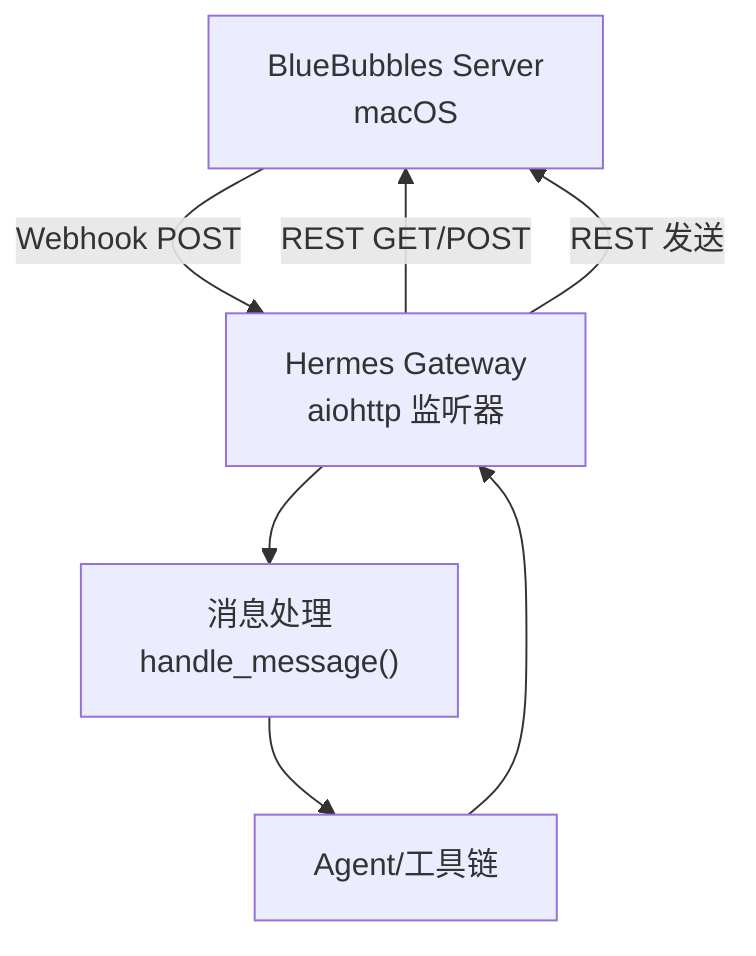
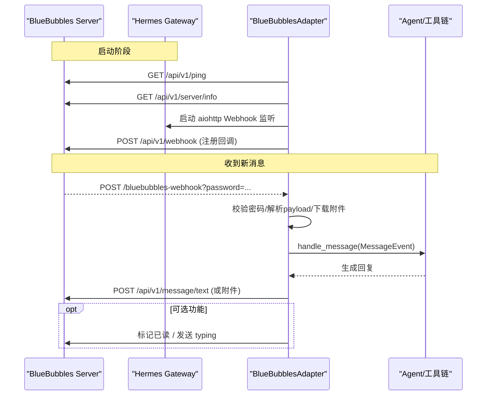
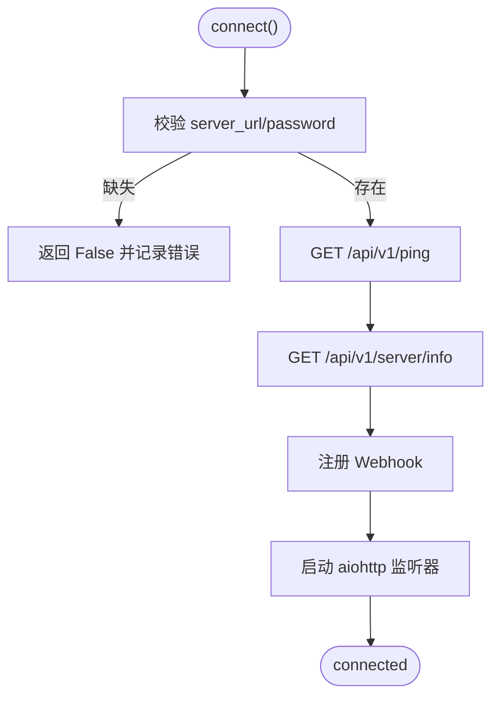
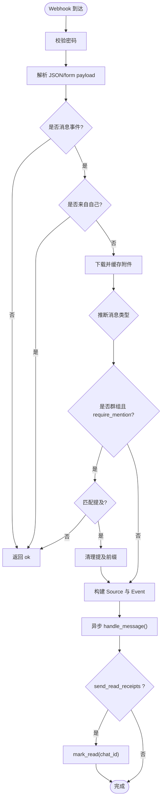
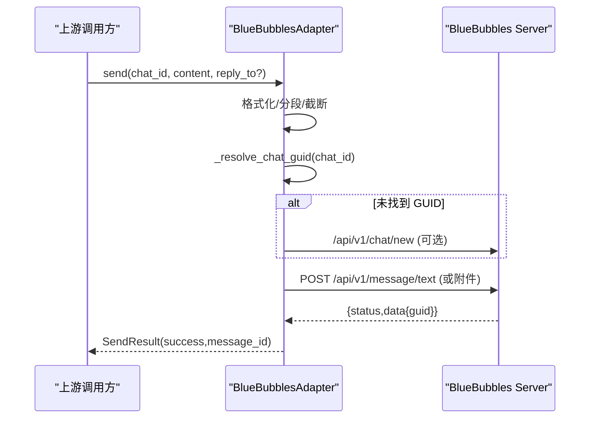
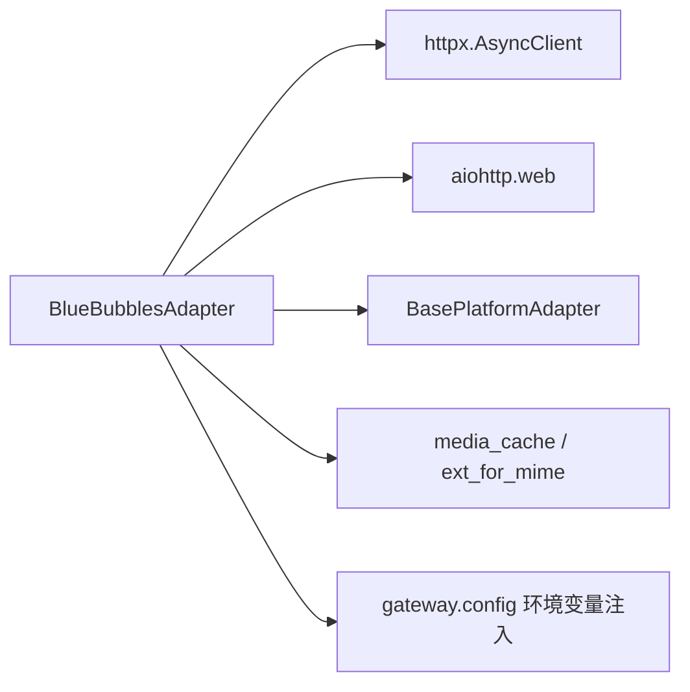

# BlueBubbles 集成

<cite>
**本文引用的文件**
- [gateway/platforms/bluebubbles.py](file://gateway/platforms/bluebubbles.py)
- [tests/gateway/test_bluebubbles.py](file://tests/gateway/test_bluebubbles.py)
- [website/docs/user-guide/messaging/bluebubbles.md](file://website/docs/user-guide/messaging/bluebubbles.md)
- [gateway/config.py](file://gateway/config.py)
</cite>

## 目录
1. [简介](#简介)
2. [项目结构](#项目结构)
3. [核心组件](#核心组件)
4. [架构总览](#架构总览)
5. [详细组件分析](#详细组件分析)
6. [依赖关系分析](#依赖关系分析)
7. [性能与可靠性](#性能与可靠性)
8. [故障排查指南](#故障排查指南)
9. [安装、配置与使用示例](#安装配置与使用示例)
10. [结论](#结论)

## 简介
本文件面向需要在 Hermes Gateway 中集成 BlueBubbles（iMessage）的开发者与运维人员，系统性说明：
- 连接方式与认证机制（REST + Webhook）
- iMessage 消息处理流程（文本、富媒体、群组、已读回执、在线状态）
- 错误处理策略与健壮性设计
- 安装、配置与使用示例

BlueBubbles 通过本地 macOS 服务器桥接 iMessage。Hermes 通过 REST API 发送消息，并通过 Webhook 接收新消息事件；可选启用 Private API 以支持 Tapback、输入指示器与已读回执等高级能力。

## 项目结构
BlueBubbles 集成主要位于 gateway/platforms 下的适配器实现，以及 gateway/config 中的环境变量注入逻辑。用户文档位于 website 目录。

图表来源
- [gateway/platforms/bluebubbles.py:264-322](file://gateway/platforms/bluebubbles.py#L264-L322)
- [gateway/platforms/bluebubbles.py:896-1071](file://gateway/platforms/bluebubbles.py#L896-L1071)

章节来源
- [gateway/platforms/bluebubbles.py:1-126](file://gateway/platforms/bluebubbles.py#L1-L126)
- [gateway/config.py:2374-2412](file://gateway/config.py#L2374-L2412)
- [website/docs/user-guide/messaging/bluebubbles.md:1-172](file://website/docs/user-guide/messaging/bluebubbles.md#L1-L172)

## 核心组件
- BlueBubblesAdapter：平台适配器，封装连接、Webhook 注册、消息收发、富媒体、已读回执、输入指示器等。
- Webhook 处理器：基于 aiohttp 的轻量 HTTP 服务，用于接收 BlueBubbles 推送的新消息事件。
- 配置加载：从环境变量注入平台开关与参数（server_url、password、webhook_*、require_mention、mention_patterns 等）。
- 附件下载与缓存：根据 MIME 类型将附件下载到本地并缓存为图片/音频/文档，供 Agent 消费。

章节来源
- [gateway/platforms/bluebubbles.py:163-205](file://gateway/platforms/bluebubbles.py#L163-L205)
- [gateway/platforms/bluebubbles.py:264-322](file://gateway/platforms/bluebubbles.py#L264-L322)
- [gateway/platforms/bluebubbles.py:813-869](file://gateway/platforms/bluebubbles.py#L813-L869)
- [gateway/config.py:2374-2412](file://gateway/config.py#L2374-L2412)

## 架构总览
BlueBubbles 集成采用“REST 出站 + Webhook 入站”的双通道模式：
- 出站：通过 httpx 调用 BlueBubbles REST API 发送文本、图片、语音、视频、文档等。
- 入站：启动 aiohttp 服务监听 Webhook，解析事件后构造 MessageEvent 交由上层处理。
- 可选 Private API：当 helper_connected 为真时，可启用 Tapback、typing、read receipts 等。

图表来源
- [gateway/platforms/bluebubbles.py:264-322](file://gateway/platforms/bluebubbles.py#L264-L322)
- [gateway/platforms/bluebubbles.py:378-425](file://gateway/platforms/bluebubbles.py#L378-L425)
- [gateway/platforms/bluebubbles.py:534-585](file://gateway/platforms/bluebubbles.py#L534-L585)
- [gateway/platforms/bluebubbles.py:896-1071](file://gateway/platforms/bluebubbles.py#L896-L1071)

## 详细组件分析

### 连接与认证
- 认证方式：所有 REST 请求在 URL 查询串附加 password；Webhook 回调通过 URL 查询串或请求头携带密码进行鉴权。
- 连接检查：connect() 会 ping 并读取 server info，记录 private_api 与 helper_connected 能力位。
- Webhook 注册：启动时自动注册回调地址，重复启动时去重复用已有注册。

图表来源
- [gateway/platforms/bluebubbles.py:264-322](file://gateway/platforms/bluebubbles.py#L264-L322)
- [gateway/platforms/bluebubbles.py:378-425](file://gateway/platforms/bluebubbles.py#L378-L425)

章节来源
- [gateway/platforms/bluebubbles.py:248-258](file://gateway/platforms/bluebubbles.py#L248-L258)
- [gateway/platforms/bluebubbles.py:336-365](file://gateway/platforms/bluebubbles.py#L336-L365)
- [gateway/platforms/bluebubbles.py:367-425](file://gateway/platforms/bluebubbles.py#L367-L425)

### 消息处理（入站）
- Webhook 鉴权：优先从 query 获取 password，其次回退到 x-password/x-guid/x-bluebubbles-guid 等头。
- 事件过滤：仅处理 new-message/message/updated-message；忽略来自自身的消息与 Tapback 事件。
- 附件处理：按 MIME 类型下载并缓存为图片/音频/文档，同时推断消息类型（TEXT/PHOTO/VOICE/VIDEO/DOCUMENT）。
- 群组提及门控：当 require_mention=true 且 isGroup=true 时，未匹配 mention 则忽略；匹配后去除前缀唤醒词再转发。
- 会话标识：优先使用 chatGuid/chatIdentifier，否则回退到 sender；构建 source 信息（chat_id/chat_name/chat_type/user_id）。

图表来源
- [gateway/platforms/bluebubbles.py:896-1071](file://gateway/platforms/bluebubbles.py#L896-L1071)

章节来源
- [gateway/platforms/bluebubbles.py:896-1071](file://gateway/platforms/bluebubbles.py#L896-L1071)

### 消息发送（出站）
- 文本：按段落拆分并在超过长度限制时分块发送；支持 reply_to（需 Private API）。
- 富媒体：图片、语音、视频、文档均通过 multipart 上传；语音消息设置 isAudioMessage。
- 会话定位：通过 _resolve_chat_guid 将邮箱/电话解析为 GUID；若不存在且允许创建新会话，则通过私有 API 新建聊天。

图表来源
- [gateway/platforms/bluebubbles.py:527-585](file://gateway/platforms/bluebubbles.py#L527-L585)
- [gateway/platforms/bluebubbles.py:591-704](file://gateway/platforms/bluebubbles.py#L591-L704)
- [gateway/platforms/bluebubbles.py:464-522](file://gateway/platforms/bluebubbles.py#L464-L522)

章节来源
- [gateway/platforms/bluebubbles.py:527-585](file://gateway/platforms/bluebubbles.py#L527-L585)
- [gateway/platforms/bluebubbles.py:591-704](file://gateway/platforms/bluebubbles.py#L591-L704)
- [gateway/platforms/bluebubbles.py:464-522](file://gateway/platforms/bluebubbles.py#L464-L522)

### 富媒体与群组聊天
- 富媒体：入站按 MIME 分类下载并缓存；出站通过 multipart 上传，支持图片、语音、视频、文档。
- 群组：isGroup 判断与 ;+; 标志；支持 require_mention 白名单式响应控制；默认提供保守唤醒词。

章节来源
- [gateway/platforms/bluebubbles.py:957-991](file://gateway/platforms/bluebubbles.py#L957-L991)
- [gateway/platforms/bluebubbles.py:1030-1037](file://gateway/platforms/bluebubbles.py#L1030-L1037)
- [website/docs/user-guide/messaging/bluebubbles.md:123-144](file://website/docs/user-guide/messaging/bluebubbles.md#L123-L144)

### 已读回执与在线状态
- 已读回执：处理完消息后异步 mark_read；可通过 send_read_receipts 开关控制。
- 在线状态：typing 与 stop_typing 通过 Private API 向对应 chat GUID 发送/删除 typing 状态。

章节来源
- [gateway/platforms/bluebubbles.py:722-765](file://gateway/platforms/bluebubbles.py#L722-L765)
- [gateway/platforms/bluebubbles.py:1067-1069](file://gateway/platforms/bluebubbles.py#L1067-L1069)

### Apple ID 认证机制
- 本项目不直接管理 Apple ID 登录；Apple ID 由 BlueBubbles Server 在其 Mac 上维护。
- Hermes 仅通过 server_url 与 password 访问 BlueBubbles REST/Webhook。

章节来源
- [website/docs/user-guide/messaging/bluebubbles.md:5-10](file://website/docs/user-guide/messaging/bluebubbles.md#L5-L10)
- [gateway/platforms/bluebubbles.py:264-286](file://gateway/platforms/bluebubbles.py#L264-L286)

### WebSocket 通信
- 当前实现不使用 WebSocket；入站通过 HTTP Webhook，出站通过 HTTP REST。
- 如需未来扩展 WebSocket，可在适配器内新增 WS 客户端/服务端并与现有事件流集成。

章节来源
- [gateway/platforms/bluebubbles.py:264-322](file://gateway/platforms/bluebubbles.py#L264-L322)
- [gateway/platforms/bluebubbles.py:896-1071](file://gateway/platforms/bluebubbles.py#L896-L1071)

### 消息队列管理
- 入站消息通过 asyncio.create_task 异步派发至 handle_message，避免阻塞 Webhook 响应。
- 任务加入后台集合并在完成后移除，防止内存泄漏。

章节来源
- [gateway/platforms/bluebubbles.py:1063-1065](file://gateway/platforms/bluebubbles.py#L1063-L1065)

### 错误处理策略
- 连接失败：无法连通 BlueBubbles 时关闭 client 并返回 False。
- Webhook 解析失败：返回 400；鉴权失败返回 401。
- 附件下载失败：记录警告并返回 None，不影响主消息流转。
- 群组忽略：未匹配提及时静默 ack，减少噪音。

章节来源
- [gateway/platforms/bluebubbles.py:287-294](file://gateway/platforms/bluebubbles.py#L287-L294)
- [gateway/platforms/bluebubbles.py:896-926](file://gateway/platforms/bluebubbles.py#L896-L926)
- [gateway/platforms/bluebubbles.py:863-869](file://gateway/platforms/bluebubbles.py#L863-L869)
- [gateway/platforms/bluebubbles.py:1031-1037](file://gateway/platforms/bluebubbles.py#L1031-L1037)

## 依赖关系分析
- 运行时依赖：httpx（REST 客户端）、aiohttp（Webhook 服务）。
- 内部依赖：BasePlatformAdapter、消息类型枚举、媒体缓存工具、提示词构建（提及模式）。
- 配置依赖：环境变量注入平台开关与参数。

图表来源
- [gateway/platforms/bluebubbles.py:22-35](file://gateway/platforms/bluebubbles.py#L22-L35)
- [gateway/platforms/bluebubbles.py:264-322](file://gateway/platforms/bluebubbles.py#L264-L322)
- [gateway/config.py:2374-2412](file://gateway/config.py#L2374-L2412)

章节来源
- [gateway/platforms/bluebubbles.py:22-35](file://gateway/platforms/bluebubbles.py#L22-L35)
- [gateway/config.py:2374-2412](file://gateway/config.py#L2374-L2412)

## 性能与可靠性
- 连接池与超时：httpx 使用平台限流与 30s 超时；附件下载 60s 超时；发送附件 120s 超时。
- Webhook 体大小限制：client_max_size 限制以避免大体积/分块请求占用内存。
- 会话 GUID 缓存：LRU 上限 500，降低频繁查询开销。
- 健壮性：Webhook 注册去重、异常路径降级（无 Private API 仍可用基础功能）。

章节来源
- [gateway/platforms/bluebubbles.py:272-274](file://gateway/platforms/bluebubbles.py#L272-L274)
- [gateway/platforms/bluebubbles.py:296-300](file://gateway/platforms/bluebubbles.py#L296-L300)
- [gateway/platforms/bluebubbles.py:124-125](file://gateway/platforms/bluebubbles.py#L124-L125)
- [gateway/platforms/bluebubbles.py:824-828](file://gateway/platforms/bluebubbles.py#L824-L828)
- [gateway/platforms/bluebubbles.py:620-625](file://gateway/platforms/bluebubbles.py#L620-L625)

## 故障排查指南
- 无法连接服务器：检查 server_url 与 password；确认网络可达与防火墙端口开放。
- 消息未到达：确认 Webhook 已在 BlueBubbles 中注册；验证回调地址可从 Mac 访问；查看网关日志。
- Private API 未连接：安装 Private API helper；基础收发不受影响，仅 Tapback/typing/read receipts 受限。
- 群组消息被忽略：开启 require_mention 时，确保消息包含匹配的提及模式。

章节来源
- [website/docs/user-guide/messaging/bluebubbles.md:156-171](file://website/docs/user-guide/messaging/bluebubbles.md#L156-L171)
- [gateway/platforms/bluebubbles.py:287-294](file://gateway/platforms/bluebubbles.py#L287-L294)
- [gateway/platforms/bluebubbles.py:1031-1037](file://gateway/platforms/bluebubbles.py#L1031-L1037)

## 安装、配置与使用示例
- 前置条件：Mac 运行 BlueBubbles Server，已登录 Apple ID；版本要求满足 Webhook。
- 获取凭据：在 BlueBubbles Settings → API 记录 Server URL 与 Password。
- 配置 Hermes：
  - 交互式：hermes gateway setup 选择 BlueBubbles 并填入凭据。
  - 环境变量：设置 BLUEBUBBLES_SERVER_URL、BLUEBUBBLES_PASSWORD 等。
- 可选：群组提及门控、自定义提及模式、自动已读回执。
- 授权用户：DM 配对码审批或预置允许列表/开放访问。
- 启动：hermes gateway run。

章节来源
- [website/docs/user-guide/messaging/bluebubbles.md:5-94](file://website/docs/user-guide/messaging/bluebubbles.md#L5-L94)
- [gateway/config.py:2374-2412](file://gateway/config.py#L2374-L2412)

## 结论
BlueBubbles 集成通过 REST + Webhook 实现了稳定可靠的 iMessage 双向通信。其设计兼顾了易用性与可扩展性：基础收发无需 Private API，高级特性按需启用；具备完善的鉴权、错误处理与资源管理。配合环境变量的灵活配置，可快速部署并投入生产使用。