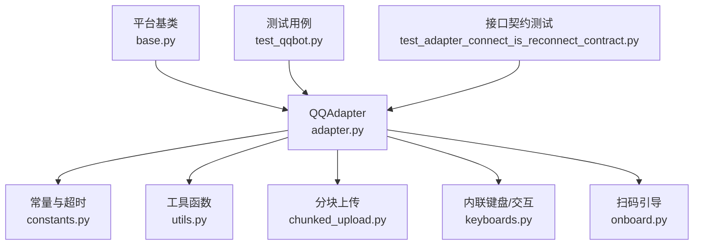
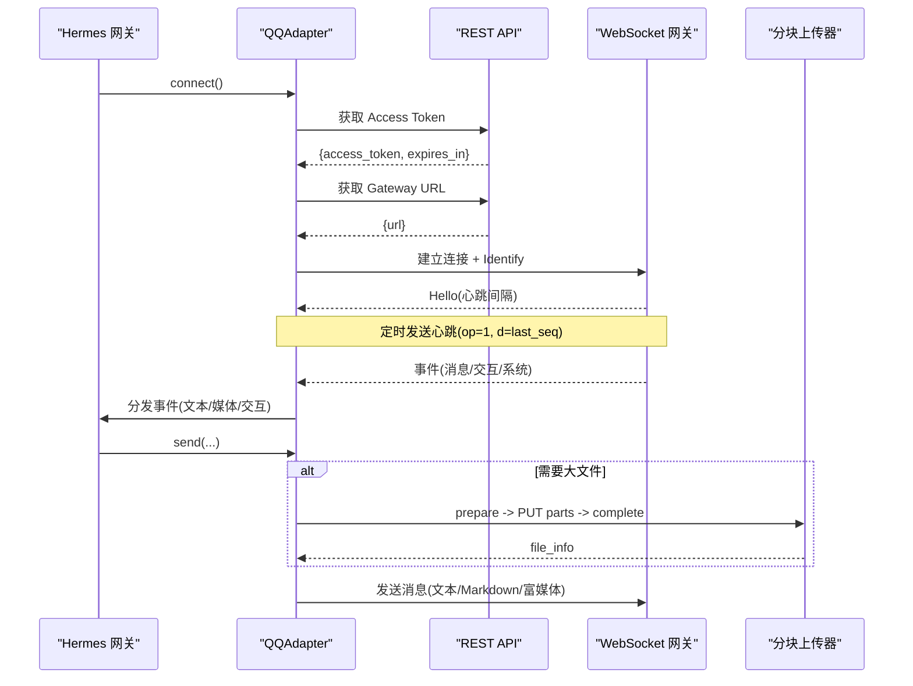
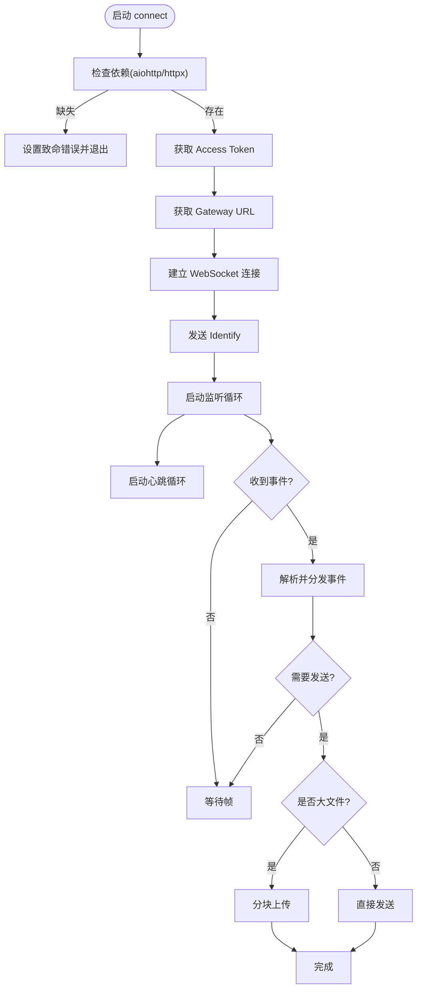
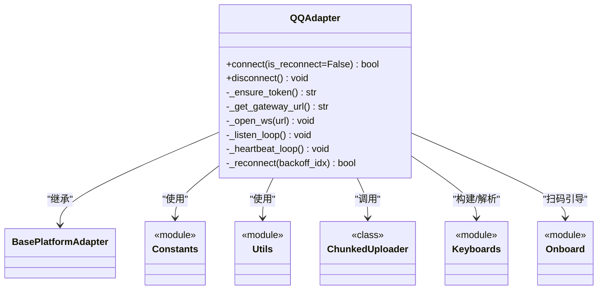

# QQ Bot 集成

<cite>
**本文引用的文件**
- [adapter.py](file://gateway/platforms/qqbot/adapter.py)
- [constants.py](file://gateway/platforms/qqbot/constants.py)
- [onboard.py](file://gateway/platforms/qqbot/onboard.py)
- [utils.py](file://gateway/platforms/qqbot/utils.py)
- [chunked_upload.py](file://gateway/platforms/qqbot/chunked_upload.py)
- [keyboards.py](file://gateway/platforms/qqbot/keyboards.py)
- [__init__.py](file://gateway/platforms/qqbot/__init__.py)
- [base.py](file://gateway/platforms/base.py)
- [test_qqbot.py](file://tests/gateway/test_qqbot.py)
- [test_adapter_connect_is_reconnect_contract.py](file://tests/gateway/test_adapter_connect_is_reconnect_contract.py)
- [qqbot.md](file://website/docs/user-guide/messaging/qqbot.md)
</cite>

## 目录
1. [简介](#简介)
2. [项目结构](#项目结构)
3. [核心组件](#核心组件)
4. [架构总览](#架构总览)
5. [详细组件分析](#详细组件分析)
6. [依赖关系分析](#依赖关系分析)
7. [性能与限制](#性能与限制)
8. [故障排查指南](#故障排查指南)
9. [结论](#结论)
10. [附录：开发部署配置](#附录开发部署配置)

## 简介
本文件面向在 Hermes Agent 中接入 QQ 开放平台（QQ Bot v2）的开发者，系统化说明从应用注册、权限申请到消息处理、群组管理、私聊功能实现的全流程；并覆盖频率限制、消息去重、错误重试与状态同步机制。文档同时提供可操作的开发与部署配置指引，帮助快速落地生产环境。

## 项目结构
QQ Bot 适配层位于 gateway/platforms/qqbot 包内，采用模块化拆分：
- adapter.py：核心适配器，封装认证、WebSocket 长连接、事件分发、发送消息、媒体上传、心跳与重连等
- constants.py：统一常量（API 地址、超时、重连退避、消息长度限制、去重窗口等）
- onboard.py：扫码绑定引导流程（创建任务、展示二维码、轮询结果、解密凭据）
- utils.py：通用工具（User-Agent、请求头、配置列表转换）
- chunked_upload.py：分块上传（大文件通过预签名 URL 分段上传）
- keyboards.py：内联键盘与交互事件解析（审批按钮、更新提示按钮）
- __init__.py：对外重新导出符号，保持向后兼容

图表来源
- [adapter.py:180-374](file://gateway/platforms/qqbot/adapter.py#L180-L374)
- [constants.py:17-56](file://gateway/platforms/qqbot/constants.py#L17-L56)
- [utils.py:25-72](file://gateway/platforms/qqbot/utils.py#L25-L72)
- [chunked_upload.py:1-68](file://gateway/platforms/qqbot/chunked_upload.py#L1-L68)
- [keyboards.py:1-28](file://gateway/platforms/qqbot/keyboards.py#L1-L28)
- [onboard.py:1-14](file://gateway/platforms/qqbot/onboard.py#L1-L14)
- [base.py:1-6](file://gateway/platforms/base.py#L1-L6)

章节来源
- [adapter.py:1-138](file://gateway/platforms/qqbot/adapter.py#L1-L138)
- [constants.py:1-75](file://gateway/platforms/qqbot/constants.py#L1-L75)
- [onboard.py:1-221](file://gateway/platforms/qqbot/onboard.py#L1-L221)
- [utils.py:1-72](file://gateway/platforms/qqbot/utils.py#L1-L72)
- [chunked_upload.py:1-200](file://gateway/platforms/qqbot/chunked_upload.py#L1-L200)
- [keyboards.py:1-200](file://gateway/platforms/qqbot/keyboards.py#L1-L200)
- [__init__.py:1-92](file://gateway/platforms/qqbot/__init__.py#L1-L92)
- [base.py:1-200](file://gateway/platforms/base.py#L1-L200)

## 核心组件
- QQAdapter：继承自 BasePlatformAdapter，负责 QQ Bot 全生命周期管理（认证、网关连接、事件监听、消息收发、媒体处理、心跳、重连、频率控制、消息去重、交互回调）。
- 常量模块：集中管理 API 端点、超时、重连策略、消息长度上限、去重窗口等。
- 扫码引导：提供 QR 码绑定流程，生成任务、展示二维码、轮询结果并解密凭据。
- 分块上传：对超过内联大小限制的文件使用三段式分块上传（prepare → PUT parts → complete）。
- 内联键盘：构建审批/更新提示键盘，解析用户点击事件并路由到上层审批流。

章节来源
- [adapter.py:180-374](file://gateway/platforms/qqbot/adapter.py#L180-L374)
- [constants.py:17-56](file://gateway/platforms/qqbot/constants.py#L17-L56)
- [onboard.py:84-221](file://gateway/platforms/qqbot/onboard.py#L84-L221)
- [chunked_upload.py:1-120](file://gateway/platforms/qqbot/chunked_upload.py#L1-L120)
- [keyboards.py:1-200](file://gateway/platforms/qqbot/keyboards.py#L1-L200)

## 架构总览
QQ Bot 适配器通过官方 WebSocket Gateway 接收事件，并通过 REST API 发送消息与媒体。整体流程包括：
- 获取 Access Token
- 获取 Gateway URL
- 建立 WebSocket 连接并 Identify
- 心跳保活与断线重连
- 事件解析与分发（文本、媒体、交互）
- 发送消息（文本/Markdown/富媒体），必要时触发分块上传
- 语音消息优先使用 QQ 内置 ASR，失败时回退至配置的 STT 提供商

图表来源
- [adapter.py:309-374](file://gateway/platforms/qqbot/adapter.py#L309-L374)
- [adapter.py:424-479](file://gateway/platforms/qqbot/adapter.py#L424-L479)
- [adapter.py:485-514](file://gateway/platforms/qqbot/adapter.py#L485-L514)
- [adapter.py:717-760](file://gateway/platforms/qqbot/adapter.py#L717-L760)
- [chunked_upload.py:1-32](file://gateway/platforms/qqbot/chunked_upload.py#L1-L32)

## 详细组件分析

### QQAdapter 类与生命周期
- 认证与会话
  - 通过 REST 获取 access_token，缓存并在过期前刷新
  - 获取 WebSocket Gateway URL，建立 aiohttp 客户端会话
  - 发送 Identify（携带 intents 与 shard），接收 Ready
- 连接与心跳
  - 启动监听循环与心跳循环，按 Hello 返回的间隔发送心跳
  - 支持代理环境变量（WSS_PROXY/HTTPS_PROXY/ALL_PROXY）
- 事件处理
  - 解析 JSON 事件，分发到消息/交互处理器
  - 维护 last_seq 用于重连后恢复
- 发送消息与媒体
  - 支持文本与 Markdown（msg_type 2）
  - 图片/视频/语音/文件走富媒体通道，必要时触发分块上传
  - 输入态通知（typing）与防抖
- 错误处理与重连
  - 区分致命错误（如被封禁/沙箱）、会话错误（需重新 identify）、速率限制（等待固定时长）
  - 指数退避重连，最大尝试次数保护
- 访问控制
  - 私聊与群聊策略：open / allowlist / disabled / pairing
  - 白名单支持 allow_from / group_allow_from

图表来源
- [adapter.py:309-374](file://gateway/platforms/qqbot/adapter.py#L309-L374)
- [adapter.py:424-479](file://gateway/platforms/qqbot/adapter.py#L424-L479)
- [adapter.py:485-514](file://gateway/platforms/qqbot/adapter.py#L485-L514)
- [adapter.py:516-715](file://gateway/platforms/qqbot/adapter.py#L516-L715)
- [chunked_upload.py:1-32](file://gateway/platforms/qqbot/chunked_upload.py#L1-L32)

章节来源
- [adapter.py:180-374](file://gateway/platforms/qqbot/adapter.py#L180-L374)
- [adapter.py:424-715](file://gateway/platforms/qqbot/adapter.py#L424-L715)

### 消息去重与频率限制
- 消息去重
  - 维护最近 N 条消息 ID 的时间窗口，避免重复处理
  - 窗口大小与时间由常量定义，防止内存无限增长
- 频率限制
  - 当网关返回 4008 速率限制时，等待固定时长后重试
  - 快速断开检测：短时间内频繁断线会标记为致命错误，提示检查权限或配置

章节来源
- [constants.py:50-56](file://gateway/platforms/qqbot/constants.py#L50-L56)
- [adapter.py:516-626](file://gateway/platforms/qqbot/adapter.py#L516-L626)

### 语音消息与 STT 回退
- 优先使用 QQ 内置 ASR（asr_refer_text）
- 若未返回文本，则调用配置的 STT 提供商（默认 zai/GLM-ASR，也支持 OpenAI Whisper 兼容端点）
- 临时文件下载与清理：STT 失败时确保临时文件被删除

章节来源
- [adapter.py:1-30](file://gateway/platforms/qqbot/adapter.py#L1-L30)
- [test_qqbot.py:137-174](file://tests/gateway/test_qqbot.py#L137-L174)

### 内联键盘与交互事件
- 构建审批/更新提示键盘，支持按钮互斥组、点击限制、样式与可见标签
- 解析 INTERACTION_CREATE 事件中的 button_data，路由到审批/更新流程
- 默认交互回调将审批按钮点击转发给网关审批工具，更新提示写入本地状态文件

章节来源
- [keyboards.py:1-200](file://gateway/platforms/qqbot/keyboards.py#L1-L200)
- [adapter.py:276-290](file://gateway/platforms/qqbot/adapter.py#L276-L290)

### 扫码引导（QR Onboard）
- 创建绑定任务，生成二维码 URL
- 终端渲染二维码（可选依赖 qrcode），否则打印直链
- 轮询绑定结果，成功后解密 client_secret，返回 app_id、client_secret、user_openid

章节来源
- [onboard.py:84-221](file://gateway/platforms/qqbot/onboard.py#L84-L221)

### 分块上传（大文件）
- 三段式流程：upload_prepare → PUT 各分片 → upload_part_finish → files
- 并发上传分片，支持重试与超时控制
- 业务错误码：每日配额超限（非重试）、分片完成重试（按服务器建议等待）

章节来源
- [chunked_upload.py:1-120](file://gateway/platforms/qqbot/chunked_upload.py#L1-L120)

## 依赖关系分析
- 外部依赖
  - aiohttp：WebSocket 客户端
  - httpx：异步 HTTP 客户端（REST 与 SSRF 防护钩子）
- 内部依赖
  - BasePlatformAdapter：统一平台适配器接口与通用能力
  - 常量/工具/上传/键盘模块：解耦职责，便于测试与维护
- 测试保障
  - 适配器 connect 必须接受 is_reconnect 关键字参数（回归测试）
  - 代理环境变量、临时文件清理、SSRF 防护等场景验证

图表来源
- [base.py:1-6](file://gateway/platforms/base.py#L1-L6)
- [adapter.py:180-374](file://gateway/platforms/qqbot/adapter.py#L180-L374)
- [constants.py:1-75](file://gateway/platforms/qqbot/constants.py#L1-L75)
- [utils.py:1-72](file://gateway/platforms/qqbot/utils.py#L1-L72)
- [chunked_upload.py:1-200](file://gateway/platforms/qqbot/chunked_upload.py#L1-L200)
- [keyboards.py:1-200](file://gateway/platforms/qqbot/keyboards.py#L1-L200)
- [onboard.py:1-221](file://gateway/platforms/qqbot/onboard.py#L1-L221)

章节来源
- [test_adapter_connect_is_reconnect_contract.py:1-145](file://tests/gateway/test_adapter_connect_is_reconnect_contract.py#L1-L145)
- [test_qqbot.py:1-200](file://tests/gateway/test_qqbot.py#L1-L200)

## 性能与限制
- 消息长度限制：单条消息最大长度受常量约束，超长需拆分或改用富媒体
- 去重窗口：默认 300 秒、最多保留 1000 条记录，平衡内存与去重效果
- 重连策略：指数退避 [2,5,10,30,60]，最大尝试 100 次
- 速率限制：遇到 4008 等待 60 秒后重试
- 分块上传：默认并发 1，最大 10；每分片超时 300 秒，完成阶段最大重试 2 次
- 心跳间隔：按 Hello 返回的间隔的 80% 发送，避免超时

章节来源
- [constants.py:37-56](file://gateway/platforms/qqbot/constants.py#L37-L56)
- [adapter.py:742-760](file://gateway/platforms/qqbot/adapter.py#L742-L760)
- [chunked_upload.py:53-68](file://gateway/platforms/qqbot/chunked_upload.py#L53-L68)

## 故障排查指南
- 机器人立即断开（快速断开）
  - 检查 AppID/Secret 是否正确
  - 确认已启用所需意图（C2C、群 @、公会、私信、交互）
  - 沙箱模式仅允许沙箱测试频道
- 语音消息未转写
  - 检查 QQ 内置 ASR 是否返回 asr_refer_text
  - 若使用自定义 STT，确认密钥与模型配置正确
  - 查看网关日志中的 STT 错误信息
- 消息未送达
  - 确认意图已启用
  - 检查 DM 白名单与群策略
  - 群消息需 @提及（取决于策略）
  - 定时/通知投递目标 QQBOT_HOME_CHANNEL
- 连接错误
  - 安装依赖：aiohttp、httpx
  - 网络连通性：api.sgroup.qq.com 与 WebSocket 网关可达
  - 查看网关日志与重连行为

章节来源
- [qqbot.md:97-124](file://website/docs/user-guide/messaging/qqbot.md#L97-L124)

## 结论
QQ Bot 适配器在 Hermes 中提供了完整、健壮且可扩展的接入方案：基于官方 WebSocket 与 REST API，覆盖认证、连接、事件、消息、媒体、交互、重连与限流等关键能力；配合扫码引导与分块上传，满足从开发到生产的多种场景。通过严格的测试与清晰的常量/工具/上传/键盘模块划分，便于维护与扩展。

## 附录：开发部署配置
- 前置条件
  - 在 QQ 开放平台注册应用，获取 App ID 与 App Secret
  - 启用必要意图：C2C 消息、群 @-消息、公会消息、私信、交互
  - 安装依赖：pip install aiohttp httpx
- 环境变量
  - QQ_APP_ID、QQ_CLIENT_SECRET（必需）
  - QQBOT_HOME_CHANNEL、QQBOT_HOME_CHANNEL_NAME（通知/定时）
  - QQ_ALLOWED_USERS、QQ_GROUP_ALLOWED_USERS、QQ_ALLOW_ALL_USERS（访问控制）
  - QQ_PORTAL_HOST（覆盖门户域名，沙箱可用 sandbox.q.qq.com）
  - QQ_STT_API_KEY、QQ_STT_MODEL（语音转文字）
- 配置文件（config.yaml）
  - platforms.qqbot.enabled
  - platforms.qqbot.extra.app_id/client_secret/markdown_support
  - dm_policy/group_policy 与 allow_from/group_allow_from
  - stt.provider/baseUrl/apiKey/model
- 交互式设置
  - 运行 hermes gateway setup，选择 QQ Bot 并按提示完成

章节来源
- [qqbot.md:14-84](file://website/docs/user-guide/messaging/qqbot.md#L14-L84)
- [adapter.py:7-29](file://gateway/platforms/qqbot/adapter.py#L7-L29)
- [constants.py:17-31](file://gateway/platforms/qqbot/constants.py#L17-L31)