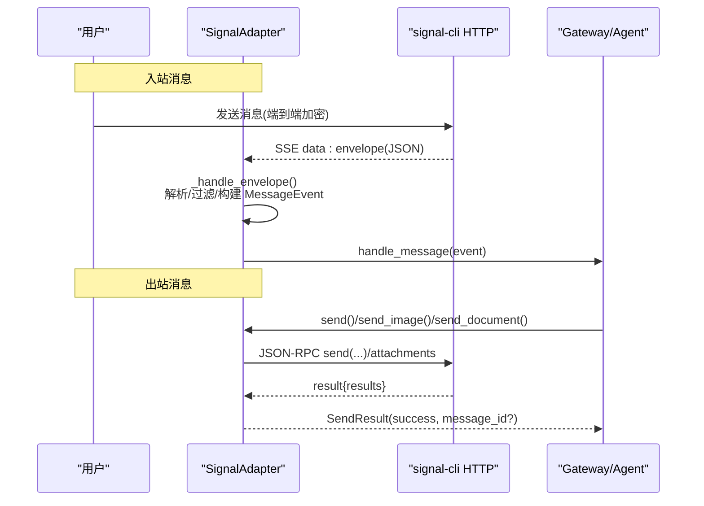
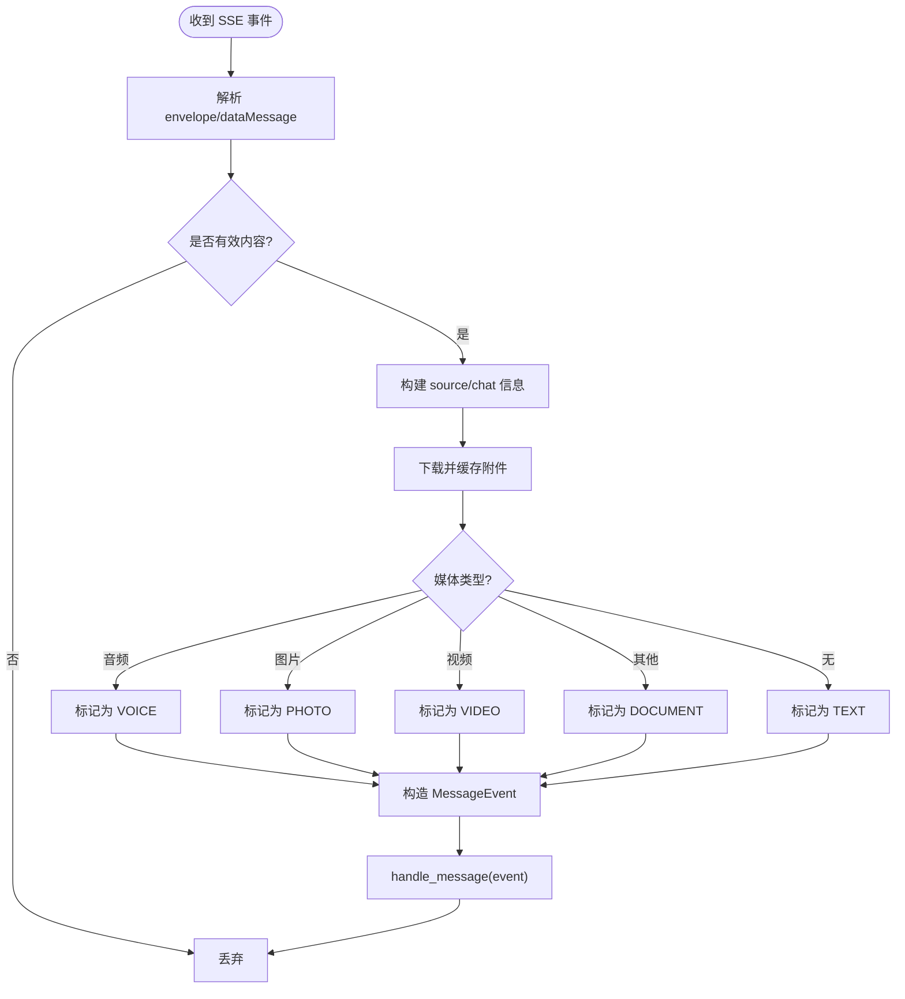
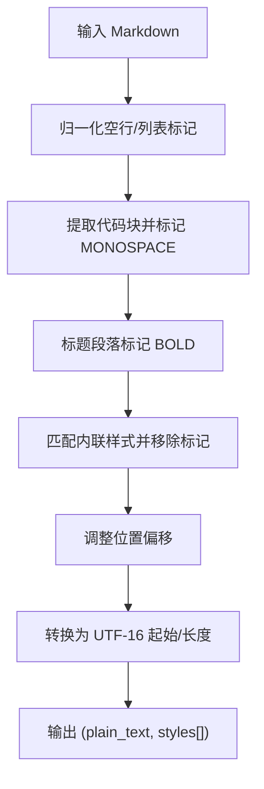
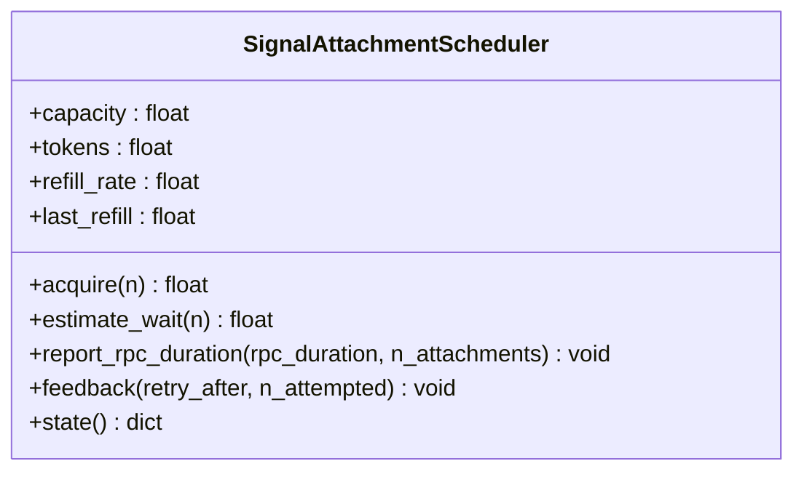
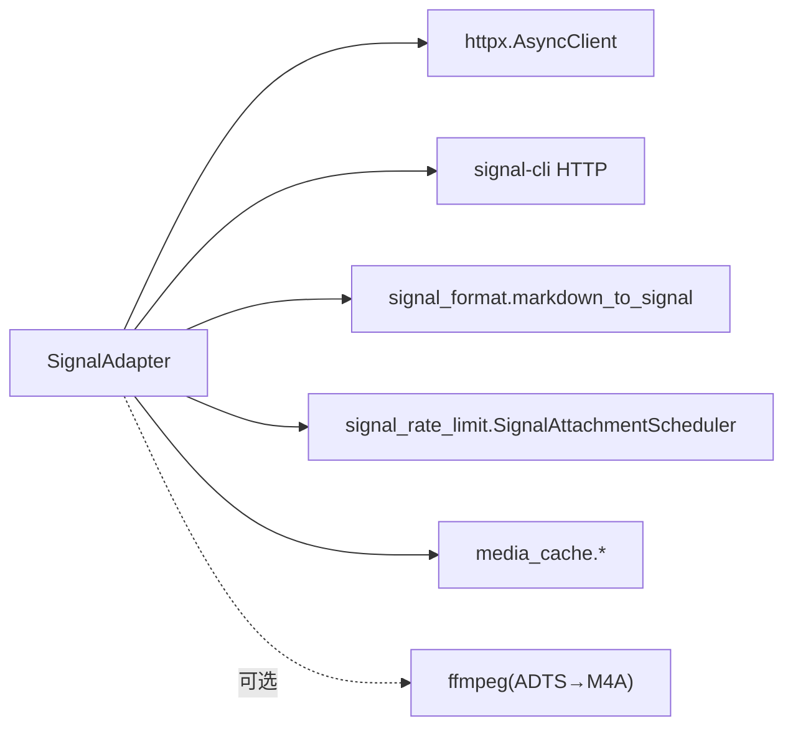

# Signal 集成

<cite>
**本文引用的文件**
- [gateway/platforms/signal.py](file://gateway/platforms/signal.py)
- [gateway/platforms/signal_format.py](file://gateway/platforms/signal_format.py)
- [gateway/platforms/signal_rate_limit.py](file://gateway/platforms/signal_rate_limit.py)
- [website/docs/user-guide/messaging/signal.md](file://website/docs/user-guide/messaging/signal.md)
- [tests/gateway/test_signal.py](file://tests/gateway/test_signal.py)
- [tests/gateway/test_signal_format.py](file://tests/gateway/test_signal_format.py)
</cite>

## 目录
1. [简介](#简介)
2. [项目结构](#项目结构)
3. [核心组件](#核心组件)
4. [架构总览](#架构总览)
5. [详细组件分析](#详细组件分析)
6. [依赖关系分析](#依赖关系分析)
7. [性能与速率限制](#性能与速率限制)
8. [配置指南](#配置指南)
9. [使用示例](#使用示例)
10. [故障排除](#故障排除)
11. [结论](#结论)

## 简介
本文件面向需要在 Hermes Agent 中集成 Signal 消息平台的工程与运维人员，系统性说明如何通过 signal-cli HTTP 模式实现端到端加密的消息收发、联系人/群组管理、媒体传输、状态同步、连接管理与异常恢复、以及速率限制处理。文档同时覆盖消息格式转换（Markdown → Signal bodyRanges）、错误重试机制与最佳实践。

## 项目结构
Signal 集成主要位于 gateway/platforms 下，包含适配器、格式化与速率限制三个关键模块；用户指南在 website/docs 中提供安装与配置步骤；测试用例覆盖行为验证与回归保护。

```mermaid
graph TB
subgraph "平台适配层"
A["signal.py<br/>SignalAdapter"]
B["signal_format.py<br/>markdown_to_signal()"]
C["signal_rate_limit.py<br/>SignalAttachmentScheduler"]
end
subgraph "外部服务"
D["signal-cli HTTP 服务<br/>JSON-RPC + SSE"]
end
subgraph "上层系统"
E["Gateway / 工具调用"]
end
E --> A
A --> B
A --> C
A < --> D
```

图表来源
- [gateway/platforms/signal.py:253-420](file://gateway/platforms/signal.py#L253-L420)
- [gateway/platforms/signal_format.py:12-141](file://gateway/platforms/signal_format.py#L12-L141)
- [gateway/platforms/signal_rate_limit.py:170-367](file://gateway/platforms/signal_rate_limit.py#L170-L367)

章节来源
- [gateway/platforms/signal.py:1-120](file://gateway/platforms/signal.py#L1-L120)
- [website/docs/user-guide/messaging/signal.md:1-120](file://website/docs/user-guide/messaging/signal.md#L1-L120)

## 核心组件
- SignalAdapter：负责与 signal-cli 的 JSON-RPC 通信、SSE 事件监听、消息收发、媒体处理、打字指示器、反应等。
- Markdown 到 Signal 样式转换：将 Markdown 转换为 Signal 原生 bodyRanges，支持粗体、斜体、删除线、等宽、代码块、标题等。
- 附件速率限制调度器：进程级令牌桶，模拟服务端附件上传速率限制，避免 429 并自适应校准。

章节来源
- [gateway/platforms/signal.py:253-420](file://gateway/platforms/signal.py#L253-L420)
- [gateway/platforms/signal_format.py:12-141](file://gateway/platforms/signal_format.py#L12-L141)
- [gateway/platforms/signal_rate_limit.py:170-367](file://gateway/platforms/signal_rate_limit.py#L170-L367)

## 架构总览
Signal 通过 signal-cli 以 HTTP 暴露 JSON-RPC 接口，Hermes 通过 httpx 发起请求；入站消息通过 SSE 流式推送。发送路径支持文本、图片、音视频、文档，批量图片发送受速率限制调度器控制。



图表来源
- [gateway/platforms/signal.py:426-490](file://gateway/platforms/signal.py#L426-L490)
- [gateway/platforms/signal.py:536-770](file://gateway/platforms/signal.py#L536-L770)
- [gateway/platforms/signal.py:1053-1093](file://gateway/platforms/signal.py#L1053-L1093)
- [gateway/platforms/signal.py:1176-1348](file://gateway/platforms/signal.py#L1176-L1348)

## 详细组件分析

### SignalAdapter 类
职责
- 生命周期管理：connect/disconnect、健康检查、SSE 监听与自动重连。
- 消息处理：解析信封、去重、群策略、提及、引用回复、媒体下载与缓存。
- 发送能力：文本（带原生样式）、图片、音视频、文档、批量图片、打字指示器、反应。
- 速率限制：与调度器协作，捕获 429 并反馈 retry_after。
- 安全与隐私：电话号码脱敏、自消息回环防护、群组白名单。

关键流程
- 连接与健康监控：建立 httpx 客户端，执行 health check，启动 SSE 监听与健康监控任务。
- SSE 监听：按行读取事件，跳过 keepalive，解析 data 为 JSON 后交给 _handle_envelope。
- 消息处理：提取 sender/group、过滤故事与未授权群组、渲染 @mention、提取 quote、下载附件、推断消息类型、构造 MessageEvent 并派发。
- 发送文本：Markdown→bodyRanges，填充 textStyles/textStyle，发送 send RPC，记录时间戳用于回环过滤。
- 批量图片：分片（每批最多 32），估算等待时间，必要时发送“更多图片即将到来”提示，捕获 429 并反馈调度器。



图表来源
- [gateway/platforms/signal.py:426-490](file://gateway/platforms/signal.py#L426-L490)
- [gateway/platforms/signal.py:536-770](file://gateway/platforms/signal.py#L536-L770)

章节来源
- [gateway/platforms/signal.py:253-420](file://gateway/platforms/signal.py#L253-L420)
- [gateway/platforms/signal.py:536-770](file://gateway/platforms/signal.py#L536-L770)
- [gateway/platforms/signal.py:1053-1093](file://gateway/platforms/signal.py#L1053-L1093)
- [gateway/platforms/signal.py:1176-1348](file://gateway/platforms/signal.py#L1176-L1348)

### Markdown → Signal 样式转换
目标
- 将 Markdown 转为纯文本 + Signal bodyRanges（start:length:STYLE）。
- 支持 BOLD、ITALIC、STRIKETHROUGH、MONOSPACE、代码块、标题等。
- 正确处理 UTF-16 位置、列表标记规范化、避免误判斜体。

要点
- 代码块先剥离再回填 MONOSPACE 范围。
- 标题段落转 BOLD。
- 内联样式匹配时去除包裹字符，计算精确 start/length。
- 列表标记标准化为 Unicode bullet，避免被识别为斜体。



图表来源
- [gateway/platforms/signal_format.py:12-141](file://gateway/platforms/signal_format.py#L12-L141)

章节来源
- [gateway/platforms/signal_format.py:12-141](file://gateway/platforms/signal_format.py#L12-L141)
- [tests/gateway/test_signal_format.py:24-143](file://tests/gateway/test_signal_format.py#L24-L143)

### 附件速率限制调度器
目标
- 模拟服务端附件上传令牌桶，避免并发上传触发 429。
- 从服务器反馈（retry_after）动态校准 refill_rate。
- 对大批量图片进行分片与用户可见的等待提示。

关键点
- 容量与默认补率：容量=50，默认每 token 约 4 秒。
- acquire(n)：阻塞直到可用，期间释放锁允许并发交错。
- report_rpc_duration：RPC 完成后扣除令牌，不补偿上传期间的补率，防止漂移。
- feedback：根据 429 中的 retry_after 校准 refill_rate，并将 tokens 置零。



图表来源
- [gateway/platforms/signal_rate_limit.py:170-367](file://gateway/platforms/signal_rate_limit.py#L170-L367)

章节来源
- [gateway/platforms/signal_rate_limit.py:170-367](file://gateway/platforms/signal_rate_limit.py#L170-L367)
- [gateway/platforms/signal.py:1176-1348](file://gateway/platforms/signal.py#L1176-L1348)

### 联系人、群组与状态同步
- 联系人标识解析：优先使用 ACI/PNI UUID，若仅知 E.164 号码则通过 listContacts 解析并缓存映射。
- 群组策略：通过环境变量控制是否响应群组消息及白名单；@提及可配置为必须提及才响应。
- 引用回复：解析 quote.id/author，判断是否引用了自身消息，以便正确标注 reply_to_is_own_message。
- 打字指示器：周期性刷新，失败退避，停止时显式发送 stop 信号。
- 反应：支持发送/移除表情反应。

章节来源
- [gateway/platforms/signal.py:828-877](file://gateway/platforms/signal.py#L828-L877)
- [gateway/platforms/signal.py:1123-1175](file://gateway/platforms/signal.py#L1123-L1175)
- [gateway/platforms/signal.py:1558-1599](file://gateway/platforms/signal.py#L1558-L1599)

## 依赖关系分析
- SignalAdapter 依赖：
  - httpx.AsyncClient：HTTP 客户端，用于 JSON-RPC 与 SSE。
  - signal-cli HTTP API：/api/v1/rpc、/api/v1/events、/api/v1/check。
  - 媒体缓存工具：cache_image/audio/document 系列函数。
  - 格式化模块：markdown_to_signal。
  - 速率限制模块：SignalAttachmentScheduler。
- 外部依赖：
  - signal-cli（Java 17+），作为独立守护进程运行。
  - ffmpeg（可选）：用于 ADTS AAC 无损转封装为 .m4a，提升 STT 兼容性。



图表来源
- [gateway/platforms/signal.py:253-420](file://gateway/platforms/signal.py#L253-L420)
- [gateway/platforms/signal.py:883-923](file://gateway/platforms/signal.py#L883-L923)
- [gateway/platforms/signal_format.py:12-141](file://gateway/platforms/signal_format.py#L12-L141)
- [gateway/platforms/signal_rate_limit.py:170-367](file://gateway/platforms/signal_rate_limit.py#L170-L367)

章节来源
- [gateway/platforms/signal.py:1-120](file://gateway/platforms/signal.py#L1-L120)
- [website/docs/user-guide/messaging/signal.md:19-78](file://website/docs/user-guide/messaging/signal.md#L19-L78)

## 性能与速率限制
- 文本发送：直接 JSON-RPC send，附带 textStyles/bodyRanges，减少客户端渲染开销。
- 批量图片：
  - 分片大小上限：每消息最多 32 个附件。
  - 超时策略：按附件数量动态设置 RPC 超时（至少 60s，或 5s/附件）。
  - 速率限制：基于令牌桶预估等待，超过阈值发送“更多图片即将到来”提示。
  - 重试策略：非 429 错误尝试一次（指数退避），429 走调度器反馈与重新排队。
- 附件大小限制：单附件最大 100 MB。
- 健康监控：SSE 空闲超 120s 主动探测，必要时强制重连。

章节来源
- [gateway/platforms/signal.py:1176-1348](file://gateway/platforms/signal.py#L1176-L1348)
- [gateway/platforms/signal_rate_limit.py:152-164](file://gateway/platforms/signal_rate_limit.py#L152-L164)
- [gateway/platforms/signal.py:495-531](file://gateway/platforms/signal.py#L495-L531)

## 配置指南
- 必需环境变量：
  - SIGNAL_HTTP_URL：signal-cli HTTP 地址（如 http://127.0.0.1:8080）。
  - SIGNAL_ACCOUNT：机器人账号（E.164 格式）。
- 安全与访问控制：
  - SIGNAL_ALLOWED_USERS：允许 DM 的用户列表（逗号分隔）。
  - SIGNAL_GROUP_ALLOWED_USERS：允许的群组 ID 或 *（全部）。
  - SIGNAL_REQUIRE_MENTION：群组中是否必须 @提及才响应。
- 安装与启动：
  - 安装 signal-cli 并链接设备。
  - 启动 daemon --http 模式。
  - 使用 hermes gateway setup 或手动配置 .env 后启动网关。

章节来源
- [website/docs/user-guide/messaging/signal.md:19-120](file://website/docs/user-guide/messaging/signal.md#L19-L120)
- [gateway/platforms/signal.py:241-247](file://gateway/platforms/signal.py#L241-L247)

## 使用示例
- 发送文本（含原生样式）：
  - 调用 send(chat_id, content)，内部将 Markdown 转为 bodyRanges 并通过 JSON-RPC 发送。
- 发送图片：
  - send_image(chat_id, image_url, caption) 或 send_multiple_images(chat_id, images)。
- 发送音视频/文档：
  - send_voice/send_video/send_document 统一走 _send_attachment。
- 反应：
  - send_reaction/remove_reaction 通过 sendReaction RPC。

章节来源
- [gateway/platforms/signal.py:1053-1093](file://gateway/platforms/signal.py#L1053-L1093)
- [gateway/platforms/signal.py:1367-1414](file://gateway/platforms/signal.py#L1367-L1414)
- [gateway/platforms/signal.py:1416-1508](file://gateway/platforms/signal.py#L1416-L1508)
- [gateway/platforms/signal.py:1558-1599](file://gateway/platforms/signal.py#L1558-L1599)

## 故障排除
常见问题与定位
- 无法连接 signal-cli：
  - 确认 daemon 已启动且端口可达；查看 health check 返回码。
- 收不到消息：
  - 检查 SIGNAL_ALLOWED_USERS 是否包含发送者；群组需配置白名单或 *。
- 重复消息：
  - 确保仅一个 signal-cli 实例监听同一账号；启用回环过滤。
- 大量图片发送缓慢或被限流：
  - 观察调度器日志与“更多图片即将到来”提示；确认 retry_after 校准生效。
- 语音无法转录：
  - 确保 ffmpeg 可用以完成 ADTS→M4A 转封装；否则可能不被 STT 接受。

调试建议
- 开启 DEBUG 日志观察 RPC 与 SSE 事件。
- 使用 /api/v1/check 验证服务健康。
- 检查信号会话数据目录权限与完整性。

章节来源
- [website/docs/user-guide/messaging/signal.md:221-246](file://website/docs/user-guide/messaging/signal.md#L221-L246)
- [gateway/platforms/signal.py:347-420](file://gateway/platforms/signal.py#L347-L420)
- [gateway/platforms/signal.py:495-531](file://gateway/platforms/signal.py#L495-L531)

## 结论
该 Signal 集成方案通过 signal-cli HTTP 模式实现了端到端加密的消息通道，具备完善的消息格式转换、媒体传输、群组与联系人管理、状态同步与健壮的连接/重试/限流机制。配合严格的访问控制与环境变量配置，可在生产环境中稳定运行。建议在生产部署中关注 signal-cli 版本、ffmpeg 可用性、速率限制日志与健康监控告警。