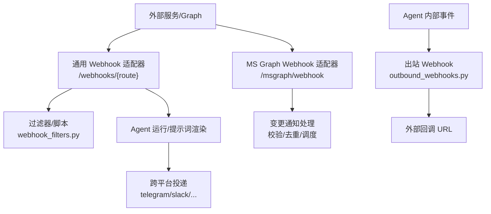
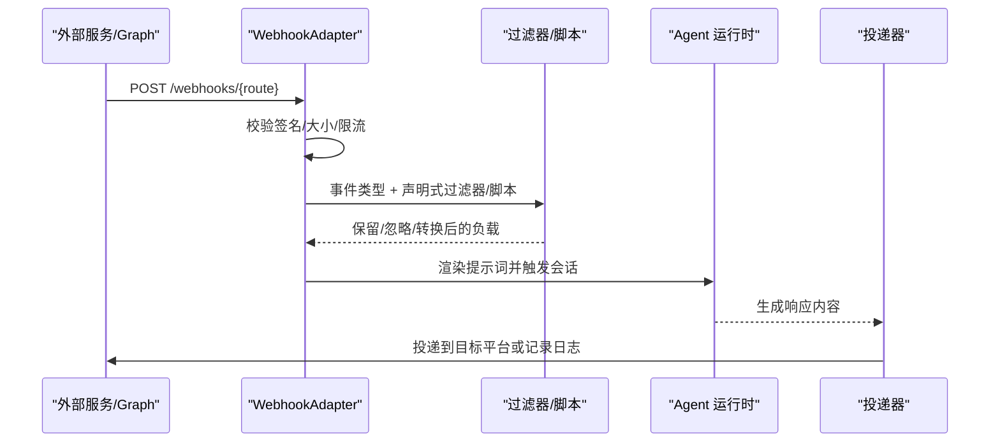
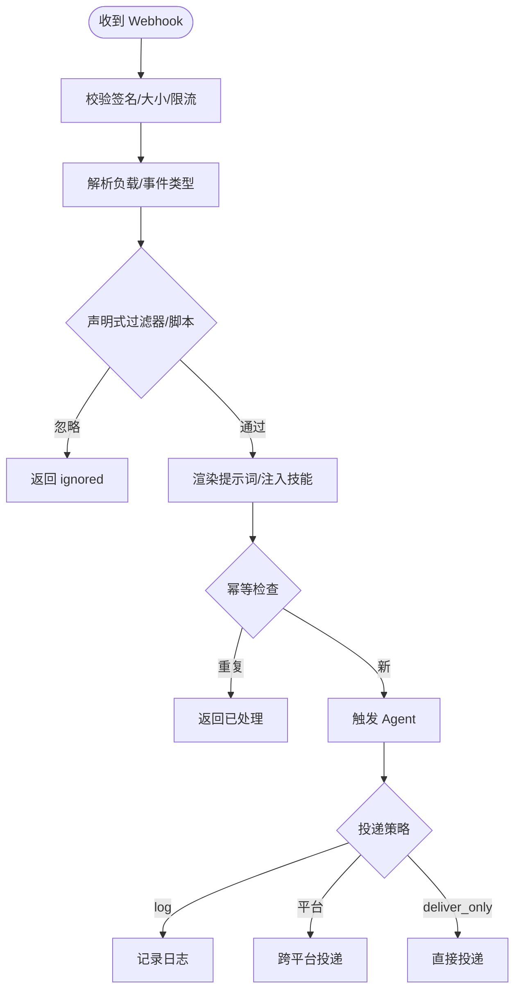
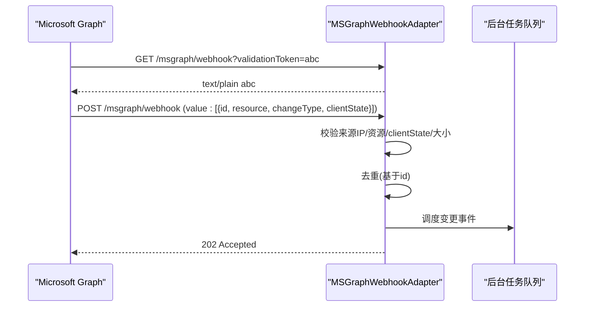
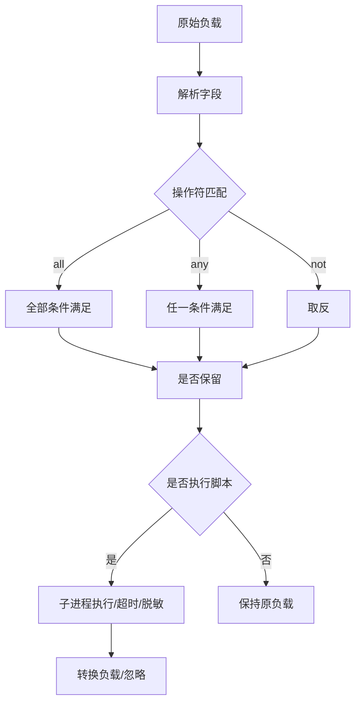
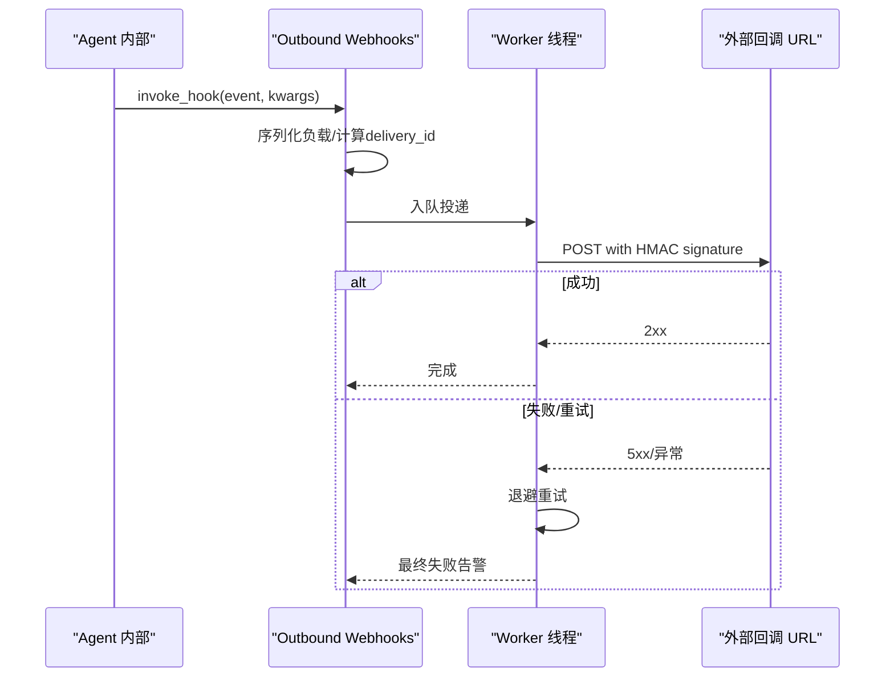
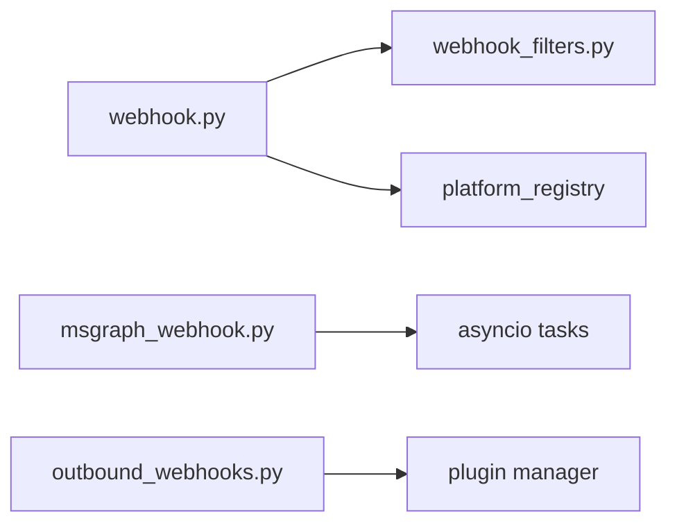

# Webhook 平台

<cite>
**本文引用的文件**
- [gateway/platforms/webhook.py](file://gateway/platforms/webhook.py)
- [gateway/platforms/msgraph_webhook.py](file://gateway/platforms/msgraph_webhook.py)
- [gateway/platforms/webhook_filters.py](file://gateway/platforms/webhook_filters.py)
- [agent/outbound_webhooks.py](file://agent/outbound_webhooks.py)
- [tests/gateway/test_webhook_adapter.py](file://tests/gateway/test_webhook_adapter.py)
- [tests/gateway/test_msgraph_webhook.py](file://tests/gateway/test_msgraph_webhook.py)
</cite>

## 目录
1. [简介](#简介)
2. [项目结构](#项目结构)
3. [核心组件](#核心组件)
4. [架构总览](#架构总览)
5. [详细组件分析](#详细组件分析)
6. [依赖关系分析](#依赖关系分析)
7. [性能考量](#性能考量)
8. [故障排查指南](#故障排查指南)
9. [结论](#结论)
10. [附录](#附录)

## 简介
本仓库实现了完整的 Webhook 平台，包含：
- 通用 Webhook 适配器：接收外部服务（GitHub、GitLab、JIRA、Stripe 等）的 HTTP POST，进行 HMAC 签名校验、事件过滤、模板渲染为 Agent 提示词，并将响应投递到目标平台或仅记录日志。
- Microsoft Graph Webhook 集成：提供订阅验证握手与变更通知处理，支持资源白名单、客户端状态校验、去重与异步调度。
- 出站 Webhook：将 Agent 生命周期事件以带签名的 HTTP POST 推送到外部系统，具备重试与超时控制。
- 安全与可靠性：HMAC 签名、速率限制、幂等缓存、请求体大小限制、脚本执行隔离与超时、错误码与告警。
- 可扩展性：声明式过滤器、可选脚本转换、动态路由热加载、多 Profile 复用。

## 项目结构
Webhook 相关代码主要分布在以下模块：
- 通用入站 Webhook 适配器：gateway/platforms/webhook.py
- Microsoft Graph Webhook 适配器：gateway/platforms/msgraph_webhook.py
- 路由级过滤器与脚本转换：gateway/platforms/webhook_filters.py
- 出站 Webhook 通知：agent/outbound_webhooks.py
- 测试用例：tests/gateway/test_webhook_adapter.py、tests/gateway/test_msgraph_webhook.py

图表来源
- [gateway/platforms/webhook.py:177-344](file://gateway/platforms/webhook.py#L177-L344)
- [gateway/platforms/msgraph_webhook.py:52-185](file://gateway/platforms/msgraph_webhook.py#L52-L185)
- [gateway/platforms/webhook_filters.py:94-303](file://gateway/platforms/webhook_filters.py#L94-L303)
- [agent/outbound_webhooks.py:156-207](file://agent/outbound_webhooks.py#L156-L207)

章节来源
- [gateway/platforms/webhook.py:1-344](file://gateway/platforms/webhook.py#L1-L344)
- [gateway/platforms/msgraph_webhook.py:1-185](file://gateway/platforms/msgraph_webhook.py#L1-L185)
- [gateway/platforms/webhook_filters.py:1-303](file://gateway/platforms/webhook_filters.py#L1-L303)
- [agent/outbound_webhooks.py:1-207](file://agent/outbound_webhooks.py#L1-L207)

## 核心组件
- 通用 Webhook 适配器（WebhookAdapter）
  - 启动 aiohttp 服务器，暴露 /health 与 /webhooks/{route_name}，支持 /p/{profile}/webhooks/{route_name} 多 Profile 复用。
  - 启动时校验每条路由的 HMAC 密钥；支持 INSECURE_NO_AUTH 仅用于本地回环绑定。
  - 请求路径：鉴权 -> 限流 -> 解析负载 -> 事件类型过滤 -> 声明式过滤器/脚本转换 -> 模板渲染 -> 技能注入 -> 构建交付 ID -> 幂等检查 -> 触发 Agent -> 投递响应。
  - 支持 deliver_only 模式直接投递，跳过 Agent 推理，适用于监控告警等低延迟场景。
  - 内置多种签名兼容：GitHub/GitLab/Svix/V2 时间戳绑定签名。
- Microsoft Graph Webhook 适配器（MSGraphWebhookAdapter）
  - 暴露 /msgraph/webhook 与 /health，支持 GET 验证令牌回显。
  - 严格校验 clientState、资源白名单、来源 CIDR 白名单、请求体大小。
  - 对重复通知基于 id 去重，异步调度消息事件。
- 路由过滤器与脚本转换（WebhookRouteProcessor）
  - 支持 all/any/not 组合、exists/missing/equals/not_equals/contains/in/in_file/regex 等操作符。
  - 支持在 HERMES_HOME/scripts 下执行脚本，JSON 输入输出，超时保护，敏感信息脱敏。
- 出站 Webhook（Outbound Webhooks）
  - 从配置 hooks.outbound 注册事件回调，使用队列+单线程 worker 发送。
  - 每个投递携带 HMAC-SHA256 签名头，支持超时、最多两次重试、拒绝 3xx 重定向。

章节来源
- [gateway/platforms/webhook.py:177-800](file://gateway/platforms/webhook.py#L177-L800)
- [gateway/platforms/msgraph_webhook.py:52-454](file://gateway/platforms/msgraph_webhook.py#L52-L454)
- [gateway/platforms/webhook_filters.py:94-303](file://gateway/platforms/webhook_filters.py#L94-L303)
- [agent/outbound_webhooks.py:112-207](file://agent/outbound_webhooks.py#L112-L207)

## 架构总览

图表来源
- [gateway/platforms/webhook.py:584-800](file://gateway/platforms/webhook.py#L584-L800)
- [gateway/platforms/webhook_filters.py:208-303](file://gateway/platforms/webhook_filters.py#L208-L303)
- [agent/outbound_webhooks.py:380-455](file://agent/outbound_webhooks.py#L380-L455)

## 详细组件分析

### 通用 Webhook 适配器（WebhookAdapter）
- 生命周期
  - connect：加载动态订阅、校验路由密钥与安全绑定、创建 aiohttp 应用与路由、启动 TCPSite。
  - disconnect：清理 runner 并标记断开。
- 安全与防护
  - HMAC 签名校验：支持 GitHub/GitLab/Svix/V2 时间戳绑定签名；非 ASCII 头部安全比较。
  - 请求体大小限制：Content-Length 与实际读取双重校验。
  - 速率限制：固定窗口 per-route，默认每分钟 30 次。
  - 幂等缓存：基于 delivery_id 的 TTL 去重，防止重复执行。
  - 安全逃逸开关：INSECURE_NO_AUTH 仅在回环主机允许。
- 事件路由与处理
  - 事件类型过滤：优先读取 X-GitHub-Event/X-GitLab-Event，其次 payload.event_type/type。
  - 声明式过滤器：all/any/not 组合，字段解析支持 payload/event/headers 上下文。
  - 脚本转换：在独立进程执行，超时保护，输出 JSON 或文本，支持 [SILENT] 抑制。
  - 提示词渲染：按模板变量替换，可注入技能调用。
  - 投递策略：deliver=log/telegram/discord/slack/github_comment/其他平台；deliver_only 直接投递。
- 多 Profile 复用
  - 支持 /p/{profile}/webhooks/{route}，需开启 multiplex_profiles，且 profile 必须受管。

图表来源
- [gateway/platforms/webhook.py:584-800](file://gateway/platforms/webhook.py#L584-L800)
- [gateway/platforms/webhook_filters.py:208-303](file://gateway/platforms/webhook_filters.py#L208-L303)

章节来源
- [gateway/platforms/webhook.py:177-800](file://gateway/platforms/webhook.py#L177-L800)
- [tests/gateway/test_webhook_adapter.py:1-200](file://tests/gateway/test_webhook_adapter.py#L1-L200)

### Microsoft Graph Webhook 适配器（MSGraphWebhookAdapter）
- 订阅验证
  - GET /msgraph/webhook?validationToken=xxx：原样返回 token 文本，供 Graph 验证端点。
- 变更通知处理
  - POST 接收 value 数组，逐项校验：
    - 来源 IP CIDR 白名单（网络可达时必须配置）。
    - 资源白名单（支持前缀匹配）。
    - clientState 一致性（时序安全比较）。
    - 请求体大小限制。
  - 去重：基于 notification.id 维护最近 N 条 receipt 集合。
  - 异步调度：将变更转换为 MessageEvent，交由后台任务处理。
- 健康检查
  - /health 返回接受计数与重复计数，便于监控。

图表来源
- [gateway/platforms/msgraph_webhook.py:219-314](file://gateway/platforms/msgraph_webhook.py#L219-L314)
- [gateway/platforms/msgraph_webhook.py:385-454](file://gateway/platforms/msgraph_webhook.py#L385-L454)

章节来源
- [gateway/platforms/msgraph_webhook.py:52-454](file://gateway/platforms/msgraph_webhook.py#L52-L454)
- [tests/gateway/test_msgraph_webhook.py:1-200](file://tests/gateway/test_msgraph_webhook.py#L1-L200)

### 路由过滤器与脚本转换（WebhookRouteProcessor）
- 字段解析
  - 支持 payload.payload/payload.field、event、headers 等上下文访问。
- 操作符
  - exists/missing/equals/not_equals/contains/in/in_file/regex。
  - 逻辑组合 all/any/not。
- 脚本执行
  - 路径必须在 HERMES_HOME/scripts 下，支持 .sh/.bash 与 Python。
  - 超时保护、子进程环境隔离、输出脱敏。
  - 返回 JSON 对象或文本；[SILENT] 或 __hermes_ignore__ 表示忽略。

图表来源
- [gateway/platforms/webhook_filters.py:104-226](file://gateway/platforms/webhook_filters.py#L104-L226)
- [gateway/platforms/webhook_filters.py:228-303](file://gateway/platforms/webhook_filters.py#L228-L303)

章节来源
- [gateway/platforms/webhook_filters.py:1-303](file://gateway/platforms/webhook_filters.py#L1-L303)

### 出站 Webhook（Outbound Webhooks）
- 配置与注册
  - hooks.outbound 列表，每项包含 url/events/secret_env/secret/matcher/timeout/name。
  - 注册到插件管理器的事件钩子，支持工具级 matcher（pre_tool_call/post_tool_call）。
- 投递机制
  - 队列+单线程 worker，避免阻塞 Agent 主循环。
  - 每个投递携带 HMAC-SHA256 签名头（X-Hermes-Signature-256），支持超时与最多两次重试。
  - 拒绝 3xx 重定向，4xx 不重试，5xx 重试。
- 安全与健壮性
  - 明文 http:// 警告，推荐 https。
  - 队列满时丢弃并告警。
  - 进程退出时尝试 flush 队列。

图表来源
- [agent/outbound_webhooks.py:380-570](file://agent/outbound_webhooks.py#L380-L570)

章节来源
- [agent/outbound_webhooks.py:1-570](file://agent/outbound_webhooks.py#L1-L570)

## 依赖关系分析
- 通用 Webhook 适配器依赖：
  - aiohttp 提供 HTTP 服务器能力。
  - webhook_filters 提供声明式过滤器与脚本执行。
  - 平台注册表用于跨平台投递。
- MS Graph Webhook 适配器依赖：
  - aiohttp、ipaddress 用于来源 CIDR 校验。
  - 后台任务队列用于异步调度。
- 出站 Webhook 依赖：
  - urllib.request 发送 HTTP POST，自定义处理器拒绝重定向。
  - 插件管理器注册事件回调。

图表来源
- [gateway/platforms/webhook.py:385-397](file://gateway/platforms/webhook.py#L385-L397)
- [gateway/platforms/msgraph_webhook.py:437-454](file://gateway/platforms/msgraph_webhook.py#L437-L454)
- [agent/outbound_webhooks.py:182-207](file://agent/outbound_webhooks.py#L182-L207)

章节来源
- [gateway/platforms/webhook.py:385-397](file://gateway/platforms/webhook.py#L385-L397)
- [gateway/platforms/msgraph_webhook.py:437-454](file://gateway/platforms/msgraph_webhook.py#L437-L454)
- [agent/outbound_webhooks.py:182-207](file://agent/outbound_webhooks.py#L182-L207)

## 性能考量
- 通用 Webhook 适配器
  - 速率限制：固定窗口 deque 实现，内存占用与 rate_limit 成正比。
  - 幂等缓存：TTL 定期清理，避免无限增长。
  - 脚本执行：在独立线程中运行，避免阻塞事件循环；超时保护。
  - 多 Profile 复用：减少重复监听端口与路由开销。
- MS Graph Webhook 适配器
  - 去重集合：最大 N 条 receipt，超出则淘汰最旧项。
  - 异步调度：后台任务处理变更，避免同步阻塞。
- 出站 Webhook
  - 队列容量有限，满时丢弃并告警，保证主流程不受影响。
  - 单次投递最多重试两次，退避间隔短，降低延迟。

[本节为通用指导，无需具体文件引用]

## 故障排查指南
- 签名校验失败
  - 确认路由 secret 与发送方一致；V2 签名需包含正确时间戳。
  - 非 ASCII 签名头会被安全拒绝，不会崩溃。
  - 参考：[gateway/platforms/webhook.py:158-170](file://gateway/platforms/webhook.py#L158-L170)、[tests/gateway/test_webhook_adapter.py:134-177](file://tests/gateway/test_webhook_adapter.py#L134-L177)
- 请求体过大
  - Content-Length 与实际读取均会限制；超过阈值返回 413。
  - 参考：[gateway/platforms/webhook.py:626-651](file://gateway/platforms/webhook.py#L626-L651)、[gateway/platforms/msgraph_webhook.py:245-257](file://gateway/platforms/msgraph_webhook.py#L245-L257)
- 速率限制触发
  - 同一 route 在窗口内超限返回 429；调整 rate_limit 或优化发送频率。
  - 参考：[gateway/platforms/webhook.py:436-449](file://gateway/platforms/webhook.py#L436-L449)
- 幂等重复
  - 相同 delivery_id 在 TTL 内被忽略；确保上游提供唯一 ID（如 GitHub Delivery、Svix ID）。
  - 参考：[gateway/platforms/webhook.py:451-461](file://gateway/platforms/webhook.py#L451-L461)
- MS Graph 验证失败
  - GET 必须返回 validationToken；POST 必须包含有效 clientState 与资源白名单匹配。
  - 参考：[gateway/platforms/msgraph_webhook.py:219-233](file://gateway/platforms/msgraph_webhook.py#L219-L233)、[gateway/platforms/msgraph_webhook.py:356-373](file://gateway/platforms/msgraph_webhook.py#L356-L373)
- 出站投递失败
  - 4xx 不重试，5xx 重试两次；3xx 重定向被拒绝；队列满丢弃。
  - 参考：[agent/outbound_webhooks.py:520-570](file://agent/outbound_webhooks.py#L520-L570)

章节来源
- [gateway/platforms/webhook.py:158-170](file://gateway/platforms/webhook.py#L158-L170)
- [gateway/platforms/webhook.py:436-461](file://gateway/platforms/webhook.py#L436-L461)
- [gateway/platforms/webhook.py:626-651](file://gateway/platforms/webhook.py#L626-L651)
- [gateway/platforms/msgraph_webhook.py:219-233](file://gateway/platforms/msgraph_webhook.py#L219-L233)
- [gateway/platforms/msgraph_webhook.py:356-373](file://gateway/platforms/msgraph_webhook.py#L356-L373)
- [agent/outbound_webhooks.py:520-570](file://agent/outbound_webhooks.py#L520-L570)
- [tests/gateway/test_webhook_adapter.py:134-177](file://tests/gateway/test_webhook_adapter.py#L134-L177)
- [tests/gateway/test_msgraph_webhook.py:92-188](file://tests/gateway/test_msgraph_webhook.py#L92-L188)

## 结论
该 Webhook 平台提供了高安全、高可靠、可扩展的入站与出站事件处理能力：
- 通用适配器支持多源事件、灵活过滤与脚本转换，适合复杂业务编排。
- MS Graph 适配器严格遵循 Graph 协议，保障订阅验证与变更通知的安全与效率。
- 出站 Webhook 将 Agent 行为外发至 CI/监控/其他系统，具备签名与重试保障。
- 通过速率限制、幂等、大小限制、脚本超时与来源白名单等多层防护，确保生产可用性。

[本节为总结，无需具体文件引用]

## 附录

### 自定义 Webhook 开发指南与最佳实践
- 定义路由与密钥
  - 在 platforms.webhook.extra.routes 中配置 route，设置 secret 与 events。
  - 使用 INSECURE_NO_AUTH 仅限本地回环调试，禁止公网暴露。
  - 参考：[gateway/platforms/webhook.py:248-285](file://gateway/platforms/webhook.py#L248-L285)
- 编写过滤器与脚本
  - 使用 all/any/not 组合复杂条件；利用 in_file 加载外部白名单。
  - 脚本置于 HERMES_HOME/scripts，输出 JSON 或 [SILENT] 忽略。
  - 参考：[gateway/platforms/webhook_filters.py:141-226](file://gateway/platforms/webhook_filters.py#L141-L226)、[gateway/platforms/webhook_filters.py:228-303](file://gateway/platforms/webhook_filters.py#L228-L303)
- 模板与技能注入
  - 使用 prompt 模板渲染 payload 字段；可通过 skills 注入技能调用。
  - 参考：[gateway/platforms/webhook.py:758-791](file://gateway/platforms/webhook.py#L758-L791)
- 投递策略
  - deliver=log 仅记录；deliver=平台名跨平台投递；deliver_only 直接推送。
  - 参考：[gateway/platforms/webhook.py:353-402](file://gateway/platforms/webhook.py#L353-L402)
- MS Graph 订阅管理
  - 配置 client_state、accepted_resources、allowed_source_cidrs。
  - 验证端点返回 validationToken；变更通知经去重后异步处理。
  - 参考：[gateway/platforms/msgraph_webhook.py:153-185](file://gateway/platforms/msgraph_webhook.py#L153-L185)、[gateway/platforms/msgraph_webhook.py:336-373](file://gateway/platforms/msgraph_webhook.py#L336-L373)
- 出站 Webhook 配置
  - 在 hooks.outbound 配置 url/events/secret_env/secret/matcher/timeout。
  - 注意 http:// 不安全，建议使用 https；队列满会丢弃并告警。
  - 参考：[agent/outbound_webhooks.py:250-355](file://agent/outbound_webhooks.py#L250-L355)、[agent/outbound_webhooks.py:520-570](file://agent/outbound_webhooks.py#L520-L570)

章节来源
- [gateway/platforms/webhook.py:248-402](file://gateway/platforms/webhook.py#L248-L402)
- [gateway/platforms/webhook_filters.py:141-303](file://gateway/platforms/webhook_filters.py#L141-L303)
- [gateway/platforms/msgraph_webhook.py:153-373](file://gateway/platforms/msgraph_webhook.py#L153-L373)
- [agent/outbound_webhooks.py:250-570](file://agent/outbound_webhooks.py#L250-L570)