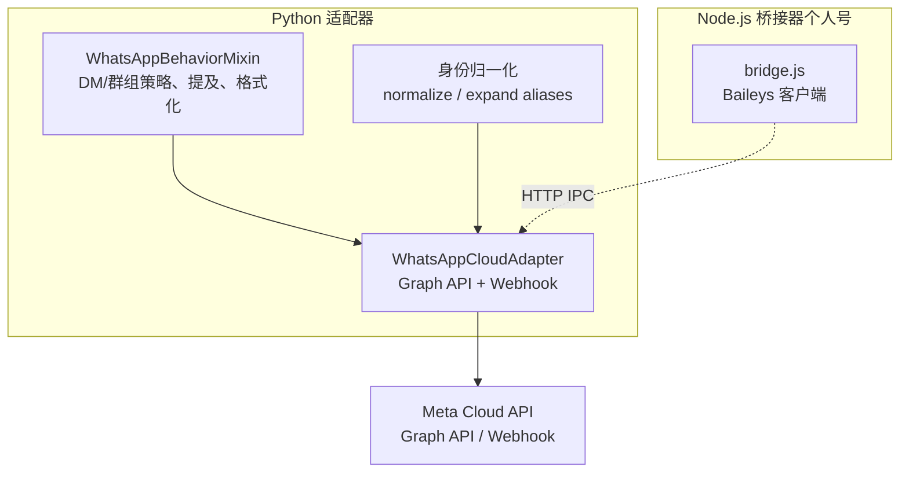
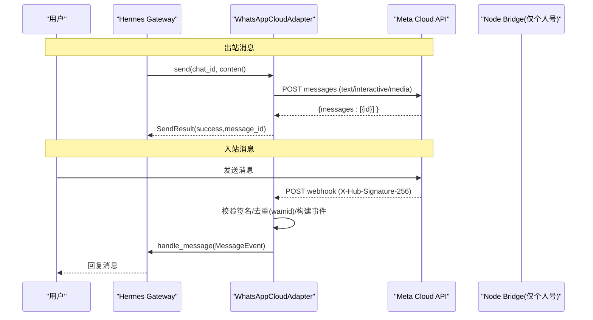
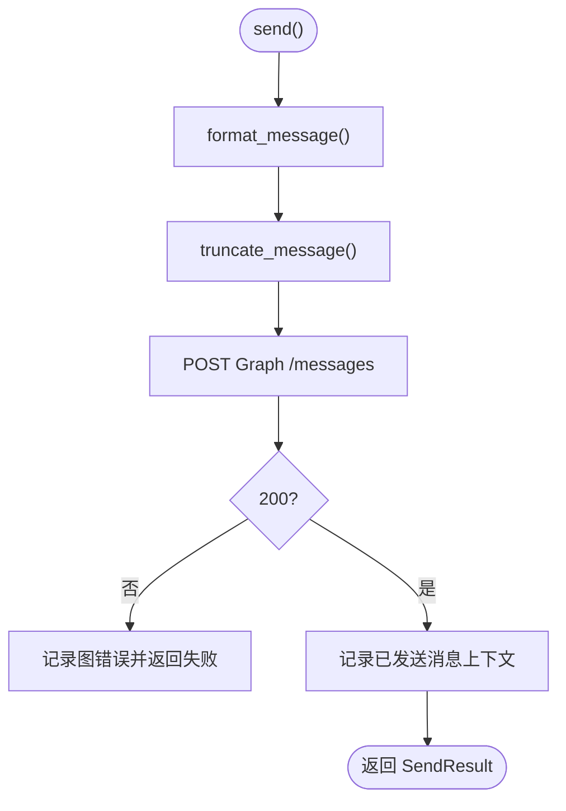
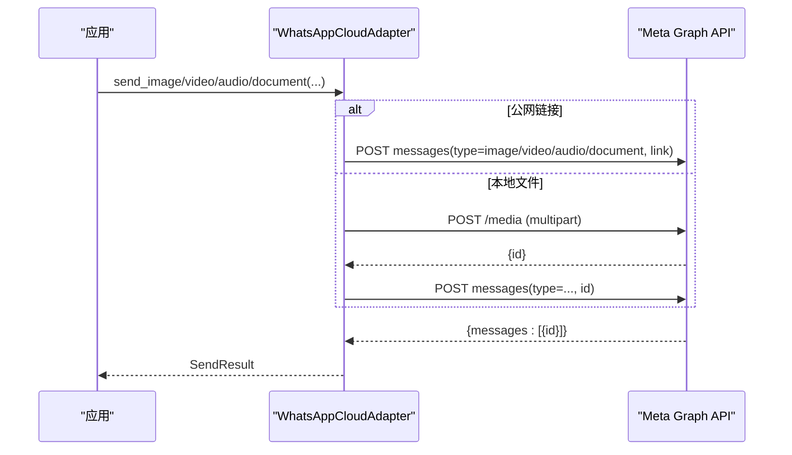
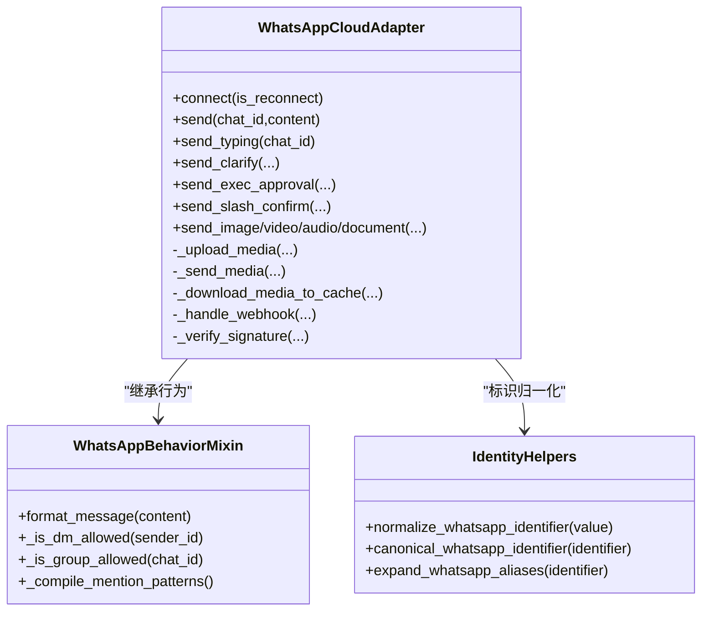

# WhatsApp 集成

<cite>
**本文引用的文件**
- [whatsapp_cloud.py](file://gateway/platforms/whatsapp_cloud.py)
- [whatsapp_common.py](file://gateway/platforms/whatsapp_common.py)
- [whatsapp_identity.py](file://gateway/whatsapp_identity.py)
- [setup_whatsapp_cloud.py](file://hermes_cli/setup_whatsapp_cloud.py)
- [adapter.py](file://plugins/platforms/whatsapp/adapter.py)
- [bridge.js](file://scripts/whatsapp-bridge/bridge.js)
</cite>

## 目录
1. [简介](#简介)
2. [项目结构](#项目结构)
3. [核心组件](#核心组件)
4. [架构总览](#架构总览)
5. [详细组件分析](#详细组件分析)
6. [依赖关系分析](#依赖关系分析)
7. [性能与容量规划](#性能与容量规划)
8. [故障排查指南](#故障排查指南)
9. [结论](#结论)
10. [附录：配置与常见问题](#附录配置与常见问题)

## 简介
本文件面向使用 WhatsApp Cloud API（Meta 官方商业平台）与 Hermes Agent 集成的用户与运维人员，系统性说明认证机制、消息收发流程、媒体处理（图片/视频/音频/文档）、会话与群组策略、状态同步、错误处理、连接池与速率限制、重试与恢复策略，并提供可操作的配置示例与常见问题解决方案。

## 项目结构
WhatsApp 集成由两部分组成：
- Python 侧适配器：负责与 Meta Graph API 交互、Webhook 接收与校验、消息格式化与发送、媒体上传/下载、状态指示等。
- Node.js 侧桥接器（可选）：用于个人号场景（Baileys），通过 HTTP 与 Python 适配器通信；Cloud API 路径不依赖该桥接器。

图表来源
- [whatsapp_cloud.py:203-495](file://gateway/platforms/whatsapp_cloud.py#L203-L495)
- [whatsapp_common.py:64-126](file://gateway/platforms/whatsapp_common.py#L64-L126)
- [whatsapp_identity.py:48-120](file://gateway/whatsapp_identity.py#L48-L120)
- [bridge.js:1-20](file://scripts/whatsapp-bridge/bridge.js#L1-L20)

章节来源
- [whatsapp_cloud.py:203-495](file://gateway/platforms/whatsapp_cloud.py#L203-L495)
- [whatsapp_common.py:64-126](file://gateway/platforms/whatsapp_common.py#L64-L126)
- [whatsapp_identity.py:48-120](file://gateway/whatsapp_identity.py#L48-L120)
- [bridge.js:1-20](file://scripts/whatsapp-bridge/bridge.js#L1-L20)

## 核心组件
- WhatsAppCloudAdapter：实现 Cloud API 的接入层，包括连接生命周期、文本与媒体发送、typing/read 指示、交互式消息（按钮/列表）、入站 Webhook 校验与分发、媒体下载缓存。
- WhatsAppBehaviorMixin：跨传输共享的行为层，提供 DM/群组策略、白名单匹配、@提及检测、Markdown→WhatsApp 格式转换、消息分块等。
- whatsapp_identity：统一归一化与扩展 WhatsApp 标识（phone/LID/JID），确保授权与会话键一致。
- setup_whatsapp_cloud：交互式向导，帮助生成 verify token、校验并保存必要凭据，输出后续配置步骤。
- 插件侧 WhatsAppAdapter（个人号）：通过 Node.js 桥接器（bridge.js）管理会话、收发消息与媒体；与 Cloud API 路径并存但独立。

章节来源
- [whatsapp_cloud.py:203-495](file://gateway/platforms/whatsapp_cloud.py#L203-L495)
- [whatsapp_common.py:64-126](file://gateway/platforms/whatsapp_common.py#L64-L126)
- [whatsapp_identity.py:48-120](file://gateway/whatsapp_identity.py#L48-L120)
- [setup_whatsapp_cloud.py:232-542](file://hermes_cli/setup_whatsapp_cloud.py#L232-L542)
- [adapter.py:381-800](file://plugins/platforms/whatsapp/adapter.py#L381-L800)

## 架构总览
下图展示 Cloud API 路径的端到端数据流：出站通过 Graph API 发送，入站通过 Webhook 回调到本地 aiohttp 服务，经 HMAC 校验后分发至网关。

图表来源
- [whatsapp_cloud.py:513-589](file://gateway/platforms/whatsapp_cloud.py#L513-L589)
- [whatsapp_cloud.py:1457-1522](file://gateway/platforms/whatsapp_cloud.py#L1457-L1522)
- [whatsapp_cloud.py:1571-1599](file://gateway/platforms/whatsapp_cloud.py#L1571-L1599)

章节来源
- [whatsapp_cloud.py:513-589](file://gateway/platforms/whatsapp_cloud.py#L513-L589)
- [whatsapp_cloud.py:1457-1522](file://gateway/platforms/whatsapp_cloud.py#L1457-L1522)
- [whatsapp_cloud.py:1571-1599](file://gateway/platforms/whatsapp_cloud.py#L1571-L1599)

## 详细组件分析

### 认证与安全
- 必需环境变量
  - WHATSAPP_CLOUD_PHONE_NUMBER_ID：Meta 内部编号（非手机号）
  - WHATSAPP_CLOUD_ACCESS_TOKEN：系统用户永久令牌或临时令牌（以 EAA 开头）
- 安全增强（Phase 3+）
  - WHATSAPP_CLOUD_APP_SECRET：用于 X-Hub-Signature-256 的 HMAC 密钥，未设置时拒绝入站 POST
  - WHATSAPP_CLOUD_VERIFY_TOKEN：订阅验证握手用，未设置时 GET 验证返回 503
- 校验流程
  - 读取原始请求体（不超过 3MB）
  - 计算 HMAC 并与 X-Hub-Signature-256 常量时间比较
  - 解析 JSON 后遍历 entry/changes/value 进行分发

章节来源
- [whatsapp_cloud.py:217-246](file://gateway/platforms/whatsapp_cloud.py#L217-L246)
- [whatsapp_cloud.py:435-495](file://gateway/platforms/whatsapp_cloud.py#L435-L495)
- [whatsapp_cloud.py:1457-1522](file://gateway/platforms/whatsapp_cloud.py#L1457-L1522)
- [whatsapp_cloud.py:1525-1548](file://gateway/platforms/whatsapp_cloud.py#L1525-L1548)

### 消息发送流程（文本与交互式）
- 文本发送
  - 格式化 Markdown → 分块 → POST Graph API /messages
  - 记录 rich_sent_store 以便回引用上下文
- 交互式消息
  - 澄清/审批/确认等通过 interactive.button/list 发送
  - 维护短期状态映射（clarify/approval/slash_confirm）用于入站按钮点击路由
- typing/read 指示
  - 调用 /messages 携带 status=read 与 typing_indicator
  - 基于最近入站 wamid 缓存，失败静默不影响主流程

图表来源
- [whatsapp_cloud.py:513-589](file://gateway/platforms/whatsapp_cloud.py#L513-L589)
- [whatsapp_cloud.py:607-660](file://gateway/platforms/whatsapp_cloud.py#L607-L660)
- [whatsapp_cloud.py:678-735](file://gateway/platforms/whatsapp_cloud.py#L678-L735)

章节来源
- [whatsapp_cloud.py:513-589](file://gateway/platforms/whatsapp_cloud.py#L513-L589)
- [whatsapp_cloud.py:607-660](file://gateway/platforms/whatsapp_cloud.py#L607-L660)
- [whatsapp_cloud.py:678-735](file://gateway/platforms/whatsapp_cloud.py#L678-L735)

### 媒体处理（图片/视频/音频/文档）
- 上传与发送
  - 本地文件：两步上传（GET /media 获取临时 URL → 下载 → 写入缓存）
  - 公网链接：直接 link 模式发送（减少一次往返）
  - 大小限制：image 5MB、video/audio 16MB、document 100MB、sticker 100KB/500KB
- 语音消息
  - 优先将 MP3 转码为 opus（audio/ogg; codecs=opus）以获得原生语音气泡
  - ffmpeg 不可用时降级为普通音频附件
- 入站媒体
  - 通过 Graph media endpoint 下载并缓存到 hermes 目录
  - 根据 mime 类型选择扩展名，未知类型使用 .bin

图表来源
- [whatsapp_cloud.py:970-1148](file://gateway/platforms/whatsapp_cloud.py#L970-L1148)
- [whatsapp_cloud.py:1150-1260](file://gateway/platforms/whatsapp_cloud.py#L1150-L1260)
- [whatsapp_cloud.py:1263-1311](file://gateway/platforms/whatsapp_cloud.py#L1263-L1311)
- [whatsapp_cloud.py:1314-1406](file://gateway/platforms/whatsapp_cloud.py#L1314-L1406)

章节来源
- [whatsapp_cloud.py:970-1148](file://gateway/platforms/whatsapp_cloud.py#L970-L1148)
- [whatsapp_cloud.py:1150-1260](file://gateway/platforms/whatsapp_cloud.py#L1150-L1260)
- [whatsapp_cloud.py:1263-1311](file://gateway/platforms/whatsapp_cloud.py#L1263-L1311)
- [whatsapp_cloud.py:1314-1406](file://gateway/platforms/whatsapp_cloud.py#L1314-L1406)

### 会话管理与群组支持
- DM 策略
  - open/allowlist/disabled/pairing（个人号默认 pairing；Cloud API 默认 open，可通过环境变量开启 allow-all）
  - 白名单支持 phone/LID/JID 多形态匹配，动态刷新（env/config 优先级）
- 群组策略
  - open/allowlist/disabled/pairing；支持 free_response_chats 免提及放行
- 提及与过滤
  - 支持 @提及、正则提及模式、广播/频道/状态更新过滤
- 会话键一致性
  - 通过 normalize/expand canonical 工具保证 phone/LID 变体一致

章节来源
- [whatsapp_common.py:127-177](file://gateway/platforms/whatsapp_common.py#L127-L177)
- [whatsapp_common.py:210-289](file://gateway/platforms/whatsapp_common.py#L210-L289)
- [whatsapp_common.py:390-423](file://gateway/platforms/whatsapp_common.py#L390-L423)
- [whatsapp_identity.py:48-120](file://gateway/whatsapp_identity.py#L48-L120)
- [whatsapp_identity.py:121-207](file://gateway/whatsapp_identity.py#L121-L207)

### 状态同步与回执
- typing/read 指示
  - 通过 /messages 同时标记 read 与显示 typing 指示
  - 基于最近入站 wamid 缓存；若 wamid 过期（>30天）会收到特定错误码并记录
- 已读回执（个人号桥接）
  - 通过环境变量控制是否发送已读回执；桥接健康检查暴露 sendReadReceipts 配置

章节来源
- [whatsapp_cloud.py:607-660](file://gateway/platforms/whatsapp_cloud.py#L607-L660)
- [adapter.py:453-457](file://plugins/platforms/whatsapp/adapter.py#L453-L457)
- [bridge.js:81-85](file://scripts/whatsapp-bridge/bridge.js#L81-L85)

### 错误处理与重试
- 入站 Webhook
  - 负载过大返回 413；缺少 app_secret 返回 503；签名无效返回 401；JSON 非法返回 400
- 出站 Graph API
  - 结构化错误提取（code/message/fbtrace_id）并记录；非 200 返回失败
- 重试与恢复
  - 适配器 connect() 接受 is_reconnect 参数，网关重连监视器在每次重试时传递
  - 个人号桥接具备指数退避重连调度（断开原因区分 515 重启与其他错误）

章节来源
- [whatsapp_cloud.py:1457-1522](file://gateway/platforms/whatsapp_cloud.py#L1457-L1522)
- [whatsapp_cloud.py:951-960](file://gateway/platforms/whatsapp_cloud.py#L951-L960)
- [tests/gateway/test_adapter_connect_is_reconnect_contract.py:1-145](file://tests/gateway/test_adapter_connect_is_reconnect_contract.py#L1-L145)
- [bridge.js:437-458](file://scripts/whatsapp-bridge/bridge.js#L437-L458)

### 连接池、速率限制与超时
- 出站 HTTP 客户端
  - 使用 httpx.AsyncClient，带 30s 超时与平台级连接限制（keepalive 优化，避免 CLOSE_WAIT 堆积）
- 入站 Webhook
  - aiohttp Application 设置 client_max_size 限制请求体大小
- 发送限流
  - 文本分块发送；个人号桥接对 sendMessage 串行化队列，避免并发导致错乱
- 超时保护
  - 桥接发送带超时（SEND_TIMEOUT_MS），防止上游阻塞

章节来源
- [whatsapp_cloud.py:453-459](file://gateway/platforms/whatsapp_cloud.py#L453-L459)
- [whatsapp_cloud.py:465-468](file://gateway/platforms/whatsapp_cloud.py#L465-L468)
- [bridge.js:128-157](file://scripts/whatsapp-bridge/bridge.js#L128-L157)
- [bridge.js:121-126](file://scripts/whatsapp-bridge/bridge.js#L121-L126)

## 依赖关系分析

图表来源
- [whatsapp_cloud.py:203-495](file://gateway/platforms/whatsapp_cloud.py#L203-L495)
- [whatsapp_common.py:64-126](file://gateway/platforms/whatsapp_common.py#L64-L126)
- [whatsapp_identity.py:48-120](file://gateway/whatsapp_identity.py#L48-L120)
- [whatsapp_identity.py:121-207](file://gateway/whatsapp_identity.py#L121-L207)

章节来源
- [whatsapp_cloud.py:203-495](file://gateway/platforms/whatsapp_cloud.py#L203-L495)
- [whatsapp_common.py:64-126](file://gateway/platforms/whatsapp_common.py#L64-L126)
- [whatsapp_identity.py:48-120](file://gateway/whatsapp_identity.py#L48-L120)
- [whatsapp_identity.py:121-207](file://gateway/whatsapp_identity.py#L121-L207)

## 性能与容量规划
- 入站去重
  - wamid 内存去重表（FIFO 淘汰，上限 5000），降低重复投递影响
- 媒体缓存
  - 入站媒体按 media_id 命名落盘，避免重复下载；语音转码产物自动清理
- 消息分块
  - 长消息按 MAX_MESSAGE_LENGTH 切分，预留前缀空间，保障移动端可读性
- 并发与队列
  - 个人号桥接对发送串行化，避免跨聊天污染；消息队列有上限保护
- 资源限制
  - Webhook 最大负载 3MB；Graph API 各媒体类型有严格大小上限

章节来源
- [whatsapp_cloud.py:98-118](file://gateway/platforms/whatsapp_cloud.py#L98-L118)
- [whatsapp_cloud.py:1551-1569](file://gateway/platforms/whatsapp_cloud.py#L1551-L1569)
- [whatsapp_cloud.py:1396-1406](file://gateway/platforms/whatsapp_cloud.py#L1396-L1406)
- [bridge.js:270-283](file://scripts/whatsapp-bridge/bridge.js#L270-L283)

## 故障排查指南
- 无法接收消息
  - 检查 WHATSAPP_CLOUD_APP_SECRET 是否设置；未设置则 POST 返回 503
  - 检查 Webhook 回调地址是否正确指向 /whatsapp/webhook
  - 查看健康端点 /health 中 verify_token_configured 与 app_secret_configured
- 订阅验证失败
  - 确保 WHATSAPP_CLOUD_VERIFY_TOKEN 已设置且与 Meta 配置一致
  - GET 验证必须返回 challenge 原文
- 发送失败
  - 关注 Graph API 返回的错误码与消息（如 131009 表示 wamid 过期）
  - 媒体发送需满足大小限制；本地文件需存在且可访问
- 语音无波形气泡
  - 安装 ffmpeg 以启用 opus 转码；否则降级为音频附件
- 个人号桥接异常
  - 检查 Node.js 环境、依赖安装日志、端口占用与进程存活
  - 观察 bridge.log 中的 QR/登录/重连信息

章节来源
- [whatsapp_cloud.py:484-494](file://gateway/platforms/whatsapp_cloud.py#L484-L494)
- [whatsapp_cloud.py:1426-1455](file://gateway/platforms/whatsapp_cloud.py#L1426-L1455)
- [whatsapp_cloud.py:1485-1494](file://gateway/platforms/whatsapp_cloud.py#L1485-L1494)
- [whatsapp_cloud.py:640-659](file://gateway/platforms/whatsapp_cloud.py#L640-L659)
- [whatsapp_cloud.py:1263-1311](file://gateway/platforms/whatsapp_cloud.py#L1263-L1311)
- [adapter.py:509-800](file://plugins/platforms/whatsapp/adapter.py#L509-L800)

## 结论
Hermes 的 WhatsApp Cloud API 集成提供了生产可用的双向通道：通过严格的签名校验与入站防护确保安全，借助 Graph API 完成高可靠的文本与媒体发送，并通过行为混入层统一 DM/群组策略与格式化能力。结合连接池、速率限制、超时与重试机制，可在不同部署环境下稳定运行。建议在生产环境中始终启用 app_secret 与 verify_token，合理配置白名单与群组策略，并监控健康端点与日志以快速定位问题。

## 附录：配置与常见问题

### 关键环境变量与配置项
- 必需
  - WHATSAPP_CLOUD_PHONE_NUMBER_ID：Meta 内部编号（15-17 位数字）
  - WHATSAPP_CLOUD_ACCESS_TOKEN：EAA 开头的令牌
- 推荐
  - WHATSAPP_CLOUD_APP_SECRET：HMAC 密钥（入站安全）
  - WHATSAPP_CLOUD_VERIFY_TOKEN：订阅验证令牌
  - WHATSAPP_CLOUD_WEBHOOK_HOST/PORT/PATH：Webhook 监听地址
  - WHATSAPP_CLOUD_API_VERSION：Graph API 版本（默认 v20.0）
- 策略
  - WHATSAPP_CLOUD_DM_POLICY：open/allowlist/disabled/pairing
  - WHATSAPP_CLOUD_GROUP_POLICY：open/allowlist/disabled/pairing
  - WHATSAPP_CLOUD_ALLOWED_USERS / ALLOW_FROM：DM 白名单
  - WHATSAPP_CLOUD_GROUP_ALLOW_FROM：群组白名单
  - WHATSAPP_REQUIRE_MENTION / MENTION_PATTERNS：群内触发规则
  - WHATSAPP_FREE_RESPONSE_CHATS：免提及群组集合

章节来源
- [whatsapp_cloud.py:217-310](file://gateway/platforms/whatsapp_cloud.py#L217-L310)
- [whatsapp_common.py:127-177](file://gateway/platforms/whatsapp_common.py#L127-L177)
- [setup_whatsapp_cloud.py:270-462](file://hermes_cli/setup_whatsapp_cloud.py#L270-L462)

### 常见配置错误与修复
- 误将手机号填入 Phone Number ID
  - 现象：Graph 报 Object with ID does not exist
  - 修复：使用 15-17 位内部编号
- Access Token 粘贴错误（OpenAI/Slack/GitHub）
  - 现象：401/400
  - 修复：从 Meta 生成 EAA 开头令牌
- 未设置 App Secret
  - 现象：入站 POST 被拒（503）
  - 修复：设置 WHATSAPP_CLOUD_APP_SECRET
- 未设置 Verify Token
  - 现象：订阅验证失败
  - 修复：设置 WHATSAPP_CLOUD_VERIFY_TOKEN 并在 Meta 配置一致

章节来源
- [setup_whatsapp_cloud.py:52-157](file://hermes_cli/setup_whatsapp_cloud.py#L52-L157)
- [whatsapp_cloud.py:484-494](file://gateway/platforms/whatsapp_cloud.py#L484-L494)
- [whatsapp_cloud.py:1426-1455](file://gateway/platforms/whatsapp_cloud.py#L1426-L1455)

### 完整配置示例（步骤指引）
- 运行向导：hermes whatsapp-cloud
- 填写并保存凭据（Phone Number ID、Access Token、App Secret、Verify Token、可选 App/WABA ID）
- 启动隧道（cloudflared/ngrok）指向 localhost:8090
- 启动 Hermes Gateway
- 在 Meta 控制台配置 Webhook 回调地址与订阅字段
- 添加测试号码到收件人列表
- 发送测试消息验证端到端

章节来源
- [setup_whatsapp_cloud.py:464-542](file://hermes_cli/setup_whatsapp_cloud.py#L464-L542)
- [whatsapp_cloud.py:465-495](file://gateway/platforms/whatsapp_cloud.py#L465-L495)